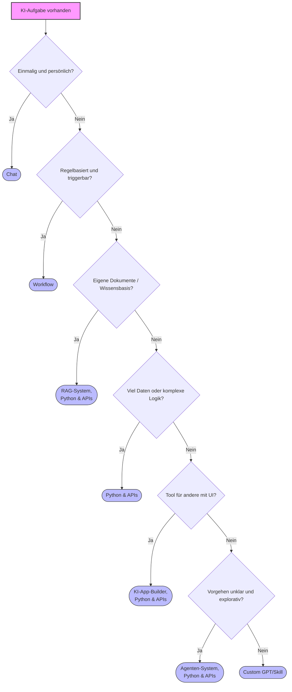

# Aufgabenklassen & Lösungswege
{: .no_toc }

> **Die Aufgabe entscheidet das Tool.**
> Erst klären, was genau du erreichen willst. Danach schauen, wie es mit Datenschutz aussieht (Cloud vs. lokal). Zum Schluss geht es um Kosten und Betrieb.

---

# Inhaltsverzeichnis
{: .no_toc .text-delta }

1. TOC
{:toc}

---

## Kernprinzip

Es gibt nicht den einen „besten“ Weg für GenAI. Je nachdem, welche Art Aufgabe du hast, passt ein anderer Ansatz: Chat, Workflows, App-Builder, Python, Agentensysteme oder lokale Modelle. Wenn man das falsche Setup wählt, wird es oft unnötig kompliziert oder es passt datenschutzseitig nicht.

**Darum lieber aufgabengetrieben entscheiden:**

- **Zuerst die Aufgabe:** Was soll am Ende konkret herauskommen?
- **Dann Datenschutz:** Cloud, self-hosted oder rein lokal?
- **Zum Schluss Betrieb:** Wer übernimmt das Setup, die Wartung und die Verantwortung?

Viele Teams starten tool-getrieben („Wir nutzen Tool X für alles.“). Das führt fast immer zu mehr Aufwand als nötig.

## Schnellentscheidung (60 Sekunden)

| Wenn die Aufgabe so aussieht                | Dann starte hier                      |
| ------------------------------------------- | ------------------------------------- |
| Einmalig, ad hoc, persönlich                | **Chat-Anwendung**                    |
| Wiederkehrender Prozess mit Triggern        | **Workflow-Automation**               |
| Sehr viele Daten oder komplexe Logik        | **Python & APIs**                     |
| Fragen über eigene Dokumente / Wissensbasis | **RAG-System**, **Python & APIs**     |
| Tool für andere Nutzer mit UI               | **KI-App-Builder**, **Python & APIs** |
| Vorgehen unklar, explorativ, mehrstufig     | **Agenten-System**, **Python & APIs** |
| Wiederkehrende persönliche Chat-Hilfe       | **Custom GPT/Skill**                  |

Im nächsten Schritt immer kurz gegenchecken: **Cloud vs. lokal**.

## Entscheidungslogik im Detail

### 1) Aufgabentyp (Primärkriterium)

Je nachdem, welche Aufgabe du hast, ergibt sich oft der passende Lösungsweg bereits:

- **Einmalige Wissens- oder Schreibaufgabe:** Chat
- **Prozessautomatisierung mit klaren Regeln:** Workflow
- **Datenintensive oder algorithmische Aufgabe:** Python
- **Semantische Suche in eigenen Dokumenten/Daten:** RAG-System, Python & APIs
- **Nutzerprodukt mit Frontend:** App-Builder, Python & APIs
- **Offene Problemstellung mit Tool-Nutzung:** Agenten, Python & APIs
- **Persönliche Standardaufgabe im Chat:** Custom GPT/Skill

### 2) Datenschutz (Sekundärkriterium)

Wenn der Aufgabentyp klar ist, kommt die Betriebsform:

- **Unkritische Daten:** Cloud geht meist schneller
- **Kritische Daten:** self-hosted oder lokal bevorzugen

Typisch kritisch sind z. B. Gesundheitsdaten, Mandatsdaten, Personalakten, vertrauliche Unternehmensinformationen.

### 3) Wirtschaftlichkeit und Betrieb

Zum Abschluss geht es um die Rahmenbedingungen:

- **Budget:** Abo, API-Kosten, Hosting, Betrieb
- **Know-how:** was im Team vorhanden ist
- **Skalierung:** Datenvolumen, Nutzerzahl, Lastspitzen
- **Wartung:** Updates, Monitoring, Incident-Prozesse

## Die Lösungswege

### 1. Chat-Anwendungen (z. B. ChatGPT, Claude, Copilot)

**Geeignet für**

- schnelle Einzelaufgaben
- Ideenfindung, Formulierungen, Erklärungen

**Vorteile**

- sofort nutzbar
- schneller Einstieg

**Grenzen**

- wenig Automatisierung im Hintergrund
- oft bleibt manuelle Nacharbeit nötig

**Deployment**

| Datenschutz | Variante |
|---|---|
| unkritisch | Cloud-Chatdienste |
| kritisch | lokale Modelle (z. B. Ollama, LM Studio) |

---

### 2. Workflow-Automation (z. B. n8n, Make)

**Geeignet für**

- wiederkehrende Prozesse mit klaren Regeln
- Trigger wie E-Mail, Webhook oder Zeitplan

**Vorteile**

- End-to-End-Prozesse schnell zusammenstellen
- viele Integrationen ohne viel Code

**Grenzen**

- komplexe Logik wird schnell unübersichtlich
- bei hoher Last können Kosten wachsen

**Deployment**

| Datenschutz | Variante |
|---|---|
| unkritisch | Cloud-Workflows |
| kritisch | self-hosted Workflow-Plattform |

---

### 3. KI-App-Builder (z. B. Dify, Langflow, Stack AI)

**Geeignet für**

- KI-Tools für Teams oder Kunden
- schneller UI-Prototyp mit Wissensbasis/RAG

**Vorteile**

- Frontend und KI-Logik lassen sich schnell kombinieren
- ideal für einen Pilotversuch

**Grenzen**

- Abhängigkeit von der jeweiligen Plattform
- weniger flexibel als eigener Code

**Deployment**

| Datenschutz | Variante |
|---|---|
| unkritisch | Cloud-App-Builder |
| kritisch | self-hosted App-Builder |

---

### 4. Python & APIs

**Geeignet für**

- große Datenmengen
- anspruchsvolle Datenverarbeitung
- tiefe Integration in bestehende Systeme

**Vorteile**

- maximale Kontrolle
- gute Skalierbarkeit und Kostensteuerung

**Grenzen**

- Entwicklungszeit und Engineering-Know-how nötig
- Betrieb und Qualitätssicherung sind Pflicht

**Deployment**

| Datenschutz | Variante |
|---|---|
| unkritisch | Cloud-LLM-APIs |
| kritisch | lokale Inferenz (z. B. mit Ollama) |

---

### 5. RAG-Systeme (z. B. ChromaDB, FAISS + LangChain)

**Geeignet für**

- Fragen über eigene Dokumente, Handbücher oder Wissensdatenbanken
- semantische Suche in strukturierten und unstrukturierten Daten

**Vorteile**

- LLM-Antworten lassen sich mit eigenen, aktuellen Daten kombinieren
- keine Neutrainierung des Modells nötig

**Grenzen**

- Qualität hängt stark von Chunking, Embedding und Retrieval ab
- Datenpflege und regelmäßige Updates der Vektordatenbank sind notwendig

**Deployment**

| Datenschutz | Variante |
|---|---|
| unkritisch | Cloud-Vektordatenbank + Cloud-LLM |
| kritisch | lokale Vektordatenbank (z. B. Chroma) + lokales Modell (z. B. Ollama) |

---

### 6. Agenten-Systeme (z. B. Claude Code, LangGraph)

**Geeignet für**

- offene, mehrstufige Aufgaben
- Recherche, Analyse und Coding mit Toolzugriff

**Vorteile**

- kann einzelne Schritte planen und eigenständig ausführen
- besonders hilfreich, wenn der Problemraum nicht von Anfang an klar ist

**Grenzen**

- vorher besser kalkulierbar sind solche Lösungen oft nicht
- Guardrails, Monitoring und Kostenkontrolle sind wichtig

**Deployment**

| Datenschutz | Variante |
|---|---|
| unkritisch | Agenten mit Cloud-Modellen |
| kritisch | Agenten + lokale Modelle / isolierte Umgebung |

---

### 7. Custom GPTs / Skills

**Geeignet für**

- wiederkehrende persönliche Aufgaben im Chat
- standardisierte Prompts und Rollen

**Vorteile**

- sehr schnell umgesetzt
- spürbarer Produktivitätsgewinn bei Routineaufgaben

**Grenzen**

- meist innerhalb der Plattformgrenzen
- keine vollwertige Prozessautomatisierung

**Deployment**

| Datenschutz | Variante |
|---|---|
| unkritisch | plattforminterne GPTs/Skills |
| kritisch | lokale Assistentenoberflächen |

## Entscheidungsbaum

Und für jeden Pfad gilt danach: **Datenschutzprüfung → Cloud, self-hosted oder lokal.**

## Praxisbeispiele (kurz)

1. **"E-Mail besser formulieren"** → Chat
2. **"Rechnungen automatisch erfassen"** → Workflow
3. **"Fragen über interne Handbücher und Richtlinien"** → RAG-System
4. **"50.000 Bewertungen auswerten"** → Python & APIs
5. **"Interner HR-Assistent mit UI"** → App-Builder
6. **"Codebasis analysieren und Refactoring-Vorschläge"** → Agenten
7. **"Persönlicher Mathe-Tutor mit festem Stil"** → Custom GPT/Skill

## Häufige Fehlentscheidungen

- **Over-Engineering:** Python, obwohl ein Chat reicht
- **Under-Engineering:** No-Code für sehr große Datenmengen
- **Tool-Verliebtheit:** Toolwahl vor Problemverständnis
- **Agenten für triviale Aufgaben:** unnötige Kosten und Komplexität
- **RAG statt Fine-Tuning verwechseln:** RAG ergänzt das Modell mit eigenen Daten zur Laufzeit — es trainiert das Modell nicht neu
- **Datenschutz zu spät:** Architektur muss später teuer umgebaut werden

## Praxisregeln

1. **Start simple, scale later:** Fang mit der einfachsten tragfähigen Lösung an.
2. **3-Mal-Regel:** Wenn eine Aufgabe mindestens dreimal manuell gemacht wird, Automatisierung prüfen.
3. **Architektur vor Toolnamen:** Erst das Muster finden, dann das passende Produkt wählen.
4. **Betriebsfähigkeit mitdenken:** Logging, Monitoring und Verantwortlichkeiten früh klären.

## Datenschutz kompakt

- Datenschutz ist nicht nur eine reine Toolfrage, sondern vor allem eine **Architekturfrage**.
- Bei personenbezogenen oder vertraulichen Daten gilt: Datenflüsse dokumentieren, Auftragsverarbeitung und Rechtsgrundlage prüfen, ggf. lokale Verarbeitung bevorzugen.
- **Wichtig:** Diese Hinweise sind technisch-praktisch und ersetzen keine Rechtsberatung.

## Kompakte Checkliste vor der Tool-Wahl

- [ ] Aufgabentyp klar?
- [ ] Datenklassifikation erfolgt?
- [ ] Cloud vs. lokal entschieden?
- [ ] Datenvolumen und Frequenz geschätzt?
- [ ] Nutzerkreis (ich, Team, Kunden) definiert?
- [ ] Betriebsmodell und Verantwortliche festgelegt?
- [ ] Budgetrahmen und Skalierungsgrenzen bekannt?
- [ ] Exit-Strategie bei Tool-Wechsel vorhanden?

## Fazit

Eine treffsichere GenAI-Umsetzung folgt meistens einer einfachen Reihenfolge:

1. **Aufgabe klassifizieren**
2. **Datenschutz und Deployment festlegen**
3. **Lösung so bauen, dass sie im Betrieb funktioniert**

So bleibt die Umsetzung fachlich passend, wirtschaftlich sinnvoll und langfristig wartbar.

---

## Abgrenzung zu verwandten Dokumenten

| Dokument | Frage |
|---|---|
| [Prompt Engineering](../05-prompting-rag/prompt-engineering.html) | Wie werden Modelle sprachlich und strukturell gesteuert? |
| [RAG-Konzepte](../05-prompting-rag/rag-konzepte.html) | Wann hilft Retrieval als Lösungsweg und wie ist eine RAG-Pipeline aufgebaut? |
| [Modell-Auswahl Guide](../04-modelle-provider/modellauswahl.html) | Welches Modell passt zur gewählten Lösung und zum Betriebsziel? |

---

**Version:**    4.0 
**Stand:** Mai 2026 
**Kurs:** Generative KI. Verstehen. Anwenden. Gestalten.