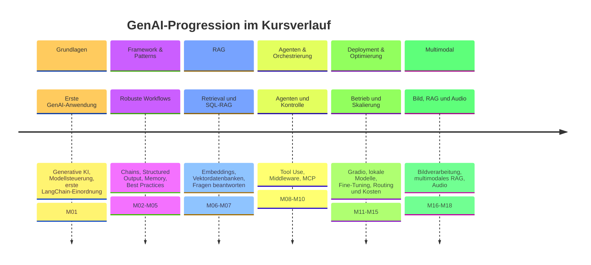

# Kursüberblick
{: .no_toc }

> **Generative KI. Verstehen. Anwenden. Gestalten.**

---

## Inhaltsverzeichnis
{: .no_toc .text-delta }

1. TOC
{:toc}

---

## Worum es in diesem Kurs geht

Der Kurs richtet sich an Einsteigerinnen und Einsteiger, die Generative KI nicht nur ausprobieren, sondern nachvollziehbar einsetzen möchten. Im Mittelpunkt stehen Sprach- und Multimodalmodelle, Prompting, LangChain, RAG, Agenten, lokale Modelle und die Frage, wann welcher Lösungsweg sinnvoll ist.

Der Fokus liegt auf praktischer Umsetzung mit Python. Theorie wird so weit erklärt, wie sie für Verständnis, Auswahl und Anwendung nötig ist.

Als durchgehender Praxisbezug dient die [Legal-RAG Leitaufgabe](./legal-rag-leitaufgabe.html). Sie zeigt schrittweise, wann Prompting reicht, wann Retrieval nötig wird und wie Quellen, Unsicherheit und Human Review in eine GenAI-Anwendung gehören.

## Zielgruppe

Der Kurs passt besonders für:

- Programmierende und Entwickelnde, die erste GenAI-Anwendungen bauen möchten
- IT-Fachkräfte, die KI-Funktionen in bestehende Projekte integrieren wollen
- technikaffine Quereinsteigerinnen und Quereinsteiger mit guten Python-Grundlagen

Hilfreich sind Grundlagen zu Datentypen, Listen, Dictionaries, Kontrollstrukturen, Funktionen und Bibliotheken.

## Was der Kurs vermittelt

Nach dem Kurs ist es möglich:

- GenAI-Anwendungsfälle realistisch einzuschätzen
- Prompts, Kontext und Modellantworten gezielt zu steuern
- einfache LLM-Anwendungen mit Python und LangChain umzusetzen
- Dokumente über RAG und Embeddings nutzbar zu machen
- multimodale Aufgaben mit Text, Bild oder Audio einzuordnen
- Modellwahl, Kosten, Datenschutz und Qualität bewusster zu bewerten

Das praktische Ergebnis ist eine wachsende Legal-RAG-Anwendung: Sie beginnt mit einfachen Prompts, nutzt später eigene Dokumente, bindet Quellen ein, macht Unsicherheiten sichtbar und wird um UI-, Modellwahl-, Kosten- und Qualitätsaspekte erweitert.

## Kursstruktur

Die Module führen von Grundbegriffen über Frameworks bis zu RAG, Multimodalität, Agenten und lokalen Modellen.

| Bereich | Inhalte |
| ------- | ------- |
| **Grundlagen** | Generative KI, Modellsteuerung, LLMs, Transformer, erste LangChain-Einordnung |
| **Framework & Patterns** | LangChain, LangGraph, Structured Output, Chat und Memory, Best Practices |
| **RAG** | Tokenizing, Chunking, Embeddings, RAG, SQL-RAG und Vektordatenbanken |
| **Agenten & Orchestrierung** | Tool Use, Agentenarchitekturen, Middleware und Model Context Protocol |
| **Deployment & Optimierung** | Gradio, lokale und Open-Source-Modelle, Fine-Tuning, Modell-Routing und Kostenauswertung |
| **Multimodal** | Bild-, Audio- und multimodale RAG-Verarbeitung |

Ergänzend geht es um Modellauswahl, Evaluation, Sicherheit, Datenschutz, Governance und Context Engineering. Wer den Kurs nur überblicken möchte, liest zuerst Kursprogression und Modulübersicht. Wer entscheiden möchte, ob der Kurs passt, beginnt mit Zielgruppe, Vorbereitung und den nächsten Schritten am Ende dieser Seite.

## Kursprogression

## Modulübersicht

Die Module sind in thematische Blöcke gegliedert:

| Modul | Block                    | Inhalt                         | Schwerpunkt                                                                         |
| :---: | ------------------------ | ------------------------------ | ----------------------------------------------------------------------------------- |
|   1   | Grundlagen               | Einführung GenAI               | Kursüberblick, OpenAI, Hugging Face und erste LangChain-Einordnung                  |
|   2   | Framework & Patterns     | LangChain 101                  | Chains, Models, Prompts, Graph-Grundlagen und Best Practices                        |
|   3   | Framework & Patterns     | LLM Text                       | Textgenerierung, Textklassifizierung, Textzusammenfassung und LangChain-Grundmuster |
|   4   | Framework & Patterns     | Structured Output              | JSON, strukturierte Ausgaben und robuste Antwortformate                             |
|   5   | Framework & Patterns     | Chat und Memory                | Kurzzeit-Memory, persistentes Memory und externe Speicher                           |
|   6   | RAG                      | Retrieval Augmented Generation | ChromaDB, Embeddings, Dokument-Q&A und Vektordatenbanken                            |
|   7   | RAG                      | SQL RAG                        | LLMs mit Datenbanken, SQL-Generierung und strukturierte Daten                       |
|   8   | Agenten & Orchestrierung | Agenten                        | Tool Use, Agentenarchitekturen, Planung und Multi-Agentensysteme                    |
|   9   | Agenten & Orchestrierung | Middleware                     | Kontrolle von Agent-Ausführungen, Freigaben, Retry und Summarization                |
|  10   | Agenten & Orchestrierung | MCP                            | Model Context Protocol und standardisierte Tool-Integration                         |
|  11   | Deployment & Optimierung | Gradio                         | UI-Entwicklung, praktische Demos und Sharing                                        |
|  12   | Deployment & Optimierung | Lokale und Open Source Modelle | Ollama, lokale Modelle, Lizenzierung und Auswahlkriterien                           |
|  13   | Deployment & Optimierung | Fine-Tuning                    | Anpassung von Modellen und Bewertung spezialisierter Varianten                      |
|  14   | Deployment & Optimierung | Modell-Router                  | Provider-Failover, LLM-Routing und Circuit Breaker                                   |
|  15   | Deployment & Optimierung | Modell-Kosten                  | Tokens, Preistabellen und Kostenauswertung über LangSmith                           |
|  16   | Multimodal               | Bild                           | Bildgenerierung, Bildklassifikation, Objekterkennung und Bildbeschreibung           |
|  17   | Multimodal               | Multimodal RAG                 | Dokumente mit Text- und Bildanteilen erschließen                                    |
|  18   | Multimodal               | Audio                          | Speech-to-Text, Text-to-Speech, Audioanalyse und Podcast-Pipelines                  |

M05 liegt im Kursmaterial in zwei Varianten vor: eine einfachere Umsetzung mit Listen und Dictionaries und eine StateGraph-Variante. Welche Variante genutzt wird, hängt vom Kursformat und vom Lerntempo ab.

| Kursblock | Ausbau an der Legal-RAG-Anwendung |
|---|---|
| **M01: Grundlagen** | Die Anwendung bekommt ein Zielbild, erste Modellaufrufe und eine realistische Einordnung von GenAI-Grenzen. |
| **M02-M05: Framework & Patterns** | LangChain, Prompts, strukturierte Antworten, Chat-Verläufe und Memory machen die Anwendung kontrollierbarer. |
| **M06-M07: RAG** | Eigene Dokumente, Embeddings, ChromaDB und SQL-Abfragen schaffen die Grundlage für quellengebundene Antworten. |
| **M08-M10: Agenten & Orchestrierung** | Tools, Agentenarchitekturen, Middleware und MCP erweitern die Anwendung um kontrollierte Handlungsschritte. |
| **M11-M15: Deployment & Optimierung** | UI, lokale Modelle, Fine-Tuning, Modellrouting und Kostenanalyse machen aus dem Notebook einen belastbareren Prototyp. |
| **M16-M18: Multimodal** | Bild-, Dokument- und Audiodaten erweitern die Legal-RAG-Idee über reinen Text hinaus. |

Einige Begriffe sind bewusst knapp gehalten. **Structured Output** meint maschinenlesbare Antwortformate wie JSON. **SQL-RAG** verbindet Modellantworten mit strukturierten Datenbankabfragen. **MCP** steht für Model Context Protocol und beschreibt eine standardisierte Tool-Integration. **Circuit Breaker** bezeichnet eine Schutzschaltung, die Abläufe bei Fehlern, Kosten- oder Qualitätsgrenzen stoppt.

Eine interaktive Orientierung zur Modellwahl ist hier hilfreich: [Modellauswahl](https://editor.p5js.org/ralf.bendig.rb/full/8BbTi8Ico).

## Vorbereitung

Für die praktischen Übungen werden typischerweise benötigt:

- ein Google-Account für Google Colab und Google Drive
- ein OpenAI-Account mit API-Key und kleinem API-Guthaben
- ein Hugging-Face-Account mit API-Key für ausgewählte Modelle oder Demos
- ein Gerät, auf dem Browser, Notebook-Umgebung und Kursmaterial zuverlässig funktionieren
- Zugriff auf die im Kurs genutzte digitale Pinnwand, zum Beispiel taskcards.de

Google Colab und Google Drive sind vor allem für den gemeinsamen Kursbetrieb praktisch. Wer lokal arbeitet, braucht stattdessen eine funktionierende Python-Umgebung mit Zugriff auf die Kursnotebooks. Der OpenAI-Account wird für die zentralen API-Übungen benötigt. Hugging Face ist für ausgewählte Modell- und Open-Source-Demos hilfreich, aber nicht in jedem Modul gleich wichtig.

Bei Business-Laptops sollte vorab geprüft werden, ob Cloud-Dienste, API-Zugriffe, GitHub, Google Colab und Hugging Face durch die IT-Richtlinien erlaubt sind.

Nützliche Einstiege:

- [OpenAI Platform](https://platform.openai.com/settings/organization/general)
- [Hugging Face](https://huggingface.co/)

## Arbeitsweise

Der Kurs lebt vom Ausprobieren. Generative KI darf und soll während der Aufgaben genutzt werden. Entscheidend ist der reflektierte Einsatz: Ergebnisse werden geprüft, verbessert und mit den technischen Grenzen der Modelle abgeglichen.

Sinnvoll ist es, eigene Fragestellungen oder Arbeitsaufgaben mitzubringen. Dadurch wird schneller sichtbar, welche Methoden in realen Situationen tragen und wo klassische Automatisierung, Datenschutz oder Evaluation wichtiger sind als ein weiterer Prompt.

## Lernen mit GenAI

Generative KI darf im Kurs als Lern- und Entwicklungshilfe eingesetzt werden. Wenn eine Aufgabe festhängt, kann ein Modell Fehlermeldungen erklären, Teilschritte vorschlagen oder Codevarianten vergleichen.

Wichtig ist die Grenze: KI ersetzt nicht das eigene Verständnis. Der Schwerpunkt bleibt darauf, GenAI-Systeme selbst zu verstehen, aufzubauen, zu prüfen und weiterzuentwickeln.

## Kompetenzillusion vermeiden

GenAI-Werkzeuge können überzeugend erklären und formulieren. Dadurch entsteht leicht der Eindruck, ein Thema sei verstanden, obwohl nur die Antwort plausibel klingt. Nachvollziehen, Testen, Vergleichen und eigenes Umsetzen gehören deshalb fest zum Kurs.

<small>KI-generiertes Bild</small>

Deshalb gehören im Kurs immer drei Prüfbewegungen dazu:

- Tool-Aufrufe und Zwischenschritte sichtbar machen,
- Quellen, State und Entscheidungen nachvollziehen,
- Ergebnisse mit Tests, Human-in-the-Loop oder Evaluation prüfen.

Konkret heißt das: Quellen anzeigen, Notebook-Ausgaben prüfen, Varianten vergleichen und bei Bedarf Kosten, Qualität oder Antwortstabilität messen.

## Aufgaben nach Vorkenntnissen und Lerntempo bearbeiten

Die Aufgaben je Modul sind in **Grundlagen**, **Aufbau** und **Vertiefung** unterteilt. Die Auswahl richtet sich nach **Vorkenntnissen** und **Lerntempo**: Grundlagen sichern das zentrale Verständnis, Aufbau-Aufgaben vertiefen die Anwendung, und Vertiefungsaufgaben bieten zusätzliche Übung, Varianten oder Transferfragen.

Einige Module enthalten außerdem den Unterabschnitt **Praxis-Transfer: Legal-RAG**. Diesen Abschnitt sollten sich möglichst alle ansehen, weil er die jeweilige Technik mit dem durchgehenden Kursprojekt verbindet.

## Zeitfenster für Aufgaben

Für Übungsaufgaben hat sich ein kurzer Arbeitsrhythmus bewährt: etwa **10 Minuten Bearbeitungszeit**, ein kurzer **Zwischenstopp** und anschließend weitere **10 Minuten oder mehr**. Die erste Phase ist lang genug für den Einstieg und kurz genug, damit Blockaden früh sichtbar werden.

Der Zwischenstopp sollte niedrigschwellig sein. Statt nur zu fragen „Gibt es Fragen?“, hilft ein aktiver Check: zum Beispiel Daumen hoch/seitlich/runter oder eine kurze Zahl im Chat für den eigenen Fortschritt.

Der Check ist **keine** harte Pflicht-Unterbrechung für alle. Wer gut im Flow ist, kann **weiterarbeiten**; wer festhängt, bekommt früh Gelegenheit zur Klärung. Bei unterschiedlichem Tempo bleibt der Takt flexibel: Schnellere bearbeiten Aufbau- oder Vertiefungsaufgaben, langsamere sichern zunächst die Grundlagen.

Auch während der Übungszeit stehen Fragen jederzeit offen. Wer lieber ungestört im eigenen Flow bleiben möchte, schaltet dafür einfach den eigenen Lautsprecher stumm.

Statt der gestellten Aufgaben lässt sich bei Bedarf auch eine eigene Problemstellung bearbeiten. Unterstützung dafür gibt es, soweit es der Rahmen zulässt.

Fehler gehören zum Lernprozess dazu und sind kein Rückschlag: Eine Fehlermeldung zeigt oft genauer, wie ein System tatsächlich funktioniert, als ein Durchlauf ohne Probleme, und trägt damit direkt zum Lernerfolg bei.

## Nächste Schritte

| Dokument | Frage |
| -------- | ----- |
| [Lohnt sich GenAI?](./lohnt-es-sich.html) | Wann ist GenAI überhaupt der passende Ansatz? |
| [Aufgaben & Lösungswege](./aufgabenklassen-und-loesungswege.html) | Welche Umsetzung passt zu welcher Aufgabe? |
| [Legal-RAG Leitaufgabe](./legal-rag-leitaufgabe.html) | Welcher Praxis-Use-Case verbindet die GenAI-Module? |
| [Large Language Models](../03-grundlagen/large-language-models.html) | Wie funktionieren LLMs, Foundation Models und Transformer? |
| [Prompt Engineering](../05-prompting-rag/prompt-engineering.html) | Wie werden Modellantworten gezielt gesteuert? |

---

**Version:** 1.1 
**Stand:** August 2026 
**Kurs:** Generative KI. Verstehen. Anwenden. Gestalten.
