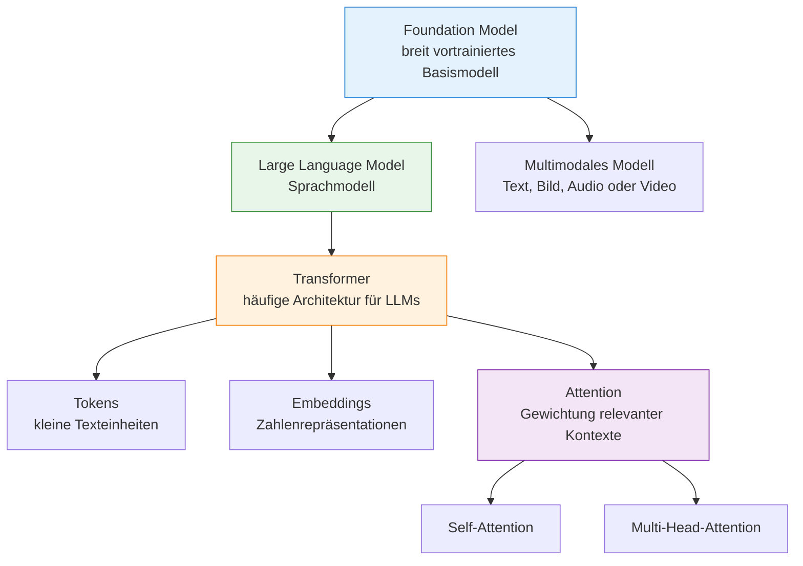
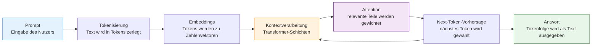

# Large Language Models
{: .no_toc }

> **Deep Dive in Large Language Models: Sprachmodelle, Transformer, Attention und moderne Varianten**

---

# Inhaltsverzeichnis
{: .no_toc .text-delta }

1. TOC
{:toc}

---

# Was ist ein Large Language Model?

Ein **Large Language Model** (LLM) ist ein großes KI-Modell, das Sprache verarbeitet und erzeugt. Es kann Fragen beantworten, Texte zusammenfassen, Code erklären, Ideen strukturieren oder Dialoge führen.

Der Name beschreibt drei Eigenschaften:

- **Large**: Das Modell hat sehr viele interne Parameter und wurde mit sehr großen Datenmengen trainiert.
- **Language**: Der wichtigste Datenraum ist Sprache, also Text, Code und zunehmend auch multimodale Inhalte wie Bilder oder Audio.
- **Model**: Es ist kein Wörterbuch und keine Datenbank, sondern ein trainiertes neuronales Netz, das Muster in Sprache gelernt hat.

Ein LLM sucht also nicht einfach eine fertige Antwort heraus. Es berechnet aus der Eingabe, dem bisherigen Gespräch und seinen gelernten Sprachmustern eine passende Fortsetzung. Einen anschaulichen Einstieg in die Bedeutung der Transformer-Architektur bietet die Financial Times mit [Generative AI exists because of the transformer](https://ig.ft.com/generative-ai/).

## Warum ist das mehr als Token für Token raten?

Die Kurzform „Ein Sprachmodell sagt das nächste Token voraus“ ist hilfreich, aber zu grob.

Moderne Sprachmodelle arbeiten mit **Tokens**. Ein Token kann ein Wort, ein Wortteil oder ein Satzzeichen sein. Beim Generieren entscheidet das Modell Schritt für Schritt, welches nächste Token wahrscheinlich und passend ist. Dabei betrachtet es aber nicht nur das letzte Token, sondern den gesamten verfügbaren Kontext.

Ein Modell berücksichtigt beim Generieren zum Beispiel:

- den Inhalt der Eingabe
- die bisherige Antwort
- grammatische Zusammenhänge
- Bedeutungsbeziehungen zwischen Begriffen
- typische Textsorten und Stile
- implizite Erwartungen aus dem Kontext

Wenn der bisherige Text lautet:

> „Ein Transformer verarbeitet Text, indem er ...“

dann sind Fortsetzungen wie „Tokens miteinander in Beziehung setzt“ viel plausibler als eine zufällige Wortfolge. Das Modell hat gelernt, dass bestimmte Konzepte, Satzstrukturen und Fachbegriffe zusammengehören.

Trotzdem kann ein Sprachmodell Unsinn erzeugen. Es hat kein menschliches Verständnis, keine eigene Erfahrung und keine automatische Wahrheitsprüfung. Es erzeugt sprachlich plausible Fortsetzungen auf Basis gelernter Muster. Deshalb können Antworten überzeugend klingen und trotzdem fachlich falsch sein.

# Foundation Models: die größere Kategorie

Ein **Foundation Model** ist ein großes Basismodell, das zunächst allgemein vortrainiert wird und danach für viele unterschiedliche Aufgaben genutzt oder angepasst werden kann.

Ein LLM kann ein Foundation Model sein, wenn es breit genug trainiert wurde, um als Grundlage für viele Anwendungen zu dienen: Chatbots, Schreibassistenten, Programmierhilfe, Recherche, Analyse oder Agentensysteme.

Der typische Weg sieht vereinfacht so aus:

| Schritt | Was passiert? | Ergebnis |
| ------- | ------------- | -------- |
| **Pretraining** | Das Modell lernt aus sehr großen Datenmengen allgemeine Muster. | Ein leistungsfähiges Basismodell |
| **Fine-Tuning** | Das Modell wird auf bestimmte Aufgaben, Daten oder Stile angepasst. | Ein spezialisierteres Modell |
| **Instruction Tuning / Alignment** | Das Modell lernt, Anweisungen hilfreicher, sicherer und dialogtauglicher zu befolgen. | Ein besser nutzbarer Assistent |
| **Inferenz** | Das fertige Modell wird mit einem Prompt verwendet. | Eine konkrete Antwort |

Wichtig ist die Unterscheidung:

- **Foundation Model** beschreibt die Rolle als breit einsetzbares Basismodell.
- **Large Language Model** beschreibt ein großes Sprachmodell.
- **Transformer** beschreibt die Architektur, auf der viele erfolgreiche LLMs beruhen.

Nicht jedes Foundation Model ist ein Sprachmodell: Es gibt auch Basismodelle für Bilder, Audio, Video oder multimodale Daten.

Die folgende Übersicht zeigt die Begriffsebenen:

# Training und Inferenz

Bei Sprachmodellen muss man zwei Phasen unterscheiden:

| Phase | Was passiert? | Ändert sich das Modell? | Beispiel |
| ----- | ------------- | ----------------------- | -------- |
| **Training** | Das Modell lernt aus großen Textmengen, welche Muster in Sprache vorkommen. Dabei werden die internen Gewichte angepasst. | Ja | Ein Modell lernt über Milliarden Beispiele, Texte fortzusetzen. |
| **Inferenz** | Das fertige Modell wird benutzt, um auf eine Eingabe eine Ausgabe zu erzeugen. | Nein | Eine Frage wird gestellt, das Modell generiert eine Antwort. |

Beim **Training** sieht das Modell sehr viele Beispiele und korrigiert seine internen Parameter immer wieder. Dieser Prozess ist rechenintensiv und braucht große Datenmengen.

Bei der **Inferenz** werden diese gelernten Parameter nur noch angewendet. Das Modell bekommt einen Prompt, verarbeitet den Kontext und erzeugt Token für Token eine Antwort. Die Gewichte des Modells bleiben dabei unverändert.

So sieht der Ablauf bei einer normalen Anfrage aus:

# Schlüsselbegriffe auf einen Blick

| Begriff | Einfache Bedeutung |
| ------- | ------------------ |
| **LLM** | Großes Sprachmodell, das Text versteht, verarbeitet und erzeugt |
| **Foundation Model** | Breit vortrainiertes Basismodell, das für viele Aufgaben genutzt oder angepasst werden kann |
| **Transformer** | Architektur, mit der viele LLMs Beziehungen zwischen Tokens berechnen |
| **Token** | Kleine Texteinheit, zum Beispiel ein Wort, Wortteil oder Satzzeichen |
| **Embedding** | Zahlenrepräsentation eines Tokens oder Textes |
| **Attention** | Mechanismus, mit dem ein Modell relevante Teile des Kontexts stärker gewichtet |
| **Prompt** | Eingabe oder Arbeitsauftrag an ein Modell |
| **Kontextfenster** | Menge an Tokens, die das Modell gleichzeitig berücksichtigen kann |
| **Memory** | Mechanismus, der Informationen über das aktuelle Kontextfenster hinaus speichert und abrufbar macht |
| **Halluzination** | Plausibel klingende, aber falsche oder unbelegte Ausgabe |

# Modellgröße, Kontextfenster und Steuerparameter

Neben der Architektur sind bei LLMs drei praktische Eigenschaften besonders wichtig:

| Eigenschaft | Bedeutung | Warum relevant? |
| ----------- | --------- | --------------- |
| **Parameterzahl** | Anzahl der gelernten Gewichte im Modell | Gibt grob Auskunft über Kapazität und Rechenaufwand, ist aber kein alleiniger Qualitätsindikator |
| **Kontextfenster** | Anzahl der Tokens, die ein Modell gleichzeitig berücksichtigen kann | Begrenzt, wie viel Prompt, Verlauf, Dokumentkontext und Ausgabe in einen Aufruf passen |
| **Sampling-Parameter** | Einstellungen wie `temperature`, `top_p` oder `top_k` | Steuern bei vielen klassischen Modellen, wie vorhersehbar oder variantenreich eine Antwort ausfällt |

Mehr Parameter können einem Modell helfen, feinere Muster zu lernen. Gleichzeitig steigen Kosten, Latenz und Hardwarebedarf. Ein kleineres, gut passendes Modell kann für eine konkrete Aufgabe besser sein als ein sehr großes Modell.

Ein großes Kontextfenster hilft bei langen Dokumenten, Dialogverläufen und RAG-Anwendungen. Es löst aber nicht alle Probleme: Wenn zu viel irrelevanter Text im Kontext steht, kann die Antwort trotzdem schlechter werden. Für Informationen, die über das Kontextfenster hinaus erhalten bleiben sollen, werden externe Memory-Systeme eingesetzt — mehr dazu im Abschnitt [Memory-Systeme](../03-grundlagen/memory-systeme.html).

Sampling-Parameter gehören eher zur praktischen Modellsteuerung als zur Architektur. Sie werden im Prompting-Bereich genauer erklärt: [Sampling-Parameter](../05-prompting-rag/sampling-parameter.html).

# Warum sind Transformer für LLMs so wichtig?

Transformer sind dafür gebaut, Beziehungen zwischen Wörtern zu berechnen — nicht sequenziell, sondern gleichzeitig und über beliebige Abstände. Warum das einen Unterschied macht, zeigt das folgende Beispiel.

# Die Grundidee
Nehmen wir den Satz: _„Der Hund bellt laut.“_

- Ein Mensch erkennt schnell: **„Hund“** ist hier das Subjekt.
- **„bellt“** ist die Handlung und wird durch **„laut“** näher beschrieben.
- **„Der“** hängt zwar grammatikalisch mit **„Hund“** zusammen, ist für die eigentliche Aussage aber weniger wichtig.

Ein Transformer arbeitet mit diesem Prinzip über **Self-Attention**: Wenn das Modell „bellt“ verarbeitet, gibt es „Hund“ und „laut“ mehr Gewicht. „Der“ wird zwar mit einbezogen, aber weniger stark.

Der Transformer lernt diese Zusammenhänge nicht per Hand, sondern über **Aufmerksamkeit**:
- Er betrachtet alle Wörter gleichzeitig
- Er berechnet, wie stark jedes Wort mit jedem anderen zusammenhängt
- Wichtige Verbindungen bekommen dabei mehr Einfluss

## Wörter werden zu Zahlen → Embedding
- Computer verstehen keine Wörter oder Tokens, sondern nur Zahlen
- Deshalb wird jedes Token in eine Liste von Zahlen umgewandelt (eine Art „Fingerabdruck“)
- Entscheidend ist: Die Darstellung hängt nicht nur vom Token selbst ab, sondern auch davon, in welchem Zusammenhang es vorkommt

## Position ist wichtig → Positional Encoding
- *Der Lehrer fragt den Schüler* bedeutet etwas anderes als *Den Lehrer fragt der Schüler*.
- Damit der Transformer diese Reihenfolge kennt, bekommt jedes Token zusätzlich eine Positions-Information

## Aufmerksamkeit berechnen → Self-Attention

Self-Attention ist ein Mechanismus, bei dem jedes Wort in einem Satz mit allen anderen Wörtern (inklusive sich selbst) verglichen wird. Aus den Ähnlichkeiten entsteht ein Signal dafür, wie stark das jeweilige andere Wort in die Darstellung einfließen soll.

**Beispiel:**
Im Satz „Der große Hund bellt laut” wird das Wort „bellt” mit allen anderen Wörtern abgeglichen:

- Mit „Hund” ist die Verbindung stark, weil der Hund die Handlung ausführt.
- „große” beschreibt den Hund und ist dadurch indirekt mit „bellt” verknüpft.
- „laut” passt direkt zur Handlung und ist deshalb besonders relevant.
- „Der” ist ein Artikel und trägt weniger inhaltliche Information zu „bellt” bei.

So erkennt das Modell, welche Wörter bei „bellt“ wichtig sind, und baut daraus eine kontextabhängige Darstellung, die den Satz besser abbildet.

Damit diese Aufmerksamkeit nicht nur „irgendwie“ berechnet wird, nutzt der Transformer pro Token drei gelernte Perspektiven: **Query**, **Key** und **Value**.

- „Was suche ich?” → **Query**
- „Was biete ich an?” → **Key**
- „Was ist mein Inhalt?” → **Value**

Eine Suchmaschine ist eine hilfreiche Analogie: Eine Suchanfrage passt besonders gut zu bestimmten Dokumenten, weil deren Inhalte relevante Signale enthalten. Ähnlich vergleicht der Transformer eine Query mit vielen Keys. Wenn die Übereinstimmung hoch ist, fließt der zugehörige Value stärker in die neue Darstellung ein.

Technisch sind Query, Key und Value keine bewusst formulierten Fragen, sondern gelernte Zahlenvektoren. Das Modell erzeugt sie aus den Embeddings und berechnet dann, welche Query gut zu welchen Keys passt. Die passenden Values bekommen mehr Gewicht.

**Beispiel mit dem Satz:** *„Der große Hund bellte laut.“*

Das Token „bellte“ sucht sinngemäß nach Informationen, die zur Handlung passen. Das Token „Hund“ bietet ein starkes Signal, weil es der Handelnde im Satz ist. Deshalb bekommt „Hund“ für die Darstellung von „bellte“ mehr Gewicht als der Artikel „Der“.

**Ergebnis**: Der Transformer erkennt die enge Verbindung zwischen „Hund“ und „bellte“ und bildet ab: „Der Hund führt die Handlung des Bellens aus.“

<small>KI-generiertes Bild</small>

Das läuft parallel für alle Wörter ab – dadurch sieht das Modell die wichtigsten Beziehungen im Satz.

## Mehrere *Köpfe* gleichzeitig → Multi-Head-Attention

**Multi-Head-Attention** heißt: Der Transformer führt mehrere Self-Attention-Berechnungen gleichzeitig durch – mit unterschiedlichen Blickwinkeln (den sogenannten **Heads**).

Statt nur eine einzige Sicht darauf zu berechnen, wie „bellt“ mit anderen Wörtern zusammenhängt, erstellt das Modell mehrere Perspektiven. Jeder Head bekommt eigene Query-, Key- und Value-Vektoren und fokussiert auf etwas anderes.

**Beispiel mit 3 Attention-Heads:**

| Head | Möglicher Fokus                                 |
| ---- | ----------------------------------------------- |
| 1    | **Wer tut etwas?** – Beziehung zu „Hund“        |
| 2    | **Wie wird etwas getan?** – Beziehung zu „laut“ |
| 3    | **Grammatikalische Struktur** – z. B. Artikel   |

Jeder Head berechnet eigene Attention-Gewichte und erzeugt eine eigene neue Repräsentation für „bellt“.
Danach werden die Ergebnisse zusammengeführt (konkatenieren und lineare Transformation), damit am Ende eine reichhaltigere Darstellung entsteht.

**Warum das sinnvoll ist?**

Ein einzelner Attention-Mechanismus kann nur eine begrenzte Art von Beziehung richtig stark machen. Mit **Multi-Head-Attention** lernt das Modell:

- verschiedene semantische Beziehungen parallel zu erkennen
- Kontexte und Nuancen besser zu verarbeiten
- den Satzaufbau feiner zu erfassen

**Wie funktioniert das technisch?**

<small>KI-generiertes Bild</small>

## In die Zukunft schauen verboten → Masked-Self-Attention

**Problem beim Text-Generieren:**

Beim Generieren von Text passiert Folgendes: Das Modell erzeugt **Token für Token**. Dabei darf es bei der nächsten Vorhersage nur auf das schauen, was schon genannt wurde – **nicht** auf Tokens, die erst in Zukunft kommen.

**Ohne Maske (normale Self-Attention):**

Das Modell würde bei der Vorhersage von Token _n+1_ schon sehen, was bei _n+2_ oder _n+3_ kommt. Das wäre kein echtes Raten, sondern „Ablesen“ aus dem, was ohnehin schon bekannt ist.

**Mit Masked Self-Attention:**

Das Modell wird gezwungen, **zukünftige Positionen auszublenden**. So darf es bei einer Vorhersage nur den bisherigen Kontext verwenden.

**Masked Self-Attention** ist wichtig, damit ein Sprachmodell wirklich Schritt für Schritt Text erzeugt, ohne sich zukünftige Wörter vorweg „anzusehen“. Es entspricht damit eher dem echten Schreibprozess: Bekannt ist nur das, was bisher schon steht.

Das gilt nicht nur bei der Inferenz, sondern auch beim Training autoregressiver Sprachmodelle: Das Modell übt, aus den bisherigen Tokens das nächste Token vorherzusagen. Die Maske verhindert dabei, dass es die Lösung aus späteren Positionen direkt sehen kann.

<small>KI-generiertes Bild</small>

# Drei Haupttypen von Transformern

Eine interaktive Darstellung ist hier verfügbar: [Transformer](https://editor.p5js.org/ralf.bendig.rb/full/I1TTpJk-D).

## Verstehen - Encoder-Only (wie BERT)

**Fachbegriff**: Bidirectional Encoder Representations
- Liest den ganzen Text und versteht ihn
- Kann Fragen zum Text beantworten
- Wie ein Leser, der wirklich alles einmal durchgeht

**Beispiel**: "In welchem Jahr wurde Einstein geboren?" → Findet die Antwort im Text

## Schreiben - Decoder-Only (wie ChatGPT)

**Fachbegriff**: Autoregressive Language Models
- Schreibt Text Token für Token
- Jedes neue Token basiert auf allen vorherigen
- Wie jemand, der eine Geschichte weiter erzählt

**Beispiel**: "Es war einmal..." → "Es war einmal ein kleiner Drache, der fliegen lernen wollte..."

Eine weitere interaktive Erklärung bietet der [Transformer Explainer](https://poloclub.github.io/transformer-explainer/).

## Übersetzen - Encoder-Decoder (wie T5)

**Fachbegriff**: Sequence-to-Sequence Models
- Liest den Input vollständig und schreibt dann den Output
- Verbindet Verstehen und Schreiben
- Wie ein Übersetzer, der erst den Text komplett erfasst und dann überträgt

**Beispiel**: "Hello world" → "Hallo Welt"

# Was Transformer von früheren Methoden unterscheidet

## Vorher (alte Methoden):
- Computer lasen Texte Schritt für Schritt von links nach rechts
- Dabei wurde es oft langsam, und der Anfang des Textes wurde leichter vergessen
- Wie jemand, der nur ein Wort nach dem anderen liest und den Rest aus den Augen verliert

## Transformer:
- Sehen alle Wörter gleichzeitig
- Verstehen Zusammenhänge auch über größere Distanzen hinweg
- Viele Teile können parallel verarbeitet werden → schneller
- Wie jemand, der den ganzen Text auf einmal erfasst

# Die Logik eines Transformers in einfachen Schritten

Ein Transformer erzeugt Text durch fünf aufeinander aufbauende Schritte:

1. **Tokens** — Der Text wird in kleine Bausteine zerlegt: Wörter, Wortteile oder Satzzeichen.
2. **Zahlen** — Jedes Token wird als Zahlenvektor dargestellt, der gelernte Bedeutung trägt (→ [Embedding](#wörter-werden-zu-zahlen--embedding)).
3. **Attention** — Jedes Token prüft, welche anderen Tokens für seine Bedeutung wichtig sind (→ [Self-Attention im Detail](#die-grundidee)).
4. **Schichten** — Mehrere Transformer-Schichten verfeinern die Beziehungen sukzessive: frühe Schichten erfassen grobe Zusammenhänge, spätere abstraktere Muster.
5. **Generieren** — Das Modell sagt das nächste passende Token voraus, hängt es an und wiederholt den Prozess Token für Token.

Kurz gesagt: Ein Transformer zerlegt Text, bildet Bedeutung als Zahlen ab, berechnet Beziehungen zwischen Tokens und sagt daraus Schritt für Schritt das nächste passende Token voraus.

# Wie unterscheidet sich das von Diffusionsmodellen?

Diffusionsmodelle funktionieren nach einem anderen Prinzip als klassische Sprach-Transformer.

Ein Transformer für Sprache erzeugt Text meist **sequenziell**: Token für Token, basierend auf dem bisherigen Kontext. Ein Diffusionsmodell lernt dagegen einen Prozess der **Rauschentfernung**.

## Grundidee von Diffusionsmodellen

Beim Training wird ein Datenbeispiel, zum Beispiel ein Bild, schrittweise verrauscht. Aus einem klaren Bild wird immer stärkeres Rauschen. Das Modell lernt anschließend den umgekehrten Prozess: Es soll aus verrauschten Daten wieder ein stimmiges Bild rekonstruieren.

Beim Generieren startet das Modell dann mit fast purem Rauschen und entfernt dieses Rauschen Schritt für Schritt. Am Ende entsteht ein neues Bild, das zu einer Vorgabe passen kann, zum Beispiel zu einem Text-Prompt.

## Der wichtigste Unterschied

| Frage | Transformer-Sprachmodell | Diffusionsmodell |
| ----- | ------------------------ | ---------------- |
| Grundprinzip | Nächstes Token vorhersagen | Rauschen schrittweise entfernen |
| Typischer Ablauf | Sequenziell: Token für Token | Iterativ: viele Verfeinerungsschritte |
| Stärken | Sprache, Kontext, Logik, Reihenfolge | Bilder, globale Konsistenz, visuelle Details |
| Typische Daten | Text und zunehmend multimodal | Vor allem Bilder, Audio, Video; experimentell auch Text |
| Beispielhafte Aufgabe | Einen Satz fortsetzen | Aus Rauschen ein Bild erzeugen |

Bei Bildern ist dieser Ansatz besonders stark, weil das Modell das gesamte Bild über viele Schritte hinweg verfeinern kann. Es muss nicht Pixel für Pixel „weiterschreiben“, sondern kann globale Formen, Farben und Details gemeinsam verbessern.

## Wichtig: Diffusion und Transformer schließen sich nicht aus

In modernen Systemen werden die Ansätze oft kombiniert. Ein Bildmodell kann zum Beispiel einen Transformer-ähnlichen Teil nutzen, um den Text-Prompt zu verstehen, und ein Diffusionsverfahren, um das Bild zu erzeugen.

Deshalb ist die einfache Abgrenzung hilfreich, aber nicht absolut:

- **Transformer** sind besonders stark darin, Beziehungen in Sequenzen zu modellieren.
- **Diffusionsmodelle** sind besonders stark darin, aus Rauschen schrittweise konsistente Daten zu erzeugen.
- **Hybride Systeme** kombinieren beide Ideen.

Für große Sprachmodelle bleibt die Transformer-Architektur derzeit die dominante Grundlage. Es gibt Varianten wie Mixture-of-Experts, effizientere Attention-Mechanismen und Forschungsansätze mit Diffusion für Text. Die meisten erfolgreichen großen Sprachmodelle basieren aber weiterhin auf Transformern oder transformer-nahen Architekturen.

# 10 Trends nach und neben dem klassischen Transformer

Nachdem die Grundidee von LLMs und Transformern klar ist, lohnt sich ein Blick auf Weiterentwicklungen. Einige Ansätze ersetzen Attention teilweise, andere erweitern Transformer oder verändern Training und Inferenz. Die folgende Übersicht ist deshalb keine reine „Rangliste der besten Architekturen“, sondern eine Einordnung wichtiger Forschungs- und Produkttrends.

**Was kommt als Nächstes?** Die KI-Forschung entwickelt sich schnell. Hier sind zehn Trends, die für LLMs und Foundation Models besonders relevant sind:

Zwei Begriffe tauchen dabei besonders häufig auf:

- **Mixture-of-Experts (MoE)** bedeutet: Das Modell besteht aus vielen spezialisierten Teilbereichen. Pro Token werden aber nur wenige davon aktiviert. So kann ein Modell sehr groß sein, ohne bei jeder Anfrage alle Parameter vollständig zu nutzen.
- **Reasoning-Modelle** investieren zur Laufzeit mehr Rechenaufwand in schwierige Aufgaben. Der Unterschied liegt also nicht nur in der Architektur, sondern auch darin, wie viel interne Arbeit vor der Antwort passiert.

## Übersicht

| Nr. | Trend | Was ist anders? | Einordnung | Beispiele/Status |
| --- | ----- | --------------- | ---------- | ---------------- |
| **1** | **State Space Models (SSM)** | Ersetzen klassische Attention teilweise oder ganz durch Zustandsmodelle mit besserer Skalierung bei langen Sequenzen. | Echte Transformer-Alternative oder Hybrid | Mamba, Mamba-2, Jamba, BlackMamba; aktiv in Forschung und Prototypen |
| **2** | **Hybride Attention-SSM-Modelle** | Kombinieren Attention mit SSM-Schichten, um lange Kontexte effizienter zu verarbeiten. | Hybrid | Jamba und verwandte Architekturen; relevant, aber noch nicht dominierend |
| **3** | **Moderne rekurrente Modelle** | Greifen ältere RNN/LSTM-Ideen neu auf, aber mit moderner Skalierung und Parallelisierung. | Alternative Architektur | xLSTM, RWKV; interessant für lange Sequenzen und effiziente Inferenz |
| **4** | **Neural Memory Architectures** | Ergänzen Modelle um explizitere Kurz- und Langzeitspeicher. | Hybrid / Forschung | Titans; Stärken bei sehr langen Kontexten und Gedächtnisaufgaben |
| **5** | **Mixture-of-Experts (MoE)** | Viele Experten sind vorhanden, aber pro Token werden nur wenige aktiviert. | Transformer-Erweiterung | DeepSeek-V3, Mixtral, Llama 4; produktiv relevant |
| **6** | **Reasoning- und Test-Time-Compute-Modelle** | Modelle nutzen zur Laufzeit mehr Rechenzeit für schwierige Aufgaben. | Inferenz- und Trainingsstrategie, meist Transformer-basiert | OpenAI o3/o4-mini, DeepSeek-R1; produktiv relevant |
| **7** | **Diffusion Language Models** | Erzeugen Text nicht nur strikt links-nach-rechts, sondern über Rauschentfernung oder parallele Token-Vorhersage. | Alternative Generierungslogik, oft mit Transformer-Komponenten | Mercury Coder; frühe kommerzielle Nutzung, noch nicht Mainstream |
| **8** | **Large Concept Models** | Arbeiten nicht nur auf Token-Ebene, sondern auf höheren semantischen Einheiten wie Satz- oder Konzeptrepräsentationen. | Forschungsrichtung | Meta/FAIR Large Concept Models; frühe Forschung |
| **9** | **Self-Adaptive Models** | Passen Teile ihres Verhaltens zur Laufzeit an eine Aufgabe an, ohne vollständiges Fine-Tuning. | Transformer-Erweiterung / Forschung | Transformer-Squared, SVF; experimentell |
| **10** | **Continuous Computation Models** | Führen interne Rechenschritte über Zeit aus und können je nach Aufgabe länger oder kürzer „weiterdenken“. | Alternative Architektur / Forschung | Continuous Thought Machines; Forschung, noch nicht LLM-Mainstream |

**Legende:**

**Einordnung:**

- **Echte Alternative**: versucht, den Transformer-Kern teilweise oder ganz zu ersetzen
- **Hybrid**: kombiniert Transformer mit anderen Mechanismen
- **Transformer-Erweiterung**: nutzt weiterhin Transformer, verändert aber Skalierung, Training oder Inferenz
- **Systemtrend**: verändert weniger das Modell selbst, sondern die Art, wie Modelle eingesetzt werden

**Entwicklungsstatus:**

- **Produktiv relevant**: wird bereits in Modellen oder Produkten genutzt
- **Experimentell**: funktionsfähige Prototypen oder erste APIs
- **Forschung**: frühe Forschungsphase, noch nicht etabliert

## Trends für 2026ff:

- **Transformer bleiben dominant**, besonders bei den leistungsstärksten LLMs.
- **MoE ist Mainstream-Skalierung**, aber kein Ersatz für Transformer.
- **SSM, xLSTM und Memory-Modelle** sind die wichtigsten Kandidaten für effizientere lange Kontexte.
- **Reasoning-Modelle** verschieben Leistung zunehmend in die Inferenzphase: mehr Rechenzeit pro schwieriger Aufgabe.
- **Diffusion und Concept Models** zeigen Alternativen zur reinen Token-für-Token-Generierung, sind aber noch nicht breit etabliert.

**Warum ist das wichtig?** Die nächsten Fortschritte entstehen wahrscheinlich nicht durch eine einzige neue Architektur, sondern durch Kombinationen: Transformer plus MoE, längere Kontexte, bessere Speichermechanismen, mehr Test-Time Compute und spezialisierte Generierungsverfahren.

---

## Abgrenzung zu verwandten Dokumenten

| Dokument                                                 | Frage                                                                                 |
| -------------------------------------------------------- | ------------------------------------------------------------------------------------- |
| [Tokenizing & Chunking](./tokenizing-chunking.html) | Wie wird Text für Modelle in verarbeitbare Einheiten zerlegt?                         |
| [Embeddings](./embeddings.html)                     | Wie wird Bedeutung als Vektor darstellbar gemacht?                                    |
| [Fine-Tuning](../04-modelle-provider/fine-tuning.html)         | Wann reicht die Grundarchitektur nicht mehr und Anpassung per Training wird relevant? |

---

**Version:** 1.3 
**Stand:** Juni 2026 
**Kurs:** Generative KI. Verstehen. Anwenden. Gestalten.
