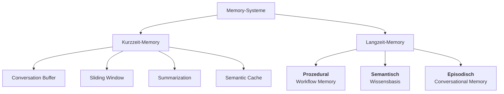
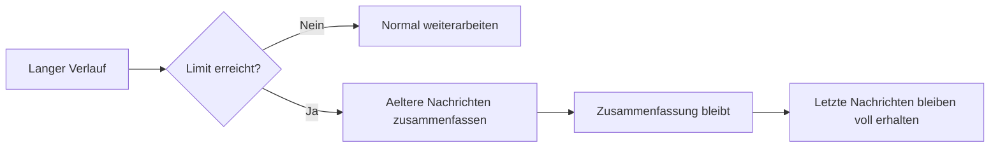

---

layout: default

title: Memory-Systeme

parent: Grundlagen

nav_order: 4
description: Kurz- und Langzeitgedaechtnis fuer GenAI-Anwendungen mit LangGraph, Vektordatenbanken und nutzerspezifischer Persistenz

has_toc: true

---


# Memory-Systeme

{: .no_toc }


> **Memory macht aus einem einmaligen Modellaufruf ein System, das Kontext behalten kann.**


---


# Inhaltsverzeichnis

{: .no_toc .text-delta }


1. TOC

{:toc}


---


## Warum Agenten überhaupt ein Gedächtnis brauchen


Ein Sprachmodell bringt kein dauerhaftes Gedächtnis mit. Ohne zusätzliche Mechanismen beginnt jede Konversation praktisch von vorn. Nutzerpräferenzen gehen verloren, frühere Entscheidungen verschwinden, und wichtige Fakten müssen immer wieder neu genannt werden. Für einfache Einmalanfragen ist das oft egal. Für mehrstufige Agenten, persönliche Assistenten oder längere Sitzungen wird es schnell zum Problem.


Memory-Systeme lösen genau diese Lücke. Sie speichern nicht nur den Gesprächsverlauf, sondern je nach Bedarf auch verdichtete Zusammenfassungen, strukturierte Entitäten oder dauerhaftes Wissen über Sitzungen hinweg. Damit entsteht ein entscheidender Unterschied zwischen einem Modellaufruf und einem wiederverwendbaren Agentensystem.


| Frage | Praxisregel |

|---|---|

| Muss der Agent sich innerhalb einer Sitzung erinnern? | Kurzzeit-Memory reicht oft aus. |

| Muss Wissen über Sitzungen hinweg erhalten bleiben? | Langzeit-Memory oder ein separater Store wird nötig. |

| Muss der Agent reproduzierbare Schritte wiederverwenden? | Workflow-Memory kann sinnvoll sein. |

| Enthält der Kontext sensible Daten? | Vor dem Speichern prüfen, begrenzen und löschbar machen. |


Typischer Fehler: Alles, was ein Agent behalten soll, einfach im Prompt zu wiederholen. Das skaliert schlecht, wird teuer und verliert bei langen Sitzungen schnell die Übersicht.


## Ein einfaches Beispiel


Ein Assistent soll sich merken, dass eine Nutzerin kurze Antworten bevorzugt, an einem Python-Kurs arbeitet und in einer späteren Sitzung nach genau diesem Thema weiterlernen will. Ohne Memory müsste diese Information jedes Mal neu genannt werden. Mit einem geeigneten Gedächtnissystem kann der Agent in der laufenden Sitzung den unmittelbaren Kontext halten und zusätzlich langfristig relevante Fakten speichern.


Dieses Beispiel zeigt bereits die wichtigste Unterscheidung: Nicht alles, was ein Agent behalten soll, gehört in dieselbe Form von Memory. Für den letzten Gesprächsverlauf braucht es etwas anderes als für dauerhafte Nutzerfakten.


## Stateless Agent vs. Memory-Augmented Agent


Ein **Stateless Agent** kann Eingaben wahrnehmen, darüber nachdenken und Ausgaben produzieren, aber er behält keine Informationen zwischen einzelnen Turns. Jede Interaktion beginnt von vorn.


Ein **Memory-Augmented Agent** ergänzt diese Fähigkeiten um eine externe Speicherkomponente. Frühere Interaktionen, Fakten und Prozessschritte bleiben erhalten und können in späteren Turns genutzt werden.


| Eigenschaft | Stateless Agent | Memory-Augmented Agent |

|---|---|---|

| Long-Horizon-Aufgaben | nicht möglich | möglich |

| Kontextkontinuität | endet mit dem Turn | sitzungs- oder nutzerübergreifend |

| Anpassungsfähigkeit | keine | wächst mit relevanten Interaktionen |

| Operationskosten | oft hoch, weil Kontext wiederholt werden muss | niedriger, wenn nur relevanter Kontext geladen wird |

| Zuverlässigkeit bei mehrstufigen Abläufen | gering | höher, wenn State und Memory sauber getrennt sind |


Typischer Fehler: Stateless-Verhalten wird als Modellschwäche fehlgedeutet. Das Modell ist nicht "vergesslich"; es fehlt die persistente Speicherschicht.


## Zwei Grundformen von Memory


Für Entwickler ist die Trennung zwischen Kurzzeit- und Langzeit-Memory zentral. Kurzzeit-Memory hält fest, was in der aktuellen Sitzung gerade relevant ist. Langzeit-Memory bewahrt Informationen über das Ende einer einzelnen Sitzung hinaus auf.





**Kurzzeit-Memory** ist fast immer nötig, weil ein Agent sonst schon innerhalb einer Sitzung den roten Faden verliert. **Semantic Cache** ist eine ergänzende Kurzzeit-Strategie: Ähnliche Anfragen werden auf gecachte Einträge abgebildet, sodass identische oder semantisch nahestehende Fragen ohne erneuten Modellaufruf beantwortet werden können.


Für **Langzeit-Memory** haben sich drei Hauptkategorien etabliert: **Prozedural** speichert ausgeführte Schrittsequenzen, **Semantisch** hält domänenspezifisches Wissen für Ähnlichkeitssuche vor, und **Episodisch** bewahrt die zeitlich geordnete Interaktionshistorie.


| Memory-Form | Zweck | Typischer Speicherort | Hauptrisiko |

|---|---|---|---|

| Conversation Buffer | letzte Nachrichten vollständig halten | Graph-State / Checkpoint | wächst unkontrolliert |

| Sliding Window | nur jüngste Nachrichten nutzen | aktiver Modellkontext | frühe wichtige Fakten gehen verloren |

| Summarization | ältere Inhalte verdichten | State oder separater Summary-Eintrag | Informationsverlust |

| Semantic Memory | Fakten semantisch wiederfinden | Store oder Vektordatenbank | irrelevante oder sensible Fakten werden gespeichert |

| Workflow Memory | wiederholbare Schrittfolgen bewahren | strukturierter Store | alte Workflows werden unkritisch wiederverwendet |


## Conversation Buffer: der einfachste Einstieg


Der einfachste Ansatz besteht darin, alle Nachrichten im State zu behalten. In LangGraph ist das besonders naheliegend, weil der Verlauf direkt Teil des States sein kann. Für kurze Konversationen ist dieser Ansatz didaktisch ideal, weil er kaum zusätzliche Infrastruktur braucht.


```text

Pseudo-Code, nicht als Python ausführen:


bei neuer Nutzernachricht:

    Nachricht an Sitzungsverlauf anhängen

    bisherigen Verlauf an das Modell geben

    Modellantwort an Sitzungsverlauf anhängen

    aktualisierten Verlauf speichern

```


| Aspekt | Einordnung |

|---|---|

| Zweck | vollständiger Gesprächsverlauf in der aktuellen Sitzung |

| Geeignet für | kurze Chats, erste Agenten, Demonstrationen |

| Nicht geeignet für | lange Sitzungen, viele Nutzer, sensible Inhalte ohne Löschkonzept |

| Praxisregel | als Einstieg nutzen, aber früh ein Limit oder eine Verdichtungsstrategie planen |


Grenze: Der Verlauf wächst mit jeder Nachricht. Dadurch steigen Tokenverbrauch, Kosten und die Gefahr, dass das Kontextfenster überschritten wird.


## Sliding Window: wenn nur das Jüngste wichtig ist


Beim Sliding Window werden nur die letzten Nachrichten im aktiven Kontext behalten. Ältere Inhalte fallen aus dem direkten Arbeitsgedächtnis heraus. Diese Strategie ist einfach, günstig und für viele Chats ausreichend, solange frühe Informationen nicht dauerhaft relevant bleiben.


```text

Pseudo-Code, nicht als Python ausführen:


bei neuer Anfrage:

    vollständigen Verlauf im Speicher behalten

    für den Modellaufruf nur die letzten relevanten Nachrichten auswählen

    Antwort erzeugen

    neue Nachricht und Antwort wieder im Verlauf speichern

```


| Aspekt | Einordnung |

|---|---|

| Zweck | Tokenverbrauch begrenzen |

| Geeignet für | Support-Dialoge, kurze Frage-Antwort-Folgen, zustandsarme Chats |

| Nicht geeignet für | langfristige Präferenzen, Projektziele, offene Aufgaben |

| Praxisregel | nur verwenden, wenn ältere Nachrichten wirklich entbehrlich sind |


Nicht geeignet, wenn frühe Informationen später wieder wichtig werden, etwa Nutzerpräferenzen, offene Aufgaben oder definierte Projektziele.


## Summarization: wenn Kontext erhalten bleiben soll


Statt alte Nachrichten vollständig zu verwerfen, kann ein Agent sie zusammenfassen. Dadurch bleibt die inhaltliche Linie erhalten, ohne dass jede einzelne Nachricht im Modellkontext liegen muss. Genau hier beginnt Summarization Memory.


```text

Pseudo-Code, nicht als Python ausführen:


wenn Verlauf zu lang wird:

    ältere Nachrichten auswählen

    bestehende Zusammenfassung laden

    ältere Nachrichten in die Zusammenfassung einarbeiten

    alte Detailnachrichten aus dem aktiven Kontext entfernen

    Zusammenfassung plus letzte Nachrichten weiterverwenden

```





| Aspekt | Einordnung |

|---|---|

| Zweck | Gesprächsverlauf verdichten |

| Geeignet für | längere Sitzungen, Lernassistenten, Projektbegleitung |

| Nicht geeignet für | Kontexte, in denen Details exakt erhalten bleiben müssen |

| Praxisregel | Zusammenfassungen als Hilfskontext behandeln, nicht als Audit-Quelle |


In der Praxis relevant, wenn Sitzungen lang werden, aber der frühere Verlauf nicht vollständig verloren gehen darf.


## Context Compaction: Kontext auslagern statt verdichten


Summarization ist eine **lossy**-Technik: Beim Verdichten geht immer ein Teil der Information verloren. **Context Compaction** ist die verlustärmere Alternative: Der Kontext wird vollständig in eine Datenbank oder Datei ausgelagert. Im aktiven Kontext bleibt nur eine ID mit kurzer Beschreibung. Der Agent kann den vollständigen Inhalt bei Bedarf wieder abrufen.


```text

Pseudo-Code, nicht als Python ausführen:


wenn Kontext zu groß, aber wichtig ist:

    vollständigen Kontext in dauerhaftem Speicher ablegen

    eindeutige ID erzeugen

    kurze Beschreibung im aktiven Kontext behalten


wenn Details später gebraucht werden:

    ID verwenden

    vollständigen Kontext aus dem Speicher laden

```


| | Context Summarization | Context Compaction |

|---|---|---|

| Verfahren | Kontext durch LLM verdichten | Kontext vollständig auslagern |

| Informationsverlust | unvermeidlich | vermeidbar, wenn Original erhalten bleibt |

| Wiederherstellung | nicht vollständig möglich | via ID und Store-Abfrage |

| Wann sinnvoll | ältere, weniger kritische Inhalte | Details, Debugging, Audit, Projektverlauf |


In der Praxis relevant, wenn der Kontext kritische Details enthält, die bei Summarization verloren gehen würden, oder wenn der vollständige Verlauf später für Fehlersuche oder Nachvollziehbarkeit benötigt wird.


## Langzeit-Memory: wenn Wissen Sitzungen überleben soll


Langzeit-Memory wird nötig, sobald relevante Informationen nach Ende einer Sitzung noch verfügbar sein sollen. Dazu gehören Nutzerpräferenzen, Ziele, wichtige Fakten oder Wissen, das später semantisch wiedergefunden werden soll.


Ein typischer technischer Weg ist semantisches Memory über einen Store oder eine Vektordatenbank. Gespeicherte Fakten werden eingebettet und bei Bedarf per Ähnlichkeitssuche wieder abgerufen.


```text

Pseudo-Code, nicht als Python ausführen:


bei neuer Information:

    prüfen, ob sie langfristig relevant ist

    prüfen, ob sie gespeichert werden darf

    Information mit Nutzer-, Projekt- oder Organisationsbezug speichern


bei neuer Anfrage:

    passende Memory-Einträge suchen

    relevante Treffer in den Kontext einfügen

    irrelevante Treffer verwerfen

```


| Aspekt | Einordnung |

|---|---|

| Zweck | sitzungsübergreifendes Wissen verfügbar machen |

| Geeignet für | Präferenzen, Projektkontext, wiederkehrende Aufgaben, Wissensbasen |

| Nicht geeignet für | unklare Rohdaten, kurzlebige Floskeln, ungeprüfte PII |

| Praxisregel | nur relevante, freigegebene und löschbare Informationen speichern |


Der Vorteil liegt darin, dass nicht nur exakte Schlüssel gesucht werden, sondern inhaltlich ähnliche Informationen wieder auftauchen können. Das passt gut zu Präferenzen, Erfahrungswissen oder thematischen Fakten.


## Entity Memory: wenn Informationen strukturiert bleiben sollen


Manche Informationen sollen nicht nur auffindbar, sondern geordnet gespeichert werden. Genau dafür eignet sich Entity Memory. Personen, Projekte oder Orte werden als benannte Entitäten im State oder in einem Store abgelegt. Das ist besonders nützlich, wenn ein Agent mit Kundendaten, Projektnamen oder festen Objekten arbeitet.


```text

Pseudo-Code, nicht als Python ausführen:


bei neuer Aussage:

    wichtige Entitäten erkennen

    bestehende Einträge zu diesen Entitäten laden

    neue Eigenschaften ergänzen oder veraltete ersetzen

    Quelle und Zeitpunkt speichern

```


| Aspekt | Einordnung |

|---|---|

| Zweck | benannte Objekte und ihre Eigenschaften stabil halten |

| Geeignet für | Personen, Organisationen, Projekte, Orte, Produkte |

| Nicht geeignet für | freie Notizen ohne klare Struktur |

| Praxisregel | Entitäten mit eindeutigen IDs, Quellen und Aktualisierungsregeln speichern |


Typischer Fehler: Alle Fakten unstrukturiert in eine Vektordatenbank zu schreiben, obwohl bestimmte Informationen besser als klar benannte Entitäten gepflegt würden.


## Workflow Memory: Prozeduralwissen speichern


Workflow Memory speichert die geordnete Sequenz von Schritten, die ein Agent zur Lösung einer Aufgabe durchgeführt hat, inklusive Werkzeugaufrufe, Parameter und Zwischenergebnisse. Bei ähnlichen Aufgaben kann der Agent diese Sequenz per Suche wiederfinden und als Vorlage nutzen, statt den Lösungsweg neu zu planen.


| Aspekt | Einordnung |

|---|---|

| Zweck | erfolgreiche Schrittfolgen wiederverwendbar machen |

| Geeignet für | wiederkehrende Tool-Sequenzen, Rechercheabläufe, Datenpipelines |

| Nicht geeignet für | einmalige Aufgaben oder stark kontextabhängige Entscheidungen |

| Praxisregel | Workflows nur mit Ergebnisstatus, Parametern und Grenzen speichern |


Typischer Fehler: Nur Konversationen zu speichern, aber ausgeführte Prozessschritte zu verwerfen. Gerade bei mehrstufigen Tool-Sequenzen ist genau dieser Ablauf das wertvollste wiederverwendbare Wissen.


## Per-User Memory: wenn mehrere Nutzer getrennt bleiben müssen


Sobald ein Agent von mehreren Nutzern verwendet wird, reicht ein globales Gedächtnis nicht mehr aus. Sitzungen und langfristige Fakten müssen nutzerspezifisch getrennt bleiben. Checkpointing mit Thread-IDs ist dafür nur ein Teil der Lösung: Es trennt Sitzungen, ersetzt aber keinen dauerhaften Store für nutzerspezifische Fakten.


```text

Pseudo-Code, nicht als Python ausführen:


bei jeder Anfrage:

    thread_id für die aktuelle Sitzung bestimmen

    user_id für nutzerspezifische Fakten bestimmen

    project_id für projektbezogenes Wissen bestimmen

    nur Memory laden, das zu diesen IDs passt

```


| Ebene | Zweck | Typischer Schlüssel |

|---|---|---|

| Thread / Session | laufende Konversation fortsetzen | `thread_id` |

| Nutzerprofil | Präferenzen und stabile Fakten speichern | `user_id` |

| Projektkontext | Wissen zu einem Arbeitsbereich bündeln | `project_id` |

| Organisation | globale Regeln und Policies bereitstellen | `org_id` |


Wenn ein Nutzer über mehrere Sitzungen hinweg erinnert werden soll, reicht eine Thread-ID allein nicht aus. Dann braucht es zusätzlich einen Store für nutzerspezifische Fakten, der unabhängig von einzelnen Sessions existiert.


## Warum gute Systeme mehrere Memory-Formen kombinieren


In realen Agenten wird Memory selten nur in einer Form eingesetzt. Ein System kann die letzten Nachrichten im State halten, ältere Teile zusammenfassen, Nutzerfakten in einem Store speichern und zusätzlich strukturierte Entitäten pflegen.


| Information | Passende Memory-Form | Warum |

|---|---|---|

| letzte Nutzerfrage | Conversation Buffer | unmittelbar relevant |

| längerer bisheriger Verlauf | Summarization oder Compaction | Kontext bleibt handhabbar |

| Nutzer bevorzugt kurze Antworten | Langzeit-Memory | sitzungsübergreifend relevant |

| Projektname und Ansprechpartner | Entity Memory | strukturiert und eindeutig |

| erfolgreiche Recherchefolge | Workflow Memory | wiederverwendbarer Ablauf |


Genau darin liegt die eigentliche Architekturentscheidung: Nicht *ob* Memory eingesetzt wird, sondern *welche Form* von Memory für welche Information passend ist.


## Agent Memory Core und Memory Manager


**Agent Memory Core** bezeichnet die Datenbank oder den Store als primäre Infrastruktur des Agentensystems. Dort laufen die wichtigsten Datenbewegungen zusammen: Speichern, Abrufen, Aktualisieren und Löschen relevanter Memory-Einträge.


**Memory Manager** ist die Abstraktionsschicht über diesem Store. Statt direkt auf Tabellen oder Collections zuzugreifen, nutzt der Agent standardisierte Lese- und Schreiboperationen.


| Operation | Zweck | Kontrollfrage |

|---|---|---|

| Speichern | neue relevante Information persistieren | Ist diese Information dauerhaft nützlich? |

| Abrufen | passende Informationen in den Kontext holen | Ist der Treffer wirklich relevant? |

| Aktualisieren | veraltete Fakten ersetzen | Gibt es eine Quelle oder einen Zeitstempel? |

| Löschen | Memory begrenzen und Rechte umsetzen | Kann der Nutzer das Entfernen verlangen? |


Die Vorteile dieser Abstraktion: Der Agent kennt keine Datenbanktabellen, nur Operationstypen. Das Speicher-Backend kann ausgetauscht werden, ohne den Agenten zu ändern. Alle Zugriffe sind an einer Stelle testbar und überwachbar.


Typischer Fehler: Den Memory Manager einzuführen, bevor klar ist, welche Memory-Typen tatsächlich gebraucht werden. Wer alle Tabellen anlegt, obwohl der Agent nur Konversationshistorie braucht, schafft unnötige Infrastruktur und verdeckt die eigentlichen Engpässe.


## 3-Schicht-Speicher: Memory für Produktionssysteme


In einfachen Agenten wird alles im aktiven Kontext gehalten. In langen Sitzungen oder komplexen Systemen führt das zwangsläufig zu Kontextüberlastung. Produktionssysteme verwenden deshalb oft einen gestuften Speicher mit drei Schichten.


| Schicht | Inhalt | Zugriff |

|---|---|---|

| Kompakter Index | Zusammenfassungen, aktive Ziele, häufig benötigte Fakten | fast immer im Kontext |

| On-Demand-Wissen | themenspezifische Dateien, Projektwissen, Detailnotizen | nur bei Bedarf |

| Archiv | vollständige Transkripte, Rohdaten, historische Informationen | selten, für Audit oder tiefe Recherche |


Der entscheidende Vorteil: Statt sehr viele Token auf einmal zu laden, ruft der Agent gezielt das ab, was gerade relevant ist. Das verhindert Kontextüberlastung und hält die Kosten stabil.


In der Praxis relevant, wenn Sitzungen viele Iterationen umfassen, das System mit mehreren Projekten arbeitet oder Wissen über lange Zeiträume erhalten bleiben soll.


## Was in der Praxis schnell schiefgeht


Viele Systeme speichern zu viel, zu wahllos oder zu unsauber getrennt. Kurze Floskeln gehören selten in ein dauerhaftes Gedächtnis. Sensible personenbezogene Daten sollten nicht unreflektiert in Vektordatenbanken landen. Ebenso problematisch ist es, Memory ohne Löschstrategie aufzubauen.


Typischer Fehler: Aktiver Aufgabenstatus und Gesprächsverlauf werden im selben Kontext gemischt. Wenn der laufende Arbeitsstand eines mehrstufigen Prozesses und die bisherigen Nutzer-Nachrichten im selben Speicher landen, beginnt das Modell beides gleichwertig zu behandeln. Ältere Gesprächsinhalte können dann die aktuelle Aufgabenlogik überlagern.


| Empfehlung | Warum sie wichtig ist |

|---|---|

| Keine PII unkritisch einbetten | Embeddings sind kein Freifahrtschein für sensible Daten |

| Lösch- und Ablaufregeln definieren | Gedächtnis darf nicht unkontrolliert wachsen |

| Nutzerkontrolle anbieten | rechtliche und organisatorische Nachvollziehbarkeit |

| Relevanz vor dem Speichern prüfen | sonst füllt sich das Memory mit Ballast |

| State und Verlauf trennen | Aufgabenlogik wird nicht von altem Chattext überlagert |


## Was für Entwickler zuerst wichtig ist


Für einen ersten Agenten reicht meist ein einfaches Schema: Kurzzeit-Memory im State, bei längeren Gesprächen optional eine Zusammenfassung und nur dann Langzeit-Memory, wenn echte Personalisierung oder sitzungsübergreifendes Erinnern gebraucht wird. Damit bleibt die Architektur verständlich und trotzdem praxisnah.


Developer unterschätzen oft, dass Memory nicht nur eine Komfortfunktion ist. Ohne Gedächtnis werden viele scheinbar intelligente Agenten schon nach wenigen Nachrichten brüchig oder müssen dieselben Informationen immer wieder neu erfragen.


## Abgrenzung zu verwandten Dokumenten


| Dokument | Frage |

|---|---|

| [State Management](../09-agentische-systeme/state-management.html) | Wie sind Nachrichten, Variablen und andere Zustandsdaten im Graph organisiert? |

| [LangGraph Einsteiger](../06-frameworks/einsteiger-langgraph.html) | Wie werden State und Wiederaufnahme in Workflows technisch umgesetzt? |

| [Human-in-the-Loop](../09-agentische-systeme/human-in-the-loop.html) | Wie wirkt sich gespeicherter Kontext auf Unterbrechung und Freigabe aus? |


---


**Version:** 1.5<br>

**Stand:** Mai 2026<br>

**Kurs:** Generative KI. Verstehen. Anwenden. Gestalten.

