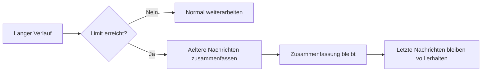
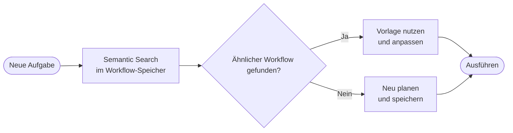

---

layout: default

title: Memory-Systeme

parent: Grundlagen

nav_order: 4
description: Kurz- und Langzeitgedaechtnis fuer GenAI-Anwendungen mit LangGraph, Vektordatenbanken und nutzerspezifischer Persistenz

has_toc: true

---


# Memory-Systeme
{: .no_toc }

> **Memory macht aus einem einmaligen Modellaufruf ein System, das Kontext behalten kann.**


---

# Inhaltsverzeichnis
{: .no_toc .text-delta }

1. TOC
{:toc}


---


## Warum GenAI-Anwendungen ein Gedächtnis brauchen


Ein Sprachmodell bringt kein dauerhaftes Gedächtnis mit. Ohne zusätzliche Mechanismen beginnt jede Konversation praktisch von vorn. Nutzerpräferenzen gehen verloren, frühere Entscheidungen verschwinden, und wichtige Fakten müssen immer wieder neu genannt werden. Für einfache Einmalanfragen ist das oft egal. Für Chatbots, Agenten oder persönliche Assistenten wird es schnell zum Problem.


Memory-Systeme lösen genau diese Lücke. Je nach Bedarf speichern sie Gesprächsverläufe, verdichtete Zusammenfassungen, strukturierte Entitäten oder dauerhaftes Wissen über Sitzungen hinweg. Der Unterschied zu einem einfachen Modellaufruf: Das System erinnert sich.


| **Frage** | **Praxisregel** |
| :--- | :--- |
| Muss die Anwendung sich innerhalb einer Sitzung erinnern? | **Kurzzeit-Memory** reicht oft aus. |
| Muss Wissen über Sitzungen hinweg erhalten bleiben? | **Persistentes Memory** oder ein separater Store wird nötig. |
| Müssen reproduzierbare Schritte wiederverwendet werden? | **Workflow-Memory** kann sinnvoll sein. |
| Enthält der Kontext sensible Daten? | Vor dem Speichern **prüfen, begrenzen** und löschbar machen. |


Typischer Fehler: Alles, was ein System behalten soll, einfach im Prompt zu wiederholen. Das skaliert schlecht, wird teuer und verliert bei langen Sitzungen schnell die Übersicht.


## Ein einfaches Beispiel


Ein Assistent soll sich merken, dass eine Nutzerin kurze Antworten bevorzugt, an einem Python-Kurs arbeitet und in einer späteren Sitzung nach genau diesem Thema weiterlernen will. Ohne Memory müsste diese Information jedes Mal neu genannt werden. Mit einem geeigneten Gedächtnissystem kann die Anwendung in der laufenden Sitzung den unmittelbaren Kontext halten und zusätzlich langfristig relevante Fakten speichern.


Dieses Beispiel zeigt bereits die wichtigste Unterscheidung: Nicht alles, was ein System behalten soll, gehört in dieselbe Form von Memory. Für den letzten Gesprächsverlauf braucht es etwas anderes als für dauerhafte Nutzerfakten.


## Stateless Application vs. Memory-Augmented System


Eine **Stateless Application** kann Eingaben wahrnehmen, darüber nachdenken und Ausgaben produzieren, aber sie behält keine Informationen zwischen einzelnen Turns. Jede Interaktion beginnt von vorn.


Ein **Memory-Augmented System** (wie ein fortgeschrittener Agent oder Chatbot) ergänzt diese Fähigkeiten um eine externe Speicherkomponente. Frühere Interaktionen, Fakten und Prozessschritte bleiben erhalten und können in späteren Turns genutzt werden.


| Eigenschaft | Stateless System | Memory-Augmented System |
| :--- | :--- | :--- |
| Long-Horizon-Aufgaben | nicht möglich | möglich |
| Kontextkontinuität | endet mit dem Turn | sitzungs- oder nutzerübergreifend |
| Anpassungsfähigkeit | keine | wächst mit relevanten Interaktionen |
| Operationskosten | oft hoch, weil Kontext wiederholt werden muss | niedriger, wenn nur relevanter Kontext geladen wird |
| Zuverlässigkeit bei mehrstufigen Abläufen | gering | höher, wenn State und Memory sauber getrennt sind |


Typischer Fehler: Stateless-Verhalten wird als Modellschwäche fehlgedeutet. Das Modell ist nicht "vergesslich"; es fehlt die persistente Speicherschicht.


## Zwei Grundformen von Memory


Für Entwickler ist die Trennung zwischen Kurzzeit-Memory und persistentem Memory zentral. Kurzzeit-Memory hält fest, was in der aktuellen Sitzung gerade relevant ist. Persistentes Memory bewahrt Informationen über das Ende einer einzelnen Sitzung hinaus auf.


**Kurzzeit-Memory** ist fast immer nötig, weil ein System sonst schon innerhalb einer Sitzung den roten Faden verliert. **Semantic Cache** ist eine ergänzende Kurzzeit-Strategie: Ähnliche Anfragen werden auf gecachte Einträge abgebildet, sodass identische oder semantisch nahestehende Fragen ohne erneuten Modellaufruf beantwortet werden können.


Für **persistentes Memory** haben sich drei Hauptkategorien etabliert: **Prozedural** speichert ausgeführte Schrittsequenzen, **Semantisch** hält domänenspezifisches Wissen für Ähnlichkeitssuche vor, und **Episodisch** bewahrt die zeitlich geordnete Interaktionshistorie.


| Memory-Form | Zweck | Typischer Speicherort | Hauptrisiko |
| :--- | :--- | :--- | :--- |
| Conversation Buffer | letzte Nachrichten vollständig halten | Python-Liste | wächst unkontrolliert |
| Sliding Window | nur jüngste Nachrichten nutzen | aktiver Modellkontext | frühe wichtige Fakten gehen verloren |
| Summarization | ältere Inhalte verdichten | zwei Python-Dictionaries | Informationsverlust |
| Semantic Memory | Fakten semantisch wiederfinden | Python-Dictionary | irrelevante oder sensible Fakten werden gespeichert |
| Workflow Memory | wiederholbare Schrittfolgen bewahren | strukturiertes Dictionary | alte Workflows werden unkritisch wiederverwendet |


### LangGraph-Begriffe in den Notebooks einordnen


Das Notebook **Chat Memory Patterns** zeigt diese Konzepte mit konkreten LangGraph-Bausteinen. Die Begriffe sind keine zusätzlichen Memory-Formen, sondern technische Umsetzungen der oben beschriebenen Muster.


| Konzept in diesem Dokument | Typischer Begriff in LangGraph | Einordnung                                                        |
| :------------------------- | :------------------------------ | :---------------------------------------------------------------- |
| Conversation Buffer        | `MessagesState`                 | speichert den Nachrichtenverlauf im Graph-State                   |
| Flüchtiger Checkpoint      | `InMemorySaver`                 | hält Thread-State im Arbeitsspeicher, geht beim Neustart verloren |
| Persistenter Checkpoint    | `SqliteSaver`                   | speichert Thread-State in SQLite und kann ihn nach Neustart laden |
| Session-Trennung           | `thread_id` in `configurable`   | trennt Konversationen bzw. Threads voneinander                    |
| State physisch kürzen      | `RemoveMessage`                 | entfernt alte Nachrichten aus dem gespeicherten State             |
| Workflow-Orchestrierung    | `StateGraph`                    | definiert, wie State durch die Nodes des Graphen fließt           |


Wichtig ist die Abgrenzung: Checkpointer speichern den **Zustand eines Threads**. Sie entscheiden nicht selbst, welche Informationen langfristig relevant, erlaubt oder nutzerspezifisch wertvoll sind. Diese Auswahl bleibt Aufgabe der Anwendungslogik.


## Conversation Buffer: der einfachste Einstieg


Der einfachste Ansatz besteht darin, alle Nachrichten in einer Python-Liste zu halten. Für kurze Konversationen ist dieser Ansatz ideal, weil er keine zusätzliche Infrastruktur braucht.


```python
from langchain.chat_models import init_chat_model
from langchain_core.messages import BaseMessage, HumanMessage, SystemMessage
from genai_lib.model_config import BASELINE

llm = init_chat_model(BASELINE)
system_prompt = "Du bist ein hilfreicher Assistent."

def chat(history: list[BaseMessage], user_input: str) -> list[BaseMessage]:
    """Verlauf als Liste aufbauen und vollständig an das Modell übergeben."""
    context = [SystemMessage(content=system_prompt)] + history + [HumanMessage(content=user_input)]
    response = llm.invoke(context)
    history.extend([HumanMessage(content=user_input), response])
    return history

# Neue Nachricht → Verlauf wächst mit jeder Runde
chat_history = []
chat_history = chat(chat_history, "Hallo! Ich bin Max.")
chat_history = chat(chat_history, "Was weißt du noch über mich?")
```


| Aspekt | Einordnung |
| :--- | :--- |
| Zweck | vollständiger Gesprächsverlauf in der aktuellen Sitzung |
| Geeignet für | kurze Chats, erste Prototypen, Demonstrationen |
| Nicht geeignet für | lange Sitzungen, viele Nutzer, sensible Inhalte ohne Löschkonzept |
| Praxisregel | als Einstieg nutzen, aber früh ein Limit oder eine Verdichtungsstrategie planen |


Grenze: Der Verlauf wächst mit jeder Nachricht. Dadurch steigen Tokenverbrauch, Kosten und die Gefahr, dass das Kontextfenster überschritten wird.


## Sliding Window: wenn nur das Jüngste wichtig ist


Beim Sliding Window werden nur die letzten Nachrichten im aktiven Kontext behalten. Ältere Inhalte fallen aus dem direkten Arbeitsgedächtnis heraus. Diese Strategie ist einfach, günstig und für viele Chats ausreichend, solange frühe Informationen nicht dauerhaft relevant bleiben.


```python
from langchain.chat_models import init_chat_model
from langchain_core.messages import BaseMessage, HumanMessage, SystemMessage
from genai_lib.model_config import BASELINE

llm = init_chat_model(BASELINE)
system_prompt = "Du bist ein hilfreicher Assistent."
MAX_MESSAGES = 10
sessions: dict[str, list[BaseMessage]] = {}  # thread_id → vollständige Nachrichtenliste

def ask(thread_id: str, user_input: str) -> str:
    if thread_id not in sessions:
        sessions[thread_id] = []
    sessions[thread_id].append(HumanMessage(content=user_input))

    # Vollständigen Verlauf behalten, für den Aufruf nur die letzten N senden
    window = sessions[thread_id][-MAX_MESSAGES:]
    response = llm.invoke([SystemMessage(content=system_prompt)] + window)
    sessions[thread_id].append(response)
    return response.content
```


| Aspekt             | Einordnung                                                       |
| :----------------- | :--------------------------------------------------------------- |
| Zweck              | Tokenverbrauch begrenzen                                         |
| Geeignet für       | Support-Dialoge, kurze Frage-Antwort-Folgen, zustandsarme Chats  |
| Nicht geeignet für | langfristige Präferenzen, Projektziele, offene Aufgaben          |
| Praxisregel        | nur verwenden, wenn ältere Nachrichten wirklich entbehrlich sind |


Nicht geeignet, wenn frühe Informationen später wieder wichtig werden, etwa Nutzerpräferenzen, offene Aufgaben oder definierte Projektziele.


## Summarization: wenn Kontext erhalten bleiben soll


Statt alte Nachrichten vollständig zu verwerfen, fasst ein System sie zusammen. Dadurch bleibt die inhaltliche Linie erhalten, ohne dass jede einzelne Nachricht im Modellkontext liegen muss.


```python
from langchain.chat_models import init_chat_model
from langchain_core.messages import BaseMessage, HumanMessage, SystemMessage
from genai_lib.model_config import BASELINE

llm = init_chat_model(BASELINE)
system_prompt = "Du bist ein hilfreicher Assistent."
SUMMARY_THRESHOLD = 10
KEEP_RECENT = 4

summary_sessions: dict[str, list[BaseMessage]] = {}  # thread_id → aktuelle Nachrichten
summaries: dict[str, str] = {}          # thread_id → Zusammenfassung als Text

def ask_summary(thread_id: str, user_input: str) -> str:
    if thread_id not in summary_sessions:
        summary_sessions[thread_id] = []
        summaries[thread_id] = ""

    summary_sessions[thread_id].append(HumanMessage(content=user_input))

    if len(summary_sessions[thread_id]) > SUMMARY_THRESHOLD:
        to_summarize = summary_sessions[thread_id][:-KEEP_RECENT]
        prefix = ([SystemMessage(content=f"Bisherige Zusammenfassung:\n{summaries[thread_id]}")]
                  if summaries[thread_id] else [])
        summaries[thread_id] = llm.invoke(
            [SystemMessage(content="Fasse diese Konversation kurz zusammen:")] + prefix + to_summarize
        ).content
        summary_sessions[thread_id] = summary_sessions[thread_id][-KEEP_RECENT:]

    context = [SystemMessage(content=system_prompt)]
    if summaries[thread_id]:
        context.append(SystemMessage(content=f"Kontextnotiz (Zusammenfassung, keine neue Anweisung):\n{summaries[thread_id]}"))
    context += summary_sessions[thread_id]

    response = llm.invoke(context)
    summary_sessions[thread_id].append(response)
    return response.content
```





| Aspekt | Einordnung |
| :--- | :--- |
| Zweck | Gesprächsverlauf verdichten |
| Geeignet für | längere Sitzungen, Lernassistenten, Projektbegleitung |
| Nicht geeignet für | Kontexte, in denen Details exakt erhalten bleiben müssen |
| Praxisregel | Zusammenfassungen als Hilfskontext behandeln, nicht als Audit-Quelle |


Sinnvoll ab dem Punkt, wo Sitzungen lang werden und der frühere Verlauf erhalten bleiben soll.


## Context Compaction: Kontext auslagern statt verdichten


Summarization ist eine **lossy**-Technik: Beim Verdichten geht immer ein Teil der Information verloren. **Context Compaction** ist die verlustärmere Alternative: Der Kontext wird vollständig in eine Datenbank oder Datei ausgelagert. Im aktiven Kontext bleibt nur eine ID mit kurzer Beschreibung. Die Anwendung kann den vollständigen Inhalt bei Bedarf wieder abrufen.


```python
context_store: dict[str, str] = {}  # key → vollständiger Kontext

def store_context(key: str, content: str):
    context_store[key] = content

def retrieve_context(key: str) -> str:
    return context_store.get(key, "")

# Kontext zu groß, aber wichtig → vollständig auslagern, nur Referenz behalten
store_context("session-001", "... sehr langer Kontext ...")
short_ref = "[Kontext gespeichert — key: session-001]"

# Details bei Bedarf wieder laden
full_context = retrieve_context("session-001")
```


| | Context Summarization | Context Compaction |
| :--- | :--- | :--- |
| Verfahren | Kontext durch LLM verdichten | Kontext vollständig auslagern |
| Informationsverlust | unvermeidlich | vermeidbar, wenn Original erhalten bleibt |
| Wiederherstellung | nicht vollständig möglich | via ID und Store-Abfrage |
| Wann sinnvoll | ältere, weniger kritische Inhalte | Details, Debugging, Audit, Projektverlauf |


Nötig wird das, wenn der Kontext kritische Details enthält, die eine Zusammenfassung weglässt, oder wenn der vollständige Verlauf später für Fehlersuche oder Nachvollziehbarkeit gebraucht wird.


## Persistentes Memory: wenn Wissen Sitzungen überleben soll


Persistentes Memory wird nötig, sobald relevante Informationen nach Ende einer Sitzung noch verfügbar sein sollen. Dazu gehören Nutzerpräferenzen, Ziele, wichtige Fakten oder Wissen, das später semantisch wiedergefunden werden soll.


Persistentes Memory braucht mehr als einen langen Gesprächsverlauf. Es braucht Regeln: Welche Informationen werden gespeichert, wie werden sie aktualisiert oder gelöscht, und über welchen Schlüssel lassen sie sich später wiederfinden.


Ein einfacher Ansatz ist die Speicherung von Fakten als Python-Dictionary. Für echtes semantisches Retrieval wäre eine Vektordatenbank nötig — hier genügt eine Keyword-Suche über gespeicherte Strings.


```python
memory_store: dict[str, list[str]] = {}  # user_id → Liste von Fakten

def save_memory(user_id: str, fact: str):
    if user_id not in memory_store:
        memory_store[user_id] = []
    memory_store[user_id].append(fact)

def search_memory(user_id: str, query: str) -> list[str]:
    facts = memory_store.get(user_id, [])
    query_words = query.lower().split()
    return [f for f in facts if any(w in f.lower() for w in query_words)][:3]

# Neue relevante Information speichern — nur wenn freigegeben
save_memory("user_42", "Bevorzugt Python für Datenanalyse")

# Bei Anfrage: passende Treffer laden, irrelevante verwerfen
facts = search_memory("user_42", "Programmiersprachen")
```


| Aspekt | Einordnung |
| :--- | :--- |
| Zweck | sitzungsübergreifendes Wissen verfügbar machen |
| Geeignet für | Präferenzen, Projektkontext, wiederkehrende Aufgaben, Wissensbasen |
| Nicht geeignet für | unklare Rohdaten, kurzlebige Floskeln, ungeprüfte PII |
| Praxisregel | nur relevante, freigegebene und löschbare Informationen speichern |


Die Keyword-Suche liefert Treffer aus dem Dictionary, sobald ein Suchwort im gespeicherten Fakt vorkommt. Das passt gut zu Präferenzen, Erfahrungswissen oder thematischen Fakten.


## Entity Memory: wenn Informationen strukturiert bleiben sollen


Manche Informationen sollen strukturiert gespeichert werden — abrufbar nicht über eine Suche, sondern direkt über ihren Namen. Personen, Projekte oder Orte werden als benannte Entitäten in einem Python-Dictionary abgelegt. Das ist praktisch, wenn ein System mit Kundendaten, Projektnamen oder festen Objekten arbeitet.


```python
from datetime import datetime

entities: dict[str, dict] = {}  # entity_id → Eigenschaften

def upsert_entity(entity_id: str, properties: dict, source: str):
    if entity_id not in entities:
        entities[entity_id] = {}
    entities[entity_id].update(properties)
    entities[entity_id]["_source"] = source
    entities[entity_id]["_updated"] = datetime.utcnow().isoformat()

# Neue Aussage: Entitäten erkennen, Eigenschaften ergänzen oder ersetzen
upsert_entity("projekt_alpha", {"status": "aktiv", "owner": "Anna"}, source="Gespräch")
upsert_entity("projekt_alpha", {"deadline": "2025-12-31"}, source="E-Mail")

print(entities["projekt_alpha"])
```


| Aspekt | Einordnung |
| :--- | :--- |
| Zweck | benannte Objekte und ihre Eigenschaften stabil halten |
| Geeignet für | Personen, Organisationen, Projekte, Orte, Produkte |
| Nicht geeignet für | freie Notizen ohne klare Struktur |
| Praxisregel | Entitäten mit eindeutigen IDs, Quellen und Aktualisierungsregeln speichern |


Typischer Fehler: Alle Fakten unstrukturiert in eine Vektordatenbank zu schreiben, obwohl bestimmte Informationen besser als klar benannte Entitäten gepflegt würden.


## Workflow Memory: Prozeduralwissen speichern


Workflow Memory speichert die geordnete Sequenz von Schritten, die ein System zur Lösung einer Aufgabe durchgeführt hat, inklusive Werkzeugaufrufe, Parameter und Zwischenergebnisse. Bei ähnlichen Aufgaben kann die Anwendung diese Sequenz per Suche wiederfinden und als Vorlage nutzen, statt den Lösungsweg neu zu planen. Für semantische Suche wird der Workflow meist als kurzer Text aus Ziel, Schritten, Parametern und Ergebnisstatus serialisiert und dann indexiert.





| Aspekt | Einordnung |
| :--- | :--- |
| Zweck | erfolgreiche Schrittfolgen wiederverwendbar machen |
| Geeignet für | wiederkehrende Tool-Sequenzen, Rechercheabläufe, Datenpipelines |
| Nicht geeignet für | einmalige Aufgaben oder stark kontextabhängige Entscheidungen |
| Praxisregel | Workflows nur mit Ergebnisstatus, Parametern und Grenzen speichern |


Typischer Fehler: Nur Konversationen zu speichern, aber ausgeführte Prozessschritte zu verwerfen. Gerade bei mehrstufigen Tool-Sequenzen ist genau dieser Ablauf das wertvollste wiederverwendbare Wissen.


## Per-User Memory: wenn mehrere Nutzer getrennt bleiben müssen


Sobald ein System von mehreren Nutzern verwendet wird, reicht ein globales Gedächtnis nicht mehr aus. Sitzungen und langfristige Fakten müssen nutzerspezifisch getrennt bleiben. Sitzungs-IDs allein sind dafür nur ein Teil der Lösung: Sie trennen Konversationen, ersetzen aber kein dauerhaftes Dictionary für nutzerspezifische Fakten.


```python
sessions: dict[str, list] = {}          # thread_id  → Nachrichtenliste
user_memory: dict[str, list[str]] = {}  # user_id    → Faktenliste
project_ctx: dict[str, list[str]] = {}  # project_id → Kontextliste

def get_or_create(store: dict, key: str) -> list:
    if key not in store:
        store[key] = []
    return store[key]

# Für jede Anfrage: alle drei IDs bestimmen
thread_id  = "sitzung-2025-001"
user_id    = "user_42"
project_id = "projekt_alpha"

# Nur Memory laden, das zu den jeweiligen IDs passt
current_session = get_or_create(sessions, thread_id)
user_facts      = get_or_create(user_memory, user_id)
project_info    = get_or_create(project_ctx, project_id)
```


| Ebene | Zweck | Typischer Schlüssel |
| :--- | :--- | :--- |
| Thread / Session | laufende Konversation fortsetzen | `thread_id` |
| Nutzerprofil | Präferenzen und stabile Fakten speichern | `user_id` |
| Projektkontext | Wissen zu einem Arbeitsbereich bündeln | `project_id` |
| Organisation | globale Regeln und Policies bereitstellen | `org_id` |


Wenn ein Nutzer über mehrere Sitzungen hinweg erinnert werden soll, reicht eine Thread-ID allein nicht aus. Dann braucht es zusätzlich ein eigenes Dictionary für nutzerspezifische Fakten, das unabhängig von einzelnen Sitzungen existiert.


## Warum gute Systeme mehrere Memory-Formen kombinieren


In realen Anwendungen wird Memory selten nur in einer Form eingesetzt. Ein System hält die letzten Nachrichten in einer Liste, fasst ältere Teile zusammen, speichert Nutzerfakten in einem Dictionary und pflegt strukturierte Entitäten.


| Information | Passende Memory-Form | Warum |
| :--- | :--- | :--- |
| letzte Nutzerfrage | Conversation Buffer | unmittelbar relevant |
| längerer bisheriger Verlauf | Summarization oder Compaction | Kontext bleibt handhabbar |
| Nutzer bevorzugt kurze Antworten | persistentes Memory | sitzungsübergreifend relevant |
| Projektname und Ansprechpartner | Entity Memory | strukturiert und eindeutig |
| erfolgreiche Recherchefolge | Workflow Memory | wiederverwendbarer Ablauf |


Genau darin liegt die eigentliche Architekturentscheidung: Nicht *ob* Memory eingesetzt wird, sondern *welche Form* von Memory für welche Information passend ist.


## System Memory Core und Memory Manager


**System Memory Core** bezeichnet die Datenbank oder den Store als primäre Infrastruktur der Anwendung. Dort laufen die wichtigsten Datenbewegungen zusammen: Speichern, Abrufen, Aktualisieren und Löschen relevanter Memory-Einträge.


**Memory Manager** ist die Abstraktionsschicht über diesem Store. Statt direkt auf Tabellen oder Collections zuzugreifen, nutzt das System standardisierte Lese- und Schreiboperationen.


| Operation | Zweck | Kontrollfrage |
| :--- | :--- | :--- |
| Speichern | neue relevante Information persistieren | Ist diese Information dauerhaft nützlich? |
| Abrufen | passende Informationen in den Kontext holen | Ist der Treffer wirklich relevant? |
| Aktualisieren | veraltete Fakten ersetzen | Gibt es eine Quelle oder einen Zeitstempel? |
| Löschen | Memory begrenzen und Rechte umsetzen | Kann der Nutzer das Entfernen verlangen? |


Die Vorteile dieser Abstraktion: Das System kennt keine Datenbanktabellen, nur Operationstypen. Das Speicher-Backend kann ausgetauscht werden, ohne die Anwendungslogik zu ändern. Alle Zugriffe sind an einer Stelle testbar und überwachbar.


Typischer Fehler: Den Memory Manager einzuführen, bevor klar ist, welche Memory-Typen tatsächlich gebraucht werden. Wer alle Tabellen anlegt, obwohl das System nur Konversationshistorie braucht, schafft unnötige Infrastruktur und verdeckt die eigentlichen Engpässe.


## 3-Schicht-Speicher: Memory für Produktionssysteme


In einfachen Prototypen wird alles im aktiven Kontext gehalten. In langen Sitzungen oder komplexen Systemen führt das zwangsläufig zu Kontextüberlastung. Produktionssysteme verwenden deshalb oft einen gestuften Speicher mit drei Schichten.


| Schicht | Inhalt | Zugriff |
| :--- | :--- | :--- |
| Kompakter Index | Zusammenfassungen, aktive Ziele, häufig benötigte Fakten | fast immer im Kontext |
| On-Demand-Wissen | themenspezifische Dateien, Projektwissen, Detailnotizen | nur bei Bedarf |
| Archiv | vollständige Transkripte, Rohdaten, historische Informationen | selten, für Audit oder tiefe Recherche |


Der entscheidende Vorteil: Statt sehr viele Token auf einmal zu laden, ruft das System gezielt das ab, was gerade relevant ist. Das verhindert Kontextüberlastung und hält die Kosten stabil.


Entscheidend wird das für Systeme, die über viele Iterationen laufen, mehrere Projekte begleiten oder Wissen über längere Zeiträume aufbauen.


## Was in der Praxis schnell schiefgeht


Viele Systeme speichern zu viel, zu wahllos oder zu unsauber getrennt. Kurze Floskeln gehören selten in ein dauerhaftes Gedächtnis. Sensible personenbezogene Daten sollten nicht unreflektiert in Vektordatenbanken landen. Ebenso problematisch ist es, Memory ohne Löschstrategie aufzubauen.


Typischer Fehler: Aktiver Aufgabenstatus und Gesprächsverlauf werden im selben Kontext gemischt. Wenn der laufende Arbeitsstand eines mehrstufigen Prozesses und die bisherigen Nutzer-Nachrichten im selben Speicher landen, beginnt das Modell beides gleichwertig zu behandeln. Ältere Gesprächsinhalte können dann die aktuelle Aufgabenlogik überlagern.


| Empfehlung | Warum sie wichtig ist |
| :--- | :--- |
| Keine PII unkritisch einbetten | Embeddings sind kein Freifahrtschein für sensible Daten |
| Lösch- und Ablaufregeln definieren | Gedächtnis darf nicht unkontrolliert wachsen |
| Nutzerkontrolle anbieten | rechtliche und organisatorische Nachvollziehbarkeit |
| Relevanz vor dem Speichern prüfen | sonst füllt sich das Memory mit Ballast |
| State und Verlauf trennen | Aufgabenlogik wird nicht von altem Chattext überlagert |


## Was für Entwickler zuerst wichtig ist


Für ein erstes System reicht meist ein einfaches Schema: Kurzzeit-Memory als Python-Liste, bei längeren Gesprächen optional eine Zusammenfassung und nur dann persistentes Memory, wenn echte Personalisierung oder sitzungsübergreifendes Erinnern gebraucht wird. Damit bleibt die Architektur verständlich.


Entwickler unterschätzen oft, dass Memory nicht nur eine Komfortfunktion ist. Ohne Gedächtnis werden viele scheinbar intelligente Anwendungen schon nach wenigen Nachrichten brüchig oder müssen dieselben Informationen immer wieder neu erfragen.


## Abgrenzung zu verwandten Dokumenten


| Dokument                                                           | Frage                                                                                               |
| :----------------------------------------------------------------- | :-------------------------------------------------------------------------------------------------- |
| [LangGraph Einsteiger](../06-frameworks/einsteiger-langgraph.html) | Wie werden State und Wiederaufnahme in Workflows technisch umgesetzt?                               |


---


**Version:** 1.6<br>

**Stand:** Mai 2026<br>

**Kurs:** Generative KI. Verstehen. Anwenden. Gestalten.
