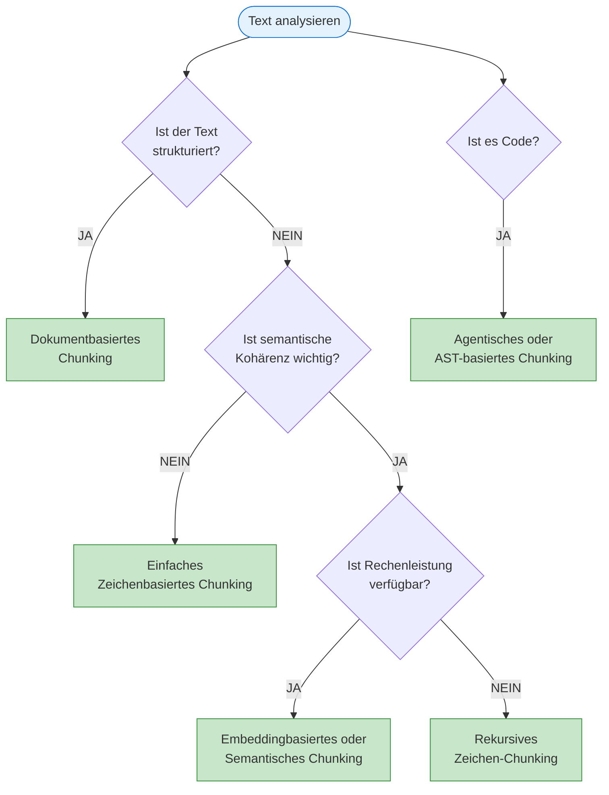

# Tokenizing & Chunking
{: .no_toc }

> **Text-Preprocessing für LLMs: Tokenization-Strategien und Chunking-Methoden für RAG**

---

# Inhaltsverzeichnis
{: .no_toc .text-delta }

1. TOC
{:toc}

---


Die Textverarbeitung in LLM-Systemen steht und fällt häufig mit drei zentralen Entscheidungen: Welcher **Tokenizer** wird verwendet, wie groß sind die **Chunks**, und nach welcher Logik werden sie gebildet? Ein Tokenizer zerlegt Texte in kleine Einheiten, sogenannte **Tokens**. Dabei kann es sich um ganze Wörter, Wortbestandteile oder sogar einzelne Zeichen handeln. Auf den ersten Blick wirken diese Parameter technisch und eher nachrangig. In RAG- oder Analyseaufgaben entscheiden sie jedoch oft darüber, ob relevante Informationen überhaupt gefunden und korrekt verarbeitet werden.

In der Praxis zeigt sich dabei ein typisches Muster: Wenn Antworten unpräzise, unvollständig oder instabil ausfallen, gerät zunächst das Modell selbst in Verdacht. Häufig liegt die eigentliche Ursache jedoch bereits früher in der Verarbeitungskette. Ein **Chunker** unterteilt längere Texte in Chunks, also in verarbeitbare Abschnitte für Suche, Embeddings oder weitere Verarbeitungsschritte. Sind diese Abschnitte zu klein, fallen die Grenzen ungünstig oder erzeugen Überlappungen unnötiges Rauschen, leidet die Qualität der Ergebnisse deutlich. **Tokenizing** und **Chunking** sind deshalb mehr als technische Vorverarbeitung.


# Tokenizer-, Chunking- & Strategieauswahl


## Dokumenttypen

Nicht jeder Dokumenttyp stellt die gleichen Anforderungen an Tokenisierung und Chunking. Länge, Struktur und sprachliche Eigenschaften eines Dokuments beeinflussen maßgeblich, welche Tokenizer, Chunk-Größen und Strategien sinnvoll sind. Während lange Fließtexte vor allem vom Erhalt semantischer Zusammenhänge profitieren, erfordern kurze Texte oder technische Dokumente häufig stärker strukturorientierte Verfahren.

| Dokumenttyp                     | Tokenizer                                                    | Chunk-Größe                          | Überlappung                     | Chunking-Strategie                         | Begründung                                                                                                                                                                                      |
| ------------------------------- | ------------------------------------------------------------ | ------------------------------------ | ------------------------------- | ------------------------------------------ | ----------------------------------------------------------------------------------------------------------------------------------------------------------------------------------------------- |
| **Lange Texte**                 | SentencePiece oder BPE                                       | 512–1024 Tokens                      | 20–30%                          | Semantisches & embeddingbasiertes Chunking | Diese Tokenizer zerlegen den Text in kleinere, semantisch sinnvolle Einheiten. Größere Chunks helfen, den Kontext beizubehalten und logische Einheiten in dichten Texten zu bewahren.           |
| **Mittel-lange Texte**          | WordPiece                                                    | 256–512 Tokens                       | 10–20%                          | Semantisches Chunking                      | WordPiece verarbeitet gemischte Sprache gut. Semantisches Chunking fasst narrative und strukturierte Abschnitte optimal zusammen, ohne den Text zu stark zu fragmentieren.                      |
| **Kurze Texte**                 | Whitespace-/Symbol-basierte Tokenizer                        | 50–200 Tokens                        | 0–5%                            | Rekursives Zeichen-Chucking                | Kurze, oft stark strukturierte Texte profitieren von kleinen Chunks. Rekursives Zeichen-Chucking kann helfen, bei fehlenden klaren Grenzen die Struktur zu wahren.                              |
| **Code & Technische Dokumente** | Whitespace- oder benutzerdefinierte symbolbasierte Tokenizer | Ca. 256 Tokens (pro Funktion/Absatz) | Variabel (minimale Überlappung) | Agentisches Chunking                       | Die strukturelle Integrität ist entscheidend, um die Semantik des Codes zu erhalten. Agentisches Chunking berücksichtigt funktionale Zusammenhänge und stellt die Intaktheit der Blöcke sicher. |

<div style="page-break-after: always;"></div>


## Anwendungsszenarien


Die Wahl einer geeigneten Chunking-Strategie hängt stark vom jeweiligen Anwendungsszenario ab. Unterschiedliche Aufgaben stellen unterschiedliche Anforderungen an Größe, Überlappung und semantische Struktur der Chunks. Während bei Frage-Antwort-Systemen möglichst viel Kontext erhalten bleiben muss, steht bei Zusammenfassungen eher die inhaltliche Verdichtung im Vordergrund.


| Szenario                           | Ziel                                                      | Empfohlenes Chunking                                         | Strategie                                                               | Begründung                                                                                                                                                                                    |
| ---------------------------------- | --------------------------------------------------------- | ------------------------------------------------------------ | ----------------------------------------------------------------------- | --------------------------------------------------------------------------------------------------------------------------------------------------------------------------------------------- |
| **Antworten auf Fragen**           | Exakte Extraktion relevanter Passagen                     | 512 Tokens mit hoher Überlappung (30–50%)                    | Kombination aus semantischem und embeddingbasiertem Chunking            | Hohe Überlappung stellt sicher, dass der Kontext zwischen den Chunks nicht verloren geht. Semantische Grenzen und embeddingbasierte Analysen erfassen relevante Abschnitte präzise.           |
| **Zusammenfassungen**              | Verdichtung des Inhalts bei Beibehaltung der Kernaussagen | 256 Tokens mit moderater Überlappung (10–20%)                | Semantisches Chunking                                                   | Semantisches Chunking bewahrt komplette Sinnabschnitte, sodass die Kernaussagen klar extrahiert werden können, ohne den Kontext zu verlieren.                                                 |
| **Informationsretrieval (RAG)**    | Effiziente Auffindbarkeit relevanter Abschnitte           | 256–512 Tokens mit moderater Überlappung (10–20%)            | Embeddingbasiertes Chunking                                             | Embeddingbasiertes Chunking gruppiert semantisch verwandte Inhalte. So werden relevante Informationen leichter auffindbar und retrieval-technisch optimal aufbereitet.                        |
| **Named Entity Recognition (NER)** | Identifikation wichtiger Entitäten                        | Ca. 256 Tokens an Satzgrenzen, minimale Überlappung (5–15%)  | Semantisches Chunking (ggf. kombiniert mit embeddingbasierten Ansätzen) | Durch an Satzgrenzen ausgerichtete Chunks wird vermieden, dass Entitäten aufgespalten werden. Eine embeddingbasierte Analyse kann zusätzlich helfen, zusammengehörige Entitäten zu erfassen.  |
| **Textklassifikation**             | Zuweisung von Labels zu Dokumenten oder Abschnitten       | Ganze Dokumente oder 512 Tokens, wenig bis keine Überlappung | Semantisches Chunking (optional mit reduzierter Granularität)           | Gröbere Unterteilungen verhindern Rauschen, während semantische Einheiten erhalten bleiben, die für die Klassifikation relevant sind.                                                         |
| **Code-Kommentierung/Erklärung**   | Verständnis und Erklärung von Codeabschnitten             | Pro Funktion/Modul, Überlappung nur bei Bedarf               | Agentisches Chunking                                                    | Agentisches Chunking berücksichtigt syntaktische und semantische Aspekte des Codes. So bleiben logische Zusammenhänge, wie Funktionsdefinitionen, erhalten und können optimal erklärt werden. |


> [!NOTE] Pilotphase<br>
> Vor einer konkreten Implementierung lohnt sich eine kurze Pilotphase mit echten Dokumenten. Häufig reichen schon zwei oder drei Varianten, um zu sehen, ob ein Setup eher Kontext erhält oder eher Rauschen produziert.


# Beispiel Tokenizing & Chunking


<p><font color='black' size="2">
KI-generiertes Bild
</font></p>

+ Tokenizing:
	+ Zerlegt Text in kleinste Einheiten (Token)
	+ Diese Token werden in Zahlen (IDs) umgewandelt
	+ Ein Token kann ein Wort, Teil eines Wortes oder ein Satzzeichen sein

+ Chunking:
	+ Gruppiert die Token in verarbeitbare Blöcke
	+ Beispiel: Bei max. 4096 Token pro Anfrage werden längere Texte in Chunks aufgeteilt
	+ Jeder Chunk behält dabei genug Überlappung (hier 1) zum vorherigen Chunk für Kontexterhalt
+ Zusammenspiel:
	+ Text wird erst tokenisiert (in kleinste Einheiten zerlegt)
	+ Die Token werden dann in Chunks gruppiert (für Verarbeitung)
	+ Chunks werden nacheinander verarbeitet
	+ LLM behält Kontext zwischen Chunks durch Überlappungen

# Parameter- und Strategieauswahl
- **Tokenizer-Auswahl:**
    - SentencePiece/BPE sind ideal für lange, unstrukturierte Texte, da sie feine Subworteinheiten erzeugen und dabei semantische Bedeutung beibehalten.
    - WordPiece eignet sich für hybride Texte, in denen technische sowie allgemeine Sprache vorkommen.
    - Whitespace-/Symbol-basierte Tokenizer (oder speziell angepasste Tokenizer für Code) erhalten die Struktur — beispielsweise in kurzen Texten oder Quellcode.
- **Chunk-Größe und Überlappung:**
    - Die **Chunk-Größe** wird so gewählt, dass jeweils eine komplette logische Einheit erfasst wird. Längere Texte benötigen größere Chunks, während bei kurzen Texten kleinere, präzisere Segmente ausreichend sind.
    - **Überlappung** hilft dabei, Kontextinformationen am Rand der Chunks nicht zu verlieren. Für komplexe Aufgaben (wie präzise Fragebeantwortung) ist eine höhere Überlappung vorteilhaft, wohingegen bei Aufgaben wie Klassifikation geringere Überlappungen ausreichend sind.
- **Zusätzliche Chunking-Strategien:**
    - **Semantisches Chunking** zielt darauf ab, thematisch und inhaltlich zusammenhängende Abschnitte zu bilden.
    - **Rekursives Zeichen-Chucking** eignet sich, wenn keine klaren sprachlichen Grenzen vorliegen oder bei sehr strukturierten, kurzen Dokumenten.
    - **Embeddingbasiertes Chunking** nutzt Ähnlichkeiten im Einbettungsraum, um semantisch verwandte Inhalte zu gruppieren, was insbesondere bei Retrieval-Aufgaben nützlich ist.
    - **Agentisches Chunking** verwendet agentenbasierte Verfahren, um logische und syntaktische Zusammenhänge zu identifizieren – ein Ansatz, der besonders bei Code und technischen Dokumenten Vorteile bietet.
- **Praktische Rahmenbedingungen:**
    - **Speicherverbrauch und Verarbeitungsgeschwindigkeit** lassen sich durch Anpassen der Chunk-Größe steuern. Kleinere Chunks reduzieren den Speicherbedarf und beschleunigen die Verarbeitung, was vor allem bei großen Datenmengen von Bedeutung ist.
    - **Kosten** lassen sich durch Optimieren der Überlappung senken. Eine zu hohe Überlappung erhöht Redundanzen und Rechenaufwand, sodass hier ein ausgewogenes Verhältnis gefunden werden muss.

Für Entwickler ist vor allem eine Erfahrung wichtig: Es gibt selten eine universell richtige Chunk-Größe. Gute Werte hängen stark davon ab, ob Absätze, Abschnitte, Funktionsblöcke oder stark strukturierte Datensätze verarbeitet werden. Wer ohne Testdaten sofort auf "Best Practices" vertraut, optimiert oft am eigentlichen Problem vorbei.


> [!NOTE] Praxistest<br>
> Die Eignung von Chunk-Größen und -Strategien zeigt sich am zuverlässigsten mit echten Daten, nicht mit Beispieltexten. Relevant sind dabei vor allem Abrufgenauigkeit, Antwortqualität und die Frage, ob wichtige Informationen an Chunk-Grenzen verloren gehen.


# Tokenizer-Typen im Vergleich
## Byte-Pair Encoding (BPE)

Byte-Pair Encoding fasst häufig auftretende Zeichenpaare iterativ zu einem Token zusammen. Das führt zu einem kompakten Vokabular und einem guten Umgang mit seltenen Wörtern — der Tokenizer kennt sie als Subwort-Kombination, auch wenn sie nie vollständig im Training vorkamen. Der Nachteil: BPE muss auf einem Korpus trainiert werden. Eingesetzt wird er vor allem in GPT-Modellen und anderen Transformer-Architekturen.

## WordPiece

WordPiece funktioniert ähnlich wie BPE, optimiert aber auf Wahrscheinlichkeitsmaximierung statt auf Häufigkeit. Das macht ihn besonders effizient für mehrsprachige Modelle, die auf unterschiedliche Sprachstrukturen generalisieren müssen. Die Implementierung ist etwas komplexer als bei BPE. Eingesetzt wird WordPiece vor allem in BERT und DistilBERT.

## SentencePiece

SentencePiece behandelt Text als rohe Bytefolge — ohne Annahmen über Leerzeichen oder Wortgrenzen. Das macht ihn language-agnostic: Er funktioniert für alle Sprachen, braucht keine Vorverarbeitung und eignet sich damit gut für mehrsprachige Systeme. Ein kleiner Nachteil ist die etwas geringere Geschwindigkeit. Typische Einsatzgebiete sind T5 und XLNet.

## Whitespace/Symbol-basierte Tokenizer

Das simpelste Verfahren trennt an Leerzeichen und Satzzeichen. Der Ansatz ist schnell, leicht verständlich und funktioniert besonders gut für Code, wo Struktur durch Symbole klar definiert ist. Als Schwäche ergibt sich ein großes Vokabular, und zusammengesetzte Wörter werden nicht aufgelöst. Typische Einsatzgebiete sind einfache Anwendungen und Code-Analyse.


# Chunking-Strategien im Detail


## Zeichenbasiertes Chunking

Der Text wird nach einer festen Zeichenanzahl geteilt — ohne Rücksicht auf Wort- oder Satzgrenzen. Das kann dazu führen, dass Wörter oder Sätze mitten durchgeschnitten werden. Empfohlen wird dieser Ansatz kaum; er kommt nur für sehr einfache Fälle infrage, in denen Präzision keine Rolle spielt.

## Rekursives Zeichen-Chunking

Rekursives Chunking versucht erst, an Absatzgrenzen zu trennen, dann an Sätzen, schließlich an einzelnen Wörtern — je nachdem, was die Zielgröße erlaubt. Das erhält deutlich mehr strukturelle Integrität als das einfache Zeichen-Chunking. Es ist der Standard-Ansatz für die meisten Texttypen.

## Dokumentbasiertes Chunking

Hier nutzt der Chunker die dokumentspezifische Struktur — Markdown-Header, HTML-Tags oder ähnliche Marker — als natürliche Trennstellen. Die Grenzen sind semantisch sinnvoll und spiegeln den Aufbau des Dokuments wider. Besonders geeignet ist dieser Ansatz für strukturierte Dokumente und technische Dokumentation.

## Semantisches Chunking

Semantisches Chunking analysiert die inhaltliche Ähnlichkeit zwischen Sätzen und fasst zusammengehörige Passagen in einen Chunk zusammen. Das verhindert, dass thematisch zusammenhängende Inhalte auseinandergerissen werden. Der Nachteil ist der höhere Rechenaufwand; dieser Ansatz lohnt sich vor allem für hochwertige RAG-Systeme, in denen Retrieval-Qualität wichtiger ist als Geschwindigkeit.

## Embeddingbasiertes Chunking

Ähnlich wie semantisches Chunking, aber explizit auf Basis von Embeddings: Abschnitte mit ähnlichen Vektorrepräsentationen werden zusammengefasst. Das ermöglicht sehr genaue semantische Gruppierungen, kostet aber mehr Rechenleistung. Der Ansatz ist besonders für retrieval-optimierte Systeme geeignet.

## Agentisches Chunking

Ein KI-Agent analysiert den Text und trifft eigenständig Entscheidungen über Chunk-Grenzen — adaptiv und kontextabhängig. Das ist der flexibelste Ansatz, aber auch der aufwendigste: komplex in der Umsetzung und teuer im Betrieb. Sinnvoll ist er für hochspezialisierte Anwendungen, vor allem bei Code-Analyse.


<div style="page-break-after: always;"></div>

# Best Practices
## Chunk-Größe wählen

1. **Kleine Chunks (128-256 Tokens):**
   - Präzises Retrieval
   - Höhere Kosten (mehr Chunks)
   - Risiko: Kontextverlust

2. **Mittlere Chunks (256-512 Tokens):**
   - Guter Kompromiss
   - Standard für die meisten Anwendungen

3. **Große Chunks (512-1024 Tokens):**
   - Mehr Kontext
   - Weniger Chunks
   - Risiko: Irrelevante Informationen

## Überlappung optimieren

- **Keine Überlappung (0%):** Nur wenn Chunks völlig unabhängig sind
- **Kleine Überlappung (5-10%):** Strukturierte Dokumente
- **Moderate Überlappung (10-20%):** Standard für RAG
- **Hohe Überlappung (30-50%):** Wenn Kontext kritisch ist (Q&A)

## Strategie-Auswahl




# Evaluation & Monitoring
## Metriken für Chunking-Qualität

- **Retrieval Precision:** Anteil relevanter Chunks in Top-K Ergebnissen
- **Retrieval Recall:** Anteil gefundener relevanter Chunks
- **Context Preservation:** Wird wichtiger Kontext über Chunk-Grenzen hinweg erhalten?
- **Chunk Size Distribution:** Sind die Chunks gleichmäßig groß?

## A/B Testing

Sinnvoll ist der Vergleich mehrerer Konfigurationen:
- Chunk-Größe: 256 vs. 512 Tokens
- Überlappung: 10% vs. 20%
- Strategie: Rekursiv vs. Semantisch

Geeignete Messgrößen sind:
- Antwortqualität (manuell oder mit LLM-as-Judge)
- Retrieval-Geschwindigkeit
- Kosten (API-Calls, Compute)


# Implementierungs-Beispiel (Pseudo-Code)

Das konkrete Framework kann sich ändern. Stabil bleibt die Pipeline: Dokument laden, passende Strategie wählen, Grenzen bestimmen, Chunks prüfen und erst danach indexieren.

```text
Pseudo-Code, nicht als Python ausführen:

Eingabe:
    dokument_text
    ziel: z. B. Q&A, Zusammenfassung oder Klassifikation
    dokumenttyp: z. B. Fließtext, Markdown, Code oder Tabelle

Chunking vorbereiten:
    passende Strategie wählen
    Zielgröße festlegen
    Überlappung festlegen
    Trennzeichen oder Strukturgrenzen festlegen

Chunking ausführen:
    Text entlang stabiler Grenzen teilen
    wenn Abschnitt zu groß:
        nächstfeinere Grenze verwenden
    wenn Abschnitt zu klein:
        mit benachbartem Abschnitt zusammenführen
    Überlappung zwischen benachbarten Chunks ergänzen

Qualität prüfen:
    keine wichtigen Sätze mitten trennen
    Chunk-Größen verteilen sich plausibel
    Metadaten wie Quelle, Abschnitt und Position speichern
```

**Wichtig:** Die Einheit der Größe muss explizit sein. Manche Verfahren zählen Zeichen, andere Tokens. Für RAG ist entscheidend, dass die gewählte Einheit zur späteren Modell- und Embedding-Pipeline passt.

```text
Pseudo-Code, nicht als Python ausführen:

wenn tokenbasiertes Chunking nötig ist:
    Tokenizer des Zielmodells verwenden
    Text in Tokens zählen
    Chunks nach Tokenlimit bilden
    Überlappung ebenfalls in Tokens berechnen

wenn zeichenbasiertes Chunking reicht:
    Zeichen oder Absätze zählen
    Chunks nach Strukturgrenzen bilden
    Ergebnis mit echten Retrieval-Fragen testen
```


# Fazit
Tokenizer, Chunk-Größe und Chunking-Strategie zusammen bestimmen, wie gut eine NLP-Anwendung tatsächlich funktioniert:

- **Dokumenttyp bestimmt Tokenizer:** Lange Texte → BPE/SentencePiece, Code → Whitespace/Symbol
- **Anwendung bestimmt Chunk-Größe:** Q&A → größer mit Überlappung, Klassifikation → größer ohne Überlappung
- **Strategie folgt Anforderungen:** Semantik wichtig → Semantisches/Embedding-basiert, Struktur wichtig → Dokumentbasiert
- **Tests mit echten Daten:** A/B-Tests sind hier deutlich aussagekräftiger als Beispieltexte

---

**Weiterführende Ressourcen:**
- [LangChain Text Splitters](https://python.langchain.com/docs/modules/data_connection/document_transformers/)
- [Chunking Strategies Vergleich](https://www.pinecone.io/learn/chunking-strategies/)
- [Token vs. Character Splitting](https://cookbook.openai.com/examples/how_to_count_tokens_with_tiktoken)


---

## Abgrenzung zu verwandten Dokumenten

| Dokument | Frage |
|---|---|
| [Embeddings](./embeddings.html) | Wie werden die vorbereiteten Textstücke später semantisch repräsentiert? |
| [RAG-Konzepte](../05-prompting-rag/rag-konzepte.html) | Wie wirken Chunking-Entscheidungen auf Retrieval und Antwortqualität? |
| [Transformer-Architektur](./transformer.html) | Warum spielen Token überhaupt eine so zentrale Rolle für Sprachmodelle? |

---

**Version:**    1.1<br>
**Stand:** Mai 2026<br>
**Kurs:** Generative KI. Verstehen. Anwenden. Gestalten.
