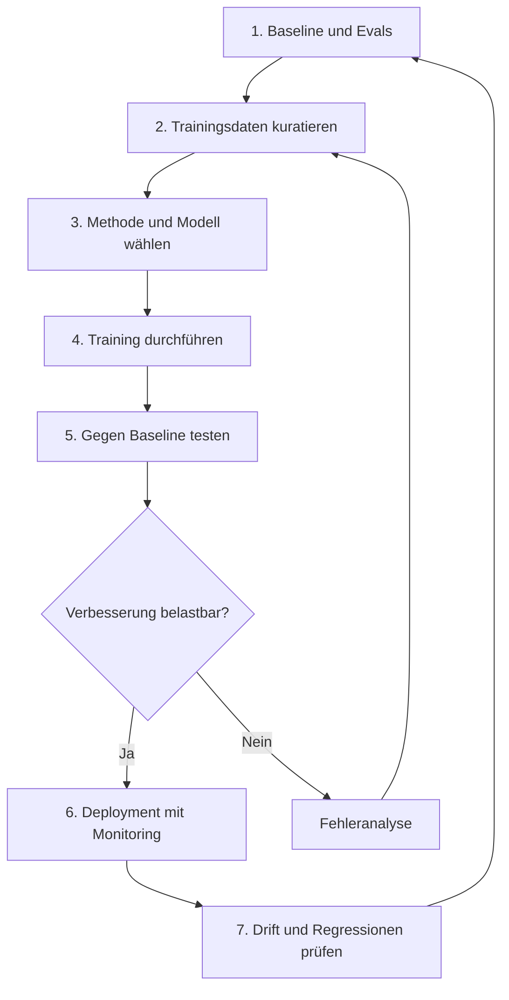

# Fine-Tuning
{: .no_toc }

> **Model Adaptation: Fine-Tuning, LoRA und PEFT**

---

# Inhaltsverzeichnis
{: .no_toc .text-delta }

1. TOC
{:toc}

---

# Einordnung

Fine-Tuning passt ein vortrainiertes Modell an eine engere Aufgabe, eine bestimmte Domäne oder ein wiederkehrendes Antwortmuster an. Das Modell startet nicht bei null, sondern nutzt vorhandene Sprach- und Weltrepräsentationen weiter. Das senkt den Trainingsaufwand, ersetzt aber weder saubere Daten noch eine belastbare Evaluation.

Fine-Tuning ist selten der erste sinnvolle Schritt. Bessere Prompts, stabileres Retrieval oder eine klarere Systemarchitektur bringen oft schneller messbare Verbesserungen. Fine-Tuning wird interessant, wenn ein wiederkehrendes Fehlermuster trotz guter Prompts, passender Kontextdaten und nachvollziehbarer Tests bestehen bleibt.

In der Praxis relevant, wenn: Das Modell soll kein neues Faktenwissen aufnehmen, sondern ein Verhalten zuverlässig wiederholen. Typische Beispiele sind feste Antwortformate, domänenspezifischer Stil, Klassifikationsentscheidungen oder wiederkehrende Extraktionsaufgaben. Für wechselndes Faktenwissen ist Retrieval robuster, weil Trainingsdaten nach dem Fine-Tuning nicht automatisch aktuell bleiben.

# Einsatzkriterien

Fine-Tuning lohnt sich, wenn das gewünschte Verhalten aus vielen ähnlichen Beispielen gelernt werden kann. Ein Kundensupport-Modell kann etwa lernen, Rückfragen in einem bestimmten Ton zu stellen, Eskalationen konsistent zu erkennen oder interne Kategorien stabil zuzuordnen. Bei solchen Aufgaben zählt weniger einzelnes Faktenwissen als reproduzierbares Verhalten.

Nicht geeignet, wenn: Die Aufgabe vor allem aktuelles, seltenes oder umfangreiches Fachwissen benötigt. Dann verschiebt Fine-Tuning das Problem nur in den Trainingsdatensatz. RAG, Tool-Nutzung oder eine bessere Datenbasis sind in solchen Fällen meist die bessere Architekturentscheidung.

Eine belastbare Entscheidung braucht eine Baseline. Vor dem Training sollte klar sein, welche Fälle heute scheitern, wie Erfolg gemessen wird und welche Veränderung als Verbesserung gilt. Ohne Evals ist kaum erkennbar, ob das neue Modell wirklich besser arbeitet oder nur andere Fehler macht.

# Fine-Tuning-Ansätze

## Transfer Learning

Transfer Learning nutzt ein vortrainiertes Modell als Ausgangspunkt und passt es an eine neue Aufgabe an. Die unteren Schichten enthalten bereits allgemeine Muster, während spätere Schichten stärker auf die Zielaufgabe ausgerichtet werden können. Im ML-Workflow reduziert das Daten- und Rechenbedarf gegenüber einem vollständigen Pre-Training.

Grenze: Transfer Learning hilft nur, wenn Ausgangsmodell und Zielaufgabe nah genug beieinanderliegen. Weichen Domäne, Datenformat oder Zielverhalten stark ab, reicht eine kleine Anpassung nicht aus. Typischer Fehler: Das Verfahren wird als Abkürzung verstanden, obwohl die Zielaufgabe noch nicht stabil beschrieben ist.

## Parameter-Effizientes Fine-Tuning

Parameter-effizientes Fine-Tuning verändert nicht alle Gewichte des Basismodells. Verfahren wie LoRA, QLoRA, DoRA, Adapter oder Prompt Tuning ergänzen oder verändern nur kleine Teile der Modellparameter. Trainingsläufe werden dadurch günstiger, Varianten lassen sich getrennt verwalten und ein Basismodell kann mehrere Spezialisierungen tragen.

LoRA fügt kompakte Low-Rank-Matrizen ein, die Gewichtsänderungen approximieren. QLoRA kombiniert diesen Ansatz mit Quantisierung, um Speicherbedarf weiter zu senken. Adapter platzieren zusätzliche Module zwischen vorhandenen Schichten; Prompt Tuning arbeitet mit trainierbaren Prompt-Repräsentationen statt mit vollständig angepassten Modellgewichten.

Für lokale Experimente ist der übliche Startpfad: kleines Instruct-Modell, Supervised Fine-Tuning und LoRA oder QLoRA. LoRA erzeugt zunächst einen kleinen Adapter, der das Basismodell nicht ersetzt. Für manche Deployment-Ziele, etwa GGUF oder Ollama, wird dieser Adapter später mit dem Basismodell zusammengeführt und anschließend quantisiert.

Grenze: PEFT reduziert Kosten, aber nicht automatisch Qualitätsrisiken. Schlechte Trainingsdaten, unklare Labels oder ein schwacher Eval-Satz bleiben dieselben Probleme. Außerdem kann eine zu enge Spezialisierung das Modell außerhalb der Trainingsverteilung spröder machen.

## Instruction Fine-Tuning

Instruction Fine-Tuning trainiert ein Modell darauf, natürlichsprachliche Anweisungen zuverlässig in passende Antworten umzusetzen. Die Trainingsdaten bestehen aus Paaren von Anweisung und gewünschter Ausgabe, häufig ergänzt durch Kontext oder Rolleninformationen. Der Ansatz passt, wenn ein Modell nicht nur Inhalte erzeugen, sondern Anweisungen konsistent befolgen soll.

Ein vereinfachtes Trainingsbeispiel kann so aussehen:

```text
### Human:
Fasse die folgende Kundenanfrage in einer internen Support-Kategorie zusammen.

### Assistant:
Kategorie: Rechnungskorrektur
```

Typischer Fehler: Die Beispiele beschreiben nur ideale Standardfälle. Dann lernt das Modell zwar ein Format, scheitert aber bei unvollständigen Eingaben, widersprüchlichem Kontext oder Randfällen. Gute Instruction-Daten enthalten deshalb auch schwierige Beispiele mit erwarteter Behandlung.

## Supervised Fine-Tuning

Supervised Fine-Tuning arbeitet mit kuratierten Eingabe-Ausgabe-Beispielen. Es eignet sich für Aufgaben, bei denen Fachleute eine richtige oder zumindest bevorzugte Antwort festlegen können. Datenqualität zählt dabei stärker als Menge: Wenige konsistente Beispiele sind hilfreicher als viele widersprüchliche Demonstrationen.

Für erste Experimente reichen oft kleine Datensätze, solange sie echte Zielaufgaben abbilden. Entscheidend ist, dass Trainings-, Validierungs- und Testfälle getrennt bleiben. Wenn Beispiele aus der Evaluation im Training landen, wirkt das Modell besser, ohne robuster geworden zu sein.

## Preference- und Reinforcement-Verfahren

Direct Preference Optimization (DPO) trainiert mit Antwortpaaren: Eine Antwort wird bevorzugt, eine andere abgelehnt. Das hilft, wenn Stil, Tonalität oder Bewertungsnuancen gelernt werden sollen, ohne jede Zielantwort als perfekte Musterlösung zu formulieren. Die Qualität der Paarvergleiche entscheidet, ob das Modell tatsächlich bessere Präferenzen lernt.

Reinforcement Fine-Tuning bewertet Modellantworten über Grader oder andere Bewertungssignale. Das kann bei komplexen Aufgaben helfen, wenn sich Ergebnisse zuverlässig bewerten lassen. Nicht geeignet ist dieser Ansatz, wenn Fachleute sich nicht über die Bewertungskriterien einig sind oder wenn der Grader selbst leicht auszutricksen ist.

## Vision Fine-Tuning und Multimodale Aufgaben

Vision Fine-Tuning erweitert die Anpassung auf Modelle, die Bilder oder andere visuelle Eingaben verarbeiten. Typische Aufgaben sind Bildklassifikation, visuelle Beschreibungen oder die Erkennung bestimmter Objektklassen. Die Trainingsdaten müssen dabei nicht nur sprachlich, sondern auch visuell konsistent sein.

Bei multimodalen Daten entstehen zusätzliche Fehlerquellen. Bildqualität, Auflösung, Datenschutzanforderungen und die Beziehung zwischen Bild und Text beeinflussen das Ergebnis. Eine Textbeschreibung, die nicht eindeutig zum Bild passt, erzeugt schlechtere Trainingssignale als gar kein Beispiel.

## Modell-Distillation

Modell-Distillation nutzt Ausgaben eines größeren Modells, um ein kleineres Modell für einen begrenzten Aufgabenbereich zu trainieren. Wenn die Aufgabe eng genug geschnitten ist, sinken Kosten und Latenz. Ein kleines Modell kann dann für wiederkehrende Standardfälle ausreichen.

Grenze: Distillation übernimmt nicht nur Stärken, sondern auch Fehler und Verzerrungen des größeren Modells. Die erzeugten Trainingsdaten müssen deshalb wie echte Trainingsdaten geprüft werden. Ohne Kontrolle entsteht ein kleineres Modell, das Fehler schneller und günstiger reproduziert.

# Fine-Tuning-Pipeline



Die Pipeline beginnt nicht mit dem Trainingsjob, sondern mit einer Baseline. Zuerst wird festgelegt, welche Fälle das aktuelle System nicht gut löst und welche Metriken diese Schwäche sichtbar machen. Erst danach lohnt sich Arbeit an Trainingsdaten, Hyperparametern und Modellvarianten.

Zur Datenvorbereitung gehören Auswahl, Bereinigung, Formatierung und Split in Training, Validierung und Test. Für API-basiertes Fine-Tuning ist häufig ein JSONL-Format erforderlich; bei lokalen Trainingsläufen hängen Format und Struktur vom Framework ab. Entscheidend ist nicht das Dateiformat an sich, sondern die Konsistenz zwischen Zielaufgabe, Beispielqualität und Evaluation.

Als grobe Faustregel sollten etwa 10 bis 15 Prozent der Beispiele als Holdout-Set zurückgehalten werden. Diese Beispiele dürfen nicht in die Trainingsdaten zurückwandern, sonst misst die Evaluation eher Wiedererkennen als robuste Generalisierung.

Nach dem Training reicht ein einzelner Durchschnittswert nicht aus. Relevanter sind Fehlerklassen: Welche Fälle wurden besser, welche schlechter, und welche Regressionen sind neu entstanden? Erst wenn die Verbesserung gegenüber der Baseline stabil bleibt, folgt Deployment mit Monitoring.

# Evaluation und Prompting

Evals messen, ob Modellantworten die fachlichen Anforderungen erfüllen. Geeignet sind einfache String-Prüfungen, Klassifikationsmetriken, Ähnlichkeitsvergleiche, Python-Grader oder modellgestützte Bewertungen. Für Fine-Tuning sind Evals besonders wichtig: Ohne Messkonzept wirkt ein Training schnell wie Fortschritt, obwohl sich nur die Antwortoberfläche verändert.

Ein belastbarer Vergleich nutzt dieselben Holdout-Beispiele für mehrere Varianten: das bisherige Referenzsystem, das ungetunte Basismodell und das feinabgestimmte Modell. Alle Varianten werden mit derselben Metrik bewertet und in einer Tabelle verglichen. Erst diese Gegenüberstellung zeigt, ob das Fine-Tuning wirklich einen relevanten Vorteil bringt oder nur andere Formulierungen erzeugt.

| Aufgabentyp | Geeignete Metriken |
|---|---|
| Klassifikation, Intent-Erkennung, Routing | Accuracy, Precision, Recall, Macro-F1 bei unausgewogenen Klassen |
| Extraktion strukturierter Felder | Exact Match pro Feld, Vollständigkeit, parsebares JSON oder Schema-Gültigkeit |
| Freitext, Zusammenfassung, Antwortstil | Rubrikbewertung, Human Spot Check, LLM-as-Judge mit festen Kriterien |

Prompt Engineering bleibt auch nach einem Fine-Tuning relevant. Ein feinabgestimmtes Modell braucht weiterhin klare Instruktionen, passenden Kontext und sinnvolle Ausgabeformate. Häufig zeigt ein guter Few-Shot-Prompt bereits, ob sich ein Verhalten zuverlässig aus Beispielen ableiten lässt.

Typischer Fehler: Fine-Tuning wird gestartet, bevor Prompting und Retrieval sauber getestet wurden. Das erzeugt zusätzliche Komplexität, aber keine bessere Architektur. Ein guter Test ist: Wenn ein Verhalten mit drei bis fünf sorgfältigen Few-Shot-Beispielen im Prompt nicht stabiler wird, lösen zusätzliche Trainingsbeispiele das Problem oft ebenfalls nicht.

Zwei Fehlerbilder treten bei lokalen Fine-Tuning-Workflows besonders häufig auf. Erstens muss das Chat-Template beim Training und beim späteren Serving identisch sein; sonst können trotz erfolgreichem Training wirre, abgeschnittene oder endlos wiederholte Ausgaben entstehen. Zweitens müssen LoRA-Adapter für GGUF- oder Ollama-Exporte zuerst mit dem Basismodell zusammengeführt werden, bevor quantisiert wird.

# Embeddings und Fine-Tuning

Embeddings übersetzen Tokens, Wörter oder Textstücke in numerische Vektoren. Diese Vektoren bilden den Eingang in die neuronale Verarbeitung und tragen bereits semantische Informationen aus dem Pre-Training. Beim Fine-Tuning können diese Repräsentationen direkt oder indirekt an die Zielaufgabe angepasst werden.

Bei einem vollständigen Fine-Tuning können auch Embedding-Schichten verändert werden. Das hilft, wenn eine Domäne eigene Terminologie, Abkürzungen oder Bedeutungsverschiebungen nutzt. Bei LoRA, Adapter-Verfahren oder anderen PEFT-Methoden bleiben die ursprünglichen Embeddings dagegen häufig unverändert; zusätzliche Parameter übernehmen die Anpassung.

Grenze: Embedding-Anpassung macht ein Modell nicht automatisch faktenreicher. Die Anpassung verändert eher die Verarbeitung bestimmter Muster, Schreibweisen oder Fachsprache. Für neues oder häufig wechselndes Wissen bleibt externer Kontext über Retrieval meist die robustere Lösung.

# Daten- und Trainingsstrategie

Datenqualität schlägt Datenmenge. Ein guter Trainingsdatensatz enthält realistische Eingaben, konsistente Zielantworten und genug Variation, damit das Modell nicht nur die einfachsten Fälle imitiert. Randfälle gehören bewusst in den Datensatz, wenn sie später im Betrieb relevant sind.

Die Trainingsstrategie sollte klein beginnen. Ein begrenzter, gut kontrollierter Datensatz zeigt, ob das Verfahren überhaupt Wirkung hat. Danach können mehr Beispiele, andere Lernraten, zusätzliche Epochen oder PEFT-Varianten getestet werden. Checkpoints und Modellversionierung sind dabei keine Formalität, sondern Voraussetzung für nachvollziehbare Regressionstests.

In der Praxis entsteht ein guter Fine-Tuning-Datensatz häufig iterativ. Nach einem Trainingslauf werden Fehlermuster analysiert, unklare oder widersprüchliche Beispiele korrigiert und gezielt neue Beispiele ergänzt. Erst das trainierte Modell zeigt, welche Formulierungen es zu allgemein interpretiert, welche Pflichtdetails es auslässt und welche Randfälle fehlen.

Diese Iteration braucht eine Kontrollinstanz. Wer nur die zuletzt auffälligen Beispiele ergänzt, kann das Modell auf einzelne Testfragen optimieren, ohne die allgemeine Qualität zu verbessern. Deshalb sollten neben zufällig gezogenen Plausibilitätschecks auch feste Testfragen oder ein getrenntes Holdout-Set verwendet werden. So bleibt sichtbar, ob neue Trainingsdaten ein Fehlermuster wirklich reduzieren oder nur die nächste Antwort verbessern.

Bei Hyperparametern sind Lernrate, Batch-Größe und Epochenzahl besonders einflussreich. Zu aggressives Training kann Overfitting erzeugen; zu vorsichtiges Training bleibt wirkungslos. Wichtiger als die perfekte Einzelkonfiguration ist ein sauber dokumentierter Vergleich mehrerer Läufe.

Ein weiteres Risiko ist Catastrophic Forgetting: Das Modell wird auf der Zielaufgabe besser, verliert aber außerhalb dieser engen Verteilung allgemeine Fähigkeiten. Deshalb sollten vor und nach dem Fine-Tuning einige einfache, domänenfremde Kontrollfragen geprüft werden. Bei engen Spezialdatensätzen kann ein kleiner Replay-Anteil mit allgemeinen Beispielen helfen, typischerweise ungefähr zehn Prozent der Trainingsdaten.

# Sicherheit, Datenschutz und Kosten

Fine-Tuning kann sensible Daten dauerhaft in Trainingsartefakten verankern. Personenbezogene oder vertrauliche Inhalte müssen vor dem Training geprüft, minimiert oder anonymisiert werden. Das gilt auch dann, wenn ein Anbieter technische Schutzmechanismen bereitstellt.

Kosten entstehen nicht nur beim Trainingslauf. Datenaufbereitung, Evaluation, Fehlersuche, Deployment, Monitoring und spätere Aktualisierungen gehören zur Gesamtbetrachtung. Ein Modell, das pro Anfrage günstiger ist, kann trotzdem teurer werden, wenn seine Pflege aufwendig bleibt.

In vielen produktiven Systemen ist Modell-Distillation oder ein kleineres spezialisiertes Modell sinnvoll, sobald ein Aufgabenbereich stabil ist. Vorher sollte aber klar sein, welche Anforderungen unverändert bleiben und welche Fälle an ein stärkeres Modell, ein Tool oder einen Menschen eskaliert werden.

# Herausforderungen und Perspektiven

Fine-Tuning großer Modelle bleibt ressourcenintensiv. PEFT, Quantisierung und kleinere Spezialmodelle senken die Einstiegshürde, lösen aber nicht die methodischen Probleme. Datenqualität, Evaluation und Drift bleiben die entscheidenden Faktoren.

Ethische Risiken entstehen vor allem über Trainingsdaten. Verzerrte Beispiele, unausgewogene betroffene Gruppen oder unklare Bewertungsregeln werden vom Modell nicht neutralisiert, sondern oft stabilisiert. Deshalb gehört die Dokumentation des Trainingsprozesses zur Qualitätssicherung.

Neue Einsatzfelder wie Edge Computing, IoT-Analysen oder verteiltes Training erweitern die technischen Möglichkeiten. Für die Methodenentscheidung ist aber wichtiger, ob die Zielaufgabe eng, messbar und stabil genug ist. Ohne diese drei Eigenschaften wird Fine-Tuning schnell zu einer teuren Form von Hoffnung.

# Fazit

> [!NOTE] Fazit<br>
> Fine-Tuning ist sinnvoll, wenn ein Modell ein klar messbares Verhalten wiederholt besser ausführen soll. Es ist schwach, wenn aktuelles Wissen, unklare Bewertungskriterien oder schlechte Daten das eigentliche Problem sind. Die Entscheidung beginnt deshalb mit Baseline und Evals, nicht mit dem Trainingsjob.

---

## Abgrenzung zu verwandten Dokumenten

| Dokument | Frage |
|---|---|
| [Prompt Engineering](../05-prompting-rag/prompt-engineering.html) | Was lässt sich noch über bessere Anweisungen statt über Training lösen? |
| [RAG-Konzepte](../05-prompting-rag/rag-konzepte.html) | Wann hilft externer Wissenszugriff mehr als Modellanpassung? |
| [Modellauswahl](./modellauswahl.html) | Wie wird entschieden, ob ein anderes Basismodell genügt? |

---

**Version:** 1.4<br>
**Stand:** Juni 2026<br>
**Kurs:** Generative KI. Verstehen. Anwenden. Gestalten.
