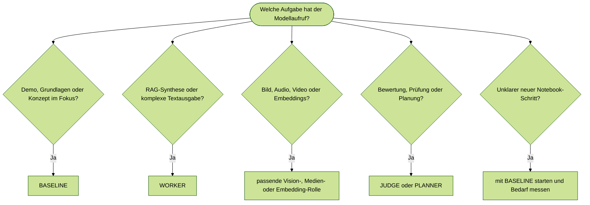

# Modellauswahl
{: .no_toc }

> Wer in Kursnotebooks ein Modell fest einträgt, schreibt Wartungsaufwand in den Code. Diese Seite zeigt, wie Modellentscheidungen stattdessen über Rollen getroffen werden — und welche Rolle wann passt.

---

# Inhaltsverzeichnis
{: .no_toc .text-delta }

1. TOC
{:toc}

---

## Grundidee

Modellauswahl ist keine Rangliste. Ein Modell ist passend, wenn Qualität, Latenz, Kosten, Kontextfenster, Tool-Unterstützung und Modalität zur Aufgabe passen. Im Kurs wird deshalb nicht überall ein einzelnes Modell fest eingetragen, sondern eine Rolle verwendet: Demo, Worker, Judge, Planner, Vision, Medienerzeugung oder Embedding.

Diese Rollen stehen in `04_modul/genai_lib/model_config.py`. Die Datei ist der technische Kursstandard. Wer ein Notebook liest, soll nicht zuerst konkrete Produktnamen interpretieren müssen, sondern erkennen, welche Aufgabe ein Modell im System übernimmt.

## Frontier-Modelle

Die folgende Tabelle zeigt die zentralen Modellrollen aus `model_config.py`. Die konkreten Modell-IDs sind Kurskonfiguration, nicht allgemeine Marktberatung. Vor produktiven Projekten muss die aktuelle Provider-Dokumentation geprüft werden, weil Modellverfügbarkeit, Preise und API-Parameter regelmäßig wechseln.

| Rolle in `model_config.py` | Kursmodell               | Einsatz im Kurs                                                  |
| -------------------------- | ------------------------ | ---------------------------------------------------------------- |
| `BASELINE`                 | `openai:gpt-5.4-nano`    | Grundlagen, Demos, kurze Antworten, kostengünstige Experimente   |
| `ROUTER`                   | `openai:gpt-5.4-nano`    | einfache Routing- und Auswahlentscheidungen                      |
| `TRANSLATOR_FAST`          | `openai:gpt-5.4-nano`    | schnelle Rohübersetzungen                                        |
| `TRANSLATOR`               | `openai:gpt-5.4-mini`    | Kursmaterial, Markdown, Dokumentation                            |
| `WORKER`                   | `openai:gpt-5.4-mini`    | RAG-Synthese, strukturierte Ausgaben, Standardaufgaben           |
| `CODING`                   | `openai:gpt-5.4-mini`    | Codegenerierung, Refactoring, technische Assistenz               |
| `JUDGE`                    | `openai:gpt-5.4`         | Evaluation, Compliance, Sicherheits- und Qualitätsentscheidungen |
| `PLANNER`                  | `openai:gpt-5.4`         | Aufgabenzerlegung, Agentenplanung, komplexe Workflows            |
| `WORKER_PREMIUM`           | `openai:gpt-5.4`         | hochwertige Synthese, komplexe RAG-Aufgaben, finale Reports      |
| `TRANSLATOR_PREMIUM`       | `openai:gpt-5.5`         | hochwertige finale Übersetzungen                                 |
| `JUDGE_PREMIUM`            | `openai:gpt-5.5`         | kritische Evaluation und maximale Qualität                       |
| `PLANNER_PREMIUM`          | `openai:gpt-5.5`         | hochkomplexe Planung und mehrstufige Aufgaben                    |
| `VISION_FAST`              | `openai:gpt-5.4-mini`    | einfache Bildanalyse                                             |
| `VISION_PREMIUM`           | `openai:gpt-5.4-mini`    | anspruchsvollere Bild- oder Frame-Analyse im Kurs                |
| `IMAGE_GENERATION`         | `gpt-image-1`            | Bildgenerierung                                                  |
| `IMAGE_GENERATION_PREMIUM` | `gpt-image-2`            | hochwertige Bildgenerierung                                      |
| `VIDEO_GENERATION`         | `sora-2`                 | Videoerzeugung                                                   |
| `TRANSCRIPTION`            | `whisper-1`              | Audio-Transkription                                              |
| `EMBEDDINGS`               | `text-embedding-3-small` | Vektorsuche und RAG                                              |


> [!IMPORTANT] Standard vor Produktname<br>
> In Notebooks werden nach Möglichkeit Rollen aus `model_config.py` verwendet. Harte Modellnamen stehen nur dort direkt im Notebook, wo ein bestimmter Endpunkt oder ein bewusstes Vergleichsexperiment gezeigt wird.


## Entscheidungsregeln

Für Grundlagen, kurze Demos und erste Chains reicht die Baseline-Rolle. In diesen Modulen zählt, ob das Konzept sichtbar wird, nicht ob die Ausgabe maximal elegant formuliert ist. Erst wenn die Ausgabequalität fachlich relevant wird, etwa bei RAG-Synthese oder strukturierten Berichten, wird auf eine Worker-Rolle gewechselt.

Multimodale Aufgaben sind eine eigene Entscheidung. Ein Textmodell darf nicht pauschal für Bild-, Audio- oder Videoaufgaben verwendet werden, nur weil es in Textbeispielen gut funktioniert. Bildanalyse, Bildgenerierung, Videoerzeugung, Transkription und Embeddings folgen eigenen Endpunkten oder Modellklassen.

Bei GPT-5.x-Rollen wird im Kurs kein `temperature`-Parameter gesetzt. Die Steuerung erfolgt über präzise Prompts, Rollenwahl und bei Bedarf Reasoning-Parameter. Typischer Fehler: Ein altes LangChain-Beispiel mit `temperature=0` unverändert auf GPT-5.x-Modelle übertragen.

## Schnelle Auswahl

| Anwendungsfall | Rolle |
|---|---|
| kurze Demo, Konzeptbeispiel, einfache Antwort | `BASELINE` |
| einfache Klassifikation oder Routingentscheidung | `ROUTER` |
| Standard-RAG, Zusammenfassung, strukturierte Antwort | `WORKER` |
| Code, Refactoring, technische Assistenz | `CODING` |
| Aufgabenplanung oder mehrstufige Zerlegung | `PLANNER` |
| Bewertung, Korrektur, Compliance, Sicherheitscheck | `JUDGE` |
| hochwertige Synthese, komplexe RAG-Aufgaben | `WORKER_PREMIUM` |
| finale Qualität bei kritischen Aufgaben | `JUDGE_PREMIUM` oder `PLANNER_PREMIUM` |
| Bildanalyse | `VISION_FAST` oder `VISION_PREMIUM` |
| Bildgenerierung | `IMAGE_GENERATION` oder `IMAGE_GENERATION_PREMIUM` |
| Videoerzeugung | `VIDEO_GENERATION` |
| Audio-Transkription | `TRANSCRIPTION` |
| semantische Suche und RAG-Index | `EMBEDDINGS` |

## Entscheidungsbaum




## Code-Muster

### Standard-Chain

```python
from langchain.chat_models import init_chat_model
from langchain_core.output_parsers import StrOutputParser
from langchain_core.prompts import ChatPromptTemplate

from genai_lib.model_config import BASELINE

llm = init_chat_model(BASELINE)

chain = ChatPromptTemplate.from_template("{frage}") | llm | StrOutputParser()
antwort = chain.invoke({"frage": "Was ist RAG?"})
```

### RAG-Synthese

```python
from langchain.chat_models import init_chat_model

from genai_lib.model_config import WORKER

rag_llm = init_chat_model(WORKER)
```

### Bildanalyse

```python
from langchain.chat_models import init_chat_model
from langchain_core.messages import HumanMessage

from genai_lib.model_config import VISION_FAST

multimodal_llm = init_chat_model(VISION_FAST)

message = HumanMessage(content=[
    {"type": "text", "text": "Was zeigt dieses Bild?"},
    {"type": "image_url", "image_url": {"url": bild_url}},
])

antwort = multimodal_llm.invoke([message])
```

## Kosten und Qualität

Kostenoptimierung bedeutet im Kurs nicht, immer das billigste Modell zu verwenden. Entscheidend ist die Kosten pro brauchbarem Ergebnis. Ein günstiges Modell ist teuer, wenn es oft wiederholt werden muss, falsche Tools auswählt oder schlechte RAG-Antworten erzeugt.

| Entscheidung | Empfehlung |
|---|---|
| Konzept sichtbar machen | mit `BASELINE` starten |
| Antwortqualität entscheidet | `WORKER` testen und gegen `BASELINE` vergleichen |
| Bewertung oder Sicherheitsprüfung | `JUDGE` einsetzen |
| Bild, Audio, Video, Embeddings | dedizierte Rolle verwenden |
| Premium-Rollen | nur bei messbarem Qualitätsgewinn oder hohem Risiko |

In Trainings zeigt sich häufig, dass zu früh auf ein großes Modell gewechselt wird. Besser ist ein kleines Evaluationsset mit typischen Kursaufgaben: eine einfache Demo, ein RAG-Fall, ein Fehlerfall und ein Beispiel mit strukturiertem Output. Erst wenn der Unterschied sichtbar wird, rechtfertigt sich ein Upgrade.

## Bewertung

Benchmarks helfen bei der Vorauswahl, ersetzen aber keine Tests mit eigenen Aufgaben. Öffentliche Benchmarks unterscheiden sich in Modellstand, Prompting, Toolnutzung und Auswertung. Für den Kurs sind deshalb kleine, reproduzierbare Testsets wichtiger als ein abstrakter Rangplatz.

| Bewertungsfrage | Beispielhafte Prüfung |
|---|---|
| Reicht die Baseline? | `BASELINE` mit repräsentativen Standardaufgaben testen |
| Braucht die Aufgabe Synthesequalität? | `WORKER` gegen RAG- und Zusammenfassungsaufgaben prüfen |
| Braucht die Aufgabe Planung? | `PLANNER` gegen mehrstufige Aufgaben testen |
| Braucht die Aufgabe Kontrolle? | `JUDGE` gegen Fehlerfälle und Grenzfälle prüfen |
| Ist eine Medienrolle nötig? | Bild, Audio, Video oder Embeddings getrennt vom Textmodell prüfen |

Typischer Fehler: Benchmarkwerte als endgültige Entscheidung lesen. Ein Modell mit starkem allgemeinen Benchmark kann bei einem kleinen, klar strukturierten Kursworkflow schlechter abschneiden als ein günstigeres Modell mit besser passender Rolle.

## Modellkaskaden

Eine Modellkaskade kombiniert mehrere Rollen in einem Workflow. Ein günstiges Modell kann Vorarbeit leisten, ein Worker fasst Ergebnisse zusammen, ein Judge prüft kritische Ausgaben. Dadurch wird nicht ein Modell für alles verantwortlich.

Ein typisches Kursmuster sieht so aus: `BASELINE` klassifiziert die Anfrage, `WORKER` erzeugt die Antwort aus den gefundenen Dokumenten, `JUDGE` prüft Quellenbindung und Sicherheit. Diese Trennung ist oft stabiler als ein einzelnes großes Modell, das alle Schritte gleichzeitig erledigen soll.

Grenze: Kaskaden erhöhen die Komplexität. Jede zusätzliche Modellrolle braucht Logging, Fehlerbehandlung und Tests. Für kurze Demos ist eine Kaskade meist überdimensioniert.

## Typische Fehler

| Fehler | Folge | Bessere Entscheidung |
|---|---|---|
| stärkstes Modell ohne Test einsetzen | unnötige Kosten und langsame Demos | erst `BASELINE`, dann gezielt upgraden |
| Textmodell für Bildinput verwenden | fehlerhafte oder nicht lauffähige Beispiele | `VISION_FAST` oder `VISION_PREMIUM` nutzen |
| `temperature` aus alten Beispielen übernehmen | API-Fehler oder inkonsistentes Verhalten | GPT-5.x-Rollen ohne `temperature` initialisieren |
| Chat-Modell und Embedding-Modell vermischen | defekte RAG-Indizes oder Dimensionskonflikte | `EMBEDDINGS` separat behandeln |
| Benchmarks statt Kursaufgaben bewerten | falsche Entscheidung für den konkreten Workflow | kleines kursnahes Testset verwenden |

## Abgrenzung zu verwandten Dokumenten

| Dokument | Frage |
|---|---|
| [Provider & Modell-Mapping](./provider-modell-mapping.html) | Wie lassen sich die Kursrollen auf andere Provider übertragen? |
| [Fine-Tuning](./fine-tuning.html) | Wann reicht Modellwahl nicht mehr und Training wird notwendig? |
| [Context Engineering](../05-prompting-rag/context-engineering.html) | Wie beeinflusst Kontextgestaltung die Modellentscheidung? |
| [Evaluation & Observability](../07-qualitaet-sicherheit/evaluation-observability.html) | Wie wird gemessen, ob die gewählte Modellrolle funktioniert? |

---

**Version:** 1.3<br>
**Stand:** Mai 2026<br>
**Kurs:** Generative KI. Verstehen. Anwenden. Gestalten.
