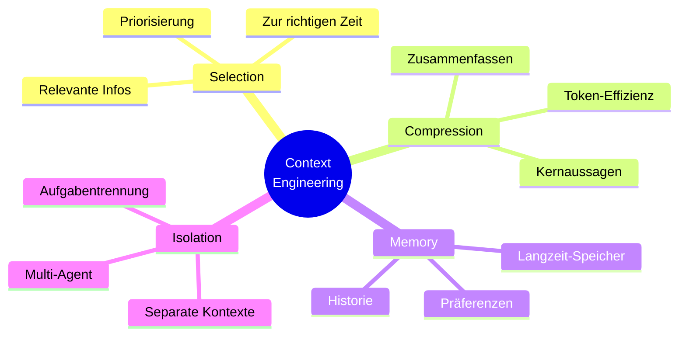

# Context Engineering
{: .no_toc }

> **Context Management: Optimierung von Context-Fenstern und Memory-Strategien**

---

# Inhaltsverzeichnis
{: .no_toc .text-delta }

1. TOC
{:toc}

---


# Was ist Context Engineering?
**Context Engineering** bedeutet: Die richtigen Informationen werden zur richtigen Zeit bereitgestellt. In kleinen Demos wirkt das oft nebensächlich. Sobald eine Anwendung aber länger läuft, mehrere Datenquellen nutzt oder wiederholt ähnliche Anfragen beantwortet, entscheidet der Kontext häufig stärker über die Qualität als der eigentliche Prompt.

Viele Probleme, die man zunächst für „Modellfehler“ hält, lassen sich auf Kontext zurückführen: Es fehlen wichtige Daten, irrelevante Inhalte verdrängen das Wesentliche, oder ältere Informationen werden zusammen mit neuen verarbeitet, obwohl sie nicht mehr passen. Genau diese Ebene behandelt Context Engineering – systematisch und nachvollziehbar.

> [!NOTE] Kernidee<br>
> Nicht der „perfekte Prompt“ allein entscheidet, sondern Qualität und Struktur des gesamten Kontexts.

## Der Unterschied zu Prompt Engineering

| Aspekt                 | Prompt Engineering                                                                     | Context Engineering                                                                                    |
| ---------------------- | -------------------------------------------------------------------------------------- | ------------------------------------------------------------------------------------------------------ |
| **Definition**         | Gezielte Formulierung geeigneter Eingabeaufforderungen <br>für KI-Modelle              | Systematisches Design und Management des gesamten <br>Kontexts für KI-Systeme                      |
| **Fokus**              | Einzelne Prompt-Optimierung                                                            | Gesamtes Kontextmanagement und -architektur                                                            |
| **Zeitrahmen**         | Kurzfristig, pro Anfrage                                                               | Langfristig, systemweit                                                                                |
| **Adressaten**         | Endnutzer, Content-Ersteller                                                           | Entwickler, Systemarchitekten                                                                          |
| **Hauptziel**          | Bessere Antworten durch optimierte Prompts                                             | Konsistente, kontextbewusste KI-Systeme                                                                |
| **Techniken**          | - Few-Shot Learning  <br>- Chain-of-Thought  <br>- Role-Playing  <br>- Template-Design | - RAG (Retrieval-Augmented Generation)  <br>- Vektorsuche  <br>- Wissensgraphen  <br>- Kontext-Caching |
| **Eingabeformat**      | Textuelle Anweisungen und Beispiele                                                    | Strukturierte Daten, Dokumente, Metadaten                                                              |
| **Skalierbarkeit**     | Begrenzt auf einzelne Interaktionen                                                    | Hochskalierbar für Enterprise-Anwendungen                                                              |
| **Wartung**            | Manuelle Anpassung der Prompts                                                         | Automatisiertes Kontext-Management                                                                     |
| **Fehlerbehandlung**   | Trial-and-Error bei Prompts                                                            | Systematische Kontext-Validierung                                                                      |
| **Messbarkeit**        | Qualitative Bewertung der Antworten                                                    | Quantitative Metriken (Relevanz, Genauigkeit)                                                          |
| **Kosten**             | Niedrig (nur Prompt-Optimierung)                                                       | Höher (Infrastruktur, Datenmanagement)                                                                 |
| **Anwendungsbereich**  | - Chatbots  <br>- Content-Generierung  <br>- Übersetzungen  <br>- Kreative Aufgaben    | - Wissensmanagementsysteme  <br>- Dokumentensuche  <br>- Expertensysteme  <br>- Enterprise-KI          |
| **Herausforderungen**  | - Prompt-Injection  <br>- Inkonsistente Ergebnisse<br>- Begrenzte Kontextlänge         | - Datenqualität  <br>- Kontext-Fragmentierung  <br>- Skalierungskosten                                 |
| **Erfolgsfaktoren**    | - Klare Anweisungen  <br>- Gute Beispiele  <br>- Strukturierte Prompts                 | - Hochwertige Datenquellen  <br>- Effiziente Suche  <br>- Kontext-Relevanz                             |
| **Tools & Frameworks** | - OpenAI Playground  <br>- LangChain PromptTemplates  <br>- Anthropic Console          | - LangChain  <br>- LlamaIndex  <br>- Pinecone  <br>- Weaviate                                          |
| **Zukunftstrend**      | Integration in größere Systeme                                                         | Weiterentwicklung zu autonomen Agenten                                                                 |
| **Best Practices**     | - Iterative Verbesserung  <br>- A/B-Testing  <br>- Klare Rollenverteilung              | - Datengovernance  <br>- Monitoring & Logging  <br>- Kontext-Versionierung                             |

## Fazit

**Prompt Engineering** hilft vor allem dabei, einzelne Anfragen besser zu formulieren. **Context Engineering** wird wichtig, sobald Informationen ausgewählt, priorisiert, gespeichert oder über mehrere Schritte hinweg konsistent bleiben müssen. In der Praxis arbeiten robuste Systeme meistens mit beidem.

## Warum ist das wichtig?

Viele Verbesserungen entstehen nicht durch „noch besseren Prompt“. Sobald Dokumente, Memory, Tools oder externe Datenquellen ins Spiel kommen, verschiebt sich der Hebel Richtung Kontextarchitektur. Dort wird entschieden, welche Informationen überhaupt ins Modell gelangen – und in welcher Form.

> [!TIP] Startpunkt<br>
> Starte mit einer kleinen, messbaren Kontext-Checkliste. Erst wenn Auswahl, Struktur und Aktualität zuverlässig funktionieren, lohnt sich zusätzliche Komplexität.


# Die vier Grundstrategien


## Kontext Auswählen(Context Selection)
Die richtigen Informationen zur richtigen Zeit bereitstellen.

Selection ist oft der erste Engpass. In vielen Prototypen wird einfach alles in den Prompt gelegt, was verfügbar ist. Kurzfristig klappt das, aber es skaliert schlecht. Gute Systeme treffen früh die Entscheidung: Was ist für diese Aufgabe gerade wirklich relevant – und was gehört nicht in den aktuellen Lauf?

**Beispiel - Versicherungsberatung:**
```
Kundenkontext:
- Alter: 35 Jahre
- Familie: 2 Kinder
- Beruf: Selbständig
- Ziel: Familienabsicherung

→ KI wählt passende Produktinformationen aus
```

## Kontext Komprimieren (Context Compression)
Nur die wichtigsten Informationen behalten.

Kompression ist keine reine „Kürzung“. Sie ist eine Qualitätsfrage. Wenn Nebensachen genauso ausführlich sind wie die entscheidenden Fakten, leidet die Trennschärfe. Gute Zusammenfassungen müssen deshalb nicht nur kürzer sein, sondern auch klar priorisiert.

**Beispiel:**
```
Lange Schadenshistorie (50 Seiten)
↓
Zusammenfassung: "3 Kleinschäden in 5 Jahren,
Gesamtschaden: 2.500€, keine Muster erkennbar"
```

## Kontext Speichern (Context Memory)
Wichtige Informationen für später aufbewahren.

Memory lohnt sich besonders, wenn Inhalte nicht bei jeder Anfrage erneut abgefragt werden sollen. Gleichzeitig sammelt sich hier schnell fachlicher und technischer Ballast an: Was einmal gespeichert wurde, bleibt oft länger im System als sinnvoll. Darum gehört zu Memory immer auch eine Regel, wann Kontext veraltet oder überschrieben werden soll.

Kontext-Caching sollte davon abgesetzt werden: Das Modell „lernt“ dabei nicht dauerhaft. Wiederkehrender Kontext, vorbereitete Dokumentauszüge oder technische Zwischenergebnisse werden nur genutzt, um Kosten, Latenz und Tokenverbrauch zu senken. Sobald Kontext nutzerabhängig, vertraulich oder möglicherweise veraltet sein kann, braucht der Cache klare Regeln für Gültigkeit und Zugriff.

**Beispiel:**
```
Kundeninteraktion 1: "Ich bevorzuge niedrige Beiträge"
↓ (gespeichert)
Kundeninteraktion 2: KI erinnert sich an Präferenz
```

## Kontext Trennen (Context Isolation)
Verschiedene Aufgaben mit separaten Kontexten bearbeiten.

Isolation wird oft erst relevant, wenn ein System komplexer wird. Spätestens bei Agenten, Werkzeugnutzung oder sensiblen Daten ist sie jedoch zentral. Nicht jede Komponente sollte denselben Kontext sehen. Saubere Trennung reduziert Fehler, macht Debugging leichter und unterstützt Compliance-Anforderungen.

**Beispiel:**
```
Agent A: Schadensprüfung (hat Zugang zu Schadensdaten)
Agent B: Kundenberatung (hat Zugang zu Produktdaten)
```


# Die drei häufigsten Fehler
> [!WARNING] Typische Ursache für Instabilität<br>
> Instabile KI-Antworten sind oft kein Modellproblem, sondern ein Kontextproblem (zu viel, widersprüchlich oder veraltet).


## Context Overload
**Problem:** Zu viele Informationen verwirren die KI
**Lösung:** Nur relevante Informationen bereitstellen

Overload entsteht nicht nur durch lange Dokumente. Auch viele kleine Hinweise, die nur teilweise passen, können den Fokus verschieben. Typisch ist dann eine Antwort, die insgesamt plausibel klingt, aber am Kern der Aufgabe vorbeigeht.

## Context Conflict
**Problem:** Widersprüchliche Informationen
**Lösung:** Informationen auf Konsistenz prüfen

Konflikte sind besonders tückisch, weil sie von außen wie zufällige Modellschwankungen aussehen können. In Wirklichkeit arbeitet die KI dann mit mehreren konkurrierenden Quellen. Ohne Priorisierungsregeln oder Versionslogik bleibt die Ausgabe instabil.

## Context Staleness
**Problem:** Veraltete Informationen
**Lösung:** Regelmäßige Updates implementieren

Veralteter Kontext fällt in Tests manchmal nicht auf, weil die Datenbasis klein und überschaubar bleibt. Im laufenden Betrieb wird genau das schnell zum Problem: Die Antwort kann formal korrekt wirken, fachlich aber falsch sein, wenn sie auf einem alten Stand beruht.


# Praktische Anwendung
## Kontext analysieren

Bevor man optimiert, braucht man Klarheit: Welche Informationen sind wirklich nötig? Die entscheidende Unterscheidung ist nicht „da oder nicht da“, sondern „kritisch, wichtig oder nur ergänzend“. Diese Priorisierung reduziert unnötigen Ballast und macht spätere Entscheidungen nachvollziehbar.

```
Frage: "Welche Versicherung brauche ich?"

Benötigte Kontextinformationen (nach Priorität):
✓ KRITISCH:
  - Alter: 32 Jahre
  - Familienstand: verheiratet, 2 Kinder (3, 7 Jahre)
  - Beruf: Software-Entwickler
  - Einkommen: 65.000€ brutto/Jahr

✓ WICHTIG:
  - Bestehende Absicherungen: KFZ-Haftpflicht, Hausratversicherung
  - Immobilienstatus: Eigenheim (Restschuld 180.000€)
  - Gesundheitsstatus: keine Vorerkrankungen

✓ ERGÄNZEND:
  - Risikobereitschaft: konservativ
  - Finanzielle Ziele: Familienabsicherung, Altersvorsorge
  - Verfügbares Budget: 200€/Monat für Versicherungen
```

## Kontext strukturieren

Struktur hilft nicht nur der KI, sondern auch der Entwicklung. Sobald klar getrennte Abschnitte für Kundenkontext, Produktkontext und Beratungsziel existieren, lassen sich Fehler schneller lokalisieren. Unstrukturierte Kontextblöcke sind dagegen schwer zu pflegen und kaum testbar.

```
PROMPT-STRUKTUR:

=== KUNDENKONTEXT ===
Demografisch:
- Person: 32 Jahre, männlich, verheiratet
- Familie: 2 Kinder (3, 7 Jahre), Hausfrau-Ehefrau
- Wohnort: Eigenheim, Restschuld 180.000€

Finanziell:
- Einkommen: 65.000€ brutto/Jahr (alleinverdienend)
- Budget Versicherungen: 200€/Monat
- Risikobereitschaft: konservativ

=== PRODUKTKONTEXT ===
Bestehende Absicherung:
- KFZ-Haftpflicht: vollständig
- Hausratversicherung: 50.000€ Versicherungssumme
- Keine weitere Absicherung vorhanden

Relevante Produktkategorien:
- Risikolebensversicherung (Familienabsicherung)
- Berufsunfähigkeitsversicherung (Einkommensschutz)
- Private Unfallversicherung
- Rechtsschutzversicherung

=== BERATUNGSKONTEXT ===
Anfrage: "Welche Versicherung brauche ich?"
Beratungsziel: Bedarfsanalyse und Produktempfehlung
Compliance: Versicherungsberatung nach §34d GewO
```

## Kontext optimieren

Optimieren bedeutet hier nicht, den Prompt „immer kürzer“ zu machen. Ziel ist vielmehr ein gutes Verhältnis aus Kürze, Klarheit und fachlicher Relevanz. So spart man Tokens, ohne die entscheidenden Signale zu verlieren.

```
OPTIMIERUNGSREGELN für KI-Verarbeitung:

1. TOKEN-EFFIZIENZ (Max. 500 Token für Kontext):
   ❌ "Der Kunde ist 32 Jahre alt und arbeitet als Software-Entwickler..."
   ✅ "Kunde: 32J, Software-Dev, 65k€, verheiratet, 2 Kinder"

2. RELEVANZ-FILTERING:
   Für Versicherungsberatung IMMER relevant:
   - Alter, Familienstand, Beruf, Einkommen
   - Bestehende Policen
   - Gesundheitsstatus (wenn abgefragt)

   SITUATIV relevant:
   - Hobbys (nur bei Unfallversicherung)
   - Immobilien (nur bei Sachversicherungen)

3. STRUKTURIERUNG für LLM:
```

AUFTRAG: Versicherungsbedarfsanalyse KUNDE: 32J, Soft-Dev, 65k€, verheiratet, 2Ki(3,7J), Eigenheim(180k€ Schuld) BESTAND: KFZ-Haft, Hausrat(50k€) BUDGET: 200€/Monat PRÄFERENZ: konservativ ZIEL: Familien-/Einkommensabsicherung

AUFGABE: Identifiziere Versicherungslücken und empfehle passende Produkte mit Begründung.

## Konsistenz-Checkliste:

> [!SUCCESS] Qualitätsgate<br>
> Diese Checkliste eignet sich als "Definition of Done" vor jedem produktiven Prompt-Update.

```
- [ ] Gleiche Kategorien in allen Abschnitten verwendet
- [ ] Konkrete Beispiele statt Platzhalter
- [ ] Token-Limits definiert und eingehalten
- [ ] Relevanz-Kriterien spezifiziert
- [ ] Optimierung messbar (Token-Reduktion, Strukturierung)
```

Die Checkliste ist bewusst schlicht gehalten. In echten Projekten reicht oft schon eine kleine, konsequent angewendete Qualitätsroutine, um die häufigsten Kontextfehler zu vermeiden. Erst danach lohnt sich feinere Optimierung.

# Einfache Tools und Techniken
## Tool 1: Context-Checkliste
```
☐ Sind alle notwendigen Informationen vorhanden?
☐ Sind die Informationen aktuell?
☐ Gibt es Widersprüche?
☐ Ist der Kontext nicht zu lang?
☐ Ist der Kontext relevant für die Aufgabe?
```

## Tool 2: Kontext-Templates
```
**Kundenberatung-Template:**
KUNDE: [Name, Alter, Beruf]
SITUATION: [Aktuelle Lebensumstände]
ZIEL: [Was möchte der Kunde erreichen?]
BUDGET: [Verfügbare Mittel]
PRÄFERENZEN: [Besondere Wünsche]
```

## Tool 3: Einfache Kontextregeln
```
1. Immer aktuellste Daten verwenden
2. Maximal 3 Hauptinformationen pro Kontext
3. Widersprüche sofort klären
4. Kundenspezifische Informationen priorisieren
5. Rechtliche Anforderungen immer beachten
```


# Messbare Verbesserungen
## Vorher vs. Nachher

**Ohne Context Engineering:**
- ❌ 45% Fehlerrate bei Empfehlungen
- ❌ 3+ Nachfragen pro Beratung
- ❌ 15 Min. Bearbeitungszeit

**Mit Context Engineering:**
- ✅ 12% Fehlerrate bei Empfehlungen
- ✅ 1 Nachfrage pro Beratung
- ✅ 8 Min. Bearbeitungszeit

## Erfolgs-Metriken

> [!TIP] Wirkung sichtbar machen<br>
> Sinnvoll sind pro Use Case zwei bis drei Metriken, etwa Fehlerrate, Nachfragen oder Bearbeitungszeit. Der Vorher-Nachher-Vergleich zeigt dann konkret, ob eine Kontextänderung tatsächlich wirkt.
```
Genauigkeit: +65%
Effizienz: +47%
Kundenzufriedenheit: +30%
```


# Sofort umsetzbare Tipps
## Do's
- Starte mit einfachen Kontext-Checklisten
- Feedback gezielt einsammeln
- Erfolgreiche Kontextmuster dokumentieren
- Mit den häufigsten Anwendungsfällen beginnen
- Verbesserungen kontinuierlich messen

## Don'ts
- Nicht zu kompliziert starten
- Nicht auf einmal alle Kontextquellen ändern
- Nicht optimieren, ohne zu messen
- Nicht vergessen, das Team mitzunehmen
- Nicht auf Feedback verzichten

> [!WARNING] Häufiger Rollout-Fehler<br>
> Unmessbare Kontextänderungen erschweren die Ursachenanalyse und führen zu Ergebnissen, die sich nur schwer reproduzieren lassen.

---

## Abgrenzung zu verwandten Dokumenten

| Dokument | Frage |
|---|---|
| [Prompt Engineering](./prompt-engineering.html) | Wie wird eine einzelne Anfrage formuliert, statt den Gesamtkontext eines Systems zu gestalten? |
| [RAG-Konzepte](./rag-konzepte.html) | Wann ist Retrieval nur ein Teil der Kontextstrategie? |
| [Fine-Tuning](../04-modelle-provider/fine-tuning.html) | Wann wird Verhalten ins Modell verlagert statt zur Laufzeit organisiert? |


---

**Version:**    1.1<br>
**Stand:** Mai 2026<br>
**Kurs:** Generative KI. Verstehen. Anwenden. Gestalten.
