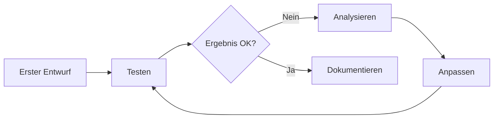

# Prompt Engineering
{: .no_toc }

> **Ein guter Prompt beschreibt Aufgabe, Kontext, Grenzen und Ausgabe so konkret, dass ein anderer Entwickler ihn testen könnte.**

---

# Inhaltsverzeichnis
{: .no_toc .text-delta }

1. TOC
{:toc}

---

## Überblick

Ein Prompt ist die Schnittstelle zwischen Aufgabe, Kontext und Sprachmodell. Die Qualität der Antwort hängt nicht nur davon ab, **was** gefragt wird, sondern auch davon, welche Informationen, Beispiele, Grenzen und Ausgabeformate das Modell erhält.

Für KI-Agenten ist Prompt Engineering besonders relevant, weil Prompts nicht nur Antworten formulieren lassen, sondern Verhalten steuern:

| Kontext | Bedeutung |
|---------|-----------|
| **System-Prompts** | Definieren Rolle, Fähigkeiten und Grenzen des Agenten |
| **Tool-Beschreibungen** | Bestimmen, wann und wie ein Agent Werkzeuge einsetzt |
| **Reasoning-Prompts** | Steuern den Denkprozess bei komplexen Aufgaben |
| **Output-Formatierung** | Garantieren strukturierte, verarbeitbare Antworten |

**Kernprinzip:** Ein gut formulierter Prompt reduziert Interpretationsspielraum. Er macht sichtbar, welche Aufgabe gelöst werden soll, welche Daten relevant sind, welche Werkzeuge verwendet werden dürfen und woran eine gute Antwort erkennbar ist.

> [!NOTE] Kernbotschaft<br>
> Prompt-Qualität ist in Agentensystemen ein zentraler Steuerhebel für Zuverlässigkeit und Reproduzierbarkeit.

---

## Grundlegende Prompt-Strukturen

Effektive Prompts trennen Anweisung, Kontext, Beispiele, Eingabe und Ausgabeformat. Diese Trennung ist wichtiger als eine bestimmte Prompt-Schablone, weil Modelle besonders bei längeren Aufgaben sonst Kontext, Regeln und Nutzereingabe vermischen.

```text
Prompt-Bausteine:

AUFGABE:
- Was soll gelöst werden?

KONTEXT:
- Welche Informationen sind relevant?

REGELN:
- Was darf nicht passieren?

BEISPIELE:
- Wie sieht eine gute Ausgabe aus?

EINGABE:
- Welche konkrete Anfrage oder welches Dokument soll verarbeitet werden?

AUSGABEFORMAT:
- In welchem Format soll die Antwort erscheinen?
```

Bei komplexen Prompts können klare Abschnittsnamen oder XML-ähnliche Tags helfen, etwa `<instructions>`, `<context>`, `<examples>` und `<input>`. Entscheidend ist nicht das Tag selbst, sondern die eindeutige Trennung der Funktionen.

Typischer Fehler: Beispiele, Kontext und eigentliche Aufgabe in einem Fließtext zu mischen. Das Modell muss dann erraten, welche Teile Anweisung sind und welche Teile nur Daten darstellen.

## Zero-Shot, Few-Shot und Reasoning

### Zero-Shot Prompting

Das Modell erhält eine Aufgabe ohne Beispiele und löst sie basierend auf seinem Vorwissen.

```text
Prompt-Struktur: Zero-Shot

System:
- Rolle: hilfreicher Assistent.

Aufgabe:
- Klassifiziere die folgende E-Mail als "dringend" oder "normal".

Eingabe:
- E-Mail-Text
```

**Geeignet für:**
- Einfache, eindeutige Aufgaben
- Allgemeinwissen-Fragen
- Standardformatierungen

### Few-Shot Prompting

Das Modell erhält Beispiele, die das gewünschte Verhalten demonstrieren.

```text
Prompt-Struktur: Few-Shot

System:
- Klassifiziere E-Mails nach Dringlichkeit.

Beispiel 1:
- Eingabe: Betreff "Server ausgefallen"
- Ausgabe: dringend

Beispiel 2:
- Eingabe: Betreff "Quartalsbericht verfügbar"
- Ausgabe: normal

Neue Aufgabe:
- Eingabe: aktueller E-Mail-Betreff
- Ausgabe: dringend oder normal
```

**Geeignet für:**
- Spezifische Formatvorgaben
- Domänenspezifische Klassifikationen
- Konsistente Ausgabestrukturen

Beispiele wirken am besten, wenn sie echte Grenzfälle abdecken. Drei fast identische Beispiele verbessern das Format, aber selten die Robustheit. Ein gutes Few-Shot-Set enthält typische Fälle, schwierige Fälle und mindestens ein Negativbeispiel.

### Reasoning und Arbeitsplan

Bei mehrstufigen Aufgaben hilft es oft, das Modell zu einer geordneten Bearbeitung anzuhalten. Dabei muss nicht jeder interne Gedankenschritt ausgegeben werden. Für viele Anwendungen genügt ein kurzer Arbeitsplan, eine Begründung der Entscheidung oder eine strukturierte Prüfung entlang fester Kriterien.

> [!WARNING] Reasoning gezielt einsetzen<br>
> Mehr Nachdenken verbessert komplexe Aufgaben, erhöht aber Token-Verbrauch und Latenz. Für einfache Klassifikation oder Formatierung ist eine direkte Antwort mit klarem Schema meist stabiler.

```text
Prompt-Struktur: Arbeitsplan

Aufgabe:
- Prüfe die folgende Aufgabe entlang der Kriterien.

Arbeitsplan:
1. Bestimme, was gegeben ist.
2. Bestimme, was gesucht wird.
3. Lege die nötigen Schritte fest.
4. Formuliere die Antwort im vorgegebenen Format.

Eingabe:
- konkrete Aufgabe

Ausgabe:
- Ergebnis
- kurze Begründung
- Unsicherheit oder offene Annahmen
```

**Geeignet für:**
- Mathematische Probleme
- Logische Schlussfolgerungen
- Mehrstufige Analysen

Nicht geeignet, wenn die Aufgabe deterministisch durch Code, Retrieval oder ein Tool gelöst werden sollte. Ein Prompt ersetzt keine Berechnung, keine Datenbankabfrage und keine Schema-Validierung.

---

## System-Prompts für Agenten

Der System-Prompt definiert die Identität und das Verhalten eines Agenten. Er ist der wichtigste Hebel für konsistentes Agentenverhalten.

> [!TIP] Priorisierung im Prompt<br>
> Kritische Regeln zuerst platzieren (Sicherheit, Grenzen, Eskalation), danach Stil und Tonalität.

### Struktur eines effektiven System-Prompts

Ein guter System-Prompt beantwortet vier Fragen:

| Frage | Inhalt |
|-------|--------|
| **Wer?** | Rolle und Expertise des Agenten |
| **Was?** | Aufgabenbereich und Fähigkeiten |
| **Wie?** | Verhaltensregeln und Tonalität |
| **Was nicht?** | Explizite Einschränkungen |

### Beispiel: Vollständiger Agent-System-Prompt

```text
System-Prompt: technischer Support-Agent

ROLLE:
- Experte für die Produkte X, Y und Z
- Erste Anlaufstelle für technische Fragen
- Eskalation an Menschen bei komplexen Fällen

FÄHIGKEITEN:
- Zugriff auf die Wissensdatenbank (Tool: search_knowledge)
- Ticket-Erstellung im Helpdesk (Tool: create_ticket)
- Prüfung des Kundenstatus (Tool: check_customer)

VERHALTENSREGELN:
- Antworte präzise und lösungsorientiert
- Frage nach, wenn Informationen fehlen
- Bestätige Verständnis bei komplexen Problemen
- Verwende technische Begriffe nur mit Erklärung

EINSCHRÄNKUNGEN:
- Keine Preisauskünfte oder Vertragsänderungen
- Keine Zusagen ohne Rücksprache mit dem Vertrieb
- Bei Sicherheitsfragen immer an Security-Team eskalieren
```

Bei agentischen Prompts müssen zusätzlich Autonomie und Persistenz geklärt werden. Ein Agent braucht Regeln dafür, wann er selbst weiterarbeitet, wann er nachfragt, welche Tools Vorrang haben und wie er Fortschritt oder Ergebnis zurückmeldet. Ohne diese Grenzen entstehen zwei typische Fehler: Der Agent fragt zu früh nach, obwohl er mit vorhandenen Informationen weiterarbeiten könnte, oder er arbeitet zu lange autonom, obwohl eine Freigabe nötig wäre.

### Typische Fehler bei System-Prompts

| Fehler | Problem | Lösung |
|--------|---------|--------|
| Zu vage | Agent verhält sich inkonsistent | Konkrete Beispiele und Regeln |
| Zu lang | Wichtige Anweisungen gehen unter | Priorisieren, strukturieren |
| Widersprüchlich | Agent "halluziniert" Kompromisse | Eindeutige Hierarchie |
| Keine Grenzen | Agent überschreitet Kompetenz | Explizite Einschränkungen |

---

## Tool-Beschreibungen optimieren

Die Beschreibung eines Tools bestimmt, ob und wann ein Agent es korrekt einsetzt. Eine präzise Beschreibung ist entscheidender als der Code dahinter.

### Anatomie einer guten Tool-Beschreibung

```text
Tool: search_knowledge

Zweck:
- Durchsucht die interne Wissensdatenbank nach relevanten Artikeln.

Wann verwenden:
- bei Fragen zu Produktfunktionen
- bei Fehlermeldungen und deren Lösungen
- bei How-To-Anfragen

Wann nicht verwenden:
- bei Fragen zu Preisen oder Verträgen
- bei persönlichen Kundendaten
- wenn die Antwort bereits sicher bekannt ist

Eingaben:
- query: Suchbegriff oder Frage in natürlicher Sprache
- max_results: maximale Anzahl zurückgegebener Artikel

Ausgabe:
- Liste relevanter Wissensartikel mit Titel und Zusammenfassung
```

### Checkliste für Tool-Beschreibungen

> [!SUCCESS] Qualitätskriterium<br>
> Wenn ein Tool klar beschreibt, wann es verwendet werden soll und wann nicht, sinken Fehlaufrufe und Halluzinationen deutlich.

- [ ] **Zweck klar benannt** – Was macht das Tool?
- [ ] **Anwendungsfälle** – Wann soll es verwendet werden?
- [ ] **Gegenanzeigen** – Wann soll es NICHT verwendet werden?
- [ ] **Parameter erklärt** – Was bedeuten die Eingaben?
- [ ] **Rückgabewert beschrieben** – Was kommt zurück?

Bei Agenten mit mehreren Werkzeugen sollte außerdem die Tool-Auswahl selbst promptbar sein. Das Modell braucht klare Priorität: vorhandene strukturierte Tools vor Shell- oder Freitextlösungen, Retrieval vor Raten, Validierung vor finaler Ausgabe. Spezialwerkzeuge wie semantische Suche, MCP-Server oder eigene Dateitools funktionieren besser, wenn ihre Grenzen und erwarteten Rückgaben getestet werden.

---

## Ausgabeformatierung

Strukturierte Ausgaben machen Agentenantworten verarbeitbar und konsistent.

### Explizite Formatvorgaben

```text
Prompt-Struktur: explizite Formatvorgabe

Aufgabe:
- Analysiere den folgenden Text und extrahiere die Kernaussagen.

Eingabe:
- Text

Antwortformat:
HAUPTTHEMA: [Ein Satz]
KERNAUSSAGEN:
- [Punkt 1]
- [Punkt 2]
- [Punkt 3]
STIMMUNG: [positiv/neutral/negativ]
KONFIDENZ: [hoch/mittel/niedrig]
```

### Strukturierte Ausgaben mit Pydantic

Für maschinelle Weiterverarbeitung bietet LangChain typsichere Ausgaben:

> [!TIP] Für Produktion bevorzugen<br>
> Bei Weiterverarbeitung durch Code sind strukturierte Ausgaben mit Schema-Validierung robuster als freie Textantworten.

```text
Schema: Analyse (Pydantic)

Felder:
- hauptthema: zentrales Thema in einem Satz
- kernaussagen: Liste der wichtigsten Punkte
- stimmung: positiv, neutral oder negativ
- konfidenz: Sicherheit der Analyse zwischen 0.0 und 1.0

Ablauf:
1. Das Modell erhält das Schema als erwartete Ausgabeform.
2. Das Modell analysiert den Text.
3. Die Antwort wird gegen das Schema geprüft.
4. Die Anwendung kann gezielt auf Felder wie hauptthema oder konfidenz zugreifen.
```

---

## Fortgeschrittene Strategien

### Role-Prompting

Die Zuweisung einer spezifischen Rolle verbessert domänenspezifische Antworten.

```text
Prompt-Struktur: Role-Prompting

Rollenbibliothek:
- jurist: erfahrener Rechtsanwalt mit Spezialisierung auf IT-Recht
- mediziner: Facharzt für Innere Medizin mit langjähriger Erfahrung
- entwickler: Senior Software Engineer mit Erfahrung in Python und Cloud-Architekturen

Ablauf:
1. Wähle die passende Rolle zur Aufgabe.
2. Setze diese Rolle als System-Anweisung.
3. Stelle die konkrete Frage als Nutzereingabe.
```

### Self-Consistency

Mehrere Antworten generieren und die häufigste oder konsistenteste wählen.

```text
Strategie: Self-Consistency

Eingaben:
- question: zu beantwortende Frage
- n: Anzahl unabhängiger Antwortversuche

Ablauf:
1. Generiere n Antworten zur gleichen Frage.
2. Vergleiche die Antworten.
3. Bestimme die häufigste, stabilste oder am besten begründete Antwort.
4. Gib diese aggregierte Antwort zurück.
```

### Retrieval-Augmented Prompting

Kontext aus externen Quellen in den Prompt integrieren:

```text
Prompt-Struktur: Retrieval-Augmented Prompting

Anweisung:
- Beantworte die Frage nur auf Basis des bereitgestellten Kontexts.
- Wenn die Antwort nicht im Kontext steht, sage das ausdrücklich.

Eingaben:
- Kontext aus Retrieval
- Frage

Ausgabe:
- Antwort mit Bezug auf den Kontext
```

### Long-Context Prompting

Bei langen Dokumenten oder vielen Eingabedaten reicht eine gute Aufgabenformulierung nicht aus. Der Prompt muss dann die Daten so anordnen, dass das Modell sie zuverlässig zuordnen kann. Lange Dokumente gehören in einen klar markierten Kontextbereich; die eigentliche Frage und die Ausgabeanforderung stehen danach. Das reduziert die Gefahr, dass Metadaten, Beispiele und Nutzereingaben miteinander verwechselt werden.

```text
<context>
Dokumente, Auszüge oder Recherchetreffer
</context>

<instructions>
Beantworte die Frage nur auf Basis des Kontextes.
Wenn der Kontext keine Antwort enthält, gib "Nicht im Kontext" aus.
</instructions>

<question>
Konkrete Frage
</question>
```

In der Praxis relevant, wenn Dokumente, Tabellen, Tool-Ergebnisse und Beispiele im selben Prompt stehen. Ohne saubere Trennung steigt die Wahrscheinlichkeit, dass das Modell ein Beispiel als echten Inhalt behandelt oder eine Regel nur auf den ersten Abschnitt anwendet.

### Agentische Coding-Prompts

Coding-Agenten brauchen andere Prompts als Chat-Assistenten. Neben der Aufgabe müssen Arbeitsregeln für Codebase-Erkundung, Tool-Nutzung, Änderungsscope, Tests und Abschlussbericht festgelegt werden. Besonders wichtig sind persistente Projektregeln, etwa in einer `AGENTS.md`, weil sie vor jeder konkreten Aufgabe geladen werden und lokale Konventionen sichtbar machen.

Ein guter Coding-Agent-Prompt legt fest:

- welche Such- und Lesewerkzeuge bevorzugt werden,
- wann Dateien geändert werden dürfen,
- wie bestehende Änderungen anderer Entwickler behandelt werden,
- welche Tests nach Änderungen laufen sollen,
- wie Ergebnisse knapp und nachvollziehbar berichtet werden.

Grenze: Solche Prompts verbessern den Arbeitsrahmen, ersetzen aber kein gutes Tooling. Für zuverlässige Codeänderungen braucht der Agent passende Datei-, Patch-, Test- und Suchwerkzeuge.

---

## Best Practices

### Die CLEAR-Methode

| Buchstabe | Prinzip | Umsetzung |
|-----------|---------|-----------|
| **C** | Concise | Präzise formulieren, Füllwörter vermeiden |
| **L** | Logical | Logische Struktur, klare Reihenfolge |
| **E** | Explicit | Erwartungen explizit benennen |
| **A** | Adaptive | An Aufgabe und Modell anpassen |
| **R** | Reproducible | Konsistente Ergebnisse ermöglichen |

### Iteratives Prompt-Design



**Empfohlener Workflow:**

1. **Baseline erstellen** – Einfachster funktionierender Prompt
2. **Schwachstellen identifizieren** – Wo versagt der Prompt?
3. **Gezielt verbessern** – Eine Änderung pro Iteration
4. **Testen mit Varianten** – Verschiedene Eingaben prüfen
5. **Dokumentieren** – Warum funktioniert diese Version?

Prompts sollten gegen konkrete Testfälle bewertet werden, nicht nur gegen einen guten Beispieloutput. Für Klassifikation zählen Fehlerraten pro Klasse, für Extraktion zählen fehlende oder falsche Felder, für Agenten zählen Tool-Fehlaufrufe, Abbruchstellen und unnötige Rückfragen.

### Prompt-Versionierung

```text
Prompt-Versionierung:

Version classify_email_v1:
- Klassifiziere eine E-Mail als dringend oder normal.

Version classify_email_v2:
- Klassifiziere eine E-Mail nach expliziten Kriterien.
- dringend: Systemausfälle, Sicherheitsprobleme, Deadlines unter 24 Stunden
- normal: alle anderen Anfragen

Produktion:
- Aktive Prompt-Version dokumentieren
- Änderungen nachvollziehbar versionieren
- Testergebnisse pro Version festhalten
```

---

## Häufige Fehler und Lösungen

> [!WARNING] Häufigster Praxisfehler<br>
> Ambige Anweisungen sind eine Hauptursache für instabile Ergebnisse. Erst Präzision im Prompt, dann Modellwechsel.

### Fehler: Ambige Anweisungen

**Problem:**
```text
Vage und mehrdeutig:

Aufgabe:
- Fasse das zusammen.

Eingabe:
- Text
```

**Lösung:**
```text
Präzise und eindeutig:

Aufgabe:
- Erstelle eine Zusammenfassung in 3 Stichpunkten.

Regeln:
- Jeder Punkt maximal 15 Wörter.
- Fokus auf Handlungsempfehlungen.

Eingabe:
- Text
```

### Fehler: Fehlende Beispiele bei komplexen Formaten

**Problem:**
```text
Erwartet ein spezifisches Format ohne Beispiel:

Aufgabe:
- Extrahiere Entitäten aus dem Text.

Eingabe:
- Text
```

**Lösung:**
```text
Mit Beispiel (Few-Shot):

Aufgabe:
- Extrahiere Entitäten im Format: ENTITÄT (TYP)

Beispiel:
- Text: "Angela Merkel besuchte gestern Berlin."
- Entitäten: Angela Merkel (PERSON), Berlin (ORT), gestern (ZEIT)

Neue Eingabe:
- Text
```

### Fehler: Widersprüchliche Anweisungen

**Problem:**
```text
Widersprüchlich:

Aufgabe:
- Erkläre das Thema kurz und detailliert.

Problem:
- "kurz" und "detailliert" sind ohne Priorisierung schwer gleichzeitig erfüllbar.
```

**Lösung:**
```text
Klare Priorisierung:

Aufgabe:
- Erkläre das Thema in zwei getrennten Teilen.

Struktur:
1. Kurzfassung: 1-2 Sätze mit der Kernaussage
2. Details: 3-5 Sätze mit wichtigen Aspekten

Eingabe:
- Thema
```

---

## Zusammenfassung

Effektives Prompt Engineering basiert auf vier Säulen:

| Säule | Kernaspekt |
|-------|------------|
| **Klarheit** | Eindeutige, strukturierte Anweisungen |
| **Kontext** | Relevante Informationen und Beispiele |
| **Kontrolle** | Explizite Formatvorgaben und Grenzen |
| **Evaluation** | Testfälle, Fehlermuster und Versionierung |

**Für KI-Agenten besonders wichtig:**

- **System-Prompts** definieren das Gesamtverhalten
- **Tool-Beschreibungen** steuern die Werkzeugnutzung
- **Strukturierte Ausgaben** ermöglichen Weiterverarbeitung
- **Iteratives Testen** führt zu robusten Prompts

Im weiteren Kursverlauf werden diese Strategien praktisch in LangChain-Agents angewendet.

---

## Ergänzende Ressourcen

| Ressource | Nutzen |
|---|---|
| [Claude: Prompting best practices](https://platform.claude.com/docs/en/build-with-claude/prompt-engineering/claude-prompting-best-practices) | Klare Anweisungen, Beispiele, XML-Strukturierung, Long-Context-Prompting und agentische Systeme |
| [OpenAI Cookbook: Codex Prompting Guide](https://developers.openai.com/cookbook/examples/gpt-5/codex_prompting_guide) | Prompting für Coding-Agenten, Tool-Nutzung, persistente Projektregeln und Abschlusskommunikation |


---

## Abgrenzung zu verwandten Dokumenten

| Dokument | Frage |
|---|---|
| [Context Engineering](./context-engineering.html) | Wie wird aus einzelnen Prompts ein belastbarer Gesamtkontext? |
| [RAG-Konzepte](./rag-konzepte.html) | Wann reicht bessere Promptformulierung nicht mehr ohne Retrieval? |
| [Fine-Tuning](../04-modelle-provider/fine-tuning.html) | Wann stößt Prompting an Grenzen, die Training besser löst? |

---

**Version:** 1.1<br>
**Stand:** Mai 2026<br>
**Kurs:** Generative KI. Verstehen. Anwenden. Gestalten.
