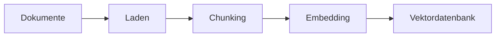
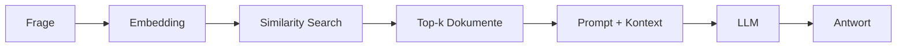

# RAG-Konzepte
{: .no_toc }

> **Retrieval Augmented Generation im Detail – Architektur, Strategien und Best Practices**

---

# Inhaltsverzeichnis
{: .no_toc .text-delta }

1. TOC
{:toc}

---

## Überblick: Was ist RAG?

In der Praxis stoßen Large Language Models oft an Grenzen: Wissen ist **nicht aktuell genug**, es fehlt **firmeninternes Fachwissen**, und große Dokumentmengen lassen sich nicht einfach in einen einzigen Prompt packen. Genau dafür ist RAG gedacht.

RAG ist keine Magie, sondern ein technischer Schritt mit einem klaren Ziel: relevantes Wissen zur Laufzeit in den Antwortprozess einzubauen. Ob sich das lohnt, hängt davon ab, ob genau dieses fehlende oder externe Wissen im konkreten Fall wirklich die Ursache für schlechte Ergebnisse ist. Wenn eine Aufgabe auch ohne Retrieval sauber funktioniert, macht zusätzliches Suchen das System häufig nur langsamer und fehleranfälliger.

| Limitation | Beschreibung |
|------------|--------------|
| **Wissens-Cutoff** | Das Modell kennt nur Informationen bis zum Trainingszeitpunkt |
| **Kein Domänenwissen** | Firmeninterne Dokumente, Fachrichtlinien oder aktuelle Daten fehlen |
| **Halluzination** | Bei Wissenslücken werden Antworten plausibel, aber falsch |
| **Kontextlimit** | Nicht alle relevanten Dokumente passen in einen einzelnen Prompt |

RAG ergänzt das Modell nicht durch neues Training. Stattdessen kommt ein zusätzlicher Arbeitsschritt hinzu: erst wird gesucht, dann wird formuliert. Genau diese Trennung hilft oft, Missverständnisse aufzudecken. Wenn am Ende eine falsche Antwort herauskommt, liegt es nicht automatisch am LLM: Die Schwäche kann im Retrieval liegen – oder im Chunking, in der Kontextzusammenstellung oder im Prompt.

```
Frage → Suche relevante Dokumente → Füge Kontext zum Prompt → LLM generiert Antwort
```

> [!NOTE] Kernidee RAG<br>
> Das LLM bekommt genau den Kontext, der zur aktuellen Frage passt – nicht mehr und nicht weniger. Ohne passenden Kontext entstehen im Zweifel trotzdem Antworten, die nicht belastbar sind.

---

## Die RAG-Architektur

Ein RAG-System lässt sich in zwei große Phasen aufteilen: **Datensammlung/Indexierung** sowie **Abruf & Erweiterung/Retrieval + Generation**. Diese Struktur ist nicht nur organisatorisch sinnvoll: Fehler in der ersten Phase zeigen sich später oft so, als wäre das Modell das Problem. Wenn Chunks unsauber geschnitten oder Metadaten schlecht gepflegt sind, hilft auch ein sehr starkes LLM nur begrenzt.


### Datensammlung/Indexierungsphase

Die Datensammlung ist die Basis jedes RAG-Systems (Retrieval-Augmented Generation). Hier werden Informationen aus unterschiedlichen Quellen – zum Beispiel PDFs, Webseiten, Datenbanken oder internen Dokumenten – zusammengeführt und so aufbereitet, dass später gesucht werden kann.

Wie gut das System später Treffer liefert, hängt stark von drei Dingen ab: **Welche Quellen** genutzt werden, **wie aktuell** sie sind und **wie sauber** die Daten strukturiert werden. Selbst kleine Ungenauigkeiten in dieser Phase wirken sich auf die Antwortqualität aus.



| Schritt       | Beschreibung                                 | Typische Tools                          |     |
| ------------- | -------------------------------------------- | --------------------------------------- | --- |
| **Laden**     | Dokumente aus verschiedenen Quellen einlesen | TextLoader, PyPDFLoader, WebBaseLoader  |     |
| **Chunking**  | Große Dokumente in kleinere Teile zerlegen   | RecursiveCharacterTextSplitter          |     |
| **Embedding** | Textchunks in Vektoren umwandeln             | OpenAIEmbeddings, HuggingFaceEmbeddings |     |
| **Speichern** | Vektoren in Datenbank ablegen                | ChromaDB, FAISS, Pinecone               |     |

### Abruf & Erweiterung

In der Phase „Abruf & Erweiterung“ holt sich das RAG-System gezielt Informationen aus der Wissensbasis. Die Benutzeranfrage wird dazu mit den gespeicherten Dokumenten verglichen – meist über semantische Suche anhand von Embeddings. Die gefundenen Inhalte werden dann dem Sprachmodell als Kontext bereitgestellt. Dadurch kann das Modell fundierter, näher am Dokument und stärker quellenbezogen antworten.



| Schritt | Beschreibung |
|---------|--------------|
| **Query-Embedding** | Die Frage wird in denselben Vektorraum übersetzt |
| **Similarity Search** | Es werden die ähnlichsten Dokumentvektoren gefunden |
| **Kontext-Erstellung** | Gefundene Chunks werden zum Prompt hinzugefügt |
| **Generation** | Das LLM formuliert die Antwort anhand des Kontexts |

---

## Embeddings: Text als Vektor

Embeddings machen semantische Suche möglich. Der Text wird dabei in Zahlenfolgen umgewandelt, sodass Ähnlichkeit nicht nur über Worttreffer, sondern über Bedeutungsnähe gemessen werden kann. Ein konkretes Beispiel: Ein System kann „Fahrzeug“ finden, obwohl in der Frage „Auto“ steht.

Trotzdem sollte man Embeddings nicht überschätzen. Vektoren lösen nicht automatisch Probleme mit schlechter Dokumentstruktur, unpräzisen Queries oder schwachen Metadaten. Häufig sind sie nötig – aber sie reichen allein meistens nicht.

### Konzept

```
"Der Hund spielt im Park"     → [0.12, -0.45, 0.78, ..., 0.33]  (1536 Dim.)
"Die Katze liegt im Garten"   → [0.15, -0.42, 0.71, ..., 0.29]  (ähnlich!)
"Quantenmechanik ist komplex" → [-0.89, 0.23, -0.11, ..., 0.67] (anders!)
```

### Verfügbare Embedding-Modelle

| Modell | Dimensionen | Kosten | Qualität |
|--------|-------------|---------|----------|
| `text-embedding-3-small` (OpenAI) | 1536 | ~$0.02/1M Tokens | ⭐⭐⭐⭐ |
| `text-embedding-3-large` (OpenAI) | 3072 | ~$0.13/1M Tokens | ⭐⭐⭐⭐⭐ |
| `all-MiniLM-L6-v2` (HuggingFace) | 384 | Kostenlos | ⭐⭐⭐ |
| `multilingual-e5-large` (HuggingFace) | 1024 | Kostenlos | ⭐⭐⭐⭐ |

### Ähnlichkeitsmaße

Die Ähnlichkeit zwischen Vektoren wird über mathematische Kennzahlen berechnet:

| Maß | Beschreibung | Wertebereich |
|-----|--------------|--------------|
| **Cosine Similarity** | Winkel zwischen Vektoren | -1 bis 1 |
| **Euclidean Distance** | Geometrischer Abstand | 0 bis ∞ |
| **Dot Product** | Skalarprodukt | -∞ bis ∞ |

**Cosine Similarity** ist der Standard, weil sie vor allem die „Richtung“ der Bedeutungen vergleicht – unabhängig von der Vektorlänge.

### Beispiel: Embeddings erzeugen

```text
Embedding-Erzeugung:

Embedding-Modell wählen:
- zum Beispiel ein kleines, schnelles Modell für erste Tests
- oder ein größeres Modell für höhere Suchqualität

Query-Embedding:
1. Nutzerfrage übernehmen.
2. Frage in einen Vektor umwandeln.

Dokument-Embeddings:
1. Dokumente in Chunks zerlegen.
2. Jeden Chunk in einen Vektor umwandeln.
3. Vektoren zusammen mit Text, Quelle und Metadaten speichern.
4. Kuratierte Stichwörter als Metadaten ergänzen.
```

### Metadaten für die Indexierung

Beim Vektorisieren sollte nicht nur der Text gespeichert werden. Jeder Chunk braucht Metadaten, damit Treffer später gefiltert, eingeordnet und nachvollziehbar gemacht werden können. Dazu zählen technische Infos wie Quelle und Kapitel – und zusätzlich bewusst gepflegte Stichwörter.

```text
Metadaten pro Chunk:

Pflichtfelder:
- source: Ursprungsdokument oder URL
- title: Dokumenttitel
- section: Kapitel oder Abschnitt
- chunk_id: eindeutige Chunk-Kennung

Hilfreiche Zusatzfelder:
- date: Veröffentlichungs- oder Aktualisierungsdatum
- category: Fachbereich oder Dokumenttyp
- keywords: kuratierte Stichwörter
- synonyms: wichtige Synonyme oder Schreibvarianten

Beispiel für keywords:
- Passwort-Policy
- Zugangsdaten
- Login
- MFA
- ISO 27001
```

Diese Stichwörter sind nicht zwingend dafür da, dass das Embedding selbst besser wird. Sie helfen später beim Retrieval: Suche nach exakten Begriffen, Filtern über Metadaten und die Kombination mit Keyword-Suche.

Gerade bei Abkürzungen, Produktnamen, Normen, Fehlermeldungen und internen Begriffen zahlt sich das aus. Dann findet das System auch dann, wenn Menschen Formulierungen leicht anders verwenden.

---

## Chunking: Dokumente sinnvoll zerlegen

Chunking ist eine der häufigsten Ursachen für Qualitätsprobleme in RAG-Projekten. Wenn Chunks zu groß sind, wird das Kontextfenster unnötig belegt und der relevante Teil geht im „Rest“ unter. Wenn Chunks zu klein sind, fehlt der fachliche Zusammenhang. Beides kann dazu führen, dass das Retrieval formal Treffer liefert, inhaltlich aber an der falschen Stelle.

In der Entwicklung sieht man oft einen typischen Startfehler: Die Chunk-Größe wird einmal festgelegt und danach wie ein reines Technikdetail behandelt. In Wirklichkeit ist es eine fachliche Entscheidung. Ein Handbuch, ein juristischer Text und API-Dokumentation brauchen nicht automatisch dieselbe Granularität.

### Chunking-Strategien

| Strategie | Beschreibung | Anwendungsfall |
|-----------|--------------|----------------|
| **Fixed-Size** | Feste Zeichenanzahl pro Chunk | Einfache Texte ohne klare Struktur |
| **Recursive** | Hierarchische Trennung (Absatz → Satz → Wort) | Allgemeine Dokumente |
| **Semantic** | Trennung nach Bedeutungseinheiten | Komplexe Fachtexte |
| **Document-based** | Natürliche Grenzen beibehalten (Kapitel, Abschnitte) | Strukturierte Dokumente |

### Der RecursiveCharacterTextSplitter

Der verbreitete Recursive-Ansatz arbeitet mit einer Hierarchie von Trennzeichen:

```text
Splitter: Recursive Character Splitting

Einstellungen:
- chunk_size: maximale Chunk-Größe, zum Beispiel 500 Zeichen
- chunk_overlap: Überlappung zwischen Chunks, zum Beispiel 100 Zeichen
- separators: Trennzeichen-Hierarchie von grob nach fein

Trennzeichen-Hierarchie:
1. Absatzgrenzen
2. Zeilenumbrüche
3. Satzenden
4. Wörter
5. einzelne Zeichen als letzte Option
```

**Funktionsweise:**
1. Zuerst wird versucht, anhand von Doppel-Zeilenumbrüchen (Absätze) zu trennen.
2. Wenn der Chunk zu groß bleibt, wird an Zeilenumbrüchen getrennt.
3. Falls immer noch zu lang: Trennung an Satzenden.
4. Letzter Ausweg: Trennung an Leerzeichen oder einzelnen Zeichen.

### Overlap: Kontext bewahren

```
Dokument: [AAAA|BBBB|CCCC|DDDD]

Ohne Overlap:
  Chunk 1: [AAAA]
  Chunk 2: [BBBB]
  → Information an Grenzen geht verloren

Mit Overlap (25%):
  Chunk 1: [AAAA|BB]
  Chunk 2: [BB|CCCC]
  → Zusammenhänge bleiben erhalten
```

### Empfehlungen nach Dokumenttyp

| Dokumenttyp | chunk_size | chunk_overlap | Begründung |
|-------------|------------|---------------|------------|
| FAQ / Kurztexte | 200–300 | 50 | Präzise, eigenständige Antworten |
| Handbücher | 500–800 | 100–150 | Kontext zwischen Abschnitten erhalten |
| Rechtsdokumente | 800–1000 | 200 | Vollständige Paragraphen wichtig |
| Code-Dokumentation | 300–500 | 100 | Funktionen zusammenhalten |

Diese Werte sind keine festen Regeln. Sie sind eher ein sinnvoller Startpunkt. Entscheidend ist, ob die Treffer später wirklich den Kontext liefern, der die Antwort trägt. Wenn das System zwar semantisch passende Chunks findet, aber wichtige Hinweise regelmäßig am Absatzrand verliert, liegt das Problem sehr oft im Zuschnitt der Dokumente.

---

## Retrieval: Die richtigen Dokumente finden

Der Retriever ist die eigentliche Arbeitsstelle im System. Hier entscheidet sich, ob die Frage später wirklich brauchbaren Kontext bekommt – oder ob nur „ähnlich klingendes“ Material zurückkommt. Viele frühe RAG-Demos sehen gut aus, weil die Beispielfragen freundlich formuliert sind. In echten Anwendungen zeigt sich dann, wie zuverlässig das Retrieval mit unklaren Formulierungen, Synonymen oder Mischanfragen umgehen kann.

### Basis-Retrieval: Similarity Search

```text
Basis-Retrieval:

Index vorbereiten:
1. Chunks mit Embeddings versehen.
2. Chunks und Vektoren im Vector Store speichern.

Retriever konfigurieren:
- k = 3 bedeutet: Gib die drei ähnlichsten Chunks zurück.

Suche:
1. Nutzerfrage in einen Query-Vektor umwandeln.
2. Ähnlichste Dokumentvektoren suchen.
3. Top-k Chunks zurückgeben.
```

### Retrieval-Strategien im Vergleich

| Strategie | Beschreibung | Vorteil | Nachteil |
|-----------|--------------|---------|----------|
| **Similarity** | Ähnlichste Vektoren | Schnell, einfach | Keine Qualitätsgarantie |
| **Keyword / BM25** | Stichwortsuche mit Relevanzbewertung | Präzise bei Fachbegriffen, IDs und Namen | Synonyme brauchen Zusatzpflege |
| **MMR** | Maximum Marginal Relevance | Diversität der Ergebnisse | Etwas langsamer |
| **Threshold** | Nur Ergebnisse über Schwellenwert | Qualitätskontrolle | Kann leer zurückkommen |
| **Hybrid** | Keyword + Semantisch kombiniert | Beste Abdeckung | Komplexer aufzusetzen |

> [!DANGER] Threshold-Retrieval: leerer Kontext<br>
> Wenn der Threshold-Retriever keine Treffer liefert, bekommt das LLM leeren Kontext – und versucht trotzdem zu antworten. Definiere deshalb immer einen Fallback, wenn `score_threshold` genutzt wird.

### Stichwortsuche

Stichwortsuche ist die einfachste Form des Retrievals: Das System sucht nach exakten Begriffen, Phrasen oder Mustern im Dokumentbestand. Sie ist besonders stark, wenn die gesuchten Informationen über eindeutige Wörter erreichbar sind – zum Beispiel Produktnamen, Abkürzungen, Fehlermeldungen, Ticketnummern, Gesetzesstellen oder interne Prozessbegriffe.

Ein gängiger Algorithmus dafür ist **BM25**. BM25 bewertet nicht nur, ob ein Stichwort vorkommt, sondern auch, wie aussagekräftig es im Gesamtbestand ist und wie stark es in einem konkreten Dokument vertreten ist. Seltenere, fachlich wichtige Begriffe werden dadurch höher gewichtet als sehr allgemeine Wörter.

Der Vorteil ist die Präzision. Wenn jemand nach `ISO 27001`, `Passwort-Policy` oder `ERR-403` sucht, liefert eine exakte Stichwortsuche oft stabilere Ergebnisse als reine semantische Ähnlichkeit. Der Nachteil ist die geringe Toleranz: „Zugangsdaten ändern“ findet unter Umständen nicht automatisch ein Dokument, das eher „Passwort zurücksetzen“ verwendet, obwohl es inhaltlich passt.

```text
Retriever-Strategie: Stichwortsuche

Eingabe:
- Nutzerfrage oder manuell gewählte Suchbegriffe

Vorbereitung:
1. Wichtige Begriffe aus der Frage erkennen.
2. Synonyme, Abkürzungen oder Schreibvarianten ergänzen.
3. Optional: irrelevante Füllwörter entfernen.

Suche:
1. Dokumente nach exakten Stichworten oder Phrasen durchsuchen.
2. Optional BM25 verwenden, um Treffer nach Relevanz zu sortieren.
3. Kuratierte keywords und synonyms aus den Metadaten berücksichtigen.
4. Treffer nach Anzahl, Position und Feld gewichten.
5. Besonders relevante Abschnitte als Kontext zurückgeben.

Gut geeignet für:
- Produktnamen
- Fehlermeldungen
- IDs und Aktenzeichen
- Normen, Paragraphen und Richtlinien
- interne Fachbegriffe
```

In RAG-Systemen ist Stichwortsuche selten ein vollständiger Ersatz für Embeddings. Sie eignet sich aber sehr gut als Ergänzung. Praktisch bewährt ist ein zweistufiges Vorgehen: zuerst werden eindeutige Begriffe gesucht, danach ergänzt man die Ergebnisse um semantisch verwandte Treffer. Genau daraus entsteht Hybrid Retrieval.

### Maximum Marginal Relevance (MMR)

MMR kombiniert Relevanz mit Diversität. Statt nur die ähnlichsten Dokumente zu liefern, berücksichtigt das Verfahren auch unterschiedliche Perspektiven, damit die Ergebnisse sich nicht zu stark wiederholen.

```text
Retriever-Strategie: MMR

Einstellungen:
- k: finale Anzahl der zurückgegebenen Chunks
- fetch_k: größere Kandidatenmenge für die Vorauswahl
- lambda_mult: Balance zwischen Relevanz und Diversität

Ablauf:
1. Suche zunächst mehrere relevante Kandidaten.
2. Wähle daraus Chunks, die relevant sind und sich nicht zu stark wiederholen.
3. Gib die finale Auswahl an den Prompt weiter.
```

### Score-basiertes Filtering

```text
Retriever-Strategie: Score-basiertes Filtering

Einstellungen:
- score_threshold: Mindestähnlichkeit für Treffer
- k: maximale Anzahl zurückgegebener Chunks

Ablauf:
1. Suche semantisch ähnliche Chunks.
2. Entferne Treffer unterhalb des Schwellenwerts.
3. Wenn keine Treffer übrig bleiben, aktiviere einen Fallback.
```

### Metadaten-Filter

```text
Retriever-Strategie: Metadaten-Filter

Einstellungen:
- k: maximale Anzahl zurückgegebener Chunks
- filter: Einschränkung nach Quelle, Kapitel, Datum oder Kategorie

Beispiel:
- Suche nur in der Quelle "handbuch.pdf".
- Suche dort nur im Kapitel "Sicherheit".
```

---

## Reranking: Ergebnisse optimieren

Reranking verbessert die Trefferqualität, indem ein zweiter Bewertungsschritt die ersten Ergebnisse noch einmal gegen die Frage prüft.

### Warum Reranking?

Vektorsuchen sind schnell, aber nicht perfekt. Reranking arbeitet mit einem präziseren (und oft langsameren) Modell, das die Top-Ergebnisse neu sortiert.

```
Schritt 1: Similarity Search → 20 Kandidaten
Schritt 2: Reranker bewertet alle 20 → Sortiert nach Qualität
Schritt 3: Top 5 werden verwendet
```

### Reranking-Ansätze

| Ansatz | Beschreibung | Performance |
|--------|--------------|-------------|
| **Cross-Encoder** | betrachtet Query und Dokument gemeinsam | Höchste Qualität, langsam |
| **LLM-based** | LLM bewertet die Relevanz | Flexibel, teuer |
| **Lightweight** | schnelle Heuristiken | Schnell, moderate Qualität |

### Beispiel: Cohere Reranker

```text
Reranking-Ablauf:

Basis-Retrieval:
1. Suche zunächst eine größere Kandidatenmenge, zum Beispiel 20 Chunks.

Reranker:
1. Bewertet jeden Kandidaten genauer gegen die Frage.
2. Sortiert die Kandidaten nach tatsächlicher Relevanz.
3. Gibt nur die besten Treffer zurück, zum Beispiel Top 5.

Ergebnis:
- weniger, aber passendere Kontext-Chunks für die Antwortgenerierung
```

---

## Advanced RAG-Techniken

Neben den Grundlagen gibt es weitere Methoden, die die Qualität spürbar verbessern können.

### Query Transformation

Die ursprüngliche Frage wird umformuliert oder erweitert, damit bessere Treffer entstehen.

**Multi-Query:** Eine Frage wird in mehrere Varianten umgewandelt:

```
Original: "Wie funktioniert RAG?"
→ "Was ist Retrieval Augmented Generation?"
→ "Erkläre die RAG-Architektur"
→ "RAG-System Komponenten"
```

**HyDE (Hypothetical Document Embedding):** Das LLM erstellt eine hypothetische Antwort, die dann für die Suche verwendet wird:

```
Frage: "Wie funktioniert RAG?"
→ LLM generiert: "RAG kombiniert Retrieval und Generation..."
→ Suche nach Dokumenten ähnlich zur hypothetischen Antwort
```

### Self-Query

Das LLM erkennt aus der natürlichen Sprache strukturierte Filter und nutzt sie fürs Retrieval:

```
Frage: "Zeige mir Sicherheitsrichtlinien aus 2024"
→ Extrahiert: {"kategorie": "sicherheit", "jahr": 2024}
→ Kombiniert semantische Suche mit Metadaten-Filter
```

### Contextual Compression

Gefundene Dokumente werden komprimiert – auf die Teile, die für die Frage wirklich relevant sind:

```
Gefundener Chunk (500 Zeichen):
"Die Firma wurde 1995 gegründet. Der Hauptsitz befindet sich in Berlin.
 Die Sicherheitsrichtlinien wurden 2023 aktualisiert und umfassen..."

Nach Compression (relevanter Teil für Frage "Sicherheitsrichtlinien"):
"Die Sicherheitsrichtlinien wurden 2023 aktualisiert und umfassen..."
```

### Parent Document Retriever

Hier werden kleine Chunks für das präzise Retrieval genutzt, aber für die Generierung holt man den größeren „Parent“-Kontext dazu:

```
Indexierung: Kleine Chunks (200 Zeichen) → Vektordatenbank
Retrieval: Finde relevante kleine Chunks
Rückgabe: Hole zugehörige Parent-Dokumente (2000 Zeichen)
```

---

## RAG-Chain mit LangChain

Damit aus den einzelnen Bausteinen eine echte Pipeline wird, werden sie zu einer Chain zusammengeführt.

### Minimales Beispiel

```text
RAG-Chain: minimaler Ablauf

Komponenten:
- LLM für die Antwortgenerierung
- Embedding-Modell für Fragen und Dokumente
- Vector Store mit gespeicherten Dokument-Chunks
- Retriever für die Suche nach relevanten Chunks
- RAG-Prompt mit Kontext und Frage

Ablauf:
1. Nutzerfrage entgegennehmen.
2. Retriever sucht die relevantesten Chunks zur Frage.
3. Gefundene Chunks werden zu einem Kontextblock formatiert.
4. Prompt kombiniert:
   - Anweisung: nur auf Basis des Kontexts antworten
   - Kontext: gefundene Chunks
   - Frage: ursprüngliche Nutzerfrage
5. LLM generiert die Antwort.
6. Ausgabe wird als Text zurückgegeben.

Fallback:
- Wenn der Kontext keine Antwort enthält, meldet das System fehlende Information.
```

### RAG als Agent-Tool

```text
Agent-Tool: firmenwissen_suchen

Zweck:
- Durchsucht interne Dokumente über eine RAG-Chain.

Wann verwenden:
- bei Fragen zu Unternehmensrichtlinien
- bei Fragen zu internen Prozessen
- bei Fragen zu Produktinformationen

Eingabe:
- frage: Suchanfrage in natürlicher Sprache

Ablauf:
1. Frage an die RAG-Chain übergeben.
2. Relevante Chunks suchen.
3. Antwort aus Kontext erzeugen.
4. Antwort an den Agenten zurückgeben.

Fehlerfall:
- Wenn Suche oder Antwortgenerierung fehlschlägt, wird eine klare Fehlermeldung zurückgegeben.
```

---

## Evaluierung von RAG-Systemen

Ob ein RAG-System gut ist, lässt sich nicht allein daran beurteilen, dass eine einzelne Antwort „funktioniert“. RAG kann an zwei Stellen scheitern: Der Retriever findet den falschen Kontext, oder das Modell verarbeitet den richtigen Kontext nicht korrekt. Daher sollte man nicht nur das Ergebnis bewerten, sondern auch den Weg dorthin.

Für Entwickler ist ein kleines, wiederholbares Testset oft der beste Start. Nach jeder Änderung an Chunking, Embedding-Modell, `k`, Prompt oder Quellenbestand wird dieses Set erneut ausgeführt. So sieht man, ob die Änderung wirklich hilft – oder neue Fehler produziert.

| Ebene | Leitfrage | Einfache Bewertung |
|---|---|---|
| Retrieval | Wurden die passenden Chunks gefunden? | relevant / teilweise / falsch |
| Grounding | Ist die Antwort durch Quellen gedeckt? | belegt / teilweise / nicht belegt |
| Antwort | Wird die Frage fachlich beantwortet? | korrekt / teilweise / falsch |

### Metriken

| Metrik | Misst | Berechnung |
|--------|-------|------------|
| **Retrieval Precision** | Anteil relevanter Dokumente | Relevante / Gefundene |
| **Retrieval Recall** | Abdeckung aller relevanten Dokumente | Gefundene Relevante / Alle Relevanten |
| **Answer Relevance** | Passt die Antwort zur Frage? | LLM-Bewertung |
| **Faithfulness** | Ist die Antwort durch den Kontext gestützt? | LLM-Bewertung |
| **Context Relevance** | Ist der Kontext relevant? | LLM-Bewertung |

### RAGAS Framework

RAGAS (Retrieval Augmented Generation Assessment) bietet standardisierte Metriken für die Bewertung:

```text
RAGAS-Evaluierung:

Eingabe:
- Test-Dataset mit Fragen, erwarteten Antworten und erwarteten Kontexten

Metriken:
- Faithfulness: Ist die Antwort durch den Kontext gedeckt?
- Answer Relevance: Passt die Antwort zur Frage?
- Context Precision: Sind die gefundenen Kontexte relevant?

Ablauf:
1. Test-Dataset laden.
2. RAG-System für jede Testfrage ausführen.
3. Antworten und Kontexte mit den Metriken bewerten.
4. Ergebnisse vergleichen und Schwachstellen identifizieren.
```

### Manuelles Testen

Gerade in den ersten Iterationen ist manuelles Testen oft effizienter als ein großes Evaluationsframework. Wichtig ist, die Testfragen nicht passend zu den aktuellen Stärken zu wählen. Stattdessen helfen typische Nutzerfragen, Randfälle und erwartete Quellen weiter, die von Anfang an festgehalten werden.

```text
Manuelles Testset:

Testfall enthält:
- question: typische Nutzerfrage
- expected_source: erwartete Quelle
- expected_answer: erwarteter Antwortkern

Beispiele:
- Frage: "Was ist die Passwort-Policy?"
  Erwartete Quelle: security.md
  Erwarteter Antwortkern: Passwortlänge, Komplexität und Wechselregel

- Frage: "Wie beantrage ich Urlaub?"
  Erwartete Quelle: hr.md
  Erwarteter Antwortkern: Antrag über das HR-System

- Frage: "Wer ist Ansprechpartner für IT-Probleme?"
  Erwartete Quelle: support.md
  Erwarteter Antwortkern: IT-Support oder Helpdesk

Prüfablauf pro Testfall:
1. Frage an den Retriever senden.
2. Gefundene Quellen mit der erwarteten Quelle vergleichen.
3. Antwort mit der RAG-Chain erzeugen.
4. Antwort als korrekt, teilweise oder falsch bewerten.
5. Auffälligkeiten dokumentieren.
```

> [!TIP] Vertiefung<br>
> Die einsteigerfreundliche Einordnung steht in [Evaluation & Observability](../07-qualitaet-sicherheit/evaluation-observability.html). Die technische Umsetzung mit Tracing, Datasets und Monitoring ist in [LangSmith Best Practices](../06-frameworks/langsmith-best-practices.html) beschrieben.

---

## Troubleshooting

Typische Probleme – und wie man sie eingrenzt.

### Problem: Keine relevanten Dokumente gefunden

| Ursache | Diagnose | Lösung |
|---------|----------|--------|
| Collection leer | `vectorstore._collection.count()` | Dokumente indexieren |
| Falsches Embedding-Modell | Dimensionen vergleichen | Gleiches Modell für Index und Query |
| Query zu spezifisch | Mit breiterem Begriff testen | Query umformulieren |
| k zu klein | k erhöhen | `search_kwargs={"k": 10}` |

### Problem: Falsche Antworten trotz korrektem Kontext

| Ursache | Lösung |
|---------|--------|
| Prompt unklar | Anweisungen präzisieren |
| Zu viel Kontext | Weniger Chunks, Compression nutzen |
| Widersprüchliche Dokumente | Metadaten-Filter für Aktualität |
| Halluzination | Explizite Anweisung: "Nur basierend auf Kontext" |

### Problem: Langsame Antwortzeiten

| Komponente | Optimierung |
|------------|-------------|
| Embedding | Batch-Verarbeitung, Caching |
| Retrieval | Index optimieren, k reduzieren |
| Reranking | Weniger Kandidaten, leichteres Modell |
| LLM | Streaming aktivieren, schnelleres Modell |

---

## Caching und Vorberechnung in RAG-Systemen

In einem RAG-System sollte man nicht jedes Mal die gesamte Wissensbasis neu aufbereiten. Üblicherweise lädt man Dokumente einmal, zerlegt sie in Chunks, erzeugt Embeddings und legt diese im Vectorstore ab. Danach kann der vorbereitete Index wiederverwendet werden.

Das spart Latenz und Kosten. Gleichzeitig steigt aber die Sorgfaltspflicht: Wenn sich Dokumente ändern, muss klar sein, wann der Index neu gebaut wird. Sonst antwortet das System mit veralteten Informationen.

| Was wird zwischengespeichert? | Warum? | Risiko |
|---|---|---|
| Dokument-Chunks | nicht jedes Mal neu splitten | veraltete Inhalte |
| Embeddings | API-Kosten und Zeit sparen | falsches Modell oder alter Index |
| Retrieval-Ergebnisse | häufige Fragen schneller beantworten | Berechtigungen oder Aktualität |
| Modellantworten | identische FAQ-Anfragen beschleunigen | falsche Antwort wird wiederholt |

Für den Einstieg gilt als Faustregel: Alles, was teuer oder langsam ist und sich nicht ständig ändert, kann man cachen. Nutzerabhängige oder rechtlich sensible Inhalte sowie stark veränderliche Daten brauchen strengere Cache-Regeln oder sollten gar nicht gecacht werden.

---

## Best Practices

### Indexierung

- **Konsistentes Embedding-Modell:** Dasselbe Modell für Indexierung und Queries verwenden
- **Sinnvolles Chunking:** Dokumenttyp-spezifische Parameter wählen
- **Metadaten anreichern:** Quelle, Datum, Kategorie für späteres Filtern
- **Stichwörter pflegen:** Wichtige Fachbegriffe, Synonyme, Abkürzungen und IDs als `keywords` oder `synonyms` speichern
- **Inkrementelle Updates:** Nur geänderte Dokumente neu indexieren

### Retrieval

- **k sinnvoll wählen:** Zu wenig liefert zu wenig Kontext, zu viel bringt Rauschen
- **MMR für Diversität:** Bei breiten Themen unterschiedliche Perspektiven einbeziehen
- **Threshold für Qualität:** Lieber keine Antwort als eine falsche
- **BM25 ergänzen:** Für Fachbegriffe, Fehlermeldungen und IDs Keyword-Suche mit Vektorsuche kombinieren

### Prompt Design

- **Klare Anweisungen:** "Antworte NUR basierend auf dem Kontext"
- **Fallback definieren:** Was tun, wenn Wissen fehlt?
- **Quellenangaben:** Antwort mit Dokumentreferenzen anreichern

### Evaluation

- **Test-Dataset erstellen:** Repräsentative Fragen mit erwarteten Antworten
- **Regelmäßig evaluieren:** Nach jedem Update der Wissensbasis
- **Feedback sammeln:** Nutzer-Bewertungen für kontinuierliche Verbesserung nutzen
- **Trace prüfen:** Bei falschen Antworten zuerst Retrieval und Prompt-Kontext inspizieren

---

## Zusammenfassung

RAG verbindet die Stärken von Retrieval-Systemen mit generativen LLMs:

| Komponente | Funktion | Typisches Tool |
|------------|----------|----------------|
| **Document Loader** | Daten einlesen | TextLoader, PyPDFLoader |
| **Text Splitter** | Chunking | RecursiveCharacterTextSplitter |
| **Embedding Model** | Text → Vektor | OpenAIEmbeddings |
| **Vector Store** | Speicherung & Suche | ChromaDB, FAISS |
| **Retriever** | Relevante Chunks finden | Retriever-Schnittstelle |
| **LLM** | Antwort generieren | GPT-4o-mini |

**Typischer Workflow:**

```
1. Dokumente laden und chunken
       ↓
2. Embeddings erzeugen und speichern
       ↓
3. Retriever konfigurieren
       ↓
4. RAG-Prompt erstellen
       ↓
5. LCEL-Chain bauen
       ↓
6. Evaluieren und optimieren
```

RAG macht es möglich, LLMs mit aktuellem und domänenspezifischem Wissen auszustatten – ohne teures Fine-Tuning und mit klarer Kontrolle über die Wissensbasis.

---

## Abgrenzung zu verwandten Dokumenten

| Dokument | Frage |
|---|---|
| [Tokenizing & Chunking](../03-grundlagen/tokenizing-chunking.html) | Wie beeinflusst die Aufbereitung der Dokumente die Retrieval-Qualität? |
| [Embeddings](../03-grundlagen/embeddings.html) | Wie werden Dokumente und Fragen semantisch vergleichbar gemacht? |
| [Context Engineering](./context-engineering.html) | Wie fügt sich Retrieval in die größere Kontextlogik eines Systems ein? |
| [Evaluation & Observability](../07-qualitaet-sicherheit/evaluation-observability.html) | Wie wird geprüft, ob Retrieval und Antwortqualität belastbar sind? |

---

**Version:**    1.1<br>
**Stand:** Mai 2026<br>
**Kurs:** Generative KI. Verstehen. Anwenden. Gestalten.
