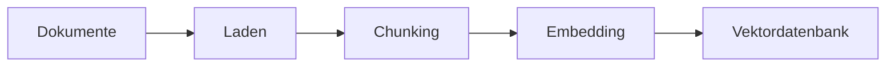
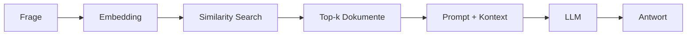

# RAG-Konzepte
{: .no_toc }

> **Retrieval Augmented Generation im Detail – Architektur, Strategien und Best Practices**

---

# Inhaltsverzeichnis
{: .no_toc .text-delta }

1. TOC
{:toc}

---

## Überblick: Was ist RAG?

Large Language Models stoßen in der Praxis an drei typische Grenzen: Wissen ist **nicht aktuell** genug, internes **Fachwissen fehlt** und längere Dokumentbestände lassen sich nicht **vollständig in einen einzelnen Prompt** legen. Genau an dieser Stelle beginnt RAG seinen Nutzen zu zeigen. Nicht als magische Lösung, sondern als technische Antwort auf ein klar umrissenes Problem: relevantes Wissen zur Laufzeit in den Antwortprozess einzuspeisen.

Die folgende Tabelle bündelt diese Ausgangslage, ersetzt aber nicht die eigentliche Entscheidung. RAG lohnt sich nur dann, wenn fehlendes oder externes Wissen wirklich das Problem ist. Wenn die Aufgabe bereits mit vorhandenem Modellwissen sauber lösbar ist, macht Retrieval den Ablauf oft nur langsamer und fehleranfälliger.

| Limitation | Beschreibung |
|------------|--------------|
| **Wissens-Cutoff** | Das Modell kennt nur Informationen bis zum Trainingszeitpunkt |
| **Kein Domänenwissen** | Firmeninterne Dokumente, Fachrichtlinien oder aktuelle Daten fehlen |
| **Halluzination** | Bei Wissenslücken werden plausible, aber falsche Antworten generiert |
| **Kontextlimit** | Nicht alle relevanten Dokumente passen in einen einzelnen Prompt |

Retrieval Augmented Generation ergänzt das Modell also nicht durch neues Training, sondern durch einen zusätzlichen Arbeitsschritt: Zuerst wird gesucht, dann erst formuliert. In Trainings zeigt sich oft, dass genau diese Trennung Missverständnisse aufdeckt. Ist die Suche schlecht, wird auch die Antwort schlecht. RAG verschiebt das Problem deshalb nicht weg, sondern macht sichtbar, wo die eigentliche Schwäche liegt: im Retrieval, im Chunking oder in der Kontextzusammenstellung.

```
Frage → Suche relevante Dokumente → Füge Kontext zum Prompt → LLM generiert Antwort
```

> [!NOTE] Kernidee RAG<br>
> Das LLM erhält genau die Informationen, die es für die aktuelle Frage benötigt – nicht mehr und nicht weniger. Ohne passenden Kontext halluziniert das Modell stattdessen eine Antwort.

---

## Die RAG-Architektur

Ein RAG-System besteht aus zwei Hauptphasen: **Datensammlung/Indexierung** und **Abruf & Erweiterung/Retrieval + Generation**. Diese Trennung ist wichtig, weil Fehler in der ersten Phase später oft wie Modellfehler aussehen. Wenn Chunks unsauber gebildet oder Metadaten schlecht gepflegt sind, hilft auch ein starkes Modell kaum noch.


### Datensammlung/Indexierungsphase

Die Datensammlung bildet die Grundlage jedes RAG-Systems (Retrieval-Augmented Generation). In dieser Phase werden relevante Informationen aus unterschiedlichen Quellen wie PDFs, Webseiten, Datenbanken oder internen Dokumenten zusammengeführt und für die weitere Verarbeitung bereitgestellt. Die Qualität, Aktualität und Struktur dieser Daten beeinflussen maßgeblich, wie präzise und verlässlich das System später Informationen finden und Antworten generieren kann. Daher entscheidet bereits die Auswahl geeigneter Datenquellen oft über den Erfolg eines RAG-Systems.




| Schritt       | Beschreibung                                 | Typische Tools                          |     |
| ------------- | -------------------------------------------- | --------------------------------------- | --- |
| **Laden**     | Dokumente aus verschiedenen Quellen einlesen | TextLoader, PyPDFLoader, WebBaseLoader  |     |
| **Chunking**  | Große Dokumente in kleinere Teile zerlegen   | RecursiveCharacterTextSplitter          |     |
| **Embedding** | Textchunks in Vektoren umwandeln             | OpenAIEmbeddings, HuggingFaceEmbeddings |     |
| **Speichern** | Vektoren in Datenbank ablegen                | ChromaDB, FAISS, Pinecone               |     |

### Abruf & Erweiterung

In der Phase „Abruf & Erweiterung“ sucht das RAG-System gezielt nach inhaltlich passenden Informationen in der Wissensbasis. Dazu wird die Benutzeranfrage mit den gespeicherten Dokumenten verglichen, meist über semantische Suche und Embeddings. Die gefundenen Inhalte werden anschließend dem Sprachmodell als zusätzlicher Kontext bereitgestellt. Dadurch kann das Modell fundiertere, aktuellere und stärker quellenbasierte Antworten erzeugen.



| Schritt | Beschreibung |
|---------|--------------|
| **Query-Embedding** | Die Frage wird in denselben Vektorraum transformiert |
| **Similarity Search** | Die ähnlichsten Dokumentvektoren werden gefunden |
| **Kontext-Erstellung** | Gefundene Chunks werden zum Prompt hinzugefügt |
| **Generation** | Das LLM generiert eine Antwort basierend auf dem Kontext |

---

## Embeddings: Text als Vektor

Embeddings machen semantische Suche überhaupt erst möglich. Das Verfahren übersetzt Text in Vektoren, sodass Ähnlichkeit nicht mehr über exakte Worttreffer, sondern über Bedeutungsnähe berechnet werden kann. Das klingt abstrakt, wird aber praktisch sehr schnell greifbar: Ein System kann "Fahrzeug" finden, obwohl in der Frage "Auto" steht.

Gleichzeitig werden Embeddings oft überschätzt. Vektorrepräsentationen lösen nicht automatisch schlechte Dokumentstruktur, unpräzise Queries oder schwache Metadaten. In vielen RAG-Projekten sind sie notwendig, aber nicht hinreichend.

### Konzept

```
"Der Hund spielt im Park"     → [0.12, -0.45, 0.78, ..., 0.33]  (1536 Dim.)
"Die Katze liegt im Garten"   → [0.15, -0.42, 0.71, ..., 0.29]  (ähnlich!)
"Quantenmechanik ist komplex" → [-0.89, 0.23, -0.11, ..., 0.67] (anders!)
```

### Verfügbare Embedding-Modelle

| Modell | Dimensionen | Kosten | Qualität |
|--------|-------------|--------|----------|
| `text-embedding-3-small` (OpenAI) | 1536 | ~$0.02/1M Tokens | ⭐⭐⭐⭐ |
| `text-embedding-3-large` (OpenAI) | 3072 | ~$0.13/1M Tokens | ⭐⭐⭐⭐⭐ |
| `all-MiniLM-L6-v2` (HuggingFace) | 384 | Kostenlos | ⭐⭐⭐ |
| `multilingual-e5-large` (HuggingFace) | 1024 | Kostenlos | ⭐⭐⭐⭐ |

### Ähnlichkeitsmaße

Die Ähnlichkeit zwischen Vektoren wird mathematisch berechnet:

| Maß | Beschreibung | Wertebereich |
|-----|--------------|--------------|
| **Cosine Similarity** | Winkel zwischen Vektoren | -1 bis 1 |
| **Euclidean Distance** | Geometrischer Abstand | 0 bis ∞ |
| **Dot Product** | Skalarprodukt | -∞ bis ∞ |

**Cosine Similarity** ist der Standard, da sie unabhängig von der Vektorlänge nur die "Richtung" (= Bedeutung) vergleicht.

### Beispiel: Embeddings erzeugen

```text
Embedding-Erzeugung:

Embedding-Modell wählen:
- zum Beispiel ein kleines, schnelles Modell für erste Tests
- oder ein größeres Modell für höhere Suchqualität

Query-Embedding:
1. Nutzerfrage übernehmen.
2. Frage in einen Vektor umwandeln.

Dokument-Embeddings:
1. Dokumente in Chunks zerlegen.
2. Jeden Chunk in einen Vektor umwandeln.
3. Vektoren zusammen mit Text, Quelle und Metadaten speichern.
4. Kuratierte Stichwörter als Metadaten ergänzen.
```

### Metadaten für die Indexierung

Beim Vektorisieren sollte nicht nur der reine Text gespeichert werden. Jeder Chunk braucht Metadaten, damit Treffer später gefiltert, erklärt und mit Stichwortsuche kombiniert werden können. Dazu gehören technische Angaben wie Quelle und Kapitel, aber auch bewusst vergebene Stichwörter.

```text
Metadaten pro Chunk:

Pflichtfelder:
- source: Ursprungsdokument oder URL
- title: Dokumenttitel
- section: Kapitel oder Abschnitt
- chunk_id: eindeutige Chunk-Kennung

Hilfreiche Zusatzfelder:
- date: Veröffentlichungs- oder Aktualisierungsdatum
- category: Fachbereich oder Dokumenttyp
- keywords: kuratierte Stichwörter
- synonyms: wichtige Synonyme oder Schreibvarianten

Beispiel für keywords:
- Passwort-Policy
- Zugangsdaten
- Login
- MFA
- ISO 27001
```

Diese Stichwörter werden nicht zwingend für das Embedding selbst gebraucht. Sie helfen aber beim späteren Retrieval: Ein System kann nach exakten Begriffen suchen, Metadaten filtern oder BM25-Treffer mit Vektortreffern kombinieren. Besonders bei Abkürzungen, Produktnamen, Normen, Fehlermeldungen und internen Begriffen lohnt sich diese zusätzliche Pflege.


---

## Chunking: Dokumente sinnvoll zerlegen

Chunking ist eine der Stellen, an denen RAG-Projekte am häufigsten an Präzision verlieren. Zu große Chunks verschwenden Kontextfenster und verwässern Treffer. Zu kleine Chunks verlieren fachlichen Zusammenhang. Beides führt dazu, dass das Retrieval formal funktioniert, inhaltlich aber an der falschen Stelle landet.

In der Entwicklung zeigt sich oft ein typischer erster Fehler: Die Chunk-Größe wird einmal festgelegt und dann als technischer Parameter behandelt. Tatsächlich ist sie eine fachliche Entscheidung. Ein Handbuch, ein juristischer Text und API-Dokumentation brauchen nicht dieselbe Granularität.

### Chunking-Strategien

| Strategie | Beschreibung | Anwendungsfall |
|-----------|--------------|----------------|
| **Fixed-Size** | Feste Zeichenanzahl pro Chunk | Einfache Texte ohne Struktur |
| **Recursive** | Hierarchische Trennung (Absatz → Satz → Wort) | Allgemeine Dokumente |
| **Semantic** | Trennung nach Bedeutungseinheiten | Komplexe Fachtexte |
| **Document-based** | Beibehaltung natürlicher Grenzen (Kapitel, Abschnitte) | Strukturierte Dokumente |

### Der RecursiveCharacterTextSplitter

Der am häufigsten verwendete Splitter arbeitet mit einer Hierarchie von Trennzeichen:

```text
Splitter: Recursive Character Splitting

Einstellungen:
- chunk_size: maximale Chunk-Größe, zum Beispiel 500 Zeichen
- chunk_overlap: Überlappung zwischen Chunks, zum Beispiel 100 Zeichen
- separators: Trennzeichen-Hierarchie von grob nach fein

Trennzeichen-Hierarchie:
1. Absatzgrenzen
2. Zeilenumbrüche
3. Satzenden
4. Wörter
5. einzelne Zeichen als letzte Option
```

**Funktionsweise:**
1. Versuche zuerst, an Doppel-Zeilenumbrüchen zu trennen (Absätze)
2. Falls Chunk zu groß: Trenne an einfachen Zeilenumbrüchen
3. Falls immer noch zu groß: Trenne an Satzenden
4. Letzte Option: Trenne an Leerzeichen oder einzelnen Zeichen

### Overlap: Kontext bewahren

```
Dokument: [AAAA|BBBB|CCCC|DDDD]

Ohne Overlap:
  Chunk 1: [AAAA]
  Chunk 2: [BBBB]
  → Information an Grenzen geht verloren

Mit Overlap (25%):
  Chunk 1: [AAAA|BB]
  Chunk 2: [BB|CCCC]
  → Zusammenhänge bleiben erhalten
```

### Empfehlungen nach Dokumenttyp

| Dokumenttyp | chunk_size | chunk_overlap | Begründung |
|-------------|------------|---------------|------------|
| FAQ / Kurztexte | 200–300 | 50 | Präzise, eigenständige Antworten |
| Handbücher | 500–800 | 100–150 | Kontext zwischen Abschnitten erhalten |
| Rechtsdokumente | 800–1000 | 200 | Vollständige Paragraphen wichtig |
| Code-Dokumentation | 300–500 | 100 | Funktionen zusammenhalten |

Diese Werte sind keine feste Regel. Die Tabelle bildet einen sinnvollen Startpunkt. Entscheidend ist, ob die Treffer später tatsächlich die Antwort tragen. Wenn ein System zwar semantisch ähnliche Chunks findet, aber wiederholt am Absatzrand wichtige Informationen verliert, liegt das Problem oft nicht im Modell, sondern im Zuschnitt der Dokumente.


---

## Retrieval: Die richtigen Dokumente finden

Der Retriever ist die eigentliche Arbeitsstelle des Systems. Hier entscheidet sich, ob eine Frage brauchbaren Kontext erhält oder nur ähnlich klingendes Material. Viele frühe RAG-Demos wirken überzeugend, weil die Fragen freundlich gewählt sind. Unter realen Bedingungen zeigt sich dann, ob das Retrieval auch bei unklaren Formulierungen, Synonymen oder Mischanfragen noch trägt.

### Basis-Retrieval: Similarity Search

```text
Basis-Retrieval:

Index vorbereiten:
1. Chunks mit Embeddings versehen.
2. Chunks und Vektoren im Vector Store speichern.

Retriever konfigurieren:
- k = 3 bedeutet: Gib die drei ähnlichsten Chunks zurück.

Suche:
1. Nutzerfrage in einen Query-Vektor umwandeln.
2. Ähnlichste Dokumentvektoren suchen.
3. Top-k Chunks zurückgeben.
```

### Retrieval-Strategien im Vergleich

| Strategie | Beschreibung | Vorteil | Nachteil |
|-----------|--------------|---------|----------|
| **Similarity** | Ähnlichste Vektoren | Schnell, einfach | Keine Qualitätsgarantie |
| **Keyword / BM25** | Stichwortsuche mit Relevanzbewertung | Präzise bei Fachbegriffen, IDs und Namen | Findet Synonyme nur mit Zusatzpflege |
| **MMR** | Maximum Marginal Relevance | Diversität der Ergebnisse | Etwas langsamer |
| **Threshold** | Nur Ergebnisse über Schwellenwert | Qualitätskontrolle | Kann leer zurückkommen |
| **Hybrid** | Keyword + Semantisch kombiniert | Beste Abdeckung | Komplexer aufzusetzen |

> [!DANGER] Threshold-Retrieval: leerer Kontext<br>
> Gibt der Threshold-Retriever keine Treffer zurück, erhält das LLM leeren Kontext — und halluziniert eine Antwort, anstatt "keine Information" zu melden. Immer ein Fallback definieren, wenn `score_threshold` verwendet wird.

### Stichwortsuche

Stichwortsuche ist die einfachste Retrieval-Strategie: Das System sucht nach exakten Begriffen, Phrasen oder Mustern im Dokumentbestand. Sie ist besonders nützlich, wenn die gesuchten Informationen über eindeutige Wörter erreichbar sind, etwa Produktnamen, Abkürzungen, Fehlermeldungen, Gesetzesstellen, Ticketnummern oder interne Prozessbegriffe.

Ein verbreiteter Algorithmus dafür ist **BM25**. BM25 bewertet Treffer nicht nur danach, ob ein Stichwort vorkommt, sondern auch danach, wie aussagekräftig der Begriff im gesamten Dokumentbestand ist und wie stark er in einem konkreten Dokument vertreten ist. Seltene, fachlich wichtige Begriffe zählen dadurch stärker als sehr allgemeine Wörter.

Der Vorteil liegt in der Präzision. Wenn jemand nach `ISO 27001`, `Passwort-Policy` oder `ERR-403` sucht, ist eine exakte Stichwortsuche oft zuverlässiger als reine semantische Ähnlichkeit. Der Nachteil ist die geringe Toleranz: Wer nach "Zugangsdaten ändern" fragt, findet ein Dokument mit "Passwort zurücksetzen" möglicherweise nicht, obwohl es inhaltlich passt.

```text
Retriever-Strategie: Stichwortsuche

Eingabe:
- Nutzerfrage oder manuell gewählte Suchbegriffe

Vorbereitung:
1. Wichtige Begriffe aus der Frage erkennen.
2. Synonyme, Abkürzungen oder Schreibvarianten ergänzen.
3. Optional: irrelevante Füllwörter entfernen.

Suche:
1. Dokumente nach exakten Stichworten oder Phrasen durchsuchen.
2. Optional BM25 verwenden, um Treffer nach Relevanz zu sortieren.
3. Kuratierte keywords und synonyms aus den Metadaten berücksichtigen.
4. Treffer nach Anzahl, Position und Feld gewichten.
5. Besonders relevante Abschnitte als Kontext zurückgeben.

Gut geeignet für:
- Produktnamen
- Fehlermeldungen
- IDs und Aktenzeichen
- Normen, Paragraphen und Richtlinien
- interne Fachbegriffe
```

In RAG-Systemen ist Stichwortsuche selten ein Ersatz für Embeddings, aber ein sehr guter Ergänzungsmechanismus. Praktisch stark ist ein zweistufiges Vorgehen: Erst werden eindeutige Stichworte gesucht, danach ergänzt semantische Suche verwandte oder anders formulierte Treffer. Genau daraus entsteht Hybrid Retrieval.

### Maximum Marginal Relevance (MMR)

MMR balanciert Relevanz und Diversität. Statt nur die ähnlichsten Dokumente zurückzugeben, werden auch unterschiedliche Perspektiven berücksichtigt.

```text
Retriever-Strategie: MMR

Einstellungen:
- k: finale Anzahl der zurückgegebenen Chunks
- fetch_k: größere Kandidatenmenge für die Vorauswahl
- lambda_mult: Balance zwischen Relevanz und Diversität

Ablauf:
1. Suche zunächst mehrere relevante Kandidaten.
2. Wähle daraus Chunks, die relevant sind und sich nicht zu stark wiederholen.
3. Gib die finale Auswahl an den Prompt weiter.
```

### Score-basiertes Filtering

```text
Retriever-Strategie: Score-basiertes Filtering

Einstellungen:
- score_threshold: Mindestähnlichkeit für Treffer
- k: maximale Anzahl zurückgegebener Chunks

Ablauf:
1. Suche semantisch ähnliche Chunks.
2. Entferne Treffer unterhalb des Schwellenwerts.
3. Wenn keine Treffer übrig bleiben, aktiviere einen Fallback.
```

### Metadaten-Filter

```text
Retriever-Strategie: Metadaten-Filter

Einstellungen:
- k: maximale Anzahl zurückgegebener Chunks
- filter: Einschränkung nach Quelle, Kapitel, Datum oder Kategorie

Beispiel:
- Suche nur in der Quelle "handbuch.pdf".
- Suche dort nur im Kapitel "Sicherheit".
```

---

## Reranking: Ergebnisse optimieren

Reranking verbessert die Qualität der gefundenen Dokumente durch einen zweiten Bewertungsschritt.

### Warum Reranking?

Die initiale Vektorsuche ist schnell, aber nicht perfekt. Reranking verwendet ein präziseres (aber langsameres) Modell, um die Top-Ergebnisse neu zu ordnen.

```
Schritt 1: Similarity Search → 20 Kandidaten
Schritt 2: Reranker bewertet alle 20 → Sortiert nach Qualität
Schritt 3: Top 5 werden verwendet
```

### Reranking-Ansätze

| Ansatz | Beschreibung | Performance |
|--------|--------------|-------------|
| **Cross-Encoder** | Betrachtet Query + Dokument gemeinsam | Höchste Qualität, langsam |
| **LLM-based** | LLM bewertet Relevanz | Flexibel, teuer |
| **Lightweight** | Schnelle Heuristiken | Schnell, moderate Qualität |

### Beispiel: Cohere Reranker

```text
Reranking-Ablauf:

Basis-Retrieval:
1. Suche zunächst eine größere Kandidatenmenge, zum Beispiel 20 Chunks.

Reranker:
1. Bewertet jeden Kandidaten genauer gegen die Frage.
2. Sortiert die Kandidaten nach tatsächlicher Relevanz.
3. Gibt nur die besten Treffer zurück, zum Beispiel Top 5.

Ergebnis:
- weniger, aber passendere Kontext-Chunks für die Antwortgenerierung
```

---

## Advanced RAG-Techniken

Über die Grundlagen hinaus existieren fortgeschrittene Techniken zur Qualitätsverbesserung.

### Query Transformation

Die ursprüngliche Frage wird umformuliert oder erweitert, um bessere Treffer zu erzielen.

**Multi-Query:** Eine Frage wird in mehrere Varianten umgewandelt:

```
Original: "Wie funktioniert RAG?"
→ "Was ist Retrieval Augmented Generation?"
→ "Erkläre die RAG-Architektur"
→ "RAG-System Komponenten"
```

**HyDE (Hypothetical Document Embedding):** Das LLM generiert eine hypothetische Antwort, die dann für die Suche verwendet wird:

```
Frage: "Wie funktioniert RAG?"
→ LLM generiert: "RAG kombiniert Retrieval und Generation..."
→ Suche nach Dokumenten ähnlich zur hypothetischen Antwort
```

### Self-Query

Das LLM extrahiert strukturierte Filter aus natürlichsprachlichen Fragen:

```
Frage: "Zeige mir Sicherheitsrichtlinien aus 2024"
→ Extrahiert: {"kategorie": "sicherheit", "jahr": 2024}
→ Kombiniert semantische Suche mit Metadaten-Filter
```

### Contextual Compression

Gefundene Dokumente werden auf das Wesentliche komprimiert:

```
Gefundener Chunk (500 Zeichen):
"Die Firma wurde 1995 gegründet. Der Hauptsitz befindet sich in Berlin.
 Die Sicherheitsrichtlinien wurden 2023 aktualisiert und umfassen..."

Nach Compression (relevanter Teil für Frage "Sicherheitsrichtlinien"):
"Die Sicherheitsrichtlinien wurden 2023 aktualisiert und umfassen..."
```

### Parent Document Retriever

Kleine Chunks für präzises Retrieval, aber größere Kontextfenster für die Generierung:

```
Indexierung: Kleine Chunks (200 Zeichen) → Vektordatenbank
Retrieval: Finde relevante kleine Chunks
Rückgabe: Hole zugehörige Parent-Dokumente (2000 Zeichen)
```

---

## RAG-Chain mit LangChain

Die Kombination aller Komponenten zu einer funktionierenden Pipeline.

### Minimales Beispiel

```text
RAG-Chain: minimaler Ablauf

Komponenten:
- LLM für die Antwortgenerierung
- Embedding-Modell für Fragen und Dokumente
- Vector Store mit gespeicherten Dokument-Chunks
- Retriever für die Suche nach relevanten Chunks
- RAG-Prompt mit Kontext und Frage

Ablauf:
1. Nutzerfrage entgegennehmen.
2. Retriever sucht die relevantesten Chunks zur Frage.
3. Gefundene Chunks werden zu einem Kontextblock formatiert.
4. Prompt kombiniert:
   - Anweisung: nur auf Basis des Kontexts antworten
   - Kontext: gefundene Chunks
   - Frage: ursprüngliche Nutzerfrage
5. LLM generiert die Antwort.
6. Ausgabe wird als Text zurückgegeben.

Fallback:
- Wenn der Kontext keine Antwort enthält, meldet das System fehlende Information.
```

### RAG als Agent-Tool

```text
Agent-Tool: firmenwissen_suchen

Zweck:
- Durchsucht interne Dokumente über eine RAG-Chain.

Wann verwenden:
- bei Fragen zu Unternehmensrichtlinien
- bei Fragen zu internen Prozessen
- bei Fragen zu Produktinformationen

Eingabe:
- frage: Suchanfrage in natürlicher Sprache

Ablauf:
1. Frage an die RAG-Chain übergeben.
2. Relevante Chunks suchen.
3. Antwort aus Kontext erzeugen.
4. Antwort an den Agenten zurückgeben.

Fehlerfall:
- Wenn Suche oder Antwortgenerierung fehlschlägt, wird eine klare Fehlermeldung zurückgegeben.
```

---

## Evaluierung von RAG-Systemen

Die Qualität eines RAG-Systems muss systematisch gemessen werden, weil eine einzelne gelungene Antwort wenig beweist. RAG kann auf zwei Ebenen scheitern: Der Retriever findet den falschen Kontext, oder das Modell verarbeitet den richtigen Kontext falsch. Deshalb wird nicht nur die finale Antwort bewertet, sondern auch der Weg dorthin.

Für Entwickler reicht zuerst ein kleines, wiederholbares Testset. Nach jeder Änderung an Chunking, Embedding-Modell, `k`, Prompt oder Quellenbestand wird dasselbe Set erneut ausgeführt. So wird sichtbar, ob eine Änderung wirklich verbessert oder nur andere Fehler erzeugt.

| Ebene | Leitfrage | Einfache Bewertung |
|---|---|---|
| Retrieval | Wurden die passenden Chunks gefunden? | relevant / teilweise / falsch |
| Grounding | Ist die Antwort durch Quellen gedeckt? | belegt / teilweise / nicht belegt |
| Antwort | Wird die Frage fachlich beantwortet? | korrekt / teilweise / falsch |

### Metriken

| Metrik | Misst | Berechnung |
|--------|-------|------------|
| **Retrieval Precision** | Anteil relevanter Dokumente | Relevante / Gefundene |
| **Retrieval Recall** | Abdeckung aller relevanten Dokumente | Gefundene Relevante / Alle Relevanten |
| **Answer Relevance** | Passt Antwort zur Frage? | LLM-Bewertung |
| **Faithfulness** | Ist Antwort durch Kontext gestützt? | LLM-Bewertung |
| **Context Relevance** | Ist der Kontext relevant? | LLM-Bewertung |

### RAGAS Framework

RAGAS (Retrieval Augmented Generation Assessment) bietet standardisierte Metriken:

```text
RAGAS-Evaluierung:

Eingabe:
- Test-Dataset mit Fragen, erwarteten Antworten und erwarteten Kontexten

Metriken:
- Faithfulness: Ist die Antwort durch den Kontext gedeckt?
- Answer Relevance: Passt die Antwort zur Frage?
- Context Precision: Sind die gefundenen Kontexte relevant?

Ablauf:
1. Test-Dataset laden.
2. RAG-System für jede Testfrage ausführen.
3. Antworten und Kontexte mit den Metriken bewerten.
4. Ergebnisse vergleichen und Schwachstellen identifizieren.
```

### Manuelles Testen

Für erste Iterationen ist manuelles Testen effektiver als ein großes Evaluationsframework. Wichtig ist, die Testfragen nicht nachträglich an die Stärken des Systems anzupassen, sondern typische Nutzerfragen, Randfälle und erwartete Quellen festzuhalten.

```text
Manuelles Testset:

Testfall enthält:
- question: typische Nutzerfrage
- expected_source: erwartete Quelle
- expected_answer: erwarteter Antwortkern

Beispiele:
- Frage: "Was ist die Passwort-Policy?"
  Erwartete Quelle: security.md
  Erwarteter Antwortkern: Passwortlänge, Komplexität und Wechselregel

- Frage: "Wie beantrage ich Urlaub?"
  Erwartete Quelle: hr.md
  Erwarteter Antwortkern: Antrag über das HR-System

- Frage: "Wer ist Ansprechpartner für IT-Probleme?"
  Erwartete Quelle: support.md
  Erwarteter Antwortkern: IT-Support oder Helpdesk

Prüfablauf pro Testfall:
1. Frage an den Retriever senden.
2. Gefundene Quellen mit der erwarteten Quelle vergleichen.
3. Antwort mit der RAG-Chain erzeugen.
4. Antwort als korrekt, teilweise oder falsch bewerten.
5. Auffälligkeiten dokumentieren.
```

> [!TIP] Vertiefung<br>
> Die einsteigerfreundliche Einordnung steht in [Evaluation & Observability](../07-qualitaet-sicherheit/evaluation-observability.html). Die technische Umsetzung mit Tracing, Datasets und Monitoring ist in [LangSmith Best Practices](../06-frameworks/langsmith-best-practices.html) beschrieben.

---

## Troubleshooting

Häufige Probleme und deren Lösungen.

### Problem: Keine relevanten Dokumente gefunden

| Ursache | Diagnose | Lösung |
|---------|----------|--------|
| Collection leer | `vectorstore._collection.count()` | Dokumente indexieren |
| Falsches Embedding-Modell | Dimensionen vergleichen | Gleiches Modell für Index und Query |
| Query zu spezifisch | Mit breiterem Begriff testen | Query umformulieren |
| k zu klein | k erhöhen | `search_kwargs={"k": 10}` |

### Problem: Falsche Antworten trotz korrektem Kontext

| Ursache | Lösung |
|---------|--------|
| Prompt unklar | Anweisungen präzisieren |
| Zu viel Kontext | Weniger Chunks, Compression nutzen |
| Widersprüchliche Dokumente | Metadaten-Filter für Aktualität |
| Halluzination | Explizite Anweisung: "Nur basierend auf Kontext" |

### Problem: Langsame Antwortzeiten

| Komponente | Optimierung |
|------------|-------------|
| Embedding | Batch-Verarbeitung, Caching |
| Retrieval | Index optimieren, k reduzieren |
| Reranking | Weniger Kandidaten, leichteres Modell |
| LLM | Streaming aktivieren, schnelleres Modell |

---

## Best Practices

### Indexierung

- **Konsistentes Embedding-Modell:** Dasselbe Modell für Indexierung und Queries verwenden
- **Sinnvolles Chunking:** Dokumenttyp-spezifische Parameter wählen
- **Metadaten anreichern:** Quelle, Datum, Kategorie für späteres Filtern
- **Stichwörter pflegen:** Wichtige Fachbegriffe, Synonyme, Abkürzungen und IDs als `keywords` oder `synonyms` speichern
- **Inkrementelle Updates:** Nur geänderte Dokumente neu indexieren

### Retrieval

- **k sinnvoll wählen:** Zu wenig = fehlender Kontext, zu viel = Rauschen
- **MMR für Diversität:** Bei breiten Themen verschiedene Perspektiven einbeziehen
- **Threshold für Qualität:** Lieber keine Antwort als eine falsche
- **BM25 ergänzen:** Für Fachbegriffe, Fehlermeldungen und IDs Keyword-Suche mit Vektorsuche kombinieren

### Prompt Design

- **Klare Anweisungen:** "Antworte NUR basierend auf dem Kontext"
- **Fallback definieren:** Was tun bei fehlendem Wissen?
- **Quellenangaben:** Antwort mit Dokumentreferenzen anreichern

### Evaluation

- **Test-Dataset erstellen:** Repräsentative Fragen mit erwarteten Antworten
- **Regelmäßig evaluieren:** Nach jedem Update der Wissensbasis
- **Feedback sammeln:** Nutzer-Bewertungen für kontinuierliche Verbesserung
- **Trace prüfen:** Bei falschen Antworten zuerst Retrieval und Prompt-Kontext inspizieren

---

## Zusammenfassung

RAG kombiniert die Stärken von Retrieval-Systemen mit generativen LLMs:

| Komponente | Funktion | Typisches Tool |
|------------|----------|----------------|
| **Document Loader** | Daten einlesen | TextLoader, PyPDFLoader |
| **Text Splitter** | Chunking | RecursiveCharacterTextSplitter |
| **Embedding Model** | Text → Vektor | OpenAIEmbeddings |
| **Vector Store** | Speicherung & Suche | ChromaDB, FAISS |
| **Retriever** | Relevante Chunks finden | Retriever-Schnittstelle |
| **LLM** | Antwort generieren | GPT-4o-mini |

**Der typische Workflow:**

```
1. Dokumente laden und chunken
       ↓
2. Embeddings erzeugen und speichern
       ↓
3. Retriever konfigurieren
       ↓
4. RAG-Prompt erstellen
       ↓
5. LCEL-Chain bauen
       ↓
6. Evaluieren und optimieren
```

RAG ermöglicht es, LLMs mit aktuellem, domänenspezifischem Wissen auszustatten – ohne teures Fine-Tuning und mit voller Kontrolle über die Wissensbasis.


---

## Abgrenzung zu verwandten Dokumenten

| Dokument | Frage |
|---|---|
| [Tokenizing & Chunking](../03-grundlagen/tokenizing-chunking.html) | Wie beeinflusst die Aufbereitung der Dokumente die Retrieval-Qualität? |
| [Embeddings](../03-grundlagen/embeddings.html) | Wie werden Dokumente und Fragen semantisch vergleichbar gemacht? |
| [Context Engineering](./context-engineering.html) | Wie fügt sich Retrieval in die größere Kontextlogik eines Systems ein? |
| [Evaluation & Observability](../07-qualitaet-sicherheit/evaluation-observability.html) | Wie wird geprüft, ob Retrieval und Antwortqualität belastbar sind? |

---

**Version:**    1.1<br>
**Stand:** Mai 2026<br>
**Kurs:** Generative KI. Verstehen. Anwenden. Gestalten.
