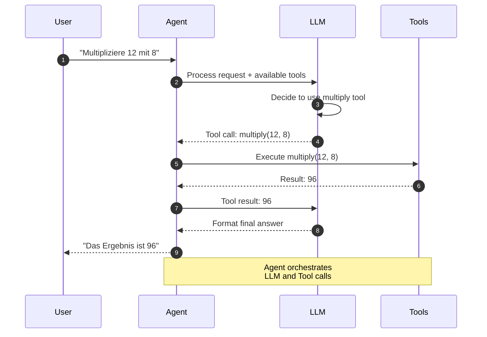
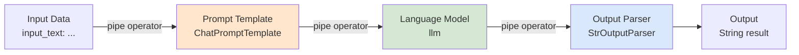
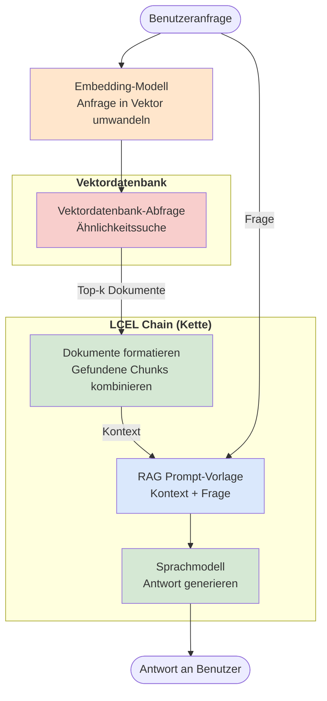

# LangChain
{: .no_toc }

> **Grundlagen und Best Practices für LangChain 1.0+**

---

## Inhaltsverzeichnis
{: .no_toc .text-delta }

1. TOC
{:toc}

---

## Kurzüberblick: Warum LangChain?

Große Sprachmodelle (LLMs) sind stark – aber im Alltag scheitert es oft an ganz praktischen Dingen:

- **Wie verbindet man ein LLM mit eigenen Datenquellen?** Dokumente, Datenbanken oder APIs
- **Wie wechselt man den Anbieter, ohne alles neu zu bauen?** Also z. B. OpenAI, Anthropic oder Google
- **Wie bekommt man wirklich strukturierte Ausgaben?** Statt unzuverlässigem Freitext
- **Wie lässt sich ein LLM erweitern?** Zum Beispiel für Rechnen, Websuche oder Dateizugriff
- **Wie baut man mehrstufige Abläufe?** Erst recherchieren, dann zusammenfassen, danach bewerten

Genau dafür ist LangChain gemacht:

- **Einheitliche Modell-Schnittstelle**: Ein Interface für verschiedene LLM-Anbieter
- **Tool-Integration**: Ein Modell kann externe Funktionen nutzen – etwa Rechner, APIs oder Datenbanken
- **Strukturierte Ausgaben**: Statt Überraschungen gibt es verlässliche Datenstrukturen
- **Verkettung von Schritten**: Komplexe Workflows werden als klare Pipelines gebaut
- **RAG-Unterstützung**: Wissen aus Vektordatenbanken wird direkt eingebunden

**Kernprinzip:** LangChain versteckt die ganzen Integrationsdetails und stellt wieder verwendbare Bausteine bereit – vom einfachen Prompt bis zum Agenten, der Tools verwendet.


<p><font color='black' size="2">
KI-generiertes Bild
</font></p>

---


## Quickstart

```python
from langchain.chat_models import init_chat_model
from langchain_core.output_parsers import StrOutputParser
from langchain_core.prompts import ChatPromptTemplate

llm = init_chat_model("openai:gpt-5-nano")
prompt = ChatPromptTemplate.from_template("Erkläre {thema} in drei Sätzen.")
chain = prompt | llm | StrOutputParser()

antwort = chain.invoke({"thema": "LangChain"})
print(antwort)
```

Der Quickstart zeigt das typische Basis-Muster: Prompt vorbereiten, Modell initialisieren, Schritte per LCEL verknüpfen und ausführen.

---

## Grundaufbau

## Prompts mit `ChatPromptTemplate`

Wenn du Prompts wiederverwenden und sauber strukturieren willst, ist `ChatPromptTemplate` in LangChain 1.0 die richtige Wahl. Du definierst dabei, welche Nachrichtenrollen im Dialog vorkommen und welche Platzhalter zur Laufzeit gefüllt werden.

**Wichtige Punkte:**

- Klare Trennung von System-, Nutzer- und Assistenz‑Nachrichten
- Platzhalter (z. B. `{frage}`, `{kontext}`) für dynamische Inhalte
- Wiederverwendbarkeit über mehrere Chains und Agenten hinweg
- Saubere Trennung zwischen Prompt-Design und Anwendungslogik

### Beispiel 1: Einfacher Frage-Antwort-Prompt

```python
from langchain_core.prompts import ChatPromptTemplate

# Template mit System- und Nutzerrolle
prompt = ChatPromptTemplate([
    ("system", "Du bist ein hilfreicher KI-Assistent für Einsteiger in LangChain."),
    ("human", "Beantworte die folgende Frage in 3-5 Sätzen: {frage}")
])

# ❌ Anti-Pattern (veraltet): ChatPromptTemplate.from_messages([...])
# Später in einer Chain oder direkt:
rendered_messages = prompt.format_messages(frage="Was ist ein LLM?")
rendered_messages
```

### Beispiel 2: Prompt für RAG (mit Kontext)

```python
rag_prompt = ChatPromptTemplate([
    ("system", "Nutze ausschließlich den bereitgestellten Kontext, um die Frage zu beantworten."),
    ("human", "Kontext:\n{kontext}\n\nFrage: {frage}")
])

msgs = rag_prompt.format_messages(
    frage="Wie funktioniert das System?",
    kontext="Dies ist ein Auszug aus dem Handbuch ..."
)
```

---

## Einheitliche Modell-Initialisierung: `init_chat_model()`

Damit dein Modellzugriff stabil bleibt, ist `init_chat_model()` die Basis. Es sorgt dafür, dass du verschiedene Anbieter konsistent ansprechen kannst – ohne dass du überall im Code herumfummeln musst.

**Beispiel: Standard-Setup für den Kurs**

```python
from langchain.chat_models import init_chat_model

# Kurznotation "provider:model"
llm = init_chat_model("openai:gpt-5-nano")

# Weitere Beispiele:
# llm = init_chat_model("anthropic:claude-sonnet-4-5")
# llm = init_chat_model("groq:llama-3.3-70b-versatile")
# llm = init_chat_model("google_genai:gemini-2.5-flash")

# Testaufruf
response = llm.invoke("Nenne drei typische Einsatzgebiete von KI-Agenten.")
print(response.content)
```

---

## Strukturierte Ausgaben: `with_structured_output()`

Viele Aufgaben brauchen keine „schöne Antwort“, sondern konkrete Felder – zum Beispiel bei Extraktion, Bewertungen oder Metadaten. Mit `with_structured_output()` kannst du Antworten direkt an Pydantic-Modelle koppeln und danach validieren lassen.

**Beispiel: Einfache Entity-Extraktion in ein Pydantic-Modell**

```python
from pydantic import BaseModel, Field

class SupportTicket(BaseModel):
    kundennummer: str = Field(description="Eindeutige Kundennummer")
    kategorie: str = Field(description="z.B. 'Rechnung', 'Technik', 'Vertrag'")
    dringlichkeit: int = Field(description="Dringlichkeit von 1 (niedrig) bis 5 (hoch)")

structured_llm = llm.with_structured_output(SupportTicket)

text = "Kundennummer 4711 meldet ein dringendes technisches Problem. Bitte sofort lösen!"
result = structured_llm.invoke(
    "Extrahiere Kundennummer, Kategorie und Dringlichkeit aus folgendem Text: " + text
)

# result ist direkt ein SupportTicket-Objekt
print(result)
print(result.kategorie, result.dringlichkeit)
```

Hinweis: Diese Funktion hängt davon ab, ob der genutzte Modell‑Provider strukturierte Ausgaben wirklich unterstützt (z. B. OpenAI). Bei reinen Text‑Modellen ohne entsprechende API‑Unterstützung ist das so nicht in vollem Umfang nutzbar.

---

## Werkzeuge definieren: `@tool`

Tools machen einen Agent deutlich brauchbarer. Sie holen Funktionen rein, die ein Modell selbst nicht direkt ausführen kann – etwa Rechnen, Datenabrufe, lokale Analysen oder Abfragen externer Systeme. Der `@tool`‑Decorator sorgt dabei für eine klare, gut dokumentierte und typensichere Tool-Definition.

**Merksatz für Einsteiger:** Ein Tool ist nicht „nur Python-Code“. Name, Type Hints und Docstring sind Teil der Schnittstelle, über die das Modell entscheidet, wann es dieses Tool nutzen soll.

### Beispiel: Ein einfaches Rechentool

```python
from langchain_core.tools import tool

@tool
def multiply(a: int, b: int) -> int:
    """Multipliziert zwei ganze Zahlen a und b."""
    return a * b

# Direkter Test des Tools (ohne Agent)
print(multiply.invoke({"a": 6, "b": 7}))
```

### Beispiel: Tool mit Fehlerbehandlung und Docstring

```python
@tool
def safe_divide(a: float, b: float) -> str:
    """Teilt a durch b und gibt eine verständliche Textantwort zurück."""
    if b == 0:
        return "Division durch 0 ist nicht erlaubt."
    return f"Ergebnis: {a / b:.2f}"

print(safe_divide.invoke({"a": 10, "b": 2}))
print(safe_divide.invoke({"a": 10, "b": 0}))
```

### Tool-Namen und Beschreibungen präzise wählen

Der Funktionsname wird standardmäßig zum Tool-Namen. Deshalb sollte er eher beschreiben, **wann** das Tool genutzt werden soll – und weniger, was technisch passiert.

```python
from langchain_core.tools import tool

@tool("order_status_lookup")
def check_status(order_id: str) -> str:
    """Nur verwenden, wenn eine konkrete Bestellnummer vorliegt und der Versandstatus gefragt ist."""
    return f"Bestellung {order_id}: unterwegs"
```

Gute Docstrings und Grenzen helfen dem Modell: „nur bei Bestellnummer“, „nicht für Produktsuche“, „nur für interne Kundendaten“ – solche Formulierungen reduzieren Fehlaufrufe.

---

### Tool Extras für Provider-spezifische Features (NEU v1.2.0)

Mit dem `extras`‑Parameter beim `@tool`‑Decorator kannst du provider‑spezifische Features und Flags an ein Tool übergeben. Standardmäßig werden solche Optionen nicht über die normale Tool-API abgedeckt. Diese Extras werden nur dann wirksam, wenn der jeweilige Provider-Adapter sie auch wirklich auswertet; ansonsten bleibt es ohne Effekt.

```python
from langchain_core.tools import tool

@tool(extras={
    "anthropic": {
        "cache_control": {"type": "ephemeral"},  # Anthropic Prompt Caching
        "disable_parallel_tool_use": False
    },
    "openai": {
        "strict": True  # OpenAI Strict Mode (garantierte Schema-Konformität)
    }
})
def search_database(query: str, limit: int = 10) -> str:
    """Durchsucht die Datenbank nach relevanten Informationen.

    Args:
        query: Suchanfrage
        limit: Maximale Anzahl Ergebnisse
    """
    return f"Gefunden: {limit} Ergebnisse für '{query}'"

# Tool mit Anthropic programmatic tool calling
@tool(extras={
    "anthropic": {
        "type": "computer_20241022",  # Anthropic Computer Use
        "display_width_px": 1024,
        "display_height_px": 768
    }
})
def take_screenshot() -> str:
    """Erstellt einen Screenshot des Bildschirms."""
    return "screenshot.png"
```

**Vorteile:**
- ✅ **Provider-native Features** nutzen (Caching, Strict Mode, Computer Use)
- ✅ **Built-in Client-Side Tools** für Anthropic, OpenAI
- ✅ **Optimierte Performance** durch provider-spezifische Optimierungen
- ✅ **Rückwärtskompatibel**: Tools ohne `extras` funktionieren weiterhin

**Use Cases:**
- Anthropic Prompt Caching für häufig verwendete Tools
- OpenAI Strict Mode für garantierte Schema-Konformität
- Anthropic Computer Use für Browser-Automation

> [!WARNING] Cache-Typ beachten<br>
> `cache_control: {"type": "ephemeral"}` erzeugt einen kurzlebigen Cache innerhalb derselben Sitzung. Damit der Cache wiederverwendet werden kann, sollte die `extras`-Konfiguration eines Tools konsistent bleiben. Wird dasselbe Tool später mit einer anderen `extras`-Konfiguration registriert oder verwendet, entsteht ein Cache-Miss — die Anfrage wird erneut vollständig verarbeitet und verursacht erneut volle Kosten.

---

## Agenten erstellen: `create_agent()`

Mit `create_agent()` fügst du Modell, Tools, Systemprompt und optional Middleware zu einer Einheit zusammen. Intern basiert das auf einer klaren State-Struktur, die sich über LangGraph abbilden lässt.

**Beispiel: Kleinstmöglicher Tool-Agent**

```python
from langchain.agents import create_agent

## 1. LLM (aus Abschnitt 1.2)
# llm = init_chat_model(...)

## 2. Tools (aus Abschnitt 1.4)
tools = [multiply, safe_divide]

## 3. Agent erzeugen
agent = create_agent(
    model=llm,
    tools=tools,
    system_prompt=(
        "Du bist ein Taschenrechner-Agent. "
        "Beantworte nur Rechenfragen und verwende immer die bereitgestellten Tools."
    ),
    debug=False,  # in Colab besser meist False lassen
)

## 4. Aufruf
messages = [
    {"role": "human", "content": "Multipliziere 12 mit 8."},
]

result = agent.invoke({"messages": messages})
result
```

Hier erzeugt `create_agent()` ein kompiliertes LangGraph‑Objekt (CompiledStateGraph). So kann der Agent später auch in größere Workflows eingebettet werden.

### Strict Schema für Agent-Responses

Agents unterstützen jetzt `response_format` zur strikten Validierung von Agent-Outputs:

```python
from langchain.agents import create_agent
from pydantic import BaseModel, Field

# Definiere strukturiertes Response-Schema
class AgentResponse(BaseModel):
    """Strukturierte Agent-Antwort mit Reasoning."""
    reasoning: str = Field(description="Denkprozess des Agents")
    action: str = Field(description="Geplante Aktion")
    tool_to_use: str | None = Field(description="Zu verwendendes Tool (optional)")
    confidence: float = Field(description="Konfidenz 0-1", ge=0, le=1)

agent = create_agent(
    model=llm,
    tools=[multiply, safe_divide],
    system_prompt="You are a helpful research assistant",
    response_format=AgentResponse,  # Strikte Validierung
)

response = agent.invoke({
    "messages": [{"role": "human", "content": "Recherchiere die Bevölkerung von Berlin"}]
})

# Strukturierte Antwort liegt im Agent-State.
structured = response["structured_response"]
print(structured.reasoning)
print(structured.confidence)
```

**Vorteile:**
- ✅ **Garantierte Schema-Konformität** für Agent-Outputs (kein JSON-Parsing-Chaos)
- ✅ **Type-Safety** durch Pydantic-Validierung
- ✅ **Bessere Fehlerbehandlung** durch strukturierte Responses
- ✅ **Stärkere Provider-Integration** (OpenAI Structured Output, Anthropic Tool Use)
- ✅ **Planbares Agent-Verhalten** für produktive Systeme

**Use Cases:**
- Production-Agents mit festem Output-Format
- Multi-Step-Reasoning mit strukturierten Zwischenschritten
- Agent-Monitoring mit standardisierten Response-Metriken
- Integration in typisierte Workflows

---

### Agent-Tool-Interaktion



---

## Moderne Kettensyntax: LCEL `|`

LangChain Expression Language (LCEL) ist die moderne Art, Chains zu bauen. Über den Pipe‑Operator `|` verknüpfst du Verarbeitungsschritte in einer logischen Reihenfolge.

### LCEL Pipeline-Visualisierung



### Beispiel: Einfache LCEL-Chain für Textumformung

```python
from langchain_core.output_parsers import StrOutputParser

rewrite_prompt = ChatPromptTemplate.from_template(
    "Formuliere den folgenden Text freundlicher um:\n\n{input_text}"
)

rewrite_chain = rewrite_prompt | llm | StrOutputParser()

text = "Das ist schlecht dokumentiert und unverständlich."
output = rewrite_chain.invoke({"input_text": text})
print(output)
```

### Mehrere Aufrufe: `batch()`, `batch_as_completed()` und `max_concurrency`

Wenn du mehrere Aufgaben hast, die unabhängig voneinander sind, ist `batch()` meist die bequemste Variante statt einer Schleife mit vielen einzelnen `invoke()`-Aufrufen.

```python
fragen = [
    {"input_text": "Abschnitt 1 ist schwer verständlich."},
    {"input_text": "Abschnitt 2 klingt zu werblich."},
    {"input_text": "Abschnitt 3 braucht ein Beispiel."},
]

antworten = rewrite_chain.batch(
    fragen,
    config={"max_concurrency": 3},
)

for antwort in antworten:
    print(antwort)
```

Mit `max_concurrency` steuerst du, wie viele Anfragen parallel laufen. Das hilft, Rate Limits, Kosten und Systemlast im Griff zu behalten.

Wenn du Ergebnisse lieber „as soon as ready“ weiterverarbeiten willst, nimm `batch_as_completed()`:

```python
for index, antwort in rewrite_chain.batch_as_completed(fragen):
    print(index, antwort)
```

### Streaming für sichtbares Feedback

Gerade bei längeren Antworten wirkt `stream()` wie ein Vorsprung: Nutzer sehen sofort, dass etwas passiert, statt auf das komplette Ergebnis warten zu müssen.

```python
for chunk in rewrite_chain.stream({"input_text": "Erkläre RAG ausführlich."}):
    print(chunk, end="", flush=True)
```

### Beispiel: LCEL-Chain mit zusätzlicher Eingabe (Pass-Through)

`RunnablePassthrough` ergänzt innerhalb einer Chain zusätzliche Felder, ohne den ursprünglichen Input zu verändern. Damit kannst du z. B. Kontext oder Metadaten einfach „nachreichen“.

```python
from langchain_core.runnables import RunnablePassthrough
from langchain_core.prompts import ChatPromptTemplate

qa_prompt = ChatPromptTemplate.from_template(
    "Kontext:\n{context}\n\nFrage: {question}"
)

# Die Chain erhält ein Dictionary, z. B. {"question": "..."}.
# RunnablePassthrough.assign ergänzt daraus ein weiteres Feld: "context".

qa_chain = (
    RunnablePassthrough.assign(
        context=lambda x: "Hier stehen z.B. Infos aus einer Datenbank."
    )
    | qa_prompt
    | llm
    | StrOutputParser()
)

# Aufruf:
# "question" wird unverändert weitergegeben.
# "context" wird von der Chain automatisch ergänzt.

answer = qa_chain.invoke({"question": "Was ist RAG?"})
print(answer)
```

---

## Typische Workflows

Die nächsten Abschnitte zeigen typische Einsteiger-Workflows: multimodale Eingaben, Chunking, Embeddings und ein vollständiges RAG-Pattern.

---

## Middleware zur Agentensteuerung

Middleware erweitert Agenten um wichtige Kontrollpunkte – zum Beispiel Sicherheitsprüfungen oder automatische Verdichtung von Kontext.

**Ein Agent mit Human-in-the-Loop für sensible Tools**

```python
from langchain.agents.middleware import HumanInTheLoopMiddleware

sensitive_tools = [safe_divide]  # hier exemplarisch

middleware = [
    HumanInTheLoopMiddleware(
        tool_names=[t.name for t in sensitive_tools]
    )
]

secure_agent = create_agent(
    model=llm,
    tools=sensitive_tools,
    system_prompt=(
        "Du bist ein vorsichtiger Assistent. "
        "Bei allen sicherheitsrelevanten Aktionen muss der Mensch zustimmen."
    ),
    middleware=middleware,
)
```

Für „hands-on“ Human-in-the-Loop-Abläufe mit explizitem Pause/Resume ist LangGraph `interrupt()` oft besser nachvollziehbar. Die Middleware ist vor allem praktisch für einfache Agenten, bei denen bestimmte Tools vorher bestätigt werden sollen.

---

**Kontext-Management bei langen Konversationen**

Wenn Sessions länger werden, gibt es zwei passende Ansätze:

```python
from langchain.agents.middleware import SummarizationMiddleware

# Ansatz 1: SummarizationMiddleware (provider-unabhängig)
agent_summarize = create_agent(
    model=llm,
    tools=tools,
    middleware=[
        SummarizationMiddleware(
            model=llm,
            max_tokens_before_summary=4000,
        )
    ]
    # Fasst Konversation automatisch zusammen, wenn Token-Limit überschritten
)

# Ansatz 2: OpenAI Server-Side Compaction (nur OpenAI, wenn vom Modell unterstützt)
llm_compact = init_chat_model(
    "openai:gpt-5-nano",
    context_management=[{"type": "compaction", "compact_threshold": 10_000}]
)
agent_compact = create_agent(model=llm_compact, tools=tools)
# → OpenAI komprimiert serverseitig, kein Middleware-Layer nötig
```

| Ansatz | Provider | Wann verwenden? |
|---|---|---|
| `SummarizationMiddleware` | Alle | Provider-unabhängig, mehr Kontrolle |
| `context_management` | Nur OpenAI | Einfachste Lösung für OpenAI-Apps |

---

## Einheitliche Content-Blöcke für multimodale Eingaben

Moderne Modelle können verschiedene Datentypen verarbeiten. Damit Agenten und Chains damit zuverlässig umgehen, definiert LangChain 1.0 Content‑Blöcke, die Text, Bilder, Audio oder weitere Inhalte abbilden.

**Beispiel: Einfacher Vision-Call mit Text + Bild**

```python
from langchain_core.messages import HumanMessage

image_bytes_b64 = "data:image/png;base64,..."  # Platzhalter

vision_message = HumanMessage(
    content=[
        {"type": "text", "text": "Was ist auf diesem Bild zu sehen?"},
        {"type": "image", "url": image_bytes_b64, "mime_type": "image/png"},
    ]
)

vision_response = llm.invoke([vision_message])

# content_blocks können provider-agnostisch ausgewertet werden
for block in vision_response.content_blocks:
    if block["type"] == "text":
        print("Antwort:", block["text"])
```

Dieses Muster kannst du später auch in multimodalen RAG-Notebooks wiederverwenden.

---

## Chunking‑Best Practices

Damit RAG funktioniert, müssen Dokumente sinnvoll in Textstücke („Chunks“) zerlegt werden. In LangChain ist dafür der `RecursiveCharacterTextSplitter` ein bewährter Einstieg.

**Beispiel: Text in sinnvolle Chunks schneiden**

```python
from langchain_text_splitters import RecursiveCharacterTextSplitter

text = """Längerer Dokumententext ... (z.B. Handbuch, Richtlinie, Artikel)"""

splitter = RecursiveCharacterTextSplitter(
    chunk_size=800,
    chunk_overlap=200,
)

chunks = splitter.split_text(text)
print(len(chunks))
print(chunks[0][:200])
```

Im Kurs lohnt es sich, mit unterschiedlichen Chunk‑Größen und Overlaps zu experimentieren – so siehst du schnell, wie stark das Retrieval und die Antwortqualität beeinflusst.

---

## Embeddings: Grundlagen für semantische Suche

Embeddings übersetzen Text in Vektoren. Damit ist semantische Suche möglich und RAG bekommt eine solide Grundlage. Häufig wird dafür ein OpenAI-Embedding-Modell zusammen mit Chroma genutzt.

**Beispiel: Embeddings erzeugen und in Chroma speichern**

```python
from langchain_openai import OpenAIEmbeddings
from langchain_chroma import Chroma

## 1. Dokumente (z.B. Ergebnis des Chunkings)
documents = [
    "LangChain verbindet LLMs mit Tools.",
    "RAG kombiniert Retrieval mit Textgenerierung.",
    "Chroma ist ein leichter Vektorspeicher.",
]

## 2. Embedding-Modell
embedding_model = OpenAIEmbeddings(model="text-embedding-3-small")

## 3. Vektorspeicher erstellen
vectorstore = Chroma.from_texts(
    texts=documents,
    embedding=embedding_model,
    collection_name="demo_rag",
)

## 4. Ähnlichkeitssuche
query = "Was ist RAG?"
results = vectorstore.similarity_search(query, k=2)

for i, doc in enumerate(results, start=1):
    print(f"Treffer {i}: {doc.page_content}")
```

---

## Standard‑Pattern für RAG mit LangChain

Retrieval‑Augmented Generation (RAG) ist ein zentraler Anwendungsfall für LangChain. Dabei werden Vektordatenbank, Retriever und eine LCEL‑Pipeline kombiniert.

### RAG-Workflow Visualisierung



**Beispiel: Minimaler RAG-Workflow mit LCEL**

```python
from langchain_core.runnables import RunnablePassthrough
from langchain_core.output_parsers import StrOutputParser

## 1. Retriever aus bestehendem Chroma-Store
doc_retriever = vectorstore.as_retriever(search_kwargs={"k": 3})

## 2. Hilfsfunktion zur Formatierung der Dokumente

def format_docs(docs):
    return "\n\n".join(d.page_content for d in docs)

## 3. Prompt für RAG
rag_prompt = ChatPromptTemplate.from_template(
    """Du bist ein hilfreicher Assistent.
Nutze NUR den folgenden Kontext, um die Frage zu beantworten.
Wenn die Antwort im Kontext nicht steht, sage ehrlich, dass keine Information vorliegt.

Kontext:
{context}

Frage: {question}
"""
)

# 4. LCEL-Chain
rag_chain = (
    {
        # Hier wird die Frage an den Retriever gegeben und das Ergebnis formatiert
        "context": doc_retriever | format_docs,
        # Hier wird die ursprüngliche Frage ("Wozu wird Chroma verwendet?") einfach durchgereicht
        "question": RunnablePassthrough(),
    }
    | rag_prompt
    | llm
    | StrOutputParser()
)

## 5. Aufruf
frage = "Wozu wird Chroma verwendet?"
antwort = rag_chain.invoke(frage)
print(antwort)
```

Dieses Pattern ist die Grundlage für Wissens‑Chatbots, Dokumenten‑Assistenten oder interne Suchsysteme. Danach kannst du es Schritt für Schritt erweitern – zum Beispiel um Evaluierung, Feedback‑Schleifen oder um LangGraph‑Workflows.

---

## Best Practices

- `init_chat_model()` statt provider-spezifischer Modellklassen verwenden.
- Prompts mit `ChatPromptTemplate` statt zusammengesetzten Strings bauen.
- Strukturierte Daten mit `with_structured_output()` erzeugen.
- Tools mit `@tool`, Type Hints und klaren Docstrings definieren.
- Tool-Namen und Tool-Beschreibungen so formulieren, dass das Modell die Einsatzgrenzen versteht.
- LCEL `|` für lineare Chains verwenden.
- Für unabhängige Massenaufgaben `batch()` mit begrenztem `max_concurrency` nutzen.
- Für längere Antworten `stream()` einsetzen, wenn Nutzer früh Feedback sehen sollen.
- Für RAG zuerst Chunking, Embeddings und Retrieval-Qualität testen, bevor der Agent komplexer wird.

---

## Troubleshooting

### Import funktioniert nicht

Prüfe, ob die benötigten Pakete installiert sind und ob du die aktuellen LangChain-Importpfade nutzt.

### Modell liefert Freitext statt Schema

Nutze `with_structured_output()` mit einem Pydantic-Modell. Prompt-Anweisungen allein reichen für robuste strukturierte Daten nicht aus.

### RAG-Antworten sind ungenau

Checke zuerst Chunk-Größe, Overlap, Embedding-Modell und Retriever-Parameter. Das Modell kann nur mit dem Kontext arbeiten, den der Retriever liefert.

---

## Erweiterungen / Fortgeschrittene Themen

- Middleware zur Agentensteuerung
- Multimodale Content-Blöcke
- Provider-spezifische Tool Extras
- Strict Schema für Agent-Responses
- RAG mit Vektordatenbanken

---

## Zusammenfassung

LangChain liefert dir die Bausteine für LLM-Anwendungen: Prompts, Modelle, strukturierte Ausgaben, Tools, Chains, Agents und RAG. Für den Einstieg ist die Reihenfolge entscheidend: erst einen einfachen Modellaufruf sauber stabil bekommen, dann LCEL-Chains bauen, anschließend Tools und Retrieval ergänzen.

---

## Abgrenzung zu verwandten Dokumenten

| Dokument | Frage |
|---|---|
| [LangGraph](einsteiger-langgraph.html) | Wann reicht eine Chain nicht mehr aus und ein Graph wird sinnvoll? |
| [LangChain Best Practices](./langchain-best-practices.html) | Welche Muster gelten für produktionsnähere LangChain-Anwendungen? |

---

**Version:** 1.1<br>
**Stand:** Mai 2026<br>
**Kurs:** Generative KI. Verstehen. Anwenden. Gestalten.
