# Agenten-Architekturen
{: .no_toc }

> **Die Architektur entscheidet, wie ein System Aufgaben zerlegt, Tools nutzt und Fehler begrenzt.**

---

# Inhaltsverzeichnis
{: .no_toc .text-delta }

1. TOC
{:toc}

---

## Warum die Architekturfrage früh geklärt werden muss

Viele GenAI-Projekte scheitern nicht am Modell, sondern an einer unpassenden Grundstruktur. Eine Anwendung soll vielleicht nur ein Werkzeug aufrufen, wird aber als komplexes Multi-Agent-System geplant. Oder ein eigentlich mehrstufiger Prozess wird als freier ReAct-Loop modelliert und verliert dadurch Kontrolle, Nachvollziehbarkeit und Kostenstabilität.

Architektur meint in diesem Zusammenhang nicht zuerst Framework oder Programmiersprache. Gemeint ist die Entscheidung, wie ein System Aufgaben zerlegt, wie viel Entscheidungsfreiheit es erhält und an welchen Stellen deterministische Logik wichtiger ist als modellbasierte Flexibilität. Diese Unterscheidung ist zentral, weil sie viele spätere Probleme bereits vorwegnimmt.

Typischer Fehler: Zu früh die technisch eindrucksvollste Architektur zu wählen. In der Praxis ist die einfachste Struktur oft die robusteste.

## Ein einfaches Beispiel

Ein Support-System soll drei Arten von Anfragen bearbeiten: Lieferstatus nennen, Rechnung erneut senden und komplexe Sonderfälle an einen Menschen weiterleiten. Schon dieses kleine Beispiel zeigt, dass Architektur keine akademische Zusatzfrage ist. Für den Lieferstatus reicht meist ein gezielter Tool-Aufruf. Für die Rechnung braucht es eventuell mehrere Schritte. Für Sonderfälle wird eine sichere Eskalation benötigt.

Aus genau solchen Anforderungen ergibt sich die Architektur. Nicht jede Aufgabe braucht einen frei planenden Agenten. Häufig genügt ein klarer Workflow oder ein Tool-Calling-Muster mit wenigen kontrollierten Entscheidungen.

## Mini-Glossar für dieses Kapitel

Einige Begriffe tauchen in Agenten-Architekturen immer wieder auf. Für dieses Dokument reichen diese Arbeitsdefinitionen:

| Begriff      | Einfache Bedeutung                                                                                       |
| :----------- | :------------------------------------------------------------------------------------------------------- |
| **Agent**    | Ein System, das mit einem Modell Entscheidungen trifft und bei Bedarf Werkzeuge nutzt.                   |
| **Tool**     | Eine klar beschriebene Funktion, die der Agent aufrufen darf, z.B. Datenbankabfrage oder E-Mail-Versand. |
| **State**    | Der aktuelle Arbeitsstand: Nachrichten, Zwischenergebnisse, Entscheidungen oder offene Schritte.         |
| **Workflow** | Ein vorgegebener Ablauf aus Schritten und Verzweigungen.                                                 |
| **Tracing**  | Protokollierung, was das Modell entschieden und welche Tools es aufgerufen hat.                          |
| **Harness**  | Die Steuerungsschicht um das Modell: Tools, Regeln, Speicher, Fehlerbehandlung und Freigaben.            |

## Überblick

Die Architekturen in diesem Dokument bauen aufeinander auf. Jede Stufe erhöht die Flexibilität — und gleichzeitig den Koordinationsaufwand:

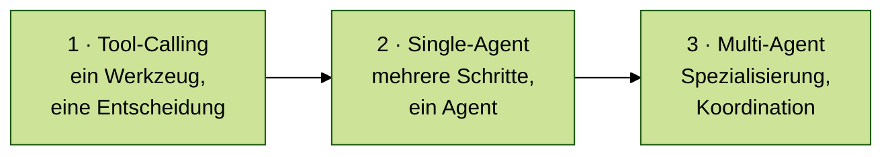

| Stufe | Muster | Wann sinnvoll |
| :---: | :--- | :--- |
| 1 | Tool-Calling | Ein klares Ziel, ein Werkzeugaufruf |
| 2 | Single-Agent | Offene Aufgabe, Zwischenschritte unbekannt |
| 3 | Multi-Agent | Spezialisierung nötig, Teilaufgaben klar trennbar |

## Schneller Entscheidungsleitfaden

Diese Fragen helfen bei der Auswahl:

1. **Gibt es nur eine klar begrenzte Aktion?**  
   Dann reicht meist **Tool-Calling**.

2. **Ist der Lösungsweg offen und muss das System selbst Zwischenschritte wählen?**  
   Dann passt ein **Single-Agent**, häufig mit ReAct-artigem Ablauf.

3. **Sind die Teilaufgaben wirklich unterschiedlich genug, dass Spezialisierung hilft?**  
   Erst dann lohnt sich **Multi-Agent**.

4. **Ist der Ablauf fachlich klar vorgegeben oder muss er auditierbar sein?**  
   Dann ist ein deterministischer **Workflow** die bessere Wahl — kein Agentenmuster, sondern kontrollierte Orchestrierung → [LangGraph Einsteiger]({{ '/06-frameworks/einsteiger-langgraph.html' | relative_url }})

5. **Gibt es schreibende oder riskante Aktionen?**  
   Dann braucht jede Architektur zusätzliche Kontrolle: Validierung, Human-in-the-Loop oder feste Berechtigungen.

Merksatz: **Erst Tool-Calling prüfen, dann Single-Agent, erst zuletzt Multi-Agent.**

| Situation | Naheliegende Wahl |
| :--- | :--- |
| FAQ plus Datenbankzugriff | Tool-Calling |
| Offene Rechercheaufgabe | Single-Agent (mit ReAct) |
| Arbeitsteilige Content-Erstellung | Multi-Agent |


## Tool-Calling

Das Modell entscheidet, welches Werkzeug mit welchen Parametern aufgerufen wird — die eigentliche Aktion läuft in deterministischem Code oder einer externen API. Einsatzfälle sind klar begrenzte Aktionen: Datenbank abfragen, Rechnung erzeugen, Termin prüfen. Sobald mehrere unsichere Zwischenschritte voneinander abhängen, reicht es nicht mehr.

→ Technische Umsetzung, Sicherheitsmuster und Code-Beispiele: [Tool Use & Function Calling]({{ '/08-agenten/tool-use-function-calling.html' | relative_url }})

## Single-Agent-Architektur (Ein-Agenten-Systeme)

### Funktionsweise
Ein einzelner Agent übernimmt die vollständige Ausführung einer Aufgabe. Er zerlegt Ziele in Einzelschritte, greift auf Werkzeuge (Tools) zu, führt diese aus und reflektiert das Ergebnis. Das kann einfaches Tool-Calling sein oder ein ReAct-artiger Zyklus aus Denken, Handeln und Beobachten — ob ein Agent diesen Modus nutzt, hängt davon ab, ob der Lösungsweg offen ist (→ [Reasoning-Muster: ReAct](#reasoning-muster-react-und-explore--plan--act)).

### Vorteile
- **Einfachheit:** Es gibt keine Koordination zwischen mehreren Agenten.
- **Effizienz:** Geradlinige Aufgaben bleiben schnell und günstig.
- **Ressourcen:** Token-Verbrauch und Latenz sind meist niedriger als bei Multi-Agenten-Systemen.

### Nachteile
- **Komplexität:** Ein einzelner Agent funktioniert nicht mehr zuverlässig, wenn zu viele Rollen, Daten und Entscheidungen zusammenfallen.
- **Fehleranfälligkeit:** Eine falsche Tool-Auswahl kann den gesamten Pfad verschieben.

Dieses Muster passt, wenn eine Aufgabe mehrere Schritte braucht, aber noch von einer einzigen Rolle sinnvoll bearbeitet werden kann. Sobald getrennte Fachrollen, eigene Kontexte oder unabhängige Prüfungen nötig werden, sollte die Architektur anders geschnitten werden.


## Multi-Agenten-Architekturen (Systeme mit mehreren Agenten)

Wenn Aufgaben für einen einzelnen Agenten zu komplex werden, kommen spezialisierte Agenten zum Einsatz, die die Arbeit unter sich aufteilen. Wie sie koordinieren, hängt davon ab, ob Aufgaben sequenziell abgearbeitet, parallel delegiert oder dynamisch übergeben werden sollen. Die folgenden Muster unterscheiden sich genau darin:

| Muster | Steuerungslogik | Stärke | Hauptrisiko |
| :--- | :--- | :--- | :--- |
| Supervisor | zentrale Koordination | gute Kontrolle und Zusammenführung | Supervisor wird Engpass |
| Router | Klassifikation am Anfang | schnell und kostengünstig | falsches Routing |
| Handoffs | dynamische Übergabe | flexibel bei wechselnden Zuständigkeiten | unklare Verantwortung |
| Skills | ein Agent lädt Fähigkeiten | einfach und modular | Agent wird zu breit |
| Swarm / Peer-to-Peer | gleichberechtigte Agenten | viele Perspektiven | schwer zu kontrollieren |
| Planner-Executor | Planen und Ausführen getrennt | prüfbare Schritte | starrer Plan |
| Blackboard | gemeinsamer Arbeitsbereich | gute Zusammenarbeit an Artefakten | ungeordneter State |
| Pipeline | feste Reihenfolge | robust und gut testbar | wenig flexibel |

### 1. Supervisor-Architektur (Hierarchisch)
Ein zentraler Chef-Agent (Supervisor) koordiniert mehrere spezialisierte Unter-Agenten. Der Chef delegiert die Teilaufgaben, behält den Überblick und führt die Ergebnisse zusammen.

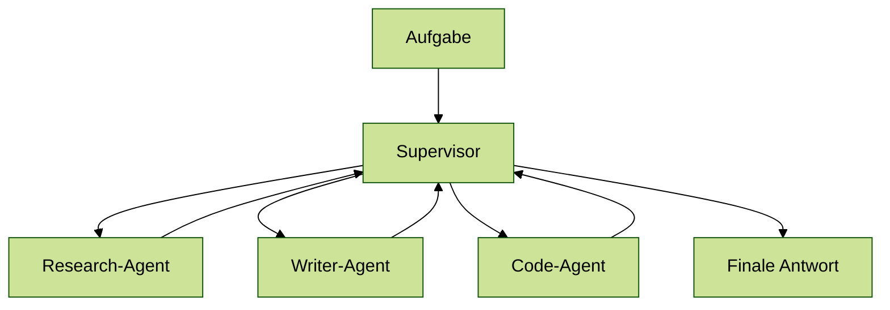

Supervisor passt, wenn parallele Teilaufgaben koordiniert und zu einem Gesamtergebnis zusammengeführt werden müssen. Die Struktur lässt sich verschachteln (Team-Supervisoren unter einem Top-Level-Supervisor), wird dann aber schnell komplex. Hauptrisiko: Der Supervisor selbst wird zum Engpass.

### 2. Router-Architektur (Klassifikation)
Ein Routing-Schritt klassifiziert die Benutzereingabe und leitet sie direkt an den am besten geeigneten Spezialagenten weiter, dessen Antwort anschließend synthetisiert wird. Dies schont das Kontextfenster und spart Latenz und Kosten, da nur der jeweils benötigte Agent aufgerufen wird.

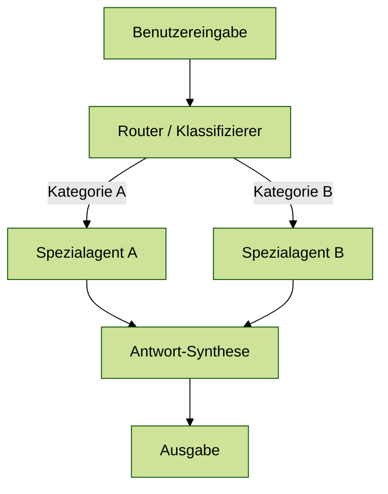

Router passt, wenn Anfragen klar klassifizierbar sind und jede Kategorie einen anderen Spezialisten braucht. Das Muster ist effizient, aber empfindlich: Eine falsche Klassifikation leitet die gesamte Anfrage in die falsche Richtung.

### 3. Handoffs (Übergabe-Muster)
Ein Agent arbeitet an einer Aufgabe und übergibt die Kontrolle bei Bedarf direkt an einen anderen Agenten weiter, inklusive des bisherigen Kontextes. Dies ist typisch für kollaborative Netzwerke (Network / Collaborative), in denen die Agenten sich einen gemeinsamen State teilen und dynamisch entscheiden, wer das Problem als Nächstes fortführt.

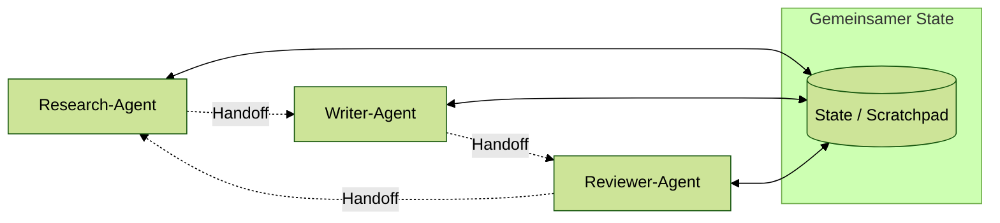

Handoffs passen, wenn der Gesprächsverlauf bestimmt, wer als Nächstes zuständig ist. Das Muster ist flexibel, birgt aber das Risiko unklarer Verantwortung, wenn kein Agent das Gesamtergebnis koordiniert.

### 4. Skills-Architektur
Ein einziger Agent nutzt progressive Erweiterung. Er lädt bei Bedarf spezifisches Fachwissen (Skills) und spezialisierte System-Prompts, je nachdem, was die aktuelle Situation erfordert. Dies verbindet die Einfachheit eines Single-Agent-Systems mit der fachlichen Tiefe spezialisierter Agenten.

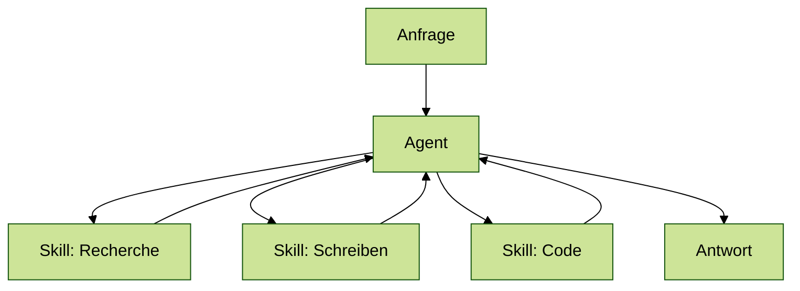

Skills sind sinnvoll, wenn ein einzelner Agent die Kontrolle behalten soll, aber je nach Aufgabe anderes Fachwissen braucht. Wenn Rollen unabhängig arbeiten oder getrennt geprüft werden müssen, ist ein echtes Multi-Agent-Muster klarer.

### 5. Swarm / Peer-to-Peer
Bei einer Swarm- oder Peer-to-Peer-Architektur arbeiten mehrere Agenten ohne festen zentralen Supervisor zusammen. Jeder Agent kann Beiträge liefern, andere Agenten anstoßen oder auf neue Informationen reagieren. Die Koordination entsteht durch Regeln, geteilten State oder ein Kommunikationsprotokoll, nicht durch eine einzelne Chef-Instanz.

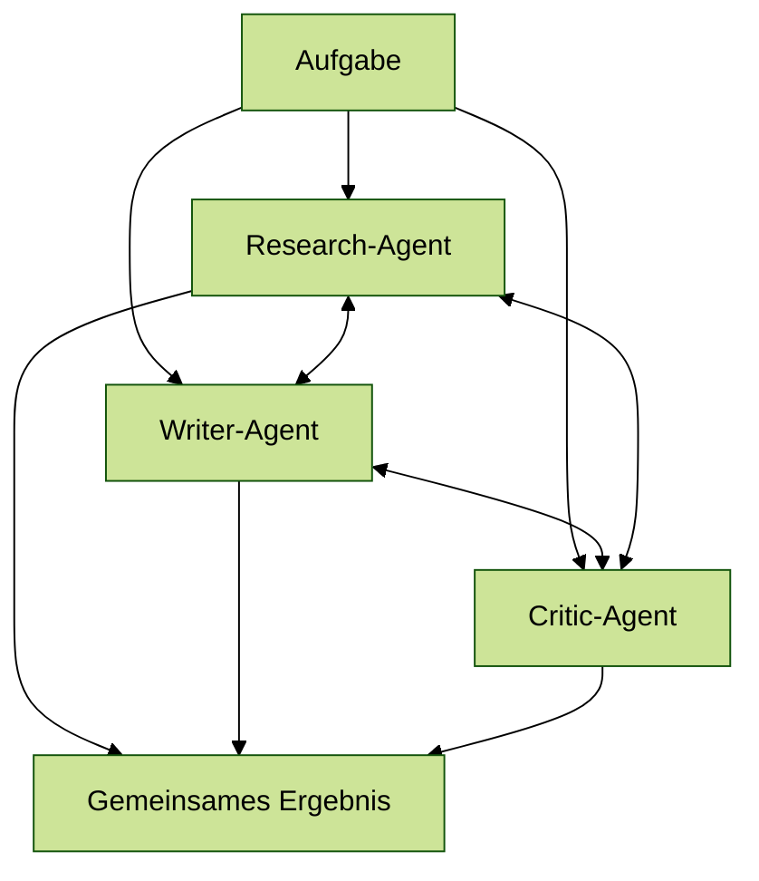

Dieses Muster ist flexibel, aber schwerer zu kontrollieren als Supervisor oder Pipeline. In Kurs- und Produktkontexten ist es vor allem als Gegenmodell wichtig: Nicht jede Zusammenarbeit braucht einen zentralen Supervisor, aber ohne klare Regeln entstehen schnell doppelte Arbeit, widersprüchliche Entscheidungen und hohe Kosten.

Swarm passt zu Aufgaben, bei denen mehrere Agenten gleichberechtigt Ideen, Hypothesen oder Perspektiven beisteuern. Für auditierbare Prozesse mit klarer Verantwortung ist das Muster meist zu offen.

### 6. Planner-Executor
Beim Planner-Executor-Muster trennt ein Planungsagent die Aufgabe in Schritte, während ein oder mehrere ausführende Agenten oder Tools diese Schritte abarbeiten. Der Planner entscheidet also nicht unbedingt selbst jedes Detail der Ausführung, sondern erzeugt eine kontrollierbare Aufgabenliste.

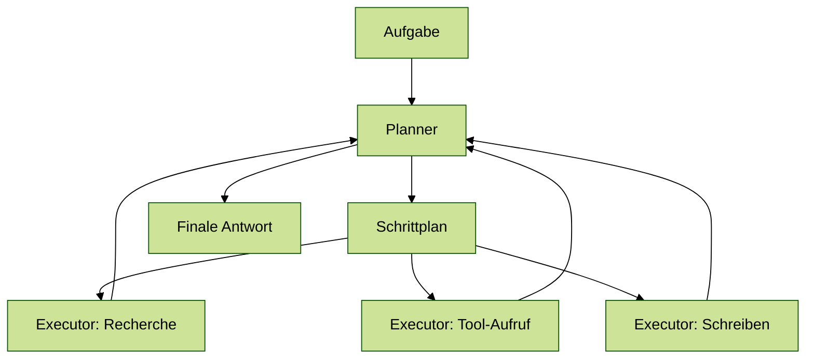

Der Vorteil liegt in der Trennung von Strategie und Ausführung. Der Plan kann angezeigt, geprüft oder angepasst werden, bevor riskante Schritte ausgeführt werden. Das Muster passt deshalb gut zu LangGraph-Workflows, weil Planung, Ausführung und Prüfung als eigene Nodes modelliert werden können.

Planner-Executor passt, wenn Aufgaben mehrstufig sind und der Lösungsweg sichtbar oder prüfbar sein soll. Das Muster wird problematisch, wenn der Plan zu früh festgeschrieben wird und spätere Beobachtungen nicht mehr einfließen.

### 7. Blackboard / Shared Workspace
Der Unterschied zu Swarm: Beim Blackboard kommunizieren Agenten nicht direkt miteinander — sie alle schreiben in denselben gemeinsamen Arbeitsbereich und lesen daraus. Die Koordination läuft über den State, nicht über direkte Nachrichten.

Zwischenergebnisse, Quellen, Pläne oder offene Fragen landen im geteilten State. Andere Agenten lesen diesen Arbeitsbereich und ergänzen oder korrigieren ihn.

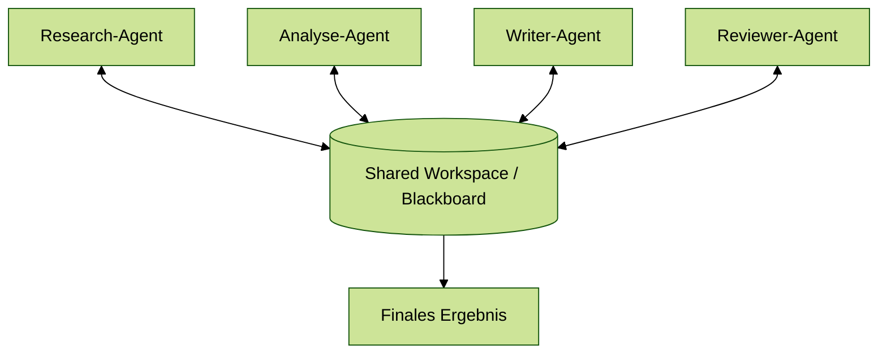

Dieses Muster ist besonders nützlich, wenn Agenten an gemeinsamen Artefakten arbeiten: Recherche-Notizen, Dateien, Tabellen, Pläne oder Entwürfe. Es ähnelt einem gemeinsamen Projektordner oder Scratchpad und macht Zusammenarbeit nachvollziehbarer als reine Chat-Übergaben.

Blackboard eignet sich, wenn mehrere Agenten Zwischenergebnisse teilen und gemeinsam an einem Artefakt arbeiten. Der gemeinsame State braucht Pflege: Ohne Status, Quellen und Ablaufregeln wächst er schnell unkontrolliert.

### 8. Pipeline / Sequential Agents
Bei einer Pipeline arbeiten mehrere Agenten in einer festen Reihenfolge. Jeder Agent übernimmt eine klar definierte Stufe und gibt sein Ergebnis an die nächste Stufe weiter. Anders als beim Router wird nicht dynamisch entschieden, wer zuständig ist; die Reihenfolge ist Teil des Designs.

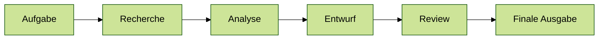

Dieses Muster ist oft die pragmatischste Multi-Agent-Architektur. Es ist leicht erklärbar, gut testbar und passt zu vielen realen Arbeitsabläufen: Recherche → Analyse → Bericht → Review. Der Nachteil ist die geringe Flexibilität, wenn ein späterer Schritt feststellt, dass frühere Informationen fehlen.

Pipeline ist stark, wenn die fachliche Reihenfolge stabil ist und jede Stufe eine klare Verantwortung hat. Viele Rücksprünge oder stark wechselnde Reihenfolgen sprechen eher für Workflow- oder Handoff-Muster.

Daneben gibt es weitere Muster — etwa **Reflection / Generator-Critic**. Dabei erzeugt ein Agent einen Entwurf, während ein zweiter prüft und Feedback zurückgibt. Das ist meist eher ein Qualitätssicherungs-Pattern als eine vollständige Architektur.

Multi-Agent-Systeme lohnen sich erst, wenn die Teilaufgaben fachlich oder technisch wirklich Spezialisierung brauchen. Sonst entstehen nur mehr Koordination, höhere Kosten und schwerere Fehlersuche.

**Passt gut, wenn:** Recherche, Schreiben, Prüfung oder Code-Arbeit klar trennbare Aufgaben mit unterschiedlichen Anforderungen sind.

Teuer wird es, wenn Agenten nur künstlich getrennt werden und am Ende dieselben Informationen mehrfach lesen oder dieselben Entscheidungen wiederholen.

### Mustervergleich: alle Koordinationsmuster im Überblick

Aufgabe: *Recherchebericht zu einem vorgegebenen Thema erstellen.*

| Muster | Steuerungslogik | Wie die Aufgabe läuft | Stärke | Hauptrisiko |
| :--- | :--- | :--- | :--- | :--- |
| **Supervisor** | Chef-Agent delegiert, sammelt Ergebnisse | Supervisor startet Recherche- und Writer-Agent parallel, führt Ergebnisse zusammen | parallele Ausführung, klare Zusammenführung | Supervisor wird Engpass |
| **Router** | klassifiziert am Eingang, leitet weiter | Thema bestimmt den Spezialisten: Wissenschaft, Wirtschaft oder Recht | schnell, kostengünstig | falsches Routing leitet alles in die falsche Richtung |
| **Handoffs** | dynamische Übergabe je nach Verlauf | Recherche-Agent erkennt Lücken, übergibt an Experten-Agent, der an Writer übergibt | flexibel bei wechselnden Zuständigkeiten | kein Agent hält den Gesamtüberblick |
| **Skills** | ein Agent lädt Fachwissen je nach Bedarf | ein Agent wechselt zwischen Recherche-, Schreib- und Analyse-Skill | einfach, kein Koordinationsaufwand | Agent wird bei vielen Skills zu breit |
| **Swarm** | gleichberechtigte Agenten kommunizieren direkt | Recherche-, Writer- und Critic-Agent arbeiten parallel, stimmen sich direkt ab | viele Perspektiven, kein Engpass | schwer zu kontrollieren, doppelte Arbeit möglich |
| **Planner-Executor** | Planer erzeugt Schrittplan, Executor führt aus | Planner zerlegt Auftrag in Recherche, Entwurf, Review — Executor arbeitet ab | Plan prüfbar vor Ausführung | starrer Plan, wenn Beobachtungen nicht rückfließen |
| **Blackboard** | alle schreiben in geteilten Workspace, kein Direktkontakt | Recherche-, Analyse-, Writer-Agent lesen und schreiben in gemeinsames Dokument | Zwischenergebnisse sichtbar, gut für Artefakte | State wächst unkontrolliert ohne Pflegeregeln |
| **Pipeline** | feste Reihenfolge, Stufe gibt Ergebnis weiter | Recherche → Analyse → Entwurf → Review, immer in dieser Folge | robust, gut testbar, erklärbar | starr, wenn spätere Stufen frühere Infos nachfordern |

## Reasoning-Muster: ReAct und Explore → Plan → Act

ReAct ist kein Architekturmuster, sondern ein optionaler Modus — nicht jeder Agent braucht ihn. Er kommt zum Einsatz, wenn der Lösungsweg offen ist und der Agent Zwischenergebnisse auswerten muss, um den nächsten Schritt zu bestimmen. ReAct gilt unabhängig davon, ob ein Agent allein oder als Teil eines Multi-Agent-Systems arbeitet.

ReAct kombiniert Nachdenken (*Reason*), Handeln (*Act*) und Beobachten (*Observe*) in einem wiederholten Zyklus. Der Agent prüft den aktuellen Stand, führt eine Aktion aus, liest das Ergebnis und entscheidet anschließend über den nächsten Schritt.

Im Code bleibt die Agenten-Erzeugung oft gleich. Der **Prompt** legt das gewünschte Verhalten fest, aber ReAct entsteht erst dann praktisch, wenn die Agenten-Logik den Loop mit Tools und Rücksprung erlaubt. Ohne diese Mechanik bleibt der Prompt nur eine Anweisung, nicht das Verhalten selbst.

```python
from langchain.chat_models import init_chat_model
from langchain.agents import create_agent
from langchain_core.tools import tool

llm = init_chat_model("openai:gpt-5.4-nano")

@tool
def get_order_status(order_id: str) -> str:
    """Gibt einen Bestellstatus zurück."""
    return f"Bestellung {order_id}: unterwegs"

# Ohne ReAct: eher direkte, einmalige Bearbeitung
direct_agent = create_agent(
    model=llm,
    tools=[get_order_status],
    system_prompt=(
        "Beantworte die Anfrage direkt. Nutze bei Bedarf genau ein Tool und "
        "schließe dann ab."
    ),
)

# Mit ReAct: iteratives Vorgehen mit Prüfen und erneutem Entscheiden
react_agent = create_agent(
    model=llm,
    tools=[get_order_status],
    system_prompt=(
        "Arbeite iterativ: prüfe die Lage, nutze Tools nur wenn nötig, "
        "werte das Ergebnis aus und entscheide dann über den nächsten Schritt."
    ),
)
```

> [!NOTE]
> Die Ausführungslogik kannst du auf zwei Arten festlegen:  
> entweder 
> + implizit über `create_agent()` zusammen mit dem `system_prompt`, oder 
> + explizit mit `LangGraph` über Nodes, Edges und bedingte Übergänge.  
>  
> Der Prompt beschreibt das gewünschte Verhalten; die Agenten-Logik setzt es um.

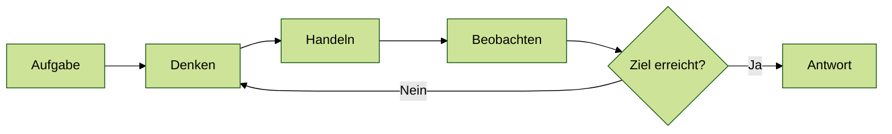

Ein typisches Beispiel ist eine Rechercheaufgabe. ReAct ist flexibel, kann aber teuer und langsam werden, wenn Schleifen nicht begrenzt sind.

| Agent | ReAct? | Warum |
| :--- | :--- | :--- |
| Tool-Calling-Agent | nein | entscheidet einmal, ruft ein Tool auf |
| Single-Agent | ja | Lösungsweg offen, muss iterieren |
| Supervisor | nein | delegiert nur, iteriert nicht selbst |
| Router | nein | klassifiziert einmal, leitet weiter |
| Sub-Agent (Handoffs, Skills) | ja oder nein | je nach Teilaufgabe: offen → ja, klar definiert → nein |
| Swarm-Agent | ja oder nein | je nach Teilaufgabe des einzelnen Agenten |
| Planner | nein | erzeugt einen Plan, iteriert nicht selbst |
| Executor | ja oder nein | je nach Komplexität der Teilaufgabe |
| Blackboard-Agent | ja oder nein | kann iterieren, wenn sein Beitrag offen ist |
| Pipeline-Stufe | nein | führt eine klar definierte Aufgabe aus, gibt weiter |

Explore → Plan → Act ist kein eigenes Architekturmuster, sondern eine Sicherheitsstruktur für den ReAct-Zyklus: Sie legt fest, in welcher Reihenfolge ein Agent lesen, planen und schreiben darf. Für produktive Systeme wird der freie Zyklus so durch drei Phasen eingehegt:

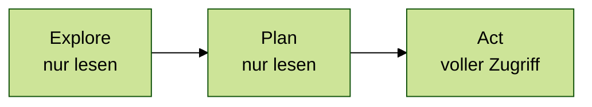

1. **Explore** — das System liest, sucht und sammelt Informationen (Dateien lesen, Suchen), ohne etwas zu verändern.
2. **Plan** — das Modell entscheidet, welche Schritte notwendig sind, und skizziert die Änderungen. Noch kein Schreiben, kein Ausführen.
3. **Act** — erst jetzt darf das System verändernd eingreifen: Dateien schreiben, APIs aufrufen, Daten speichern.

Diese Phasentrennung reduziert destruktive Fehler erheblich, weil ein Agent nicht im selben Schritt erkunden und gleichzeitig schreiben kann.

Ein einfaches Beispiel: Ein Agent soll eine Kundendatei korrigieren.

| Phase | Erlaubt | Nicht erlaubt |
| :--- | :--- | :--- |
| Explore | Datei lesen, Kundenstatus prüfen, relevante Regeln suchen | Datei ändern, Nachricht senden |
| Plan | Änderungsvorschlag formulieren, Risiko benennen | Änderung direkt ausführen |
| Act | Nach Freigabe Datei schreiben oder API aufrufen | Neue Entscheidung ohne erneute Prüfung treffen |

Explore → Plan → Act macht den ReAct-Zyklus sicherer, weil Lesen, Planen und Verändern nicht im selben Schritt verschwimmen.

## Harness Engineering: die Steuerungsschicht um das Modell

Harness Engineering ist kein Pflichtbestandteil jeder Architektur. Es wird nötig, sobald ein Agent echte Aktionen mit Konsequenzen ausführt — Dateien schreiben, E-Mails senden, APIs aufrufen. Viele Probleme entstehen dann nicht, weil das Modell zu schwach ist oder die falsche Architektur gewählt wurde, sondern weil die Steuerungsschicht fehlt. Dieses Konzept trägt den Namen **Harness Engineering**.

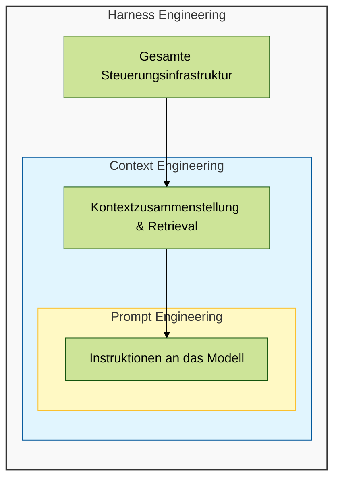

**Prompt Engineering** beschreibt die Instruktionen an das Modell. **Context Engineering** entscheidet, welche Informationen in den Kontext kommen. **Harness Engineering** steuert Tools, Speicher, Rechte, Fehlerpfade und Wiederherstellung.

Wenn ein Agent instabil wirkt, liegt das Problem oft nicht im Modell. Häufig fehlen klarer Kontext, sauberer State oder Kontrolle über Tools.

> [!NOTE]
> Konkretes Beispiel für Harness Engineering: Human-in-the-Loop (HITL).  
> Bevor der Agent eine riskante Aktion ausführt, wird der Ablauf angehalten, ein Mensch prüft den Vorschlag und gibt ihn erst danach frei.
>
> ```python
> from langgraph.types import interrupt, Command
>
> approved = interrupt("Soll die Rechnung wirklich geändert werden?")
> # später nach Freigabe
> result = graph.invoke(Command(resume="yes"), config)
> ```
>
> Genau hier greift die Steuerungsschicht: Sie erzwingt die Freigabe, statt sie nur im Prompt zu erwähnen.

| Agent | Harness? | Warum |
| :--- | :--- | :--- |
| Tool-Calling-Agent | optional | begrenzte Aktionen; einfache Fehlerbehandlung reicht oft |
| Single-Agent | ja | mehrere Tools in einer Schleife; braucht Kontrolle und Grenzen |
| Supervisor | ja | delegiert echte Aufgaben; muss Fehler von Sub-Agenten abfangen |
| Router | nein | klassifiziert nur, führt keine Aktionen aus |
| Sub-Agent (Handoffs, Skills) | ja | agiert selbständig; Übergabe hat Konsequenzen |
| Swarm-Agent | ja | kein zentraler Koordinator; Sicherheitsnetz besonders wichtig |
| Planner | nein | erzeugt nur einen Plan, führt keine Aktionen aus |
| Executor | ja | führt echte Aktionen aus; Kontrolle vor Schreibzugriff nötig |
| Blackboard-Agent | ja | schreibt in geteilten Workspace; Schreibkonflikte möglich |
| Pipeline-Stufe | ja oder nein | je nach Aktionstyp der Stufe |

## Welche Design-Prinzipien immer gelten

1. **Verantwortung trennen:** Komponenten sollten eine klar abgegrenzte Aufgabe haben.
2. **Kontrolle wahren:** Kritische Aktionen (Schreiben, Senden, Bezahlen) sollten validiert oder manuell freigegeben werden.
3. **Nachvollziehbarkeit:** Entscheidungen und Werkzeugaufrufe müssen geloggt werden (Tracing).
4. **Fehlerpfade mitdenken:** Was passiert, wenn ein Tool fehlschlägt oder das Modell eine ungültige Ausgabe liefert?

### Geschäftsregeln gehören in Code

Freigabegrenzen, Erstattungsbeträge oder Compliance-Vorgaben gehören in deterministischen Code — nicht in den System-Prompt. Prompts können missverstanden oder umgangen werden; Code prüft die Regel jedes Mal.

```python
def check_refund_policy(amount, customer_tier):
    limits = {"basic": 100, "premium": 500}
    return amount <= limits.get(customer_tier, 0)
```

Für viele Anwendungen reicht ein Single-Agent mit Tool-Calling aus. Multi-Agent-Systeme lohnen sich, wenn Aufgaben wirklich spezialisierte Rollen, parallele Verarbeitung oder getrennte Verantwortung erfordern.

## Abgrenzung zu verwandten Dokumenten

| Dokument | Frage |
| :--- | :--- |
| [Aufgaben & Lösungswege]({{ '/02-orientierung/aufgabenklassen-und-loesungswege.html' | relative_url }}) | Wann ist ein Agent sinnvoll, wann reicht Workflow oder klassischer Code? |
| [Tool Use & Function Calling]({{ '/08-agenten/tool-use-function-calling.html' | relative_url }}) | Wie werden Tools technisch beschrieben und abgesichert? |
| [Model Context Protocol]({{ '/08-agenten/mcp-model-context-protocol.html' | relative_url }}) | Wann wird eine wiederverwendbare Tool-Integrationsschicht sinnvoll? |
| [LangGraph Einsteiger]({{ '/06-frameworks/einsteiger-langgraph.html' | relative_url }}) | Wie werden zustandsbasierte Workflows technisch umgesetzt? |
| [Memory-Systeme]({{ '/03-grundlagen/memory-systeme.html' | relative_url }}) | Wie behält ein System Kontext über die aktuelle Nachricht hinaus? |

---

**Version:** 1.7<br>
**Stand:** Juli 2026<br>
**Kurs:** Generative KI. Verstehen. Anwenden. Gestalten.
