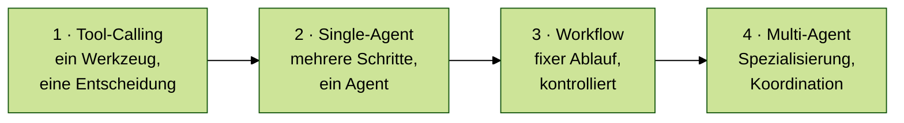
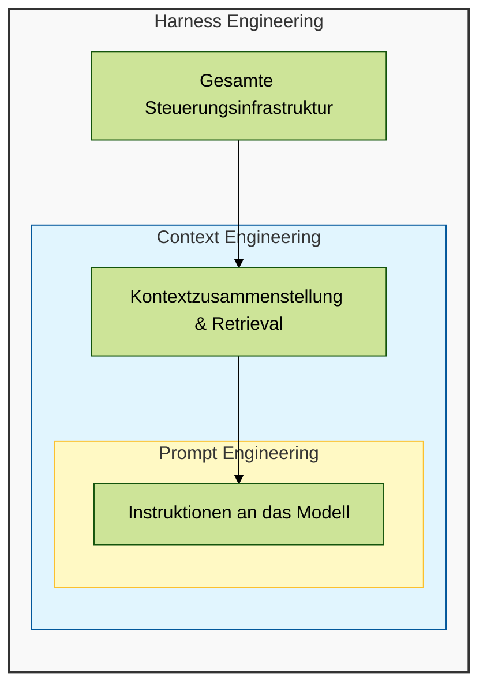
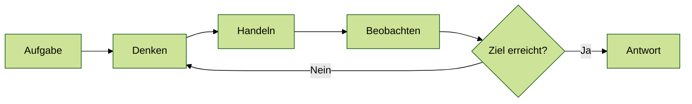
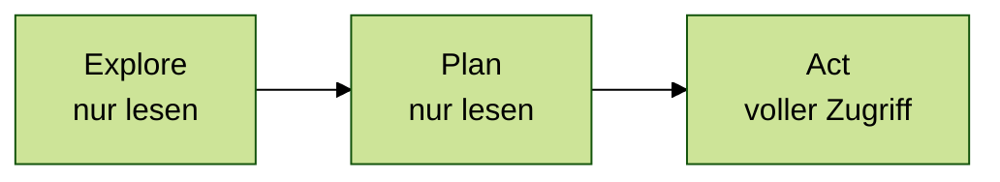
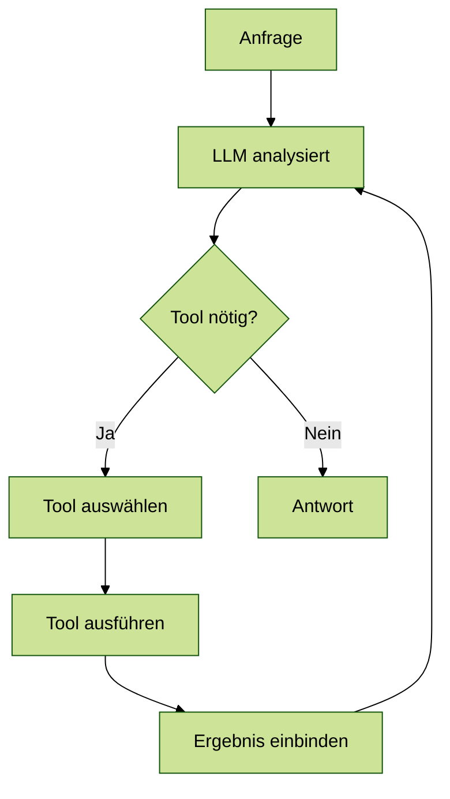
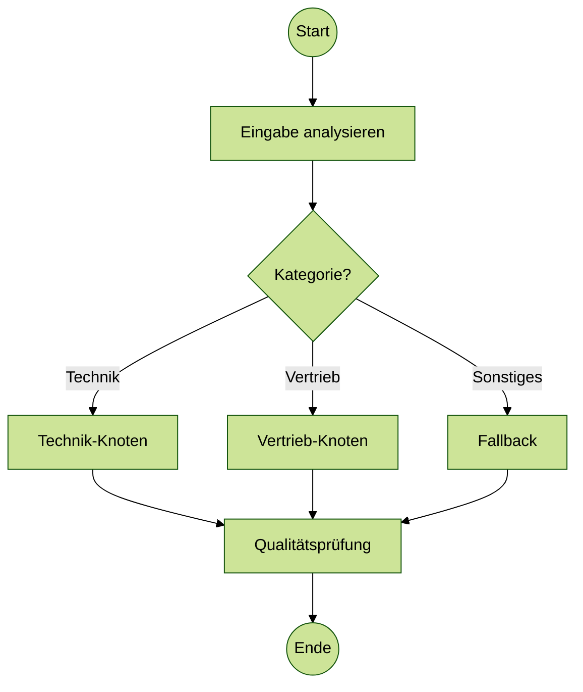
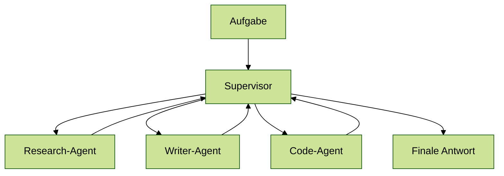
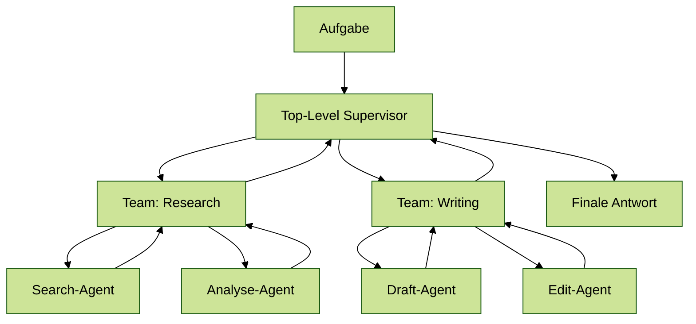
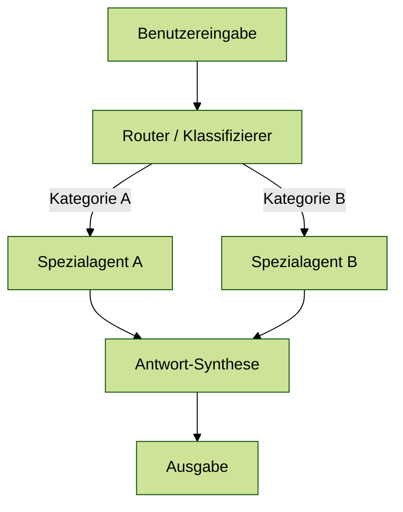
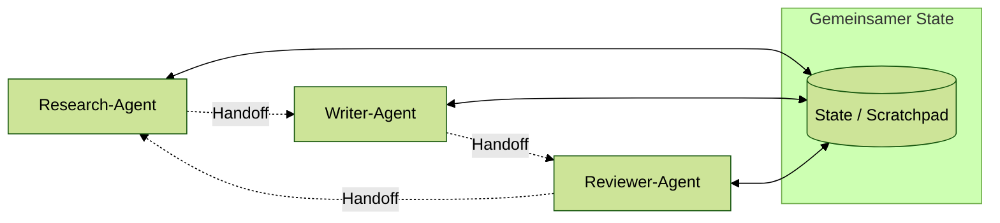

# Agenten-Architekturen
{: .no_toc }

> **Die Architektur entscheidet, wie ein System denkt, handelt, Grenzen einhält und mit Fehlern umgeht.**

---

# Inhaltsverzeichnis
{: .no_toc .text-delta }

1. TOC
{:toc}

---

## Warum die Architekturfrage früh geklärt werden muss

Viele GenAI-Projekte scheitern nicht am Modell, sondern an einer unpassenden Grundstruktur. Eine Anwendung soll vielleicht nur ein Werkzeug aufrufen, wird aber als komplexes Multi-Agent-System geplant. Oder ein eigentlich mehrstufiger Prozess wird als freier ReAct-Loop modelliert und verliert dadurch Kontrolle, Nachvollziehbarkeit und Kostenstabilität.

Architektur meint in diesem Zusammenhang nicht zuerst Framework oder Programmiersprache. Gemeint ist die Entscheidung, wie ein System Aufgaben zerlegt, wie viel Entscheidungsfreiheit es erhält und an welchen Stellen deterministische Logik wichtiger ist als modellbasierte Flexibilität. Diese Unterscheidung ist zentral, weil sie viele spätere Probleme bereits vorwegnimmt.

Typischer Fehler: Zu früh die technisch eindrucksvollste Architektur zu wählen. In der Praxis ist die einfachste Struktur oft die robusteste.

## Ein einfaches Beispiel

Ein Support-System soll drei Arten von Anfragen bearbeiten: Lieferstatus nennen, Rechnung erneut senden und komplexe Sonderfälle an einen Menschen weiterleiten. Schon dieses kleine Beispiel zeigt, dass Architektur keine akademische Zusatzfrage ist. Für den Lieferstatus reicht meist ein gezielter Tool-Aufruf. Für die Rechnung braucht es eventuell mehrere Schritte. Für Sonderfälle wird eine sichere Eskalation benötigt.

Aus genau solchen Anforderungen ergibt sich die Architektur. Nicht jede Aufgabe braucht einen frei planenden Agenten. Häufig genügt ein klarer Workflow oder ein Tool-Calling-Muster mit wenigen kontrollierten Entscheidungen.

## Mini-Glossar für dieses Kapitel

Einige Begriffe tauchen in Agenten-Architekturen immer wieder auf. Für dieses Dokument reichen diese Arbeitsdefinitionen:

| Begriff | Einfache Bedeutung |
| :--- | :--- |
| **Agent** | Ein System, das mit einem Modell Entscheidungen trifft und bei Bedarf Werkzeuge nutzt. |
| **Tool** | Eine klar beschriebene Funktion, die der Agent aufrufen darf, z.B. Datenbankabfrage oder E-Mail-Versand. |
| **State** | Der aktuelle Arbeitsstand: Nachrichten, Zwischenergebnisse, Entscheidungen oder offene Schritte. |
| **Workflow** | Ein vorgegebener Ablauf aus Schritten und Verzweigungen. |
| **Tracing** | Protokollierung, was das Modell entschieden und welche Tools es aufgerufen hat. |
| **Harness** | Die Steuerungsschicht um das Modell: Tools, Regeln, Speicher, Fehlerbehandlung und Freigaben. |

## Überblick: vier Stufen von einfach bis komplex

Die Architekturen in diesem Dokument bauen aufeinander auf. Jede Stufe erhöht die Flexibilität — und gleichzeitig den Koordinationsaufwand:



| Stufe | Muster | Wann sinnvoll |
| :---: | :--- | :--- |
| 1 | Tool-Calling | Ein klares Ziel, ein Werkzeugaufruf |
| 2 | Single-Agent, z.B. ReAct | Offene Aufgabe, Zwischenschritte unbekannt |
| 3 | Workflow | Kontrollierter Ablauf mit fixen Verzweigungen |
| 4 | Multi-Agent | Spezialisierung nötig, Teilaufgaben klar trennbar |

**Empfehlung:** Mit der einfachsten Stufe beginnen, die die Aufgabe löst — und nur dann eine Stufe höher gehen, wenn konkrete Grenzen erreicht werden.

## Schneller Entscheidungsleitfaden

Diese Fragen helfen bei der Auswahl:

1. **Gibt es nur eine klar begrenzte Aktion?**  
   Dann reicht meist **Tool-Calling**.

2. **Ist der Lösungsweg offen und muss das System selbst Zwischenschritte wählen?**  
   Dann passt ein **Single-Agent**, häufig mit ReAct-artigem Ablauf.

3. **Ist der Ablauf fachlich klar vorgegeben oder muss er auditierbar sein?**  
   Dann ist ein **Workflow** besser als ein freier Agenten-Loop.

4. **Sind die Teilaufgaben wirklich unterschiedlich genug, dass Spezialisierung hilft?**  
   Erst dann lohnt sich **Multi-Agent**.

5. **Gibt es schreibende oder riskante Aktionen?**  
   Dann braucht jede Architektur zusätzliche Kontrolle: Validierung, Human-in-the-Loop oder feste Berechtigungen.

Merksatz: **Erst Tool-Calling prüfen, dann Workflow, dann Single-Agent, erst zuletzt Multi-Agent.**

## Zwei Blickrichtungen auf Agentische Systeme

Systeme mit agentischen Fähigkeiten lassen sich aus zwei Blickrichtungen beschreiben. Die erste fragt, wie ein Modell grundsätzlich zu einer Entscheidung kommt. Die zweite fragt, wie diese Logik technisch organisiert wird.

Die **Intelligenzperspektive** beschreibt das Entscheidungsprinzip. Handelt ein System streng regelbasiert, zustandsbasiert, zielorientiert oder nutzenmaximierend? Die **Architekturperspektive** beschreibt dagegen das praktische Baumuster, etwa ReAct, Tool-Calling, Workflow oder Multi-Agent. Beide Ebenen hängen zusammen, sind aber nicht identisch.

## Harness Engineering: die Steuerungsschicht um das Modell

Viele Probleme entstehen nicht, weil das Modell zu schwach ist, sondern weil die Steuerungsschicht um das Modell herum fehlt oder schlecht gestaltet ist. Dieses Konzept trägt den Namen **Harness Engineering**.

Harness Engineering bezeichnet die Praxis, die Kontroll- und Steuerungsschicht rund um ein LLM zu gestalten — also alles, was zwischen der Rohmodellausgabe und einer realen Aktion liegt.



**Prompt Engineering** ist die innerste Schicht: Instruktionen, Rollenbeschreibungen, Beispiele — was dem Modell gesagt wird.

**Context Engineering** bestimmt, was überhaupt in den Kontext fließt und wann: Retrieval, Kompression, Zusammensetzung.

**Harness Engineering** umfasst alles darüber hinaus: Werkzeugorchestrierung, Speichersysteme, Berechtigungsgrenzen, Fehlerbehandlung und Wiederherstellungslogik.

Die wichtigste Erkenntnis: Selbst das beste Modell scheitert ohne eine durchdachte Steuerungsschicht. Instabilität, Halluzinationen oder Endlosschleifen werden dann oft dem Modell zugeschrieben — meistens liegt das Problem aber in einem unstrukturierten Kontext, inkonsistentem Speicher oder fehlender Fehlerbehandlung.

## Welche Entscheidungslogik hinter einem Agenten steckt

Eine einfache **Regelarchitektur** reagiert auf klar definierte Muster. Das entspricht einem Simple-Reflex-Agenten: Wenn Bedingung A erfüllt ist, folgt Aktion B. Solche Systeme sind schnell und gut kontrollierbar, kommen aber bei unerwarteten Situationen an ihre Grenzen.

Ein **zustandsbasierter Agent** berücksichtigt zusätzlich, was bereits bekannt ist. Diese Form ist nützlich, wenn ein Verlauf oder ein interner Status mitgeführt werden muss (z.B. in LangGraph).

**Zielorientierte Agenten** bewerten, welche Aktion dem gewünschten Ergebnis näherkommt. **ReAct-Systeme** verhalten sich oft so: Sie planen nicht vollständig im Voraus, sondern nähern sich dem Ziel iterativ durch Nachdenken und Handeln.

## ReAct: wenn der Lösungsweg noch nicht feststeht

ReAct kombiniert Nachdenken (*Reason*), Handeln (*Act*) und Beobachten (*Observe*) in einem wiederholten Zyklus. Der Agent prüft den aktuellen Stand, führt eine Aktion aus, liest das Ergebnis und entscheidet anschließend über den nächsten Schritt.



Ein typisches Beispiel ist eine Rechercheaufgabe. Der Vorteil liegt in der Flexibilität. Der Nachteil liegt in den Schleifen: Ohne gute Begrenzung wachsen Kosten, Latenz und Fehlerrisiken schnell an.

In der Praxis relevant, wenn: Die Aufgabe offen ist, mehrere Zwischenschritte nötig sind und vorab nicht feststeht, welche Aktion als Nächstes sinnvoll ist.

## Explore → Plan → Act: ReAct für den Produktionseinsatz

ReAct ist flexibel, aber oft schwer zu kontrollieren. Produktive Systeme unterteilen ihre Arbeit deshalb häufig in **drei klar getrennte Phasen**:



1. **Explore** — das System liest, sucht und sammelt Informationen (Dateien lesen, Suchen), ohne etwas zu verändern.
2. **Plan** — das Modell entscheidet, welche Schritte notwendig sind, und skizziert die Änderungen. Noch kein Schreiben, kein Ausführen.
3. **Act** — erst jetzt darf das System verändernd eingreifen: Dateien schreiben, APIs aufrufen, Daten speichern.

Diese Phasentrennung reduziert destruktive Fehler erheblich, weil ein Agent nicht im selben Schritt erkunden und gleichzeitig schreiben kann.

Ein einfaches Beispiel: Ein Agent soll eine Kundendatei korrigieren.

| Phase | Erlaubt | Nicht erlaubt |
| :--- | :--- | :--- |
| Explore | Datei lesen, Kundenstatus prüfen, relevante Regeln suchen | Datei ändern, Nachricht senden |
| Plan | Änderungsvorschlag formulieren, Risiko benennen | Änderung direkt ausführen |
| Act | Nach Freigabe Datei schreiben oder API aufrufen | Neue Entscheidung ohne erneute Prüfung treffen |

Für Einsteiger ist wichtig: ReAct beschreibt den Denk- und Handlungszyklus. Explore → Plan → Act ist eine Sicherheitsstruktur, die diesen Zyklus in kontrollierbare Abschnitte zerlegt.

## Tool-Calling: wenn das Modell Werkzeuge steuern soll

Beim Tool-Calling entscheidet das Modell, welches Werkzeug mit welchen Parametern aufgerufen werden soll. Dieses Muster ist oft der sinnvollste Einstieg, weil die Freiheitsgrade begrenzt bleiben und das System trotzdem handlungsfähig wird.



Die Stärke liegt darin, dass das Modell flexibel formulieren kann, während die eigentliche Aktion in deterministischem Code oder in einer externen API stattfindet.

**Passt gut, wenn:** Die Aufgabe klar ist und das Modell nur entscheiden muss, ob und mit welchen Parametern ein Werkzeug aufgerufen wird.

**Wird zu eng, wenn:** mehrere unsichere Zwischenschritte nötig sind oder der Ablauf stark vom Ergebnis vorheriger Tools abhängt.

## Workflow-basierte Architektur: wenn der Ablauf kontrolliert sein muss

Workflow-basierte Architekturen modellieren einen klaren Ablauf aus Knoten und Verzweigungen. Das System entscheidet nicht in jeder Runde völlig frei, sondern bewegt sich entlang eines vorgegebenen Prozesses.



Diese Struktur ist weniger flexibel als ReAct, dafür aber robuster, erklärbarer und leichter abzusichern (z.B. durch Human-in-the-Loop-Schritte).

**Passt gut, wenn:** Reihenfolge, Freigaben oder Fehlerpfade fachlich klar sind.

**Wird zu starr, wenn:** das System viele unvorhersehbare Recherche- oder Entscheidungsschritte selbst finden muss.

## Single-Agent-Architektur (Ein-Agenten-Systeme)

### Funktionsweise
Ein einzelner Agent übernimmt die vollständige Ausführung einer Aufgabe. Er zerlegt Ziele in Einzelschritte, greift auf Werkzeuge (Tools) zu, führt diese aus und reflektiert das Ergebnis. Das kann einfaches Tool-Calling sein oder ein ReAct-artiger Zyklus aus Denken, Handeln und Beobachten.

### Vorteile
- **Einfachheit:** Sehr einfach umzusetzen, da keine Koordination zwischen verschiedenen Agenten nötig ist.
- **Effizienz:** Ideal für geradlinige, mehrschrittige Aufgaben mit geringerem Overhead.
- **Ressourcen:** Geringerer Token-Verbrauch und schnellere Latenzzeiten im Vergleich zu Multi-Agenten-Systemen.

### Nachteile
- **Komplexitätsgrenze:** Stößt bei zu hoher Komplexität an Grenzen, da ein einzelnes Modell alle Kontextdaten halten und alle Entscheidungen treffen muss.
- **Fehleranfälligkeit:** Fehler im Pfad (z. B. falsche Tool-Auswahl) können nicht immer zuverlässig abgefangen werden.

**Passt gut, wenn:** eine Aufgabe mehrere Schritte braucht, aber noch von einer einzigen Rolle sinnvoll bearbeitet werden kann.

**Wird schwierig, wenn:** unterschiedliche Fachrollen, getrennte Kontexte oder unabhängige Qualitätsprüfungen nötig werden.

## Multi-Agenten-Architekturen (Systeme mit mehreren Agenten)

Wenn Aufgaben für einen einzelnen Agenten zu komplex werden, kommen spezialisierte Agenten zum Einsatz, die die Arbeit unter sich aufteilen. Zu den wichtigsten Mustern gehören:

### 1. Supervisor-Architektur (Hierarchisch)
Ein zentraler Chef-Agent (Supervisor) koordiniert mehrere spezialisierte Unter-Agenten. Der Chef delegiert die Teilaufgaben, behält den Überblick und führt die Ergebnisse zusammen.



Bei sehr großen Systemen kann diese Struktur auch **hierarchisch** verschachtelt werden (Hierarchical Supervisor), bei dem ein Top-Level-Supervisor an untergeordnete Team-Supervisoren delegiert, die wiederum ihre eigenen Teams koordinieren.



### 2. Router-Architektur (Klassifikation)
Ein Routing-Schritt klassifiziert die Benutzereingabe und leitet sie direkt an den am besten geeigneten Spezialagenten weiter, dessen Antwort anschließend synthetisiert wird. Dies schont das Kontextfenster und spart Latenz und Kosten, da nur der jeweils benötigte Agent aufgerufen wird.



### 3. Handoffs (Übergabe-Muster)
Ein Agent arbeitet an einer Aufgabe und übergibt die Kontrolle bei Bedarf direkt an einen anderen Agenten weiter, inklusive des bisherigen Kontextes. Dies ist typisch für kollaborative Netzwerke (Network / Collaborative), in denen die Agenten sich einen gemeinsamen State teilen und dynamisch entscheiden, wer das Problem als Nächstes fortführt.



### 4. Skills-Architektur
Ein einziger Agent nutzt progressive Erweiterung. Er lädt bei Bedarf spezifisches Fachwissen (Skills) und spezialisierte System-Prompts, je nachdem, was die aktuelle Situation erfordert. Dies verbindet die Einfachheit eines Single-Agent-Systems mit der fachlichen Tiefe spezialisierter Agenten.

Daneben gibt es weitere, seltener benötigte Muster — etwa **Sequential/Pipeline** (feste Reihenfolge ohne Dispatcher, z. B. Recherche → Analyse → Report ohne Rückfragen) oder **Reflection / Generator-Critic** (ein Agent erzeugt, ein zweiter prüft und gibt Feedback zurück).

Multi-Agent-Systeme sind komplexer in der Orchestrierung und verursachen höheren Koordinationsaufwand. Sie lohnen sich erst, wenn die Teilaufgaben fachlich oder technisch wirklich eine Spezialisierung erfordern.

**Passt gut, wenn:** Recherche, Schreiben, Prüfung oder Code-Arbeit klar trennbare Aufgaben mit unterschiedlichen Anforderungen sind.

**Wird zu teuer, wenn:** die Agenten nur künstlich getrennt werden und am Ende dieselben Informationen mehrfach lesen oder dieselben Entscheidungen wiederholen.

## Welche Architektur meist zuerst gewählt werden sollte

Die Wahl der Architektur sollte der Komplexität der Aufgabe folgen:

| Situation | Naheliegende Wahl |
| :--- | :--- |
| FAQ plus Datenbankzugriff | Tool-Calling |
| Mehrstufiger Genehmigungsprozess | Workflow |
| Offene Rechercheaufgabe | ReAct |
| Arbeitsteilige Content-Erstellung | Multi-Agent |

### Kurze Übung

Ordne die passende Architektur zu:

| Mini-Fall | Wahrscheinlich passende Architektur |
| :--- | :--- |
| Nutzer fragt nach dem Status einer Bestellung. Das System muss nur eine Datenbank abfragen. | Tool-Calling |
| Ein Antrag muss geprüft, bei Grenzwerten freigegeben und danach dokumentiert werden. | Workflow |
| Ein Agent soll zu einem neuen Thema recherchieren und erst unterwegs entscheiden, welche Quellen relevant sind. | Single-Agent / ReAct |
| Ein Bericht braucht Recherche, Entwurf und unabhängige Qualitätsprüfung. | Multi-Agent oder Workflow mit Prüfschritt |

Wenn mehrere Antworten plausibel wirken, ist das normal. Entscheidend ist nicht der Name des Musters, sondern ob Kontrolle, Kosten und Nachvollziehbarkeit zur Aufgabe passen.

## Welche Design-Prinzipien immer gelten

1. **Verantwortung trennen:** Komponenten sollten eine klar abgegrenzte Aufgabe haben.
2. **Kontrolle wahren:** Kritische Aktionen (Schreiben, Senden, Bezahlen) sollten validiert oder manuell freigegeben werden.
3. **Nachvollziehbarkeit:** Entscheidungen und Werkzeugaufrufe müssen geloggt werden (Tracing).
4. **Fehlerpfade mitdenken:** Was passiert, wenn ein Tool fehlschlägt oder das Modell eine ungültige Ausgabe liefert?

## Geschäftsregeln gehören in Code

Wenn Freigabegrenzen, Erstattungsbeträge oder Compliance-Vorgaben gelten, gehören diese Regeln in deterministischen Code und nicht allein in den System-Prompt. Ein Prompt kann umschrieben werden; eine Regel im Code garantiert die Einhaltung.

```python
# Beispiel: Deterministische Prüfung statt "Modell-Gefühl"
def check_refund_policy(amount, customer_tier):
    limits = {"basic": 100, "premium": 500}
    return amount <= limits.get(customer_tier, 0)
```

## Abgrenzung zu verwandten Dokumenten

| Dokument | Frage |
| :--- | :--- |
| [Aufgaben & Lösungswege]({{ '/02-orientierung/aufgabenklassen-und-loesungswege.html' | relative_url }}) | Wann ist ein Agent sinnvoll und wann eher Workflow, RAG oder klassischer Code? |
| [Tool Use & Function Calling]({{ '/08-agenten/tool-use-function-calling.html' | relative_url }}) | Wie werden Werkzeuge technisch beschrieben, aufgerufen und abgesichert? |
| [Model Context Protocol]({{ '/08-agenten/mcp-model-context-protocol.html' | relative_url }}) | Wann wird aus lokalen Tools eine wiederverwendbare Integrationsschicht? |
| [LangGraph Einsteiger]({{ '/06-frameworks/einsteiger-langgraph.html' | relative_url }}) | Wie werden zustandsbasierte Workflows technisch umgesetzt? |
| [Memory-Systeme]({{ '/03-grundlagen/memory-systeme.html' | relative_url }}) | Wie behält ein System Kontext über die aktuelle Nachricht hinaus? |

---

**Version:** 1.6<br>
**Stand:** Mai 2026<br>
**Kurs:** Generative KI. Verstehen. Anwenden. Gestalten.
