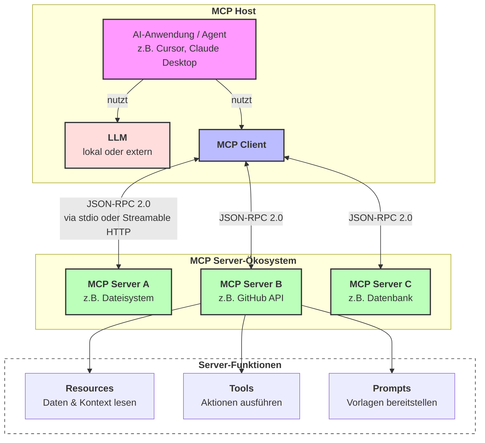
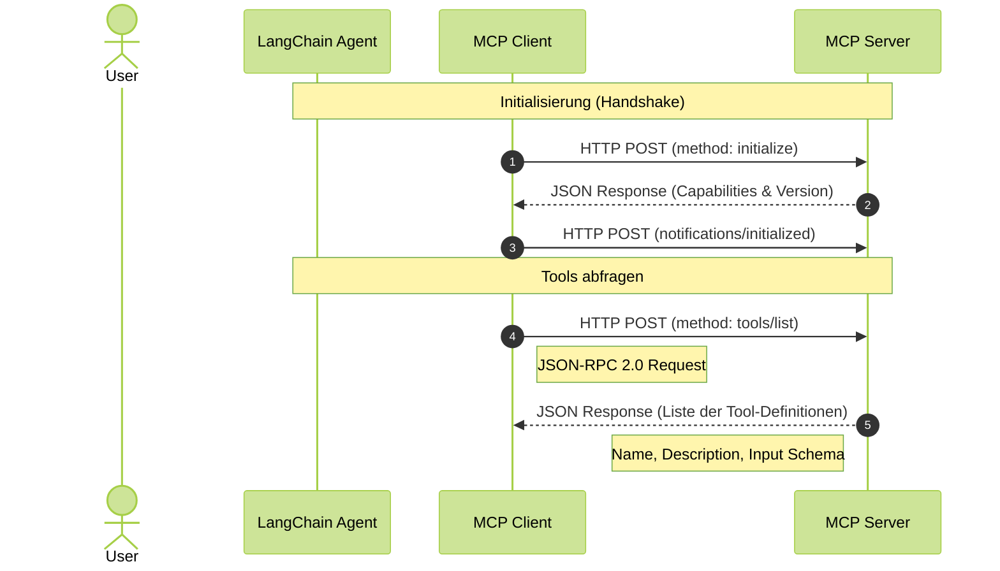

# Model Context Protocol
{: .no_toc }

> **MCP verschiebt Tool-Anbindung von einzelnen Funktionsaufrufen zu einer wiederverwendbaren Integrationsschicht.**

---

# Inhaltsverzeichnis
{: .no_toc .text-delta }

1. TOC
{:toc}

---

## Warum MCP entstanden ist

Tool Use löst ein lokales Problem: Ein Modell bekommt ein Werkzeug mit Name, Beschreibung und Parametern und kann einen strukturierten Aufruf vorschlagen. Das funktioniert gut, solange wenige Tools direkt in einer Anwendung definiert werden. Sobald mehrere Anwendungen dieselben Datenquellen, Dateiwerkzeuge, Ticketsysteme oder Datenbanken nutzen sollen, entsteht Integrationsarbeit an jeder Stelle neu.

Das **Model Context Protocol (MCP)** standardisiert diese Integrationsschicht. Ein Tool wird nicht mehr nur als lokale Python-Funktion an ein Modell gebunden, sondern über einen MCP-Server bereitgestellt. Eine Host-Anwendung, etwa eine IDE, ein Chat-Client oder ein Agenten-Framework, verbindet sich über einen MCP-Client mit diesem Server und entdeckt dort verfügbare Fähigkeiten.

In der Praxis relevant, wenn mehrere GenAI-Anwendungen auf dieselben Werkzeuge oder Daten zugreifen sollen. Für einen einzelnen Taschenrechner im Notebook ist MCP überdimensioniert; für wiederverwendbaren Zugriff auf Projektdateien, interne Dokumente oder Fachsysteme kann die Standardisierung den Wartungsaufwand deutlich senken.

## Grundmodell

MCP unterscheidet drei Rollen. Der **Host** ist die Anwendung, in der das Modell genutzt wird. Der **Client** ist der Konnektor innerhalb dieses Hosts. Der **Server** stellt Fähigkeiten bereit: Werkzeuge, Kontextdaten oder Prompt-Vorlagen. Die Spezifikation beschreibt dafür JSON-RPC-2.0-Nachrichten, Capability Negotiation und zustandsbehaftete Verbindungen.





Der wichtige Architekturpunkt liegt nicht im Diagramm, sondern in der Verantwortungsgrenze. Die Host-Anwendung entscheidet, welche Server verbunden werden, welche Daten weitergegeben werden und welche Tool-Aufrufe Freigabe brauchen. Der Server beschreibt Fähigkeiten und liefert Ergebnisse, ersetzt aber nicht die Sicherheitslogik des Hosts.

## Tools, Resources und Prompts

MCP-Server können drei zentrale Arten von Fähigkeiten anbieten:

| Fähigkeit | Bedeutung | Beispiel |
|---|---|---|
| Tools | ausführbare Funktionen, die ein Modell anstoßen kann | Ticket suchen, Datei analysieren, Datenbankabfrage ausführen |
| Resources | Kontext oder Daten, die gelesen werden können | Projektdatei, Dokumentationsseite, Datenbankauszug |
| Prompts | wiederverwendbare Prompt-Vorlagen oder Workflows | Review-Prompt, Analysevorlage, strukturierter Rechercheauftrag |

Tools ähneln Function Calling am stärksten. Der Unterschied liegt in der Bereitstellung: Beim klassischen Function Calling ist das Tool meist Teil der Anwendung. Bei MCP kann ein externer Server mehrere Tools verwalten und verschiedenen Clients anbieten. Resources sind dagegen kein Funktionsaufruf, sondern Kontext. Prompts liefern strukturierte Vorlagen, die ein Host als Startpunkt für Interaktionen nutzen kann.

Typischer Fehler: MCP nur als neue Schreibweise für Function Calling zu behandeln. MCP standardisiert nicht den Modellaufruf selbst, sondern die Verbindung zwischen KI-Anwendung und externen Fähigkeiten.

## Abgrenzung zu Function Calling

Function Calling beschreibt, wie ein Modell einen strukturierten Aufruf erzeugt. MCP beschreibt, wie Anwendungen solche Fähigkeiten entdecken, beschreiben und über eine einheitliche Protokollschicht nutzen können. Beide Konzepte schließen sich nicht aus. In vielen Systemen bleibt Function Calling die Modellseite, während MCP die Integrationsseite bereitstellt.

| Frage | Function Calling | MCP |
|---|---|---|
| Wo liegt der Fokus? | strukturierter Modellaufruf | standardisierte Tool- und Kontextintegration |
| Wer definiert das Tool? | meist die Anwendung | ein MCP-Server |
| Was wird wiederverwendet? | Funktionsschema im Code | Server mit Tools, Resources und Prompts |
| Wann lohnt es sich? | wenige lokale Werkzeuge | mehrere Clients oder wiederverwendbare Integrationen |

Nicht geeignet, wenn eine Anwendung nur ein oder zwei stabile lokale Funktionen braucht. Dann erhöht MCP die Komplexität, ohne ein echtes Integrationsproblem zu lösen.

## Sicherheitsgrenzen

MCP macht externe Fähigkeiten leichter anschließbar. Genau deshalb wird Sicherheit wichtiger, nicht weniger wichtig. Ein Server kann Zugriff auf Dateien, Datenbanken, interne APIs oder ausführbaren Code vermitteln. Die offizielle Spezifikation betont deshalb Zustimmung, Kontrolle, Datenschutz und Tool-Sicherheit als zentrale Prinzipien.

> [!WARNING] Tool-Beschreibungen sind keine Vertrauensgrenze<br>
> Ein Modell sieht Tool-Namen und Beschreibungen als Steuerungsinformation. Diese Beschreibungen können falsch, zu weit gefasst oder absichtlich irreführend sein. Host-Anwendungen müssen Server, Tool-Rechte und Freigaben getrennt prüfen.

Für Kurs- und Projektkontexte reichen drei Regeln als Mindeststandard. Erstens werden nur MCP-Server verbunden, deren Zweck und Rechte nachvollziehbar sind. Zweitens bekommen Server nur die Datenräume, die für die Aufgabe nötig sind. Drittens brauchen riskante Aktionen eine Freigabe, bevor Dateien verändert, externe Systeme angesprochen oder sensible Daten weitergegeben werden.

Grenze: MCP selbst erzwingt diese Regeln nicht vollständig. Die Spezifikation beschreibt Sicherheitsprinzipien; die konkrete Anwendung muss Zugriffskontrollen, Bestätigungsdialoge, Logging und Datenminimierung umsetzen.

## Mini-Beispiel

Ein Research Assistant soll lokale Fachartikel durchsuchen und eine Antwort mit Quellenangaben formulieren. Ohne MCP wird ein Datei- oder Retrieval-Tool direkt in der Anwendung implementiert. Mit MCP kann ein Dokumentenserver dieselbe Fähigkeit mehreren Clients anbieten: Notebook, Chat-Oberfläche und IDE nutzen denselben Server, statt eigene Datei-Logik zu pflegen.

```text
Host: Research-Assistant-UI
Client: MCP-Konnektor im Host
Server: dokumente-mcp
Tools: suche_passagen, zitiere_quelle
Resources: file://korpus/artikel-01.pdf, file://korpus/artikel-02.pdf
```

Der Vorteil entsteht erst, wenn diese Wiederverwendung gebraucht wird. Für eine einmalige Notebook-Demo bleibt ein lokales Retrieval-Tool klarer. Für mehrere Oberflächen oder mehrere Agenten mit gleichem Dokumentenzugriff wird ein MCP-Server zur sauberen Schnittstelle.




## Einordnung

MCP gehört nicht an den Anfang der Agentenlogik. Zuerst müssen Tool Use, Function Calling und klare Tool-Grenzen verstanden sein. Danach zeigt MCP, wie solche Werkzeuge über Anwendungsgrenzen hinweg bereitgestellt werden können.

Für GenAI reicht die konzeptionelle Tiefe: MCP ist eine standardisierte Schnittstelle für Kontext, Tools und Prompts. Die vollständige Umsetzung mit eigenen Servern, Deployment, Rechtekonzepten und Multi-Agent-Integration gehört in weiterführende Agenten- oder Produktionsmodule.

## Weiterführende Quellen

| Quelle | Inhalt |
|---|---|
| [MCP-Spezifikation](https://modelcontextprotocol.io/specification/2025-11-25/basic) | Rollen, Protokoll, Features und Sicherheitsprinzipien |
| [MCP-Dokumentation](https://modelcontextprotocol.io) | Einstieg, Konzepte und Implementierungsbeispiele |
| [Offizielles GitHub-Repository](https://github.com/modelcontextprotocol/modelcontextprotocol) | Spezifikation, Schema und Dokumentationsquellen |

## Abgrenzung zu verwandten Dokumenten

| Dokument | Frage |
|---|---|
| [Tool Use & Function Calling](./tool-use-function-calling.html) | Wie erzeugt ein Modell strukturierte Werkzeugaufrufe? |
| [Agenten-Architekturen](./agent-architekturen.html) | Welche Grundstruktur passt zu einem agentischen System? |
| [GenAI-Sicherheit](../07-qualitaet-sicherheit/genai-sicherheit.html) | Welche Risiken entstehen durch Tools, Datenzugriff und externe Schnittstellen? |

---

**Version:** 1.0<br>
**Stand:** Mai 2026<br>
**Kurs:** Generative KI. Verstehen. Anwenden. Gestalten.
