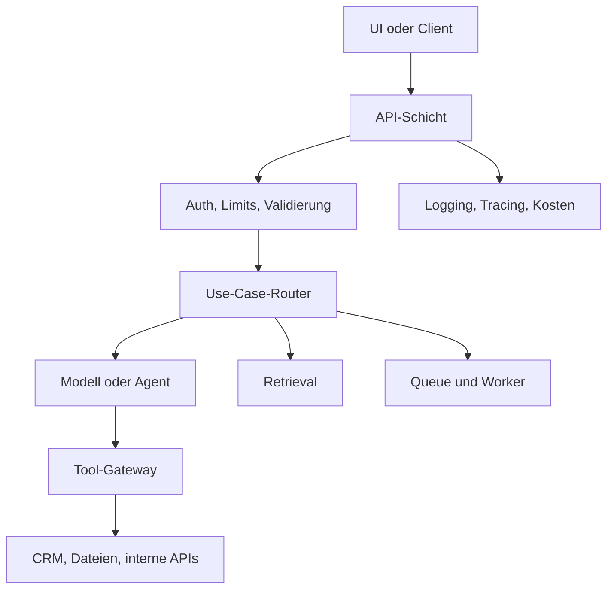

# Middleware & Integrationsschicht
{: .no_toc }

> **Wo GenAI-Anwendungen kontrollierbar werden**

---

# Inhaltsverzeichnis
{: .no_toc .text-delta }

1. TOC
{:toc}

---

## Warum Middleware nötig wird

Ein Notebook ruft ein Modell direkt auf. Eine produktionsnahe Anwendung muss dagegen Anfragen prüfen, Nutzer identifizieren, Kosten begrenzen, Tools absichern, Fehler behandeln und Ergebnisse protokollieren. Diese Aufgaben gehören nicht in den Prompt und selten direkt in die Benutzeroberfläche. Sie brauchen eine Schicht, die zwischen UI, Modell, Datenquellen und externen Systemen vermittelt.

Middleware ist in diesem Sinn keine einzelne Bibliothek. Gemeint ist die Integrationsschicht, die technische und organisatorische Regeln durchsetzt, bevor ein Modell oder ein Tool tatsächlich genutzt wird. Ohne diese Schicht entstehen viele Probleme erst im Betrieb: doppelte Tool-Aufrufe, unklare Fehler, fehlende Logs, unkontrollierte Kosten oder API-Schlüssel in Frontend-Code.

Typischer Fehler: Middleware wird mit "noch einem Framework" verwechselt. In vielen Kursprojekten reicht eine kleine FastAPI-Schicht mit klaren Endpunkten, zentralem Logging und wenigen Guardrails. Komplexere Gateways werden erst relevant, wenn mehrere Clients, mehrere Modelle oder riskante Tools beteiligt sind.

---

## Abgrenzung zu Agent-Middleware

LangChain und ähnliche Frameworks verwenden den Begriff Middleware für Hooks innerhalb eines Agentenlaufs. Dort geht es zum Beispiel um Human-in-the-Loop, Kontextzusammenfassung, PII-Erkennung oder Retry-Logik. Diese Middleware sitzt im Agenten selbst.

Die Integrationsschicht sitzt eine Ebene darüber. Sie entscheidet, wer überhaupt eine Anfrage stellen darf, welche Limits gelten, welche Provider genutzt werden, wie Fehler zurückgegeben werden und welche Tool-Aufrufe freigegeben werden müssen. Beide Ebenen können zusammenarbeiten, aber sie lösen unterschiedliche Probleme.

| Ebene | Aufgabe | Beispiel |
|---|---|---|
| Agent-Middleware | Verhalten innerhalb eines Agentenlaufs beeinflussen | Tool vor Ausführung bestätigen, Kontext zusammenfassen |
| API-Middleware | Anfrage und Antwort kontrollieren | Authentifizierung, Rate Limit, Logging, Fehlerformat |
| Tool-Gateway | Zugriff auf externe Aktionen begrenzen | CRM lesen, Bestellung ändern, E-Mail senden |
| Betriebs-Middleware | Betrieb stabilisieren | Queue, Retry, Timeout, Monitoring |

In der Praxis relevant, wenn mehrere Oberflächen dieselbe GenAI-Funktion nutzen. Ein Chat-Frontend, ein Admin-Tool und ein Batch-Job sollten nicht jeweils eigene Modell- und Tool-Logik enthalten. Sie sprechen besser eine gemeinsame Integrationsschicht an.

---

## Typische Aufgaben

Eine sinnvolle Middleware-Schicht bündelt Aufgaben, die sonst verstreut im Code landen würden. Dazu gehören Eingabevalidierung, Authentifizierung, Rollen und Berechtigungen, Provider-Auswahl, Prompt- und Tool-Versionierung, Kostenlimits, strukturierte Fehler, Tracing und zentrale Audit-Logs.

Nicht jede Anwendung braucht alle diese Funktionen. Entscheidend ist, wo Schaden entstehen kann. Ein interner Textgenerator braucht meist weniger Kontrolle als ein Agent, der Tickets schließt, Zahlungen auslöst oder Daten in einem CRM verändert.

| Aufgabe | Zweck | Erste Umsetzung |
|---|---|---|
| Authentifizierung | Anfrage einer Person oder einem Dienst zuordnen | Session, API-Key oder Plattform-Identity prüfen |
| Rate Limits | Kosten und Missbrauch begrenzen | Limits pro Nutzer, Projekt oder Endpunkt |
| Provider-Abstraktion | Modellwechsel ermöglichen | zentrale Modellkonfiguration statt Provider-Code im UI |
| Tool-Gateway | externe Aktionen kontrollieren | erlaubte Tools, Schemaprüfung, Freigaben |
| Logging & Tracing | Fehler reproduzierbar machen | Request-ID, Trace-ID, Kosten, Latenz speichern |
| Queue & Worker | lange Aufgaben auslagern | Dokumentindexierung, Batch-Evaluation, Report-Erstellung |

> [!WARNING] Grenze 
> Middleware ersetzt keine fachliche Sicherheitsentscheidung. Wenn ein Tool Geld ausgeben, Daten löschen oder externe Nachrichten versenden kann, braucht es zusätzlich klare Berechtigungen, Freigaben und Tests.

---

## Architektur einer schlanken Integrationsschicht

Eine robuste Startarchitektur trennt vier Verantwortlichkeiten. Die Benutzeroberfläche sendet Anfragen an eine API. Die API validiert und entscheidet, welcher Dienst zuständig ist. Die GenAI-Logik ruft Modelle, Retrieval oder Agenten auf. Externe Tools werden über eine eigene Zugriffsschicht angebunden.

Diese Struktur hält die Oberfläche dünn. Das Frontend kennt keine Provider-Keys, keine internen Tool-URLs und keine Promptdetails. Gleichzeitig bleibt die Modelllogik testbar, weil sie nicht direkt an HTTP-Statuscodes, Cookies oder UI-Zustand gekoppelt ist.

Ein häufiges Gegenbeispiel ist ein Streamlit- oder Gradio-Prototyp, der Modellaufruf, Prompt, Retrieval und Dateizugriff in einer Datei mischt. Für eine Demo ist das akzeptabel. Für Betrieb wird diese Kopplung teuer, weil jede neue Oberfläche dieselben Risiken erneut einbaut.

---

## Wann Middleware zu viel ist

Middleware wird schnell zur Ausrede für unnötige Architektur. Ein einzelnes Kursbeispiel mit stateless Prompt und manueller Ausführung braucht kein Gateway, keine Queue und keine Policy Engine. Dort genügt sauberer Anwendungscode mit `.env`, Fehlerbehandlung und wenigen Tests.

Die Schicht lohnt sich, sobald eine dieser Bedingungen erfüllt ist: mehrere Clients greifen auf dieselbe GenAI-Funktion zu, Tools verändern externe Systeme, Kosten müssen begrenzt werden, Anfragen laufen länger als ein HTTP-Request, oder ein Providerwechsel soll ohne UI-Änderung möglich bleiben.

Faustregel: Middleware wird eingeführt, wenn eine Verantwortung mindestens zweimal auftaucht oder wenn ein Fehler mehr als eine Demo beschädigt.

---

## Entscheidungsfragen

Vor dem Aufbau einer Integrationsschicht helfen wenige technische Fragen. Sie verhindern, dass ein einfacher Modellaufruf zu früh als Plattform gebaut wird.

| Frage | Konsequenz |
|---|---|
| Greifen mehrere Oberflächen auf dieselbe Logik zu? | API-Schicht zentralisieren |
| Werden externe Systeme verändert? | Tool-Gateway und Freigaben einplanen |
| Können Läufe länger als wenige Sekunden dauern? | Queue oder Worker prüfen |
| Muss der Provider wechselbar bleiben? | Modellzugriff kapseln |
| Müssen Kosten pro Nutzer sichtbar sein? | Request- und Trace-IDs durchziehen |
| Enthält die Anfrage sensible Daten? | PII-Prüfung, Logging-Regeln und Löschkonzept klären |

Diese Fragen sind wichtiger als die Toolauswahl. FastAPI, Cloud Run, Azure Container Apps, LangServe, MCP-Gateways oder eigene Worker können alle passen. Falsch wird die Architektur, wenn unklar bleibt, welche Verantwortung die Schicht trägt.

---

## Abgrenzung zu verwandten Dokumenten

| Dokument | Frage |
|---|---|
| [Vom Modell zur Anwendung](./vom-modell-zum-produkt.html) | Wie werden Modell, Tools, RAG und Orchestrierung zu einer Anwendung verbunden? |
| [Minimum Viable GenAI Stack](./minimum-viable-genai-stack.html) | Welche Schichten braucht eine produktive GenAI-Anwendung insgesamt? |
| [Vom Notebook zum Produkt](./vom-notebook-zum-produkt.html) | Wie wird aus Notebook-Code ein deploybarer API- oder Worker-Service? |
| [Tool Use & Function Calling](../08-agenten/tool-use-function-calling.html) | Wie werden Werkzeuge beschrieben, aufgerufen und begrenzt? |

---

**Version:** 1.0 
**Stand:** Mai 2026 
**Kurs:** Generative KI. Verstehen. Anwenden. Gestalten.
