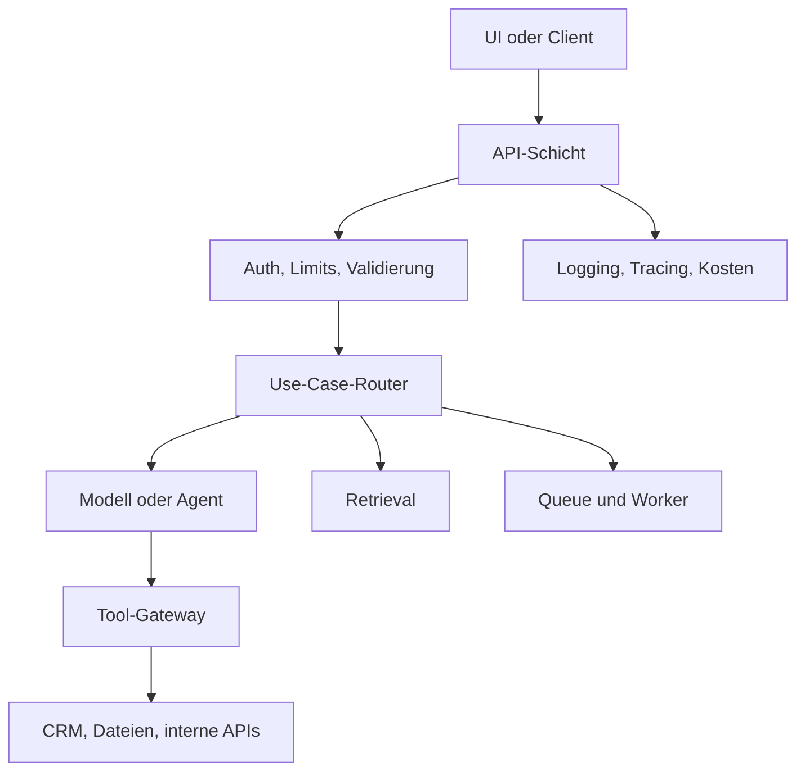

# Middleware & Integrationsschicht
{: .no_toc }

> **Wo GenAI-Anwendungen kontrollierbar werden**

---

# Inhaltsverzeichnis
{: .no_toc .text-delta }

1. TOC
{:toc}

---

## Warum Middleware nötig wird

Im Notebook wird ein Modell oft direkt aufgerufen. In der Produktion reicht das nicht: Anfragen müssen erst geprüft werden, Nutzer sollen klar zugeordnet werden, Kosten brauchen Grenzen, Tools müssen abgesichert sein, Fehler müssen verständlich zurückkommen und Ergebnisse sollen sauber protokolliert werden. All diese Aufgaben gehören nicht in den Prompt und selten direkt in die Benutzeroberfläche. Dafür braucht es eine Schicht, die zwischen UI, Modell, Datenquellen und externen Systemen vermittelt.

Middleware ist hier keine einzelne Bibliothek. Gemeint ist die Integrationsschicht, die technische und organisatorische Regeln durchsetzt, bevor ein Modell oder ein Tool überhaupt genutzt wird. Ohne diese Schicht tauchen die meisten Probleme erst im Betrieb auf: doppelte Tool-Aufrufe, schwer nachzuvollziehende Fehler, fehlende Logs, unkontrollierte Kosten oder ein API-Schlüssel, der unbemerkt in Frontend-Code landet.

Ein typischer Denkfehler: Middleware wird mit „noch einem Framework“ gleichgesetzt. In vielen Kursprojekten reicht eine kleine FastAPI-Schicht mit klaren Endpunkten, zentralem Logging und ein paar einfachen Guardrails. Später wird es relevant, wenn mehrere Clients, mehrere Modelle oder besonders riskante Tools im Spiel sind.

---

## Abgrenzung zu Agent-Middleware

LangChain und ähnliche Frameworks verwenden den Begriff Middleware oft für Hooks innerhalb eines Agentenlaufs. Dann geht es zum Beispiel um Human-in-the-Loop, Kontextzusammenfassung, PII-Erkennung oder Retry-Logik. Diese Middleware sitzt direkt im Agenten.

Die Integrationsschicht liegt eine Ebene darüber. Sie entscheidet: Wer darf überhaupt eine Anfrage stellen? Welche Limits gelten? Welche Provider werden genutzt? Wie werden Fehler zurückgegeben? Welche Tool-Aufrufe müssen freigegeben werden? Beide Ebenen können zusammenarbeiten, lösen aber unterschiedliche Probleme.

| Ebene | Aufgabe | Beispiel |
|---|---|---|
| Agent-Middleware | Verhalten innerhalb eines Agentenlaufs beeinflussen | Tool vor Ausführung bestätigen, Kontext zusammenfassen |
| API-Middleware | Anfrage und Antwort kontrollieren | Authentifizierung, Rate Limit, Logging, Fehlerformat |
| Tool-Gateway | Zugriff auf externe Aktionen begrenzen | CRM lesen, Bestellung ändern, E-Mail senden |
| Betriebs-Middleware | Betrieb stabilisieren | Queue, Retry, Timeout, Monitoring |

In der Praxis wird das wichtig, wenn mehrere Oberflächen dieselbe GenAI-Funktion verwenden. Ein Chat-Frontend, ein Admin-Tool und ein Batch-Job sollten nicht jeweils ihre eigene Modell- und Tool-Logik mitbringen. Besser ist es, wenn sie sich eine gemeinsame Integrationsschicht teilen.

---

## Typische Aufgaben

Eine sinnvolle Middleware-Schicht bündelt Aufgaben, die sonst überall im Code auftauchen würden. Dazu zählen Eingabevalidierung, Authentifizierung, Rollen und Berechtigungen, Provider-Auswahl, Prompt- und Tool-Versionierung, Kostenlimits, einheitliche Fehler, Tracing und zentrale Audit-Logs.

Nicht jede Anwendung braucht alles davon. Entscheidend ist, wo tatsächlich Risiko entsteht. Ein interner Textgenerator braucht meist weniger Kontrolle als ein Agent, der Tickets schließt, Zahlungen auslöst oder Daten in einem CRM verändert.

| Aufgabe | Zweck | Erste Umsetzung |
|---|---|---|
| Authentifizierung | Anfrage einer Person oder einem Dienst zuordnen | Session, API-Key oder Plattform-Identity prüfen |
| Rate Limits | Kosten und Missbrauch begrenzen | Limits pro Nutzer, Projekt oder Endpunkt |
| Provider-Abstraktion | Modellwechsel ermöglichen | zentrale Modellkonfiguration statt Provider-Code im UI |
| Tool-Gateway | externe Aktionen kontrollieren | erlaubte Tools, Schemaprüfung, Freigaben |
| Logging & Tracing | Fehler reproduzierbar machen | Request-ID, Trace-ID, Kosten, Latenz speichern |
| Queue & Worker | lange Aufgaben auslagern | Dokumentindexierung, Batch-Evaluation, Report-Erstellung |

> [!WARNING] Grenze 
> Middleware ersetzt keine fachliche Sicherheitsentscheidung. Wenn ein Tool Geld ausgeben, Daten löschen oder externe Nachrichten versenden kann, braucht es zusätzlich klare Berechtigungen, Freigaben und Tests.

---

## Architektur einer schlanken Integrationsschicht

Eine gute Startarchitektur trennt vier Verantwortlichkeiten klar voneinander. Die Benutzeroberfläche sendet Anfragen an eine API. Die API validiert die Anfrage und entscheidet, welcher Dienst zuständig ist. Die GenAI-Logik ruft Modelle, Retrieval oder Agenten auf. Externe Tools werden über eine eigene Zugriffsschicht angebunden.

Mit dieser Aufteilung bleibt die Oberfläche schlank. Das Frontend braucht keine Provider-Keys, keine internen Tool-URLs und keine Promptdetails. Gleichzeitig bleibt die Modelllogik gut testbar, weil sie nicht direkt an HTTP-Statuscodes, Cookies oder UI-Zustand gekoppelt ist.

Ein typisches Gegenbeispiel sind Prototypen wie ein Streamlit- oder Gradio-Projekt: Dort werden Modellaufruf, Prompt, Retrieval und Dateizugriff oft in einer Datei vermischt. Für eine Demo ist das in Ordnung. Für den Betrieb wird diese Kopplung schnell teuer, weil jede neue Oberfläche dieselben Risiken erneut einführt.

---

## Wann Middleware zu viel ist

Middleware wird schnell zur Ausrede für mehr Architektur als nötig. Ein einzelnes Kursbeispiel mit stateless Prompt und manueller Ausführung braucht kein Gateway, keine Queue und keine Policy Engine. Dann genügt sauberer Anwendungscode mit `.env`, ordentlicher Fehlerbehandlung und ein paar passenden Tests.

Die Schicht lohnt sich vor allem dann, wenn eine dieser Bedingungen zutrifft: Es gibt mehrere Clients, die dieselbe GenAI-Funktion nutzen. Tools verändern externe Systeme. Kosten müssen begrenzt werden. Laufzeiten dauern länger als ein einzelner HTTP-Request. Oder ein Providerwechsel soll ohne Änderungen an der UI funktionieren.

Faustregel: Middleware kommt dann dazu, wenn eine Verantwortung mindestens zweimal auftaucht oder wenn ein Fehler mehr als nur eine Demo beschädigt.

---

## Entscheidungsfragen

Bevor du eine Integrationsschicht baust, helfen ein paar kurze technische Fragen. Sie verhindern, dass aus einem einfachen Modellaufruf zu früh eine „Plattform“ wird.

| Frage | Konsequenz |
|---|---|
| Greifen mehrere Oberflächen auf dieselbe Logik zu? | API-Schicht zentralisieren |
| Werden externe Systeme verändert? | Tool-Gateway und Freigaben einplanen |
| Können Läufe länger als wenige Sekunden dauern? | Queue oder Worker prüfen |
| Muss der Provider wechselbar bleiben? | Modellzugriff kapseln |
| Müssen Kosten pro Nutzer sichtbar sein? | Request- und Trace-IDs durchziehen |
| Enthält die Anfrage sensible Daten? | PII-Prüfung, Logging-Regeln und Löschkonzept klären |

Diese Fragen sind oft wichtiger als die Toolauswahl. Architektur wird falsch, wenn nicht klar ist, welche Verantwortung die Schicht konkret übernehmen soll.

---

## Abgrenzung zu verwandten Dokumenten

| Dokument | Frage |
|---|---|
| [Vom Modell zur Anwendung](./vom-modell-zum-produkt.html) | Wie werden Modell, Tools, RAG und Orchestrierung zu einer Anwendung verbunden? |
| [Minimum Viable GenAI Stack](./minimum-viable-genai-stack.html) | Welche Schichten braucht eine produktive GenAI-Anwendung insgesamt? |
| [Vom Notebook zum Produkt](./vom-notebook-zum-produkt.html) | Wie wird aus Notebook-Code ein deploybarer API- oder Worker-Service? |
| [Tool Use & Function Calling](../08-agenten/tool-use-function-calling.html) | Wie werden Werkzeuge beschrieben, aufgerufen und begrenzt? |

---

**Version:** 1.0 
**Stand:** Mai 2026 
**Kurs:** Generative KI. Verstehen. Anwenden. Gestalten.