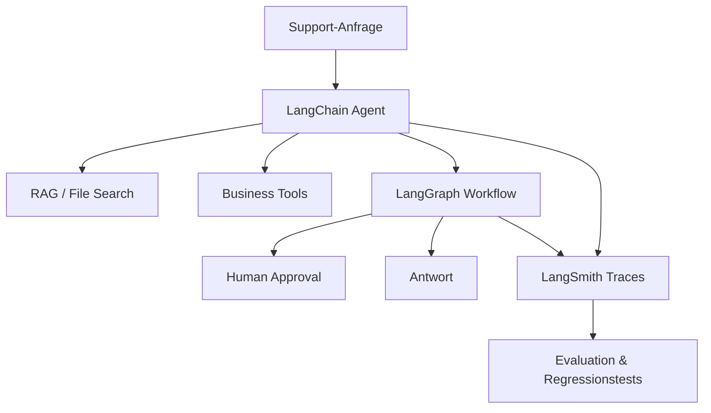

---
layout: default
title: Vom Modell zur Anwendung
parent: Deployment
nav_order: 2
description: Das LangChain-Ökosystem verstehen und nutzen
has_toc: true
---

# Vom Modell zur Anwendung
{: .no_toc }

> **Wie aus einem Sprachmodell ein steuerbares System wird**

---

# Inhaltsverzeichnis
{: .no_toc .text-delta }

1. TOC
{:toc}

---

## Das Problem

Ein großes Sprachmodell ist noch keine Anwendung. Es kann Texte erzeugen, aber es kennt keine internen Daten, führt keine Geschäftsprozesse aus, speichert keinen belastbaren Zustand und erklärt im Fehlerfall nicht automatisch, warum eine Antwort entstanden ist. Genau an dieser Grenze beginnt Architekturarbeit.

Für einen Prototyp reicht oft ein einzelner Modellaufruf. Für ein Produkt müssen zusätzliche Fragen beantwortet werden: Woher kommt der Kontext? Welche Tools darf das System verwenden? Wie wird ein Lauf reproduzierbar? Wer sieht Traces, Kosten und Fehler? Und wie wird verhindert, dass ein Agent denselben API-Aufruf nach einem Neustart noch einmal ausführt?

> [!NOTE] Merksatz<br>
> Ein Modell liefert Sprachfähigkeit. Eine Anwendung braucht Kontext, Werkzeuge, Zustandsverwaltung, Beobachtbarkeit und klare Betriebsgrenzen.

---

## Das LangChain-Ökosystem

Das LangChain-Ökosystem ist heute weniger als Sammlung loser Chain-Bausteine zu verstehen, sondern als gestufter Werkzeugkasten für agentische Anwendungen. **LangChain** stellt die höhere Abstraktion für Modelle, Tools und Agenten bereit. **LangGraph** übernimmt die Orchestrierung von zustandsbehafteten, langlebigen und unterbrechbaren Workflows. **LangSmith** macht Läufe sichtbar, bewertbar und vergleichbar.

Diese Trennung ist wichtig. LangChain hilft beim schnellen Aufbau eines Agenten. LangGraph wird relevant, wenn ein Prozess über mehrere Schritte stabil, wiederaufnehmbar oder mit menschlichen Freigaben laufen muss. LangSmith gehört spätestens dann dazu, wenn Fehler nicht mehr nur lokal im Notebook betrachtet werden, sondern systematisch aus Traces, Datasets und Evaluationen gelernt werden soll.

| Ebene | Aufgabe | Typischer Einsatz |
|---|---|---|
| LangChain | Modelle, Tools und Agenten verbinden | Tool-Agent, RAG-Antwort, strukturierte Ausgabe |
| LangGraph | Abläufe, Zustand und Unterbrechungen steuern | Multi-Step-Workflow, Human-in-the-Loop, langlebiger Agent |
| LangSmith | Tracing, Evaluation und Debugging bereitstellen | Fehleranalyse, Kostenbeobachtung, Regressionstests |

LangChain beschreibt diese Rollen inzwischen selbst ähnlich: LangChain ist das Agent-Framework, LangGraph die Orchestrierungsruntime und LangSmith die Plattform für Tracing, Evaluation, Prompts und Deployment-nahe Workflows.

---

## LangChain

LangChain v1 fokussiert sich stärker auf Agenten als ältere Kursmaterialien, die vor allem Chains und LCEL in den Mittelpunkt gestellt haben. `create_agent` ist der aktuelle Standardweg, um einen Agenten mit Modell, Tools und Systemanweisung zu bauen. Im Hintergrund nutzt LangChain LangGraph, sodass auch einfache Agenten bereits auf einer graphbasierten Laufzeitstruktur aufsetzen.

Der Nutzen liegt nicht darin, dass LangChain jedes Detail versteckt. Der Nutzen liegt in einer einheitlichen Schnittstelle für Modelle und Tools. Ein Agent kann mit OpenAI beginnen und später andere unterstützte Provider nutzen, ohne dass jede Tool-Definition neu entworfen werden muss. Gleichzeitig bleiben Tool-Schemas, strukturierte Ausgaben und Middleware explizit genug, um produktive Grenzen zu setzen.

```python
from langchain.agents import create_agent
from langchain_core.tools import tool


@tool
def lookup_order(order_id: str) -> str:
    """Ruft den Status einer Bestellung ab."""
    return f"Bestellung {order_id}: versendet"


agent = create_agent(
    model="openai:gpt-5.4-mini",
    tools=[lookup_order],
    system_prompt=(
        "Du bist ein Support-Agent. Nutze Tools nur, wenn konkrete "
        "Bestellinformationen benötigt werden."
    ),
)

result = agent.invoke(
    {
        "messages": [
            {
                "role": "user",
                "content": "Wie ist der Status von Bestellung A-1024?",
            }
        ]
    }
)

print(result["messages"][-1].content)
```

> [!WARNING] Typischer Fehler<br>
> LangChain ersetzt keine Architekturentscheidung. Ein Agent, der jedes Tool jederzeit aufrufen darf, ist schnell gebaut, aber schwer zu testen. Produktive Agenten brauchen enge Tool-Berechtigungen, klare Systemanweisungen und überprüfbare Rückgabeformate.

---

## LangGraph

LangGraph wird eingesetzt, wenn ein Agent nicht nur antworten, sondern einen Prozess zuverlässig durchlaufen soll. Die Kernbegriffe sind Zustand, Knoten, Kanten und Persistenz. Ein Graph speichert, welcher Schritt bereits erledigt wurde, welche Daten vorliegen und an welcher Stelle ein Lauf fortgesetzt werden kann.

Aktuelle LangGraph-Dokumentation betont vor allem **durable execution**, **persistence**, **streaming** und **human-in-the-loop**. Diese Begriffe sind für Deployment wichtiger als die reine Visualisierung eines Graphen. Ein Workflow, der nach einem Timeout wieder an der richtigen Stelle weiterläuft, ist für den Betrieb wertvoller als ein nur hübsch gezeichneter Ablauf.

```python
from typing import Literal, TypedDict

from langgraph.graph import END, START, StateGraph


class SupportState(TypedDict):
    ticket: str
    category: str
    answer: str


def classify(state: SupportState) -> dict:
    if "rechnung" in state["ticket"].lower():
        return {"category": "billing"}
    return {"category": "support"}


def route(state: SupportState) -> Literal["billing", "support"]:
    return state["category"]


def answer_billing(state: SupportState) -> dict:
    return {"answer": "Die Anfrage wird an das Abrechnungsteam weitergeleitet."}


def answer_support(state: SupportState) -> dict:
    return {"answer": "Die Anfrage wird im Support bearbeitet."}


builder = StateGraph(SupportState)
builder.add_node("classify", classify)
builder.add_node("billing", answer_billing)
builder.add_node("support", answer_support)

builder.add_edge(START, "classify")
builder.add_conditional_edges(
    "classify",
    route,
    {"billing": "billing", "support": "support"},
)
builder.add_edge("billing", END)
builder.add_edge("support", END)

graph = builder.compile()
result = graph.invoke({"ticket": "Frage zu meiner Rechnung", "category": "", "answer": ""})
print(result["answer"])
```

Für Human-in-the-Loop, Wiederaufnahme nach Unterbrechung und robuste Fehlerbehandlung wird der Graph mit Persistenz betrieben. In lokalen Beispielen kann ein In-Memory-Checkpointer reichen; im Produktivbetrieb braucht der Checkpointer einen dauerhaften Speicher und eine klare Thread-ID pro Lauf.

> [!NOTE] Grenze<br>
> LangGraph ist nicht nur „LangChain mit mehr Knoten“. Es ist die niedrigere Orchestrierungsebene. Wer lediglich ein Modell mit zwei Tools verbinden möchte, beginnt mit `create_agent`. Wer Zustände, Freigaben, Wiederaufnahme oder lange Laufzeiten kontrollieren muss, wechselt zu LangGraph.

---

## LangSmith

LangSmith beantwortet die Frage, was im System tatsächlich passiert ist. Ein Trace zeigt Modellaufrufe, Tool-Calls, Laufzeiten, Fehler und Kosten. Datasets und Evaluationsläufe machen sichtbar, ob eine Änderung an Prompt, Modell oder Retriever das System verbessert oder verschlechtert.

Das passiert nicht automatisch nur dadurch, dass LangChain oder LangGraph importiert werden. Tracing muss für die jeweilige Umgebung konfiguriert sein, typischerweise über LangSmith-Projekt, API-Key und Tracing-Flag. Erst dann werden Läufe im Projekt sichtbar.

```bash
export LANGSMITH_TRACING=true
export LANGSMITH_API_KEY="..."
export LANGSMITH_PROJECT="support-agent"
```

Im Kurskontext ist LangSmith besonders nützlich, wenn ein Notebook „funktioniert“, aber nicht klar ist, warum. Traces zeigen, ob der Retriever falsche Dokumente liefert, ob ein Tool zu oft aufgerufen wird oder ob ein Prompt bei bestimmten Testfällen systematisch ausweicht.

> [!WARNING] Typischer Fehler<br>
> Monitoring erst nach dem ersten Produktivproblem einzuschalten, kostet Kontext. Ohne Traces fehlen genau die Läufe, an denen sich Fehlerursachen und Regressionen erklären ließen.

---

## Zusammenspiel

Die Werkzeuge sind keine Konkurrenz zueinander. LangChain beschreibt, womit ein Agent arbeitet. LangGraph beschreibt, wie ein Ablauf kontrolliert wird. LangSmith beschreibt, was während der Ausführung passiert ist und ob die Qualität reicht.

| Situation | Passender Startpunkt |
|---|---|
| Ein Agent soll ein Modell und wenige Tools nutzen | LangChain `create_agent` |
| Ein Ablauf braucht Freigaben, Wiederaufnahme oder Zustand | LangGraph |
| Verhalten muss nachvollzogen und bewertet werden | LangSmith |
| Ein Team will einen komplexen Agenten mit Planung, Subagenten und Kontextmanagement | Deep Agents oder LangGraph-basierte Architektur |
| Ein Workflow soll ohne viel Code aus Templates entstehen | LangSmith Fleet oder andere Builder-Ansätze prüfen |

Die Entscheidung ist selten endgültig. Ein Projekt kann mit `create_agent` beginnen, bei wachsender Komplexität nach LangGraph migrieren und LangSmith durchgehend für Tracing und Evaluation nutzen.

---

## Beispielarchitektur

Ein Customer-Support-System beginnt meist mit einem einfachen Agenten. Sobald reale Tickets, interne Daten und Eskalationen hinzukommen, entsteht eine Architektur mit mehreren Schichten: Retrieval für Wissenszugriff, Tools für Geschäftsprozesse, Graphsteuerung für Routing und Freigaben sowie LangSmith für Tracing und Evaluation.



Diese Architektur ist nicht wegen der Anzahl der Bausteine produktionsreif. Sie wird produktionsnäher, weil jeder Baustein eine überprüfbare Aufgabe hat: Retrieval liefert Kontext, Tools verändern externe Systeme, LangGraph kontrolliert den Ablauf und LangSmith macht das Verhalten sichtbar.

---

## Alternativen

LangChain ist nicht immer die beste Wahl. LlamaIndex ist stark, wenn die Anwendung fast vollständig um Daten, Indizes und Retrieval kreist. Haystack passt gut zu Enterprise-Search-Szenarien. Semantic Kernel liegt nahe, wenn .NET und Azure den Stack bestimmen. CrewAI und AutoGen adressieren Multi-Agent-Muster mit anderen Abstraktionen.

Entscheidend ist nicht die Anzahl der Frameworks, sondern der dominante Engpass. Wenn Datenaufbereitung und Retrievalqualität das Problem sind, löst ein Agent-Framework wenig. Wenn Tool-Orchestrierung, Freigaben und lange Laufzeiten im Vordergrund stehen, reicht ein reines RAG-Framework nicht aus.

---

## Betriebsregeln

Produktive GenAI-Systeme entstehen nicht durch einen Wechsel vom Notebook in einen Webserver. Sie entstehen durch explizite Betriebsregeln. Dazu gehören feste Modellrollen, begrenzte Tool-Berechtigungen, Timeouts, Rate Limits, Fallbacks, strukturierte Fehler und ein Evaluationsset, das bei jeder relevanten Änderung erneut läuft.

Eine kurze Checkliste reicht als Startpunkt, ersetzt aber keine technische Umsetzung:

- Tool-Aufrufe sind begrenzt, geloggt und gegen Fehlbedienung geschützt.
- LangSmith-Tracing ist für relevante Umgebungen aktiviert.
- Evaluationsfälle decken typische und riskante Nutzerfragen ab.
- Zustandsbehaftete Workflows nutzen Persistenz statt impliziter Notebook-Variablen.
- Kosten, Latenz und Fehlerraten werden regelmäßig geprüft.
- Sicherheits- und Datenschutzgrenzen sind dokumentiert.

> [!TIP] Praktischer Einstieg<br>
> Zuerst wird ein kleiner Agent mit einem echten Tool gebaut. Danach wird entschieden, ob der Ablauf nur beobachtet werden muss oder ob LangGraph für Zustand, Freigaben und Wiederaufnahme notwendig wird.

---

## Fazit

Der Weg vom Modell zur Anwendung führt über Architektur. LangChain macht Agenten schnell baubar, LangGraph macht komplexe Abläufe kontrollierbar, LangSmith macht Verhalten beobachtbar und bewertbar. Ein produktives System braucht meist nicht alle Möglichkeiten dieser Werkzeuge, aber es braucht eine klare Entscheidung, welche Verantwortung auf welcher Ebene liegt.

---

## Weiterführende Ressourcen

### Offizielle Dokumentation

- [LangChain Overview](https://docs.langchain.com/oss/python/langchain/overview)
- [LangChain v1](https://docs.langchain.com/oss/python/releases/langchain-v1)
- [LangGraph Overview](https://docs.langchain.com/oss/python/langgraph/overview)
- [LangGraph Durable Execution](https://docs.langchain.com/oss/python/langgraph/durable-execution)
- [LangSmith Docs](https://docs.smith.langchain.com/)

---

## Abgrenzung zu verwandten Dokumenten

| Dokument | Frage |
|---|---|
| [Minimum Viable GenAI Stack](./minimum-viable-genai-stack.html) | Welche Schichten braucht eine produktive GenAI-Anwendung mindestens? |
| [Vom Notebook zum Produkt](./vom-notebook-zum-produkt.html) | Welche Schritte führen von Notebook-Code zu einer deploybaren Anwendung? |
| [Migration OpenAI → Mistral](./migration-openai-mistral.html) | Wie wirkt sich ein Providerwechsel auf Architektur und Modellzugriff aus? |

---

**Version:** 1.1<br>
**Stand:** Mai 2026<br>
**Kurs:** Generative KI. Verstehen. Anwenden. Gestalten.
