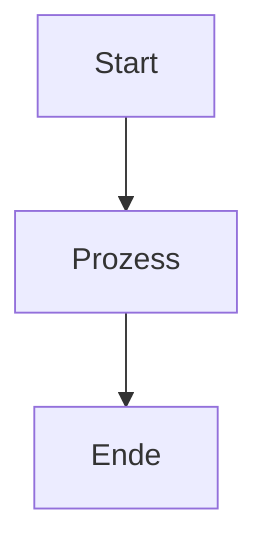

# Markdown Template Guide
{: .no_toc }

> **Anleitung zur Erstellung von Markdown-Dateien für GitHub Pages mit just-the-docs Theme**

---

# Inhaltsverzeichnis
{: .no_toc .text-delta }

1. TOC
{:toc}

---

## 1 Standard-Template für neue Dokumentations-Seiten

Verwende diese Struktur für **alle** neuen Markdown-Dateien im `/docs` Verzeichnis:

```markdown
---
layout: default
title: [Seitentitel]
parent: [Übergeordnete Kategorie]
nav_order: [Nummer für Sortierung]
description: "[Kurzbeschreibung der Seite]"
has_toc: true
---

# [Seitentitel]
{: .no_toc }

> **[Kurzbeschreibung - identisch mit description]**

---

# Inhaltsverzeichnis
{: .no_toc .text-delta }

1. TOC
{:toc}

---

## [Erstes Kapitel]

[Inhalt...]

---

## [Zweites Kapitel]

[Inhalt...]

---
```

---

## 2 Wichtige Regeln

### 2.1 Front Matter (YAML Header)

- **Immer** am Anfang der Datei
- **Pflichtfelder:**
  - `layout: default` - Standardlayout verwenden
  - `title:` - Seitentitel (erscheint in Navigation)
  - `parent:` - Übergeordnete Kategorie (z.B. "Frameworks", "Concepts", "Guides")
  - `nav_order:` - Sortierreihenfolge in Navigation (1, 2, 3, ...)
  - `description:` - Kurzbeschreibung für SEO und Übersicht
  - `has_toc: true` - Aktiviert Inhaltsverzeichnis

### 2.2 Hauptüberschrift (H1)

```markdown
# [Seitentitel]
{: .no_toc }
```

- **Wichtig:** `{: .no_toc }` verhindert, dass die Hauptüberschrift im TOC erscheint
- Direkt danach: Blockquote mit Beschreibung

### 2.3 Inhaltsverzeichnis

```markdown
# Inhaltsverzeichnis
{: .no_toc .text-delta }

1. TOC
{:toc}
```

- **Immer** nach der Hauptüberschrift einfügen
- `{: .no_toc .text-delta }` - Überschrift selbst nicht im TOC, kleinere Schrift
- `{:toc}` - Kramdown-Syntax für automatisches TOC

### 2.4 Überschriften-Hierarchie

- **KEINE manuellen Nummern** in Überschriften verwenden
- Obsidian's automatische Nummerierung ist deaktiviert
- Just-the-docs generiert automatisch Nummern

**❌ Falsch:**

```markdown
## 1 Kurzüberblick
## 2 Setup
### 2.1 Installation
```

**✅ Richtig:**

```markdown
## Kurzüberblick
## Setup
### Installation
```

### 2.5 Überschriften-Ebenen

- `#` (H1) - Nur für Haupttitel (mit `{: .no_toc }`)
- `##` (H2) - Hauptkapitel
- `###` (H3) - Unterkapitel
- `####` (H4) - Weitere Untergliederung

### 2.6 Trennlinien

- Verwende `---` zwischen Hauptkapiteln für visuelle Trennung
- Nicht in Unterkapiteln verwenden

---

## 3 Beispiele für verschiedene Seitentypen

### 3.1 Framework-Dokumentation

```markdown
---
layout: default
title: LangChain Einsteiger
parent: Frameworks
nav_order: 1
description: "Grundlagen und Best Practices für LangChain 1.0+"
has_toc: true
---

# LangChain Einsteiger
{: .no_toc }

> **Grundlagen und Best Practices für LangChain 1.0+**

---

# Inhaltsverzeichnis
{: .no_toc .text-delta }

1. TOC
{:toc}

---

## Kurzüberblick: Warum LangChain?

Große Sprachmodelle (LLMs) wie GPT-4 sind beeindruckend...

---

## Prompts mit `ChatPromptTemplate`

Für wiederverwendbare Prompts...

### Beispiel: Einfacher Prompt

```python
from langchain_core.prompts import ChatPromptTemplate
```

---
```

### Konzept-Dokumentation

```markdown
---
layout: default
title: Agent-Architekturen
parent: Concepts
nav_order: 1
description: "Verschiedene Architekturmuster und Design-Prinzipien für KI-Agenten"
has_toc: true
---

# Agent-Architekturen
{: .no_toc }

> **Verschiedene Architekturmuster und Design-Prinzipien für KI-Agenten**

---

# Inhaltsverzeichnis
{: .no_toc .text-delta }

1. TOC
{:toc}

---

## Überblick

Ein KI-Agent ist mehr als ein einfacher Chatbot...

---

## ReAct-Architektur

ReAct beschreibt einen iterativen Zyklus...

### Charakteristik

- Transparenter Denkprozess
- Gut geeignet für explorative Aufgaben

---
```

### 3.2 Übergeordnete Kategorie-Seite

```markdown
---
layout: default
title: Frameworks
nav_order: 3
has_children: true
description: "Einsteiger-Guides für LangChain, LangGraph und LangSmith"
permalink: /frameworks/
---

# Frameworks

Willkommen zu den Framework-Guides!

Dieser Bereich enthält Einsteiger-Anleitungen für:

- **LangChain** - Grundlagen und Best Practices
- **LangGraph** - Multi-Agent-Systeme und Workflows
- **LangSmith** - Monitoring & Debugging
- **ChromaDB** - Vektordatenbanken für RAG-Systeme

Wählen Sie ein Framework aus der Navigation links aus.
```

---

## 4 Spezielle Kramdown-Syntax

### 4.1 Klassen für Überschriften

```markdown
## Überschrift
{: .no_toc }           # Nicht im TOC anzeigen
{: .text-delta }       # Kleinere Schrift
{: .no_toc .text-delta } # Kombination
```

### 4.2 Code-Blöcke

````markdown
```python
from langchain import ChatOpenAI
```
````

### 4.3 Tabellen

```markdown
| Spalte 1 | Spalte 2 | Spalte 3 |
|----------|----------|----------|
| Wert 1   | Wert 2   | Wert 3   |
```

### 4.4 Mermaid-Diagramme

````markdown

````

---

## 5 Häufige Fehler vermeiden

### 5.1 Fehler 1: Manuelle Nummerierung

**❌ Falsch:**

```markdown
## 1 Kurzüberblick
## 2 Setup
```

**✅ Richtig:**

```markdown
## Kurzüberblick
## Setup
```

### 5.2 Fehler 2: Hauptüberschrift im TOC

**❌ Falsch:**

```markdown
# Mein Dokument

> **Beschreibung**
```

**✅ Richtig:**

```markdown
# Mein Dokument
{: .no_toc }

> **Beschreibung**
```

### 5.3 Fehler 3: Fehlendes Front Matter

**❌ Falsch:**

```markdown
# Mein Dokument

Inhalt...
```

**✅ Richtig:**

```markdown
---
layout: default
title: Mein Dokument
parent: Kategorie
nav_order: 1
description: "Beschreibung"
has_toc: true
---

# Mein Dokument
{: .no_toc }
```

### 5.4 Fehler 4: Inkonsistente Struktur

**❌ Falsch:**

```markdown
# Titel

## Kapitel 1
Text...
## Kapitel 2
```

**✅ Richtig:**

```markdown
# Titel
{: .no_toc }

> **Beschreibung**

---

# Inhaltsverzeichnis
{: .no_toc .text-delta }

1. TOC
{:toc}

---

## Kapitel 1

Text...

---

## Kapitel 2
```

---

## 6 Checkliste für neue Dateien

- [ ] Front Matter vollständig (layout, title, parent, nav_order, description, has_toc)
- [ ] Hauptüberschrift mit `{: .no_toc }`
- [ ] Blockquote mit Beschreibung
- [ ] Trennlinie (`---`)
- [ ] Inhaltsverzeichnis-Sektion mit korrekten Klassen
- [ ] Trennlinie vor erstem Kapitel
- [ ] KEINE manuellen Nummern in Überschriften
- [ ] Trennlinien zwischen Hauptkapiteln (##)
- [ ] Konsistente Überschriften-Hierarchie (H2 → H3 → H4)

---

## 7 Zusammenfassung

Diese Anleitung stellt sicher, dass alle Markdown-Dateien im GitHub Pages Projekt eine konsistente Struktur haben und korrekt mit dem just-the-docs Theme funktionieren. Besonders wichtig sind:

1. **Korrektes Front Matter** - Alle Metadaten vollständig
2. **Hauptüberschrift mit `{: .no_toc }`** - Verhindert Duplikate im TOC
3. **Keine manuellen Nummern** - Just-the-docs nummeriert automatisch
4. **Konsistente Struktur** - Template für alle Seiten verwenden
