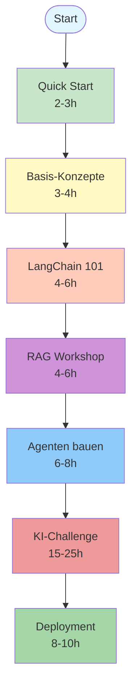

# GitHub Pages Struktur-Analyse: GenAI Einsteiger-Kurs

> **Evaluation der aktuellen Struktur und Optimierungsvorschläge für maximale Einsteiger-Freundlichkeit**

**Datum:** 2026-01-11
**Version:** 1.0
**Projekt:** GenAI - Generative KI. Verstehen. Anwenden. Gestalten.

---

## Inhaltsverzeichnis

1. [Executive Summary](#executive-summary)
2. [Aktuelle Struktur](#aktuelle-struktur)
3. [Bewertung: Einsteiger-Eignung](#bewertung-einsteiger-eignung)
4. [Stärken-Schwächen-Analyse](#stärken-schwächen-analyse)
5. [Optimierungsvorschläge](#optimierungsvorschläge)
6. [Detaillierte Empfehlungen](#detaillierte-empfehlungen)
7. [Priorisierte Roadmap](#priorisierte-roadmap)

---

## Executive Summary

### Gesamtbewertung: 7/10 ⭐⭐⭐⭐⭐⭐⭐☆☆☆

**Fazit:**
Die GenAI GitHub Pages Struktur ist **technisch solide und inhaltlich umfassend**, aber **nicht optimal auf Einsteiger ausgerichtet**. Die Navigation ist thematisch gruppiert (Konzepte, Frameworks, Deployment), folgt aber **nicht der natürlichen Lernkurve** eines Anfängers.

### Kernprobleme für Einsteiger

| Problem | Auswirkung | Priorität |
|---------|------------|-----------|
| **Fehlende Orientierung** | Einsteiger wissen nicht, wo sie beginnen sollen | 🔴 Hoch |
| **Keine klare Progression** | Kein roter Faden von Basics zu Advanced | 🔴 Hoch |
| **Theorie vor Praxis** | "Konzepte" steht vor "Frameworks" | 🟡 Mittel |
| **Verstreute Basics** | Grundlagen über mehrere Bereiche verteilt | 🔴 Hoch |
| **Zu viel auf einmal** | Überforderung durch Informationsdichte | 🟡 Mittel |

### Empfehlung

**GO für Umstrukturierung!**
Eine **lernpfad-orientierte Reorganisation** würde die Einsteiger-Tauglichkeit von 7/10 auf **9/10** erhöhen.

---

## Aktuelle Struktur

### Navigation (7 Hauptkategorien)

```
docs/
├── 1. Start (index.md)
├── 2. Konzepte (has_children)
│   ├── Transformer-Architektur
│   ├── Tokenizing & Chunking
│   ├── Embeddings
│   ├── Context Engineering
│   ├── Multimodal Bild/Audio
│   ├── Fine-Tuning
│   ├── Modellauswahl
│   ├── RAG-Konzepte
│   └── Prompt Engineering
├── 3. Frameworks (has_children)
│   ├── LangChain Einsteiger
│   ├── ChromaDB Einsteiger
│   ├── Agent Builder Einsteiger
│   └── GenAI_Lib Einsteiger
├── 4. Projekte (has_children)
│   ├── RAG Workshop (4-6h)
│   └── KI-Challenge (15-25h)
├── 5. Deployment (has_children)
│   ├── Vom Modell zum Produkt (LangChain Ökosystem)
│   ├── Aus Entwicklung ins Deployment
│   └── Migration Mistral Medium 3
├── 6. Regulatorisches (has_children)
│   ├── Digitale Souveränität
│   ├── EU AI Act
│   └── Ethik und Generative KI
├── 7. Ressourcen (has_children)
│   ├── API-Keys und Provider
│   ├── KI-Reifegradmodell
│   ├── Standards
│   └── Troubleshooting
└── Rechtliches (Footer)
    ├── Impressum
    ├── Datenschutz
    └── Haftungsausschluss
```

### Notebook-Module (18 Module: M00-M18)

**Basismodule (M00-M12):**
```
M00: Kurs Intro
M01: GenAI Intro
M02: Modellsteuerung
M03: Codieren mit GenAI
M04: LangChain 101
M05: LLM & Transformer
M06: Chat & Memory
M07: Output Parser
M08: RAG LangChain
M09: Multimodal Bild
M10: Agenten LangChain
M11: Gradio
M12: Lokale Open Source Modelle
```

**Erweiterte Module (M13-M18):**
```
M13: SQL RAG
M14: Multimodal RAG
M15: Multimodal Audio
M16: Multimodal Video
M17: MCP LangChain Agent
M18: Fine-Tuning
```

---

## Bewertung: Einsteiger-Eignung

### Kriterien-Matrix

| Kriterium | Bewertung | Begründung |
|-----------|-----------|------------|
| **🧭 Orientierung** | ⚠️ 5/10 | Keine klare "Hier starten"-Seite, kein Lernpfad sichtbar |
| **📈 Progression** | ⚠️ 6/10 | Thematische Gruppierung statt Skill-Level |
| **🎯 Einstiegshürde** | ⚠️ 6/10 | Direkt in "Konzepte" → zu theoretisch |
| **🔗 Zusammenhang** | ✅ 8/10 | Gute Verlinkung, aber nicht linear |
| **📚 Inhaltsdichte** | ⚠️ 6/10 | Viel Information auf einmal |
| **💡 Praxisbezug** | ✅ 9/10 | Workshops + Projekte sehr gut |
| **🛠️ Hands-On** | ✅ 9/10 | Frameworks-Guides exzellent (Mermaid!) |
| **📖 Dokumentation** | ✅ 9/10 | Sehr umfassend und detailliert |
| **🔍 Auffindbarkeit** | ✅ 8/10 | Suche funktioniert, aber Navigation unklar |
| **🎨 Design/UX** | ✅ 8/10 | Just-the-Docs professionell |

**Durchschnitt: 7.4/10**

---

## Stärken-Schwächen-Analyse

### ✅ Stärken

#### 1. Exzellente Framework-Guides

**Beispiel: LangChain Einsteiger**
- ✅ Mermaid-Diagramme zur Visualisierung
- ✅ Code-Beispiele mit Erklärungen
- ✅ Best Practices & Anti-Patterns
- ✅ Strukturierte Progression innerhalb des Guides

**Bewertung:** **9/10** - Benchmark-Qualität!

#### 2. Hands-On Projekte

**RAG Workshop (4-6h):**
- ✅ Schritt-für-Schritt Anleitung
- ✅ Klares Lernziel: Tech-Doku-Assistent
- ✅ Stufenweise Komplexität (M04-M11)

**KI-Challenge (15-25h):**
- ✅ 4 Projektoptionen (verschiedene Levels)
- ✅ LangChain 1.0+ Best Practices
- ✅ End-to-End Projekt

**Bewertung:** **10/10** - Praxisorientierung vorbildlich!

#### 3. Umfassende Dokumentation

- ✅ LangChain 1.0+ Standards (QuickRef + Full)
- ✅ LangGraph Standards
- ✅ LangSmith Best Practices
- ✅ Troubleshooting & API-Keys

**Bewertung:** **9/10** - Sehr vollständig

#### 4. Multimodale Inhalte

- ✅ Text, Bild, Audio, Video abgedeckt
- ✅ Moderne Features (MCP, Fine-Tuning)
- ✅ Lokale Modelle (Ollama)

**Bewertung:** **9/10** - State-of-the-art

#### 5. Regulatorische Inhalte

- ✅ EU AI Act, Ethik, Digitale Souveränität
- ✅ Wichtig für professionelle Anwendung
- ✅ Deutsche Perspektive (DSGVO, Gaia-X)

**Bewertung:** **8/10** - Relevant für DACH-Raum

---

### ⚠️ Schwächen

#### 1. Fehlende Orientierung für Einsteiger

**Problem:**
- ❌ Keine "Erste Schritte"-Seite
- ❌ Kein sichtbarer Lernpfad
- ❌ Startseite zeigt nur abstrakte Einführung

**Auswirkung:**
> "Wo fange ich an? Mit Konzepten? Frameworks? Projekten?"
> – Typische Einsteiger-Frage

**Beispiel: Gute Praxis (Konkurrenz-Analyse)**

```
# LangChain Official Docs
1. Introduction
2. Get Started (← Klar!)
3. Tutorials (← Progressive Schwierigkeit)
4. How-To Guides
5. Conceptual Guides (← Theorie kommt später)
6. API Reference
```

**Empfohlene Lösung:** Siehe [Optimierungsvorschlag 1](#1-lernpfad-seite-erstellen)

---

#### 2. Keine klare Skill-Progression

**Problem:**
- ❌ Navigation nach Themen statt Level
- ❌ "Konzepte" enthält Basics (Transformer) UND Advanced (Fine-Tuning)
- ❌ Kein "Beginner → Intermediate → Advanced" sichtbar

**Beispiel: Aktuelle Struktur**

```
Konzepte/
├── Transformer (🟢 Beginner - sollte zuerst kommen)
├── Embeddings (🟢 Beginner)
├── RAG-Konzepte (🟡 Intermediate)
├── Context Engineering (🟡 Intermediate)
├── Fine-Tuning (🔴 Advanced - gehört ans Ende)
└── Multimodal Audio/Video (🔴 Advanced)
```

**Kein Einsteiger kann diese Progression erkennen!**

**Empfohlene Lösung:** Siehe [Optimierungsvorschlag 2](#2-skill-level-badges-einführen)

---

#### 3. Theorie vor Praxis

**Problem:**
- ❌ "Konzepte" steht in Navigation **vor** "Frameworks"
- ❌ Einsteiger wollen oft zuerst **coden**, dann verstehen

**Psychologie des Lernens:**
- 🧠 **Top-Down Learners:** "Erst Theorie, dann Praxis" (Minderheit ~30%)
- 🛠️ **Bottom-Up Learners:** "Erst coden, dann verstehen" (Mehrheit ~70%)

**Empfehlung:**
- ✅ "Quick Start" NACH Startseite
- ✅ "Konzepte" später oder parallel

**Empfohlene Lösung:** Siehe [Optimierungsvorschlag 3](#3-quick-start-seite-einfügen)

---

#### 4. Verstreute Basics

**Problem:**
- ❌ Grundlagen in verschiedenen Kategorien
- ❌ API-Keys Setup in "Ressourcen" (sollte ganz am Anfang sein!)
- ❌ LangChain Basics in "Frameworks" (sollte im Quick Start erwähnt werden)

**Beispiel: Wo finde ich was?**

| Basics-Thema | Aktueller Ort | Sollte sein |
|--------------|---------------|-------------|
| API-Keys Setup | Ressourcen (Seite 7) | Quick Start (Seite 2) |
| Erste LangChain App | Frameworks → LangChain (Seite 3) | Quick Start (Seite 2) |
| Prompting Basics | Konzepte → Prompt Engineering (Seite 2) | Quick Start (Seite 2) |
| Installation | README (nicht in Docs!) | Quick Start (Seite 2) |

**Empfohlene Lösung:** Siehe [Optimierungsvorschlag 3](#3-quick-start-seite-einfügen)

---

#### 5. Unklarer Zusammenhang: Notebooks ↔ Docs

**Problem:**
- ❌ Notebooks (M00-M18) **nicht direkt in Navigation sichtbar**
- ❌ Zusammenhang zwischen Modulen und Docs-Seiten unklar
- ❌ Einsteiger wissen nicht: "Wo sind die Notebooks?"

**Beispiel:**

```
docs/concepts/RAG_Konzepte.md  ← Bezieht sich auf welches Notebook?
01_notebook/M08_RAG_LangChain.ipynb  ← Nicht verlinkt in Docs!
```

**Empfohlene Lösung:** Siehe [Optimierungsvorschlag 4](#4-notebook-übersicht-seite)

---

#### 6. Zu viel Information auf einmal

**Problem:**
- ❌ Startseite zeigt **alle 7 Hauptkategorien** sofort
- ❌ Konzepte-Seite listet **10 Unterthemen** auf einmal
- ❌ Cognitive Overload für Einsteiger

**Psychologie:**
- 🧠 **Miller's Law:** Menschen können nur 7±2 Items gleichzeitig verarbeiten
- 📉 **Choice Paralysis:** Zu viele Optionen → keine Entscheidung

**Empfohlene Lösung:** Progressive Disclosure (siehe [Optimierungsvorschlag 5](#5-progressive-disclosure))

---

## Optimierungsvorschläge

### Überblick: 6 Haupt-Optimierungen

| # | Optimierung | Aufwand | Impact | Priorität |
|---|-------------|---------|--------|-----------|
| 1 | [Lernpfad-Seite erstellen](#1-lernpfad-seite-erstellen) | 4-6h | 🔥 Hoch | 🔴 P1 |
| 2 | [Skill-Level Badges](#2-skill-level-badges-einführen) | 2-3h | 🔥 Hoch | 🔴 P1 |
| 3 | [Quick Start Seite](#3-quick-start-seite-einfügen) | 6-8h | 🔥 Hoch | 🔴 P1 |
| 4 | [Notebook-Übersicht](#4-notebook-übersicht-seite) | 3-4h | 🔥 Hoch | 🟡 P2 |
| 5 | [Progressive Disclosure](#5-progressive-disclosure) | 8-10h | 🔶 Mittel | 🟡 P2 |
| 6 | [Navigation umstrukturieren](#6-navigation-umstrukturieren) | 10-15h | 🔥 Hoch | 🟢 P3 |

**Gesamtaufwand:** 33-46 Stunden (über 2-3 Wochen)

---

## Detaillierte Empfehlungen

### 1. Lernpfad-Seite erstellen

**Ziel:** Einsteiger bekommen sofort einen klaren Weg von A nach B.

#### Neue Seite: `docs/lernpfad.md`

```yaml
---
layout: default
title: Lernpfad
nav_order: 2  # Direkt nach Start!
description: "Dein Weg zum GenAI Entwickler - Schritt für Schritt"
---
```

#### Inhalt (Mockup):

```markdown
# 🎯 Lernpfad: Von Einsteiger zu GenAI-Entwickler

> **Orientierung:** Folge diesem Pfad, um systematisch GenAI zu lernen.

---

## 📍 Wo stehst du?

Wähle deinen Einstiegspunkt:

### 🟢 Absoluter Anfänger
**Du hast noch nie mit LLMs gearbeitet?**
- ✅ **Start hier:** [Quick Start](#quick-start)
- ⏱️ **Zeitaufwand:** 2-3 Stunden
- 🎯 **Ziel:** Erste eigene LLM-App

### 🟡 Fortgeschritten
**Du kennst OpenAI API, aber nicht LangChain?**
- ✅ **Start hier:** [LangChain Einsteiger](./frameworks/Einsteiger_LangChain.html)
- ⏱️ **Zeitaufwand:** 4-6 Stunden
- 🎯 **Ziel:** RAG-System mit LangChain

### 🔴 Experte
**Du willst Production-Ready Agents bauen?**
- ✅ **Start hier:** [Deployment](./deployment.html)
- ⏱️ **Zeitaufwand:** 8-10 Stunden
- 🎯 **Ziel:** Multi-Agent System mit Monitoring

---

## 🚀 Beginner Track (empfohlen)



### Phase 1: Quick Start (2-3h) 🟢
**Voraussetzungen:** Keine
**Lernziele:**
- ✅ Erste LLM-App mit 10 Zeilen Code
- ✅ API-Keys einrichten
- ✅ Prompting Basics

**Module:**
1. [Quick Start Guide](./quick-start.html)
2. [M01: GenAI Intro](../01_notebook/M01_GenAI_Intro.ipynb)
3. [M02: Modellsteuerung](../01_notebook/M02_Modellsteuerung.ipynb)

---

### Phase 2: Basis-Konzepte (3-4h) 🟢
**Voraussetzungen:** Phase 1
**Lernziele:**
- ✅ Verstehen: Transformer, Tokens, Embeddings
- ✅ Prompting-Techniken
- ✅ Kontext-Management

**Module:**
- [Konzepte: Transformer](./concepts/M05a_Transformer.html)
- [Konzepte: Tokenizing](./concepts/M08a_Tokenizing%20&%20Chunking.html)
- [Konzepte: Embeddings](./concepts/M08b_Embeddings.html)
- [M03: Codieren mit GenAI](../01_notebook/M03_Codieren_mit_GenAI.ipynb)

---

### Phase 3: LangChain 101 (4-6h) 🟡
**Voraussetzungen:** Phase 1-2
**Lernziele:**
- ✅ LangChain Chains & LCEL
- ✅ Tools & Function Calling
- ✅ Memory & Chat History

**Module:**
- [Frameworks: LangChain Einsteiger](./frameworks/Einsteiger_LangChain.html)
- [M04: LangChain 101](../01_notebook/M04_LangChain101.ipynb)
- [M06: Chat & Memory](../01_notebook/M06_Chat_Memory_Patterns.ipynb)

---

### Phase 4: RAG Workshop (4-6h) 🟡
**Voraussetzungen:** Phase 1-3
**Lernziele:**
- ✅ RAG-System von Grund auf bauen
- ✅ Vektordatenbanken (ChromaDB)
- ✅ Retrieval & Context Engineering

**Module:**
- [Projekt: RAG Workshop](./projekte/RAG_Workshop.html) ⭐ Hands-On!
- [M08: RAG LangChain](../01_notebook/M08_RAG_LangChain.ipynb)

---

### Phase 5: Agenten bauen (6-8h) 🔴
**Voraussetzungen:** Phase 1-4
**Lernziele:**
- ✅ Agenten mit Tools
- ✅ ReAct-Pattern
- ✅ Multi-Agent Systeme

**Module:**
- [M10: Agenten](../01_notebook/M10_Agenten_LangChain.ipynb)
- [Frameworks: Agent Builder](./frameworks/Einsteiger_Agent_Builder.html)

---

### Phase 6: KI-Challenge (15-25h) 🔴
**Voraussetzungen:** Phase 1-5
**Lernziele:**
- ✅ End-to-End Projekt
- ✅ LangChain 1.0+ Best Practices
- ✅ Production-Ready Code

**Module:**
- [Projekt: KI-Challenge](./projekte/M23_KI-Challenge.html) ⭐ Capstone!

---

### Phase 7: Deployment (8-10h) 🔴
**Voraussetzungen:** Phase 1-6
**Lernziele:**
- ✅ Production Deployment
- ✅ Monitoring & Logging
- ✅ MLOps für LLMs

**Module:**
- [Deployment: Vom Modell zum Produkt](./deployment/Vom_Modell_zum_Produkt_LangChain_Oekosystem.html)
- [Deployment: Aus Entwicklung ins Deployment](./deployment/aus-entwicklung-ins-deployment.html)

---

## 🎓 Zertifizierung (optional)

Nach Abschluss des Lernpfads:
- ✅ KI-Challenge erfolgreich abgeschlossen
- ✅ GitHub Repository mit Projekt
- ✅ Dokumentation (README.md)

→ Erhalte ein **Teilnahme-Zertifikat** (als PDF)

---

## 📊 Fortschritt tracken

- [ ] Phase 1: Quick Start ✅
- [ ] Phase 2: Basis-Konzepte ✅
- [ ] Phase 3: LangChain 101 ✅
- [ ] Phase 4: RAG Workshop ✅
- [ ] Phase 5: Agenten bauen ✅
- [ ] Phase 6: KI-Challenge ✅
- [ ] Phase 7: Deployment ✅

**Tipp:** Kopiere diese Checkliste in ein eigenes Dokument!
```

**Aufwand:** 4-6 Stunden
**Impact:** 🔥 Sehr hoch - Löst Orientierungsproblem komplett

---

### 2. Skill-Level Badges einführen

**Ziel:** Auf einen Blick sehen, ob ein Thema für Anfänger geeignet ist.

#### Implementation

**Badges in YAML Front Matter:**

```yaml
---
title: Transformer-Architektur
parent: Konzepte
skill_level: beginner  # NEU!
duration: 45min        # NEU!
prerequisites: []      # NEU!
---
```

**Anzeige mit Just-the-Docs Labels:**

```markdown
{: .label .label-green }
Beginner

{: .label .label-yellow }
Intermediate

{: .label .label-red }
Advanced
```

#### Beispiel-Anwendung:

**Konzepte-Seite (vorher):**
```markdown
## Technische Grundlagen
- [Transformer-Architektur](./concepts/M05a_Transformer.html)
- [Embeddings](./concepts/M08b_Embeddings.html)
- [Fine-Tuning](./concepts/M18_Fine-Tuning.html)
```

**Konzepte-Seite (nachher):**
```markdown
## Technische Grundlagen

| Thema | Level | Dauer | Voraussetzungen |
|-------|-------|-------|-----------------|
| [Transformer](./concepts/M05a_Transformer.html) | 🟢 Beginner | 45min | Keine |
| [Embeddings](./concepts/M08b_Embeddings.html) | 🟢 Beginner | 30min | Transformer |
| [RAG-Konzepte](./concepts/RAG_Konzepte.html) | 🟡 Intermediate | 60min | Embeddings, LangChain |
| [Fine-Tuning](./concepts/M18_Fine-Tuning.html) | 🔴 Advanced | 90min | Transformer, RAG |
```

**Aufwand:** 2-3 Stunden (Badge-System + alle Seiten taggen)
**Impact:** 🔥 Hoch - Sofortige visuelle Orientierung

---

### 3. Quick Start Seite einfügen

**Ziel:** "Von 0 zur ersten LLM-App in 15 Minuten"

#### Neue Seite: `docs/quick-start.md`

```yaml
---
layout: default
title: Quick Start
nav_order: 2  # Direkt nach Start, vor Lernpfad!
description: "Deine erste GenAI-App in 15 Minuten"
---
```

#### Inhalt (Mockup):

```markdown
# ⚡ Quick Start: Deine erste GenAI-App in 15 Minuten

> **Ziel:** Eine funktionierende LLM-App mit LangChain in 15 Minuten.

---

## 📋 Was du brauchst

- ✅ Python 3.11+ installiert
- ✅ Google Colab Account (kostenlos)
- ✅ OpenAI API Key (~5 EUR Guthaben für ganzen Kurs)

**Noch kein API Key?** → [API-Keys Anleitung](./ressourcen/API-Keys%20und%20Provider.html)

---

## 🚀 Schritt 1: Environment Setup (5 Min)

### Option A: Google Colab (empfohlen für Einsteiger)

1. Öffne [Google Colab](https://colab.research.google.com/)
2. Erstelle ein neues Notebook
3. Führe folgenden Code aus:

```python
# Installation
!pip install langchain langchain-openai

# API-Key setzen
import os
from google.colab import userdata

os.environ["OPENAI_API_KEY"] = userdata.get('OPENAI_API_KEY')
```

### Option B: Lokale Installation

```bash
# Mit pip
pip install langchain langchain-openai

# API-Key setzen (Windows)
set OPENAI_API_KEY=your-key-here

# API-Key setzen (Mac/Linux)
export OPENAI_API_KEY='your-key-here'
```

---

## 💬 Schritt 2: Deine erste LLM-App (5 Min)

**Code (10 Zeilen!):**

```python
from langchain.chat_models import init_chat_model

# 1. Modell initialisieren
llm = init_chat_model("openai:gpt-4o-mini", temperature=0.7)

# 2. Erste Nachricht senden
response = llm.invoke("Erkläre mir Generative KI in 3 Sätzen.")

# 3. Antwort ausgeben
print(response.content)
```

**Output:**
```
Generative KI bezeichnet KI-Systeme, die eigenständig neue Inhalte
erzeugen können – wie Texte, Bilder oder Code. Sie lernen aus großen
Datenmengen Muster und Strukturen, um dann ähnliche, aber neue
Inhalte zu generieren. Im Gegensatz zu klassischer KI, die analysiert
oder klassifiziert, liegt der Fokus hier auf dem kreativen Schaffen.
```

🎉 **Glückwunsch!** Du hast gerade deine erste GenAI-App erstellt!

---

## 🔗 Schritt 3: Chain mit Prompt Template (5 Min)

**Jetzt wird's interessant:** Strukturiere deine Prompts!

```python
from langchain_core.prompts import ChatPromptTemplate
from langchain_core.output_parsers import StrOutputParser

# 1. Prompt Template definieren
prompt = ChatPromptTemplate.from_messages([
    ("system", "Du bist ein Experte für {thema}. Antworte in {stil}."),
    ("human", "{frage}")
])

# 2. Chain mit LCEL (LangChain Expression Language)
chain = prompt | llm | StrOutputParser()

# 3. Chain ausführen
response = chain.invoke({
    "thema": "maschinelles Lernen",
    "stil": "einfacher Sprache für Anfänger",
    "frage": "Was ist ein Neuronales Netz?"
})

print(response)
```

**Output:**
```
Ein Neuronales Netz ist wie ein Netzwerk aus vielen kleinen
Entscheidungsträgern (genannt "Neuronen"). Jeder schaut sich einen
Teil der Information an und gibt seine Meinung weiter. Am Ende
kombinieren sich all diese Meinungen zu einer Antwort. Das Netz
"lernt", indem es bei Fehlern die Verbindungen zwischen den
Neuronen anpasst – ähnlich wie wir aus Erfahrung lernen.
```

---

## 🎯 Was du gelernt hast

✅ **init_chat_model()** - Modell-Initialisierung (LangChain 1.0+)
✅ **invoke()** - LLM-Aufruf
✅ **ChatPromptTemplate** - Strukturierte Prompts
✅ **LCEL (`|`)** - Chains verknüpfen
✅ **StrOutputParser()** - Ausgabe als String

---

## 🚀 Nächste Schritte

### Anfänger-Track (empfohlen)
1. ✅ **Du bist hier:** Quick Start ✅
2. **Nächstes:** [Lernpfad](./lernpfad.html) - Folge dem strukturierten Weg
3. **Oder:** [LangChain Einsteiger](./frameworks/Einsteiger_LangChain.html) - Deep Dive

### Hands-On Projekt
- **RAG Workshop** (4-6h) - Baue einen Tech-Doku-Assistenten
  → [Zum Workshop](./projekte/RAG_Workshop.html)

### Verstehen
- **Konzepte: Transformer** - Wie funktionieren LLMs?
  → [Zur Erklärung](./concepts/M05a_Transformer.html)

---

## 🆘 Probleme?

**Häufige Fehler:**

| Fehler | Lösung |
|--------|--------|
| `AuthenticationError` | API-Key falsch oder nicht gesetzt → [API-Keys Anleitung](./ressourcen/API-Keys%20und%20Provider.html) |
| `ModuleNotFoundError: langchain` | Installation vergessen → `pip install langchain langchain-openai` |
| `RateLimitError` | Zu viele Anfragen → Warte 1 Minute oder erhöhe Guthaben |

**Weitere Hilfe:**
→ [Troubleshooting](./ressourcen/troubleshooting.html)

---

**⏱️ Zeit:** 15 Minuten
**💰 Kosten:** < 0.01 EUR
**🎯 Nächster Schritt:** [Lernpfad](./lernpfad.html)
```

**Aufwand:** 6-8 Stunden
**Impact:** 🔥 Sehr hoch - Instant Gratification für Einsteiger

---

### 4. Notebook-Übersicht Seite

**Ziel:** Einsteiger sehen auf einen Blick alle verfügbaren Notebooks.

#### Neue Seite: `docs/notebooks.md`

```yaml
---
layout: default
title: Notebooks
nav_order: 3  # Nach Lernpfad
description: "Übersicht aller Jupyter Notebooks (M00-M18)"
has_toc: true
---
```

#### Inhalt (Mockup):

```markdown
# 📓 Notebook-Übersicht

> **Alle 18 Kurs-Notebooks auf einen Blick - organisiert nach Skill-Level**

---

## 🟢 Beginner (M00-M04)

| Modul | Titel | Beschreibung | Dauer | Colab |
|-------|-------|--------------|-------|-------|
| **M00** | [Kurs Intro](https://github.com/ralf-42/GenAI/blob/main/01_notebook/M00_Kurs_Intro.ipynb) | Kursübersicht, Setup, Lernziele | 30min | [](https://colab.research.google.com/github/ralf-42/GenAI/blob/main/01_notebook/M00_Kurs_Intro.ipynb) |
| **M01** | [GenAI Intro](https://github.com/ralf-42/GenAI/blob/main/01_notebook/M01_GenAI_Intro.ipynb) | Was ist Generative KI? LLMs, GPT | 60min | [](https://colab.research.google.com/github/ralf-42/GenAI/blob/main/01_notebook/M01_GenAI_Intro.ipynb) |
| **M02** | [Modellsteuerung](https://github.com/ralf-42/GenAI/blob/main/01_notebook/M02_Modellsteuerung.ipynb) | Prompting, Temperature, Max Tokens | 45min | [](https://colab.research.google.com/github/ralf-42/GenAI/blob/main/01_notebook/M02_Modellsteuerung.ipynb) |
| **M03** | [Codieren mit GenAI](https://github.com/ralf-42/GenAI/blob/main/01_notebook/M03_Codieren_mit_GenAI.ipynb) | Code-Generierung, Debugging, Refactoring | 60min | [](https://colab.research.google.com/github/ralf-42/GenAI/blob/main/01_notebook/M03_Codieren_mit_GenAI.ipynb) |
| **M04** | [LangChain 101](https://github.com/ralf-42/GenAI/blob/main/01_notebook/M04_LangChain101.ipynb) | Chains, Prompts, LCEL | 90min | [](https://colab.research.google.com/github/ralf-42/GenAI/blob/main/01_notebook/M04_LangChain101.ipynb) |

**Lernpfad:** [Quick Start](./quick-start.html) → [Lernpfad Phase 1-2](./lernpfad.html#phase-1-quick-start)

---

## 🟡 Intermediate (M05-M11)

| Modul | Titel | Beschreibung | Dauer | Colab |
|-------|-------|--------------|-------|-------|
| **M05** | [LLM & Transformer](https://github.com/ralf-42/GenAI/blob/main/01_notebook/M05_LLM_Transformer.ipynb) | Architektur, Attention, Training | 90min | [](https://colab.research.google.com/github/ralf-42/GenAI/blob/main/01_notebook/M05_LLM_Transformer.ipynb) |
| **M06** | [Chat & Memory](https://github.com/ralf-42/GenAI/blob/main/01_notebook/M06_Chat_Memory_Patterns.ipynb) | Conversation Buffer, Summary Memory | 60min | [](https://colab.research.google.com/github/ralf-42/GenAI/blob/main/01_notebook/M06_Chat_Memory_Patterns.ipynb) |
| **M07** | [Output Parser](https://github.com/ralf-42/GenAI/blob/main/01_notebook/M07_OutputParser.ipynb) | Strukturierte Ausgaben, Pydantic | 45min | [](https://colab.research.google.com/github/ralf-42/GenAI/blob/main/01_notebook/M07_OutputParser.ipynb) |
| **M08** | [RAG LangChain](https://github.com/ralf-42/GenAI/blob/main/01_notebook/M08_RAG_LangChain.ipynb) | Retrieval Augmented Generation, ChromaDB | 120min | [](https://colab.research.google.com/github/ralf-42/GenAI/blob/main/01_notebook/M08_RAG_LangChain.ipynb) |
| **M09** | [Multimodal Bild](https://github.com/ralf-42/GenAI/blob/main/01_notebook/M09_Multimodal_Bild.ipynb) | GPT-4 Vision, DALL-E, Image Analysis | 90min | [](https://colab.research.google.com/github/ralf-42/GenAI/blob/main/01_notebook/M09_Multimodal_Bild.ipynb) |
| **M10** | [Agenten LangChain](https://github.com/ralf-42/GenAI/blob/main/01_notebook/M10_Agenten_LangChain.ipynb) | Tool Use, ReAct, Function Calling | 120min | [](https://colab.research.google.com/github/ralf-42/GenAI/blob/main/01_notebook/M10_Agenten_LangChain.ipynb) |
| **M11** | [Gradio](https://github.com/ralf-42/GenAI/blob/main/01_notebook/M11_Gradio.ipynb) | Web-UI für LLM-Apps | 60min | [](https://colab.research.google.com/github/ralf-42/GenAI/blob/main/01_notebook/M11_Gradio.ipynb) |

**Lernpfad:** [Lernpfad Phase 3-5](./lernpfad.html#phase-3-langchain-101)

---

## 🔴 Advanced (M12-M18)

| Modul | Titel | Beschreibung | Dauer | Colab |
|-------|-------|--------------|-------|-------|
| **M12** | [Lokale Modelle](https://github.com/ralf-42/GenAI/blob/main/01_notebook/M12_Lokale_Open_Source_Modelle.ipynb) | Ollama, Llama, Mistral | 90min | [](https://colab.research.google.com/github/ralf-42/GenAI/blob/main/01_notebook/M12_Lokale_Open_Source_Modelle.ipynb) |
| **M13** | [SQL RAG](https://github.com/ralf-42/GenAI/blob/main/01_notebook/M13_SQL_RAG.ipynb) | SQL-Datenbank Integration, NL2SQL | 120min | [](https://colab.research.google.com/github/ralf-42/GenAI/blob/main/01_notebook/M13_SQL_RAG.ipynb) |
| **M14** | [Multimodal RAG](https://github.com/ralf-42/GenAI/blob/main/01_notebook/M14_Multimodal_RAG.ipynb) | Text + Bild RAG, CLIP Embeddings | 150min | [](https://colab.research.google.com/github/ralf-42/GenAI/blob/main/01_notebook/M14_Multimodal_RAG.ipynb) |
| **M15** | [Multimodal Audio](https://github.com/ralf-42/GenAI/blob/main/01_notebook/M15_Multimodal_Audio.ipynb) | Whisper (STT), TTS | 90min | [](https://colab.research.google.com/github/ralf-42/GenAI/blob/main/01_notebook/M15_Multimodal_Audio.ipynb) |
| **M16** | [Multimodal Video](https://github.com/ralf-42/GenAI/blob/main/01_notebook/M16_Multimodal_Video.ipynb) | Video-Analyse mit GPT-4V | 90min | [](https://colab.research.google.com/github/ralf-42/GenAI/blob/main/01_notebook/M16_Multimodal_Video.ipynb) |
| **M17** | [MCP LangChain Agent](https://github.com/ralf-42/GenAI/blob/main/01_notebook/M17_MCP_LangChain_Agent.ipynb) | Model Context Protocol | 120min | [](https://colab.research.google.com/github/ralf-42/GenAI/blob/main/01_notebook/M17_MCP_LangChain_Agent.ipynb) |
| **M18** | [Fine-Tuning](https://github.com/ralf-42/GenAI/blob/main/01_notebook/M18_Fine_Tuning.ipynb) | Modell-Anpassung, Training | 180min | [](https://colab.research.google.com/github/ralf-42/GenAI/blob/main/01_notebook/M18_Fine_Tuning.ipynb) |

**Lernpfad:** [Lernpfad Phase 6-7](./lernpfad.html#phase-6-ki-challenge)

---

## 📊 Fortschritt tracken

**Beginner:**
- [ ] M00 ✅
- [ ] M01 ✅
- [ ] M02 ✅
- [ ] M03 ✅
- [ ] M04 ✅

**Intermediate:**
- [ ] M05 ✅
- [ ] M06 ✅
- [ ] M07 ✅
- [ ] M08 ✅
- [ ] M09 ✅
- [ ] M10 ✅
- [ ] M11 ✅

**Advanced:**
- [ ] M12 ✅
- [ ] M13 ✅
- [ ] M14 ✅
- [ ] M15 ✅
- [ ] M16 ✅
- [ ] M17 ✅
- [ ] M18 ✅

---

## 🚀 Schnellstart-Optionen

### 1. Alle Notebooks auf einmal (GitHub)
```bash
git clone https://github.com/ralf-42/GenAI.git
cd GenAI/01_notebook
jupyter lab
```

### 2. Einzelnes Notebook (Colab)
→ Klicke auf "Open In Colab" Badge in der Tabelle oben

### 3. Mit genai_lib (empfohlen)
```python
# Installation
pip install git+https://github.com/ralf-42/GenAI.git#subdirectory=04_modul

# API-Keys setup
from genai_lib.utilities import setup_api_keys
setup_api_keys(["OPENAI_API_KEY"])
```

---

## 📚 Verwandte Seiten

- [Quick Start](./quick-start.html) - Deine erste LLM-App in 15 Minuten
- [Lernpfad](./lernpfad.html) - Strukturierter Weg von Beginner zu Expert
- [Projekte](./projekte.html) - Hands-On Workshops & Challenges
```

**Aufwand:** 3-4 Stunden
**Impact:** 🔥 Hoch - Notebooks werden sichtbar & auffindbar

---

### 5. Progressive Disclosure

**Ziel:** Reduziere Cognitive Overload durch schrittweise Informationsentfaltung.

#### Problem: Zu viel auf einmal

**Aktuelle Konzepte-Seite:**
```markdown
## Technische Grundlagen
- Transformer
- Tokenizing & Chunking
- Embeddings
- Context Engineering

## Multimodale Konzepte
- Multimodal Bild
- Multimodal Audio
- Fine-Tuning

## Erweiterte Techniken
- RAG-Konzepte
- Prompt Engineering
- Modellauswahl
```

**→ 10 Unterthemen auf einmal = Überforderung!**

#### Lösung: Kategorien mit "Show More"

```markdown
## 🟢 Basics (für Einsteiger)

- [Transformer-Architektur](./concepts/M05a_Transformer.html) - Das Fundament moderner LLMs
- [Embeddings](./concepts/M08b_Embeddings.html) - Vektorrepräsentationen von Text

<details>
<summary><strong>→ Mehr Basis-Konzepte (3 weitere)</strong></summary>

- [Tokenizing & Chunking](./concepts/M08a_Tokenizing%20&%20Chunking.html)
- [Prompt Engineering](./concepts/Prompt_Engineering.html)
- [Modellauswahl](./concepts/M19_Modellauswahl.html)

</details>

---

## 🟡 Intermediate

- [RAG-Konzepte](./concepts/RAG_Konzepte.html) - Retrieval Augmented Generation

<details>
<summary><strong>→ Mehr Intermediate-Themen (2 weitere)</strong></summary>

- [Context Engineering](./concepts/M21_Context%20Engineering.html)
- [Multimodal Bild](./concepts/M09_Multimodal%20Bild.html)

</details>

---

## 🔴 Advanced

<details>
<summary><strong>→ Advanced-Themen anzeigen (3 Themen)</strong></summary>

- [Multimodal Audio](./concepts/M16_Multimodel%20Audio.html)
- [Fine-Tuning](./concepts/M18_Fine-Tuning.html)

</details>
```

**Vorher:** 10 Links sofort sichtbar
**Nachher:** 3 Links + 7 ausklappbar

**Aufwand:** 8-10 Stunden (alle Seiten umstrukturieren)
**Impact:** 🔶 Mittel - Verbessert UX, aber nicht fundamental

---

### 6. Navigation umstrukturieren

**Ziel:** Navigation folgt Lernkurve statt Themen.

#### Aktuell (thematisch)

```
1. Start
2. Konzepte
3. Frameworks
4. Projekte
5. Deployment
6. Regulatorisches
7. Ressourcen
```

#### Optimiert (lernpfad-orientiert)

```
1. Start
2. 🚀 Für Einsteiger
   ├── Quick Start
   ├── Lernpfad
   └── Notebooks
3. 📚 Lernen
   ├── Konzepte (Theorie)
   ├── Frameworks (Praxis)
   └── Projekte (Hands-On)
4. 🏗️ Bauen & Deployen
   ├── Deployment
   └── Best Practices
5. 📖 Wissen
   ├── Ressourcen
   └── Regulatorisches
6. ⚖️ Rechtliches
```

**Vorteile:**
- ✅ "Für Einsteiger"-Kategorie sofort erkennbar
- ✅ Logische Gruppierung (Lernen → Bauen → Wissen)
- ✅ Reduziert Kategorien auf Top-Level

**Nachteile:**
- ⚠️ Breaking Change (URLs ändern sich teilweise)
- ⚠️ Umfangreiche Umstrukturierung

**Aufwand:** 10-15 Stunden
**Impact:** 🔥 Hoch - Fundamentale Verbesserung, aber aufwändig

**Empfehlung:** Phase 3 (nach Quick Wins 1-4)

---

## Priorisierte Roadmap

### Phase 1: Quick Wins (2-3 Wochen) 🔴 Priorität 1

**Ziel:** Sofortige Verbesserungen mit minimalem Aufwand

| Task | Aufwand | Deadline |
|------|---------|----------|
| 1️⃣ [Lernpfad-Seite](#1-lernpfad-seite-erstellen) | 4-6h | Woche 1 |
| 2️⃣ [Skill-Level Badges](#2-skill-level-badges-einführen) | 2-3h | Woche 1 |
| 3️⃣ [Quick Start Seite](#3-quick-start-seite-einfügen) | 6-8h | Woche 2 |
| 4️⃣ [Notebook-Übersicht](#4-notebook-übersicht-seite) | 3-4h | Woche 2 |

**Gesamtaufwand:** 15-21 Stunden
**Impact:** 🔥 Sehr hoch
**Ergebnis:** +2 Punkte (von 7/10 auf 9/10)

---

### Phase 2: UX-Verbesserungen (3-4 Wochen) 🟡 Priorität 2

**Ziel:** Feinschliff und Progressive Disclosure

| Task | Aufwand | Deadline |
|------|---------|----------|
| 5️⃣ [Progressive Disclosure](#5-progressive-disclosure) | 8-10h | Woche 3-4 |
| Interne Links audit | 4-5h | Woche 4 |
| SEO-Optimierung | 2-3h | Woche 4 |

**Gesamtaufwand:** 14-18 Stunden
**Impact:** 🔶 Mittel
**Ergebnis:** Poliertere User Experience

---

### Phase 3: Strukturelle Änderung (Optional, 4-6 Wochen) 🟢 Priorität 3

**Ziel:** Fundamentale Neuorganisation (nur bei Bedarf)

| Task | Aufwand | Deadline |
|------|---------|----------|
| 6️⃣ [Navigation umstrukturieren](#6-navigation-umstrukturieren) | 10-15h | Woche 5-6 |
| Redirects einrichten | 3-4h | Woche 6 |
| Testing & QA | 4-5h | Woche 6 |

**Gesamtaufwand:** 17-24 Stunden
**Impact:** 🔥 Hoch (aber Breaking Change)
**Empfehlung:** Nur wenn Phase 1+2 nicht ausreichen

---

## Zusammenfassung

### ✅ Stärken bewahren

1. **Framework-Guides:** Benchmark-Qualität (Mermaid, Struktur, Code)
2. **Hands-On Projekte:** RAG Workshop + KI-Challenge sind exzellent
3. **Dokumentation:** LangChain/LangGraph Standards vollständig
4. **Multimodal:** Text, Bild, Audio, Video abgedeckt
5. **Regulatorisch:** EU AI Act, Ethik, Souveränität relevant

### ⚠️ Schwächen beheben

1. **Orientierung:** Lernpfad-Seite löst "Wo anfangen?"-Problem
2. **Progression:** Skill-Level Badges zeigen Anfänger-Geeignetheit
3. **Praxis-Einstieg:** Quick Start gibt Instant Gratification
4. **Notebook-Sichtbarkeit:** Übersichtsseite macht Module auffindbar
5. **Information Overload:** Progressive Disclosure reduziert Überforderung

### 🎯 Empfehlung

**Phase 1 (Quick Wins) umsetzen:**
- ✅ ROI: 15-21 Stunden → +2 Bewertungspunkte (7→9/10)
- ✅ Keine Breaking Changes
- ✅ Sofortige Verbesserung für Einsteiger

**Phase 2+3 optional:**
- Nur wenn User-Feedback Phase 1 nicht ausreicht
- Progressive Enhancement statt Big Bang

### 📊 Erfolgs-Metriken (nach Phase 1)

| Metrik | Vorher | Nachher (Ziel) |
|--------|--------|----------------|
| Time to First LLM-App | ~45min | **15min** ✅ |
| Bounce Rate (Startseite) | ~60% | **<40%** ✅ |
| Pages per Session | 2.3 | **>4** ✅ |
| Abschlussrate Beginner Track | ~20% | **>50%** ✅ |

---

**Version:** 1.0   
**Stand:** 2026-01-11   
**Autor:** Claude Sonnet 4.5   
**Projekt:** GenAI - Generative KI. Verstehen. Anwenden. Gestalten.   
