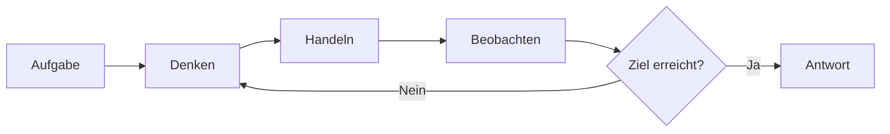
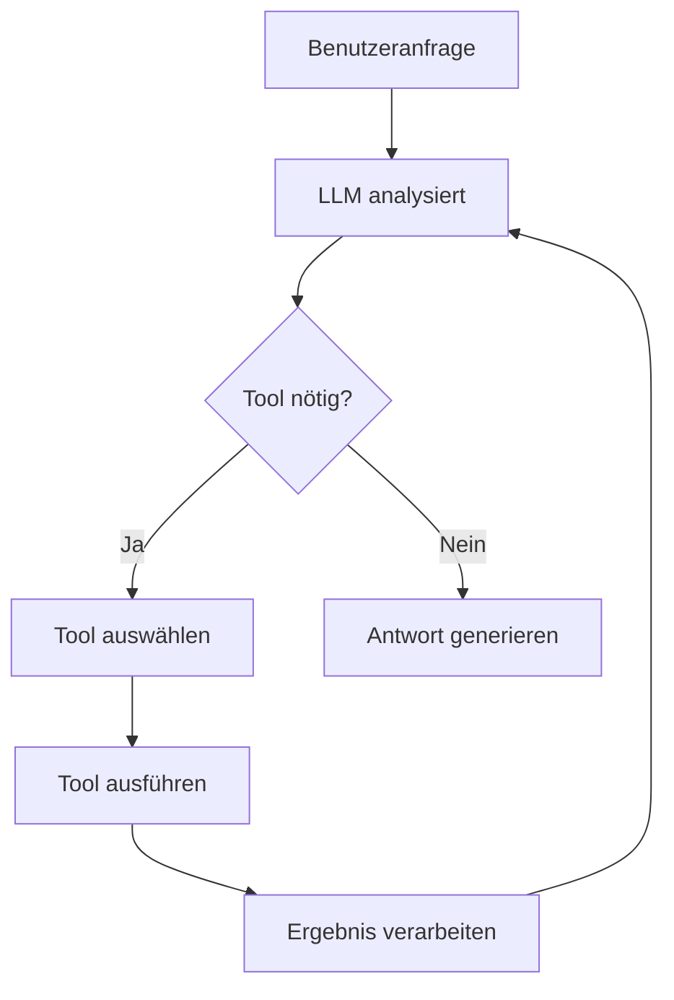
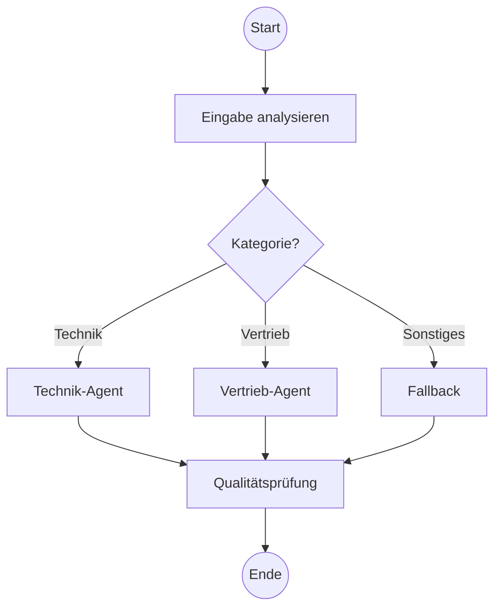
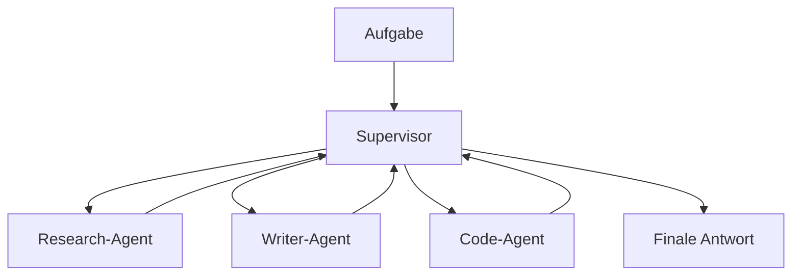
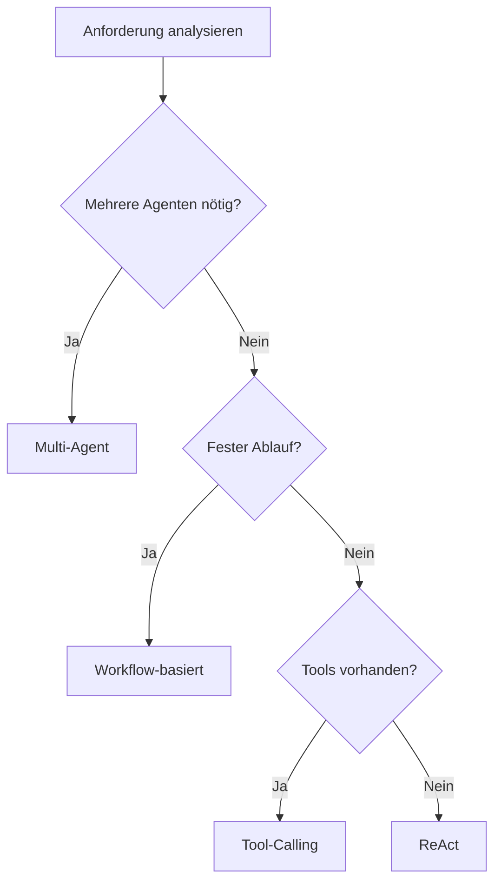

# Agent-Architekturen
{: .no_toc }

> **Verschiedene Architekturmuster und Design-Prinzipien für KI-Agenten**

---
# Inhaltsverzeichnis
{: .no_toc .text-delta }

1. TOC
{:toc}

---

## 1 Überblick

Ein KI-Agent ist mehr als ein einfacher Chatbot. Während ein Chatbot auf Eingaben reagiert und Antworten generiert, kann ein Agent **selbstständig Entscheidungen treffen**, **Werkzeuge nutzen** und **mehrstufige Aufgaben lösen**. Die Wahl der richtigen Architektur bestimmt maßgeblich, wie leistungsfähig, zuverlässig und wartbar ein Agent-System wird.

Vier grundlegende Architekturmuster haben sich in der Praxis etabliert:

| Architektur | Kernidee | Komplexität |
|-------------|----------|-------------|
| **ReAct** | Denken → Handeln → Beobachten | ⭐⭐ |
| **Tool-Calling** | LLM wählt und nutzt Werkzeuge | ⭐⭐ |
| **Workflow-basiert** | Definierte Schritte mit Verzweigungen | ⭐⭐⭐ |
| **Multi-Agent** | Spezialisierte Agenten arbeiten zusammen | ⭐⭐⭐⭐ |

---

## 2 ReAct-Architektur

ReAct (Reasoning + Acting) beschreibt einen iterativen Zyklus: Der Agent **denkt nach** (Reasoning), **führt eine Aktion aus** (Acting) und **beobachtet das Ergebnis**. Dieser Zyklus wiederholt sich, bis die Aufgabe gelöst ist.

**Charakteristik:**
- Transparenter Denkprozess (nachvollziehbar)
- Gut geeignet für explorative Aufgaben
- Kann bei komplexen Problemen viele Iterationen benötigen

**Typischer Einsatz:** Recherche-Aufgaben, Problemlösung mit unbekanntem Lösungsweg

---

## 3 Tool-Calling-Architektur

Bei dieser Architektur entscheidet das LLM, **welches Werkzeug** mit **welchen Parametern** aufgerufen werden soll. Das Ergebnis fließt zurück in den Kontext, und der Agent formuliert die finale Antwort.

**Charakteristik:**
- LLM als "Orchestrator" der Werkzeuge
- Erweiterbar durch neue Tools ohne Architekturänderung
- Abhängig von der Qualität der Tool-Beschreibungen

**Typischer Einsatz:** Assistenten mit definierten Fähigkeiten (Kalender, E-Mail, Datenbank)

---

## 4 Workflow-basierte Architektur

Hier werden Arbeitsschritte als **Graph mit Knoten und Kanten** modelliert. Jeder Knoten repräsentiert eine Verarbeitung, Kanten definieren den Ablauf – einschließlich bedingter Verzweigungen.

**Charakteristik:**
- Vorhersagbarer, kontrollierbarer Ablauf
- Explizite Fehlerbehandlung möglich
- Komplexität steigt mit Anzahl der Verzweigungen

**Typischer Einsatz:** Mehrstufige Prozesse, Genehmigungsworkflows, RAG-Pipelines

---

## 5 Multi-Agent-Architektur

Mehrere spezialisierte Agenten arbeiten zusammen. Ein **Supervisor** koordiniert die Aufgabenverteilung, oder Agenten kommunizieren **kollaborativ** miteinander.

**Varianten:**

| Pattern | Beschreibung |
|---------|-------------|
| **Supervisor** | Ein Agent verteilt Aufgaben an Worker-Agenten |
| **Hierarchisch** | Mehrere Ebenen von Supervisors und Workern |
| **Kollaborativ** | Agenten kommunizieren direkt miteinander |

**Charakteristik:**
- Skalierbar für komplexe Aufgaben
- Jeder Agent kann optimiert werden
- Koordination erfordert sorgfältiges Design

**Typischer Einsatz:** Content-Erstellung, komplexe Analysen, autonome Systeme

---

## 6 Design-Prinzipien

Unabhängig von der gewählten Architektur gelten bewährte Prinzipien:

### 6.1 Single Responsibility
Jede Komponente hat **eine klar definierte Aufgabe**. Ein Tool berechnet, ein anderes sucht – nicht beides gleichzeitig. Das erleichtert Wartung und Fehlersuche.

### 6.2 Fail-Safe Design
Agenten müssen mit Fehlern umgehen können:
- Was passiert, wenn ein Tool nicht erreichbar ist?
- Was, wenn das LLM eine ungültige Tool-Auswahl trifft?
- Maximale Iterationen verhindern Endlosschleifen.

### 6.3 Human-in-the-Loop
Bei kritischen Aktionen (Löschen, Senden, Bezahlen) sollte eine **menschliche Bestätigung** eingeholt werden. Das schafft Vertrauen und verhindert kostspielige Fehler.

### 6.4 Observability
Jede Entscheidung des Agenten sollte **nachvollziehbar** sein. Logging und Tracing ermöglichen Debugging und kontinuierliche Verbesserung.

---

## 7 Entscheidungshilfe

Die Wahl der Architektur hängt vom Anwendungsfall ab:

| Situation | Empfohlene Architektur |
|-----------|----------------------|
| Einfache Q&A mit Datenbankzugriff | Tool-Calling |
| Mehrstufiger Genehmigungsprozess | Workflow-basiert |
| Recherche mit unbekanntem Umfang | ReAct |
| Content-Pipeline (Research → Write → Review) | Multi-Agent |
| RAG-System mit Nachbearbeitung | Workflow-basiert |

---

## 8 Zusammenfassung

- **ReAct** eignet sich für explorative Aufgaben mit transparentem Denkprozess
- **Tool-Calling** macht Agenten durch Werkzeuge erweiterbar
- **Workflow-basiert** bietet Kontrolle über komplexe Abläufe
- **Multi-Agent** skaliert für anspruchsvolle, arbeitsteilige Aufgaben

Die Architekturmuster schließen sich nicht gegenseitig aus. In der Praxis kombinieren viele Systeme mehrere Ansätze: Ein Workflow kann Tool-Calling-Agenten als Knoten enthalten, oder ein Multi-Agent-System nutzt ReAct-Agenten als Worker.

Im weiteren Kursverlauf werden diese Architekturen praktisch mit LangChain und LangGraph umgesetzt.

---

**Version:** 1.0  
**Stand:** November 2025  
**Kurs:** Generative KI. Verstehen. Anwenden. Gestalten.
