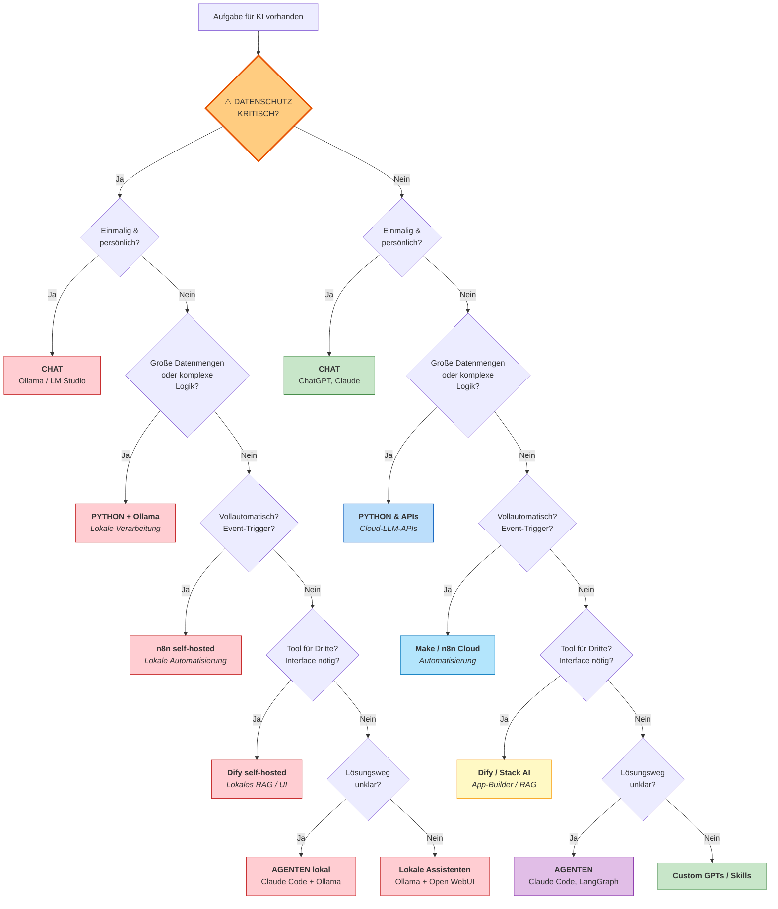

# Aufgabenklassen & Lösungswege 
{: .no_toc }

> **Die Aufgabe bestimmt das Tool**         
> Wie sich für konkrete Aufgaben der richtige GenAI-Lösungsweg finden lässt – von Chat über Automation bis hin zu Agenten-Systemen

---

# Inhaltsverzeichnis
{: .no_toc .text-delta }

1. TOC
{:toc}

---

## Intro

Wer heute mit generativer Künstlicher Intelligenz (GenAI) arbeiten möchte, steht vor einer verwirrenden Vielfalt an Möglichkeiten: ChatGPT nutzen? Python-Code schreiben? Automation-Tools einsetzen? Diese Frage ist nicht trivial, denn die falsche Wahl kostet Zeit, Geld und Nerven.

Die gute Nachricht: Es gibt eine Logik dahinter. Dieser Text zeigt, wie sich für konkrete Aufgaben der richtige Lösungsweg finden lässt – ohne dass bereits Expertise vorhanden sein muss.

## Die zentrale Erkenntnis: Die Aufgabe bestimmt das Tool

Viele Anfänger machen denselben Fehler: Ein Tool wird gelernt (z.B. ChatGPT) und dann wird versucht, damit alle Aufgaben zu lösen. Das ist, als würde man mit einem Hammer sowohl Nägel einschlagen als auch Suppe essen wollen.

**Besser:** Erst die Aufgabe verstehen, dann das passende Werkzeug wählen.

## Die Entscheidungskriterien im Überblick

Vor der Wahl des Lösungswegs sollten (mindestens) folgende Aspekte geklärt werden:

### 1. Datenschutz (Killer-Kriterium)

**Erste und wichtigste Frage:** Dürfen die Daten in die Cloud bzw. zu US-Anbietern?

- **NEIN bei:** Patientendaten, Anwaltsdokumente, Personaldaten (DSGVO Art. 9), Geschäftsgeheimnisse, Behördendaten
- **Falls NEIN:** Nur selbst gehostete oder lokale Lösungen möglich
- **Falls JA:** Alle Cloud-basierten Optionen verfügbar

### 2. Frequenz und Komplexität

- **Einmalig/persönlich:** Schnelle Antwort für aktuelle Aufgabe
- **Große Datenmengen:** >1000 Datensätze, komplexe Verarbeitung
- **Wiederkehrend automatisiert:** Regelmäßige automatische Ausführung

### 3. Zielgruppe

- **Persönlich:** Nur für eigene Nutzung
- **Team/Dritte:** Andere Personen sollen das Tool verwenden (Interface nötig)

### 4. Grad der Autonomie

- **Klar definiert:** Ablauf ist bekannt
- **Explorativ:** KI soll selbstständig Lösungsweg finden

## Die Lösungswege im Detail

### Lösungsweg 1: Chat-Anwendungen (ChatGPT, Claude, Copilot)

**Wann nutzen?**

- Sofortige Antwort oder Hilfe wird benötigt
- Einmalige oder seltene Aufgabe
- Keine Integration in andere Systeme nötig
- **Datenschutz unkritisch**

**Beispiele:**

- "Formuliere diese E-Mail professioneller"
- "Erkläre mir, wie neuronale Netze funktionieren"
- "Erstelle einen Entwurf für eine Präsentation"

**Vorteile:**

- ✅ Sofort verfügbar, keine Installation
- ✅ Einfachste Nutzung
- ✅ Ideal für kreative und explorative Aufgaben

**Nachteile:**

- ❌ Manuelle Übertragung von Ergebnissen nötig
- ❌ Keine Automatisierung möglich
- ❌ Arbeitet isoliert ("Silo")

---

### Lösungsweg 2: Workflow-Automation (n8n, Make)

**Wann nutzen?**

- Automatischer Prozessablauf gewünscht
- Verschiedene Tools sollen miteinander verbunden werden
- Die Logik ist relativ klar definiert ("Wenn X, dann Y")
- Event-basierte Trigger (E-Mail, Webhook, Zeitplan)

**Beispiele:**

- "Jede eingehende Rechnung per E-Mail → auslesen → in Buchhaltungssoftware eintragen"
- "Neuer Eintrag in Google Forms → analysieren → Antwort-E-Mail verschicken"
- "Social Media Post → Zusammenfassen → in Slack posten"

**Vorteile:**

- ✅ Visuelle Programmierung (kein Code nötig)
- ✅ Viele fertige Verbindungen zu Tools (Gmail, Slack, etc.)
- ✅ Läuft 24/7 im Hintergrund

**Nachteile:**

- ❌ Bei großen Datenmengen teuer (Pay-per-Step)
- ❌ Begrenzte Flexibilität für komplexe Logik
- ❌ Kein Frontend für Endnutzer

---

### Lösungsweg 3: KI-App-Builder (LangFlow, Dify, Stack AI, ...)

**Wann nutzen?**

- Ein KI-Tool soll für andere bereitgestellt werden
- Interface/UI wird benötigt
- RAG (Retrieval Augmented Generation) mit eigenen Dokumenten
- Schnelles Prototyping einer KI-Anwendung

**Beispiele:**

- "HR-Bot für Mitarbeiter mit Zugriff auf Unternehmensrichtlinien"
- "Kundenservice-Chatbot mit Produktwissen"
- "Persönlicher Lern-Assistent für Kursteilnehmer"

**Vorteile:**

- ✅ Fertiges Frontend (Web-Interface)
- ✅ RAG "out of the box" (Dokumente hochladen, fertig)
- ✅ Kein Full-Stack-Development nötig

**Nachteile:**

- ❌ Abhängigkeit von der Plattform
- ❌ Weniger flexibel als reiner Code
- ❌ Noch relativ junge Tools

---

### Lösungsweg 4: Python & APIs (Programmierung)

**Wann nutzen?**

- Sehr große Datenmengen (>1000 Datensätze)
- Extrem komplexe Datenverarbeitung nötig
- Maximale Kontrolle und Kostenoptimierung gewünscht
- Integration in bestehende Software
- Batch-Processing erforderlich

**Beispiele:**

- "Analysiere 50.000 Kundenbewertungen und kategorisiere sie"
- "Extrahiere strukturierte Daten aus 10.000 PDFs"
- "Baue eine Custom-App mit KI-Funktionalität"
- "Komplexe statistische Auswertung mit KI-Unterstützung"

**Vorteile:**

- ✅ Maximale Flexibilität und Kontrolle
- ✅ Sehr kostengünstig bei Skalierung
- ✅ Professionelle Versionskontrolle möglich
- ✅ Komplexe Datenmanipulation (Pandas, NumPy)

**Nachteile:**

- ❌ Erfordert Programmierkenntnisse
- ❌ Längere Entwicklungszeit
- ❌ Wartung und Updates nötig

---

### Lösungsweg 5: Agenten-Systeme (Claude Code, LangGraph, MCP)

**Wann nutzen?**

- Die KI soll eigenständig Aufgaben lösen
- Der genaue Lösungsweg ist vorher nicht bekannt
- Zugriff auf lokale Dateien und Tools nötig
- Explorative oder Research-Aufgaben
- Coding-Aufgaben oder Debugging

**Beispiele:**

- "Finde und behebe den Bug in meinem Projekt"
- "Recherchiere Informationen über Firma X und erstelle einen Bericht"
- "Refaktoriere diese 50 Code-Dateien nach Best Practices"
- "Analysiere meine Codebasis und schlage Verbesserungen vor"

**Vorteile:**

- ✅ Autonome Aufgabenlösung
- ✅ Zugriff auf lokales Dateisystem (MCP)
- ✅ Ideal für explorative Aufgaben
- ✅ Multi-Step-Reasoning

**Nachteile:**

- ❌ Kann teuer werden (viele API-Calls)
- ❌ Unvorhersehbar ("probabilistisch")
- ❌ Erfordert Überwachung
- ❌ Potenzielle Fehlerquellen

---

### Lösungsweg 6: Lokale LLMs (Ollama, LM Studio)

**Wann nutzen?**

- Strikte Datenschutzanforderungen (DSGVO)
- Sensible Daten (Gesundheit, Recht, Finanzen)
- Kostenfreies Experimentieren gewünscht
- Keine Internetverbindung verfügbar
- **Daten dürfen NICHT in die Cloud**

**Beispiele:**

- "Analyse von Patientendaten"
- "Interne Unternehmensdokumente verarbeiten"
- "Lernen und Experimentieren ohne laufende Kosten"
- "Anwaltliche Dokumente analysieren"

**Vorteile:**

- ✅ 100% Datenkontrolle
- ✅ Keine laufenden API-Kosten
- ✅ Offline nutzbar
- ✅ DSGVO-konform

**Nachteile:**

- ❌ Erfordert leistungsfähige Hardware
- ❌ Kleinere Modelle = weniger "intelligent"
- ❌ Technisches Setup nötig
- ❌ Wartung erforderlich

**Kostenpunkt:** Nur Hardware + Strom

---

### Lösungsweg 7: Custom GPTs und Skills

**Wann nutzen?**

- Erweiterte Chat-Funktionalität gewünscht
- Spezifische Instructions wiederkehrend nutzen
- Kleine Tools für persönliche Produktivität
- Kein großer Entwicklungsaufwand gewünscht

**Beispiele:**

- "Persönlicher Schreibassistent mit spezifischem Stil"
- "Fachspezifischer Tutor (z.B. für Mathematik)"
- "Code-Review-Assistant mit eigenen Guidelines"

**Vorteile:**

- ✅ Sehr schnelles Setup
- ✅ Keine Infrastruktur nötig
- ✅ Direkt in Chat-Umgebung nutzbar

**Nachteile:**

- ❌ Begrenzte Funktionalität
- ❌ Abhängig von Plattform (OpenAI, Anthropic)
- ❌ Keine echte Automatisierung

---

## Der Entscheidungsbaum



## Erläuterung der Entscheidungslogik

### Ebene 0: Datenschutz als Killer-Kriterium

**Die allerwichtigste Frage zuerst:** Dürfen die zu verarbeitenden Daten die Organisation verlassen oder zu US-Cloud-Anbietern?

#### Wann ist Datenschutz KRITISCH?

**JA (kritisch) bei:**

- 🏥 **Gesundheitsdaten:** Patientenbriefe, Diagnosen, Behandlungspläne
- ⚖️ **Anwaltsdokumente:** Mandantengeheimnisse, vertrauliche Verträge
- 👥 **Personaldaten:** Bewerbungen, Leistungsbeurteilungen, Gehaltsdaten
- 💼 **Geschäftsgeheimnisse:** Produktentwicklung, Strategiepapiere, M&A-Dokumente
- 🏛️ **Behördendaten:** Verwaltungsdokumente mit sensiblen Bürgerdaten
- 💰 **Finanzdaten:** Je nach Compliance-Anforderungen

**NEIN (unkritisch) bei:**

- Öffentlich verfügbare Informationen
- Marketing-Content
- Allgemeine Produktinformationen
- Nicht-personenbezogene Daten
- Daten ohne rechtliche Restriktionen

#### Der sichere Pfad (rot markiert)

Falls Datenschutz kritisch ist, bleiben nur drei Optionen:

**1. n8n (self-hosted)** für Workflow-Automatisierung

- Docker-Installation auf eigenen Servern
- Volle Kontrolle über Datenfluss
- EU-Hosting möglich (z.B. Hetzner)

**2. Dify (self-hosted)** für Team-Tools mit RAG

- On-Premise Installation
- Lokale Vektordatenbank
- Keine Daten verlassen das System

**3. Python + Ollama** für Datenverarbeitung und Expertise

- Komplette Offline-Fähigkeit
- Lokale LLMs (Llama, Mistral)
- Maximale Kontrolle

### Ebene 1: Persönliche Ad-hoc-Nutzung

Falls Datenschutz unkritisch ist, lautet die erste Frage: **Ist es eine einmalige Aufgabe nur für persönliche Nutzung?**

**JA → CHAT**

- Schnellste Lösung
- Keine Vorbereitung nötig
- Ideal für Exploration und Kreativität

### Ebene 2: Komplexität und Datenvolumen

Falls nicht nur persönlich/einmalig: **Sind große Datenmengen oder extrem komplexe Logik involviert?**

**JA → PYTHON & APIs**

- > 1000 Datensätze

- Komplexe Algorithmen
- Statistische Auswertungen
- Batch-Processing
- Kostenoptimierung bei Skalierung

**Warum Python so früh im Baum?**
Große Datenmengen in Workflow-Tools zu verarbeiten wird schnell teuer und langsam. Python ist hier die einzig sinnvolle Wahl, unabhängig von anderen Faktoren.

### Ebene 3: Automatisierung

Falls keine großen Datenmengen: **Soll der Prozess vollautomatisch durch Events getriggert werden?**

**JA → WORKFLOW (Make oder n8n)**

- Event-basiert (E-Mail, Webhook, Zeitplan)
- Läuft im Hintergrund ohne manuelle Interaktion
- Verbindet verschiedene Systeme

### Ebene 4: Interface für Dritte

Falls nicht automatisch: **Sollen andere Menschen das Tool aktiv nutzen? Wird ein Interface benötigt?**

**JA → APP-BUILDER (Dify, Stack AI)**

- Frontend wird benötigt
- RAG mit eigenen Dokumenten
- Team-Chatbots oder interne Tools

### Ebene 5: Grad der Autonomie

Falls kein Interface für andere: **Ist der Lösungsweg unklar? Soll die KI explorativ vorgehen?**

**JA → AGENTEN**

- Forschungsaufgaben
- Code-Analyse und Debugging
- Unklarer Aufgabenbereich

**NEIN → Custom GPTs / Skills**

- Erweiterte Chat-Funktionalität
- Wiederkehrende Instructions
- Persönliche Produktivitäts-Tools

## Praxisbeispiele mit Entscheidungspfaden

### Beispiel 1: "Blog-Artikel über KI-Trends schreiben"

```
Datenschutz kritisch? → NEIN
Einmalig & persönlich? → JA
→ CHAT ✅
```

### Beispiel 2: "Patientenbriefe automatisch kategorisieren"

```
Datenschutz kritisch? → JA (Gesundheitsdaten!)
Was steht im Vordergrund? → Daten/Expert
→ Python + Ollama ✅
```

### Beispiel 3: "Alle Rechnungen automatisch in Buchhaltung eintragen"

```
Datenschutz kritisch? → NEIN
Einmalig & persönlich? → NEIN
Große Datenmengen? → NEIN
Vollautomatisch/Events? → JA (bei E-Mail-Eingang)
→ Make oder n8n ✅
```

### Beispiel 4: "HR-Bot für 200 Mitarbeiter mit Unternehmensrichtlinien"

```
Datenschutz kritisch? → JA (Personaldaten!)
Was steht im Vordergrund? → Team/RAG
→ Dify self-hosted ✅
```

### Beispiel 5: "50.000 Kundenbewertungen analysieren und kategorisieren"

```
Datenschutz kritisch? → NEIN
Einmalig & persönlich? → NEIN
Große Datenmengen? → JA (50.000 Items!)
→ Python & APIs ✅
```

### Beispiel 6: "Interner Produktkatalog-Chatbot für Vertriebsteam"

```
Datenschutz kritisch? → NEIN (Produktinfo öffentlich)
Einmalig & persönlich? → NEIN
Große Datenmengen? → NEIN
Vollautomatisch? → NEIN
Tool für Dritte? → JA (Vertriebsteam)
→ Dify / Stack AI ✅
```

### Beispiel 7: "Code-Review und Refactoring meiner Codebasis"

```
Datenschutz kritisch? → NEIN (eigener Code, kein IP-Problem)
Einmalig & persönlich? → NEIN
Große Datenmengen? → NEIN
Vollautomatisch? → NEIN
Tool für Dritte? → NEIN
Lösungsweg unklar? → JA (explorativ)
→ Agenten (Claude Code) ✅
```

### Beispiel 8: "Täglicher automatischer Social-Media-Report"

```
Datenschutz kritisch? → NEIN
Einmalig & persönlich? → NEIN
Große Datenmengen? → NEIN
Vollautomatisch? → JA (täglich)
→ Make oder n8n ✅
```

### Beispiel 9: "Persönlicher Mathe-Tutor mit meinem Lernstil"

```
Datenschutz kritisch? → NEIN
Einmalig & persönlich? → NEIN (wiederkehrend)
Große Datenmengen? → NEIN
Vollautomatisch? → NEIN
Tool für Dritte? → NEIN
Lösungsweg unklar? → NEIN (klare Instructions)
→ Custom GPTs ✅
```

### Beispiel 10: "Anwaltsschriftsätze auf Präzedenzfälle prüfen"

```
Datenschutz kritisch? → JA (Mandantengeheimnis!)
Was steht im Vordergrund? → Daten/Expert
→ Python + Ollama ✅
```

## Wichtige Prinzipien für die Praxis

### 1. **Datenschutz first**

Niemals mit der technischen Lösung beginnen, bevor Datenschutz geklärt ist. Ein nachträglicher Wechsel von Cloud zu On-Premise ist aufwendig und teuer.

### 2. **Start Simple, Scale Later**

Immer mit dem einfachsten Lösungsweg beginnen. Ein Chat reicht oft aus. Wenn dieselbe Aufgabe zum 10. Mal manuell gemacht wird, sollte automatisiert werden.

### 3. **Die "3-Mal-Regel"**

Wenn eine Aufgabe zum dritten Mal manuell ausgeführt wird, lohnt sich Automatisierung.

### 4. **Kosten im Blick behalten**

- **Chat:** 0-20€/Monat, überschaubar
- **Workflows:** Vorsicht bei vielen Steps (Pay-per-Operation)
- **Python:** Günstig bei Skalierung (nur API-Kosten)
- **Agenten:** Können teuer werden (viele iterative Calls)
- **Lokale LLMs:** Nur Hardware + Strom
- **App-Builder:** Mittelfeld, oft Freemium-Modelle

### 5. **Kombinieren ist erlaubt**

Die beste Lösung ist oft eine Kombination:

- Workflow empfängt und routet Daten
- Python verarbeitet komplexe Berechnungen
- Ergebnis wird in App-Builder als Chatbot verfügbar gemacht

### 6. **Der Datenschutz-Reality-Check**

Bei Unsicherheit: Lieber zu vorsichtig als zu nachlässig. Bußgelder bei DSGVO-Verstößen können existenzbedrohend sein.

## Häufige Anfängerfehler

❌ **"Datenschutz ignorieren":** Patientendaten direkt zu ChatGPT senden
✅ **Besser:** Datenschutz-Anforderungen zuerst klären, dann Tool wählen

❌ **"Over-Engineering":** Python-Skript für etwas schreiben, das ChatGPT in 10 Sekunden erledigt
✅ **Besser:** Die Frage stellen: "Wird das wirklich gebraucht?"

❌ **"Under-Engineering":** Versuch, 10.000 Datensätze in Make zu verarbeiten
✅ **Besser:** Bei großen Datenmengen direkt zu Python wechseln

❌ **"Tool-Verliebheit":** "Jetzt wird Dify gelernt, weil es cool ist"
✅ **Besser:** Aufgabengetrieben denken, nicht tool-getrieben

❌ **"Agenten überschätzen":** Agenten für einfache, deterministische Aufgaben einsetzen
✅ **Besser:** Agenten nur bei wirklich unklarem Lösungsweg nutzen

❌ **"Cloud-First-Denken":** Standardmäßig Cloud-Tools wählen
✅ **Besser:** Bewusst entscheiden: Cloud vs. Self-Hosted vs. Lokal

## Zusammenfassung: Die Faustregel

|Ziel|Datenschutz|Primäre Fragen|Tool-Empfehlung|
|---|---|---|---|
|Schnelle Hilfe|Unkritisch|Einmalig? Persönlich?|**Chat**|
|Sensible Workflows|**KRITISCH**|Automatisierung?|**n8n self-hosted**|
|Team-Tool sensitiv|**KRITISCH**|Interface nötig?|**Dify self-hosted**|
|Große Daten sensitiv|**KRITISCH**|Datenverarbeitung?|**Python + Ollama**|
|Prozess automatisieren|Unkritisch|Events? Trigger?|**Make/n8n**|
|App für andere|Unkritisch|UI für Team?|**Dify/Stack AI**|
|Große Daten|Unkritisch|>1000 Items?|**Python & APIs**|
|Autonome Exploration|Unkritisch|Weg unklar?|**Agenten**|
|Persönliche Erweiterung|Unkritisch|Wiederkehrend?|**Custom GPTs**|

## Datenschutz-Entscheidungshilfe

### Wann sind Daten DSGVO-kritisch?

Nach **DSGVO Art. 9** ("besondere Kategorien personenbezogener Daten"):

1. **Gesundheitsdaten**
2. Genetische und biometrische Daten
3. Daten über rassische/ethnische Herkunft
4. Politische Meinungen
5. Religiöse/weltanschauliche Überzeugungen
6. Gewerkschaftszugehörigkeit
7. Sexualleben/sexuelle Orientierung

### Cloud-Anbieter und Rechtslage

**Stand 2024/2025:**

- **OpenAI (ChatGPT):** US-Unternehmen, Daten können in USA verarbeitet werden
- **Anthropic (Claude):** US-Unternehmen, aber striktere Datenschutzrichtlinien
- **Google (Gemini):** US-Unternehmen, aber EU-Datacenter verfügbar
- **Microsoft (Copilot):** Enterprise-Versionen mit EU-Garantie möglich

**Faustregel:**

- **Consumer-Versionen:** NICHT für sensible Daten
- **Enterprise-Versionen mit BAA/DPA:** Oft zulässig
- **Self-Hosted:** Immer sicher

### Self-Hosting Optionen

|Tool|Komplexität|Hardware|Beste für|
|---|---|---|---|
|**Ollama**|Niedrig|Laptop/Desktop|Einzelperson, Experimente|
|**n8n**|Mittel|VPS/Docker|Workflows, Automatisierung|
|**Dify**|Mittel|VPS/Docker|Team-Tools, RAG|
|**LM Studio**|Niedrig|Desktop|Lokale Entwicklung|
|**AnythingLLM**|Niedrig|Desktop|Persönliches RAG|

## Weiterführende Überlegungen

### Hybride Ansätze

In der Praxis entstehen oft **Hybrid-Architekturen**:

**Beispiel: Kundenservice-System**

1. **Workflow (n8n)** empfängt E-Mail via Webhook
2. **Python-Skript** prüft Kundendatenbank und klassifiziert
3. **Cloud-LLM-API** generiert Antwort (unkritische Daten)
4. **Workflow** sendet E-Mail und loggt in CRM

**Beispiel: Medizinische Dokumentation**

1. **Lokales LLM (Ollama)** analysiert Patientenbrief
2. **Python** extrahiert strukturierte Daten
3. **n8n (self-hosted)** speichert in lokaler Datenbank
4. **Dify (self-hosted)** stellt Ärzte-Interface bereit

### Evolutionäre Entwicklung

Projekte entwickeln sich oft entlang dieser Linie:

**Phase 1: Exploration**

- Chat für Prototyping und Machbarkeitsprüfung

**Phase 2: Automatisierung**

- Workflow-Tool für erste Prozesse

**Phase 3: Skalierung**

- Python für Datenvolumen und Kostenoptimierung

**Phase 4: Produktisierung**

- App-Builder für Nutzer-Interface und Team-Rollout

### Die Rolle von Expertise

|Expertise-Level|Empfohlene Tools|Lernkurve|
|---|---|---|
|**Einsteiger**|Chat, Custom GPTs|Tage|
|**Business-User**|Make, Stack AI|Wochen|
|**Tech-Savvy**|n8n, Dify|Wochen|
|**Entwickler**|Python, LangChain|Monate|
|**Experten**|Agenten, lokale LLMs|Monate|

## Zusätzliche Lösungswege

### AI-Powered Code Generators (Lovable, v0.dev, Bolt)

**Separate Kategorie:** Diese Tools **bauen** komplette Apps, anstatt KI-Features bereitzustellen.

**Wann nutzen?**

- Komplette Website/Web-App wird benötigt
- Schnelles Prototyping für Investor-Pitch
- Landing Pages, interne Tools
- MVP für Startup

**Unterschied zu App-Buildern:**

- **App-Builder (Dify):** Baut Tools, die KI **nutzen**
- **Code-Generator (Lovable):** Nutzt KI, um **Apps zu bauen**

**Beispiel:**

- "Landing Page erstellen" → **Lovable**
- "Chatbot mit PDF-Upload" → **Dify**

**Kombination möglich:** Lovable baut Frontend → Dify stellt KI-Backend bereit

## Ausblick: Die Zukunft verschwimmt

Die Grenzen zwischen den Lösungswegen werden zunehmend fließend:

### Trends 2025+

**"Vibe Coding":** Tools wie Claude Code ermöglichen es, komplexen Python-Code durch natürliche Sprache zu erstellen

**No-Code → Code:** Plattformen wie Dify bieten zunehmend Code-Export

**Agenten überall:** Workflow-Tools integrieren zunehmend Agenten-Fähigkeiten

**Lokale Modelle werden besser:** Die Lücke zwischen lokalen und Cloud-Modellen schließt sich

**Die wichtigste Kompetenz** wird nicht sein, ein spezifisches Tool zu beherrschen, sondern:

- Aufgaben richtig zu klassifizieren
- Trade-offs zu verstehen (Kosten, Zeit, Kontrolle, Datenschutz)
- Architekturentscheidungen zu treffen
- Datenschutz-Compliance sicherzustellen

## Checkliste vor der Tool-Wahl

- [ ] Datenschutz-Anforderungen geklärt?
- [ ] Datenvolumen geschätzt?
- [ ] Frequenz der Nutzung bekannt?
- [ ] Zielgruppe definiert (persönlich/Team)?
- [ ] Budget-Rahmen festgelegt?
- [ ] Technische Expertise vorhanden?
- [ ] Wartungsaufwand berücksichtigt?
- [ ] Vendor-Lock-in akzeptabel?
- [ ] Skalierbarkeit geprüft?
- [ ] Exit-Strategie überlegt?

Die Welt der generativen KI ist komplex, aber mit dieser systematischen Herangehensweise lässt sich für jede Aufgabe der richtige Einstieg finden. Der Schlüssel liegt darin, **Datenschutz zuerst** zu klären und dann **aufgabengetrieben** statt tool-getrieben zu denken.


---

**Version:** 1.0       
**Stand:** Februar 2026            
**Kurs:** Generative KI. Verstehen. Anwenden. Gestalten.        