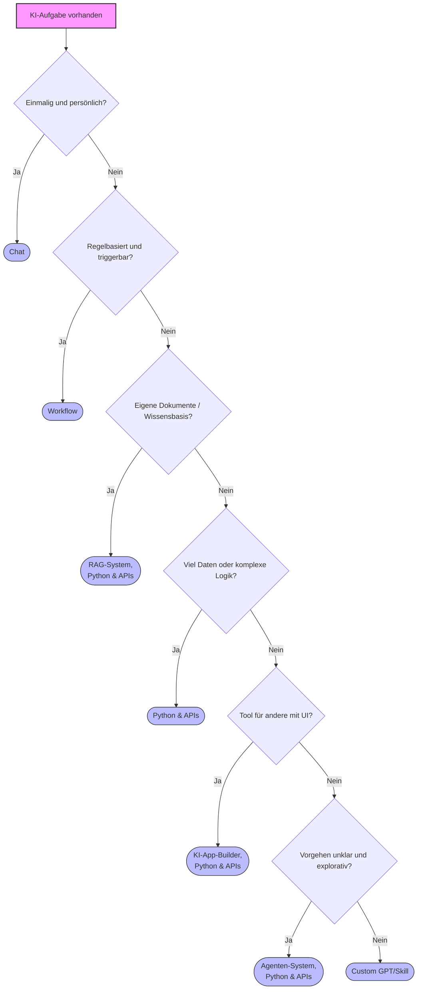

# Aufgabenklassen & Lösungswege
{: .no_toc }

> **Die Aufgabe bestimmt das Tool.**
> Erst Aufgabentyp klären, dann Datenschutz (Cloud vs. lokal), dann Kosten und Wartung.

---

# Inhaltsverzeichnis
{: .no_toc .text-delta }

1. TOC
{:toc}

---

## Ziel dieses Dokuments

Generative KI bietet viele Wege: Chat, Workflows, App-Builder, Python, Agenten, lokale Modelle. Die falsche Wahl führt oft zu unnötiger Komplexität oder Datenschutzrisiken.

Dieses Dokument liefert eine klare Entscheidungslogik:

1. Aufgabentyp bestimmen
2. Datenschutzanforderungen klären
3. Umsetzung nach Aufwand, Budget und Skalierung wählen

## Kernprinzip

Viele Teams starten tool-getrieben: "Wir nutzen Tool X für alles." Das ist ineffizient.

**Besser:** aufgabengetrieben entscheiden.

- **Aufgabe zuerst:** Was soll konkret erreicht werden?
- **Datenschutz danach:** Cloud, self-hosted oder rein lokal?
- **Betrieb zuletzt:** Wer betreibt, wartet und bezahlt die Lösung?

## Schnellentscheidung (60 Sekunden)

| Wenn die Aufgabe so aussieht | Dann starte hier |
|---|---|
| Einmalig, ad hoc, persönlich | **Chat-Anwendung** |
| Wiederkehrender Prozess mit Triggern | **Workflow-Automation** |
| Sehr viele Daten oder komplexe Logik | **Python & APIs** |
| Fragen über eigene Dokumente / Wissensbasis | **RAG-System** |
| Tool für andere Nutzer mit UI | **KI-App-Builder** |
| Vorgehen unklar, explorativ, mehrstufig | **Agenten-System** |
| Wiederkehrende persönliche Chat-Hilfe | **Custom GPT/Skill** |

Danach immer prüfen: **Cloud vs. lokal**.

## Entscheidungslogik im Detail

### 1) Aufgabentyp (Primärkriterium)

- **Einmalige Wissens- oder Schreibaufgabe:** Chat
- **Prozessautomatisierung mit klaren Regeln:** Workflow
- **Datenintensive oder algorithmische Aufgabe:** Python
- **Semantische Suche in eigenen Dokumenten/Daten:** RAG-System
- **Nutzerprodukt mit Frontend:** App-Builder
- **Offene Problemstellung mit Tool-Nutzung:** Agenten
- **Persönliche Standardaufgabe im Chat:** Custom GPT/Skill

### 2) Datenschutz (Sekundärkriterium)

Wenn der Aufgabentyp feststeht, folgt die Betriebsform:

- **Unkritische Daten:** Cloud meist schneller
- **Kritische Daten:** self-hosted oder lokal bevorzugen

Typisch kritisch sind z. B. Gesundheitsdaten, Mandatsdaten, Personalakten, vertrauliche Unternehmensinformationen.

### 3) Wirtschaftlichkeit und Betrieb

- **Budget:** Abo, API-Kosten, Hosting, Betrieb
- **Know-how:** vorhandene Teamkompetenzen
- **Skalierung:** Datenvolumen, Nutzerzahl, Lastspitzen
- **Wartung:** Updates, Monitoring, Incident-Prozesse

## Die Lösungswege

### 1. Chat-Anwendungen (z. B. ChatGPT, Claude, Copilot)

**Geeignet für**

- schnelle Einzelaufgaben
- Ideengenerierung, Formulierung, Erklärungen

**Vorteile**

- sofort nutzbar
- geringe Einstiegshürde

**Grenzen**

- wenig Automatisierung
- Ergebnisse müssen oft manuell weiterverarbeitet werden

**Deployment**

| Datenschutz | Variante |
|---|---|
| unkritisch | Cloud-Chatdienste |
| kritisch | lokale Modelle (z. B. Ollama, LM Studio) |

---

### 2. Workflow-Automation (z. B. n8n, Make)

**Geeignet für**

- wiederkehrende, regelbasierte Prozesse
- Event-Trigger (E-Mail, Webhook, Zeitplan)

**Vorteile**

- schneller Bau von End-to-End-Prozessen
- viele Integrationen ohne viel Code

**Grenzen**

- komplexe Logik wird schnell unübersichtlich
- Kosten können bei hoher Last steigen

**Deployment**

| Datenschutz | Variante |
|---|---|
| unkritisch | Cloud-Workflows |
| kritisch | self-hosted Workflow-Plattform |

---

### 3. KI-App-Builder (z. B. Dify, Langflow, Stack AI)

**Geeignet für**

- KI-Tools für Teams oder Kunden
- schneller UI-Prototyp mit Wissensbasis/RAG

**Vorteile**

- Frontend und KI-Logik schnell kombinierbar
- kurzer Weg zum Pilot

**Grenzen**

- Plattformabhängigkeit
- weniger flexibel als individueller Code

**Deployment**

| Datenschutz | Variante |
|---|---|
| unkritisch | Cloud-App-Builder |
| kritisch | self-hosted App-Builder |

---

### 4. Python & APIs

**Geeignet für**

- große Datenmengen
- anspruchsvolle Datenverarbeitung
- tiefe Integration in bestehende Systeme

**Vorteile**

- maximale Kontrolle
- gute Skalierbarkeit und Kostensteuerung

**Grenzen**

- braucht Entwicklungszeit und Engineering-Know-how
- Betrieb und Qualitätssicherung sind Pflicht

**Deployment**

| Datenschutz | Variante |
|---|---|
| unkritisch | Cloud-LLM-APIs |
| kritisch | lokale Inferenz (z. B. mit Ollama) |

---

### 5. RAG-Systeme (z. B. ChromaDB, FAISS + LangChain)

**Geeignet für**

- Fragen über eigene Dokumente, Handbücher, Wissensdatenbanken
- semantische Suche in strukturierten und unstrukturierten Daten

**Vorteile**

- LLM-Antworten mit eigenen, aktuellen Daten kombinierbar
- keine Neutrainierung des Modells notwendig

**Grenzen**

- Qualität hängt stark von Chunking, Embedding und Retrieval ab
- Erfordert Datenpflege und regelmäßige Vektordatenbank-Updates

**Deployment**

| Datenschutz | Variante |
|---|---|
| unkritisch | Cloud-Vektordatenbank + Cloud-LLM |
| kritisch | lokale Vektordatenbank (z. B. Chroma) + lokales Modell (z. B. Ollama) |

---

### 6. Agenten-Systeme (z. B. Claude Code, LangGraph)

**Geeignet für**

- offene, mehrstufige Aufgaben
- Recherche, Analyse, Coding mit Toolzugriff

**Vorteile**

- kann eigenständig Arbeitsschritte planen und ausführen
- stark bei unklaren Problemräumen

**Grenzen**

- schwerer vorherzusagen als regelbasierte Lösungen
- erfordert Guardrails, Monitoring und Kostenkontrolle

**Deployment**

| Datenschutz | Variante |
|---|---|
| unkritisch | Agenten mit Cloud-Modellen |
| kritisch | Agenten + lokale Modelle / isolierte Umgebung |

---

### 7. Custom GPTs / Skills

**Geeignet für**

- wiederkehrende persönliche Aufgaben im Chat
- standardisierte Prompts und Rollen

**Vorteile**

- sehr schnell erstellt
- hoher Produktivitätsgewinn bei Routineaufgaben

**Grenzen**

- meist auf Plattformgrenzen beschränkt
- keine vollwertige Prozessautomatisierung

**Deployment**

| Datenschutz | Variante |
|---|---|
| unkritisch | plattforminterne GPTs/Skills |
| kritisch | lokale Assistentenoberflächen |

## Entscheidungsbaum

```mermaid
flowchart TD
    A[KI-Aufgabe vorhanden] --> B{Einmalig und persönlich?}
    B -->|Ja| B1([Chat])
    B -->|Nein| C{Regelbasiert und triggerbar?}
    C -->|Ja| C1([Workflow])
    C -->|Nein| D{Eigene Dokumente / Wissensbasis?}
    D -->|Ja| D1([RAG-System,<br>Python & APIs])
    D -->|Nein| E{Viel Daten oder komplexe Logik?}
    E -->|Ja| E1([Python & APIs])
    E -->|Nein| F{Tool für andere mit UI?}
    F -->|Ja| F1([KI-App-Builder, <br>Python & APIs])
    F -->|Nein| G{Vorgehen unklar und explorativ?}
    G -->|Ja| G1([Agenten-System, <br>Python & APIs])
    G -->|Nein| H1([Custom GPT/Skill])

    classDef start fill:#f9f,stroke:#333,stroke-width:2px
    classDef solution fill:#bbf,stroke:#333,stroke-width:1px
    class A start
    class B1,C1,D1,E1,F1,G1,H1 solution
```

Danach für jeden Pfad: **Datenschutzprüfung → Cloud, self-hosted oder lokal.**

## Praxisbeispiele (kurz)

1. **"E-Mail besser formulieren"** → Chat
2. **"Rechnungen automatisch erfassen"** → Workflow
3. **"Fragen über interne Handbücher und Richtlinien"** → RAG-System
4. **"50.000 Bewertungen auswerten"** → Python & APIs
5. **"Interner HR-Assistent mit UI"** → App-Builder
6. **"Codebasis analysieren und Refactoring-Vorschläge"** → Agenten
7. **"Persönlicher Mathe-Tutor mit festem Stil"** → Custom GPT/Skill

## Häufige Fehlentscheidungen

- **Over-Engineering:** Python, obwohl ein Chat reicht
- **Under-Engineering:** No-Code für sehr große Datenmengen
- **Tool-Verliebtheit:** Toolwahl vor Problemverständnis
- **Agenten für triviale Aufgaben:** unnötige Kosten und Komplexität
- **RAG statt Fine-Tuning verwechseln:** RAG ergänzt das Modell mit eigenen Daten zur Laufzeit — es trainiert das Modell nicht neu
- **Datenschutz zu spät:** Architektur muss später teuer umgebaut werden

## Praxisregeln

1. **Start simple, scale later:** Mit der einfachsten tragfähigen Lösung starten.
2. **3-Mal-Regel:** Wird eine Aufgabe mindestens dreimal manuell gemacht, Automatisierung prüfen.
3. **Architektur vor Toolnamen:** Erst Muster, dann Produkt.
4. **Betriebsfähigkeit mitdenken:** Logging, Monitoring, Verantwortlichkeiten früh klären.

## Datenschutz kompakt

- Datenschutz ist keine reine Toolfrage, sondern eine **Architekturfrage**.
- Bei personenbezogenen oder vertraulichen Daten gilt: Datenflüsse dokumentieren, Auftragsverarbeitung und Rechtsgrundlage prüfen, ggf. lokale Verarbeitung bevorzugen.
- **Wichtig:** Diese Hinweise sind technisch-praktisch und ersetzen keine Rechtsberatung.

## Kompakte Checkliste vor der Tool-Wahl

- [ ] Aufgabentyp klar?
- [ ] Datenklassifikation erfolgt?
- [ ] Cloud vs. lokal entschieden?
- [ ] Datenvolumen und Frequenz geschätzt?
- [ ] Nutzerkreis (ich, Team, Kunden) definiert?
- [ ] Betriebsmodell und Verantwortliche festgelegt?
- [ ] Budgetrahmen und Skalierungsgrenzen bekannt?
- [ ] Exit-Strategie bei Tool-Wechsel vorhanden?

## Fazit

Treffsichere GenAI-Umsetzung folgt einer einfachen Reihenfolge:

1. **Aufgabe klassifizieren**
2. **Datenschutz und Deployment festlegen**
3. **Lösung mit tragfähigem Betrieb umsetzen**

So bleibt die Lösung fachlich passend, wirtschaftlich sinnvoll und langfristig wartbar.

---

## Abgrenzung zu verwandten Dokumenten

| Dokument | Frage |
|---|---|
| [Prompt Engineering](./Prompt_Engineering.html) | Wie werden Modelle sprachlich und strukturell gesteuert? |
| [RAG-Konzepte](./RAG_Konzepte.html) | Wann hilft Retrieval als Lösungsweg und wie ist eine RAG-Pipeline aufgebaut? |
| [Modell-Auswahl Guide](../frameworks/Modell_Auswahl_Guide.html) | Welches Modell passt zur gewählten Lösung und zum Betriebsziel? |

---

**Version:**    4.0 
**Stand:**    März 2026 
**Kurs:** Generative KI. Verstehen. Anwenden. Gestalten.