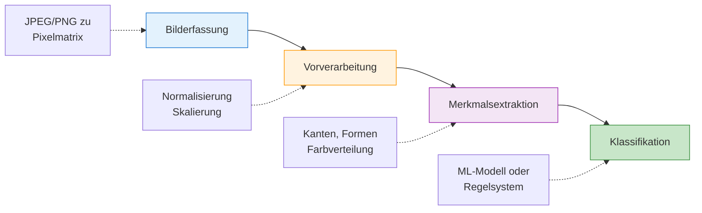

# Multimodal - Bild
{: .no_toc }

> **Vision Language Models: Bildanalyse und Generierung mit LLMs**

---

# Inhaltsverzeichnis
{: .no_toc .text-delta }

1. TOC
{:toc}

---

# Grundlagen Bilderkennung
Ein Computer "sieht" ein Bild nicht wie ein Mensch. Für ihn stellt ein Bild lediglich eine Matrix aus Zahlenwerten dar, wobei jeder Wert die Intensität eines Pixels in verschiedenen Farbkanälen (meist Rot, Grün, Blau) repräsentiert. Diese Zahlenwerte werden von Algorithmen verarbeitet, um Muster und Strukturen zu erkennen, die für die Bilderkennung essenziell sind.

Der Prozess der Bilderkennung umfasst folgende Schritte:

1. **Bilderfassung**: Ein Bild wird in eine numerische Darstellung umgewandelt. Dabei werden Bildformate wie JPEG oder PNG in ein Raster aus Pixelwerten umgerechnet.
2. **Vorverarbeitung**: Das Bild wird normalisiert, skaliert und aufbereitet. Dies kann Schritte wie Rauschunterdrückung, Kontrastanpassung oder Farbnormalisierung umfassen.
3. **Merkmalsextraktion**: Wichtige Merkmale wie Kanten, Formen oder Farbverteilungen werden identifiziert. Hier können Methoden wie Histogramm-basierte Ansätze oder Kantendetektion (z. B. Sobel-Operator) angewendet werden.
4. **Klassifikation**: Basierend auf den extrahierten Merkmalen erfolgt eine Klassifikation des Bildes. Dies geschieht mithilfe von maschinellen Lernmodellen oder regelbasierten Systemen.

**Raster aus Pixelwerten**

# Methoden
## Traditionelle Methoden

Bei traditionellen Methoden müssen explizit Merkmale definiert werden, die als relevant gelten (z. B. Kanten, Farben, Texturen). Klassische Verfahren beinhalten Methoden wie:

- **Kantendetektion** mittels Sobel- oder Canny-Operator
- **Merkmalsvektoren** wie SIFT (Scale-Invariant Feature Transform) oder HOG (Histogram of Oriented Gradients)
- **Template Matching**, um spezifische Muster in Bildern zu finden

Diese Verfahren erfordern umfassendes domänenspezifisches Wissen und sind oft anfällig für Variationen in Beleuchtung, Perspektive oder Bildrauschen.

[Merkmals-Filter](https://editor.p5js.org/ralf.bendig.rb/full/zLXqi5u6f)

[Merkmals-Filter-Anwendung](https://editor.p5js.org/ralf.bendig.rb/full/Xi2uabjR9)

## Deep Learning

Moderne Ansätze setzen auf neuronale Netze, insbesondere Convolutional Neural Networks (CNNs), die eigenständig lernen, welche Merkmale relevant sind. CNNs bestehen aus mehreren Schichten, die folgende Aufgaben erfüllen:

- **Faltungsschichten (Convolutional Layers)**: Extrahieren Merkmale durch das Anwenden von Filtern
- **Pooling-Schichten**: Reduzieren die Dimensionen und verallgemeinern die Merkmale
- **Voll verbundene Schichten (Fully Connected Layers)**: Nutzen die extrahierten Merkmale zur Klassifikation

Deep-Learning-Modelle werden auf große Datensätze trainiert, wodurch sie eine hohe Generalisierungsfähigkeit erreichen und in der Lage sind, komplexe Muster autonom zu lernen.

[Bild](https://towardsdatascience.com/a-comprehensive-guide-to-convolutional-neural-networks-the-eli5-way-3bd2b1164a53)

# Bild-Modelle
## Text-zu-Bild-Modelle

In diesem Abschnitt liegt der Fokus auf Text-zu-Bild-Modellen. Gemeint sind Systeme, die aus einer textlichen Beschreibung ein Bild erzeugen. Technisch verbinden sie Sprachverarbeitung mit Bildmodellen und übersetzen sprachliche Hinweise in visuelle Merkmale wie Objekte, Stil, Perspektive oder Farbgebung.  

Ein zentrales Merkmal dieser Modelle ist die Verknüpfung sprachlicher und visueller Muster. Durch große Datensätze mit Text-Bild-Paaren lernen sie, Beschreibungen wie „eine Katze sitzt auf einem Fensterbrett“ mit Formen, Texturen, Farben und räumlichen Beziehungen zu verbinden. In der Praxis ist dabei wichtig: Solche Modelle erzeugen oft überzeugende Bilder, arbeiten aber nicht im Sinne eines gesicherten Weltmodells. Details, Proportionen oder Schrift im Bild bleiben typische Fehlerquellen.

Hier wird veranschaulicht, wie DALL·E ein Bild mit einem zauberhaften Märchenwald generiert:

## Multimodale Modelle

In diesem Abschnitt geht es um multimodale Modelle, die verschiedene Datentypen wie Text, Bilder, Audio oder Video gemeinsam verarbeiten. Der relevante Unterschied liegt nicht im Marketingbegriff, sondern darin, dass solche Systeme Beziehungen zwischen mehreren Eingabeformen auswerten können. Dadurch werden Aufgaben möglich, bei denen eine Modalität allein nicht ausreicht.  

Während spezialisierte Modelle nur einzelne Übergänge zwischen Modalitäten abbilden, verknüpfen multimodale Modelle mehrere Informationsarten innerhalb derselben Aufgabe. Das ist etwa bei Bildunterschriften, visuellen Fragen oder der Analyse technischer Screenshots relevant. In Übungen zeigt sich allerdings auch, dass multimodal nicht automatisch verlässlich bedeutet. Sobald feine Details, kleine Schriften oder mehrdeutige Bildausschnitte ins Spiel kommen, nimmt die Fehlerquote spürbar zu.

Ein anschauliches Beispiel für multimodale Fähigkeiten ist die Analyse eines handgezeichneten Tic-Tac-Toe-Bretts. Ein solches Modell kann ein Bild des Spiels interpretieren, die Platzierung von X und O erkennen und basierend auf den Spielregeln den Gewinner bestimmen – ohne zusätzliche textliche Informationen über das Spielfeld zu benötigen.

Die Kombination verschiedener Datentypen erweitert den möglichen Einsatzbereich deutlich. Für den Kurs ist vor allem relevant, an welcher Stelle multimodale Systeme tatsächlich Mehrwert liefern und wo ein einfacherer Text- oder Workflow-Ansatz ausreicht.

# Image-Embeddings
Ähnlich wie bei Text-Embeddings, die Wörter oder Sätze in einer Weise kodieren, dass semantische Ähnlichkeiten erhalten bleiben, transformieren Image-Embeddings visuelle Merkmale in eine für Maschinen lernbare Form.  

Mithilfe neuronaler Netze – typischerweise Convolutional Neural Networks (CNNs) oder Transformer-Modelle wie CLIP – werden hochdimensionale Bilddaten in kompakte Vektoren umgewandelt. Diese Embeddings ermöglichen Aufgaben wie Bildähnlichkeitssuche, Clustering oder die Kombination von Bild- und Textdaten für multimodale Modelle.  

[Image-Embeddings](https://mediapipe-studio.webapps.google.com/studio/demo/image_embedder)     

---

## Abgrenzung zu verwandten Dokumenten

| Dokument | Frage |
|---|---|
| [Multimodal Audio](./M16_Multimodal_Audio.html) | Wie unterscheiden sich multimodale Muster, wenn statt Bildern Audio verarbeitet wird? |
| [Embeddings](./M08b_Embeddings.html) | Wie werden Inhalte mathematisch vergleichbar gemacht? |
| [Modellauswahl](./M19_Modellauswahl.html) | Welche Modellklasse passt zu welchem multimodalen Vorhaben? |

---

**Version:**    1.1
**Stand:**    Januar 2026
**Kurs:**    Generative KI. Verstehen. Anwenden. Gestalten.
