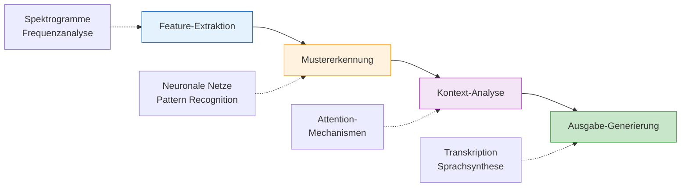

# Multimodal - Audio
{: .no_toc }

> **Audio-Processing mit LLMs: Speech-to-Text, Text-to-Speech und Audio-Analyse**

---

# Inhaltsverzeichnis
{: .no_toc .text-delta }

1. TOC
{:toc}

---


# Technische Grundlagen
Bevor wir in die praktische Anwendung von Audio-KI eintauchen, ist es wichtig, die grundlegenden technischen Konzepte zu verstehen, die hinter diesen Modellen stehen.

## Von der Schallwelle zum digitalen Signal

Audio ist physikalisch betrachtet eine Schallwelle, die durch Druckschwankungen in der Luft entsteht. Um mit Computern verarbeitet zu werden, muss dieser analoge Schall in ein digitales Signal umgewandelt werden:

1. **Sampling (Abtastung)**: Der kontinuierliche Schall wird in regelmäßigen Zeitabständen gemessen. Die **Abtastrate** (Sampling Rate) gibt an, wie viele Messungen pro Sekunde durchgeführt werden. CD-Qualität verwendet z.B. 44.100 Messungen pro Sekunde (44,1 kHz).

2. **Quantisierung**: Jeder gemessene Wert wird in eine Zahl umgewandelt. Die **Bittiefe** bestimmt, wie genau diese Umwandlung ist. 16-Bit-Audio kann 65.536 verschiedene Lautstärkewerte darstellen.


[Audio_Viz](https://editor.p5js.org/ralf.bendig.rb/full/_oMmtCprP)       
[MediaPipe](https://mediapipe-studio.webapps.google.com/studio/demo/audio_classifier)

## Wie funktionieren Audio-KI-Modelle?


### Speech-to-Text (Whisper)
OpenAI's Whisper nutzt eine **Encoder-Decoder-Architektur** mit Transformer-Technologie:

- Der **Encoder** wandelt das Audiosignal in eine kompakte Repräsentation um
- Der **Decoder** übersetzt diese Repräsentation in Text

Whisper wurde mit über 680.000 Stunden mehrsprachiger Audiodaten trainiert, wodurch es verschiedene Sprachen, Akzente und Umgebungsgeräusche verarbeiten kann.

### Text-to-Speech (TTS-1)
TTS-1 verwendet ebenfalls eine komplexe neuronale Netzwerkarchitektur:

1. **Text-Encoder**: Wandelt Text in linguistische Merkmale um
2. **Prosody-Predictor**: Bestimmt Betonung, Rhythmus und Melodie
3. **Vocoder**: Erzeugt aus diesen Informationen naturgetreue Sprachsignale

Diese Komponenten arbeiten zusammen, um Text in natürlich klingende Sprache umzuwandeln, die Emotionen und Betonungen enthält.

## Von der Audiowelle zum Verständnis

Wie "verstehen" KI-Modelle Audioinhalte? Der Prozess umfasst mehrere Schritte:

1. **Feature-Extraktion**: Aus dem Audiosignal werden charakteristische Merkmale extrahiert, z.B. durch Spektrogramme (visuelle Darstellungen der Frequenzanteile über Zeit)
2. **Musterkennung**: Neuronale Netze erkennen Muster in diesen Merkmalen
3. **Kontext-Analyse**: Durch Aufmerksamkeitsmechanismen wird der Kontext berücksichtigt
4. **Ausgabe-Generierung**: Erzeugung der Transkription oder der synthetisierten Sprache



Diese technischen Grundlagen erklären, warum moderne Audio-KI-Modelle so leistungsfähig sind und warum sie in der Lage sind, auch komplexe Audioinhalte zu verarbeiten und zu generieren.


# Herausforderungen und Grenzen
Obwohl moderne Audio-KI-Systeme beeindruckende Ergebnisse erzielen, stoßen sie in bestimmten Situationen an ihre Grenzen. Diese Herausforderungen zu verstehen ist wichtig, um realistische Erwartungen zu setzen und die Qualität der Ergebnisse zu verbessern.

## Herausforderungen bei Speech-to-Text (STT)

### Sprachvariationen
- **Akzente und Dialekte**: Regionale Sprachvarianten können die Erkennungsgenauigkeit erheblich beeinflussen
- **Sprechgeschwindigkeit**: Sehr schnelles oder langsames Sprechen erschwert die korrekte Erkennung
- **Umgangssprache und Slang**: Informelle Ausdrücke werden oft nicht korrekt erkannt

### Umgebungsfaktoren
- **Hintergrundgeräusche**: Lärm, Musik oder andere Gespräche können die Qualität der Transkription beeinträchtigen
- **Halleffekte**: In halligen Räumen aufgenommene Sprache ist schwieriger zu transkribieren
- **Mikrofonqualität**: Niedrige Aufnahmequalität führt zu schlechteren Transkriptionsergebnissen

### Inhaltliche Komplexität
- **Fachbegriffe**: Spezialisierte Terminologie wird oft falsch transkribiert
- **Eigennamen**: Ungewöhnliche Namen werden häufig falsch erkannt
- **Homophone**: Wörter, die gleich klingen aber unterschiedlich geschrieben werden, führen zu Fehlern

### Grenzen bei Text-to-Speech (TTS)

- **Emotionale Nuancen**: Subtile emotionale Ausdrücke sind schwer zu reproduzieren
- **Sprechpausen und Rhythmus**: Natürliches Sprechtempo ist eine Herausforderung
- **Aussprache seltener Wörter**: Ungewöhnliche oder fremdsprachige Begriffe werden oft falsch ausgesprochen
- **Kontextuelle Anpassung**: Die Anpassung an den inhaltlichen Kontext (z.B. Frage vs. Aussage) ist begrenzt

## Strategie zur Verbesserung der Ergebnisse

### Transkriptionen:
1. **Qualität der Aufnahme optimieren**: Ruhige Umgebung, gutes Mikrofon, angemessener Abstand zum Mikrofon
2. **Deutlich sprechen**: Gleichmäßiges Tempo, klare Aussprache
3. **Fachbegriffe bereitstellen**: Bei Bedarf eine Liste spezieller Begriffe vorbereiten

### Sprachsynthese:
1. **Textformatierung anpassen**: Interpunktion für natürliche Pausen nutzen
2. **Aussprache-Hinweise**: Für schwierige Wörter phonetische Schreibweisen verwenden
3. **Stimme passend wählen**: Verschiedene Stimmen für unterschiedliche Inhalte

## Ethische und praktische Grenzen

- **Stimmimitation**: Die Fähigkeit, Stimmen zu imitieren, wirft Fragen bezüglich Identitätsdiebstahl auf
- **Mehrsprachigkeit**: Die Qualität variiert stark zwischen verschiedenen Sprachen
- **Ressourcenverbrauch**: Hochwertige Audio-KI-Modelle benötigen erhebliche Rechenressourcen
- **Datenschutz**: Die Verarbeitung von Audiodaten erfordert besondere Sorgfalt im Umgang mit persönlichen Informationen

Das Bewusstsein für diese Herausforderungen hilft, Audio-KI-Technologien realistisch einzuschätzen und in geeigneten Kontexten effektiv einzusetzen.


# Grundbegriffe für Einsteiger
Bevor wir uns mit der KI-basierten Audioverarbeitung beschäftigen, ist es wichtig, einige grundlegende Konzepte der digitalen Audioverarbeitung zu verstehen.

## Was ist digitales Audio?

Audio besteht physikalisch aus Schallwellen – Druckschwankungen in der Luft, die unser Ohr wahrnimmt. Computer können jedoch nur mit digitalen Daten arbeiten, daher muss Schall für die Verarbeitung in Zahlen umgewandelt werden.

## Der Digitalisierungsprozess

1. **Aufnahme**: Ein Mikrofon wandelt Schallwellen in elektrische Signale um
2. **Analog-Digital-Wandlung**: Diese kontinuierlichen Signale werden in diskrete Zahlenwerte umgewandelt
3. **Speicherung**: Die Zahlenwerte werden als Datei gespeichert
4. **Verarbeitung**: Die gespeicherten Werte können nun durch Programme verarbeitet werden


## Wichtige Audio-Parameter

### Abtastrate (Sampling Rate)
- **Definition**: Anzahl der Messungen pro Sekunde, gemessen in Hertz (Hz)
- **Typische Werte**: 
  - 44.100 Hz (CD-Qualität)
  - 48.000 Hz (Professionelles Audio)
  - 8.000 Hz (Telefonie)
- **Auswirkung**: Höhere Abtastraten können höhere Frequenzen erfassen (gemäß dem Nyquist-Theorem)

### Bittiefe (Bit Depth)
- **Definition**: Anzahl der Bits pro Abtastwert, bestimmt die Anzahl möglicher Lautstärkestufen
- **Typische Werte**:
  - 16 Bit (CD-Qualität, 65.536 Stufen)
  - 24 Bit (Professionelles Audio, über 16 Millionen Stufen)
- **Auswirkung**: Höhere Bittiefe verbessert den Dynamikumfang und reduziert Quantisierungsrauschen

### Kanäle
- **Definition**: Anzahl der gleichzeitig aufgezeichneten Audiospuren
- **Typische Werte**:
  - Mono (1 Kanal)
  - Stereo (2 Kanäle)
  - Surround (5.1, 7.1, etc.)
- **Auswirkung**: Mehr Kanäle ermöglichen räumliches Audio

### Audioformate
- **Unkomprimiert**: WAV, AIFF (verlustfreie Speicherung, große Dateien)
- **Komprimiert verlustbehaftet**: MP3, AAC, OGG (kleinere Dateien, etwas reduzierte Qualität)
- **Komprimiert verlustfrei**: FLAC, ALAC (reduzierte Dateigröße bei voller Qualität)

## Audio-Eigenschaften

### Amplitude
- **Definition**: Die Stärke des Audiosignals, entspricht der wahrgenommenen Lautstärke
- **Messung**: Dezibel (dB)

### Frequenz
- **Definition**: Die Anzahl der Schwingungen pro Sekunde, bestimmt die Tonhöhe
- **Messung**: Hertz (Hz)
- **Menschliches Hören**: Etwa 20 Hz bis 20.000 Hz

### Spektrum
- **Definition**: Die Verteilung der Energie über verschiedene Frequenzen
- **Darstellung**: Spektrogramm (Zeit-Frequenz-Darstellung)

## Audioqualität und KI-Verarbeitung

Die Qualität der Audioeingabe beeinflusst direkt die Ergebnisse der KI-Verarbeitung:

- **Hochwertige Aufnahmen**: 
  - Klare Sprache ohne Hintergrundgeräusche
  - Angemessene Lautstärke (weder zu leise noch übersteuert)
  - Geeignete Abtastrate und Bittiefe

- **Faktoren, die die Qualität beeinflussen**:
  - Mikrofonqualität und -platzierung
  - Akustik des Aufnahmeraums
  - Vermeidung von Übersteuerung und Verzerrung


# Probleme & Hacks Audio-API
## API-Fehler bei OpenAI

**Symptome:**
- Fehlermeldung: "Rate limit exceeded"
- Timeout-Fehler

**Lösungsansätze:**
```python
import openai
import time
import backoff

# Exponential Backoff-Funktion für Wiederholungsversuche
@backoff.on_exception(backoff.expo, 
                     (openai.RateLimitError, openai.APITimeoutError),
                     max_tries=5)
def transcribe_with_retry(file_path):
    with open(file_path, "rb") as audio_file:
        try:
            response = openai.audio.transcriptions.create(
                model="whisper-1",
                file=audio_file
            )
            return response.text
        except Exception as e:
            print(f"Fehler bei der Transkription: {e}")
            # Warten vor dem nächsten Versuch
            time.sleep(2)
            raise e
```

<div style="page-break-after: always;"></div>

## Unnatürliche Aussprache

**Symptome:**
- Falsche Betonung von Wörtern
- Abgehackte Sätze
- Falsche Aussprache von Fachbegriffen

**Lösungen:**
1. **Interpunktion anpassen**
   - Kommas für kurze Pausen einfügen
   - Punkte für längere Pausen verwenden

2. **Aussprache-Hinweise verwenden**
   ```Prompt
   # Beispiel für Aussprache-Hinweise
   text = "Der Patient leidet an Pneumonie (ausgesprochen: noi-mo-nie)."
   
   # Alternative: Phonetische Schreibweise verwenden
   text = "Python kann für verschiedene Aufgaben verwendet werden."
   ```

3. **Satzstruktur vereinfachen**
   - Komplexe, verschachtelte Sätze in kürzere Sätze aufteilen

## Fehlende Emotionalität

**Lösungen:**
1. **Passende Stimme wählen**
   - Verschiedene Stimmen für unterschiedliche Stimmungen testen
   - "Nova" für freundliche Inhalte, "Onyx" für ernstere Themen

2. **Text mit Emotionshinweisen anreichern**
   ```Prompt
   # Emotionale Hinweise im Text
   text = "Wow! Das ist eine fantastische Nachricht!"  # Begeisterung
   
   # Oder durch Beschreibungen
   text = "[begeistert] Das ist eine fantastische Nachricht! [/begeistert]"
   ```
    


---

## Abgrenzung zu verwandten Dokumenten

| Dokument | Frage |
|---|---|
| [Multimodal Bild](./M09_Multimodal_Bild.html) | Welche Parallelen und Unterschiede gibt es zwischen Bild- und Audioverarbeitung? |
| [Modellauswahl](./M19_Modellauswahl.html) | Welche Modelle eignen sich für Audio-Aufgaben überhaupt? |
| [Context Engineering](./M21_Context_Engineering.html) | Wie wird Audio sinnvoll in den Gesamtkontext einer Anwendung eingebettet? |

---

**Version:**    1.1
**Stand:**    Januar 2026
**Kurs:**    Generative KI. Verstehen. Anwenden. Gestalten.
