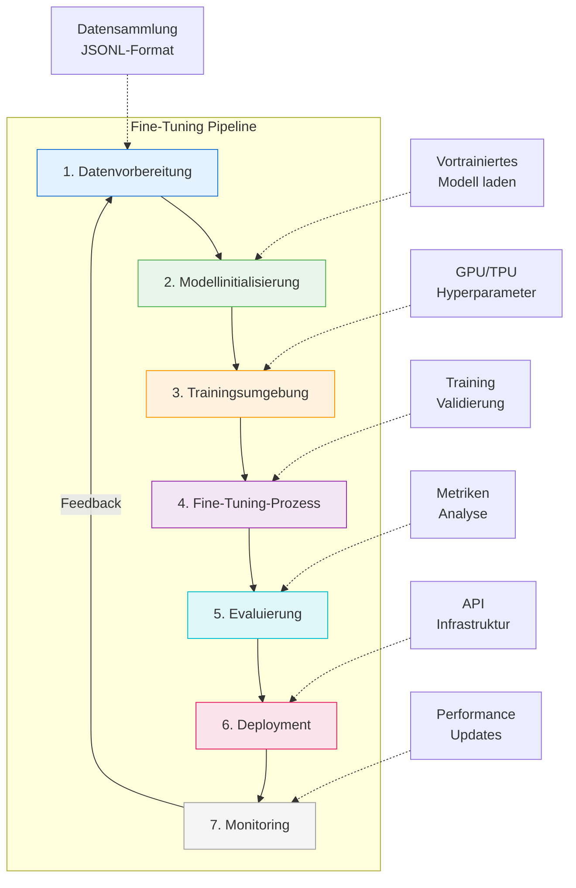

# Fine-Tuning
{: .no_toc }

> **Model Adaptation: Fine-Tuning-Strategien, LoRA und PEFT-Methoden**

---

# Inhaltsverzeichnis
{: .no_toc .text-delta }

1. TOC
{:toc}

---


# Intro
Fine-Tuning ist eine Technik, um ein vortrainiertes Modell auf eine engere Aufgabe oder einen klar umrissenen Datensatz anzupassen. Dabei werden bestehende Modellstrukturen weiterverwendet und gezielt verändert. Das spart im Vergleich zum Training von Grund auf Zeit und Rechenaufwand, ist aber kein Automatismus für bessere Ergebnisse.

In der Praxis lohnt sich Fine-Tuning nur in einem Teil der Fälle. Häufig reicht eine Kombination aus besserem Prompting, sauberem Retrieval und klarer Evaluation aus. Erst wenn sich ein wiederkehrendes Fehlermuster trotz guter Daten, guter Prompts und stabiler Systemarchitektur hält, wird Fine-Tuning zur realistischen Option.

Fine-Tuning ist deshalb am sinnvollsten als Teil eines größeren Optimierungsprozesses zu verstehen. **Evals**, **Prompt Engineering** und **Fine-Tuning** greifen ineinander. Ohne belastbare Evaluation ist kaum erkennbar, ob ein Training wirklich geholfen hat oder nur die Fehler an andere Stellen verschoben wurden.

# Fine-Tuning-Ansätze
## Transfer Learning

- **Grundprinzip**: Ein vortrainiertes Modell wird als Ausgangspunkt verwendet. Die allgemeinen Merkmale der frühen Schichten bleiben erhalten.
    
- **Vorgehen**: Die letzten Schichten werden ersetzt oder angepasst, um spezifische Aufgaben zu lösen.
    
- **Einsatzgebiete**: Bildklassifikation, Verarbeitung natürlicher Sprache (NLP), Computer Vision.
    
- **Vorteile**: Schneller Einstieg, geringer Datenbedarf, bewährte Basismodelle.

- **Vergleich zum Pre-Training**: Während das Pre-Training ein Modell mit großen Datenmengen (oft Billionen von Tokens) trainiert, um allgemeine Sprachmuster zu lernen, benötigt Fine-Tuning nur einen Bruchteil der Daten und Rechenkapazität für eine spezifische Aufgabe.

## Parameter-effizientes Fine-Tuning (PEFT)

- **Prinzip**: Anpassung nur weniger Parameter, während das Basismodell unverändert bleibt.
    
- **Methoden**:
    
    - **LoRA (Low-Rank Adaptation)**: Kompakte Matrizen für effiziente Gewichtsänderung. Reduziert den Rechenaufwand erheblich durch Low-Rank-Approximation der Gewichtsänderungen.
        
    - **QLoRA**: Eine Erweiterung von LoRA, die Gewichtsparameter auf 4-Bit-Präzision quantisiert, wodurch der Speicherbedarf weiter reduziert wird.
    
    - **DoRA (Weight-Decomposed Low-Rank Adaptation)**: Zerlegt Gewichte in Größen- und Richtungskomponenten für präzisere Updates bei gleichbleibender Effizienz.
        
    - **Adapter**: Zusätzliche Module zwischen bestehenden Schichten.
        
    - **Prompt Tuning**: Anpassung durch trainierbare Prompts.
        
- **Vorteile**: Spart Ressourcen, wiederverwendbar, ideal für verschiedene Aufgaben.
    
- **Anwendungsbereich**: Besonders geeignet für ressourcenbeschränkte Umgebungen und für mehrere Spezialisierungsaufgaben mit demselben Basismodell.

## Instruction Fine-Tuning

- **Ziel**: Das Modell lernt, auf klare, natürlichsprachliche Anweisungen zu reagieren.
    
- **Daten**: Input-Output-Paare mit expliziten Instruktionen.
    
- **Anwendungen**: Sprachassistenten, automatisierte Kommunikation, LLM-basierte Tools.

- **Formatbeispiel**: Oft in diesem Format:
  
  ```
  "###Human: $<Input Query>$ ###Assistant: $<Generated Output>$"
  ```

## Supervised Fine-Tuning (SFT)

- **Ansatz**: Feinabstimmung mit handverlesenen, hochwertigen Beispielen.
    
- **Zweck**: Optimierung für bestimmte Anforderungen oder Zielgruppen.
    
- **Typisch kombiniert mit**: Reinforcement Learning from Human Feedback (RLHF).

- **Datenerfordernisse**: Benötigt mindestens 10 Beispiele, empfohlen sind 50-100 qualitativ hochwertige Demonstrationen. Die Qualität der Daten ist entscheidender als die Menge.

- **Prozess**: Besteht aus Datenvorbereitung, Upload der Trainingsdaten, Erstellung eines Fine-Tuning-Jobs und anschließender Evaluierung des Modells.

# Weitere Ansätze OpenAI
## Direct Preference Optimization (DPO)

- **Vorgehen**: Training mit präferierten und abgelehnten Antwortpaaren.
    
- **Nutzen**: Verfeinert Nuancen wie Stil, Tonalität, Ausdruck.

- **Funktionsweise**: Ein effizienterer Weg als RLHF, um Modelle an menschliche Präferenzen anzupassen. Jedes Beispiel im Datensatz enthält einen Prompt, eine bevorzugte Ausgabe und eine nicht-bevorzugte Ausgabe.

- **Beta-Parameter**: Kann zwischen 0 und 2 konfiguriert werden, um zu steuern, wie streng das neue Modell am vorherigen Verhalten festhält versus sich an den neuen Präferenzen orientiert.

## Reinforcement Fine-Tuning (RFT)

- **Prinzip**: Modell wird nicht mit festen Zielantworten, sondern anhand von Bewertungssignalen (Grader) trainiert.
    
- **Vorteile**: Besonders geeignet für komplexe, mehrdeutige Aufgaben.

- **Grader-Konzept**: RFT verwendet Grader, die die Modellantworten bewerten und ein numerisches Signal (zwischen 0 und 1) zurückgeben. Diese können als String-Check, Text-Similarity oder Model-Grader konfiguriert werden.

- **Anwendungsbereich**: Besonders effektiv bei Aufgaben, bei denen Experten in der Domäne sich über die richtigen Antworten einig sind und die Aufgabe eindeutig bewertbar ist.

- **Unterstützung**: Aktuell nur für reasoning-Modelle wie o4-mini verfügbar.

## Vision Fine-Tuning

- **Zweck**: Anpassung von Modellen mit visuellen Eingaben (z. B. Bilder).
    
- **Anwendungen**: Bildklassifikation, visuelle Beschreibungen, Objektlokalisierung.
    
- **Technische Hinweise**: Unterstützt Base64-Bilder oder URLs, max. 10 Bilder pro Beispiel.

- **Besonderheiten**: 
  - Bilder müssen im JPEG-, PNG- oder WEBP-Format vorliegen
  - Maximalgröße pro Bild: 10 MB
  - Bilder mit Menschen, Gesichtern, Kindern oder CAPTCHAs werden aus Datenschutzgründen ausgeschlossen
  - Der Detail-Parameter kann auf "low" gesetzt werden, um Trainingskosten zu reduzieren

## Modell-Distillation

- **Konzept**: Nutzung der Ausgaben eines großen Modells, um ein kleineres Modell zu trainieren, das ähnliche Leistung für eine spezifische Aufgabe erzielt.

- **Vorteile**: Reduziert Kosten und Latenz erheblich, da kleinere Modelle effizienter sind.

- **Prozess**:
  1. Speichern qualitativ hochwertiger Ausgaben eines großen Modells mit dem Parameter `store: true`
  2. Evaluierung der gespeicherten Antworten mit dem großen und kleinen Modell
  3. Auswahl relevanter Antworten als Trainingsdaten für das kleine Modell
  4. Fine-Tuning des kleinen Modells mit diesen Beispielen
  5. Evaluierung des fine-getuned kleineren Modells

- **Anwendungsbereich**: Besonders nützlich, wenn ein spezifischer, begrenzter Aufgabenbereich abgedeckt werden soll.

# Fine-Tuning-Pipeline für LLMs


## Datenvorbereitung
- Datensammlung aus verschiedenen Quellen
- Vorverarbeitung und Formatierung (z.B. JSONL-Format)
- Umgang mit unausgeglichenen Daten (Oversampling, Undersampling)
- Datensatzaufteilung (Training/Validierung/Test)

## Modellinitialisierung
- Auswahl eines geeigneten vortrainierten Modells
- Einrichtung der Umgebung und Installation der Abhängigkeiten
- Laden des Modells in den Speicher

## Trainingsumgebung
- Konfiguration von Hardwareressourcen (GPU/TPU)
- Definition von Hyperparametern (Lernrate, Batch-Größe, Epochen)
- Initialisierung von Optimierern und Verlustfunktionen

## Fine-Tuning-Prozess
- Auswahl der Fine-Tuning-Technik (Voll, PEFT, etc.)
- Durchführung des Trainings mit regelmäßigen Validierungen
- Überwachung von Metriken und Verlustfunktionen

## Evaluierung und Validierung
- Aufsetzen von Evaluierungsmetriken
- Analyse der Trainingsverlaufskurve
- Überwachung und Interpretation der Ergebnisse

## Deployment
- Export des fine-getuned Modells
- Einrichtung der Infrastruktur
- API-Entwicklung für die Modellinteraktion

## Monitoring und Wartung
- Kontinuierliche Überwachung der Modellleistung
- Aktualisierung des LLM-Wissens bei Bedarf
- Wiederholte Feinabstimmung bei veränderter Datenlage

# Schlüsselkomponenten der Modelloptimierung
## Evaluierungen (Evals)

- **Nutzen**: Systematische Tests zur Bewertung von Modellantworten.
    
- **Formate**: Multiple Choice, Klassifikation, Stringvergleich etc.

- **Grader-Typen**:
  - **String-Check-Grader**: Einfache String-Operationen (gleich, ungleich, enthält)
  - **Text-Similarity-Grader**: Bewertung der Ähnlichkeit zwischen Modellantwort und Referenz
  - **Model-Grader**: Nutzung eines separaten Modells zur Bewertung der Ausgaben
  - **Python-Grader**: Ausführung von Python-Code zur Bewertung
  - **Multi-Grader**: Kombination mehrerer Grader für komplexe Bewertungskriterien

- **Integrierter Prozess**: Evals sollten vor dem Fine-Tuning erstellt werden, um eine Baseline zu etablieren und den Fortschritt zu messen.

## Prompt Engineering

- **Ziele**: Maximale Modellleistung ohne Training.
    
- **Methoden**: Klare Instruktionen, Kontextbereitstellung, Few-Shot-Beispiele.

- **Zusammenspiel mit Fine-Tuning**: Prompt Engineering kann Fine-Tuning ergänzen oder in manchen Fällen sogar ersetzen.

- **Beispiel**: Die Prompt-Konstruktion mit relevanten Beispielen (Few-Shot-Learning) kann die Leistung signifikant verbessern, ohne das Modell neu zu trainieren.


Embeddings spielen beim **Fine-Tuning eines Large Language Models (LLMs)** eine zentrale Rolle, da sie den **Ausgangspunkt der Verarbeitung von Eingabedaten** im Modell darstellen. Hier ist eine strukturierte Erklärung ihrer Rolle:


# Embeddings und Fine-Tuning
## Recap: Was sind Embeddings?

**Embeddings** sind **dichte, numerische Vektoren**, die Wörter, Tokens oder ganze Sätze in einem kontinuierlichen Vektorraum repräsentieren. Das Training ordnet **semantisch ähnliche Begriffe nahe beieinander** im Vektorraum an.


## Rolle beim Fine-Tuning eines LLMs

1. **Initiale Repräsentation der Eingabedaten:**
    
    - Bevor Text durch die Transformer-Schichten geht, wird er in Embeddings umgewandelt.
        
    - Diese Embeddings enthalten bereits **viele Informationen über die Bedeutung** der Tokens.
        
2. **Anpassung an die Zielaufgabe:**
    
    - Beim Fine-Tuning werden **nicht nur die oberen Schichten** (z. B. der Decoder oder der Klassifikator), sondern häufig auch die **Embedding-Schicht selbst angepasst**.
        
    - So kann sich das Modell an spezielle Fachterminologie oder Ausdrucksweisen der Zielanwendung gewöhnen.
        
3. **Transferlernen durch vortrainierte Embeddings:**
    
    - Das Modell startet mit **generischen Embeddings** aus dem Pretraining.
        
    - Beim Fine-Tuning lernen die Embeddings, sich besser an die neue Domäne anzupassen (z. B. Jura, Medizin, Technik).
        
4. **Spezialfall: Adapter-Fine-Tuning oder LoRA:**
    
    - In Methoden wie **LoRA** oder **Adapter Layers** werden die Embeddings oft **nicht direkt verändert**, sondern nur zusätzliche Parameter eingeführt.
        
    - Vorteil: Die ursprünglichen Embeddings bleiben erhalten → weniger Overfitting, kleinere Modelle.
        


## Warum sind sie so wichtig?

- Embeddings beeinflussen maßgeblich, **wie der Text semantisch verstanden wird**.
    
- Eine gute Embedding-Anpassung beim Fine-Tuning verbessert die Fähigkeit des Modells, **Aufgabenkontext korrekt zu erfassen** (z. B. bei Named Entity Recognition, Sentiment Analysis, RAG-Systemen usw.).
    


## Fazit

Die Embeddings sind die **Brücke zwischen rohem Text und neuronaler Verarbeitung**. Beim Fine-Tuning werden sie oft (aber nicht immer) mitangepasst, um eine **bessere Domänenanpassung und höhere Genauigkeit** zu erzielen.


# Best Practices
## Datenstrategie

1. **Datenqualität schlägt Datenmenge**
    - Mit 50-100 hochwertigen Beispielen beginnen
    - Realistische Daten aus der Zielanwendung verwenden
    - Sicherstellen, dass die Daten repräsentativ für die Aufgabe sind
    
2. **Vielfältige und realistische Beispiele wählen**
    - Verschiedene Szenarien, Formulierungen und Nuancen abdecken
    - Starke Verzerrungen in den Trainingsdaten vermeiden
    - Auch Randfall-Szenarien berücksichtigen
    
3. **Konsistente Formatierung (z. B. JSONL)**
    - Das korrekte Format für die jeweilige Fine-Tuning-Methode verwenden
    - Sicherstellen, dass jede Zeile ein vollständiges JSON-Objekt enthält
    - Das Datenformat vor dem Training validieren

## Trainingsstrategie

4. **Schrittweises Auftauen von Schichten**
    - Mit dem Training der obersten Schichten beginnen
    - Tiefere Schichten schrittweise auftauen
    - Dies führt zu stabilerem Training und verhindert Overfitting
    
5. **Kleine Lernraten zur Stabilisierung**
    - Lernraten zwischen 1e-4 und 2e-4 für stabile Konvergenz verwenden
    - Ein Lernraten-Schedule mit Warmup und linearem Abfall kann hilfreich sein
    - Mit verschiedenen Batch-Größen experimentieren
    
6. **Regelmäßige Evaluierung und Monitoring**
    - Vor dem Fine-Tuning Evaluierungen (Evals) aufsetzen
    - Trainings- und Validierungsmetriken überwachen
    - Early Stopping implementieren, um Overfitting zu vermeiden

## Technische Exzellenz

7. **Verwendung von Checkpoints und Modellversionierung**
    - Regelmäßig Zwischenstände speichern (alle 5-8 Epochen)
    - Die Leistung verschiedener Checkpoint-Modelle vergleichen
    - Die Versionshistorie beibehalten, um Regressionen zu erkennen
    
8. **Hyperparameter systematisch optimieren**
    - Automatisierte Hyperparameter-Optimierung nutzen (Random Search, Grid Search, Bayesian)
    - Fokus auf Lernrate, Batch-Größe und Epochenanzahl legen
    - Die Ergebnisse verschiedener Konfigurationen dokumentieren
    
9. **Tools wie TensorBoard, W&B, MLflow einsetzen**
    - Trainingsmetriken in Echtzeit visualisieren
    - Experimente und deren Ergebnisse verfolgen
    - Verschiedene Trainingsläufe untereinander vergleichen

## Sicherheit und Effizienz

10. **Datenschutzkonformität beachten**
    - Sensible Daten vor dem Training anonymisieren
    - Rechtliche Anforderungen beim Training mit personenbezogenen Daten beachten
    - Sicherheitsprüfungen für Modelleingaben und -ausgaben implementieren
    
11. **Kosten im Blick behalten (Token-Effizienz)**
    - Den Token-Verbrauch während des Trainings überwachen
    - Prompts für kürzere Ausgaben optimieren, wo möglich
    - Modell-Distillation für häufig genutzte Aufgaben verwenden

## Spezifische Techniken für erweiterte Anwendungen

12. **Multi-Task Learning**
    - Das Modell für mehrere verwandte Aufgaben gleichzeitig trainieren
    - Spezifische Adapter für verschiedene Aufgaben verwenden
    - Bei Bedarf mehrere Adapter für komplexe Anwendungen kombinieren

13. **Modell-Quantisierung**
    - Die Präzision der Modellparameter reduzieren (z.B. von 32-bit auf 8-bit)
    - QLoRA für effizientes Training mit quantisierten Modellen verwenden
    - Die Leistung quantisierter Modelle gründlich testen

14. **Multimodale Integration**
    - Bei Vision Fine-Tuning auf Bildqualität und -größe achten
    - Den `detail`-Parameter nutzen, um Trainingskosten zu optimieren
    - Verschiedene Kombinationen von Text- und Bildeingaben testen

# Herausforderungen & Perspektiven
## Skalierbarkeit

- **Rechnerische Ressourcen**: Fine-Tuning großer Modelle erfordert erhebliche Rechen- und Speicherkapazitäten
- **Memory-Effizienz**: Techniken wie LoRA, QLoRA und Half Fine-Tuning adressieren diese Herausforderungen
- **Zukünftige Entwicklungen**: Co-Design von Hardware und Algorithmen speziell für LLM-Training

## Ethische Überlegungen

- **Bias und Fairness**: Trainingsdaten können Verzerrungen enthalten, die sich auf das Modell übertragen
- **Datenschutz**: Umgang mit sensiblen oder proprietären Daten während des Fine-Tunings
- **Transparenz und Nachvollziehbarkeit**: Dokumentation des Fine-Tuning-Prozesses und seiner Auswirkungen

## Integration mit neuen Technologien

- **Internet of Things (IoT)**: LLMs können IoT-Daten in Echtzeit analysieren und Entscheidungen optimieren
- **Edge Computing**: Fine-Tuned Modelle können direkt auf Edge-Geräten eingesetzt werden
- **Federated Learning**: Training über verteilte Datenquellen ohne zentrale Datenspeicherung

# Fazit
> [!NOTE] Fazit<br>
> Fine-Tuning ist mehr als nur eine technische Maßnahme – es ist ein strategischer Hebel zur Anpassung von KI-Systemen an konkrete Anforderungen, Zielgruppen und Kontexte. Die Kombination aus fundierter Datenbasis, passenden Methoden und iterativer Evaluation bildet das Fundament für erfolgreiche KI-Projekte.
> Mit Plattformen wie OpenAI lassen sich diese Prozesse effizient gestalten – von der Vorbereitung über das Training bis zur Bewertung. Erweiterte Verfahren wie DPO, RFT und Vision Fine-Tuning ermöglichen zusätzlich eine feinkörnige Kontrolle und Weiterentwicklung leistungsfähiger Modelle.
> Die siebenstufige Fine-Tuning-Pipeline bietet einen strukturierten Ansatz vom Datenmanagement bis zur kontinuierlichen Überwachung, während parameter-effiziente Methoden die Ressourcennutzung optimieren. Durch den gezielten Einsatz dieser Techniken können Entwickler leistungsfähige KI-Lösungen erstellen, die genau auf ihre spezifischen Anforderungen zugeschnitten sind.
---


---

## Abgrenzung zu verwandten Dokumenten

| Dokument | Frage |
|---|---|
| [Prompt Engineering](./Prompt_Engineering.html) | Was lässt sich noch über bessere Anweisungen statt über Training lösen? |
| [RAG-Konzepte](./RAG_Konzepte.html) | Wann hilft externer Wissenszugriff mehr als Modellanpassung? |
| [Modellauswahl](./M19_Modellauswahl.html) | Wie wird entschieden, ob ein anderes Basismodell genügt? |

---

**Version:**    1.1<br>
**Stand:**    Januar 2026<br>
**Kurs:** Generative KI. Verstehen. Anwenden. Gestalten.
