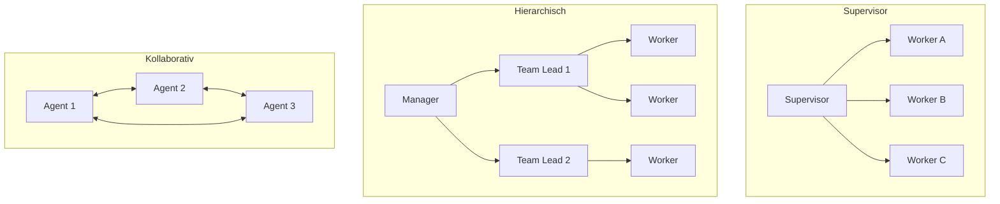
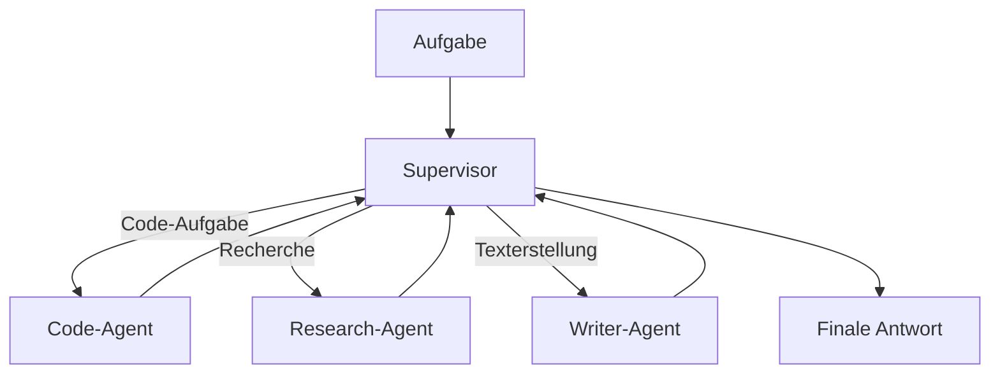
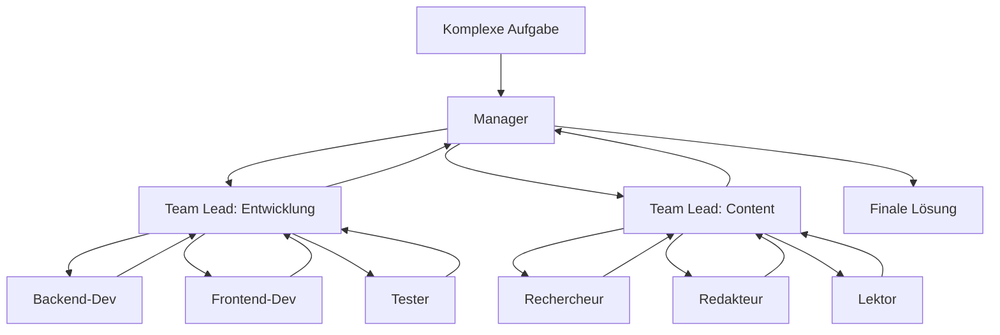
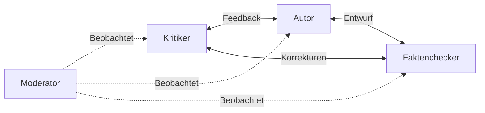
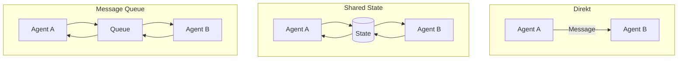
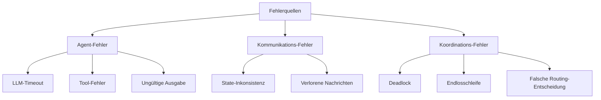
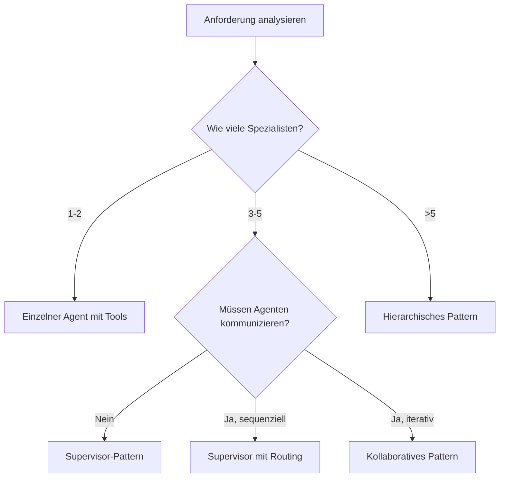

# Multi-Agent-Systeme
{: .no_toc }

> **Zusammenarbeit und Koordination mehrerer spezialisierter KI-Agenten**

---

# Inhaltsverzeichnis
{: .no_toc .text-delta }

1. TOC
{:toc}

---

## 1 Überblick

Ein einzelner Agent stößt bei komplexen Aufgaben schnell an Grenzen. Multi-Agent-Systeme (MAS) lösen dieses Problem durch **Arbeitsteilung**: Mehrere spezialisierte Agenten übernehmen jeweils Teilaufgaben und koordinieren sich untereinander.

**Kernidee:** Statt einem "Alleskönner" arbeiten mehrere "Spezialisten" zusammen – ähnlich wie in einem Team aus Rechercheur, Analyst und Redakteur.

| Aspekt              | Einzelner Agent                  | Multi-Agent-System          |
| ------------------- | -------------------------------- | --------------------------- |
| **Komplexität**     | Begrenzt durch Kontextfenster    | Skalierbar durch Verteilung |
| **Spezialisierung** | Generalist                       | Fokussierte Experten        |
| **Fehlertoleranz**  | Single Point of Failure          | Redundanz möglich           |
| **Wartbarkeit**     | Ein großer Prompt                | Modulare Komponenten        |
| **Debugging**       | Unübersichtlich bei vielen Tools | Klare Verantwortlichkeiten  |

**Typische Anwendungsfälle:**
- Content-Pipelines (Recherche → Schreiben → Review)
- Komplexe Analysen (Datensammlung → Verarbeitung → Visualisierung)
- Autonome Workflows mit Qualitätskontrolle
- Simulationen und Debatten zwischen "Experten"

---

## 2 Koordinationsmuster

Drei grundlegende Muster haben sich für die Zusammenarbeit von Agenten etabliert:



| Muster           | Struktur        | Koordination | Komplexität |
| ---------------- | --------------- | ------------ | ----------- |
| **Supervisor**   | Flach (1 Ebene) | Zentral      | ⭐⭐          |
| **Hierarchisch** | Mehrere Ebenen  | Kaskadierend | ⭐⭐⭐         |
| **Kollaborativ** | Peer-to-Peer    | Dezentral    | ⭐⭐⭐⭐        |

---

## 3 Supervisor-Pattern

Das Supervisor-Pattern ist der Einstiegspunkt für Multi-Agent-Systeme. Ein **Supervisor** analysiert Aufgaben und delegiert sie an spezialisierte **Worker-Agenten**.



### 3.1 Funktionsweise

1. **Supervisor** erhält die Aufgabe und analysiert sie
2. **Routing-Entscheidung**: Welcher Worker ist zuständig?
3. **Delegation**: Aufgabe wird an Worker übergeben
4. **Ergebnis-Sammlung**: Worker liefert Teilergebnis zurück
5. **Iteration**: Bei Bedarf weitere Worker einbeziehen
6. **Synthese**: Supervisor erstellt finale Antwort

### 3.2 Implementierung mit LangGraph

```python
from typing import TypedDict, Annotated, Literal
from langgraph.graph import StateGraph, START, END
from langgraph.graph.message import add_messages
from langgraph.types import Command
from langchain.chat_models import init_chat_model

# State-Definition
class TeamState(TypedDict):
    messages: Annotated[list, add_messages]
    next_worker: str
    task_complete: bool

# LLM initialisieren
llm = init_chat_model("gpt-4o-mini", model_provider="openai", temperature=0.0)

# Supervisor-Node
def supervisor_node(state: TeamState) -> Command:
    """Analysiert Aufgabe und routet zum passenden Worker."""
    messages = state["messages"]
    last_message = messages[-1].content.lower()
    
    # Einfache Routing-Logik (in Produktion: LLM-basiert)
    if "code" in last_message or "programmier" in last_message:
        return Command(goto="code_agent")
    elif "recherche" in last_message or "suche" in last_message:
        return Command(goto="research_agent")
    elif "schreib" in last_message or "text" in last_message:
        return Command(goto="writer_agent")
    else:
        return Command(goto="writer_agent")  # Default

# Worker-Nodes
def code_agent(state: TeamState) -> TeamState:
    """Spezialisiert auf Code-Aufgaben."""
    response = llm.invoke([
        {"role": "system", "content": "Du bist ein Code-Experte. Schreibe sauberen, dokumentierten Code."},
        *state["messages"]
    ])
    return {"messages": [response], "task_complete": True}

def research_agent(state: TeamState) -> TeamState:
    """Spezialisiert auf Recherche."""
    response = llm.invoke([
        {"role": "system", "content": "Du bist ein Recherche-Experte. Sammle und strukturiere Informationen."},
        *state["messages"]
    ])
    return {"messages": [response], "task_complete": True}

def writer_agent(state: TeamState) -> TeamState:
    """Spezialisiert auf Texterstellung."""
    response = llm.invoke([
        {"role": "system", "content": "Du bist ein Redakteur. Schreibe klare, verständliche Texte."},
        *state["messages"]
    ])
    return {"messages": [response], "task_complete": True}

# Graph aufbauen
graph = StateGraph(TeamState)

graph.add_node("supervisor", supervisor_node)
graph.add_node("code_agent", code_agent)
graph.add_node("research_agent", research_agent)
graph.add_node("writer_agent", writer_agent)

graph.add_edge(START, "supervisor")
graph.add_edge("code_agent", END)
graph.add_edge("research_agent", END)
graph.add_edge("writer_agent", END)

team = graph.compile()
```

### 3.3 Vorteile und Grenzen

| Vorteile | Grenzen |
|----------|---------|
| Einfach zu verstehen und implementieren | Supervisor als Bottleneck |
| Klare Verantwortlichkeiten | Keine direkte Worker-Kommunikation |
| Gut für parallele Aufgaben | Begrenzte Skalierbarkeit |

---

## 4 Hierarchisches Pattern

Bei sehr komplexen Aufgaben reicht eine Ebene nicht aus. Das hierarchische Pattern führt **Team Leads** ein, die selbst wieder Teams koordinieren.



### 4.1 Funktionsweise

1. **Manager** zerlegt Aufgabe in Teilbereiche
2. **Team Leads** übernehmen Teilbereiche
3. **Worker** bearbeiten konkrete Teilaufgaben
4. **Ergebnisse** fließen die Hierarchie hinauf
5. **Manager** integriert alle Teilergebnisse

### 4.2 Wann hierarchisch?

| Kriterium | Supervisor reicht | Hierarchie nötig |
|-----------|-------------------|------------------|
| Anzahl Spezialisten | < 5 | > 5 |
| Aufgaben-Komplexität | Einzelne Schritte | Verschachtelte Teilaufgaben |
| Domänen | Eine Domäne | Mehrere Fachbereiche |
| Abhängigkeiten | Unabhängig | Stark verknüpft |

### 4.3 Implementierungshinweis

Hierarchische Systeme werden als **verschachtelte Subgraphs** in LangGraph umgesetzt:

```python
# Team Lead als eigener Subgraph
def create_dev_team():
    team = StateGraph(TeamState)
    team.add_node("lead", dev_lead_node)
    team.add_node("backend", backend_node)
    team.add_node("frontend", frontend_node)
    # ... Edges definieren
    return team.compile()

# Manager-Graph bindet Subgraphs ein
manager_graph = StateGraph(ManagerState)
manager_graph.add_node("dev_team", create_dev_team())
manager_graph.add_node("content_team", create_content_team())
```

---

## 5 Kollaboratives Pattern

Im kollaborativen Pattern kommunizieren Agenten **direkt miteinander**, ohne zentrale Koordination. Dies ermöglicht emergentes Verhalten und komplexe Interaktionen.



### 5.1 Typische Szenarien

**Debatte/Diskussion:**
- Mehrere "Experten" diskutieren ein Thema
- Unterschiedliche Perspektiven werden eingebracht
- Konsens oder beste Lösung wird ermittelt

**Iterative Verbesserung:**
- Autor erstellt Entwurf
- Kritiker gibt Feedback
- Autor überarbeitet
- Zyklus bis Qualitätsziel erreicht

**Peer Review:**
- Agent A prüft Arbeit von Agent B
- Agent B prüft Arbeit von Agent C
- Gegenseitige Qualitätskontrolle

### 5.2 Implementierung: Autor-Kritiker-Zyklus

```python
from typing import TypedDict, Annotated
from langgraph.graph import StateGraph, START, END
from langgraph.graph.message import add_messages

class ReviewState(TypedDict):
    messages: Annotated[list, add_messages]
    draft: str
    feedback: str
    revision_count: int
    approved: bool

def author_node(state: ReviewState) -> ReviewState:
    """Erstellt oder überarbeitet den Text."""
    if state["revision_count"] == 0:
        # Erster Entwurf
        prompt = f"Schreibe einen Artikel über: {state['messages'][-1].content}"
    else:
        # Überarbeitung basierend auf Feedback
        prompt = f"Überarbeite den Text basierend auf diesem Feedback:\n{state['feedback']}\n\nAktueller Text:\n{state['draft']}"
    
    response = llm.invoke([{"role": "user", "content": prompt}])
    return {
        "draft": response.content,
        "revision_count": state["revision_count"] + 1
    }

def critic_node(state: ReviewState) -> ReviewState:
    """Bewertet den Text und gibt Feedback."""
    prompt = f"""Bewerte diesen Text kritisch:

{state['draft']}

Antworte im Format:
APPROVED: ja/nein
FEEDBACK: [Dein detailliertes Feedback]"""
    
    response = llm.invoke([{"role": "user", "content": prompt}])
    content = response.content
    
    approved = "APPROVED: ja" in content.lower()
    feedback = content.split("FEEDBACK:")[-1].strip() if "FEEDBACK:" in content else content
    
    return {"feedback": feedback, "approved": approved}

def should_continue(state: ReviewState) -> str:
    """Entscheidet, ob weitere Überarbeitung nötig ist."""
    if state["approved"]:
        return END
    if state["revision_count"] >= 3:  # Maximum 3 Revisionen
        return END
    return "author"

# Graph aufbauen
graph = StateGraph(ReviewState)
graph.add_node("author", author_node)
graph.add_node("critic", critic_node)

graph.add_edge(START, "author")
graph.add_edge("author", "critic")
graph.add_conditional_edges("critic", should_continue, {"author": "author", END: END})

review_system = graph.compile()
```

### 5.3 Herausforderungen

| Herausforderung | Lösungsansatz |
|-----------------|---------------|
| Endlosschleifen | Maximale Iterationen setzen |
| Inkonsistente Kommunikation | Strukturierte Nachrichtenformate |
| Konvergenz-Probleme | Moderator-Agent einführen |
| Hohe Token-Kosten | Zusammenfassungen zwischen Runden |

---

## 6 Kommunikation zwischen Agenten

Die Art der Kommunikation bestimmt maßgeblich die Effektivität eines Multi-Agent-Systems.

### 6.1 Kommunikationsformen



| Form | Beschreibung | Einsatz |
|------|-------------|---------|
| **Direkt** | Agent ruft anderen Agent auf | Einfache Delegation |
| **Shared State** | Gemeinsamer Zustand (LangGraph) | Standard in LangGraph |
| **Message Queue** | Asynchrone Nachrichten | Komplexe Systeme |

### 6.2 Strukturierte Übergaben

Für zuverlässige Kommunikation sollten Übergaben strukturiert erfolgen:

```python
from pydantic import BaseModel, Field

class TaskHandoff(BaseModel):
    """Strukturierte Aufgabenübergabe zwischen Agenten."""
    task_description: str = Field(description="Was soll erledigt werden?")
    context: str = Field(description="Relevanter Kontext")
    expected_output: str = Field(description="Erwartetes Ergebnisformat")
    priority: int = Field(description="Priorität 1-5", ge=1, le=5)

class TaskResult(BaseModel):
    """Strukturiertes Ergebnis eines Agenten."""
    status: str = Field(description="success | partial | failed")
    result: str = Field(description="Das eigentliche Ergebnis")
    confidence: float = Field(description="Konfidenz 0.0-1.0", ge=0.0, le=1.0)
    notes: str = Field(description="Zusätzliche Anmerkungen")
```

---

## 7 State-Management

Der gemeinsame State ist das Rückgrat eines Multi-Agent-Systems in LangGraph.

### 7.1 State-Design-Prinzipien

```python
from typing import TypedDict, Annotated, Optional
from langgraph.graph.message import add_messages

class MultiAgentState(TypedDict):
    # Kommunikation
    messages: Annotated[list, add_messages]  # Chat-Verlauf
    
    # Aufgaben-Tracking
    current_task: str                         # Aktuelle Aufgabe
    completed_tasks: list[str]                # Erledigte Aufgaben
    
    # Agenten-spezifisch
    research_results: Optional[str]           # Vom Research-Agent
    draft_content: Optional[str]              # Vom Writer-Agent
    code_output: Optional[str]                # Vom Code-Agent
    
    # Koordination
    next_agent: str                           # Nächster Agent
    iteration_count: int                      # Anzahl Durchläufe
    final_output: Optional[str]               # Endergebnis
```

### 7.2 Best Practices

| Prinzip | Beschreibung |
|---------|-------------|
| **Minimaler State** | Nur speichern, was andere Agenten brauchen |
| **Klare Namensgebung** | `research_results` statt `data` |
| **Optionale Felder** | `Optional[str]` für Agent-spezifische Daten |
| **Reducer verwenden** | `add_messages` für Listen-Aggregation |
| **Keine PII** | Sensible Daten nicht im State |

---

## 8 Fehlerbehandlung

In Multi-Agent-Systemen können Fehler an vielen Stellen auftreten. Robuste Fehlerbehandlung ist essenziell.

### 8.1 Fehlerquellen



### 8.2 Strategien

**Retry mit Backoff:**
```python
from tenacity import retry, stop_after_attempt, wait_exponential

@retry(stop=stop_after_attempt(3), wait=wait_exponential(min=1, max=10))
def resilient_agent_call(state):
    return agent_node(state)
```

**Fallback-Agent:**
```python
def safe_routing(state: TeamState) -> str:
    try:
        return determine_next_agent(state)
    except Exception:
        return "fallback_agent"  # Generalist als Backup
```

**Iterationslimit:**
```python
def should_continue(state: TeamState) -> str:
    if state["iteration_count"] >= 10:
        return "timeout_handler"  # Graceful Degradation
    return "next_agent"
```

---

## 9 Entscheidungshilfe

Die Wahl des richtigen Patterns hängt von den Anforderungen ab:



| Situation | Empfohlenes Pattern |
|-----------|---------------------|
| Einfache Aufgabenteilung (Recherche + Schreiben) | Supervisor |
| Qualitätssicherung mit Feedback-Schleifen | Kollaborativ |
| Großes Team mit Fachbereichen | Hierarchisch |
| Debatte/Diskussion simulieren | Kollaborativ |
| Content-Pipeline mit Stages | Supervisor |
| Komplexe Software-Entwicklung | Hierarchisch |

---

## 10 Zusammenfassung

Multi-Agent-Systeme ermöglichen die Lösung komplexer Aufgaben durch spezialisierte, kooperierende Agenten.

**Kernkonzepte:**

| Konzept | Beschreibung |
|---------|-------------|
| **Supervisor** | Zentraler Koordinator verteilt Aufgaben |
| **Hierarchisch** | Mehrere Ebenen für sehr komplexe Systeme |
| **Kollaborativ** | Direkte Agent-zu-Agent-Kommunikation |
| **Shared State** | Gemeinsamer Zustand in LangGraph |
| **Strukturierte Übergaben** | Pydantic-Modelle für klare Schnittstellen |

**Design-Prinzipien:**

- Klare Verantwortlichkeiten pro Agent
- Minimaler, gut strukturierter State
- Robuste Fehlerbehandlung
- Iterationslimits gegen Endlosschleifen
- Strukturierte Kommunikationsformate

**Nächste Schritte im Kurs:**

Die praktische Umsetzung erfolgt mit LangGraph. Dort werden diese Patterns Schritt für Schritt implementiert – vom einfachen Supervisor bis zum kollaborativen Review-System.

---

**Version:** 1.0  
**Stand:** November 2025  
**Kurs:** Generative KI. Verstehen. Anwenden. Gestalten.
