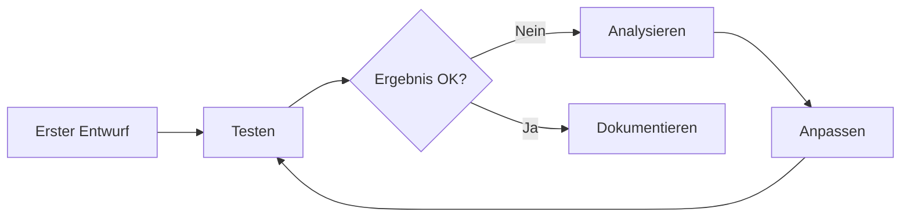

# Prompt Engineering
{: .no_toc }

> **Strategien für effektive Prompts in KI-Agenten-Systemen**

---

# Inhaltsverzeichnis
{: .no_toc .text-delta }

1. TOC
{:toc}

---

## 1 Überblick

Ein Prompt ist die Schnittstelle zwischen Mensch und Sprachmodell. Die Qualität der Antwort hängt maßgeblich davon ab, **wie** eine Aufgabe formuliert wird – nicht nur **was** gefragt wird.

Für KI-Agenten ist Prompt Engineering besonders relevant:

| Kontext | Bedeutung |
|---------|-----------|
| **System-Prompts** | Definieren Rolle, Fähigkeiten und Grenzen des Agenten |
| **Tool-Beschreibungen** | Bestimmen, wann und wie ein Agent Werkzeuge einsetzt |
| **Reasoning-Prompts** | Steuern den Denkprozess bei komplexen Aufgaben |
| **Output-Formatierung** | Garantieren strukturierte, verarbeitbare Antworten |

**Kernprinzip:** Ein gut formulierter Prompt reduziert Fehler, verbessert die Konsistenz und macht das Verhalten eines Agenten vorhersagbar.

---

## 2 Grundlegende Prompt-Strukturen

Effektive Prompts folgen einer klaren Struktur. Drei Grundmuster haben sich etabliert.

### 2.1 Zero-Shot Prompting

Das Modell erhält eine Aufgabe ohne Beispiele und löst sie basierend auf seinem Vorwissen.

```python
from langchain_core.prompts import ChatPromptTemplate

# Zero-Shot: Keine Beispiele, direkte Aufgabe
prompt = ChatPromptTemplate.from_messages([
    ("system", "Du bist ein hilfreicher Assistent."),
    ("human", "Klassifiziere die folgende E-Mail als 'dringend' oder 'normal': {email}")
])
```

**Geeignet für:**
- Einfache, eindeutige Aufgaben
- Allgemeinwissen-Fragen
- Standardformatierungen

### 2.2 Few-Shot Prompting

Das Modell erhält Beispiele, die das gewünschte Verhalten demonstrieren.

```python
few_shot_prompt = ChatPromptTemplate.from_messages([
    ("system", "Klassifiziere E-Mails nach Dringlichkeit."),
    ("human", "Betreff: Server ausgefallen"),
    ("assistant", "dringend"),
    ("human", "Betreff: Quartalsbericht verfügbar"),
    ("assistant", "normal"),
    ("human", "Betreff: {email_subject}")
])
```

**Geeignet für:**
- Spezifische Formatvorgaben
- Domänenspezifische Klassifikationen
- Konsistente Ausgabestrukturen

### 2.3 Chain-of-Thought (CoT)

Das Modell wird angewiesen, seinen Denkprozess schrittweise darzulegen.

```python
cot_prompt = ChatPromptTemplate.from_template(
    """Löse die folgende Aufgabe Schritt für Schritt.
    
Aufgabe: {aufgabe}

Denke laut nach:
1. Was ist gegeben?
2. Was wird gesucht?
3. Welche Schritte sind nötig?
4. Führe jeden Schritt aus.
5. Formuliere die Antwort.

Lösung:"""
)
```

**Geeignet für:**
- Mathematische Probleme
- Logische Schlussfolgerungen
- Mehrstufige Analysen

---

## 3 System-Prompts für Agenten

Der System-Prompt definiert die Identität und das Verhalten eines Agenten. Er ist der wichtigste Hebel für konsistentes Agentenverhalten.

### 3.1 Struktur eines effektiven System-Prompts

Ein guter System-Prompt beantwortet vier Fragen:

| Frage | Inhalt |
|-------|--------|
| **Wer?** | Rolle und Expertise des Agenten |
| **Was?** | Aufgabenbereich und Fähigkeiten |
| **Wie?** | Verhaltensregeln und Tonalität |
| **Was nicht?** | Explizite Einschränkungen |

### 3.2 Beispiel: Vollständiger Agent-System-Prompt

```python
system_prompt = """Du bist ein technischer Support-Agent für ein Software-Unternehmen.

ROLLE:
- Experte für die Produkte X, Y und Z
- Erste Anlaufstelle für technische Fragen
- Eskalation an Menschen bei komplexen Fällen

FÄHIGKEITEN:
- Zugriff auf die Wissensdatenbank (Tool: search_knowledge)
- Ticket-Erstellung im Helpdesk (Tool: create_ticket)
- Prüfung des Kundenstatus (Tool: check_customer)

VERHALTENSREGELN:
- Antworte präzise und lösungsorientiert
- Frage nach, wenn Informationen fehlen
- Bestätige Verständnis bei komplexen Problemen
- Verwende technische Begriffe nur mit Erklärung

EINSCHRÄNKUNGEN:
- Keine Preisauskünfte oder Vertragsänderungen
- Keine Zusagen ohne Rücksprache mit dem Vertrieb
- Bei Sicherheitsfragen immer an Security-Team eskalieren
"""
```

### 3.3 Typische Fehler bei System-Prompts

| Fehler | Problem | Lösung |
|--------|---------|--------|
| Zu vage | Agent verhält sich inkonsistent | Konkrete Beispiele und Regeln |
| Zu lang | Wichtige Anweisungen gehen unter | Priorisieren, strukturieren |
| Widersprüchlich | Agent "halluziniert" Kompromisse | Eindeutige Hierarchie |
| Keine Grenzen | Agent überschreitet Kompetenz | Explizite Einschränkungen |

---

## 4 Tool-Beschreibungen optimieren

Die Beschreibung eines Tools bestimmt, ob und wann ein Agent es korrekt einsetzt. Eine präzise Beschreibung ist entscheidender als der Code dahinter.

### 4.1 Anatomie einer guten Tool-Beschreibung

```python
from langchain_core.tools import tool

@tool
def search_knowledge(query: str, max_results: int = 5) -> str:
    """Durchsucht die interne Wissensdatenbank nach relevanten Artikeln.
    
    WANN VERWENDEN:
    - Bei Fragen zu Produktfunktionen
    - Bei Fehlermeldungen und deren Lösungen
    - Bei How-To-Anfragen
    
    WANN NICHT VERWENDEN:
    - Bei Fragen zu Preisen oder Verträgen
    - Bei persönlichen Kundendaten
    - Wenn die Antwort bereits bekannt ist
    
    Args:
        query: Suchbegriff oder Frage in natürlicher Sprache
        max_results: Maximale Anzahl zurückgegebener Artikel (1-10)
    
    Returns:
        Formatierte Liste relevanter Wissensartikel mit Titel und Zusammenfassung
    """
    # Implementation...
```

### 4.2 Checkliste für Tool-Beschreibungen

- [ ] **Zweck klar benannt** – Was macht das Tool?
- [ ] **Anwendungsfälle** – Wann soll es verwendet werden?
- [ ] **Gegenanzeigen** – Wann soll es NICHT verwendet werden?
- [ ] **Parameter erklärt** – Was bedeuten die Eingaben?
- [ ] **Rückgabewert beschrieben** – Was kommt zurück?

---

## 5 Ausgabeformatierung

Strukturierte Ausgaben machen Agentenantworten verarbeitbar und konsistent.

### 5.1 Explizite Formatvorgaben

```python
format_prompt = ChatPromptTemplate.from_template(
    """Analysiere den folgenden Text und extrahiere die Kernaussagen.

Text: {text}

Antworte EXAKT in diesem Format:
HAUPTTHEMA: [Ein Satz]
KERNAUSSAGEN:
- [Punkt 1]
- [Punkt 2]
- [Punkt 3]
STIMMUNG: [positiv/neutral/negativ]
KONFIDENZ: [hoch/mittel/niedrig]
"""
)
```

### 5.2 Strukturierte Ausgaben mit Pydantic

Für maschinelle Weiterverarbeitung bietet LangChain typsichere Ausgaben:

```python
from pydantic import BaseModel, Field

class Analyse(BaseModel):
    hauptthema: str = Field(description="Zentrales Thema in einem Satz")
    kernaussagen: list[str] = Field(description="Liste der wichtigsten Punkte")
    stimmung: str = Field(description="positiv, neutral oder negativ")
    konfidenz: float = Field(description="Sicherheit der Analyse (0.0-1.0)")

# LLM mit strukturierter Ausgabe
structured_llm = llm.with_structured_output(Analyse)
result = structured_llm.invoke("Analysiere: " + text)

# result ist ein typisiertes Analyse-Objekt
print(result.hauptthema)
print(result.konfidenz)
```

---

## 6 Fortgeschrittene Strategien

### 6.1 Role-Prompting

Die Zuweisung einer spezifischen Rolle verbessert domänenspezifische Antworten.

```python
role_prompts = {
    "jurist": "Du bist ein erfahrener Rechtsanwalt mit Spezialisierung auf IT-Recht.",
    "mediziner": "Du bist ein Facharzt für Innere Medizin mit 20 Jahren Berufserfahrung.",
    "entwickler": "Du bist ein Senior Software Engineer mit Expertise in Python und Cloud-Architekturen."
}

prompt = ChatPromptTemplate.from_messages([
    ("system", role_prompts["entwickler"]),
    ("human", "{frage}")
])
```

### 6.2 Self-Consistency

Mehrere Antworten generieren und die häufigste oder konsistenteste wählen.

```python
def self_consistent_answer(question: str, n: int = 3) -> str:
    """Generiert mehrere Antworten und wählt die konsistenteste."""
    responses = []
    for _ in range(n):
        response = llm.invoke(question)
        responses.append(response.content)
    
    # Häufigste Antwort oder Zusammenfassung
    return aggregate_responses(responses)
```

### 6.3 Retrieval-Augmented Prompting

Kontext aus externen Quellen in den Prompt integrieren:

```python
rag_prompt = ChatPromptTemplate.from_template(
    """Beantworte die Frage basierend auf dem bereitgestellten Kontext.
Wenn die Antwort nicht im Kontext steht, sage das ehrlich.

KONTEXT:
{context}

FRAGE: {question}

ANTWORT:"""
)
```

---

## 7 Best Practices

### 7.1 Die CLEAR-Methode

| Buchstabe | Prinzip | Umsetzung |
|-----------|---------|-----------|
| **C** | Concise | Präzise formulieren, Füllwörter vermeiden |
| **L** | Logical | Logische Struktur, klare Reihenfolge |
| **E** | Explicit | Erwartungen explizit benennen |
| **A** | Adaptive | An Aufgabe und Modell anpassen |
| **R** | Reproducible | Konsistente Ergebnisse ermöglichen |

### 7.2 Iteratives Prompt-Design



**Empfohlener Workflow:**

1. **Baseline erstellen** – Einfachster funktionierender Prompt
2. **Schwachstellen identifizieren** – Wo versagt der Prompt?
3. **Gezielt verbessern** – Eine Änderung pro Iteration
4. **Testen mit Varianten** – Verschiedene Eingaben prüfen
5. **Dokumentieren** – Warum funktioniert diese Version?

### 7.3 Prompt-Versionierung

```python
PROMPTS = {
    "classify_email_v1": "Klassifiziere als dringend/normal: {email}",
    "classify_email_v2": """Klassifiziere die E-Mail:
- dringend: Systemausfälle, Sicherheitsprobleme, Deadlines < 24h
- normal: Alle anderen Anfragen

E-Mail: {email}
Klassifikation:""",
}

# In Produktion: Version tracken
current_version = "classify_email_v2"
```

---

## 8 Häufige Fehler und Lösungen

### 8.1 Fehler: Ambige Anweisungen

**Problem:**
```python
# Vage und mehrdeutig
prompt = "Fasse das zusammen: {text}"
```

**Lösung:**
```python
# Präzise und eindeutig
prompt = """Erstelle eine Zusammenfassung in 3 Stichpunkten.
Jeder Punkt maximal 15 Wörter.
Fokus auf Handlungsempfehlungen.

Text: {text}

Zusammenfassung:"""
```

### 8.2 Fehler: Fehlende Beispiele bei komplexen Formaten

**Problem:**
```python
# Erwartet spezifisches Format ohne Beispiel
prompt = "Extrahiere Entitäten aus: {text}"
```

**Lösung:**
```python
# Mit Beispiel (Few-Shot)
prompt = """Extrahiere Entitäten im Format: ENTITÄT (TYP)

Beispiel:
Text: "Angela Merkel besuchte gestern Berlin."
Entitäten: Angela Merkel (PERSON), Berlin (ORT), gestern (ZEIT)

Text: {text}
Entitäten:"""
```

### 8.3 Fehler: Widersprüchliche Anweisungen

**Problem:**
```python
# Widerspruch: kurz UND detailliert
prompt = "Erkläre kurz und detailliert: {thema}"
```

**Lösung:**
```python
# Klare Priorisierung
prompt = """Erkläre das Thema in zwei Teilen:
1. KURZFASSUNG (1-2 Sätze): Kernaussage
2. DETAILS (3-5 Sätze): Wichtige Aspekte

Thema: {thema}"""
```

---

## 9 Zusammenfassung

Effektives Prompt Engineering basiert auf drei Säulen:

| Säule | Kernaspekt |
|-------|------------|
| **Klarheit** | Eindeutige, strukturierte Anweisungen |
| **Kontext** | Relevante Informationen und Beispiele |
| **Kontrolle** | Explizite Formatvorgaben und Grenzen |

**Für KI-Agenten besonders wichtig:**

- **System-Prompts** definieren das Gesamtverhalten
- **Tool-Beschreibungen** steuern die Werkzeugnutzung
- **Strukturierte Ausgaben** ermöglichen Weiterverarbeitung
- **Iteratives Testen** führt zu robusten Prompts

Im weiteren Kursverlauf werden diese Strategien praktisch in LangChain-Agents und LangGraph-Workflows angewendet.

---

**Version:** 1.0  
**Stand:** November 2025  
**Kurs:** Generative KI. Verstehen. Anwenden. Gestalten.
