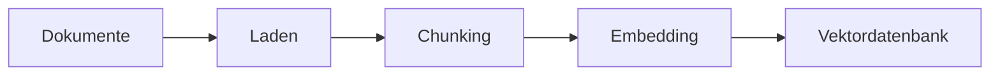
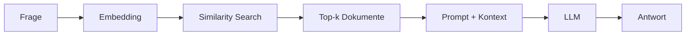

# RAG-Konzepte
{: .no_toc }

> **Retrieval Augmented Generation im Detail – Architektur, Strategien und Best Practices**

---

# Inhaltsverzeichnis
{: .no_toc .text-delta }

1. TOC
{:toc}

---

## 1 Überblick: Was ist RAG?

Large Language Models besitzen beeindruckende Fähigkeiten, stoßen jedoch an klare Grenzen:

| Limitation | Beschreibung |
|------------|--------------|
| **Wissens-Cutoff** | Das Modell kennt nur Informationen bis zum Trainingszeitpunkt |
| **Kein Domänenwissen** | Firmeninterne Dokumente, Fachrichtlinien oder aktuelle Daten fehlen |
| **Halluzination** | Bei Wissenslücken werden plausible, aber falsche Antworten generiert |
| **Kontextlimit** | Nicht alle relevanten Dokumente passen in einen einzelnen Prompt |

**Retrieval Augmented Generation (RAG)** löst diese Probleme durch einen eleganten Ansatz: Statt das LLM mit mehr Daten zu trainieren, werden relevante Informationen zur Laufzeit abgerufen und dem Prompt hinzugefügt.

```
Frage → Suche relevante Dokumente → Füge Kontext zum Prompt → LLM generiert Antwort
```

**Kernidee:** Das LLM erhält genau die Informationen, die es für die aktuelle Frage benötigt – nicht mehr und nicht weniger.

---

## 2 Die RAG-Architektur

Ein RAG-System besteht aus zwei Hauptphasen: **Indexierung** (einmalig) und **Retrieval + Generation** (bei jeder Anfrage).

### 2.1 Indexierungsphase



| Schritt | Beschreibung | Typische Tools |
|---------|--------------|----------------|
| **Laden** | Dokumente aus verschiedenen Quellen einlesen | TextLoader, PyPDFLoader, WebBaseLoader |
| **Chunking** | Große Dokumente in kleinere Teile zerlegen | RecursiveCharacterTextSplitter |
| **Embedding** | Textchunks in Vektoren umwandeln | OpenAIEmbeddings, HuggingFaceEmbeddings |
| **Speichern** | Vektoren in Datenbank ablegen | ChromaDB, FAISS, Pinecone |

### 2.2 Abfragephase



| Schritt | Beschreibung |
|---------|--------------|
| **Query-Embedding** | Die Frage wird in denselben Vektorraum transformiert |
| **Similarity Search** | Die ähnlichsten Dokumentvektoren werden gefunden |
| **Kontext-Erstellung** | Gefundene Chunks werden zum Prompt hinzugefügt |
| **Generation** | Das LLM generiert eine Antwort basierend auf dem Kontext |

---

## 3 Chunking: Dokumente sinnvoll zerlegen

Chunking ist eine der kritischsten Entscheidungen in einem RAG-System. Zu große Chunks verschwenden Kontext, zu kleine Chunks verlieren Zusammenhang.

### 3.1 Chunking-Strategien

| Strategie | Beschreibung | Anwendungsfall |
|-----------|--------------|----------------|
| **Fixed-Size** | Feste Zeichenanzahl pro Chunk | Einfache Texte ohne Struktur |
| **Recursive** | Hierarchische Trennung (Absatz → Satz → Wort) | Allgemeine Dokumente |
| **Semantic** | Trennung nach Bedeutungseinheiten | Komplexe Fachtexte |
| **Document-based** | Beibehaltung natürlicher Grenzen (Kapitel, Abschnitte) | Strukturierte Dokumente |

### 3.2 Der RecursiveCharacterTextSplitter

Der am häufigsten verwendete Splitter arbeitet mit einer Hierarchie von Trennzeichen:

```python
from langchain_text_splitters import RecursiveCharacterTextSplitter

splitter = RecursiveCharacterTextSplitter(
    chunk_size=500,      # Maximale Chunk-Größe in Zeichen
    chunk_overlap=100,   # Überlappung zwischen Chunks
    separators=["\n\n", "\n", ". ", " ", ""]  # Trennzeichen-Hierarchie
)
```

**Funktionsweise:**
1. Versuche zuerst, an Doppel-Zeilenumbrüchen zu trennen (Absätze)
2. Falls Chunk zu groß: Trenne an einfachen Zeilenumbrüchen
3. Falls immer noch zu groß: Trenne an Satzenden
4. Letzte Option: Trenne an Leerzeichen oder einzelnen Zeichen

### 3.3 Overlap: Kontext bewahren

```
Dokument: [AAAA|BBBB|CCCC|DDDD]

Ohne Overlap:
  Chunk 1: [AAAA]
  Chunk 2: [BBBB]
  → Information an Grenzen geht verloren

Mit Overlap (25%):
  Chunk 1: [AAAA|BB]
  Chunk 2: [BB|CCCC]
  → Zusammenhänge bleiben erhalten
```

### 3.4 Empfehlungen nach Dokumenttyp

| Dokumenttyp | chunk_size | chunk_overlap | Begründung |
|-------------|------------|---------------|------------|
| FAQ / Kurztexte | 200–300 | 50 | Präzise, eigenständige Antworten |
| Handbücher | 500–800 | 100–150 | Kontext zwischen Abschnitten erhalten |
| Rechtsdokumente | 800–1000 | 200 | Vollständige Paragraphen wichtig |
| Code-Dokumentation | 300–500 | 100 | Funktionen zusammenhalten |

---

## 4 Embeddings: Text als Vektor

Embeddings sind das Herzstück der semantischen Suche. Sie transformieren Text in numerische Vektoren, wobei ähnliche Bedeutungen zu ähnlichen Vektoren führen.

### 4.1 Konzept

```
"Der Hund spielt im Park"     → [0.12, -0.45, 0.78, ..., 0.33]  (1536 Dim.)
"Die Katze liegt im Garten"   → [0.15, -0.42, 0.71, ..., 0.29]  (ähnlich!)
"Quantenmechanik ist komplex" → [-0.89, 0.23, -0.11, ..., 0.67] (anders!)
```

### 4.2 Verfügbare Embedding-Modelle

| Modell | Dimensionen | Kosten | Qualität |
|--------|-------------|--------|----------|
| `text-embedding-3-small` (OpenAI) | 1536 | ~$0.02/1M Tokens | ⭐⭐⭐⭐ |
| `text-embedding-3-large` (OpenAI) | 3072 | ~$0.13/1M Tokens | ⭐⭐⭐⭐⭐ |
| `all-MiniLM-L6-v2` (HuggingFace) | 384 | Kostenlos | ⭐⭐⭐ |
| `multilingual-e5-large` (HuggingFace) | 1024 | Kostenlos | ⭐⭐⭐⭐ |

### 4.3 Ähnlichkeitsmaße

Die Ähnlichkeit zwischen Vektoren wird mathematisch berechnet:

| Maß | Beschreibung | Wertebereich |
|-----|--------------|--------------|
| **Cosine Similarity** | Winkel zwischen Vektoren | -1 bis 1 |
| **Euclidean Distance** | Geometrischer Abstand | 0 bis ∞ |
| **Dot Product** | Skalarprodukt | -∞ bis ∞ |

**Cosine Similarity** ist der Standard, da sie unabhängig von der Vektorlänge nur die "Richtung" (= Bedeutung) vergleicht.

### 4.4 Beispiel: Embeddings erzeugen

```python
from langchain_openai import OpenAIEmbeddings

embedding_model = OpenAIEmbeddings(model="text-embedding-3-small")

# Einzelner Text (für Queries)
query_vector = embedding_model.embed_query("Was ist ein KI-Agent?")

# Mehrere Texte (für Dokumente)
doc_vectors = embedding_model.embed_documents([
    "Text 1", "Text 2", "Text 3"
])
```

---

## 5 Retrieval: Die richtigen Dokumente finden

Der Retriever ist die Brücke zwischen Frage und relevantem Wissen. Verschiedene Strategien optimieren die Trefferqualität.

### 5.1 Basis-Retrieval: Similarity Search

```python
from langchain_community.vectorstores import Chroma

vectorstore = Chroma.from_documents(chunks, embedding_model)
retriever = vectorstore.as_retriever(search_kwargs={"k": 3})

# Suche
docs = retriever.invoke("Wie funktioniert RAG?")
```

### 5.2 Retrieval-Strategien im Vergleich

| Strategie | Beschreibung | Vorteil | Nachteil |
|-----------|--------------|---------|----------|
| **Similarity** | Ähnlichste Vektoren | Schnell, einfach | Keine Qualitätsgarantie |
| **MMR** | Maximum Marginal Relevance | Diversität der Ergebnisse | Etwas langsamer |
| **Threshold** | Nur Ergebnisse über Schwellenwert | Qualitätskontrolle | Kann leer zurückkommen |
| **Hybrid** | Keyword + Semantisch kombiniert | Beste Abdeckung | Komplexer aufzusetzen |

### 5.3 Maximum Marginal Relevance (MMR)

MMR balanciert Relevanz und Diversität. Statt nur die ähnlichsten Dokumente zurückzugeben, werden auch unterschiedliche Perspektiven berücksichtigt.

```python
retriever = vectorstore.as_retriever(
    search_type="mmr",
    search_kwargs={
        "k": 5,           # Finale Anzahl
        "fetch_k": 20,    # Kandidaten für MMR
        "lambda_mult": 0.7  # Balance (1.0 = nur Relevanz, 0.0 = nur Diversität)
    }
)
```

### 5.4 Score-basiertes Filtering

```python
retriever = vectorstore.as_retriever(
    search_type="similarity_score_threshold",
    search_kwargs={
        "score_threshold": 0.5,  # Mindest-Ähnlichkeit
        "k": 10
    }
)
```

### 5.5 Metadaten-Filter

```python
retriever = vectorstore.as_retriever(
    search_kwargs={
        "k": 5,
        "filter": {"source": "handbuch.pdf", "kapitel": "Sicherheit"}
    }
)
```

---

## 6 Reranking: Ergebnisse optimieren

Reranking verbessert die Qualität der gefundenen Dokumente durch einen zweiten Bewertungsschritt.

### 6.1 Warum Reranking?

Die initiale Vektorsuche ist schnell, aber nicht perfekt. Reranking verwendet ein präziseres (aber langsameres) Modell, um die Top-Ergebnisse neu zu ordnen.

```
Schritt 1: Similarity Search → 20 Kandidaten
Schritt 2: Reranker bewertet alle 20 → Sortiert nach Qualität
Schritt 3: Top 5 werden verwendet
```

### 6.2 Reranking-Ansätze

| Ansatz | Beschreibung | Performance |
|--------|--------------|-------------|
| **Cross-Encoder** | Betrachtet Query + Dokument gemeinsam | Höchste Qualität, langsam |
| **LLM-based** | LLM bewertet Relevanz | Flexibel, teuer |
| **Lightweight** | Schnelle Heuristiken | Schnell, moderate Qualität |

### 6.3 Beispiel: Cohere Reranker

```python
from langchain.retrievers import ContextualCompressionRetriever
from langchain_cohere import CohereRerank

base_retriever = vectorstore.as_retriever(search_kwargs={"k": 20})

reranker = CohereRerank(model="rerank-english-v3.0", top_n=5)

compression_retriever = ContextualCompressionRetriever(
    base_compressor=reranker,
    base_retriever=base_retriever
)

docs = compression_retriever.invoke("Meine Frage")
```

---

## 7 Advanced RAG-Techniken

Über die Grundlagen hinaus existieren fortgeschrittene Techniken zur Qualitätsverbesserung.

### 7.1 Query Transformation

Die ursprüngliche Frage wird umformuliert oder erweitert, um bessere Treffer zu erzielen.

**Multi-Query:** Eine Frage wird in mehrere Varianten umgewandelt:

```
Original: "Wie funktioniert RAG?"
→ "Was ist Retrieval Augmented Generation?"
→ "Erkläre die RAG-Architektur"
→ "RAG-System Komponenten"
```

**HyDE (Hypothetical Document Embedding):** Das LLM generiert eine hypothetische Antwort, die dann für die Suche verwendet wird:

```
Frage: "Wie funktioniert RAG?"
→ LLM generiert: "RAG kombiniert Retrieval und Generation..."
→ Suche nach Dokumenten ähnlich zur hypothetischen Antwort
```

### 7.2 Self-Query

Das LLM extrahiert strukturierte Filter aus natürlichsprachlichen Fragen:

```
Frage: "Zeige mir Sicherheitsrichtlinien aus 2024"
→ Extrahiert: {"kategorie": "sicherheit", "jahr": 2024}
→ Kombiniert semantische Suche mit Metadaten-Filter
```

### 7.3 Contextual Compression

Gefundene Dokumente werden auf das Wesentliche komprimiert:

```
Gefundener Chunk (500 Zeichen):
"Die Firma wurde 1995 gegründet. Der Hauptsitz befindet sich in Berlin.
 Die Sicherheitsrichtlinien wurden 2023 aktualisiert und umfassen..."

Nach Compression (relevanter Teil für Frage "Sicherheitsrichtlinien"):
"Die Sicherheitsrichtlinien wurden 2023 aktualisiert und umfassen..."
```

### 7.4 Parent Document Retriever

Kleine Chunks für präzises Retrieval, aber größere Kontextfenster für die Generierung:

```
Indexierung: Kleine Chunks (200 Zeichen) → Vektordatenbank
Retrieval: Finde relevante kleine Chunks
Rückgabe: Hole zugehörige Parent-Dokumente (2000 Zeichen)
```

---

## 8 RAG-Chain mit LangChain

Die Kombination aller Komponenten zu einer funktionierenden Pipeline.

### 8.1 Minimales Beispiel

```python
from langchain_core.prompts import ChatPromptTemplate
from langchain_core.output_parsers import StrOutputParser
from langchain_core.runnables import RunnablePassthrough
from langchain.chat_models import init_chat_model
from langchain_community.vectorstores import Chroma
from langchain_openai import OpenAIEmbeddings

# Komponenten
llm = init_chat_model("gpt-4o-mini", model_provider="openai", temperature=0.0)
embedding_model = OpenAIEmbeddings(model="text-embedding-3-small")
vectorstore = Chroma.from_documents(chunks, embedding_model)
retriever = vectorstore.as_retriever(search_kwargs={"k": 3})

# Hilfsfunktion
def format_docs(docs):
    return "\n\n".join(doc.page_content for doc in docs)

# RAG-Prompt
rag_prompt = ChatPromptTemplate.from_template(
    """Beantworte die Frage basierend auf dem folgenden Kontext.
Wenn die Antwort nicht im Kontext steht, sage ehrlich, dass keine Information vorliegt.

Kontext:
{context}

Frage: {question}

Antwort:"""
)

# LCEL Chain
rag_chain = (
    {
        "context": retriever | format_docs,
        "question": RunnablePassthrough()
    }
    | rag_prompt
    | llm
    | StrOutputParser()
)

# Aufruf
antwort = rag_chain.invoke("Wie funktioniert das System?")
```

### 8.2 RAG als Agent-Tool

```python
from langchain_core.tools import tool

@tool
def firmenwissen_suchen(frage: str) -> str:
    """🔍 FIRMENWISSEN – Durchsucht interne Dokumente.
    
    Verwenden für Fragen zu:
    - Unternehmensrichtlinien
    - Internen Prozessen
    - Produktinformationen
    
    Args:
        frage: Die Suchanfrage in natürlicher Sprache
    
    Returns:
        Relevante Informationen aus den Firmendokumenten
    """
    try:
        return rag_chain.invoke(frage)
    except Exception as e:
        return f"Fehler bei der Suche: {str(e)}"
```

---

## 9 Evaluierung von RAG-Systemen

Die Qualität eines RAG-Systems muss systematisch gemessen werden.

### 9.1 Metriken

| Metrik | Misst | Berechnung |
|--------|-------|------------|
| **Retrieval Precision** | Anteil relevanter Dokumente | Relevante / Gefundene |
| **Retrieval Recall** | Abdeckung aller relevanten Dokumente | Gefundene Relevante / Alle Relevanten |
| **Answer Relevance** | Passt Antwort zur Frage? | LLM-Bewertung |
| **Faithfulness** | Ist Antwort durch Kontext gestützt? | LLM-Bewertung |
| **Context Relevance** | Ist der Kontext relevant? | LLM-Bewertung |

### 9.2 RAGAS Framework

RAGAS (Retrieval Augmented Generation Assessment) bietet standardisierte Metriken:

```python
from ragas import evaluate
from ragas.metrics import faithfulness, answer_relevancy, context_precision

results = evaluate(
    dataset,
    metrics=[faithfulness, answer_relevancy, context_precision]
)
```

### 9.3 Manuelles Testen

Für erste Iterationen ist manuelles Testen effektiv:

```python
test_questions = [
    "Was ist die Passwort-Policy?",
    "Wie beantrage ich Urlaub?",
    "Wer ist Ansprechpartner für IT-Probleme?"
]

for question in test_questions:
    # Retrieval prüfen
    docs = retriever.invoke(question)
    print(f"\nFrage: {question}")
    print(f"Gefundene Dokumente: {len(docs)}")
    for i, doc in enumerate(docs):
        print(f"  {i+1}. {doc.page_content[:100]}...")
    
    # Antwort prüfen
    answer = rag_chain.invoke(question)
    print(f"Antwort: {answer}")
```

---

## 10 Troubleshooting

Häufige Probleme und deren Lösungen.

### 10.1 Problem: Keine relevanten Dokumente gefunden

| Ursache | Diagnose | Lösung |
|---------|----------|--------|
| Collection leer | `vectorstore._collection.count()` | Dokumente indexieren |
| Falsches Embedding-Modell | Dimensionen vergleichen | Gleiches Modell für Index und Query |
| Query zu spezifisch | Mit breiterem Begriff testen | Query umformulieren |
| k zu klein | k erhöhen | `search_kwargs={"k": 10}` |

### 10.2 Problem: Falsche Antworten trotz korrektem Kontext

| Ursache | Lösung |
|---------|--------|
| Prompt unklar | Anweisungen präzisieren |
| Zu viel Kontext | Weniger Chunks, Compression nutzen |
| Widersprüchliche Dokumente | Metadaten-Filter für Aktualität |
| Halluzination | Explizite Anweisung: "Nur basierend auf Kontext" |

### 10.3 Problem: Langsame Antwortzeiten

| Komponente | Optimierung |
|------------|-------------|
| Embedding | Batch-Verarbeitung, Caching |
| Retrieval | Index optimieren, k reduzieren |
| Reranking | Weniger Kandidaten, leichteres Modell |
| LLM | Streaming aktivieren, schnelleres Modell |

---

## 11 Best Practices

### 11.1 Indexierung

- **Konsistentes Embedding-Modell:** Dasselbe Modell für Indexierung und Queries verwenden
- **Sinnvolles Chunking:** Dokumenttyp-spezifische Parameter wählen
- **Metadaten anreichern:** Quelle, Datum, Kategorie für späteres Filtern
- **Inkrementelle Updates:** Nur geänderte Dokumente neu indexieren

### 11.2 Retrieval

- **k sinnvoll wählen:** Zu wenig = fehlender Kontext, zu viel = Rauschen
- **MMR für Diversität:** Bei breiten Themen verschiedene Perspektiven einbeziehen
- **Threshold für Qualität:** Lieber keine Antwort als eine falsche

### 11.3 Prompt Design

- **Klare Anweisungen:** "Antworte NUR basierend auf dem Kontext"
- **Fallback definieren:** Was tun bei fehlendem Wissen?
- **Quellenangaben:** Antwort mit Dokumentreferenzen anreichern

### 11.4 Evaluation

- **Test-Dataset erstellen:** Repräsentative Fragen mit erwarteten Antworten
- **Regelmäßig evaluieren:** Nach jedem Update der Wissensbasis
- **Feedback sammeln:** Nutzer-Bewertungen für kontinuierliche Verbesserung

---

## 12 Zusammenfassung

RAG kombiniert die Stärken von Retrieval-Systemen mit generativen LLMs:

| Komponente | Funktion | Typisches Tool |
|------------|----------|----------------|
| **Document Loader** | Daten einlesen | TextLoader, PyPDFLoader |
| **Text Splitter** | Chunking | RecursiveCharacterTextSplitter |
| **Embedding Model** | Text → Vektor | OpenAIEmbeddings |
| **Vector Store** | Speicherung & Suche | ChromaDB, FAISS |
| **Retriever** | Relevante Chunks finden | as_retriever() |
| **LLM** | Antwort generieren | GPT-4o-mini |

**Der typische Workflow:**

```
1. Dokumente laden und chunken
       ↓
2. Embeddings erzeugen und speichern
       ↓
3. Retriever konfigurieren
       ↓
4. RAG-Prompt erstellen
       ↓
5. LCEL-Chain bauen
       ↓
6. Evaluieren und optimieren
```

RAG ermöglicht es, LLMs mit aktuellem, domänenspezifischem Wissen auszustatten – ohne teures Fine-Tuning und mit voller Kontrolle über die Wissensbasis.

---

**Version:** 1.0  
**Stand:** November 2025  
**Kurs:** Generative KI. Verstehen. Anwenden. Gestalten.
