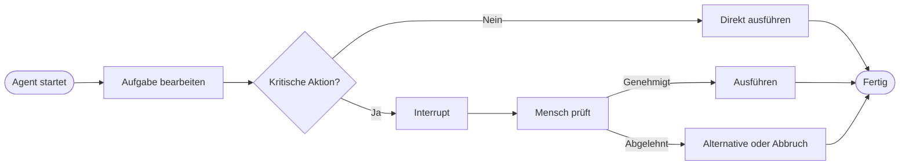
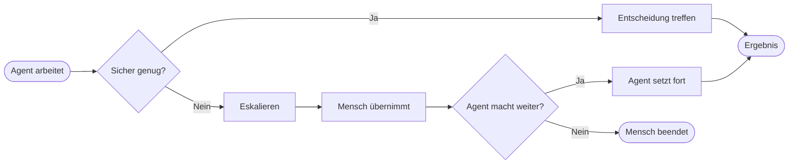

# Human-in-the-Loop
{: .no_toc }

> **Nicht jede Entscheidung eines Agenten sollte ohne menschliche Kontrolle erfolgen.**

---

# Inhaltsverzeichnis
{: .no_toc .text-delta }

1. TOC
{:toc}

---

## Warum Human-in-the-Loop kein Notbehelf ist

Ein Agent kann viele Aufgaben eigenständig vorbereiten oder ausführen. Das bedeutet aber nicht, dass vollständige Autonomie immer wünschenswert ist. Human-in-the-Loop, kurz HITL, bezeichnet das bewusste Einbinden von Menschen in den laufenden Prozess eines Agenten. An klar definierten Stellen pausiert das System, zeigt den aktuellen Stand und wartet auf Freigabe, Rückfrage oder Übernahme.

HITL ist kein Zeichen dafür, dass ein System „noch nicht gut genug“ ist. In vielen produktiven Umgebungen ist die menschliche Kontrolle gerade Teil der gewünschten Architektur. Sobald Entscheidungen teuer, rechtlich heikel, schwer reversibel oder erklärungsbedürftig werden, ist HITL oft die vernünftigere Lösung.

Typischer Fehler: Nur zu fragen, ob ein Agent etwas technisch alleine könnte. Die wichtigere Frage lautet meist, ob er es alleine entscheiden dürfen sollte.

## Ein einfaches Beispiel

Ein Agent soll eine E-Mail an Kunden vorbereiten. Das Formulieren kann er alleine übernehmen. Das tatsächliche Versenden ist aber ein anderer Risikotyp. Genau an dieser Grenze wird HITL sinnvoll: Der Agent erstellt einen Entwurf, der Mensch prüft Inhalt, Empfänger und Konsequenzen und gibt erst dann frei.

Dasselbe Muster taucht bei Zahlungen, Löschvorgängen, Vertragsänderungen oder sicherheitsrelevanten Konfigurationsänderungen auf. Der Mensch muss nicht jeden einzelnen Schritt manuell ausführen, aber er bleibt an den kritischen Punkten Kontrollinstanz.

## Das Autonomie-Spektrum

Agentensysteme lassen sich nicht nur in „manuell“ oder „autonom“ einteilen. Dazwischen liegt ein Spektrum.

| Stufe | Charakteristik | Beispiel |
|---|---|---|
| Manuell | Mensch erledigt alle Schritte selbst | Formular vollständig per Hand bearbeiten |
| Assistiert | Agent schlägt vor, Mensch entscheidet | Entwurf schreiben, Mensch sendet |
| Überwacht | Agent arbeitet vor, Mensch gibt kritische Schritte frei | Buchung vorbereiten, Mensch bestätigt |
| Beaufsichtigt | Agent arbeitet weitgehend autonom, Mensch greift bei Ausnahmen ein | Support-Agent eskaliert Sonderfälle |
| Autonom | Agent handelt eigenständig ohne laufende Freigabe | vollautomatische Batch-Verarbeitung |

In der Praxis bewegen sich viele brauchbare Systeme in der Mitte dieses Spektrums. Nicht weil Technik fehlt, sondern weil volle Autonomie in realen Organisationen oft nicht sinnvoll ist.

> [!NOTE] HITL ist eine Designentscheidung 
> Die relevante Frage ist nicht nur, was automatisiert werden kann, sondern welche Form von Kontrolle fachlich, rechtlich und organisatorisch gewollt ist.

## Wann HITL besonders sinnvoll wird

Je höher die Entscheidungskritikalität, desto eher rechtfertigt sich HITL. Eine Textantwort ist meist leicht korrigierbar. Eine gesendete E-Mail, eine ausgelöste Zahlung oder ein gelöschter Datensatz ist schwerer oder gar nicht rückgängig zu machen. Genau dort verschiebt sich die Architektur zugunsten menschlicher Freigabe.

Auch Unsicherheit des Agenten spricht für HITL. Wenn die Datenlage unklar ist, mehrere Optionen plausibel erscheinen oder Regeln an ihre Grenzen stoßen, ist eine Rückfrage oft besser als eine scheinbar souveräne Zufallsentscheidung. Hinzu kommen Compliance, Haftung und Vertrauensaufbau. Besonders neue Systeme sollten enger beaufsichtigt werden als bewährte.

| Aktion | Leicht reversibel? | HITL typischerweise sinnvoll? |
|---|---|---|
| Textantwort erzeugen | ja | meist nein |
| E-Mail-Entwurf schreiben | ja | optional |
| E-Mail versenden | nein | meist ja |
| Datensatz lesen | ja | meist nein |
| Datensatz löschen | nein | ja |
| Zahlung auslösen | nein | ja |

## Zwei Grundmuster: Freigabe und Eskalation

Das erste Muster ist das Approval-Pattern. Der Agent arbeitet bis zu einer kritischen Stelle, stoppt und fragt um Freigabe. Der Mensch entscheidet dann bewusst über den nächsten Schritt.

Das zweite Muster ist das Eskalations-Pattern. Hier versucht der Agent nicht, eine kritische Entscheidung selbst zu treffen, sondern erkennt bewusst seine Grenze und übergibt den Fall.

In der Praxis relevant, wenn: Ein Agent nicht nur ausführt, sondern auch erkennen soll, wann Unsicherheit, Risiko oder Regelverletzungen eine menschliche Entscheidung erfordern.

## HITL in Produktion ist etwas anderes als Debugging

In LangGraph oder ähnlichen Frameworks werden Unterbrechungen technisch oft gleich umgesetzt. Trotzdem sollte klar unterschieden werden, ob eine Unterbrechung für echte Freigabe im Produkt oder nur für Debugging in der Entwicklung gedacht ist.

| Kontext | Zweck |
|---|---|
| Produktives HITL | Sicherheit, Compliance, Freigabe, Vertrauen |
| Debugging-HITL | State inspizieren, Knoten prüfen, Entwicklungsfehler finden |

Diese Unterscheidung ist didaktisch wichtig, weil dieselbe Technik völlig unterschiedliche Rollen spielen kann.

## Gute HITL-Punkte müssen bewusst gewählt werden

Nicht jeder Schritt sollte unterbrochen werden. Zu viele Interrupts zerstören den Automatisierungsgewinn. Gute HITL-Punkte sitzen dort, wo die Fehlerkosten hoch sind oder wo Regeln, Recht oder Vertrauen menschliche Beteiligung verlangen.

Der Mensch braucht an diesem Punkt genug Kontext. Eine gute HITL-Oberfläche zeigt, was der Agent bisher getan hat, welche Entscheidung jetzt ansteht und welche Folgen eine Freigabe oder Ablehnung hätte. Ohne diesen Kontext wird aus HITL schnell nur ein formaler Klickprozess ohne echte Kontrollfunktion.

Grenze: HITL ersetzt keine saubere Agentenarchitektur. Wenn ein System bei jeder zweiten Aktion nachfragt, ist oft nicht der Mensch zu selten eingebunden, sondern die Automatisierung zu unscharf gestaltet.

## Was bei Ablehnung oder Nichtreaktion passieren muss

Ein HITL-System ist erst dann gut entworfen, wenn nicht nur die Freigabe, sondern auch die Ablehnung sauber behandelt wird. Der Agent sollte dann nicht abstürzen oder im Leerlauf hängen bleiben. Sinnvoll sind Alternativen, Rückfragen, Eskalation oder ein geordneter Abbruch.

Auch Timeouts gehören dazu. Ein Agent, der unbegrenzt auf menschliche Reaktion wartet, blockiert Prozesse. Deshalb brauchen produktive Systeme eine Timeout-Strategie: erinnern, eskalieren oder beenden.

Typischer Fehler: Nur den Happy Path der Freigabe zu gestalten und Ablehnung oder Schweigen organisatorisch zu vergessen.

## Zusammenhang mit Checkpointing

Technisch wird HITL meist über Unterbrechung und Wiederaufnahme umgesetzt. Dafür braucht das System einen gespeicherten Zustand, damit der Workflow an genau derselben Stelle fortgesetzt werden kann. Genau deshalb ist Checkpointing keine Konkurrenz zu HITL, sondern seine Grundlage.

Ein Agent pausiert also nicht einfach „in der Luft“, sondern auf Basis eines gespeicherten States. Erst dadurch werden Freigabe, Rückkehr und Nachvollziehbarkeit praktisch möglich.

## Was für Einsteiger zuerst wichtig ist

Für Einsteiger reicht meist eine einfache Regel: Alles, was schwer reversibel ist oder Dritte direkt betrifft, sollte nicht ohne menschliche Freigabe laufen. Dazu gehören Versand, Löschung, Zahlungen, sensible Kommunikation und Regel- oder Compliance-Ausnahmen.

Teilnehmende unterschätzen oft, dass HITL nicht gegen Automatisierung arbeitet. Es macht Automatisierung in vielen realen Projekten überhaupt erst akzeptabel.

## Abgrenzung zu verwandten Dokumenten

| Dokument | Frage |
|---|---|
| [State Management](./state-management.html) | Wie werden Unterbrechung und Wiederaufnahme über gespeicherten State vorbereitet? |
| [Wie werden Agenten gegen Missbrauch und Fehlverhalten abgesichert?](./agent-security.html) | Welche Sicherheitsgrenzen ergänzen oder ersetzen menschliche Kontrolle? |
| [Evaluation & Observability](../entscheidungen-qualitaet/evaluation-observability.html) | Wie werden Agentenqualität und Fehlverhalten systematisch sichtbar gemacht? |

---

**Version:** 1.1 
**Stand:** April 2026 
**Kurs:** Generative KI. Verstehen. Anwenden. Gestalten.
