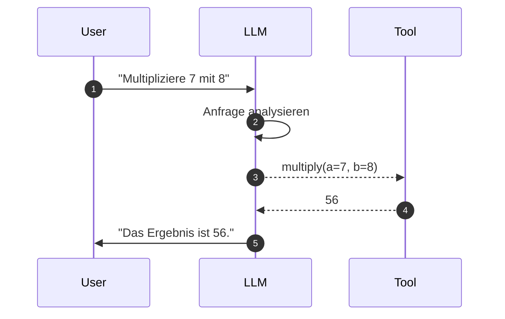

# Tool Use & Function Calling
{: .no_toc }

> **Ein Agent wird erst dann handlungsfähig, wenn er mehr kann als Text erzeugen.**

---

# Inhaltsverzeichnis
{: .no_toc .text-delta }

1. TOC
{:toc}

---

## Warum ein Modell allein oft nicht reicht

Sprachmodelle sind stark im Formulieren, Zusammenfassen und Interpretieren von Text. Sie haben aber klare Grenzen. Sie kennen nicht automatisch aktuelle Informationen, können nicht zuverlässig rechnen, greifen nicht selbst auf Dateien zu und führen keine Aktionen in externen Systemen aus. Genau an dieser Stelle beginnt Tool Use.

Werkzeuge erweitern die Fähigkeiten eines Modells über reines Sprachwissen hinaus. Das Modell entscheidet, ob ein Werkzeug gebraucht wird und welche Parameter dafür sinnvoll sind. Der eigentliche Aufruf wird danach von der Anwendung oder dem Agentensystem ausgeführt.

| Grenze des Modells | Typisches Beispiel | Werkzeug löst das Problem |
|---|---|---|
| kein aktuelles Wissen | Wetter, Aktienkurse, heutige Termine | API oder Websuche |
| keine verlässliche Berechnung | Berechnungen, Umrechnungen, Validierung | Rechen- oder Validierungs-Tool |
| kein Dateizugriff | PDF oder Textdatei lesen | Datei-Tool |
| keine echte Außenwirkung | Termin buchen, E-Mail senden | Kalender- oder Mail-Tool |

> [!NOTE] Das Modell führt das Tool nicht selbst aus<br>
> Es erzeugt nur die strukturierte Absicht, ein Tool zu verwenden. Die Anwendung validiert und führt den eigentlichen Code aus.

## Ein einfaches Beispiel

Ein Assistent soll die Anfrage `Multipliziere 7 mit 8` beantworten. Ohne Tool könnte das Modell korrekt antworten, aber die Antwort wäre nicht verlässlich aus einer kontrollierten Operation abgeleitet. Mit Tool Use erkennt das Modell, dass eine Berechnung nötig ist, erzeugt einen Aufruf an ein Rechenwerkzeug und nutzt das Ergebnis danach in der Antwort.

Genau dieses Muster skaliert später auf realere Fälle: Datenbankabfragen, Websuche, Dateilesen oder Freigabeprozesse.

## Was Function Calling eigentlich bedeutet

Function Calling ist der Mechanismus, mit dem ein Modell strukturiert angibt, welches Tool mit welchen Parametern ausgeführt werden soll. Das Modell formuliert also nicht nur freien Text, sondern einen maschinenlesbaren Aufruf.

```text
Pseudo-Code, nicht als Python ausführen:

Nutzer stellt Anfrage
Modell prüft:
    kann ich direkt antworten?
    brauche ich ein Werkzeug?

wenn Werkzeug nötig:
    Tool auswählen
    Parameter vorschlagen
    Anwendung validiert Parameter
    Anwendung führt Tool aus
    Modell formuliert Antwort aus Tool-Ergebnis
```



Für das Modell ist ein Tool letztlich ein Schema mit Name, Beschreibung und Parametern. Anhand dieser Informationen entscheidet es, ob ein Tool passt.

| Bestandteil | Zweck | Praxisregel |
|---|---|---|
| Name | schnelle Orientierung für das Modell | spezifisch und handlungsnah benennen |
| Beschreibung | erklärt, wann das Tool genutzt wird | Zweck, Grenzen und Ausschlüsse nennen |
| Parameter | definiert die Eingaben | Typen, Pflichtfelder und erlaubte Werte begrenzen |
| Rückgabe | Ergebnis für den nächsten Modellschritt | kurz, relevant und strukturiert halten |

Typischer Fehler: Zu denken, dass das Modell damit bereits sicher und korrekt gehandelt hat. In Wahrheit beginnt Sicherheit erst bei Validierung, Begrenzung und kontrollierter Ausführung.

## Tools definieren

Ein Tool ist mehr als eine technische Funktion. Für das Modell ist vor allem das sichtbare Schema relevant: Name, Beschreibung, Parameter und erwartete Rückgabe. Die konkrete Implementierung kann sich je nach Framework ändern; das architektonische Prinzip bleibt gleich.

```text
Pseudo-Code, nicht als Python ausführen:

Tool definieren:
    Name: eindeutig und handlungsnah
    Beschreibung: Zweck und Grenzen
    Parameter: Pflichtfelder, Typen, erlaubte Werte
    Rückgabe: kurz, relevant, weiterverarbeitbar
```

| Designfrage | Empfehlung |
|---|---|
| Was soll das Tool genau tun? | eine klar abgegrenzte Aufgabe |
| Wann soll es verwendet werden? | typische Anwendungsfälle explizit nennen |
| Wann soll es nicht verwendet werden? | negative Boundaries ergänzen |
| Welche Eingaben sind erlaubt? | Typen, Wertebereiche und Pflichtfelder festlegen |
| Was darf zurückgegeben werden? | nur Informationen, die der Agent wirklich braucht |

Dieses Minimalprinzip zeigt bereits zwei Grundregeln: Das Tool-Schema ist ein Vertrag, und die Beschreibung ist Steuerungsinformation für das Modell.

## Warum gute Beschreibungen über die Tool-Auswahl entscheiden

Das Modell wählt ein Tool nicht aufgrund des internen Codes, sondern auf Basis von Name, Beschreibung und Parametern. Eine schlechte Beschreibung führt deshalb oft zu falscher oder ausbleibender Tool-Nutzung, selbst wenn die Implementierung technisch korrekt ist.

| Schlechte Beschreibung | Bessere Beschreibung |
|---|---|
| "Sucht etwas." | "Durchsucht interne Unternehmensdokumente nach Richtlinien, Prozessen und Produktinformationen." |
| "Liest Dateien." | "Liest freigegebene Text- und PDF-Dateien aus dem Projektordner; nicht für externe URLs verwenden." |
| "Sendet Nachricht." | "Erstellt einen E-Mail-Entwurf; versendet ihn erst nach expliziter Freigabe." |

In der Praxis relevant, wenn mehrere ähnliche Tools verfügbar sind und das Modell klar unterscheiden soll, welches Werkzeug wofür gedacht ist.

## Negative Boundaries verhindern Tool-Verwechslungen

Sobald ein Agent mehrere ähnliche Werkzeuge verwaltet, entsteht leicht Tool-Overlap. Zwei Tools "suchen" beide etwas, aber in unterschiedlichen Datenräumen. Ohne klare Ausschlüsse kann das Modell schwer entscheiden, welches Werkzeug gemeint ist.

| Tool-Typ | Positive Boundary | Negative Boundary |
|---|---|---|
| interne Suche | Unternehmensdokumente, Richtlinien, Handbücher | kein Web, keine aktuellen Nachrichten |
| Websuche | aktuelle externe Informationen | keine vertraulichen internen Daten |
| Datenbankabfrage | strukturierte Unternehmensdaten | keine freien Schreiboperationen |
| Datei-Tool | freigegebene Projektdateien | keine Systempfade, keine Secrets |

Gerade bei Agenten mit vielen Tools ist diese Negativabgrenzung kein Zusatz, sondern ein wichtiges Architekturmittel. Sie reduziert Fehlgriffe des Modells deutlich.

## Type Hints und Schemata sind Pflicht

Ohne klares Schema weiß das Modell nicht zuverlässig, welche Parameter es liefern soll oder welche Datentypen erwartet werden. Ob dieses Schema aus Type Hints, Pydantic, JSON Schema oder einer Framework-Abstraktion entsteht, ist weniger wichtig als seine Klarheit.

| Schema-Aspekt | Warum wichtig |
|---|---|
| Pflichtfelder | verhindert unvollständige Tool-Aufrufe |
| Datentypen | reduziert falsche Parameter |
| Wertebereiche | begrenzt riskante Eingaben |
| Beispiele | helfen bei mehrdeutigen Feldern |
| Validierung | stoppt falsche Aufrufe vor externer Wirkung |

> [!WARNING] Fehlende Schemata erzeugen schwache Tool-Nutzung<br>
> Wenn das Schema unvollständig ist, kann das Modell Parameter falsch oder gar nicht befüllen.

## Pydantic als Vertrags-Schicht

Bei produktionsnäheren Tools reicht eine einfache Beschreibung oft nicht aus. Dann wird ein explizites Datenmodell zur eigentlichen Contract-Schicht. Es definiert zugleich das Schema, validiert die Eingaben und macht Übergaben zwischen Komponenten konsistent.

| Vorteil | Bedeutung |
|---|---|
| Validierung | ungültige Eingaben werden früh erkannt |
| Dokumentation | Schema und Beschreibung bleiben zusammen |
| Wiederverwendung | gleiche Struktur für Tool, API und Tests |
| Stabilität | Änderungen werden sichtbar statt implizit |

Der Vorteil liegt darin, dass Schema und Validierung nicht auseinanderdriften. Genau deshalb ist eine explizite Vertrags-Schicht für höherwertige Tool-Schnittstellen oft sinnvoll.

## Fehlerbehandlung gehört in jedes Tool

Ein Tool kann fehlschlagen: Datei nicht gefunden, Datenbank nicht erreichbar, Eingabe ungültig. Gute Tools liefern deshalb nicht nur einen Absturz, sondern eine verständliche Rückmeldung, mit der der Agent weiterarbeiten kann.

```text
Pseudo-Code, nicht als Python ausführen:

Tool ausführen:
    wenn Eingabe ungültig:
        verständlichen Validierungsfehler zurückgeben
    wenn externe Quelle nicht erreichbar:
        temporären Fehler melden
    wenn keine Treffer:
        leeres Ergebnis sauber erklären
    sonst:
        gefiltertes Ergebnis zurückgeben
```

| Fehlerart | Gute Tool-Reaktion |
|---|---|
| Eingabe ungültig | klar sagen, welches Feld fehlt oder falsch ist |
| Datenquelle nicht erreichbar | temporären Fehler melden und Retry ermöglichen |
| keine Treffer | leeres Ergebnis sauber erklären |
| Berechtigung fehlt | nicht umgehen, sondern Freigabe oder Alternative anfordern |

Typischer Fehler: Nur einen technischen Fehlerstring zurückzugeben. Ein Agent braucht eine informative Fehlermeldung, sonst kann er weder sinnvoll erklären noch sinnvoll weiterfragen.

## Tool-Ausgaben vor dem Weitergeben filtern

Was ein Werkzeug zurückgibt, ist nicht automatisch das, was in den Agenten-Kontext fließen sollte. Rohe API-Antworten enthalten oft Statusfelder, verschachtelte Metadaten oder große Mengen irrelevanter Daten. Fließt all das ungefiltert in das Kontextfenster, verbraucht es Token, kann das Modell ablenken und erhöht das Risiko, dass nachfolgende Entscheidungen auf Nebeninformationen statt auf dem Kern basieren.

```text
Pseudo-Code, nicht als Python ausführen:

nach Tool-Aufruf:
    rohe Antwort entgegennehmen
    irrelevante Felder entfernen
    sensible Felder entfernen oder maskieren
    Ergebnis auf notwendige Passagen reduzieren
    Quelle oder Fundstelle beilegen
```

| Rohes Ergebnis | Bessere Rückgabe an den Agenten |
|---|---|
| vollständige API-Antwort mit Metadaten | relevante Felder plus Quelle |
| zehn Treffer mit je fünfzig Feldern | fünf Treffer mit Titel, Kurzinhalt und Link |
| Datenbankzeilen ohne Erklärung | tabellarische Kurzfassung mit Spaltennamen |
| langer Dateiinhalt | relevante Passage plus Fundstelle |

Das Filterverhalten gehört zur Tool-Implementierung, nicht zur Prompt-Gestaltung. Eine saubere Abgrenzung zwischen dem, was die externe API liefert, und dem, was der Agent für seine Entscheidung braucht, ist Teil des Harness-Designs.

## Werkzeuge zunächst isoliert testen

Bevor ein Tool an einen Agenten gebunden wird, sollte es einzeln geprüft werden. Dazu gehört die direkte Ausführung ebenso wie die Kontrolle von Name, Beschreibung, Schema, Fehlerfällen und Rückgabeformat.

| Test | Frage |
|---|---|
| direkter Aufruf | funktioniert das Tool ohne Agent? |
| Schema-Test | sind Pflichtfelder und Typen eindeutig? |
| Grenzwerte | werden ungültige Eingaben abgefangen? |
| Fehlerfall | kann der Agent mit der Rückmeldung weiterarbeiten? |
| Rückgabe | ist das Ergebnis knapp und entscheidungsrelevant? |

Gerade in Entwicklerprojekten spart dieser Zwischenschritt viel Zeit, weil unklare Schemata oder fehlerhafte Parameter nicht erst im Agentenverbund auffallen.

## Tools an das Modell binden

Sobald Werkzeuge definiert sind, können sie an ein Modell oder einen Agenten gebunden werden. Das Modell entscheidet dann selbst, ob ein Tool sinnvoll ist. Wichtig ist: Die Tool-Absicht ist noch keine Tool-Ausführung. Erst die Agentenlaufzeit oder Anwendung validiert und führt den Aufruf wirklich aus.

```text
Pseudo-Code, nicht als Python ausführen:

Agentenlauf:
    Modell sieht verfügbare Tool-Schemata
    Modell schlägt Tool-Aufruf vor
    Runtime prüft Berechtigung und Parameter
    Runtime führt Tool kontrolliert aus
    Runtime gibt gefiltertes Ergebnis zurück
    Modell erzeugt Antwort oder nächsten Schritt
```

| Schritt | Verantwortung |
|---|---|
| Tool-Beschreibung lesen | Modell |
| passendes Tool auswählen | Modell |
| Parameter vorschlagen | Modell |
| Parameter validieren | Anwendung / Runtime |
| Tool ausführen | Anwendung / Runtime |
| Ergebnis interpretieren | Modell |

Diese Trennung ist zentral für Debugging und Sicherheit.

## Praktische Tool-Kategorien

Tools lassen sich gut nach ihrer Wirkung einordnen. Diese Einordnung hilft bei Sicherheitsgrenzen und Freigaben.

| Kategorie | Beispiele | Risiko |
|---|---|---|
| Lesen | Datei lesen, Datenbank abfragen, Websuche | Datenabfluss, Prompt Injection |
| Berechnen | Mathematik, Validierung, Transformation | falsche Parameter, stille Fehler |
| Schreiben | Datei erzeugen, Ticket erstellen, Datensatz ändern | unbeabsichtigte Änderung |
| Kommunizieren | E-Mail, Kalender, Chat-Nachricht | Außenwirkung, Datenschutz |
| Ausführen | Skript, Deployment, Zahlung, Löschung | hoher Schaden bei Fehlentscheidung |

Ein Datums-Tool ist nützlich, wenn aktuelle Zeitinformation gebraucht wird. Ein Datei-Tool zeigt gut, wie externe Operationen kontrolliert werden. Ein Websuch-Tool ist besonders für aktuelle Informationen nützlich, die nicht im Modellwissen liegen.

## Hochriskante Aktionen brauchen zusätzliche Schranken

Bei Operationen mit realen Folgen, etwa Rückerstattung, Löschung oder Zahlung, reicht ein einzelnes Tool oft nicht aus. Ein sinnvolles Muster ist Two-Step Veto: Zuerst wird geprüft, danach erst ausgeführt.

```text
Pseudo-Code, nicht als Python ausführen:

wenn Tool hohe Außenwirkung hat:
    Policy prüfen
    geplante Aktion verständlich anzeigen
    explizite Freigabe einholen
    Aktion ausführen
    Ergebnis und Entscheidung auditieren
```

| Risikostufe | Beispiel | Zusätzliche Schranke |
|---|---|---|
| niedrig | Wetter abrufen | keine besondere Freigabe |
| mittel | Datei zusammenfassen | Pfadbegrenzung und Leserechte |
| hoch | E-Mail senden | Vorschau und Nutzerfreigabe |
| kritisch | Daten löschen, Zahlung auslösen | Policy-Prüfung, Freigabe, Audit-Log |

Wenn nach einer Policy-Prüfung deterministisch feststeht, welches Tool als Nächstes aufgerufen werden muss, kann ein System den nächsten Tool-Schritt auch erzwingen.

Nicht geeignet, wenn Tool-Auswahl generell durch Zwang gesteuert wird. Erzwungene Tool-Aufrufe sind für klare Sonderfälle gedacht, nicht als Dauerersatz für gutes Routing.

## Progressive Disclosure: nicht alle Tools auf einmal zeigen

In der Praxis relevant, wenn ein Agent auf viele Werkzeuge zugreifen soll, diese aber nicht alle gleichzeitig braucht. Statt alle Tools auf einmal bereitzustellen, kann man dem Agenten zunächst nur wenige, klar beschriebene Einstiegs-Tools geben. Die vollständigen Parameter-Beschreibungen oder spezialisierte Werkzeuge werden erst dann in den Kontext injiziert, wenn der Agent durch einen ersten Tool-Aufruf signalisiert, in welche Richtung er arbeitet.

```text
Pseudo-Code, nicht als Python ausführen:

Start:
    nur grobe Einstiegs-Tools anbieten

wenn Agent eine Richtung wählt:
    passende spezialisierte Tools nachladen
    unnötige Tools weiterhin ausblenden
    Entscheidung mit kleinerem Toolset fortsetzen
```

| Vorteil | Wirkung |
|---|---|
| weniger Token | Tool-Schemata belasten den Kontext weniger |
| weniger Mehrdeutigkeit | das Modell muss zwischen weniger ähnlichen Tools wählen |
| besseres Debugging | pro Schritt sind weniger Entscheidungen gleichzeitig aktiv |
| bessere Sicherheit | riskante Tools werden nicht unnötig angeboten |

Dieses Prinzip reduziert den Token-Verbrauch, verringert mehrdeutige Tool-Auswahlen und macht das Debugging einfacher.

## Was am Anfang wichtig ist

Für einen ersten Agenten reichen meist **wenige, klar benannte Werkzeuge** mit guten Beschreibungen, klaren Schemata und sauberer Fehlerbehandlung. Zu viele Tools auf einmal überfordern nicht nur das Modell, sondern auch das eigene Debugging. Ein kleines, klar abgegrenztes Toolset ist fast immer der bessere Start.

Entwickler unterschätzen oft, dass Tool Use nicht nur neue Fähigkeiten bringt, sondern auch neue Verantwortung. Sobald ein Agent lesen, suchen, schreiben oder externe Systeme verändern kann, wird Tool-Design zur Sicherheitsfrage.

| Entwicklerregel | Begründung |
|---|---|
| mit 1-3 Tools starten | weniger Fehlgriffe und leichteres Debugging |
| Beschreibungen präzise schreiben | das Modell sieht nicht den internen Code |
| Eingaben validieren | Tool-Aufrufe sind untrusted input |
| Ausgaben kürzen | Kontextfenster bleibt sauber |
| riskante Aktionen freigeben lassen | reale Außenwirkung braucht Kontrolle |

## Abgrenzung zu verwandten Dokumenten

| Dokument | Frage |
|---|---|
| [LangGraph Einsteiger](../../frameworks/einsteiger/einsteiger-langgraph.html) | Wie werden Werkzeuge in zustandsbehaftete Workflows eingebettet? |
| [Agent Security](./agent-security.html) | Wie werden Tool-Aufrufe abgesichert und Missbrauch begrenzt? |
| [RAG Konzepte](../anwendungsmethoden/rag-konzepte.html) | Wann ist Retrieval die bessere Alternative zu direkten Tool-Aufrufen? |

---

**Version:** 1.5<br>
**Stand:** Mai 2026<br>
**Kurs:** Generative KI. Verstehen. Anwenden. Gestalten.
