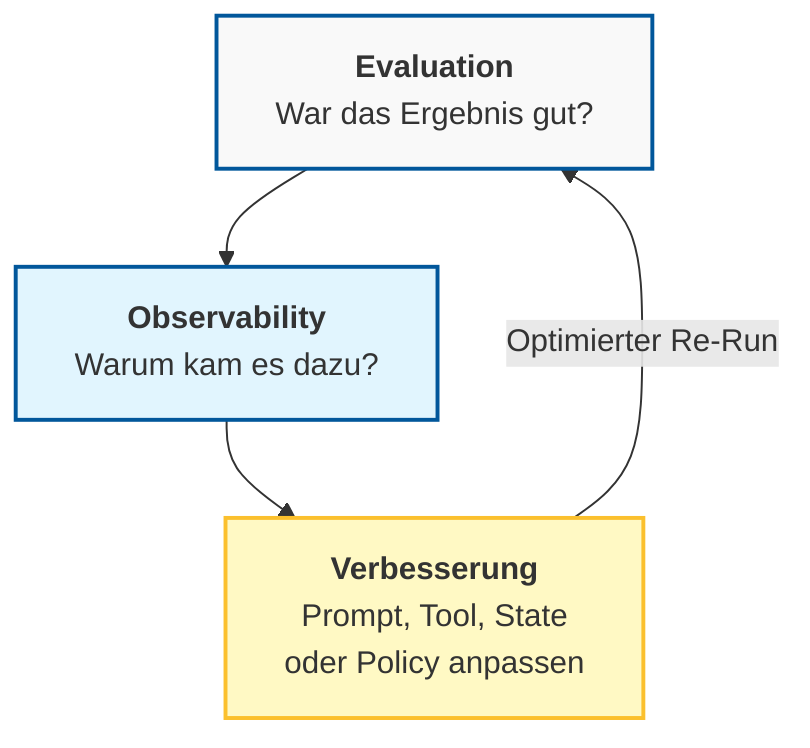
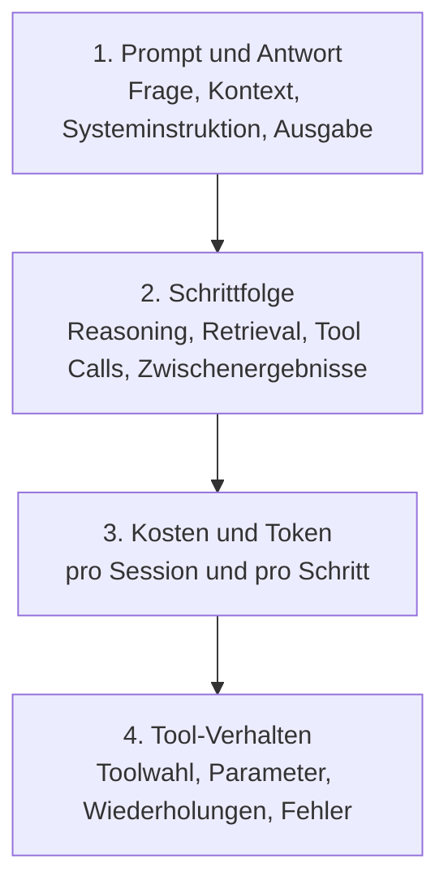
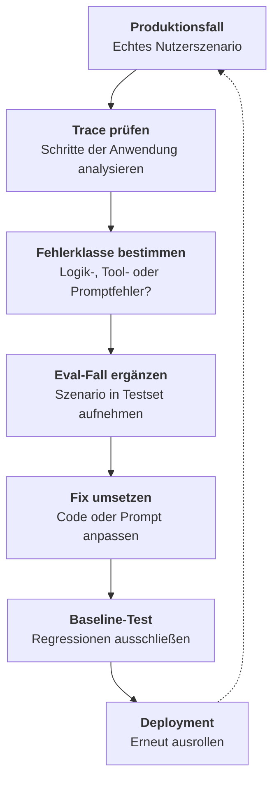

# Evaluation & Observability
{: .no_toc }

> **Evaluation misst Qualität. Observability zeigt, warum sie entsteht oder kippt.**

---

# Inhaltsverzeichnis
{: .no_toc .text-delta }

1. TOC
{:toc}

---

## Evaluation und Observability: der Unterschied

**Evaluation** beantwortet die Frage, ob ein Agent unter definierten Bedingungen gute Ergebnisse liefert. **Observability** beantwortet die Anschlussfrage, warum ein Ergebnis gut, schlecht, teuer oder instabil war. Beides gehört zusammen: Ohne Evaluation fehlt ein belastbarer Maßstab, ohne Observability bleibt unklar, an welcher Stelle der Fehler entstanden ist.

Auf dem ersten Blick wirkt beides zunächst ähnlich, weil in beiden Fällen Logs, Antworten und Metriken betrachtet werden. Der Unterschied liegt im Zweck. Evaluation vergleicht erwartetes Verhalten mit tatsächlichem Verhalten. Observability sammelt die Spuren, die diesen Vergleich erklärbar machen.

Typischer Fehler: Nur auf Uptime, Antwortzeit und Statuscodes zu schauen. Ein Agent kann technisch gesund wirken und fachlich seit Tagen falsche Antworten geben.





## Das Silent-Failure-Problem

Klassische Software scheitert oft **laut**: Exceptions, Fehlermeldungen, rote Dashboards. Agentensysteme scheitern häufig **leise**. Eine Anfrage endet mit HTTP 200 (die Anfrage war erfolgreich und liefert Ergebnisse), die Laufzeit sieht sauber aus, der Container lebt weiter, und trotzdem wird eine Rückgabe falsch priorisiert, ein ungeeignetes Tool gewählt oder eine Halluzination mit großer Sicherheit formuliert.

Genau hier beginnt Observability für GenAI-Anwendungen. Nicht die Frage, ob das System läuft, steht im Mittelpunkt, sondern ob es fachlich das Richtige tut. Das Qualitätssignal liegt im Gespräch, in den Zwischenschritten und in der Nutzung von Tools oder Kontext. Infrastruktur-Monitoring bleibt nötig, reicht aber nicht aus.

In Trainings zeigt sich oft derselbe erste Irrtum: Wenn keine Exception auftritt, wird ein Durchlauf als erfolgreich gewertet. Für GenAI-Anwendungen ist diese Gleichsetzung zu grob.

## Ein einfaches Kursbeispiel

Ein Support-Agent soll drei häufige Aufgaben lösen: Lieferstatus nennen, Rechnung erneut senden und Öffnungszeiten beantworten. Für einen Entwicklerkurs reicht dieses kleine Szenario, um Evaluation und Observability konkret zu machen.

Die Evaluation kann mit wenigen Testfällen beginnen. Für jede Anfrage wird festgelegt, was als gute Antwort gilt. Das kann eine exakte Lösung sein, eine erlaubte Liste von Schlüsselinformationen oder ein korrekt ausgelöstes Tool.

```text
Evaluationsset: Support-Agent

Testfall 1:
- Eingabe: "Wo ist meine Bestellung 4711?"
- Erwartetes Tool: track_order
- Antwort muss enthalten: "unterwegs"

Testfall 2:
- Eingabe: "Bitte schick mir die Rechnung noch einmal."
- Erwartetes Tool: send_invoice
- Antwort muss enthalten: "E-Mail"

Testfall 3:
- Eingabe: "Habt ihr am Samstag geöffnet?"
- Antwort muss enthalten: "Samstag" und "9 bis 14 Uhr"
```

Observability ergänzt dieses kleine Evaluationsset um die Spuren pro Anfrage: Welcher Prompt wurde gebaut, welches Tool wurde gewählt, welche Parameter wurden übergeben, wie viele Schritte waren nötig und an welcher Stelle stieg der Token-Verbrauch. Erst diese Sicht macht verständlich, warum zwei Antworten ähnlich klingen, aber nur eine davon belastbar ist.

## Welche Beobachtungsdaten wirklich helfen

Für eine GenAI-Anwendung reichen einige wenige Datentypen, um die meisten Fehler sichtbar zu machen. Am wichtigsten sind vollständige Prompt-Antwort-Paare, die Schrittfolge der Anwendung, Kosten- und Tokenwerte pro Durchlauf sowie das Verhalten der Tool-Aufrufe. Diese vier Ebenen decken viele Probleme auf, die in klassischem Monitoring unsichtbar bleiben.



Wer nur die fertige Antwort speichert, sieht häufig nur das Symptom. Wer auch Trajectory und Tool-Verhalten speichert, erkennt meist die eigentliche Ursache: falsches Tool, leerer Retrieval-Kontext, unnötige Schleife oder ein Prompt, der dem Modell zu viel Spielraum lässt.

> [!NOTE] Vier Signale mit hohem Nutzen<br>
> Für eine erfolgreiche Entwicklung genügen meist diese vier Beobachtungsebenen. Mehr Telemetrie hilft nur dann, wenn daraus auch Entscheidungen für Prompt, Tooling oder Datenbasis abgeleitet werden.

## Was Evaluation konkret misst

Evaluation braucht einen klaren Soll-Ist-Vergleich. Bei toolgestützten GenAI-Anwendungen betrifft dieser Vergleich nicht nur den finalen Antworttext, sondern oft auch den Weg dorthin. Ein System kann eine inhaltlich brauchbare Antwort liefern und dabei dennoch das falsche Tool verwenden, unnötig teuer arbeiten oder bei leicht veränderten Formulierungen sofort kippen.

Sinnvoll ist deshalb eine Staffelung in drei Ebenen. Auf Komponentenebene wird geprüft, ob einzelne Bausteine sauber arbeiten, etwa Tool-Auswahl, Tool-Parameter, strukturierte Ausgaben oder ein Retriever. Auf Workflow-Ebene zählt, ob die Aufgabe End-to-End gelöst wird. Auf Nutzerebene wird sichtbar, ob das Ergebnis im echten Einsatz tatsächlich hilft.

Grenze: Nicht jede gute Agentenantwort lässt sich mit einer einzigen Kennzahl bewerten. Gerade bei offenen Formulierungen braucht Evaluation mehrere Kriterien gleichzeitig.

## Welche Metriken für Entwickler zuerst genügen

Für den Einstieg ist keine Metrik-Bibliothek nötig. Meist reichen vier Fragen: War die Antwort fachlich korrekt, wurde das richtige Tool verwendet, wie lange dauerte der Durchlauf und wie hoch waren die Kosten. Damit entsteht bereits ein belastbares Grundbild.

Eine einfache Tool-Accuracy lässt sich fast ohne Infrastruktur berechnen:

```text
Metrik: Tool-Accuracy

Eingaben:
- expected_tool: erwartetes Tool
- actual_tool: tatsächlich verwendetes Tool

Berechnung:
- Wenn expected_tool und actual_tool gleich sind: Score = 1.0
- Sonst: Score = 0.0
```

Für textuelle Antworten helfen häufig drei Bewertungsachsen: Relevanz, Vollständigkeit und Sicherheit. Diese Kriterien sind weniger präzise als exakte Übereinstimmung, dafür aber realistischer für natürliche Sprache.

| Metrik | Zeigt | In der Praxis relevant, wenn |
|---|---|---|
| Accuracy | Antwort oder Tool ist korrekt | klare Soll-Antworten existieren |
| Latenz | Antwort kommt schnell genug | Wartezeit Nutzerfluss stört |
| Kosten pro erfolgreicher Lösung | Effizienz pro gelöstem Fall | Varianten verglichen werden |
| Erfolgsquote pro Aufgabe | Ziel wurde wirklich erreicht | Agent mehrere Schritte ausführt |

Ein besonders nützlicher Wert ist nicht die Kostenhöhe pro Session, sondern die Kosten pro erfolgreicher Lösung. Zwei Varianten können ähnlich teuer erscheinen, obwohl eine davon deutlich öfter scheitert.

```text
Metrik: Kosten pro erfolgreicher Lösung

Eingaben:
- Liste aller Sessions
- pro Session: Kosten und Erfolgsstatus

Berechnung:
1. Addiere die Kosten aller Sessions.
2. Zähle alle erfolgreich abgeschlossenen Sessions.
3. Teile Gesamtkosten durch erfolgreiche Sessions.
4. Wenn keine Session erfolgreich war: Wert als unendlich oder nicht auswertbar markieren.
```

## Wie ein kleines Evaluationsset aufgebaut wird

Gute Evaluation beginnt nicht mit Hunderten Beispielen, sondern mit einer kleinen, sauberen Auswahl typischer Fälle. Für einen Kurs genügen oft 20 bis 30 Testfälle, wenn sie nicht nur den Happy Path abdecken. Wichtig ist eine Mischung aus Standardfällen, Randfällen und bewusst schwierigen Eingaben.

Ein häufiger erster Fehler ist ein Testset, das nur aus offensichtlichen Anfragen besteht. Dann wirkt der Agent robuster, als er später im Einsatz ist. Schon wenige Variationen machen einen großen Unterschied: Tippfehler, unvollständige Angaben, mehrdeutige Fragen oder Eingaben außerhalb des vorgesehenen Aufgabenbereichs.

```text
Dataset-Struktur:
- Happy Path: typische Anfragen mit erwartbarem Verlauf
- Edge Cases: unklare Formulierungen, Grenzwerte, fehlende Angaben
- Negative Tests: Out-of-Scope, ungültige Eingaben, adversariale Inputs
```

Wenn im Betrieb ein neuer Fehler auftaucht, gehört genau dieser Fall in das Evaluationsset. So wird Qualität mit jeder Iteration weniger zufällig und stärker reproduzierbar.

## Welche Evaluierungsmethoden sich eignen

Die einfachste Methode ist exakte Übereinstimmung. Sie eignet sich für klar definierte Antworten wie IDs, Zahlenwerte oder Tool-Namen. Für offene Antworten ist sie oft zu streng, weil mehrere Formulierungen fachlich korrekt sein können.

```text
Metrik: Exact Match

Eingaben:
- predicted: erzeugte Antwort
- expected: erwartete Antwort

Berechnung:
1. Entferne überflüssige Leerzeichen.
2. Vergleiche beide Texte ohne Groß-/Kleinschreibung.
3. Bei identischer Antwort: Score = 1.0
4. Sonst: Score = 0.0
```

Daneben gibt es weichere Verfahren. Teilübereinstimmung prüft, ob zentrale Informationen enthalten sind. Semantische Ähnlichkeit vergleicht Bedeutungen statt Oberflächenform. LLM-as-Judge nutzt ein Modell als Bewerter. Dieses Verfahren ist flexibel, kostet aber zusätzlich und sollte nicht als unfehlbare Instanz verstanden werden.

```text
Metrik: Enthält erwartete Informationen

Eingaben:
- predicted: erzeugte Antwort
- expected_keywords: Liste zentraler Begriffe oder Aussagen

Berechnung:
1. Prüfe für jedes erwartete Stichwort, ob es in der Antwort vorkommt.
2. Zähle die gefundenen Stichwörter.
3. Teile gefundene Stichwörter durch alle erwarteten Stichwörter.
```

Nicht geeignet, wenn: Das Bewertungsverfahren selbst intransparent bleibt und dadurch nur eine weitere Blackbox erzeugt. Gerade in Entwicklerkursen sollte immer klar sein, warum eine Antwort als gut oder schlecht zählt.

## Observability erklärt Fehlerursachen

Wenn Evaluation zeigt, dass eine Aufgabe scheitert, beginnt die eigentliche Diagnose. Observability beantwortet dann Fragen wie: War der Kontext leer, obwohl Dokumente vorhanden waren? Hat der Agent das richtige Tool gewählt, aber mit falschen Parametern aufgerufen? Entstand eine teure Schleife durch wiederholtes Nachdenken ohne Fortschritt?

Für die Praxis reicht oft schon ein strukturierter Trace pro Anfrage:

```text
Trace pro Anfrage:

Frage:
- "Bitte sende mir die Rechnung erneut."

Tool-Aufrufe:
1. search_orders mit customer_id
2. send_invoice mit order_id

Technische Werte:
- Latenz in Millisekunden
- Input-Token
- Output-Token
```

Ein solcher Trace ersetzt keine Bewertung, aber er macht Fehler reproduzierbar. Genau deshalb gehören Evaluation und Observability zusammen: Die eine Seite zeigt Abweichungen, die andere macht sie erklärbar.

## Regressionen früh erkennen

Sobald ein Agent produktiv weiterentwickelt wird, reicht eine Einmalbewertung nicht mehr aus. Jede Änderung an Prompt, Modell, Tooling oder Wissensbasis kann frühere Verbesserungen wieder zerstören. Regression Testing vergleicht daher neue Varianten immer mit einer bekannten Baseline auf demselben Datensatz.

```text
Regressionstest:

Baseline:
1. Führe Agent-Version v1 auf demselben Evaluationsset aus.
2. Speichere Ergebnisse als baseline-v1.

Kandidat:
1. Führe Agent-Version v2 auf demselben Evaluationsset aus.
2. Speichere Ergebnisse als candidate-v2.

Vergleich:
- Prüfe, ob v2 besser, gleich gut oder schlechter als v1 abschneidet.
- Untersuche verschlechterte Testfälle einzeln.
```

Der didaktische Kern ist einfach: Erst messen, dann ändern, dann erneut messen. Ohne diesen Vergleich bleiben Verbesserungen oft Behauptungen.

> [!WARNING] Baseline vor jeder Optimierung<br>
> Eine einzelne gute Demo ist keine belastbare Evidenz. Aussagekräftig wird Qualität erst im Vergleich mit einer vorherigen Version auf denselben Fällen.

## Feedback aus dem Betrieb nutzen

Evaluation endet nicht mit dem ersten Release. In vielen Projekten zeigt sich erst im echten Einsatz, welche Formulierungen, Sonderfälle oder Missverständnisse im Kurslabor noch nicht sichtbar waren. Nutzerfeedback und Produktions-Traces sind deshalb keine Nebensache, sondern Rohmaterial für das nächste Evaluationsset.

Der sinnvolle Kreislauf ist klein und konkret: Fehler im Betrieb beobachten, ausgewählte Fälle annotieren, dem Testset hinzufügen, Verbesserungen gegen dieses Set prüfen und erst danach erneut ausrollen. Teams, die diesen Schritt überspringen, reparieren häufig nur lokal und wiederholen denselben Fehler in anderer Form.



## Konkrete Umsetzung mit LangSmith

Werkzeuge wie LangSmith sind für das Grundprinzip nicht notwendig, aber sie machen reproduzierbare Evaluation und Trace-Analyse deutlich einfacher. Für einen Kurs ist der Mehrwert vor allem didaktisch: Testfälle, Experimente und Feedback lassen sich an einem Ort sammeln.

Ein einfaches Dataset kann direkt per SDK angelegt werden:

```text
LangSmith-Dataset anlegen:

Dataset:
- Name: Agent-Evaluation-v1
- Beschreibung: Testfälle für die Support-Anwendung

Ablauf:
1. Dataset erstellen.
2. Jeden Testfall aus dem Evaluationsset hinzufügen.
3. Pro Testfall Eingabe und erwartete Ausgabe speichern.
```

Darauf kann eine einfache Evaluation aufsetzen:

```text
LangSmith-Evaluation ausführen:

Evaluator:
1. Liest die erzeugte Antwort.
2. Liest die erwartete Referenzantwort.
3. Prüft, ob die erwartete Kernaussage enthalten ist.
4. Gibt einen Score für contains_answer zurück.

Experiment:
1. Agent auf dem Dataset Agent-Evaluation-v1 ausführen.
2. Evaluator auf jede Antwort anwenden.
3. Ergebnisse unter einem Experimentnamen speichern.
```

In der Praxis relevant, wenn: Varianten systematisch verglichen, Regressionen dokumentiert oder Nutzerfeedback später mit denselben Fällen verbunden werden soll.

## Was bei RAG-Systemen zusätzlich geprüft wird

Bei RAG-Systemen reicht es nicht, nur die Endantwort zu betrachten. Es muss zusätzlich geprüft werden, ob die richtigen Dokumente gefunden wurden und ob die Antwort tatsächlich auf dem gefundenen Kontext basiert. Sonst bleibt unklar, ob ein Fehler im Retrieval, in der Kontextauswahl oder in der Generierung liegt.

Eine einfache Retrieval-Evaluation prüft, ob relevante Dokumente in den Top-k Treffern liegen:

```text
Retrieval-Evaluation:

Eingaben:
- query: Testfrage
- relevant_doc_ids: bekannte relevante Dokumente
- k: Anzahl der betrachteten Top-Treffer

Ablauf:
1. Retriever sucht die Top-k Treffer zur Frage.
2. Extrahiere die Dokument-IDs der Treffer.
3. Vergleiche gefundene IDs mit den bekannten relevanten IDs.
4. Berechne Precision: relevante Treffer geteilt durch k.
5. Berechne Recall: gefundene relevante Treffer geteilt durch alle relevanten Dokumente.
```

Grenze: Gute Retrieval-Werte garantieren noch keine gute Antwort. Auch mit passenden Dokumenten kann die Generierung halluzinieren, auslassen oder falsch zitieren.

## Generierung und Bewertung entkoppeln

Eine häufig übersehene Designfrage betrifft die Rollenverteilung innerhalb des Evaluierungssystems: Wer bewertet eine Ausgabe, und darf das derselbe Agent sein, der sie erzeugt hat?

In vielen einfachen Setups bewertet das Modell seine eigene Ausgabe — oft durch einen nachgelagerten Selbstprüf-Prompt. Das Problem ist strukturell: Ein Modell, das soeben eine Ausgabe produziert hat, neigt dazu, diese konsistent positiv zu bewerten. Nicht weil es unehrlich ist, sondern weil beide Schritte aus demselben Zustand heraus entstehen. Dieses Muster wird als **optimistischer Selbstbewertungs-Bias** bezeichnet.

Die Gegenmaßnahme ist eine saubere Entkopplung: Der **Planer** zerlegt die Aufgabe und definiert, was als gutes Ergebnis gilt. Der **Generator** produziert die Ausgabe, ohne die Bewertungslogik zu kennen. Der **Evaluator** — idealerweise ein eigenes Modell oder ein explizit separierter Aufruf — prüft das Ergebnis gegen die Planvorgaben, ohne am Entstehungsprozess beteiligt gewesen zu sein.

In der Praxis relevant wenn: Der Agent eine Antwort erzeugt, die anschließend von einem weiteren LLM-Aufruf bewertet wird. Eine technische Trennung zwischen Generator- und Evaluator-Aufruf — unterschiedliche Prompts, getrennte Ketten, kein geteilter Zustand — ist dafür ausreichend. Eine physisch separate Modellinstanz ist erst in hochkritischen Systemen notwendig.

Grenze: Entkopplung allein löst keine Qualitätsprobleme. Wenn Planer und Evaluator schlechte Kriterien definieren oder das Referenzset nicht repräsentativ ist, bleibt die Bewertung trotz struktureller Trennung unzuverlässig.

## Was in Projekten zuerst wichtig ist

Für eine erste GenAI-Anwendung ist keine vollständige Observability-Plattform nötig. Entscheidend ist ein sauberes Minimum: ein kleines Testset, klare Erfolgskriterien, gespeicherte Prompts und Antworten, sichtbare Tool-Aufrufe und ein Vergleich zwischen alter und neuer Version. Damit lässt sich bereits ein Großteil typischer Fehler finden.

Entwickler unterschätzen oft, wie schnell ein scheinbar guter Agent bei kleinen Formulierungsänderungen kippt. Genau deshalb sollte der Kurs nicht nur erfolgreiche Demos zeigen, sondern auch bewusst misslingende Fälle. Erst dort wird sichtbar, warum Evaluation und Observability keine Zusatzaufgabe, sondern Teil der Agentenentwicklung sind.

## Abgrenzung zu verwandten Dokumenten

| Dokument | Frage |
|---|---|
| [Aufgabenklassen & Lösungswege](../orientierung/aufgabenklassen-und-loesungswege.html) | Wann lohnt sich ein GenAI-Projekt, bevor gebaut wird? |
| [RAG-Konzepte](../anwendungsmethoden/rag-konzepte.html) | Wie funktioniert Retrieval Augmented Generation grundsätzlich? |
| [GenAI-Sicherheit](../agentisch/agent-security.html) | Welche Sicherheitsrisiken und Schutzmaßnahmen sind bei toolgestützten GenAI-Anwendungen relevant? |

---

**Version:** 1.3<br>
**Stand:** April 2026<br>
**Kurs:** Generative KI. Verstehen. Anwenden. Gestalten.
