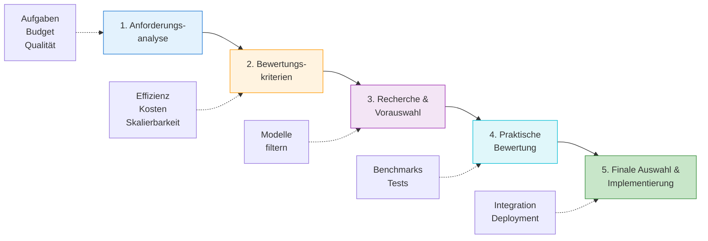

# Modellauswahl
{: .no_toc }

> **LLM-Auswahl: Kriterien, Benchmarks und Entscheidungshilfen**

---

# Inhaltsverzeichnis
{: .no_toc .text-delta }

1. TOC
{:toc}

---

# KI-Modelllandschaft: Ein Überblick
Die moderne KI-Landschaft besteht nicht mehr aus einem einzigen "besten" Modell. Entscheidend ist die passende Kombination aus Qualität, Latenz, Kosten, Kontextfenster, Tool-Nutzung und Medienfähigkeit. Im Kurs wird diese Entscheidung deshalb rollenbasiert getroffen: einfache Aufgaben laufen über kleine Modelle, anspruchsvolle Planung und Bewertung über stärkere Modelle.

- **Frontier-/Reasoning-Modelle**: Geeignet für komplexes Denken, Coding, Agentenplanung, Tool-Nutzung und lange Kontexte.
- **Mini-/Nano-Modelle**: Geeignet für schnelle, günstige Standardaufgaben, Routing, Klassifikation und einfache Synthese.
- **Multimodale Modelle**: Verarbeiten Text und Bilder; je nach Endpunkt auch Audio, Video oder generierte Medien.
- **Bild- und Videomodelle**: Erzeugen oder bearbeiten visuelle Inhalte und werden meist über spezialisierte Medien-Endpunkte verwendet.
- **Transkriptions- und Audiomodelle**: Wandeln Sprache in Text um oder ermöglichen Echtzeit-Sprachinteraktion.
- **Embedding-Modelle**: Wandeln Texte in Vektoren um und bilden die Grundlage für semantische Suche und RAG.

# Kursstandard: Rollenbasierte Modellauswahl

Die praktische Modellwahl im Kurs richtet sich nach `04_modul/genai_lib/model_config.py`. Dort sind Modell-IDs als Rollen definiert, damit Notebooks nicht überall harte Modellnamen enthalten.

| Rolle in `model_config.py` | Modell-ID | Einsatz im Kurs |
|---|---|---|
| `BASELINE` | `openai:gpt-5.4-nano` | einfache Demos, kurze Antworten, kostengünstige Experimente |
| `ROUTER` | `openai:gpt-5.4-nano` | einfache Routing- und Auswahlentscheidungen |
| `TRANSLATOR_FAST` | `openai:gpt-5.4-nano` | schnelle Rohübersetzungen |
| `TRANSLATOR` | `openai:gpt-5.4-mini` | Kursmaterial, Markdown, Dokumentation |
| `WORKER` | `openai:gpt-5.4-mini` | RAG-Synthese, strukturierte Ausgaben, Standardaufgaben |
| `CODING` | `openai:gpt-5.4-mini` | Codegenerierung, Refactoring, technische Agenten |
| `JUDGE` | `openai:gpt-5.4` | Evaluation, Compliance, Sicherheits- und Qualitätsentscheidungen |
| `PLANNER` | `openai:gpt-5.4` | Aufgabenzerlegung, Agentenplanung, komplexe Workflows |
| `TRANSLATOR_PREMIUM` | `openai:gpt-5.5` | hochwertige finale Übersetzungen |
| `JUDGE_PREMIUM` | `openai:gpt-5.5` | kritische Evaluation und maximale Qualität |
| `PLANNER_PREMIUM` | `openai:gpt-5.5` | hochkomplexe Planung und mehrstufige Agentenaufgaben |
| `VISION_FAST` | `openai:gpt-5.4-mini` | einfache Bildanalyse |
| `VISION_PREMIUM` | `openai:gpt-5.4-mini` | anspruchsvollere Bild- oder Frame-Analyse im Kurs |
| `IMAGE_GENERATION` | `gpt-image-1` | Bildgenerierung |
| `IMAGE_GENERATION_PREMIUM` | `gpt-image-2` | hochwertige Bildgenerierung |
| `VIDEO_GENERATION` | `sora-2` | Videoerzeugung |
| `TRANSCRIPTION` | `whisper-1` | Audio-Transkription |
| `EMBEDDINGS` | `text-embedding-3-small` | Vektorsuche und RAG |

> [!NOTE] Aktueller Abgleich 
> Die OpenAI-Dokumentation empfiehlt aktuell `gpt-5.5` als Startpunkt für komplexe produktive Workflows. Für niedrigere Latenz und geringere Kosten nutzt der Kurs kleinere Varianten wie `gpt-5.4-mini` und `gpt-5.4-nano`. Premium-Modelle sollten nur dort eingesetzt werden, wo Evaluationen den Mehrwert zeigen.

**Schnelle Modellwahl-Hilfe im Kurs**

| Anwendungsfall | Rolle verwenden |
|---|---|
| Einfache Demo oder kurze Antwort | `BASELINE` |
| Routing, Klassifikation, einfache Entscheidung | `ROUTER` |
| Standard-RAG, Zusammenfassung, strukturierte Antwort | `WORKER` |
| Code, Refactoring, technische Assistenz | `CODING` |
| Aufgabenplanung und Agenten-Orchestrierung | `PLANNER` |
| Bewertung, Korrektur, Compliance, Sicherheitscheck | `JUDGE` |
| Kritische finale Qualität | `JUDGE_PREMIUM` oder `PLANNER_PREMIUM` |
| Bildanalyse | `VISION_FAST` oder `VISION_PREMIUM` |
| Bildgenerierung | `IMAGE_GENERATION` oder `IMAGE_GENERATION_PREMIUM` |
| Audio-Transkription | `TRANSCRIPTION` |
| RAG-Embeddings | `EMBEDDINGS` |

**Konfigurationsprinzip**

| Regel | Bedeutung |
|---|---|
| Rollen statt harte Modellnamen | Notebooks bleiben leichter wartbar |
| Klein anfangen | Erst Nano/Mini testen, dann gezielt eskalieren |
| Premium nur mit Grund | Stärkere Modelle nur, wenn Qualität, Risiko oder Komplexität es rechtfertigen |
| Reasoning statt Temperature | Bei GPT-5.x-Modellen Qualität über `reasoning.effort` und `text.verbosity` steuern |
| Medien-Endpunkte getrennt behandeln | Bild, Video und Audio folgen nicht immer derselben LangChain-Textrollenlogik |

*Stand: Mai 2026*

# Modellauswahlprozess: Schritt für Schritt

Die Auswahl des optimalen KI-Modells erfordert einen strukturierten Prozess:

## Anforderungsanalyse
- **Definition der Aufgaben**: Festlegen, welche spezifischen Funktionen das Modell erfüllen soll (z.B. Textgenerierung, Fragebeantwortung).
- **Qualitätskriterien**: Bestimmen, welche Qualitätsstandards (Kohärenz, Genauigkeit) erfüllt werden müssen.
- **Domänenkenntnisse**: Identifizieren, welches Fachwissen für die Aufgabe notwendig ist.
- **Antwortgeschwindigkeit**: Definieren, welche Reaktionszeit akzeptabel ist.
- **Budget**: Einen finanziellen Rahmen für die KI-Lösung setzen.

## Bewertungskriterien
- **Verständlichkeit**: Wie klar und nachvollziehbar sind die Modellausgaben?
- **Effizienz**: Wie schnell verarbeitet das Modell Eingaben und liefert Ausgaben?
- **Skalierbarkeit**: Kann das Modell mit steigenden Anforderungen mitwachsen?
- **Kosten**: Wie hoch sind die Betriebs- und Nutzungskosten des Modells?

## Recherche und Vorauswahl
- Verfügbare Modelle anhand der festgelegten Kriterien analysieren und eine Vorauswahl geeigneter Kandidaten bilden.

## Praktische Modellbewertung
- **Quantitative Methoden**: Benchmarks und Metriken verwenden, um die Leistung objektiv zu messen.
- **Qualitative Verfahren**: Nutzerfeedback zur praktischen Verwendbarkeit sammeln.
- **Testphase**: Die Modelle in einer realistischen Umgebung erproben.

## Finale Auswahl und Implementierung
- Eine fundierte Entscheidung für das am besten geeignete Modell treffen und es in die eigenen Systeme integrieren.

[Modellauswahl](https://editor.p5js.org/ralf.bendig.rb/full/8BbTi8Ico) 😊

# Modellkaskade: Mehrere Modelle klug kombinieren
Die Modellkaskade kombiniert mehrere KI-Modelle, um ihre jeweiligen Stärken zu nutzen und Schwächen auszugleichen:

## Beispiel für eine Modellkaskade
1. **Datenanalyse mit pandas**: Analysiert große Datensätze und erstellt statistische Zusammenfassungen
2. **Logische Strukturierung mit `PLANNER`**: Strukturiert die Ergebnisse und erstellt eine logische Gliederung
3. **Textgenerierung mit `WORKER` oder `WORKER_PREMIUM`**: Verfasst gut lesbare Texte basierend auf der Struktur
4. **Multimodale Präsentation**: Ergänzt den Text mit visuellen Elementen

## Vorteile einer Modellkaskade
1. **Effizienzsteigerung**: Jedes Modell wird für seine Stärken optimal eingesetzt
2. **Kostenoptimierung**: Ressourcenschonende Modelle für einfache Aufgaben, teurere nur wo nötig
3. **Flexibilität**: Bearbeitung unterschiedlichster Anforderungen durch spezialisierte Modelle

# Bewertungsmethoden für KI-Modelle
## Wichtige Benchmarks
- **MMLU (Massive Multitask Language Understanding)**: Standard-Benchmark über 57 Fachgebiete, der die Allgemeinbildung und Fachkenntnisse von Modellen misst.

Benchmarkwerte ändern sich schnell und sind nur begrenzt vergleichbar, weil Anbieter unterschiedliche Modellstände, Testmethoden und Prompt-Setups verwenden. Für den Kurs ist deshalb wichtiger, ein eigenes kleines Evaluationsset aufzubauen und die in `model_config.py` definierten Rollen gegen konkrete Kursaufgaben zu testen.

| Bewertungsfrage | Beispielhafte Prüfung |
|---|---|
| Reicht ein kleines Modell? | `BASELINE` oder `WORKER` mit repräsentativen Standardaufgaben testen |
| Braucht die Aufgabe Planung? | `PLANNER` gegen mehrstufige Aufgaben prüfen |
| Braucht die Aufgabe Qualitätssicherung? | `JUDGE` oder `JUDGE_PREMIUM` gegen Fehlerfälle testen |
| Ist Premium nötig? | Qualitätsgewinn gegen zusätzliche Kosten und Latenz abwägen |
| Ist Multimodalität nötig? | `VISION_FAST`, `IMAGE_GENERATION`, `VIDEO_GENERATION` oder `TRANSCRIPTION` nur bei entsprechendem Medium verwenden |

## Bewertungsdimensionen

Die Bewertung von KI-Modellen umfasst verschiedene Aspekte:

1. **Wissens- und Fähigkeitsbewertung**:
   - Wie gut beantwortet das Modell Fragen verschiedener Schwierigkeitsgrade?
   - Wie zuverlässig ergänzt es fehlendes Wissen?
   - Wie gut löst es logische und mathematische Probleme?
   - Wie effektiv nutzt es externe Werkzeuge?

2. **Alignment-Bewertung**:
   - Inwieweit stimmt das Modellverhalten mit menschlichen Werten überein?
   - Wie ethisch und moralisch sind die Antworten?
   - Wie fair und unvoreingenommen ist das Modell?
   - Wie wahrhaftig sind die gelieferten Informationen?

3. **Sicherheitsbewertung**:
   - Wie robust ist das Modell gegenüber Störungen und Angriffen?
   - Welche potenziellen Risiken birgt die Nutzung des Modells?

## Konkrete Bewertungsmethoden

## Automatisierte Metriken
- **BLEU** (_Bilingual Evaluation Understudy_): Bewertet die Ähnlichkeit zwischen generiertem Text und Referenztext anhand übereinstimmender Wortfolgen (_n-Gramme_).
- **ROUGE** (_Recall-Oriented Understudy for Gisting Evaluation_): Bewertet automatisch erzeugte Texte – insbesondere Zusammenfassungen – anhand übereinstimmender Wörter und Wortsequenzen mit einem Referenztext.

## Menschliche Bewertung
- Bewertung nach Kriterien wie Grammatik, Zusammenhang, Lesbarkeit und Relevanz
- Elo-System für den direkten Vergleich verschiedener Modelle (ähnlich wie bei Schach-Ratings)

## KI-basierte Bewertung
- Einsatz leistungsfähiger Modelle zur Bewertung anderer Modelle
- Automatische Erkennung von Fehlinformationen in KI-Antworten

# Praktische Anwendungsbereiche
Die Modellevaluierung und -auswahl findet in verschiedenen Szenarien Anwendung:

## Kundenservice-Chatbots
- Auswahl einer schnellen Rolle wie `BASELINE`, `ROUTER` oder `WORKER`
- Bewertung nach Kundenzufriedenheit und Lösungsrate

## Content-Erstellung
- Nutzung von `WORKER` oder `WORKER_PREMIUM` für Marketing, Social Media und Blogbeiträge
- Bewertung nach Originalität, Engagement und Konversionsraten

## Technische Assistenz
- Einsatz von `CODING`, `PLANNER` oder `JUDGE` für Programmierung, Planung und Fehlerbehebung
- Bewertung nach Codequalität und Lösungsgeschwindigkeit

# Fazit
> [!NOTE] Fazit 
> Modellauswahl ist eine Abwägung zwischen Qualität, Kosten, Geschwindigkeit, Kontextbedarf und Risiko. Benchmarks helfen bei der Vorauswahl, ersetzen aber keine Tests mit eigenen Aufgaben.
> Für produktive Entscheidungen zählen neben Leistungswerten auch Sicherheit, Bias, Nachvollziehbarkeit und laufende Evaluation.

---

## Abgrenzung zu verwandten Dokumenten

| Dokument | Frage |
|---|---|
| [Modell-Auswahl Guide](../../frameworks/modell-auswahl/modell-auswahl-guide.html) | Welche praktischen Designregeln gelten im Kurs für die Modellwahl? |
| [Fine-Tuning](./m18-fine-tuning.html) | Wann reicht Modellwahl nicht mehr und Training wird notwendig? |
| [Context Engineering](../anwendungsmethoden/m21-context-engineering.html) | Welche Kontextstrategie entscheidet mit darüber, ob ein Modell genügt? |

---

**Version:**    1.2 
**Stand:**    Mai 2026 
**Kurs:** Generative KI. Verstehen. Anwenden. Gestalten.
