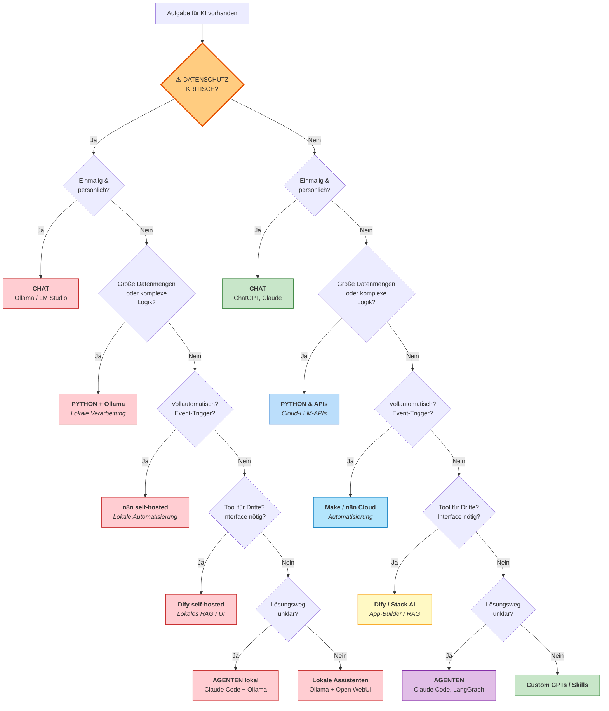
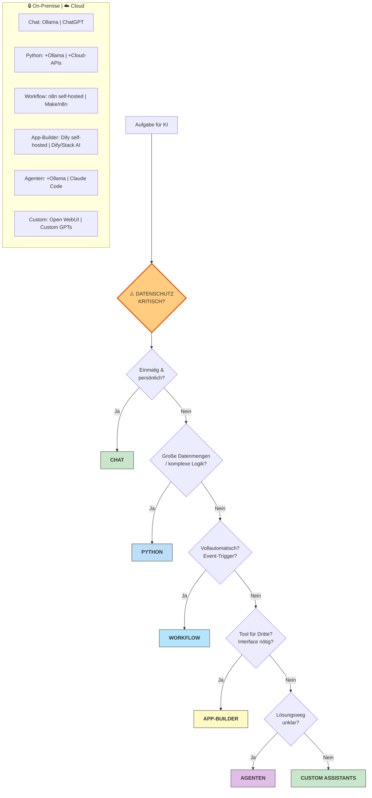

# Aufgabenklassen & Lösungswege – Entscheidungsbaum v2

## Überarbeiteter Entscheidungsbaum (symmetrische Struktur)

## Kompakte Alternativ-Darstellung

Falls die symmetrische Darstellung zu breit wird, hier eine kompaktere Version mit gemeinsamen Entscheidungsknoten:

## Aufgabenklassen-Übersicht (ersetzt "Problemklassen")

| Aufgabenklasse | Kernfrage | 🔒 On-Premise | ☁️ Cloud |
|----------------|-----------|---------------|----------|
| **Ad-hoc-Hilfe** | Einmalig & persönlich? | Ollama, LM Studio | ChatGPT, Claude |
| **Datenverarbeitung** | Große Mengen / komplex? | Python + Ollama | Python + Cloud-APIs |
| **Automatisierung** | Event-basiert / 24/7? | n8n self-hosted | Make, n8n Cloud |
| **Team-Tools** | Interface für Dritte? | Dify self-hosted | Dify, Stack AI |
| **Exploration** | Lösungsweg unklar? | Agenten + Ollama | Claude Code, LangGraph |
| **Persönliche Erweiterung** | Wiederkehrend, klar? | Open WebUI | Custom GPTs |

## Änderungen gegenüber v1

1. **Symmetrische Struktur:** Beide Pfade (On-Premise / Cloud) durchlaufen identische Entscheidungsknoten
2. **Konsistente Logik:** Die Aufgabenklasse bestimmt den Lösungsweg, der Datenschutz nur die Deployment-Variante
3. **Begriffswechsel:** "Problemklassen" → "Aufgabenklassen"
4. **Lokale Chat-Option ergänzt:** Für datenschutzkritische Ad-hoc-Aufgaben (Ollama/LM Studio)
5. **Klarere Farbcodierung:** Rot = On-Premise, Grün/Blau = Cloud
