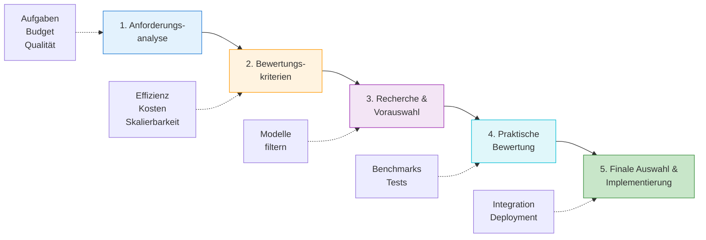

# Modellauswahl
{: .no_toc }

> **LLM-Auswahl: Kriterien, Benchmarks und Entscheidungshilfen**

---

# Inhaltsverzeichnis
{: .no_toc .text-delta }

1. TOC
{:toc}

---

# KI-Modelllandschaft: Ein Überblick
Die moderne KI-Landschaft bietet verschiedene spezialisierte Modelltypen für unterschiedliche Anwendungsfälle:

- **Reasoning-Modelle**: Spezialisiert auf logisches Denken und systematische Problemlösung (z.B. o3-mini) - diese Modelle lösen komplexe Aufgaben durch schrittweises, strukturiertes Denken.
- **Sprachmodelle**: Konzipiert für natürlichsprachliche Aufgaben wie Textgenerierung, Zusammenfassungen und Konversationen (z.B. GPT-4) - sie verstehen und erzeugen menschenähnliche Texte.
- **Codex-Modelle**: Optimiert für Codegenerierung und Programmieraufgaben - diese Modelle können Code schreiben, analysieren und debuggen.
- **Bildgenerierungsmodelle**: Erzeugen Bilder aus textlichen Beschreibungen (z.B. DALL-E) - sie wandeln Textanweisungen in visuelle Ergebnisse um.
- **Sprachverarbeitungsmodelle**: Spezialisiert auf Spracherkennung und -transkription (z.B. Whisper) - sie wandeln gesprochene Sprache in Text um.

# Vergleich wichtiger GPT-Modelle
Die Wahl des richtigen Modells ist entscheidend für optimale Ergebnisse, Ressourcenschonung und maximale Effizienz. Hier ein Überblick der wichtigsten Modelle:

| Modell          | Hauptmerkmale                                                                                                                                                               | Empfohlene Anwendungsfälle                                                                                                                                 |
| --------------- | --------------------------------------------------------------------------------------------------------------------------------------------------------------------------- | ---------------------------------------------------------------------------------------------------------------------------------------------------------- |
| **GPT-5**       | Neuestes Spitzenmodell mit integriertem Denken: Automatische Reasoning-Modi, überlegene Coding-Fähigkeiten, beste Instruktionsbefolgung. 400K Context Window.               | Komplexe Coding-Projekte, Agentic Tasks, Automatisierung, Frontend-Entwicklung, anspruchsvolle Schreibaufgaben. Beste Wahl für professionelle Anwendungen. |
| **GPT-5 Mini**  | Kleinere GPT-5 Version: Schneller und günstiger, behält aber die meisten GPT-5 Fähigkeiten bei. Optimiert für Geschwindigkeit und Kosteneffizienz.                          | Hochvolumen-Anwendungen, Chatbots, Content-Generierung im großen Stil, kostenbewusste Projekte mit hohen Qualitätsansprüchen.                              |
| **GPT-5 Nano**  | Ultraschnelle GPT-5 Variante: Niedrigste Latenz und Kosten der GPT-5 Familie. Für Anwendungen die sofortige Antworten benötigen.                                            | Real-time Anwendungen, Live-Chat, schnelle API-Calls, mobile Apps, IoT-Geräte. Wo Geschwindigkeit wichtiger als maximale Intelligenz ist.                  |
| **GPT-4o**      | Multimodales Allround-Modell: Versteht Text, Bilder und Audio, kann Bilder generieren. Sehr schnell und vielseitig.                                                         | Alltägliche Aufgaben, Brainstorming, Texterstellung, Content-Ideen, Bildanalysen, E-Mails, Konzepte. Gut für schnelle Dialoge und allgemeine Fragen.       |
| **GPT-4o Mini** | Leichtere Version von GPT-4o: Verarbeitet Text und Bilder, ressourcenschonend und günstiger. Deutlich intelligenter als GPT-3.5-turbo.                                      | Einfachere Aufgaben, Bildverarbeitung, schnelle und unkomplizierte Anwendungen, kostengünstige Chatbots.                                                   |
| **o3-mini**     | Reasoning-Modell: Hohe Intelligenz bei niedrigen Kosten und geringer Latenz. Konzipiert für strukturiertes Denken.                                                          | Wissenschaftliche, mathematische und Programmieraufgaben, technische und logische Probleme, faktenbasierte Recherchen.                                     |
| **o4-mini**     | Kompaktes Reasoning-Modell: Optimiert für Geschwindigkeit und Kosteneffizienz. Stark in mathematischen, Programmier- und visuellen Aufgaben.                                | Komplexe Argumentationsstrukturen, technische Aufgaben, Programmierprojekte, visuelles Denken, wissenschaftliche Fragestellungen.                          |
| **o3**          | Leistungsstärkster "Denker": Herausragend in Programmierung, Mathematik, Wissenschaft und visueller Analyse. Arbeitet mit verknüpften Einzelschritten ("Chain-of-Thought"). | Komplexe Recherchen, anspruchsvolle Programmieraufgaben, Datenanalyse, strategische Planung, Code-Review und Debugging. Beste Wahl für höchste Präzision.  |

**Schnelle Modellwahl-Hilfe**

| Anwendungsfall | Empfohlenes Modell |
|---|---|
| 🚀 **Für neue Projekte (2025)** | GPT-5 oder GPT-5 Mini |
| 💰 **Kostenbewusst** | GPT-5 Nano oder GPT-4o Mini |
| 🧠 **Komplexes Reasoning** | o3 oder o3-mini |
| ⚡ **Schnelle Antworten** | GPT-5 Nano oder GPT-4o |
| 🔧 **Coding & Development** | GPT-5 (beste Wahl) oder o3 |
| 🖼️ **Multimodale Aufgaben** | GPT-4o oder GPT-5 |
| 📊 **Datenanalyse** | o3 oder GPT-5 |
| 💬 **Chatbots** | GPT-5 Mini oder GPT-4o Mini |

**API-Namen Übersicht**

| Modell | API-Name |
|--------|----------|
| GPT-5 | `gpt-5` |
| GPT-5 Mini | `gpt-5-mini` |
| GPT-5 Nano | `gpt-5-nano` |
| GPT-4o | `gpt-4o` |
| GPT-4o Mini | `gpt-4o-mini` |
| o3 | `o3` |
| o3-mini | `o3-mini` |
| o4-mini | `o4-mini` |

*Stand: September 2025*

# Modellauswahlprozess: Schritt für Schritt
Die Auswahl des optimalen KI-Modells erfordert einen strukturierten Prozess:

## Anforderungsanalyse
- **Definition der Aufgaben**: Festlegen, welche spezifischen Funktionen das Modell erfüllen soll (z.B. Textgenerierung, Fragebeantwortung).
- **Qualitätskriterien**: Bestimmen, welche Qualitätsstandards (Kohärenz, Genauigkeit) erfüllt werden müssen.
- **Domänenkenntnisse**: Identifizieren, welches Fachwissen für die Aufgabe notwendig ist.
- **Antwortgeschwindigkeit**: Definieren, welche Reaktionszeit akzeptabel ist.
- **Budget**: Einen finanziellen Rahmen für die KI-Lösung setzen.

## Bewertungskriterien
- **Verständlichkeit**: Wie klar und nachvollziehbar sind die Modellausgaben?
- **Effizienz**: Wie schnell verarbeitet das Modell Eingaben und liefert Ausgaben?
- **Skalierbarkeit**: Kann das Modell mit steigenden Anforderungen mitwachsen?
- **Kosten**: Wie hoch sind die Betriebs- und Nutzungskosten des Modells?

## Recherche und Vorauswahl
- Verfügbare Modelle anhand der festgelegten Kriterien analysieren und eine Vorauswahl geeigneter Kandidaten bilden.

## Praktische Modellbewertung
- **Quantitative Methoden**: Benchmarks und Metriken verwenden, um die Leistung objektiv zu messen.
- **Qualitative Verfahren**: Nutzerfeedback zur praktischen Verwendbarkeit sammeln.
- **Testphase**: Die Modelle in einer realistischen Umgebung erproben.

## Finale Auswahl und Implementierung
- Eine fundierte Entscheidung für das am besten geeignete Modell treffen und es in die eigenen Systeme integrieren.

[Modellauswahl](https://editor.p5js.org/ralf.bendig.rb/full/8BbTi8Ico) 😊

# Modellkaskade: Mehrere Modelle klug kombinieren
Die Modellkaskade kombiniert mehrere KI-Modelle, um ihre jeweiligen Stärken zu nutzen und Schwächen auszugleichen:

## Beispiel für eine Modellkaskade
1. **Datenanalyse mit pandas**: Analysiert große Datensätze und erstellt statistische Zusammenfassungen
2. **Logische Strukturierung mit o3-mini**: Strukturiert die Ergebnisse und erstellt eine logische Gliederung
3. **Kreative Textgenerierung mit GPT-4o**: Verfasst ansprechende Texte basierend auf der Struktur
4. **Multimodale Präsentation**: Ergänzt den Text mit visuellen Elementen

## Vorteile einer Modellkaskade
1. **Effizienzsteigerung**: Jedes Modell wird für seine Stärken optimal eingesetzt
2. **Kostenoptimierung**: Ressourcenschonende Modelle für einfache Aufgaben, teurere nur wo nötig
3. **Flexibilität**: Bearbeitung unterschiedlichster Anforderungen durch spezialisierte Modelle

# Bewertungsmethoden für KI-Modelle
## Wichtige Benchmarks
- **MMLU (Massive Multitask Language Understanding)**: Standard-Benchmark über 57 Fachgebiete, der die Allgemeinbildung und Fachkenntnisse von Modellen misst.

| Modell | MMLU-Score |
|--------|------------|
| GPT-4o | 88,7% |
| Gemini 2.0 Ultra | 90,0% |
| Claude 3 Opus | 88,2% |
| Llama 3.1 405B | 87,3% |
| gpt-4o-mini | 70,0% |

## Bewertungsdimensionen

Die Bewertung von KI-Modellen umfasst verschiedene Aspekte:

1. **Wissens- und Fähigkeitsbewertung**:
   - Wie gut beantwortet das Modell Fragen verschiedener Schwierigkeitsgrade?
   - Wie zuverlässig ergänzt es fehlendes Wissen?
   - Wie gut löst es logische und mathematische Probleme?
   - Wie effektiv nutzt es externe Werkzeuge?

2. **Alignment-Bewertung**:
   - Inwieweit stimmt das Modellverhalten mit menschlichen Werten überein?
   - Wie ethisch und moralisch sind die Antworten?
   - Wie fair und unvoreingenommen ist das Modell?
   - Wie wahrhaftig sind die gelieferten Informationen?

3. **Sicherheitsbewertung**:
   - Wie robust ist das Modell gegenüber Störungen und Angriffen?
   - Welche potenziellen Risiken birgt die Nutzung des Modells?

## Konkrete Bewertungsmethoden

## Automatisierte Metriken
- **BLEU**: Misst die Übereinstimmung zwischen generiertem und Referenztext durch Vergleich von Wortgruppen.
- **ROUGE**: Bewertet die Qualität von Zusammenfassungen durch Analyse übereinstimmender Wortsequenzen.

## Menschliche Bewertung
- Bewertung nach Kriterien wie Grammatik, Zusammenhang, Lesbarkeit und Relevanz
- Elo-System für den direkten Vergleich verschiedener Modelle (ähnlich wie bei Schach-Ratings)

## KI-basierte Bewertung
- Einsatz leistungsfähiger Modelle zur Bewertung anderer Modelle
- Automatische Erkennung von Fehlinformationen in KI-Antworten

# Praktische Anwendungsbereiche
Die Modellevaluierung und -auswahl findet in verschiedenen Szenarien Anwendung:

## Kundenservice-Chatbots
- Auswahl eines schnellen Modells mit guter Verständlichkeit und Mehrsprachigkeit
- Bewertung nach Kundenzufriedenheit und Lösungsrate

## Content-Erstellung
- Nutzung kreativer Modelle für Marketing, Social Media und Blogbeiträge
- Bewertung nach Originalität, Engagement und Konversionsraten

## Technische Assistenz
- Einsatz von Reasoning-Modellen für Programmierung und Fehlerbehebung
- Bewertung nach Codequalität und Lösungsgeschwindigkeit

# Fazit
> [!NOTE] Fazit 
> Zusammenfassend lässt sich sagen, dass die **Evaluierung von Large Language Models (LLMs) ein wichtiges Forschungsgebiet** ist, um ihre Fähigkeiten und Grenzen zu verstehen. Die Evaluierung umfasst verschiedene **Attribute wie Grammatikalität, Kohäsion, Gefallen, Relevanz, Flüssigkeit und Bedeutungserhalt**. Sowohl **menschliche Evaluatoren als auch LLMs selbst werden zur Bewertung eingesetzt**. Es gibt **spezifische Benchmarks und Datensätze** zur Bewertung von LLMs in verschiedenen Bereichen wie **Textgenerierung, Fragebeantwortung und Zusammenfassung**.
> Ein wichtiger Aspekt der LLM-Evaluierung ist die **Sicherheitsbewertung**, die **Robustheit gegenüber adversarialen Angriffen** (manipulierte Eingaben, um LLM in die Irre zu führen) und die Identifizierung von **Risiken wie Bias und Toxizität** umfasst. Die Evaluierung kann auch auf **spezialisierte LLMs** in Bereichen wie Medizin, Recht und Finanzen zugeschnitten sein.
> Verschiedene **Metriken, darunter Likert-Skalen und der BLEU-Score**, werden zur Quantifizierung der LLM-Leistung verwendet. Es gibt auch **Tools und Frameworks wie DeepEval**, die die Evaluierung erleichtern. Es ist wichtig zu beachten, dass **Evaluierungsbias existieren können**, beispielsweise eine Präferenz für längere Texte. Die **ethischen Aspekte** spielen ebenfalls eine Rolle bei der Entwicklung und Nutzung von LLMs.

# A | Aufgabe
---

Die Aufgabestellungen unten bieten Anregungen; ebenso möglich ist eine eigene, inhaltlich passende Herausforderung.

Anforderungsanalyse für ein KI-Projekt

Zu entwickeln ist eine strukturierte Anforderungsanalyse für ein fiktives oder reales KI-Projekt.

**Aufgabenstellung:**
1. Einen konkreten Anwendungsfall wählen (z.B. Kundenservice-Chatbot für eine Bank, Content-Generator für Social Media oder Übersetzungstool für technische Dokumentation).
2. Zu definieren sind:
   - Die primären Funktionen, die das KI-Modell erfüllen soll
   - Die spezifischen Anforderungen an das Sprachverständnis
   - Notwendige Fachkenntnisse in relevanten Domänen
   - Anforderungen an die Antwortgeschwindigkeit
   - Budget-Rahmenbedingungen
3. Eine Prioritätenliste dieser Anforderungen erstellen (unbedingt erforderlich, wichtig, wünschenswert).
4. Beschreiben, welche Kompromisse bei konkurrierenden Anforderungen sinnvoll wären.

**Abgabeformat:**
Abgabeformat: Dokument mit der Anforderungsanalyse (1-2 Seiten).

Vergleichsanalyse bekannter KI-Modelle

Durchzuführen ist eine vergleichende Analyse von mindestens drei verschiedenen KI-Modellen anhand vorgegebener Bewertungskriterien.

**Aufgabenstellung:**
1. Drei KI-Modelle aus der folgenden Liste auswählen:
   - GPT-4o
   - Claude 3 Opus
   - Gemini 2.0 Ultra
   - Llama 3.1
   - Mistral 7B
   - Ein anderes aktuelles KI-Modell nach eigener Auswahl

2. Die Leistungsmerkmale dieser Modelle anhand der folgenden Kriterien recherchieren:
   - MMLU-Score oder vergleichbare Benchmark-Ergebnisse
   - Kontextfenstergröße
   - Antwortlatenz
   - Kosten (pro Token oder alternativer Maßstab)
   - Verfügbarkeit (API, Open-Source, etc.)
   - Unterstützte Sprachen
   - Multimodale Fähigkeiten (falls vorhanden)

3. Eine Bewertungstabelle mit den recherchierten Informationen erstellen.

4. Eine begründete Empfehlung verfassen, welches dieser Modelle sich für folgende Szenarien am besten eignen würde:
   - Entwicklung eines kostengünstigen Chatbots für ein kleines Unternehmen
   - Erstellung von KI-generierten Inhalten für ein internationales Nachrichtenportal
   - Unterstützung bei der Software-Entwicklung

**Abgabeformat:**
Vergleichstabelle mit Bewertungen und einer Seite mit Empfehlungen.

Konzept für die qualitative Evaluation eines Sprachmodells

Zu entwickeln ist ein strukturiertes Testverfahren zur qualitativen Bewertung eines Sprachmodells.

**Aufgabenstellung:**
1. Ein Bewertungsschema mit 5-7 qualitativen Kategorien entwerfen, die für die gewählte Anwendung relevant sind (z.B. Genauigkeit, Kreativität, Nützlichkeit der Antworten, Verständnis komplexer Anweisungen, kulturelle Sensibilität).

2. Für jede Kategorie ausarbeiten:
   - Eine klare Definition, was in dieser Kategorie bewertet wird
   - Eine Bewertungsskala (z.B. 1-5 oder 1-10)
   - 2-3 konkrete Testfragen oder -aufgaben, die diese Kategorie prüfen
   - Bewertungskriterien: Was wäre eine ausgezeichnete (5/5) vs. eine unzureichende (1/5) Antwort?

3. Den Evaluationsprozess beschreiben:
   - Wie viele Bewerter sollten eingesetzt werden?
   - Wie lassen sich die Bewertungen sinnvoll zusammenfassen?
   - Welche Maßnahmen helfen, Bewertungsverzerrungen zu vermeiden?

4. Erläutern, wie sich die Ergebnisse dieser qualitativen Bewertung mit quantitativen Metriken wie MMLU zu einem Gesamtbild der Modellleistung verbinden lassen.

**Abgabeformat:**
Ein 2-3 seitiges Konzeptpapier mit Evaluationsschema, Testfragen und geplantem Prozess.

---

## Abgrenzung zu verwandten Dokumenten

| Dokument | Frage |
|---|---|
| [Modell-Auswahl Guide](../frameworks/modell-auswahl-guide.html) | Welche praktischen Designregeln gelten im Kurs für die Modellwahl? |
| [Fine-Tuning](./m18-fine-tuning.html) | Wann reicht Modellwahl nicht mehr und Training wird notwendig? |
| [Context Engineering](./m21-context-engineering.html) | Welche Kontextstrategie entscheidet mit darüber, ob ein Modell genügt? |

---

**Version:**    1.1 
**Stand:**    Januar 2026 
**Kurs:** Generative KI. Verstehen. Anwenden. Gestalten.
