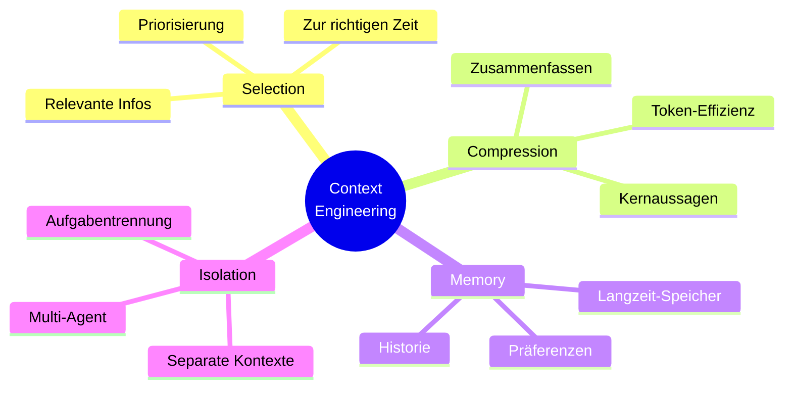

# Context Engineering
{: .no_toc }

> **Context Management: Optimierung von Context-Fenstern und Memory-Strategien**

---

# Inhaltsverzeichnis
{: .no_toc .text-delta }

1. TOC
{:toc}

---


# Was ist Context Engineering?
**Context Engineering** beschreibt die Aufgabe, einem KI-System die richtigen Informationen zur richtigen Zeit bereitzustellen. In einfachen Demos wirkt das oft nebensächlich. In Anwendungen mit längeren Abläufen, mehreren Datenquellen oder wiederkehrenden Anfragen entscheidet der Kontext jedoch oft stärker über die Qualität als der eigentliche Prompt.

In der Praxis zeigt sich schnell: Viele vermeintliche Modellfehler sind in Wirklichkeit Kontextfehler. Es fehlen Daten, irrelevante Informationen verdrängen die wichtigen, oder ältere Angaben werden zusammen mit neuen Informationen verarbeitet. Context Engineering behandelt genau diese Ebene systematisch.

> [!NOTE] Kernidee<br>
> Nicht der "perfekte Prompt" allein entscheidet, sondern die Qualität und Struktur des gesamten Kontexts.

## Der Unterschied zu Prompt Engineering

| Aspekt                 | Prompt Engineering                                                                     | Context Engineering                                                                                    |
| ---------------------- | -------------------------------------------------------------------------------------- | ------------------------------------------------------------------------------------------------------ |
| **Definition**         | Gezielte Formulierung geeigneter Eingabeaufforderungen <br>für KI-Modelle              | Systematisches Design und Management des gesamten <br>Kontexts für KI-Systeme                          |
| **Fokus**              | Einzelne Prompt-Optimierung                                                            | Gesamtes Kontextmanagement und -architektur                                                            |
| **Zeitrahmen**         | Kurzfristig, pro Anfrage                                                               | Langfristig, systemweit                                                                                |
| **Zielgruppe**         | Endnutzer, Content-Ersteller                                                           | Entwickler, Systemarchitekten                                                                          |
| **Hauptziel**          | Bessere Antworten durch optimierte Prompts                                             | Konsistente, kontextbewusste KI-Systeme                                                                |
| **Techniken**          | - Few-Shot Learning  <br>- Chain-of-Thought  <br>- Role-Playing  <br>- Template-Design | - RAG (Retrieval-Augmented Generation)  <br>- Vektorsuche  <br>- Wissensgraphen  <br>- Kontext-Caching |
| **Eingabeformat**      | Textuelle Anweisungen und Beispiele                                                    | Strukturierte Daten, Dokumente, Metadaten                                                              |
| **Skalierbarkeit**     | Begrenzt auf einzelne Interaktionen                                                    | Hochskalierbar für Enterprise-Anwendungen                                                              |
| **Wartung**            | Manuelle Anpassung der Prompts                                                         | Automatisiertes Kontext-Management                                                                     |
| **Fehlerbehandlung**   | Trial-and-Error bei Prompts                                                            | Systematische Kontext-Validierung                                                                      |
| **Messbarkeit**        | Qualitative Bewertung der Antworten                                                    | Quantitative Metriken (Relevanz, Genauigkeit)                                                          |
| **Kosten**             | Niedrig (nur Prompt-Optimierung)                                                       | Höher (Infrastruktur, Datenmanagement)                                                                 |
| **Anwendungsbereich**  | - Chatbots  <br>- Content-Generierung  <br>- Übersetzungen  <br>- Kreative Aufgaben    | - Wissensmanagementsysteme  <br>- Dokumentensuche  <br>- Expertensysteme  <br>- Enterprise-KI          |
| **Herausforderungen**  | - Prompt-Injection  <br>- Inkonsistente Ergebnisse<br>- Begrenzte Kontextlänge         | - Datenqualität  <br>- Kontext-Fragmentierung  <br>- Skalierungskosten                                 |
| **Erfolgsfaktoren**    | - Klare Anweisungen  <br>- Gute Beispiele  <br>- Strukturierte Prompts                 | - Hochwertige Datenquellen  <br>- Effiziente Suche  <br>- Kontext-Relevanz                             |
| **Tools & Frameworks** | - OpenAI Playground  <br>- LangChain PromptTemplates  <br>- Anthropic Console          | - LangChain  <br>- LlamaIndex  <br>- Pinecone  <br>- Weaviate                                          |
| **Zukunftstrend**      | Integration in größere Systeme                                                         | Weiterentwicklung zu autonomen Agenten                                                                 |
| **Best Practices**     | - Iterative Verbesserung  <br>- A/B-Testing  <br>- Klare Rollenverteilung              | - Datengovernance  <br>- Monitoring & Logging  <br>- Kontext-Versionierung                             |

## Fazit

**Prompt Engineering** eignet sich für die Optimierung einzelner Anfragen. **Context Engineering** wird relevant, sobald Informationen ausgewählt, priorisiert, gespeichert oder über mehrere Schritte hinweg konsistent gehalten werden müssen. Robuste Anwendungen brauchen in der Regel beides.

## Warum ist das wichtig?

Nicht jeder Qualitätsgewinn entsteht durch bessere Formulierungen im Prompt. Sobald Dokumente, Memory, Tools oder externe Datenquellen beteiligt sind, verschiebt sich die eigentliche Arbeit in die Kontextarchitektur. Dort wird entschieden, welche Informationen überhaupt in das Modell gelangen und in welcher Form sie dort ankommen.

> [!TIP] Startpunkt<br>
> Sinnvoll ist eine kleine, messbare Kontext-Checkliste. Erst wenn Auswahl, Struktur und Aktualität stabil funktionieren, lohnt sich zusätzliche Komplexität.


# Die vier Grundstrategien


## Kontext Auswählen(Context Selection)
Die richtigen Informationen zur richtigen Zeit bereitstellen.

Selection ist meist der erste Engpass. In vielen Prototypen wird schlicht alles in den Prompt gelegt, was verfügbar ist. Das funktioniert kurzzeitig, skaliert aber schlecht. Gute Systeme entscheiden früh, was für die jeweilige Aufgabe wirklich relevant ist und was nicht in den aktuellen Lauf gehört.

**Beispiel - Versicherungsberatung:**
```
Kundenkontext:
- Alter: 35 Jahre
- Familie: 2 Kinder
- Beruf: Selbständig
- Ziel: Familienabsicherung

→ KI wählt passende Produktinformationen aus
```

## Kontext Komprimieren (Context Compression)
Nur die wichtigsten Informationen behalten.

Kompression ist keine kosmetische Kürzung, sondern eine Qualitätsfrage. Werden Nebensachen genauso ausführlich dargestellt wie entscheidende Fakten, sinkt die Trennschärfe. Zusammenfassungen müssen daher nicht nur kürzer, sondern auch priorisiert sein.

**Beispiel:**
```
Lange Schadenshistorie (50 Seiten)
↓
Zusammenfassung: "3 Kleinschäden in 5 Jahren, 
Gesamtschaden: 2.500€, keine Muster erkennbar"
```

## Kontext Speichern (Context Memory)
Wichtige Informationen für später aufbewahren.

Memory ist besonders dann nützlich, wenn Informationen nicht bei jeder Anfrage neu abgefragt werden sollen. Gleichzeitig entsteht hier schnell technischer und fachlicher Ballast: Was einmal gespeichert wurde, bleibt oft länger im System als sinnvoll. Deshalb gehört zu Memory immer auch eine Regel, wann Kontext verfällt oder überschrieben wird.

**Beispiel:**
```
Kundeninteraktion 1: "Ich bevorzuge niedrige Beiträge"
↓ (gespeichert)
Kundeninteraktion 2: KI erinnert sich an Präferenz
```

## Kontext Trennen (Context Isolation)
Verschiedene Aufgaben mit separaten Kontexten bearbeiten.

Isolation wird oft erst dann relevant, wenn ein System komplexer wird. Spätestens bei Agenten, Werkzeugnutzung oder sensiblen Daten ist sie jedoch zentral. Nicht jede Komponente sollte denselben Kontext sehen. Klare Trennung reduziert Fehler, vereinfacht Debugging und hilft bei Compliance-Fragen.

**Beispiel:**
```
Agent A: Schadensprüfung (hat Zugang zu Schadensdaten)
Agent B: Kundenberatung (hat Zugang zu Produktdaten)
```


# Die drei häufigsten Fehler
> [!WARNING] Typische Ursache für Instabilität<br>
> Instabile KI-Antworten sind oft kein Modellproblem, sondern ein Kontextproblem (zu viel, widersprüchlich oder veraltet).


## Context Overload
**Problem:** Zu viele Informationen verwirren die KI
**Lösung:** Nur relevante Informationen bereitstellen

Overload entsteht nicht nur bei langen Dokumenten. Auch viele kleine, nur teilweise relevante Hinweise können den Fokus verschieben. Typisch ist dann eine Antwort, die formal plausibel wirkt, aber an der eigentlichen Aufgabe vorbeigeht.

## Context Conflict
**Problem:** Widersprüchliche Informationen
**Lösung:** Informationen auf Konsistenz prüfen

Konflikte sind besonders tückisch, weil sie von außen oft wie zufällige Modellschwankungen aussehen. Tatsächlich arbeitet das Modell dann mit mehreren konkurrierenden Quellen. Ohne Priorisierungsregeln oder Versionslogik wird die Antwort instabil.

## Context Staleness
**Problem:** Veraltete Informationen
**Lösung:** Regelmäßige Updates implementieren

Veralteter Kontext fällt in Tests oft nicht auf, weil die Datenbasis dort klein und überschaubar bleibt. Im laufenden Betrieb wird genau das schnell zum Problem: Eine formal saubere Antwort kann fachlich falsch sein, wenn sie auf einem alten Stand beruht.


# Praktische Anwendung
## Kontext analysieren

Vor jeder Optimierung steht die Frage, welche Informationen wirklich notwendig sind. Die entscheidende Unterscheidung lautet nicht "vorhanden oder nicht vorhanden", sondern "kritisch, wichtig oder nur ergänzend". Diese Priorisierung reduziert unnötigen Ballast und macht spätere Entscheidungen nachvollziehbar.

```
Frage: "Welche Versicherung brauche ich?"

Benötigte Kontextinformationen (nach Priorität):
✓ KRITISCH:
  - Alter: 32 Jahre
  - Familienstand: verheiratet, 2 Kinder (3, 7 Jahre)
  - Beruf: Software-Entwickler
  - Einkommen: 65.000€ brutto/Jahr

✓ WICHTIG:
  - Bestehende Absicherungen: KFZ-Haftpflicht, Hausratversicherung
  - Immobilienstatus: Eigenheim (Restschuld 180.000€)
  - Gesundheitsstatus: keine Vorerkrankungen

✓ ERGÄNZEND:
  - Risikobereitschaft: konservativ
  - Finanzielle Ziele: Familienabsicherung, Altersvorsorge
  - Verfügbares Budget: 200€/Monat für Versicherungen
```

## Kontext strukturieren

Struktur hilft nicht nur dem Modell, sondern auch der Entwicklung. Sobald klar benannte Abschnitte für Kundenkontext, Produktkontext und Beratungsziel existieren, lassen sich Fehler schneller lokalisieren. Unstrukturierte Kontextblöcke sind dagegen schwer zu pflegen und kaum testbar.

```
PROMPT-STRUKTUR:

=== KUNDENKONTEXT ===
Demografisch:
- Person: 32 Jahre, männlich, verheiratet
- Familie: 2 Kinder (3, 7 Jahre), Hausfrau-Ehefrau
- Wohnort: Eigenheim, Restschuld 180.000€

Finanziell:
- Einkommen: 65.000€ brutto/Jahr (alleinverdienend)
- Budget Versicherungen: 200€/Monat
- Risikobereitschaft: konservativ

=== PRODUKTKONTEXT ===
Bestehende Absicherung:
- KFZ-Haftpflicht: vollständig
- Hausratversicherung: 50.000€ Versicherungssumme
- Keine weitere Absicherung vorhanden

Relevante Produktkategorien:
- Risikolebensversicherung (Familienabsicherung)
- Berufsunfähigkeitsversicherung (Einkommensschutz)
- Private Unfallversicherung
- Rechtsschutzversicherung

=== BERATUNGSKONTEXT ===
Anfrage: "Welche Versicherung brauche ich?"
Beratungsziel: Bedarfsanalyse und Produktempfehlung
Compliance: Versicherungsberatung nach §34d GewO
```

## Kontext optimieren

Optimierung bedeutet hier nicht, einen Prompt möglichst kompakt zu machen. Ziel ist vielmehr ein Verhältnis aus Kürze, Klarheit und fachlicher Relevanz. Ein guter Kontext spart Tokens, ohne die entscheidenden Signale zu verlieren.

```
OPTIMIERUNGSREGELN für KI-Verarbeitung:

1. TOKEN-EFFIZIENZ (Max. 500 Token für Kontext):
   ❌ "Der Kunde ist 32 Jahre alt und arbeitet als Software-Entwickler..."
   ✅ "Kunde: 32J, Software-Dev, 65k€, verheiratet, 2 Kinder"

2. RELEVANZ-FILTERING:
   Für Versicherungsberatung IMMER relevant:
   - Alter, Familienstand, Beruf, Einkommen
   - Bestehende Policen
   - Gesundheitsstatus (wenn abgefragt)
   
   SITUATIV relevant:
   - Hobbys (nur bei Unfallversicherung)
   - Immobilien (nur bei Sachversicherungen)

3. STRUKTURIERUNG für LLM:
```

AUFTRAG: Versicherungsbedarfsanalyse KUNDE: 32J, Soft-Dev, 65k€, verheiratet, 2Ki(3,7J), Eigenheim(180k€ Schuld) BESTAND: KFZ-Haft, Hausrat(50k€) BUDGET: 200€/Monat PRÄFERENZ: konservativ ZIEL: Familien-/Einkommensabsicherung

AUFGABE: Identifiziere Versicherungslücken und empfehle passende Produkte mit Begründung.

## Konsistenz-Checkliste:

> [!SUCCESS] Qualitätsgate<br>
> Diese Checkliste eignet sich als "Definition of Done" vor jedem produktiven Prompt-Update.

```
- [ ] Gleiche Kategorien in allen Abschnitten verwendet
- [ ] Konkrete Beispiele statt Platzhalter
- [ ] Token-Limits definiert und eingehalten  
- [ ] Relevanz-Kriterien spezifiziert
- [ ] Optimierung messbar (Token-Reduktion, Strukturierung)
```

Die Checkliste ist bewusst schlicht gehalten. In realen Projekten reicht oft schon eine kleine, konsequent angewendete Qualitätsroutine, um die häufigsten Kontextfehler zu vermeiden. Erst danach lohnt sich feinere Optimierung.

# Einfache Tools und Techniken
## Tool 1: Context-Checkliste
```
☐ Sind alle notwendigen Informationen vorhanden?
☐ Sind die Informationen aktuell?
☐ Gibt es Widersprüche?
☐ Ist der Kontext nicht zu lang?
☐ Ist der Kontext relevant für die Aufgabe?
```

## Tool 2: Kontext-Templates
```
**Kundenberatung-Template:**
KUNDE: [Name, Alter, Beruf]
SITUATION: [Aktuelle Lebensumstände]
ZIEL: [Was möchte der Kunde erreichen?]
BUDGET: [Verfügbare Mittel]
PRÄFERENZEN: [Besondere Wünsche]
```

## Tool 3: Einfache Kontextregeln
```
1. Immer aktuellste Daten verwenden
2. Maximal 3 Hauptinformationen pro Kontext
3. Widersprüche sofort klären
4. Kundenspezifische Informationen priorisieren
5. Rechtliche Anforderungen immer beachten
```


# Messbare Verbesserungen
## Vorher vs. Nachher

**Ohne Context Engineering:**
- ❌ 45% Fehlerrate bei Empfehlungen
- ❌ 3+ Nachfragen pro Beratung
- ❌ 15 Min. Bearbeitungszeit

**Mit Context Engineering:**
- ✅ 12% Fehlerrate bei Empfehlungen
- ✅ 1 Nachfrage pro Beratung
- ✅ 8 Min. Bearbeitungszeit

## Erfolgs-Metriken

> [!TIP] Wirkung sichtbar machen<br>
> Sinnvoll sind pro Use Case zwei bis drei Metriken, etwa Fehlerrate, Nachfragen oder Bearbeitungszeit. Erst der Vorher-Nachher-Vergleich zeigt, ob eine Kontextänderung tatsächlich wirkt.
```
Genauigkeit: +65%
Effizienz: +47%
Kundenzufriedenheit: +30%
```


# Sofort umsetzbare Tipps
## Do's
- Mit einfachen Context-Checklisten beginnen
- Feedback systematisch sammeln
- Erfolgreiche Kontextmuster dokumentieren
- Mit den häufigsten Anwendungsfällen starten
- Verbesserungen kontinuierlich messen

## Don'ts
- Nicht zu kompliziert beginnen
- Nicht alle Kontextquellen auf einmal ändern
- Nicht ohne Messungen optimieren
- Nicht vergessen, das Team zu schulen
- Nicht auf Feedback verzichten

> [!WARNING] Häufiger Rollout-Fehler<br>
> Unmessbare Änderungen am Kontext erschweren Ursachenanalyse und führen zu schwer reproduzierbaren Ergebnissen.

---

# Nächste Schritte
## Stufe 1: Grundlagen
- Context Engineering verstehen
- Erste Tools anwenden
- Einfache Verbesserungen umsetzen

## Stufe 2: Fortgeschrittene Techniken
- Automatisierte Kontextauswahl
- KI-gestützte Kontextoptimierung
- Multi-Agenten-Systeme

## Stufe 3: Expertenlevel
- Eigene Context-Engineering-Frameworks
- Komplexe Gedächtnissysteme
- Unternehmensweite Implementierung


> [!NOTE] Skalierungshinweis<br>
> Context Engineering ist keine Spezialdisziplin nur für große Systeme. Schon einfache Techniken verbessern viele Anwendungen spürbar, sofern sie konsequent und messbar eingesetzt werden.


# Aufgabe
## Aufgabe 1: Kontext-Analyse
**Aufgabe:** Eine typische Kundenanfrage aus dem eigenen Bereich analysieren.

**Beispiel:**
```
Kundenanfrage: "Ich suche eine günstige Hausratversicherung"

Fehlende Kontextinformationen:
- Wohnort und Wohnungsgröße?
- Wert der Einrichtung?
- Besondere Risiken?
- Bisherige Schäden?
- Definition von "günstig"?
```

## Aufgabe 2: Kontext-Design
**Aufgabe:** Ein Kontext-Template für die häufigste Aufgabe erstellen.

**Vorlage:**
```
AUFGABE: [Beschreibung]

BENÖTIGTE INFORMATIONEN:
1. [Primäre Info]
2. [Sekundäre Info]
3. [Ergänzende Info]

AUSSCHLUSSKRITERIEN:
- [Was nicht relevant ist]

QUALITÄTSKRITERIEN:
- [Wann ist der Kontext gut?]
```

## Aufgabe 3: Fehler-Identifikation
**Aufgabe:** Typische Kontextfehler im eigenen Arbeitsbereich identifizieren.

**Häufige Fehler:**
```
□ Veraltete Produktinformationen
□ Fehlende Kundenpräferenzen
□ Unvollständige Risikobewertung
□ Ignorierte Ausschlusskriterien
□ Widersprüchliche Datenquellen
```

## Abgrenzung zu verwandten Dokumenten

| Dokument | Frage |
|---|---|
| [Prompt Engineering](./prompt-engineering.html) | Wie wird eine einzelne Anfrage formuliert, statt den Gesamtkontext eines Systems zu gestalten? |
| [RAG-Konzepte](./rag-konzepte.html) | Wann ist Retrieval nur ein Teil der Kontextstrategie? |
| [Fine-Tuning](./m18-fine-tuning.html) | Wann wird Verhalten ins Modell verlagert statt zur Laufzeit organisiert? |


---

**Version:**    1.1<br>
**Stand:**    Januar 2026<br>
**Kurs:** Generative KI. Verstehen. Anwenden. Gestalten.
