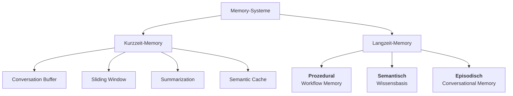
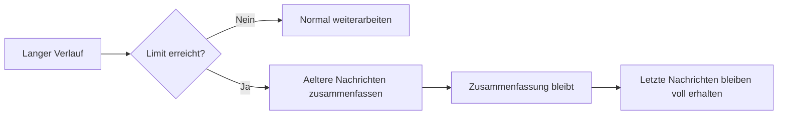
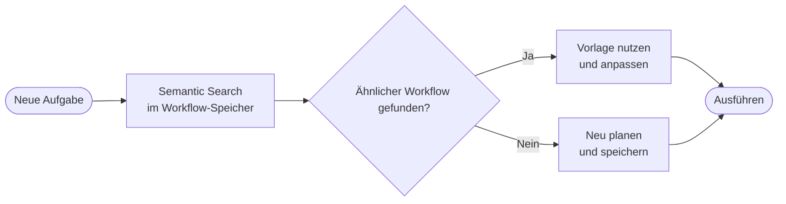
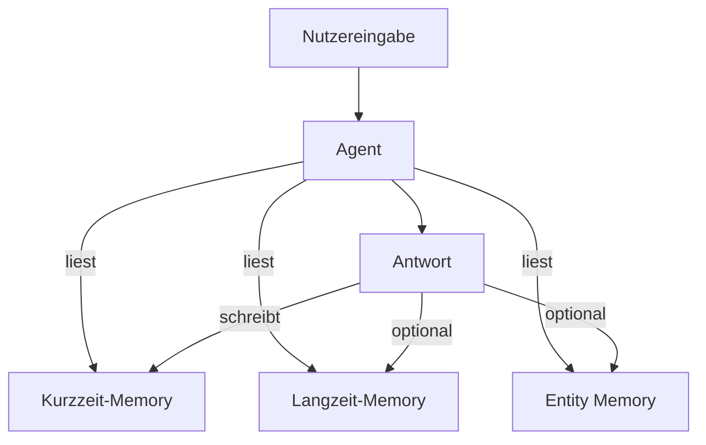
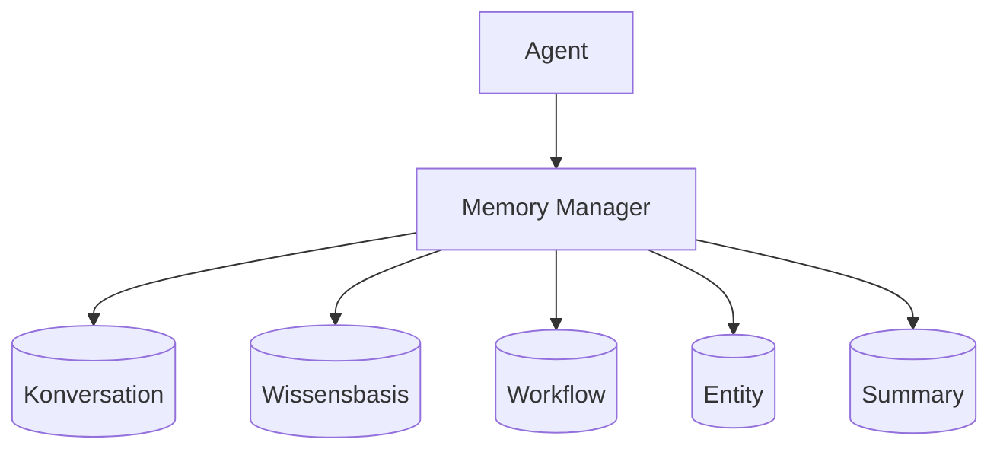
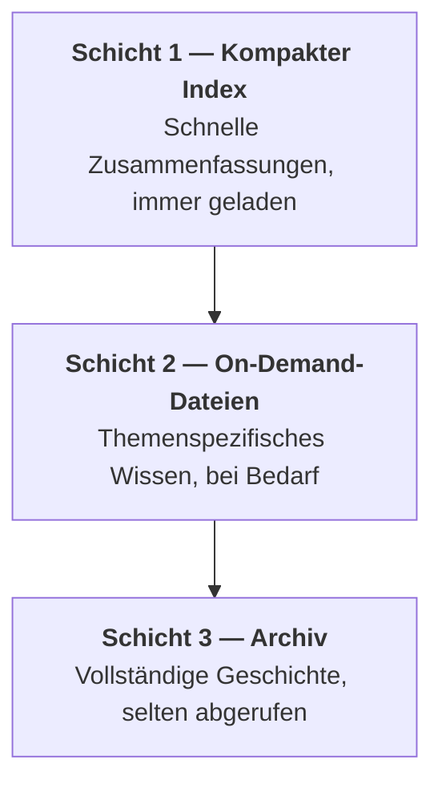

# Memory-Systeme
{: .no_toc }

> **Memory macht aus einem einmaligen Modellaufruf ein System, das Kontext behalten kann.**

---

# Inhaltsverzeichnis
{: .no_toc .text-delta }

1. TOC
{:toc}

---

## Warum Agenten überhaupt ein Gedächtnis brauchen

Ein Sprachmodell bringt kein dauerhaftes Gedächtnis mit. Ohne zusätzliche Mechanismen beginnt jede Konversation praktisch von vorn. Nutzerpräferenzen gehen verloren, frühere Entscheidungen verschwinden, und wichtige Fakten müssen immer wieder neu genannt werden. Für einfache Einmalanfragen ist das oft egal. Für mehrstufige Agenten, persönliche Assistenten oder längere Sitzungen wird es schnell zum Problem.

Memory-Systeme lösen genau diese Lücke. Sie speichern nicht nur Gesprächsverlauf, sondern je nach Bedarf auch verdichtete Zusammenfassungen, strukturierte Entitäten oder dauerhaftes Wissen über Sitzungen hinweg. Damit entsteht ein entscheidender Unterschied zwischen einem Modellaufruf und einem wiederverwendbaren Agentensystem.

Typischer Fehler: Alles, was ein Agent behalten soll, einfach im Prompt zu wiederholen. Das skaliert schlecht, wird teuer und verliert bei langen Sitzungen schnell die Übersicht.

## Ein einfaches Beispiel

Ein Assistent soll sich merken, dass eine Nutzerin kurze Antworten bevorzugt, an einem Python-Kurs arbeitet und in einer späteren Sitzung nach genau diesem Thema weiterlernen will. Ohne Memory müsste diese Information jedes Mal neu genannt werden. Mit einem geeigneten Gedächtnissystem kann der Agent in der laufenden Sitzung den unmittelbaren Kontext halten und zusätzlich langfristig relevante Fakten speichern.

Dieses Beispiel zeigt bereits die wichtigste Unterscheidung: Nicht alles, was ein Agent behalten soll, gehört in dieselbe Form von Memory. Für den letzten Gesprächsverlauf braucht es etwas anderes als für dauerhafte Nutzerfakten.

## Stateless Agent vs. Memory-Augmented Agent

Ein **Stateless Agent** kann Eingaben wahrnehmen, darüber nachdenken und Ausgaben produzieren — aber er behält keine Informationen zwischen einzelnen Turns. Jede Interaktion beginnt von vorn.

Ein **Memory-Augmented Agent** ergänzt diese Fähigkeiten um eine externe Speicherkomponente. Frühere Interaktionen, Fakten und Prozessschritte bleiben erhalten und können in späteren Turns genutzt werden.

| Eigenschaft | Stateless Agent | Memory-Augmented Agent |
|---|---|---|
| Long-Horizon-Aufgaben | nicht möglich | möglich |
| Kontextkontinuität | endet mit dem Turn | sitzungsübergreifend |
| Anpassungsfähigkeit | keine | wächst mit jeder Interaktion |
| Operationskosten | hoch (immer vollständiger Kontext nötig) | niedriger (nur relevanter Kontext) |
| Zuverlässigkeit bei mehrstufigen Abläufen | gering | hoch |

Typischer Fehler: Stateless-Verhalten wird als Modellschwäche fehlgedeutet. Das Modell ist nicht "vergesslich" — es fehlt die persistente Speicherschicht.

## Zwei Grundformen von Memory

Für Einsteiger ist die Trennung zwischen Kurzzeit- und Langzeit-Memory zentral. Kurzzeit-Memory hält fest, was in der aktuellen Sitzung gerade relevant ist. Langzeit-Memory bewahrt Informationen über das Ende einer einzelnen Sitzung hinaus auf.



Kurzzeit-Memory ist fast immer nötig, weil ein Agent sonst schon innerhalb einer Sitzung den roten Faden verliert. **Semantic Cache** ist eine ergänzende Kurzzeit-Strategie: Ähnliche Anfragen werden auf gecachte Vektoreinträge abgebildet, sodass identische oder semantisch nahestehende Fragen ohne erneuten Modellaufruf beantwortet werden können.

Für Langzeit-Memory haben sich drei Hauptkategorien etabliert: **Prozedural** speichert ausgeführte Schrittsequenzen (Workflow Memory), **Semantisch** hält domänenspezifisches Wissen für Ähnlichkeitssuche vor, und **Episodisch** bewahrt die zeitlich geordnete Interaktionshistorie (Conversational Memory).

Langzeit-Memory wird dann wichtig, wenn Personalisierung, Nutzerprofile oder sitzungsübergreifendes Wissen gebraucht werden.

## Conversation Buffer: der einfachste Einstieg

Der einfachste Ansatz besteht darin, alle Nachrichten im State zu behalten. In LangGraph ist das besonders naheliegend, weil der Verlauf direkt Teil des States sein kann. Für kurze Konversationen ist dieser Ansatz didaktisch ideal, weil er kaum zusätzliche Infrastruktur braucht.

```python
from typing import TypedDict, Annotated
from langgraph.graph.message import add_messages

class ChatState(TypedDict):
    messages: Annotated[list, add_messages]

def chat_node(state: ChatState) -> ChatState:
    response = llm.invoke(state["messages"])
    return {"messages": [response]}
```

Grenze: Der Verlauf wächst mit jeder Nachricht. Dadurch steigen Tokenverbrauch, Kosten und die Gefahr, dass das Kontextfenster überschritten wird.

## Sliding Window: wenn nur das Jüngste wichtig ist

Beim Sliding Window werden nur die letzten Nachrichten im aktiven Kontext behalten. Ältere Inhalte fallen aus dem direkten Arbeitsgedächtnis heraus. Diese Strategie ist einfach, günstig und für viele Chats ausreichend, solange frühe Informationen nicht dauerhaft relevant bleiben.

```python
from langchain_core.messages import trim_messages

def chat_node(state: ChatState) -> ChatState:
    trimmed = trim_messages(
        state["messages"],
        max_tokens=4000,
        strategy="last",
        token_counter=llm,
        include_system=True,
        allow_partial=False,
    )
    response = llm.invoke(trimmed)
    return {"messages": [response]}
```

Nicht geeignet, wenn: Frühe Informationen später wieder wichtig werden, etwa Nutzerpräferenzen, offene Aufgaben oder definierte Projektziele.

## Summarization: wenn Kontext erhalten bleiben soll

Statt alte Nachrichten vollständig zu verwerfen, kann ein Agent sie zusammenfassen. Dadurch bleibt die inhaltliche Linie erhalten, ohne dass jede einzelne Nachricht im Modellkontext liegen muss. Genau hier beginnt Summarization Memory.

```python
from langchain_core.messages import RemoveMessage, SystemMessage

class SummaryState(TypedDict):
    messages: Annotated[list, add_messages]
    summary: str

def summarize_node(state: SummaryState) -> SummaryState:
    messages = state["messages"]
    if len(messages) < 10:
        return {}

    existing_summary = state.get("summary", "Keine bisherige Zusammenfassung.")
    to_summarize = messages[:-4]

    prompt = (
        f"Bestehende Zusammenfassung: {existing_summary}\n\n"
        f"Neue Nachrichten zum Einarbeiten:\n"
        + "\n".join(f"{m.type}: {m.content}" for m in to_summarize)
    )
    new_summary = llm.invoke(prompt).content

    to_remove = [RemoveMessage(id=m.id) for m in to_summarize]
    summary_msg = SystemMessage(
        content=f"Bisheriger Gesprächsverlauf (komprimiert): {new_summary}"
    )

    return {
        "messages": [summary_msg] + to_remove,
        "summary": new_summary
    }
```



In der Praxis relevant, wenn: Sitzungen lang werden, aber der frühere Verlauf nicht vollständig verloren gehen darf.

## Context Compaction: Kontext auslagern statt verdichten

Summarization ist eine **lossy**-Technik — beim Verdichten geht immer ein Teil der Information verloren. **Context Compaction** ist die verlustfreie Alternative: Der Kontext wird vollständig in die Datenbank ausgelagert. Im aktiven Kontext bleibt nur eine ID mit einer kurzen Beschreibung. Der Agent kann den vollständigen Inhalt bei Bedarf über die ID wieder abrufen.

| | Context Summarization | Context Compaction |
|---|---|---|
| Verfahren | Kontext durch LLM verdichten | Kontext vollständig in DB auslagern |
| Informationsverlust | lossy (unvermeidlich) | lossless (voller Kontext abrufbar) |
| Wiederherstellung | nicht möglich | via ID + DB-Abfrage |
| Wann sinnvoll | ältere, weniger kritische Inhalte | Details, die vollständig erhalten bleiben müssen |

```python
def compact_context(context: str, thread_id: str, memory_manager) -> str:
    summary_id = memory_manager.store_compacted(context, thread_id)
    description = llm.invoke(
        f"Beschreibe in einem Satz, was dieser Kontext enthält: {context[:500]}"
    ).content
    return f"[Kontext kompaktiert: ID={summary_id} — {description}]"

def expand_context(summary_id: str, memory_manager) -> str:
    return memory_manager.get_compacted(summary_id)
```

In der Praxis relevant, wenn: Der Kontext kritische Details enthält, die bei Summarization verloren gehen würden, oder wenn der vollständige Verlauf später für Debugging oder Audit benötigt wird.

## Langzeit-Memory: wenn Wissen Sitzungen überleben soll

Langzeit-Memory wird nötig, sobald relevante Informationen nach Ende einer Sitzung noch verfügbar sein sollen. Dazu gehören Nutzerpräferenzen, Ziele, wichtige Fakten oder Wissen, das später semantisch wiedergefunden werden soll.

Ein typischer technischer Weg ist semantisches Memory über eine Vektordatenbank. Gespeicherte Fakten werden eingebettet und bei Bedarf per Ähnlichkeitssuche wieder abgerufen.

```python
from langchain_openai import OpenAIEmbeddings
from langchain_community.vectorstores import Chroma
from langchain_core.tools import tool

embeddings = OpenAIEmbeddings(model="text-embedding-3-small")
memory_store = Chroma(
    collection_name="agent_memory",
    embedding_function=embeddings,
    persist_directory="./agent_memory_db"
)

@tool
def memory_speichern(information: str) -> str:
    memory_store.add_texts([information])
    return f"Gespeichert: {information}"

@tool
def memory_abrufen(frage: str) -> str:
    docs = memory_store.similarity_search(frage, k=3)
    if not docs:
        return "Keine relevanten Informationen im Gedächtnis gefunden."
    return "\n".join(f"- {doc.page_content}" for doc in docs)
```

Der Vorteil liegt darin, dass nicht nur exakte Schlüssel gesucht werden, sondern inhaltlich ähnliche Informationen wieder auftauchen können. Das passt gut zu Präferenzen, Erfahrungswissen oder thematischen Fakten.

## Entity Memory: wenn Informationen strukturiert bleiben sollen

Manche Informationen sollen nicht nur auffindbar, sondern geordnet gespeichert werden. Genau dafür eignet sich Entity Memory. Personen, Projekte oder Orte werden als benannte Entitäten im State oder in einem Store abgelegt. Das ist besonders nützlich, wenn ein Agent mit Kundendaten, Projektnamen oder festen Objekten arbeitet.

```python
from pydantic import BaseModel, Field

class EntityMemoryState(TypedDict):
    messages: Annotated[list, add_messages]
    entity_memory: dict

class Entitaet(BaseModel):
    name: str = Field(description="Name der Entität")
    beschreibung: str = Field(description="Beschreibung in einem Satz")

class EntitaetListe(BaseModel):
    entitaeten: list[Entitaet] = Field(description="Extrahierte Entitäten")

FRAGE_PRAEFIXE = ("was ", "wer ", "wie ", "wo ", "wann ", "warum ", "welche", "kennst")

def entity_extractor_node(state: EntityMemoryState) -> EntityMemoryState:
    letzte = state["messages"][-1].content.strip()
    if letzte.endswith("?") or letzte.lower().startswith(FRAGE_PRAEFIXE):
        return {}

    extractor = llm.with_structured_output(EntitaetListe)
    result = extractor.invoke(
        f"Extrahiere wichtige Entitäten (Personen, Projekte, Orte) aus:\n{letzte}"
    )

    updated = dict(state.get("entity_memory", {}))
    for e in result.entitaeten:
        if e.name in updated and e.beschreibung not in updated[e.name]:
            updated[e.name] = updated[e.name] + "; " + e.beschreibung
        else:
            updated[e.name] = e.beschreibung

    return {"entity_memory": updated}
```

Typischer Fehler: Alle Fakten unstrukturiert in eine Vektordatenbank zu schreiben, obwohl bestimmte Informationen besser als klar benannte Entitäten gepflegt würden.

## Workflow Memory: Prozeduralwissen speichern

Workflow Memory speichert die geordnete Sequenz von Schritten, die ein Agent zur Lösung einer Aufgabe durchgeführt hat — inklusive Werkzeugaufrufe, Parameter und Zwischenergebnisse. Bei ähnlichen Aufgaben kann der Agent diese Sequenz per Semantic Search wiederfinden und direkt als Vorlage nutzen, statt den Lösungsweg neu zu planen.

```python
workflow = {
    "name": "Aktuelles Wetter abrufen",
    "anfrage": "Was ist das aktuelle Wetter in Berlin?",
    "schritte": [
        {"schritt": 1, "aktion": "get_location", "ergebnis": "Berlin, 52.5°N 13.4°E"},
        {"schritt": 2, "aktion": "weather_api", "parameter": {"lat": 52.5, "lon": 13.4}},
        {"schritt": 3, "aktion": "format_response", "ergebnis": "15°C, bedeckt"},
    ],
    "ergebnis": "Erfolg"
}
```



Typischer Fehler: Nur Konversationen zu speichern, aber ausgeführte Prozessschritte zu verwerfen. Gerade bei mehrstufigen Tool-Sequenzen ist genau dieser Ablauf das wertvollste wiederverwendbare Wissen.

In der Praxis relevant, wenn: Aufgaben aus mehreren Tool-Aufrufen bestehen, ähnliche Aufgaben häufig wiederkehren oder ein Agent zuverlässig reproduzierbare Sequenzen liefern soll.

## Per-User Memory: wenn mehrere Nutzer getrennt bleiben müssen

Sobald ein Agent von mehreren Nutzern verwendet wird, reicht ein globales Gedächtnis nicht mehr aus. Sitzungen und langfristige Fakten müssen nutzerspezifisch getrennt bleiben. In LangGraph bildet Checkpointing mit Thread-IDs dafür die natürliche Grundlage.

```python
from langgraph.checkpoint.sqlite import SqliteSaver
import sqlite3

conn = sqlite3.connect("user_memory.db", check_same_thread=False)
checkpointer = SqliteSaver(conn)
app = graph.compile(checkpointer=checkpointer)

def get_user_config(user_id: str, session_id: str) -> dict:
    return {
        "configurable": {
            "thread_id": f"{user_id}:{session_id}"
        }
    }
```

Wenn ein Nutzer über mehrere Sitzungen hinweg erinnert werden soll, reicht eine Thread-ID allein nicht aus. Dann braucht es zusätzlich einen Store für nutzerspezifische Fakten, der unabhängig von einzelnen Sessions existiert.

```python
from langgraph.store.memory import InMemoryStore

user_store = InMemoryStore()

def save_user_fact(user_id: str, fact: str):
    namespace = ("user_profiles", user_id)
    existing = user_store.get(namespace, "facts") or {"facts": []}
    existing["facts"].append(fact)
    user_store.put(namespace, "facts", existing)

def get_user_facts(user_id: str) -> list[str]:
    namespace = ("user_profiles", user_id)
    data = user_store.get(namespace, "facts")
    return data["facts"] if data else []
```

## Warum gute Systeme mehrere Memory-Formen kombinieren

In realen Agenten wird Memory selten nur in einer Form eingesetzt. Ein System kann die letzten Nachrichten im State halten, ältere Teile zusammenfassen, Nutzerfakten in einer Vektordatenbank speichern und zusätzlich strukturierte Entitäten pflegen.



```python
class HybridMemoryState(TypedDict):
    messages: Annotated[list, add_messages]
    summary: str
    entity_memory: dict

def chat_with_memory(state: HybridMemoryState) -> HybridMemoryState:
    long_term = memory_store.similarity_search(
        state["messages"][-1].content, k=2
    )
    memory_context = "\n".join(d.page_content for d in long_term)

    system_msg = (
        "Du bist ein hilfreicher Assistent.\n\n"
        f"Gespeicherte Fakten:\n{memory_context}\n\n"
        f"Bekannte Entitäten: {state.get('entity_memory', {})}\n\n"
        f"Bisheriger Verlauf (komprimiert): {state.get('summary', 'Kein Verlauf')}"
    )

    messages = [{"role": "system", "content": system_msg}] + state["messages"]
    response = llm.invoke(messages)
    return {"messages": [response]}
```

Genau darin liegt die eigentliche Architekturentscheidung: Nicht `ob` Memory eingesetzt wird, sondern `welche Art` von Memory für welche Information passend ist.

## Agent Memory Core und Memory Manager

**Agent Memory Core** bezeichnet die Datenbank als primäre Infrastruktur des gesamten Agentensystems. Durch sie fließt der größte Teil aller Datenbewegungen — Speichern, Abrufen und Optimieren aller Memory-Typen. Die drei Systemkomponenten eines Agenten haben jeweils eine eigene Form von Memory: das LLM trägt parametrisches Wissen aus dem Training, das Embedding-Modell kodiert Semantik — aber die Datenbank ist der Memory Core, weil dort der meiste Datenverkehr stattfindet.

**Memory Manager** ist die Abstraktionsschicht über der Datenbank. Statt direkt auf Tabellen zuzugreifen, nutzt der Agent standardisierte Lese- und Schreiboperationen:



```python
class MemoryManager:
    def read_conversational(self, thread_id: str, limit: int = 10) -> list: ...
    def write_conversational(self, thread_id: str, role: str, content: str): ...
    def read_knowledge_base(self, query: str, k: int = 3) -> list: ...
    def write_workflow(self, name: str, steps: list): ...
    def read_entity(self, entity_name: str) -> dict: ...
    def write_summary(self, content: str, thread_id: str) -> str: ...
```

Die Vorteile dieser Abstraktion: Der Agent kennt keine Datenbanktabellen, nur Operationstypen. Das Speicher-Backend kann ausgetauscht werden, ohne den Agenten zu ändern. Alle Zugriffe sind an einer Stelle testbar und überwachbar.

Typischer Fehler: Den Memory Manager als Abstraktionsschicht einzuführen, bevor klar ist, welche Memory-Typen tatsächlich gebraucht werden. Wer alle fünf Tabellen anlegt, obwohl der Agent nur Konversationshistorie braucht, schafft unnötige Infrastruktur — und verdeckt dabei, wo die eigentlichen Engpässe liegen.

## 3-Schicht-Speicher: Memory für Produktionssysteme

In einfachen Agenten wird alles im aktiven Kontext gehalten. In langen Sitzungen oder komplexen Systemen führt das zwangsläufig zu Kontextüberlastung. Produktionssysteme verwenden deshalb einen gestuften Speicher mit drei Schichten:



**Schicht 1 — Kompakter Index:** Ein komprimierter Überblick, der bei jedem Schritt automatisch im Kontext liegt. Enthält Zusammenfassungen, aktive Projektziele und häufig benötigte Fakten.

**Schicht 2 — On-Demand-Dateien:** Detailliertes, themenspezifisches Wissen. Wird nur dann geladen, wenn der Agent aktiv danach sucht oder es für die aktuelle Aufgabe benötigt wird.

**Schicht 3 — Archiv:** Vollständige Transkripte und historische Informationen. Selten abgerufen, aber vorhanden für Audit, Fehlersuche oder tiefe Recherche.

```python
class LayeredMemory:
    def __init__(self):
        self.index: str = ""           # Schicht 1: immer im Kontext
        self.topic_files: dict = {}    # Schicht 2: bei Bedarf laden
        self.archive: list = []        # Schicht 3: selten abgerufen

    def get_context(self, topic: str | None = None) -> str:
        ctx = self.index
        if topic and topic in self.topic_files:
            ctx += "\n\n" + self.topic_files[topic]
        return ctx

    def archive_session(self, transcript: str):
        self.archive.append(transcript)
```

Der entscheidende Vorteil: Statt 50.000 Token auf einmal zu laden, ruft der Agent gezielt das ab, was gerade relevant ist. Das verhindert Kontextüberlastung und hält die Kosten stabil.

In der Praxis relevant, wenn: Sitzungen viele Iterationen umfassen, das System mit mehreren Projekten arbeitet oder Wissen über lange Zeiträume erhalten bleiben soll.

## Was in der Praxis schnell schiefgeht

Viele Systeme speichern zu viel, zu wahllos oder zu unsauber getrennt. Kurze Floskeln wie `ok` oder `danke` gehören selten in ein dauerhaftes Gedächtnis. Sensible personenbezogene Daten sollten nicht unreflektiert in Vektordatenbanken landen. Ebenso problematisch ist es, Memory ohne Löschstrategie aufzubauen.

Typischer Fehler: Aktiver Aufgabenstatus und Gesprächsverlauf werden im selben Kontext gemischt. Wenn der laufende Arbeitsstand eines mehrstufigen Prozesses und die bisherigen Nutzer-Nachrichten im selben Speicher landen, beginnt das Modell beides gleichwertig zu behandeln. Ältere Gesprächsinhalte können dann die aktuelle Aufgabenlogik überlagern. Die Gegenmaßnahme ist eine strikte Trennung: Aufgabenstatus gehört in einen eigenen State-Container, der unabhängig vom Nachrichtenverlauf gelesen und überschrieben werden kann.

```python
def sollte_gespeichert_werden(nachricht: str) -> bool:
    if len(nachricht) < 30:
        return False
    floskel_woerter = ["ok", "danke", "hallo", "tschuess", "ja", "nein"]
    return not all(w in nachricht.lower() for w in floskel_woerter)
```

| Empfehlung | Warum sie wichtig ist |
|---|---|
| Keine PII unkritisch einbetten | Embeddings sind kein Freifahrtschein für sensible Daten |
| Lösch- und Ablaufregeln definieren | Gedächtnis darf nicht unkontrolliert wachsen |
| Nutzerkontrolle anbieten | rechtliche und organisatorische Nachvollziehbarkeit |
| Relevanz vor dem Speichern prüfen | sonst füllt sich das Memory mit Ballast |

## Was für Einsteiger zuerst wichtig ist

Für einen ersten Agenten reicht meist ein einfaches Schema: Kurzzeit-Memory im State, bei längeren Gesprächen optional eine Zusammenfassung und nur dann Langzeit-Memory, wenn echte Personalisierung oder sitzungsübergreifendes Erinnern gebraucht wird. Damit bleibt die Architektur verständlich und trotzdem praxisnah.

Developer unterschätzen oft, dass Memory nicht nur eine Komfortfunktion ist. Ohne Gedächtnis werden viele scheinbar intelligente Agenten schon nach wenigen Nachrichten brüchig oder müssen dieselben Informationen immer wieder neu erfragen.

## Abgrenzung zu verwandten Dokumenten

| Dokument | Frage |
|---|---|
| [State Management](./state-management.html) | Wie sind Nachrichten, Variablen und andere Zustandsdaten im Graph organisiert? |
| [LangGraph Einsteiger](../frameworks/einsteiger-langgraph.html) | Wie werden State und Wiederaufnahme in Workflows technisch umgesetzt? |
| [Human-in-the-Loop](./human-in-the-loop.html) | Wie wirkt sich gespeicherter Kontext auf Unterbrechung und Freigabe aus? |

---

**Version:** 1.4<br>
**Stand:** April 2026<br>
**Kurs:** Generative KI. Verstehen. Anwenden. Gestalten.


