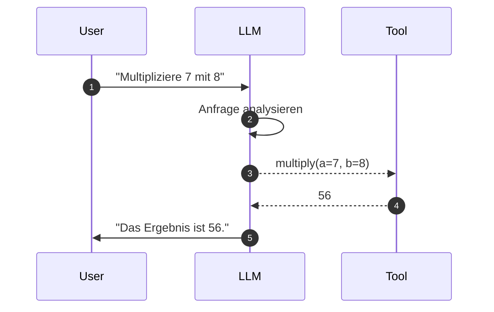
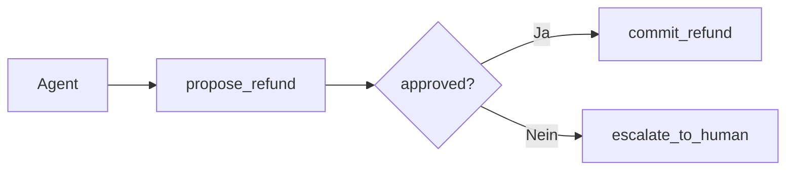

# Tool Use & Function Calling
{: .no_toc }

> **Ein Agent wird erst dann handlungsfähig, wenn er mehr kann als Text erzeugen.**

---

# Inhaltsverzeichnis
{: .no_toc .text-delta }

1. TOC
{:toc}

---

## Warum ein Modell allein oft nicht reicht

Sprachmodelle sind stark im Formulieren, Zusammenfassen und Interpretieren von Text. Sie haben aber klare Grenzen. Sie kennen nicht automatisch aktuelle Informationen, können nicht zuverlässig rechnen, greifen nicht selbst auf Dateien zu und führen keine Aktionen in externen Systemen aus. Genau an dieser Stelle beginnt Tool Use.

Werkzeuge erweitern die Fähigkeiten eines Modells über reines Sprachwissen hinaus. Das Modell entscheidet, ob ein Werkzeug gebraucht wird und welche Parameter dafür sinnvoll sind. Der eigentliche Aufruf wird danach von der Anwendung oder dem Agentensystem ausgeführt.

| Grenze des Modells | Typisches Beispiel | Werkzeug löst das Problem |
|---|---|---|
| kein aktuelles Wissen | Wetter, Aktienkurse, heutige Termine | API oder Websuche |
| keine verlässliche Berechnung | `17 * 243` | Rechen-Tool |
| kein Dateizugriff | PDF oder Textdatei lesen | Datei-Tool |
| keine echte Außenwirkung | Termin buchen, E-Mail senden | Kalender- oder Mail-Tool |

> [!NOTE] Das Modell führt das Tool nicht selbst aus<br>
> Es erzeugt nur die strukturierte Absicht, ein Tool zu verwenden. Die Anwendung validiert und führt den eigentlichen Code aus.

## Ein einfaches Beispiel

Ein Assistent soll die Anfrage `Multipliziere 7 mit 8` beantworten. Ohne Tool könnte das Modell korrekt antworten, aber die Antwort wäre nicht verlässlich aus einer kontrollierten Operation abgeleitet. Mit Tool Use erkennt das Modell, dass eine Berechnung nötig ist, erzeugt einen Aufruf an `multiply(a=7, b=8)` und nutzt das Ergebnis danach in der Antwort.

Genau dieses Muster skaliert später auf realere Fälle: Datenbankabfragen, Websuche, Dateilesen oder Freigabeprozesse.

## Was Function Calling eigentlich bedeutet

Function Calling ist der Mechanismus, mit dem ein Modell strukturiert angibt, welches Tool mit welchen Parametern ausgeführt werden soll. Das Modell formuliert also nicht nur freien Text, sondern einen maschinenlesbaren Aufruf.



Für das Modell ist ein Tool letztlich ein Schema mit Name, Beschreibung und Parametern. Anhand dieser Informationen entscheidet es, ob ein Tool passt.

```json
{
  "name": "multiply",
  "description": "Multipliziert zwei Zahlen.",
  "parameters": {
    "type": "object",
    "properties": {
      "a": {"type": "integer", "description": "Erste Zahl"},
      "b": {"type": "integer", "description": "Zweite Zahl"}
    },
    "required": ["a", "b"]
  }
}
```

Typischer Fehler: Zu denken, dass das Modell damit bereits sicher und korrekt gehandelt hat. In Wahrheit beginnt Sicherheit erst bei Validierung, Begrenzung und kontrollierter Ausführung.

## Tools definieren mit `@tool`

In LangChain werden Tools typischerweise mit dem `@tool`-Decorator definiert. Docstring und Type Hints erzeugen dabei das Schema, das das Modell später sieht.

```python
from langchain_core.tools import tool

@tool
def multiply(a: int, b: int) -> int:
    """Multipliziert zwei ganze Zahlen.

    Args:
        a: Erste Zahl
        b: Zweite Zahl

    Returns:
        Das Produkt von a und b
    """
    return a * b
```

Dieses Minimalbeispiel zeigt bereits zwei Grundregeln: Type Hints sind notwendig und der Docstring ist nicht bloß Dokumentation für Menschen, sondern Steuerungsinformation für das Modell.

## Warum gute Docstrings über die Tool-Auswahl entscheiden

Das Modell wählt ein Tool nicht aufgrund des Python-Codes, sondern auf Basis von Name, Beschreibung und Parametern. Ein schlechter Docstring führt deshalb oft zu falscher oder ausbleibender Tool-Nutzung, selbst wenn die Implementierung technisch korrekt ist.

```python
@tool
def search(q: str) -> str:
    """Sucht etwas."""
    return do_search(q)
```

Dieses Beispiel ist zu vage. Es bleibt offen, wonach gesucht wird, in welchem Bereich gesucht wird und wann das Tool überhaupt verwendet werden soll.

Ein deutlich besserer Docstring grenzt den Zweck, die typischen Anwendungsfälle und die Ausschlüsse explizit ein.

```python
@tool
def search_company_documents(query: str) -> str:
    """🔍 FIRMEN-DOKUMENTENSUCHE – Durchsucht interne Dokumente.

    Verwende dieses Tool für Fragen zu:
    - Unternehmensrichtlinien und Prozessen
    - Produktinformationen und Handbüchern
    - internen Regelwerken und Compliance

    NICHT geeignet für: Allgemeinwissen, aktuelle Nachrichten, Berechnungen.

    Args:
        query: Suchbegriff oder Frage in natürlicher Sprache

    Returns:
        Relevante Textpassagen aus den Firmendokumenten
    """
    return document_retriever.search(query)
```

In der Praxis relevant, wenn: Mehrere ähnliche Tools verfügbar sind und das Modell klar unterscheiden soll, welches Werkzeug wofür gedacht ist.

## Negative Boundaries verhindern Tool-Verwechslungen

Sobald ein Agent mehrere ähnliche Werkzeuge verwaltet, entsteht leicht Tool-Overlap. Zwei Tools „suchen“ beide etwas, aber in unterschiedlichen Datenräumen. Ohne klare Ausschlüsse kann das Modell schwer entscheiden, welches Werkzeug gemeint ist.

```python
@tool
def search_products(query: str) -> str:
    """🛒 PRODUKTSUCHE – Durchsucht den Produktkatalog.

    NICHT geeignet für: Kundendaten, Bestellungen, Rechnungen.
    Verändert KEINE Daten.
    """
    ...

@tool
def search_customers(query: str) -> str:
    """👤 KUNDENSUCHE – Durchsucht die Kundendatenbank.

    NICHT geeignet für: Produktinfos, Lagerbestand, Preise.
    Sendet KEINE E-Mails.
    """
    ...
```

Gerade bei Agenten mit vielen Tools ist diese Negativabgrenzung kein Zusatz, sondern ein wichtiges Architekturmittel. Sie reduziert Fehlgriffe des Modells deutlich.

## Type Hints sind Pflicht

Ohne Type Hints entsteht kein sauberes Schema. Das Modell weiß dann nicht zuverlässig, welche Parameter es liefern soll oder welche Datentypen erwartet werden.

```python
# Falsch
@tool
def add(a, b):
    """Addiert zwei Zahlen."""
    return a + b

# Richtig
@tool
def add(a: int, b: int) -> int:
    """Addiert zwei ganze Zahlen."""
    return a + b
```

> [!WARNING] Fehlende Type Hints erzeugen schwache Tool-Schemata<br>
> Wenn das Schema unvollständig ist, kann das Modell Parameter falsch oder gar nicht befüllen.

## Pydantic als Vertrags-Schicht

Bei produktionsnäheren Tools reicht ein Docstring oft nicht aus. Dann wird ein Pydantic-Modell zur eigentlichen Contract-Schicht. Es definiert zugleich das Schema, validiert die Eingaben und macht Übergaben zwischen Komponenten konsistent.

```python
from pydantic import BaseModel, Field
from langchain_core.tools import tool

class RefundRequest(BaseModel):
    customer_id: str = Field(description="Eindeutige Kunden-ID")
    amount: float = Field(ge=0, description="Erstattungsbetrag in EUR")
    reason: str = Field(description="Begründung der Erstattung")

@tool(args_schema=RefundRequest)
def process_refund(customer_id: str, amount: float, reason: str) -> dict:
    """💰 ERSTATTUNG – Verarbeitet eine geprüfte Rückerstattung.

    NICHT geeignet für: Kontosperrungen, Kundendaten-Änderungen.
    Prüft KEINE Berechtigung – dafür zuerst Policy prüfen.
    """
    return {"status": "processed", "amount": amount}
```

Der Vorteil liegt darin, dass Schema und Validierung nicht auseinanderdriften. Genau deshalb ist Pydantic für höherwertige Tool-Schnittstellen oft sinnvoll.

## Fehlerbehandlung gehört in jedes Tool

Ein Tool kann fehlschlagen: Datei nicht gefunden, Datenbank nicht erreichbar, Eingabe ungültig. Gute Tools liefern deshalb nicht nur einen Absturz, sondern eine verständliche Rückmeldung, mit der der Agent weiterarbeiten kann.

```python
@tool
def safe_divide(a: float, b: float) -> str:
    """Dividiert a durch b mit Fehlerbehandlung."""
    try:
        if b == 0:
            return "Fehler: Division durch Null ist nicht erlaubt."
        return f"Ergebnis: {a / b:.4f}"
    except Exception as e:
        return f"Fehler bei der Berechnung: {str(e)}"
```

Das gilt auch für externe Systeme:

```python
@tool
def query_database(sql: str) -> str:
    """🗄️ DATENBANK – Führt eine SQL-SELECT-Abfrage aus."""
    try:
        if not sql.strip().upper().startswith("SELECT"):
            return "Fehler: Nur SELECT-Anweisungen sind erlaubt."
        result = database.execute(sql)
        return f"Ergebnis: {result}"
    except ConnectionError:
        return "Fehler: Keine Verbindung zur Datenbank."
    except TimeoutError:
        return "Fehler: Abfrage hat zu lange gedauert."
    except Exception as e:
        return f"Unerwarteter Fehler: {str(e)}"
```

Typischer Fehler: Nur `Error` zurückzugeben. Ein Agent braucht eine informative Fehlermeldung, sonst kann er weder sinnvoll erklären noch sinnvoll weiterfragen.

## Tool-Ausgaben vor dem Weitergeben filtern

Was ein Werkzeug zurückgibt, ist nicht automatisch das, was in den Agenten-Kontext fließen sollte. Rohe API-Antworten enthalten oft Statusfelder, verschachtelte Metadaten oder große Mengen irrelevanter Daten. Fließt all das ungefiltert in das Kontextfenster, verbraucht es Token, kann das Modell ablenken und erhöht das Risiko, dass nachfolgende Entscheidungen auf Nebeninformationen statt auf dem Kern basieren.

Typischer Fehler: Die Rückgabe eines API-Aufrufs wird direkt als Tool-Ergebnis übergeben, ohne dass geprüft wird, welche Felder für den nächsten Schritt tatsächlich gebraucht werden. Ein Agent, der zehn Suchresultate mit je fünfzig Feldern erhält, wird keinen dieser Einträge besser auswerten als einen, der fünf Treffer mit drei relevanten Feldern bekommt — er wird es aber langsamer und unzuverlässiger tun.

```python
@tool
def search_products(query: str) -> str:
    """Sucht nach Produkten und gibt eine kompakte Liste zurück."""
    raw = product_api.search(query)
    results = [
        {"id": p["id"], "name": p["name"], "price": p["price_eur"]}
        for p in raw.get("items", [])[:5]
    ]
    return json.dumps(results, ensure_ascii=False)
```

Das Filterverhalten gehört zur Tool-Implementierung, nicht zur Prompt-Gestaltung. Eine saubere Abgrenzung zwischen dem, was die externe API liefert, und dem, was der Agent für seine Entscheidung braucht, ist Teil des Harness-Designs.

## Werkzeuge zunächst isoliert testen

Bevor ein Tool an einen Agenten gebunden wird, sollte es einzeln geprüft werden. Dazu gehört die direkte Ausführung ebenso wie die Kontrolle von Name, Beschreibung und Schema.

```python
print(f"Name: {multiply.name}")
print(f"Beschreibung: {multiply.description}")
print(f"Schema: {multiply.args_schema.schema()}")

result = multiply.invoke({"a": 7, "b": 8})
print(f"Ergebnis: {result}")
```

Gerade in Einsteigerprojekten spart dieser Zwischenschritt viel Zeit, weil unklare Schemas oder fehlerhafte Parameter nicht erst im Agentenverbund auffallen.

## Tools an das Modell binden

Sobald Werkzeuge definiert sind, können sie an ein Modell gebunden werden. Das Modell entscheidet dann selbst, ob ein Tool sinnvoll ist. Mit `bind_tools()` wird zunächst nur die Tool-Absicht erzeugt.

```python
from langchain.chat_models import init_chat_model

llm = init_chat_model("openai:gpt-4o-mini", temperature=0.0)
llm_with_tools = llm.bind_tools([multiply, safe_divide])

response = llm_with_tools.invoke("Was ist 15 mal 23?")
print(response.tool_calls)
```

Erst ein Agent oder eine umgebende Laufzeit führt diesen Aufruf wirklich aus.

```python
from langchain.agents import create_agent

agent = create_agent(
    model=llm,
    tools=[multiply, safe_divide],
    system_prompt="Nutze die verfügbaren Tools für Berechnungen."
)

response = agent.invoke({
    "messages": [{"role": "user", "content": "Berechne 15 mal 23"}]
})
```

## Praktische Tool-Beispiele

Ein Datums-Tool ist nützlich, wenn aktuelle Zeitinformation gebraucht wird:

```python
from datetime import datetime

@tool
def get_current_date() -> str:
    """📅 DATUM – Gibt das aktuelle Datum zurück."""
    now = datetime.now()
    weekdays = ["Montag", "Dienstag", "Mittwoch", "Donnerstag",
                "Freitag", "Samstag", "Sonntag"]
    weekday = weekdays[now.weekday()]
    return f"{weekday}, {now.strftime('%d.%m.%Y')}"
```

Ein Datei-Tool zeigt gut, wie externe Operationen kontrolliert werden:

```python
from pathlib import Path

@tool
def read_file(filepath: str) -> str:
    """📄 DATEI LESEN – Liest den Inhalt einer Textdatei."""
    try:
        path = Path(filepath)
        if not path.exists():
            return f"Fehler: Datei '{filepath}' nicht gefunden."
        if not path.is_file():
            return f"Fehler: '{filepath}' ist keine Datei."

        content = path.read_text(encoding="utf-8")
        if len(content) > 5000:
            return content[:5000] + "\n\n[... Datei gekürzt ...]"
        return content
    except Exception as e:
        return f"Fehler beim Lesen: {str(e)}"
```

Ein Websuch-Tool ist besonders für aktuelle Informationen nützlich, die nicht im Modellwissen liegen:

```python
@tool
def web_search(query: str, num_results: int = 3) -> str:
    """🌐 WEBSUCHE – Durchsucht das Internet nach aktuellen Informationen."""
    return f"Suchergebnisse für '{query}': [Platzhalter für echte Ergebnisse]"
```

## Hochriskante Aktionen brauchen zusätzliche Schranken

Bei Operationen mit realen Folgen, etwa Rückerstattung, Löschung oder Zahlung, reicht ein einzelnes Tool oft nicht aus. Ein sinnvolles Muster ist Two-Step Veto: Zuerst wird geprüft, danach erst ausgeführt.

```python
@tool
def propose_refund(customer_id: str, amount: float) -> dict:
    """💡 ERSTATTUNGSVORSCHLAG – Prüft, führt aber NICHT aus."""
    return PolicyEngine().check_policy(customer_id, amount)

@tool
def commit_refund(customer_id: str, amount: float) -> dict:
    """✅ ERSTATTUNG DURCHFÜHREN – Führt eine bereits geprüfte Erstattung aus."""
    return financial_system.process(customer_id, amount)
```



Wenn nach einer Policy-Prüfung deterministisch feststeht, welches Tool als Nächstes aufgerufen werden muss, kann ein System den nächsten Tool-Schritt auch erzwingen.

```python
if tool_result.get("action_required") == "escalate_to_human":
    client.messages.create(
        model="claude-opus-4-6",
        messages=messages,
        tools=tools,
        tool_choice={"type": "tool", "name": "escalate_to_human"}
    )
```

Nicht geeignet, wenn: Tool-Auswahl generell durch Zwang gesteuert wird. Forced `tool_choice` ist für klare Sonderfälle gedacht, nicht als Dauerersatz für gutes Routing.

## Was für Einsteiger zuerst wichtig ist

Für einen ersten Agenten reichen meist wenige, klar benannte Werkzeuge mit guten Docstrings und sauberer Fehlerbehandlung. Zu viele Tools auf einmal überfordern nicht nur das Modell, sondern auch das eigene Debugging. Ein kleines, klar abgegrenztes Toolset ist fast immer der bessere Start.

Teilnehmende unterschätzen oft, dass Tool Use nicht nur neue Fähigkeiten bringt, sondern auch neue Verantwortung. Sobald ein Agent lesen, suchen, schreiben oder externe Systeme verändern kann, wird Tool-Design zur Sicherheitsfrage.

In der Praxis relevant wenn: Ein Agent auf viele Werkzeuge zugreifen soll, diese aber nicht alle gleichzeitig braucht. Statt alle Tools auf einmal bereitzustellen, kann man dem Agenten zunächst nur wenige, klar beschriebene Einstiegs-Tools geben. Die vollständigen Parameter-Beschreibungen oder spezialisierte Werkzeuge werden erst dann in den Kontext injiziert, wenn der Agent durch einen ersten Tool-Aufruf signalisiert, in welche Richtung er arbeitet. Dieses Prinzip — als **Progressive Disclosure** bezeichnet — reduziert den Token-Verbrauch, verringert mehrdeutige Tool-Auswahlen und macht das Debugging einfacher, weil in jedem Schritt weniger gleichzeitig entschieden wird.

## Abgrenzung zu verwandten Dokumenten

| Dokument | Frage |
|---|---|
| [LangGraph Einsteiger](../frameworks/einsteiger-langgraph.html) | Wie werden Werkzeuge in zustandsbehaftete Workflows eingebettet? |
| [Agent Security](./agent-security.html) | Wie werden Tool-Aufrufe abgesichert und Missbrauch begrenzt? |
| [RAG Konzepte](./rag-konzepte.html) | Wann ist Retrieval die bessere Alternative zu direkten Tool-Aufrufen? |

---

**Version:** 1.4<br>
**Stand:** April 2026<br>
**Kurs:** Generative KI. Verstehen. Anwenden. Gestalten.


