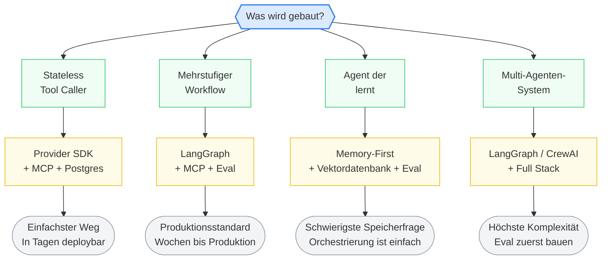

# Minimum Viable GenAI Stack (2026)
{: .no_toc }

> Sechs Schichten zwischen einem LLM und einer produktiven GenAI-Anwendung.

---

# Inhaltsverzeichnis
{: .no_toc .text-delta }

1. TOC
{:toc}

---

## Überblick

Eine produktive GenAI-Anwendung ist nicht nur ein Notebook mit einem API-Key. Ein einfacher Chatbot braucht Inferenz und vielleicht RAG. Sobald Tools, längere Abläufe, Zustandsverwaltung, persistenter Speicher oder Freigabeprozesse hinzukommen, entstehen eigene Infrastrukturprobleme.

Faustregel: Komplexität wird hinzugefügt, wenn etwas Bestimmtes kaputtgeht — nicht vorher.

### Die sechs Schichten

```
1 · Models & Inference    →  Closed APIs · Open-weight APIs · Self-hosted
2 · Protocols & Tools     →  MCP · Browser Use · ACP / A2A
3 · Memory & Knowledge    →  pgvector · Pinecone · Neo4j · Mem0
4 · Frameworks & SDKs     →  LangGraph · OpenAI SDK · CrewAI · ADK
5 · Eval & Observability  →  LangSmith · Langfuse · Braintrust · Arize
6 · Guardrails & Safety   →  NeMo Guardrails · OWASP MCP Top 10
```

### Übersichtstabelle

| Schicht                     | Hier beginnen                                   | Wann aktualisieren                                               |
| --------------------------- | ----------------------------------------------- | ---------------------------------------------------------------- |
| **Model Serving**           | Anthropic oder OpenAI API                       | Selbst-hosten, wenn Kosten oder Latenz es erfordern              |
| **Protokolle & Werkzeuge**  | MCP                                             | Nicht aktualisieren — es ist der Standard                        |
| **Speicher & Wissen**       | Postgres (pgvector) + In-Context-Speicher       | Dedizierte Vektor-DB ab 10M+ Embeddings                          |
| **Frameworks**              | Provider SDK (einfach) oder LangGraph (komplex) | Wenn das SDK zu eng wird                                         |
| **Eval & Observability**    | Langfuse oder Braintrust                        | Wenn benutzerdefinierte Evals im großen Maßstab gebraucht werden |
| **Guardrails & Sicherheit** | NeMo Guardrails + eigene Richtlinienschicht     | Wenn die Agentenzahl die manuelle Überprüfung übersteigt         |

### Bewertungsrahmen

Bei der Werkzeugauswahl auf jeder Schicht helfen drei Fragen:

**Wie viel Zustand muss verwaltet werden?** Ein stateless Tool Caller und ein Multi-Session-Agent, der im Laufe der Zeit lernt, sind unterschiedliche technische Probleme. Die Schichten, in denen das Zustandsmanagement am schwierigsten ist — Speicher und Frameworks —, sind die Bereiche, an denen die meisten Teams hängen bleiben.

**Wie viel Vendor-Lock-in ist tolerierbar?** MCP ist ein offener Standard, Provider-SDKs sind es nicht. Jede Werkzeugwahl erhöht oder verringert, wie schmerzhaft die nächste Migration sein wird.

**Wie groß ist die Lücke zwischen Demo und Produktion?** Einige Schichten (Modell-Serving) haben fast keinen Spalt. Andere (Bewertung, Leitplanken) haben eine erhebliche. Die Schicht, in der die Lücke am deutlichsten spürbar ist, verdient die erste Investition.

---

## Schicht 1: Modelle & Inferenz

Wie das Modell ausgeführt wird, das den Agenten antreibt: API-Aufruf, verwalteter Open-Weight-Anbieter oder selbst gehostet.

| Ansatz | Key Players | Am besten für |
|---|---|---|
| **Closed APIs** | OpenAI, Anthropic, Google | Schnellster Start, neueste Fähigkeiten |
| **Open-weight APIs** | Together AI, Fireworks, Groq | Günstigere Kosten, offene Modelle auf verwalteter Infrastruktur |
| **Self-hosted** | vLLM, SGLang, Ollama | Volle Kontrolle, niedrigste Stückkosten bei Skalierung |

Diese Schicht wird zur Ware gemacht. Modellunterschiede sind jedes Quartal weniger wichtig — die eigentliche Entscheidung ist die Abwägung von Kosten und Latenz, nicht welches Modell "am klügsten" ist. API-Aufrufe sind zustandslos und damit die am einfachsten zu verwaltende Schicht. Das Lock-in-Risiko ist bei geschlossenen APIs hoch (ein Anbieterwechsel bedeutet, Prompts neu abzustimmen und die Eval-Suite erneut zu testen) und bei Open-Weight niedrig. Die Lücke zwischen Demo und Produktion ist die kleinste im Stack: der Demo-API-Aufruf ist identisch mit dem Produktions-Aufruf.

> [!TIP] Fazit<br>
> Selbsthosten lohnt sich, wenn der Umfang der Agentenanrufe API-Preise unmöglich macht oder wenn Latenzen unter 100 ms benötigt werden, die API-Roundtrips nicht liefern können.

---

## Schicht 2: Protokolle & Werkzeuge

Wie der Agent externe Tools und APIs aufruft — über MCP-Server, Browser-Automatisierung oder Agent-zu-Agent-Protokolle.

| Protokoll / Tool | Key Players | Besonderheit |
|---|---|---|
| **MCP** | Agent-to-tool connectivity (universal standard) | 97M+ monatliche SDK-Downloads. Linux Foundation. |
| **Function Calling** | Provider-spezifische Tool-Nutzung | Weiterhin notwendig für manche Patterns. Nicht die Richtung. |
| **Browser Use** | Web-Automatisierungs-Agenten | 78K GitHub-Sterne. Breakout-Kategorie 2025–2026. |
| **ACP / A2A** | Agent-zu-Agent-Kommunikation | IBM (ACP) und Google (A2A). Entstehend, noch kein Standard. |

Die Debatte über das Protokoll ist vorbei: MCP hat gewonnen. Die einzige offene Frage ist, wie MCP-Server abgesichert werden, bevor sie ausgenutzt werden. Zustandsverwaltung entfällt auf dieser Schicht vollständig — der Agent ruft ein Tool an, bekommt eine Antwort, fertig. Das Lock-in-Risiko ist gering, weil MCP ein offener Standard ist. Die Demo-Produktions-Lücke ist mittel: ein Demo-MCP-Server funktioniert problemlos, bis jemand eine bösartige Werkzeugbeschreibung schickt.

> [!TIP] Fazit<br>
> MCP hat standardisiert, wie Agenten Werkzeuge nutzen. Für Agent-zu-Agent-Kommunikation (ACP, A2A) hat noch keiner die kritische Masse erreicht. Wer heute Multi-Agenten-Koordination braucht, baut sie auf der Framework-Ebene selbst.

---

## Schicht 3: Gedächtnis & Wissen

Wie der Agent speichert und abruft, was er weiß — In-Context-Zustand, Vektorsuche oder persistente Speicher über Sitzungen hinweg. Alle drei Stufen führen in denselben Bereich: das Kontextfenster, das der Agent bei jedem Aufruf sieht.

| Stufe | Key Players | Am besten für |
|---|---|---|
| **In-context memory** | Memory blocks, System-Prompt-Zustand | Strukturierter Zustand, der bei jeder Runde gelesen und geschrieben wird |
| **External recall** | pgvector, Pinecone, Qdrant, Neo4j GraphRAG | Relevanten Kontext auf Abruf abrufen (RAG) |
| **Persistent learned state** | Mem0, Zep, Letta | Agenten, die Nutzer und Aufgaben über Sitzungen hinweg erinnern |

Die meisten Teams verkomplizieren das Gedächtnis zu früh. Der Einstieg gelingt mit dem Gesprächsverlauf in Postgres und einem strukturierten Systemprompt — Vektorsuche kommt hinzu, wenn die Historie die Kontextgrenzen überschreitet, agentisches Speichermanagement erst dann, wenn sitzungsübergreifendes Lernen gefordert ist. Diese Schicht hat die höchste Zustandskomplexität im gesamten Stack. Das Lock-in-Risiko ist mittel: pgvector ist portabel (es ist im Kern nur Postgres), spezialisierte Tools wie Mem0 oder Zep sind schwerer zu verlassen. Die Demo-Produktions-Lücke ist groß — Demo-Speicher funktioniert, weil die Kontextfenster groß genug sind; in der Produktion bricht das Gedächtnis, wenn Gespräche lang werden.

> [!TIP] Fazit<br>
> Dedizierte Speicherinfrastruktur (Letta, Zep, Mem0) verdient sich dort, wo Agenten Speicher zwischen Instanzen teilen oder den Zustand zwischen Modellanbieter-Wechseln aufrechterhalten müssen.

---

## Schicht 4: Frameworks & SDKs

Wie Modellaufrufe, Werkzeugnutzung und Steuerfluss miteinander verbunden werden — über das integrierte Toolkit eines Anbieters, ein graphbasiertes Framework wie LangGraph oder Rohcode.

| Ansatz | Key Players | Am besten für |
|---|---|---|
| **Provider SDKs** (neu 2025–26) | OpenAI Agents SDK, Google ADK | Niedrigste Einstiegshürde, auf einen Provider festgelegt |
| **Graph-based orchestration** | LangGraph (90M monatl. Downloads, v1.0 Okt. 2025) | Stateful Production-Workflows, komplexes Branching |
| **Multi-agent frameworks** | CrewAI, AutoGen/AG2, Smolagents | Rollenbasierte Kollaboration, Multi-Agenten-Systeme |
| **Memory-first** | Letta | Agenten, die über Sitzungen hinweg lernen |
| **Build-it-yourself** | Provider API + MCP + thin wrapper | Einfache Agenten, maximale Kontrolle |

> [!WARNING] LangChain ≠ LangGraph<br>
> LangChain ist die Integrationsschicht (Modellkonnektoren, Werkzeugaufrufe, Prompt-Vorlagen). LangGraph ist die Orchestrierungs-Engine (Zustand, Steuerfluss, Graphen). Die meisten Produktionsteams verwenden beides zusammen — die Agentenlogik liegt dabei in LangGraph.

Die meisten Teams wählen zu viel Framework. Wenn der Agent ein Modell und einige Tools aufruft, wird kein LangGraph benötigt — ein Provider-SDK und ein paar Tool-Calls führen schneller in die Produktion als jeder Graph. Das Framework-Lock-in-Risiko ist das höchste im Stack: Orchestrierungscode portiert nicht, ein für CrewAI umgeschriebener LangGraph-Agent ist eine neue Codebasis. Die Demo-Produktions-Lücke ist groß, weil in der Demo nichts schiefgeht — Produktion bedeutet Werkzeugausfälle, Wiederholungen und Auszeiten.

> [!TIP] Fazit<br>
> Das gewählte Framework bestimmt die Migrationskosten. MCP ist die eine Schicht, die über alle Framework-Lager hinweg übertragen wird.

---

## Schicht 5: Bewertung & Beobachtbarkeit

Wie gemessen wird, ob der Agent seine Arbeit erfüllt — Läufe nachverfolgen, Ergebnisse bewerten und Regressionen erkennen, bevor Nutzer es tun.

Die meisten Teams überspringen die Bewertung, bis in der Produktion etwas kaputtgeht. Bis dahin wird blind debuggt. Die LangChain State of Agent Engineering-Umfrage ergab, dass 89 % der Teams mit Produktionsagenten Observability implementiert haben, aber nur 52 % Evaluierungen vorweisen — diese 37-Punkte-Lücke ist der Punkt, an dem Produktionsqualität stirbt. Das Zustandsproblem auf dieser Schicht: ein Agent führt 12 Schritte durch, wählt in Schritt 3 das falsche Werkzeug, und die Schritte 4–12 waren von da an zum Scheitern verurteilt. Wer nur das Endergebnis prüft, findet die Ursache nie. Das Lock-in-Risiko ist moderat, weil die meisten Tools OpenTelemetrie-Traces exportieren. Die Demo-Produktions-Lücke ist die größte aller Schichten.

> [!TIP] Fazit<br>
> Aktuelle Evaluierungswerkzeuge sind am stärksten für Einzelrunden- und Werkzeugaufruf-Bewertungen. Multi-Agenten-Bewertung und Long-Horizon-Task-Assessment sind ungelöste Probleme — wer diese Anforderungen hat, braucht eine maßgeschneiderte Evaluierungsinfrastruktur.

---

## Schicht 6: Leitplanken & Sicherheit

Wie der Agent davon abgehalten wird, Dinge zu tun, die er nicht sollte — Eingaben filtern, Toolaufrufe autorisieren und Ausgaben validieren.

Dies ist die am wenigsten ausgereifte Schicht im Stack. Es gibt kein dominantes Rahmenwerk, keine etablierten Muster. Im Jahr 2024 bedeuteten Leitplanken Ein-/Ausgabefilter bei einem Modell. Im Jahr 2026 ruft der Agent Werkzeuge auf, gibt Geld aus und ergreift Maßnahmen — Leitplanken bedeuten jetzt, Werkzeugaufrufe zu autorisieren, Ratenbegrenzungen durchzusetzen und zu validieren, was der Agent tatsächlich getan hat. OWASP veröffentlichte die MCP Top 10 (Beta) als erste echte Sicherheitscheckliste für tool-verbundene Agenten. Das Zustandsproblem: Leitplanken müssen wissen, was der Agent gerade tut, um zu entscheiden, was er als Nächstes nicht tun sollte — das erfordert Echtzeit-Statusverfolgung. Das Lock-in-Risiko ist gering (individuelle Richtlinien, selbst geschrieben). Die Demo-Produktions-Lücke ist unendlich: die Demo hat keine Schutzmechanismen, weil niemand versucht, sie zu zerstören.

> [!TIP] Fazit<br>
> Bei Multi-Agenten-Workflows, bei denen Agenten sich gegenseitig delegieren, ist die Leitplanken-Propagation über Agentengrenzen hinweg ein ungelöstes Problem. Es braucht benutzerdefinierte Autorisierungslogik.

---

## Stack nach Anwendungstyp

Der Anwendungstyp bestimmt, in welche Schichten investiert wird und welche Werkzeuge jeweils gewählt werden:



| Anwendungstyp | Beispiele | Stack |
|---|---|---|
| **Stateless Tool Caller** | Fragen beantworten, Bestellung nachschlagen, Inventar prüfen | Provider SDK + MCP + Postgres. Kein Framework, keine Vektordatenbank. |
| **Mehrstufiger Workflow** | Rückerstattung End-to-End, PR-Überprüfung, Support-Ticket-Triage | LangGraph + MCP + Evaluierung. Evals vor dem Einsatz erstellen. |
| **Agent, der lernt** | Erinnert sich an Präferenzen, verfolgt Kontext über Wochen | Memory-First-Architektur + Vektordatenbank + Evaluierung. |
| **Multi-Agenten-System** | Agenten delegieren an andere Agenten, parallele Workflows | Full Stack. Evaluierungsinfrastruktur aufbauen, bevor der zweite Agent gebaut wird. |

---

## Cheat Sheet

| Schicht | Zustandsverwaltung | Lock-in-Risiko | Demo → Prod Gap |
|---|---|---|---|
| **Models & Inference** | Keine. Zustandslose API-Aufrufe. | Hoch (closed) / Niedrig (open-weight) | Kleinste |
| **Protocols & Tools** | Keine. Aufruf und Antwort. | Niedrig. MCP ist offen. | Mittel. Sicherheit ist die Lücke. |
| **Memory & Knowledge** | Höchste. Das IST die State Layer. | Mittel. pgvector ist portabel. | Groß. Kontextfenster maskieren es. |
| **Frameworks & SDKs** | Kommt auf das Lager an. SDKs abstrahieren es. | Höchste. Code portiert nicht. | Groß. Fehler nur in Prod. |
| **Eval & Observability** | Jeden Schritt tracen oder blind debuggen. | Moderat. OTel hilft. | Größte. Die meisten haben null Evals. |
| **Guardrails & Safety** | Muss selbst gebaut werden. | Niedrig. Eigener Policy-Code. | Unendlich. Demos haben keine. |

---

## Das große Ganze

Teams, die produktionsreife GenAI-Anwendungen erfolgreich ausliefern, haben drei Dinge gemeinsam: Sie führen bei jedem Einsatz Bewertungen durch, nicht einmal pro Quartal. Ihre Leitplanken sitzen auf der Werkzeugaufruf-Ebene, nicht auf der Ausgangsebene. Ihre Speicherarchitektur wurde bewusst entworfen — nicht von dem übernommen, was das Framework standardmäßig verwendet.

Der Stack wird sich konsolidieren. Provider-SDKs integrieren bereits Speicher, Tool-Calling und grundlegende Evaluierung in eine einzige API. Anfang 2027 werden die meisten Teams jede Schicht nicht mehr separat bauen. Aber auch dann muss bekannt sein, welche Schicht ausgefallen ist, wenn etwas in der Produktion ausfällt — dafür ist dieses Dokument da.

---

## Abgrenzung zu verwandten Dokumenten

| Dokument | Frage |
|---|---|
| [Aus der Entwicklung ins Deployment](./aus-entwicklung-ins-deployment.html) | Wie wird der Übergang vom Jupyter Notebook zur produktionsreifen Anwendung technisch umgesetzt? |
| [Vom Modell zum Produkt](./vom-modell-zum-produkt-langchain-oekosystem.html) | Welche LangChain-Komponenten sind für den Produktionseinsatz relevant? |
| [LangGraph Einsteiger](../frameworks/einsteiger/einsteiger-langgraph.html) | Wie werden mehrstufige Workflows mit State und Routing umgesetzt? |

---

**Version:** 1.0<br>
**Stand:** März 2026<br>
**Kurs:** Generative KI. Verstehen. Anwenden. Gestalten.
