# Agent Builder Einsteiger
{: .no_toc }

> **Agenten ohne Code: Visuelle Workflow-Erstellung mit OpenAI Agent Builder**

---

# Inhaltsverzeichnis
{: .no_toc .text-delta }

1. TOC
{:toc}

---

## 1 Kurzüberblick: Was ist OpenAI Agent Builder?

Während LangChain und LangGraph Code-basierte Frameworks für KI-Agenten sind, ermöglicht **OpenAI Agent Builder** die No-Code-Erstellung komplexer Agent-Workflows durch eine visuelle Drag-and-Drop-Oberfläche.

**Zentrale Fragen, die Agent Builder beantwortet:**

- **Wie erstelle ich komplexe Workflows ohne Programmierung?**
- **Wie orchestriere ich mehrere spezialisierte Agenten?**
- **Wie integriere ich externe Systeme (APIs, Datenbanken) visuell?**
- **Wie deploye ich produktionsreife Agenten mit Versionierung und Monitoring?**


### 1.1 Kernfunktionen

Der **Agent Builder** (Teil von AgentKit, vorgestellt DevDay 2025) bietet:

- **Visuelle Workflow-Erstellung** – Drag-and-Drop für komplexe Abläufe
- **Bedingte Logik** – "Wenn-Dann"-Verzweigungen zwischen Aktionen
- **Multi-Agent-Koordination** – mehrere spezialisierte Agenten orchestrieren
- **Model Context Protocol (MCP)** – Integration von 100+ Services
- **Versioning & Preview** – Workflow-Versionierung und Test-Läufe
- **Code-Export** – TypeScript/Python-Export für weitere Anpassungen

**Vergleich zu Code-basierten Frameworks:**


---

## 2 Agent Builder: Zugang und Interface

### 2.1 Voraussetzungen

- **ChatGPT Enterprise** oder **Edu** Account
- Organisation mit Admin Console
- Zugang über [platform.openai.com/agent-builder](https://platform.openai.com/agent-builder)


### 2.2 Interface-Bereiche

Das Agent Builder Interface ist in drei Hauptbereiche unterteilt:

| Bereich | Funktion | Nutzung |
|---------|----------|---------|
| **Workflows** | Veröffentlichte, produktive Agenten | Production-Deployment |
| **Drafts** | Entwürfe in Bearbeitung | Entwicklung & Testing |
| **Templates** | Vorkonfigurierte Beispiele | Schneller Start |


---

## 3 Workflow-Konzept: Nodes und Edges

Ähnlich wie LangGraph arbeitet Agent Builder mit einem gerichteten Graphen aus **Nodes** (Aktionen) und **Edges** (Verbindungen).

### 3.1 Grundlegende Architektur


### 3.2 Node-Typen im Detail

| Node-Typ | Symbol | Funktion | Beispiel |
|----------|--------|----------|----------|
| **LLM** | 🤖 | Modell-Aufruf mit Prompt | Text-Klassifikation, Zusammenfassung |
| **Tool** | 🔧 | API-Call oder MCP-Server | Datenbank-Query, E-Mail senden |
| **Condition** | 🔀 | Verzweigung basierend auf Daten | "Wenn Priority > 3, dann..." |
| **Human** | 👤 | Human-in-the-Loop Checkpoint | Genehmigung einholen |
| **Subworkflow** | 📦 | Verschachtelung anderer Workflows | Wiederverwendbare Sub-Prozesse |


---

## 4 Praxis-Beispiel: Support-Ticket-Routing

### 4.1 Szenario

Eingehende Support-Tickets sollen automatisch kategorisiert, priorisiert und an die richtige Abteilung weitergeleitet werden.

**Anforderungen:**
- Automatische Kategorisierung (Technical, Billing, Sales)
- Prioritäts-Bewertung (1-5)
- Bedingte Weiterleitung
- Bestätigungs-E-Mail an Kunden

### 4.2 Workflow-Diagramm

```mermaid
flowchart TB
    START([Ticket eingehend]) --> PARSE[Parse Ticket Data]
    PARSE --> LLM[🤖 LLM: Analyze & Categorize]

    LLM --> COND{🔀 Category?}

    COND -->|Technical + Priority > 3| JIRA[🔧 Create JIRA Ticket]
    COND -->|Technical + Priority ≤ 3| QUEUE[🔧 Add to Support Queue]
    COND -->|Billing| FINANCE[🔧 Assign to Finance]
    COND -->|Sales| HUMAN[👤 Human Review Required]

    JIRA --> EMAIL[🔧 Send Confirmation Email]
    QUEUE --> EMAIL
    FINANCE --> EMAIL
    HUMAN --> APPROVAL{Approved?}
    APPROVAL -->|Yes| EMAIL
    APPROVAL -->|No| REJECT[Send Rejection Notice]

    EMAIL --> END([Workflow Complete])
    REJECT --> END

    style START fill:#90EE90
    style END fill:#FFB6C1
    style COND fill:#FFD700
    style LLM fill:#87CEEB
    style HUMAN fill:#FFA500
```



### 4.3 Node-Konfiguration

**LLM Node: "Analyze & Categorize"**
```yaml
Node Type: LLM
Model: gpt-4
Temperature: 0.0

System Prompt: |
  Du bist ein Support-Ticket-Klassifizierer.

  Analysiere das Ticket und gib zurück:
  - category: "technical" | "billing" | "sales"
  - priority: 1-5 (1=niedrig, 5=kritisch)
  - summary: Kurze Zusammenfassung in einem Satz

  Bewerte Priority basierend auf:
  - Dringlichkeit der Sprache
  - Business-Impact
  - Ob es einen Blocker ist

Input: {ticket_text}
Output: JSON {category, priority, summary}
```

**Condition Node: "Category Router"**
```yaml
Node Type: Condition

Branches:
  - IF: output.category == "technical" AND output.priority > 3
    THEN: goto "Create JIRA Ticket"

  - IF: output.category == "technical" AND output.priority <= 3
    THEN: goto "Add to Support Queue"

  - IF: output.category == "billing"
    THEN: goto "Assign to Finance"

  - IF: output.category == "sales"
    THEN: goto "Human Review Required"
```

**Tool Node: "Create JIRA Ticket"**
```yaml
Node Type: Tool (MCP)
MCP Server: jira

Function: create_issue
Parameters:
  project: "SUP"
  type: "Bug"
  summary: {output.summary}
  priority: {output.priority}
  description: {ticket_text}

Output: {jira_id}
```

**Tool Node: "Send Confirmation Email"**
```yaml
Node Type: Tool (API)
Endpoint: POST /api/email/send

Body:
  to: {customer_email}
  subject: "Ticket #{jira_id} wurde erstellt"
  template: "ticket_confirmation"
  data:
    category: {output.category}
    priority: {output.priority}
    summary: {output.summary}
```

### 4.4 Vorteile dieser Architektur

| Vorteil | Beschreibung |
|---------|--------------|
| **Multi-Step-Logik** | Mehrere LLM-Calls orchestrieren |
| **Conditional Branching** | Verschiedene Pfade je nach Kontext |
| **State Management** | Workflow-Status persistent speichern |
| **Error Handling** | Fallback-Strategien für fehlgeschlagene Steps |
| **Human-in-Loop** | Manuelle Review bei unsicheren Fällen |
| **Observability** | Jeder Step wird geloggt und kann debugged werden |

---

## 5 Model Context Protocol (MCP)

MCP verbindet Agent Builder mit 100+ externen Systemen durch standardisierte Server-Integrationen.

### 5.1 MCP-Architektur


### 5.2 Verfügbare MCP-Server (Auswahl)

| Kategorie | MCP-Server | Funktionen |
|-----------|------------|------------|
| **Code & Dev** | GitHub, GitLab | Issues, PRs, Code-Suche |
| **Kommunikation** | Slack, Discord | Nachrichten, Channels |
| **Dokumente** | Google Drive, Notion | Dokumente, Datenbanken |
| **Datenbanken** | PostgreSQL, MongoDB | Queries, CRUD-Operationen |
| **CRM** | Salesforce, HubSpot | Leads, Contacts, Deals |
| **Custom** | Your MCP Server | Beliebige APIs |

### 5.3 Integration in Agent Builder

**Schritt-für-Schritt:**


**Beispiel: GitHub-Integration**

```yaml
Node: "check_critical_issues"
Type: Tool (MCP)
Server: github

Authentication:
  type: oauth
  token: ${GITHUB_TOKEN}

Function: list_issues
Parameters:
  repo: "company/product"
  state: "open"
  labels: ["bug", "critical"]
  sort: "created"
  direction: "desc"

Output Mapping:
  issues_list: response.data
  count: response.data.length
```

**Nutzung im Workflow:**

```mermaid
flowchart LR
    START([Daily Check]) --> GH[🔧 GitHub: Get Critical Issues]
    GH --> COND{🔀 Issues > 0?}
    COND -->|Yes| SLACK[🔧 Slack: Notify Team]
    COND -->|No| END([END])
    SLACK --> END

    style GH fill:#FFA500
    style SLACK fill:#4A154B
```



### 5.4 Custom MCP Server erstellen

Falls kein passender MCP-Server existiert, können Sie einen eigenen erstellen:

```typescript
// Beispiel: Simple MCP Server für Custom API
import { MCPServer } from "@modelcontextprotocol/server";

const server = new MCPServer({
  name: "my-custom-api",
  version: "1.0.0",
  tools: [
    {
      name: "search_database",
      description: "Searches the product database",
      inputSchema: {
        type: "object",
        properties: {
          query: { type: "string" },
          limit: { type: "number", default: 10 }
        }
      },
      handler: async (input) => {
        const results = await fetch(`https://api.mycompany.com/search?q=${input.query}&limit=${input.limit}`);
        return results.json();
      }
    }
  ]
});

server.listen(3000);
```

**Integration in Agent Builder:**
1. Deploy MCP Server (z.B. auf Railway, Fly.io)
2. Agent Builder → Connector Registry → Add Custom MCP Server
3. URL + Auth konfigurieren
4. In Workflows als Tool Node nutzen

---

## 6 Entscheidungshilfe: Agent Builder vs. Code-basierte Frameworks

### 6.1 Vergleichsmatrix

```mermaid
graph TB
    subgraph "Agent Builder (No-Code)"
        AB1[Visuelle Workflows]
        AB2[Built-in MCP Integration]
        AB3[Enterprise Governance]
        AB4[Code Export möglich]
    end

    subgraph "LangChain (Code)"
        LC1[Full Code Control]
        LC2[Custom Tools]
        LC3[Multi-Provider Support]
        LC4[On-Premise Deployment]
    end

    subgraph "LangGraph (Code)"
        LG1[Complex State Machines]
        LG2[Persistence & Checkpointing]
        LG3[Custom Conditional Logic]
        LG4[Self-Hosting Required]
    end

    style AB1 fill:#10a37f
    style LC1 fill:#0066cc
    style LG1 fill:#ff6b6b
```



| Anforderung | Agent Builder | LangChain | LangGraph |
|-------------|---------------|-----------|-----------|
| **Kein Coding erforderlich** | ✅ | ❌ | ❌ |
| **Schnelles Prototyping** | ✅ | ⚠️ | ❌ |
| **Multi-Step-Workflows** | ✅ | ⚠️ | ✅ |
| **Conditional Logic** | ✅ | ⚠️ | ✅ |
| **Volle Code-Kontrolle** | ⚠️* | ✅ | ✅ |
| **On-Premise Deployment** | ❌ | ✅ | ✅ |
| **Multi-Modell (OpenAI + Anthropic)** | ❌ | ✅ | ✅ |
| **Built-in Versionierung** | ✅ | ❌ | ❌ |
| **Built-in Monitoring** | ✅ | ⚠️** | ⚠️** |
| **MCP-Integration** | ✅ Native | ⚠️ Custom | ⚠️ Custom |
| **Kosten (Development)** | Niedrig | Mittel | Hoch |
| **Learning Curve** | Niedrig | Mittel | Hoch |

*Code-Export möglich, aber limitiert
**Mit LangSmith möglich

### 6.2 Use Cases nach Tool

**Agent Builder eignet sich für:**


**LangChain eignet sich für:**

- **Custom Tools** – Spezielle Python-Funktionen als Tools
- **Multi-Provider** – OpenAI + Anthropic + Google
- **On-Premise** – Volle Kontrolle über Deployment
- **RAG-Systeme** – Custom Retriever, Reranking

**LangGraph eignet sich für:**

- **Komplexe State Machines** – Viele bedingte Verzweigungen
- **Long-Running Sessions** – Checkpointing, Pause/Resume
- **Multi-Agent-Systeme** – Koordination vieler Agents
- **Custom Loops** – Reflexion, Self-Correction

---

## 7 Code-Export und Migration zu LangGraph

Agent Builder erlaubt Export von Workflows als TypeScript oder Python-Code für weitere Anpassungen.

### 7.1 Export-Workflow

```mermaid
sequenceDiagram
    participant AB as Agent Builder
    participant EXP as Export Function
    participant CODE as Code Editor
    participant DEP as Deployment

    AB->>EXP: Export Workflow
    EXP->>CODE: TypeScript/Python Code
    CODE->>CODE: Custom Modifications
    CODE->>DEP: Deploy (Vercel, Railway, etc.)

    Note over AB,EXP: Workflow bleibt in Agent Builder editierbar
    Note over CODE,DEP: Code kann unabhängig angepasst werden
```



### 7.2 Agent Builder → LangGraph Migration

**Agent Builder Workflow:**

```yaml
# Visuell erstellt in Agent Builder
Nodes:
  - LLM: categorize_ticket
  - Condition: route_by_category
  - Tool: create_jira
  - Tool: send_email
```

**LangGraph Equivalent:**

```python
from langgraph.graph import StateGraph, END
from langchain_core.messages import HumanMessage

# 1. State Definition
class WorkflowState(TypedDict):
    ticket_text: str
    category: str
    priority: int
    jira_id: str

# 2. Nodes
def categorize_ticket(state: WorkflowState):
    """LLM Node: Kategorisiert Ticket"""
    response = llm.invoke(f"Kategorisiere: {state['ticket_text']}")
    return {
        "category": response.category,
        "priority": response.priority
    }

def route_by_category(state: WorkflowState):
    """Condition Node: Routing-Logik"""
    if state["category"] == "technical" and state["priority"] > 3:
        return "create_jira"
    elif state["category"] == "billing":
        return "assign_finance"
    else:
        return "queue"

def create_jira(state: WorkflowState):
    """Tool Node: JIRA Ticket erstellen"""
    jira_id = jira_client.create_issue(
        summary=state["ticket_text"],
        priority=state["priority"]
    )
    return {"jira_id": jira_id}

# 3. Graph aufbauen
graph = StateGraph(WorkflowState)

graph.add_node("categorize", categorize_ticket)
graph.add_node("create_jira", create_jira)

graph.add_conditional_edges(
    "categorize",
    route_by_category,
    {
        "create_jira": "create_jira",
        "assign_finance": "assign_finance",
        "queue": "queue"
    }
)

graph.add_edge("create_jira", END)

# 4. Kompilieren
app = graph.compile()
```

### 7.3 Wann sollten Sie migrieren?

```mermaid
graph TB
    START{Anforderung prüfen} -->|Volle Code-Kontrolle| MIG[Migration zu LangGraph]
    START -->|On-Premise Deployment| MIG
    START -->|Multi-Provider Support| MIG
    START -->|Custom Conditional Logic| MIG
    START -->|Visual Workflows ausreichend| STAY[Bei Agent Builder bleiben]
    START -->|Enterprise Governance wichtig| STAY
    START -->|Schnelles Iteration| STAY

    MIG --> CODE[Code-basierte Entwicklung]
    STAY --> AB[Agent Builder]

    style MIG fill:#ff6b6b
    style STAY fill:#10a37f
```



**Migrations-Checkliste:**

- ✅ Benötigen Sie Multi-Provider-Support? → LangGraph
- ✅ On-Premise Deployment erforderlich? → LangGraph
- ✅ Sehr komplexe bedingte Logik? → LangGraph
- ✅ Custom Python-Tools notwendig? → LangGraph
- ❌ Visual Workflows ausreichend? → Agent Builder
- ❌ Team hat keine Coding-Kenntnisse? → Agent Builder
- ❌ Enterprise Governance wichtig? → Agent Builder

---

## 8 Sicherheit und Governance im Agent Builder

### 8.1 Sicherheits-Architektur


### 8.2 Enterprise-Kontrollen

| Feature | Beschreibung | Best Practice |
|---------|--------------|---------------|
| **RBAC** | Wer darf Workflows editieren/ausführen? | Least Privilege Principle |
| **Audit Logs** | Nachvollziehbarkeit aller Ausführungen | Retention Policy definieren |
| **Data Residency** | Wo werden Daten gespeichert? | EU/US-Region wählen |
| **Versioning** | Rollback zu früheren Versionen | Semantic Versioning nutzen |
| **Secrets Management** | API-Keys, Tokens sicher speichern | Nie hardcoded! |
| **Input Validation** | User-Input validieren | Prompt Injection Prevention |

### 8.3 Best Practices für sichere Workflows

**1. Secrets Management:**

```yaml
# ❌ SCHLECHT: Hardcoded API-Key
Tool Node: "send_email"
API Key: "sk-1234567890abcdef"

# ✅ GUT: Environment Variable
Tool Node: "send_email"
API Key: ${EMAIL_API_KEY}
```

**2. Input Validation:**

```yaml
# ✅ Input Validation Node vor LLM
Node: "validate_input"
Type: Condition

Checks:
  - length: max 1000 characters
  - content: no SQL injection patterns
  - format: valid email/phone/etc.

IF validation_failed:
  THEN: goto "reject_request"
```

**3. Least Privilege für MCP-Server:**

```yaml
# ✅ Minimale Berechtigungen für MCP-Server
MCP Server: github
Permissions:
  - read:issues      ✅
  - write:issues     ✅
  - admin:repo       ❌  # Nicht erforderlich!
  - delete:repo      ❌  # Gefährlich!
```

**4. Audit Trail:**


### 8.4 Compliance und Datenschutz

**DSGVO-Konforme Workflows:**

```yaml
# Workflow mit PII-Handling
Node: "extract_customer_data"
Type: LLM

Output Processing:
  - PII Detection: enabled
  - Auto-Redaction: email, phone, address
  - Logging: redacted version only

Next:
  - IF pii_detected: goto "consent_check"
  - ELSE: goto "process_data"
```

**Data Retention Policy:**

```yaml
Workflow Settings:
  Data Retention:
    execution_logs: 90 days
    user_inputs: 30 days (anonymized after 7 days)
    outputs: 30 days
    audit_trail: 365 days (compliance requirement)
```

---

## 9 Debugging und Monitoring

### 9.1 Built-in Debugging Tools

Agent Builder bietet native Debugging-Features, die Code-basierte Workflows oft manuell implementieren müssen.


**Debug-Features:**

| Feature | Beschreibung | Nutzung |
|---------|--------------|---------|
| **Step-by-Step** | Workflow Schritt für Schritt ausführen | Fehlersuche in komplexen Workflows |
| **Node Inspection** | Outputs jedes Nodes anzeigen | Daten-Transformation prüfen |
| **Breakpoints** | Execution an bestimmten Nodes pausieren | Zustand vor kritischen Steps prüfen |
| **Replay** | Vergangene Executions wiederholen | Bug-Reproduktion |
| **Logs** | Strukturierte Logs für jeden Step | Post-Mortem-Analyse |

### 9.2 Monitoring Dashboard


**Monitoring-Metriken:**

```yaml
Dashboard Metrics:
  Performance:
    - Average Latency per Node
    - P95 Latency
    - Total Execution Time

  Reliability:
    - Success Rate (%)
    - Error Rate (%)
    - Retry Count

  Cost:
    - Total API Calls
    - Token Usage
    - Cost per Execution

  Volume:
    - Executions per Day
    - Concurrent Users
    - Peak Load Times
```

### 9.3 Error Handling und Fallbacks


**Fallback-Konfiguration:**

```yaml
Node: "call_external_api"
Type: Tool

Error Handling:
  retry:
    max_attempts: 3
    backoff: exponential  # 1s, 2s, 4s
    retry_on:
      - timeout
      - rate_limit
      - server_error (5xx)

  fallback:
    strategy: cache_or_default
    cache_ttl: 3600  # 1 hour
    default_response:
      status: "degraded_service"
      message: "Using cached data"

  alerting:
    notify_on: all_retries_failed
    channels: ["slack", "email"]
```

---

## 10 Zusammenfassung und Lernpfad

### 10.1 Agent Builder im Überblick

```mermaid
mindmap
  root((Agent Builder))
    Stärken
      No-Code Workflows
      Native MCP Integration
      Built-in Governance
      Visual Debugging
      Enterprise-Ready
    Use Cases
      Support Automation
      Multi-System Integration
      Workflow Orchestration
      Team Collaboration
    Limitierungen
      Nur OpenAI Models
      Cloud-Only Hosting
      Code-Kontrolle begrenzt
    Migration Path
      Start: Templates nutzen
      Build: Custom Workflows
      Export: Code für Anpassungen
      Scale: LangGraph für komplexe Fälle
```



### 10.2 Kernkonzepte

| Konzept | Beschreibung | Vergleich zu LangGraph |
|---------|--------------|------------------------|
| **Nodes** | Workflow-Bausteine (LLM, Tool, Condition) | Äquivalent zu LangGraph Nodes |
| **Edges** | Verbindungen zwischen Nodes | Äquivalent zu LangGraph Edges |
| **MCP** | Standardisierte Service-Integration | Custom Tools in LangGraph |
| **Workflow** | Kompletter Agent als Graph | StateGraph in LangGraph |
| **Versioning** | Built-in Workflow-Versionierung | Manuell in LangGraph |

### 10.3 Wann Agent Builder nutzen?

```mermaid
graph TB
    START{Projekt-Anforderungen} -->|No-Code gewünscht| AB[Agent Builder]
    START -->|Full Code Control| LG[LangGraph]
    START -->|Multi-Provider| LG
    START -->|On-Premise| LG

    AB --> CHECK1{Passt Agent Builder?}
    CHECK1 -->|Ja| BUILD[Workflow bauen]
    CHECK1 -->|Limitierung| EXPORT[Code exportieren]

    EXPORT --> LG

    BUILD --> PROD[Production]
    LG --> PROD

    style AB fill:#10a37f
    style LG fill:#ff6b6b
    style PROD fill:#FFD700
```

**Entscheidungsbaum:**

- ✅ **Agent Builder nutzen, wenn:**
  - Team hat keine/wenige Coding-Kenntnisse
  - Schnelles Prototyping wichtig
  - Enterprise Governance erforderlich
  - MCP-Server ausreichend für Integration
  - OpenAI-Modelle ausreichend

- ✅ **LangGraph nutzen, wenn:**
  - Volle Code-Kontrolle erforderlich
  - Multi-Provider-Support nötig (OpenAI + Anthropic + etc.)
  - On-Premise Deployment erforderlich
  - Sehr komplexe bedingte Logik
  - Custom Python-Tools notwendig

### 10.4 Empfohlener Lernpfad

```mermaid
journey
    title Lernpfad: No-Code zu Production-Grade Agents
    section Phase 1: Basics
      Agent Builder Templates: 5: Einsteiger
      Erste Workflows erstellen: 4: Einsteiger
      MCP-Server integrieren: 3: Einsteiger
    section Phase 2: Advanced
      Conditional Workflows: 4: Fortgeschritten
      Human-in-Loop: 4: Fortgeschritten
      Multi-Agent-Systeme: 3: Fortgeschritten
    section Phase 3: Production
      Monitoring & Debugging: 5: Experte
      Security Best Practices: 5: Experte
      Code-Export & Migration: 4: Experte
    section Phase 4: Scale
      LangGraph lernen: 3: Experte
      Hybrid-Ansätze: 4: Experte
      Custom MCP Server: 3: Experte
```

**Schritt-für-Schritt:**

1. **Woche 1-2: Grundlagen**
   - Agent Builder Interface kennenlernen
   - Template-Workflows ausprobieren
   - Erste eigene Workflows erstellen

2. **Woche 3-4: Integration**
   - MCP-Server einbinden (GitHub, Slack, etc.)
   - Conditional Logic nutzen
   - Multi-Step-Workflows bauen

3. **Woche 5-6: Production**
   - Security Best Practices umsetzen
   - Monitoring & Debugging einrichten
   - Versionierung & Deployment

4. **Woche 7+: Skalierung**
   - Komplexe Multi-Agent-Systeme
   - Code-Export für Anpassungen
   - Migration zu LangGraph bei Bedarf

### 10.5 Nächste Schritte

```mermaid
graph LR
    YOU[Sie sind hier] --> TRY[Agent Builder ausprobieren]

    TRY --> TEMP[Templates nutzen]
    TRY --> BUILD[Eigenen Workflow bauen]

    TEMP --> LEARN[Best Practices lernen]
    BUILD --> LEARN

    LEARN --> PROD[Production Deployment]

    PROD --> SCALE{Skalierung nötig?}
    SCALE -->|Ja| MIGRATE[LangGraph evaluieren]
    SCALE -->|Nein| OPT[Workflows optimieren]

    style YOU fill:#90EE90
    style PROD fill:#FFD700
    style MIGRATE fill:#ff6b6b
```

**Ressourcen:**

- **Offizielle Docs:** [platform.openai.com/docs/guides/agent-builder](https://platform.openai.com/docs/guides/agent-builder)
- **MCP Registry:** [modelcontextprotocol.io/registry](https://modelcontextprotocol.io/registry)
- **Community:** OpenAI Developer Forum
- **Vergleich:** [AgentKit vs GPTs Guide](https://www.eesel.ai/blog/agentkit-vs-gpts)

---

**Version:** 2.0
**Stand:** November 2025
**Kurs:** KI-Agenten. Verstehen. Anwenden. Gestalten.

**Changelog v2.0:**
- ✅ Custom GPTs entfernt (fokussiert auf Agent Builder)
- ✅ Mermaid-Diagramme für alle Grafiken hinzugefügt
- ✅ Erweiterte Sicherheits- und Monitoring-Sektion
- ✅ Migration zu LangGraph detailliert beschrieben
- ✅ Praktische Beispiele mit vollständigen Workflow-Diagrammen

---

## 11 Quellen

- [OpenAI Agent Builder Dokumentation](https://platform.openai.com/docs/guides/agent-builder)          
- [Introducing AgentKit OpenAI](https://openai.com/index/introducing-agentkit/)
- [AgentKit vs GPTs: A complete guide](https://www.eesel.ai/blog/agentkit-vs-gpts)
- [Model Context Protocol](https://modelcontextprotocol.io/)
- [LangGraph Documentation](https://langchain-ai.github.io/langgraph/)
- [What Is OpenAI ChatGPT Agent Builder? A Complete 2025 Guide](https://sider.ai/blog/ai-tools/what-is-openai-chatgpt-agent-builder-a-complete-2025-guide)

---

**Version:** 1.0  
**Stand:** November 2025  
**Kurs:** Generative KI. Verstehen. Anwenden. Gestalten.
