# ChromaDB Einsteiger
{: .no_toc }

> **Vektordatenbanken und ChromaDB für RAG-Systeme**

---

# Inhaltsverzeichnis
{: .no_toc .text-delta }

1. TOC
{:toc}

---

## 1 Kurzüberblick: Warum ChromaDB Vektordatenbanken?

Large Language Models haben trotz ihrer beeindruckenden Fähigkeiten klare Limitierungen:

- **Wissens-Cutoff:** Das Modell kennt nur Informationen bis zum Trainingszeitpunkt
- **Kein Firmenwissen:** Interne Dokumente, Richtlinien oder aktuelle Daten sind unbekannt
- **Halluzination:** Bei fehlendem Wissen werden plausibel klingende, aber falsche Antworten generiert
- **Kontextlimit:** Nicht alle relevanten Dokumente passen in den Prompt

Vektordatenbanken lösen diese Probleme durch **semantische Suche**:

| Aspekt | Keyword-Suche | Semantische Suche |
|--------|---------------|-------------------|
| **Funktionsweise** | Exakte Wortübereinstimmung | Bedeutungsähnlichkeit |
| **Beispiel** | "Auto" findet nicht "Fahrzeug" | "Auto" findet auch "Fahrzeug", "PKW", "Wagen" |
| **Synonyme** | ❌ Nicht erkannt | ✅ Erkannt |
| **Tippfehler** | ❌ Keine Treffer | ✅ Oft trotzdem Treffer |
| **Kontext** | ❌ Ignoriert | ✅ Berücksichtigt |

**Kernidee:** Texte werden in Vektoren (Listen von Zahlen) umgewandelt. Ähnliche Bedeutungen ergeben ähnliche Vektoren. Die Suche findet die "nächsten Nachbarn" im Vektorraum.

---

## 2 Was sind Embeddings?

Embeddings sind numerische Repräsentationen von Text, die semantische Bedeutung erfassen.

### 2.1 Konzept: Text → Vektor

```
"Der Hund spielt im Park"  →  [0.12, -0.45, 0.78, ..., 0.33]  (1536 Dimensionen)
"Die Katze liegt im Garten" →  [0.15, -0.42, 0.71, ..., 0.29]  (ähnlich!)
"Quantenmechanik ist komplex" → [-0.89, 0.23, -0.11, ..., 0.67]  (anders!)
```

**Wichtige Eigenschaften:**

- Jeder Text wird zu einem Vektor fester Länge (z.B. 1536 Dimensionen bei OpenAI)
- Semantisch ähnliche Texte haben ähnliche Vektoren
- Die "Ähnlichkeit" wird über mathematische Distanzmaße berechnet

### 2.2 Ähnlichkeit im Vektorraum

Die gebräuchlichsten Distanzmaße:

| Maß | Beschreibung | Wertebereich | ChromaDB Default |
|-----|--------------|--------------|------------------|
| **Cosine Similarity** | Winkel zwischen Vektoren | -1 bis 1 | ✅ Ja |
| **Euclidean Distance** | Geometrischer Abstand | 0 bis ∞ | Nein |
| **Dot Product** | Skalarprodukt | -∞ bis ∞ | Nein |

**Cosine Similarity** ist der Standard, da sie unabhängig von der Vektorlänge funktioniert und nur die "Richtung" (= Bedeutung) vergleicht.

### Vektorraum-Visualisierung (konzeptionell)

```mermaid
graph TB
    subgraph "Semantischer Vektorraum (vereinfacht 2D)"
        A["'Hund'<br/>[0.8, 0.3]"]
        B["'Katze'<br/>[0.75, 0.35]"]
        C["'Tier'<br/>[0.7, 0.4]"]

        D["'Auto'<br/>[0.2, 0.9]"]
        E["'Fahrzeug'<br/>[0.25, 0.85]"]

        F["'Quantenmechanik'<br/>[-0.5, -0.8]"]
    end

    A -.ähnlich.- B
    B -.ähnlich.- C
    A -.ähnlich.- C

    D -.ähnlich.- E

    style A fill:#e1f5ff
    style B fill:#e1f5ff
    style C fill:#e1f5ff
    style D fill:#ffe6cc
    style E fill:#ffe6cc
    style F fill:#f8cecc
```



> **Hinweis:** Semantisch verwandte Konzepte ("Hund", "Katze", "Tier") bilden Cluster im Vektorraum, während unverwandte Konzepte ("Quantenmechanik") weiter entfernt liegen.

### 2.3 Visualisierung

Für ein intuitives Verständnis von Embeddings:

**Embedding Projector (Google):**  
https://projector.tensorflow.org/?hl=de

Hier lassen sich hochdimensionale Vektoren auf 2D/3D projizieren und interaktiv erkunden. Semantisch ähnliche Wörter bilden Cluster.

### 2.4 Beispiel: Embedding erzeugen

```python
from langchain_openai import OpenAIEmbeddings

# Embedding-Modell initialisieren
embedding_model = OpenAIEmbeddings(model="text-embedding-3-small")

# Einzelnen Text embedden
text = "KI-Agenten können autonom Aufgaben erledigen."
vector = embedding_model.embed_query(text)

print(f"Dimensionen: {len(vector)}")  # 1536
print(f"Erste 5 Werte: {vector[:5]}")
```

---

## 3 ChromaDB Basics

ChromaDB ist eine leichtgewichtige, Open-Source-Vektordatenbank, die sich ideal für Entwicklung und Prototyping eignet.

### 3.1 Installation

**Standard-Installation:**

```python
!pip install chromadb
```

**Google Colab – SQLite-Patch (WICHTIG!):**

In Colab kann es zu SQLite-Versionskonflikten kommen. Folgender Patch löst das Problem:

```python
# NUR in Google Colab erforderlich!
!pip install pysqlite3-binary

import sys
__import__('pysqlite3')
sys.modules['sqlite3'] = sys.modules.pop('pysqlite3')
```

Dieser Patch muss **vor** dem Import von ChromaDB ausgeführt werden.

### 3.2 Client erstellen

```python
import chromadb

# In-Memory Client (Daten gehen bei Neustart verloren)
client = chromadb.Client()

# Persistenter Client (Daten werden gespeichert)
client = chromadb.PersistentClient(path="./chroma_db")
```

| Modus | Verwendung | Vorteil |
|-------|------------|---------|
| **In-Memory** | Entwicklung, Tests | Schnell, kein Aufräumen nötig |
| **Persistent** | Produktion, große Datenmengen | Daten überleben Neustart |

### 3.3 Collections

Eine **Collection** ist vergleichbar mit einer Tabelle in relationalen Datenbanken.

```python
# Collection erstellen
collection = client.create_collection(
    name="meine_dokumente",
    metadata={"description": "Firmendokumente für RAG"}
)

# Oder: Collection holen/erstellen (idempotent)
collection = client.get_or_create_collection(name="meine_dokumente")

# Bestehende Collection holen
collection = client.get_collection(name="meine_dokumente")

# Collection löschen
client.delete_collection(name="meine_dokumente")

# Alle Collections auflisten
print(client.list_collections())
```

**Best Practice:** `get_or_create_collection()` verwenden, um Fehler bei wiederholter Ausführung zu vermeiden.

### 3.4 Dokumente hinzufügen

```python
collection.add(
    documents=["Erster Text", "Zweiter Text", "Dritter Text"],
    ids=["doc1", "doc2", "doc3"],
    metadatas=[
        {"source": "handbuch.pdf", "seite": 1},
        {"source": "handbuch.pdf", "seite": 2},
        {"source": "richtlinie.pdf", "seite": 1}
    ]
)
```

**Parameter:**

| Parameter | Pflicht | Beschreibung |
|-----------|---------|--------------|
| `documents` | ✅ | Liste der Texte |
| `ids` | ✅ | Eindeutige IDs (Strings) |
| `metadatas` | ❌ | Zusätzliche Informationen pro Dokument |
| `embeddings` | ❌ | Vorgefertigte Vektoren (sonst automatisch) |

**Hinweis:** Ohne explizite `embeddings` verwendet ChromaDB ein internes Embedding-Modell. Für Konsistenz mit LangChain sollten Embeddings explizit übergeben werden.

---

## 4 Embeddings mit OpenAI

Für produktive RAG-Systeme werden typischerweise OpenAI-Embeddings verwendet.

### 4.1 Verfügbare Modelle

| Modell | Dimensionen | Kosten | Empfehlung |
|--------|-------------|--------|------------|
| `text-embedding-3-small` | 1536 | Günstig | ✅ Standard für Kurs |
| `text-embedding-3-large` | 3072 | Mittel | Höhere Qualität |
| `text-embedding-ada-002` | 1536 | Günstig | Legacy, nicht empfohlen |

### 4.2 Embeddings erzeugen

```python
from langchain_openai import OpenAIEmbeddings

# Modell initialisieren
embeddings = OpenAIEmbeddings(model="text-embedding-3-small")

# Einzelner Text (für Queries)
query_vector = embeddings.embed_query("Was ist ein KI-Agent?")

# Mehrere Texte (für Dokumente)
texts = ["Text 1", "Text 2", "Text 3"]
doc_vectors = embeddings.embed_documents(texts)

print(f"Query-Vektor: {len(query_vector)} Dimensionen")
print(f"Dokument-Vektoren: {len(doc_vectors)} Stück")
```

### 4.3 Alternative: Sentence Transformers (lokal)

Für Szenarien ohne API-Zugriff:

```python
from langchain_huggingface import HuggingFaceEmbeddings

# Lokales Modell (kein API-Key nötig)
embeddings = HuggingFaceEmbeddings(
    model_name="sentence-transformers/all-MiniLM-L6-v2"
)
```

**Vorteile:** Kostenlos, offline nutzbar, DSGVO-konform  
**Nachteile:** Geringere Qualität als OpenAI, benötigt mehr Speicher

---

## 5 Dokumente indexieren

Bevor Dokumente durchsucht werden können, müssen sie in Chunks aufgeteilt und indexiert werden.

### 5.1 Warum Chunking?

- **Kontextlimit:** LLMs haben begrenzte Eingabelänge
- **Präzision:** Kleinere Chunks ermöglichen gezieltere Treffer
- **Relevanz:** Nur relevante Teile werden dem LLM übergeben

### 5.2 Chunking-Strategien

```python
from langchain_text_splitters import RecursiveCharacterTextSplitter

# Standard-Splitter
splitter = RecursiveCharacterTextSplitter(
    chunk_size=500,      # Maximale Chunk-Größe in Zeichen
    chunk_overlap=100,   # Überlappung zwischen Chunks
    separators=["\n\n", "\n", ". ", " ", ""]  # Trennzeichen-Hierarchie
)

text = """Langer Dokumenttext hier...
Mit mehreren Absätzen...
Und viel Inhalt..."""

chunks = splitter.split_text(text)
print(f"Anzahl Chunks: {len(chunks)}")
```

**Parameter erklärt:**

| Parameter | Beschreibung | Empfehlung |
|-----------|--------------|------------|
| `chunk_size` | Maximale Zeichen pro Chunk | 500–1000 |
| `chunk_overlap` | Überlappung (verhindert Informationsverlust) | 10–20% von chunk_size |
| `separators` | Bevorzugte Trennstellen | Standard belassen |

### 5.3 Overlap visualisiert

```mermaid
flowchart TB
    subgraph "Ohne Overlap - Informationsverlust"
        DOC1[Dokument: AAAA BBBB CCCC DDDD]
        C1[Chunk 1: AAAA]
        C2[Chunk 2: BBBB]
        C3[Chunk 3: CCCC]
        C4[Chunk 4: DDDD]

        DOC1 --> C1
        DOC1 --> C2
        DOC1 --> C3
        DOC1 --> C4

        WARN1[⚠️ Sätze werden zerrissen!]
    end

    subgraph "Mit 25% Overlap - Kontext erhalten"
        DOC2[Dokument: AAAA BBBB CCCC DDDD]
        O1[Chunk 1: AAAA BB]
        O2[Chunk 2: BB CCCC CC]
        O3[Chunk 3: CC DDDD]

        DOC2 --> O1
        DOC2 --> O2
        DOC2 --> O3

        OK1[✅ Kontext bleibt erhalten!]
    end

    style WARN1 fill:#f8cecc
    style OK1 fill:#d5e8d4
```



**ASCII-Darstellung:**
```
Dokument: [AAAA|BBBB|CCCC|DDDD]

Ohne Overlap:
  Chunk 1: [AAAA]
  Chunk 2: [BBBB]
  Chunk 3: [CCCC]
  → Sätze an Grenzen werden zerrissen!

Mit Overlap (25%):
  Chunk 1: [AAAA|BB]
  Chunk 2: [BB|CCCC]
  Chunk 3: [CC|DDDD]
  → Kontext bleibt erhalten!
```

### 5.4 Vollständiger Indexierungs-Workflow


```python
from langchain_community.document_loaders import TextLoader
from langchain_text_splitters import RecursiveCharacterTextSplitter
from langchain_openai import OpenAIEmbeddings
from langchain_community.vectorstores import Chroma

## 1. Dokument laden
loader = TextLoader("dokument.txt", encoding="utf-8")
documents = loader.load()

## 2. In Chunks aufteilen
splitter = RecursiveCharacterTextSplitter(
    chunk_size=500,
    chunk_overlap=100
)
chunks = splitter.split_documents(documents)

print(f"Dokument in {len(chunks)} Chunks aufgeteilt")

## 3. Embeddings erstellen und in ChromaDB speichern
embedding_model = OpenAIEmbeddings(model="text-embedding-3-small")

vectorstore = Chroma.from_documents(
    documents=chunks,
    embedding=embedding_model,
    collection_name="meine_dokumente",
    persist_directory="./chroma_db"  # Optional: Persistenz
)

print("✅ Indexierung abgeschlossen!")
```

### 5.5 Batch-Indexierung (große Datenmengen)

Bei vielen Dokumenten sollte in Batches indexiert werden:

```python
from tqdm import tqdm

batch_size = 100
all_chunks = [...]  # Große Liste von Chunks

for i in tqdm(range(0, len(all_chunks), batch_size)):
    batch = all_chunks[i:i+batch_size]
    vectorstore.add_documents(batch)
```

---

## 6 Similarity Search

Die Suche in der Vektordatenbank findet die semantisch ähnlichsten Dokumente.

### Similarity Search Workflow


### 6.1 Grundlegende Suche

```python
# Einfache Suche
results = vectorstore.similarity_search(
    query="Was sind die Vorteile von KI-Agenten?",
    k=3  # Anzahl der Ergebnisse
)

for i, doc in enumerate(results, 1):
    print(f"\n--- Treffer {i} ---")
    print(f"Inhalt: {doc.page_content[:200]}...")
    print(f"Metadaten: {doc.metadata}")
```

### 6.2 Suche mit Scores

```python
# Suche mit Ähnlichkeits-Scores
results_with_scores = vectorstore.similarity_search_with_score(
    query="Was sind die Vorteile von KI-Agenten?",
    k=3
)

for doc, score in results_with_scores:
    print(f"Score: {score:.4f} | {doc.page_content[:100]}...")
```

**Score-Interpretation (Cosine Distance):**
- **0.0** = Perfekte Übereinstimmung
- **< 0.3** = Sehr relevant
- **0.3–0.5** = Relevant
- **> 0.5** = Weniger relevant

### 6.3 Metadaten-Filtering

```python
# Nur Dokumente aus bestimmter Quelle
results = vectorstore.similarity_search(
    query="Sicherheitsrichtlinien",
    k=5,
    filter={"source": "sicherheit.pdf"}
)

# Komplexere Filter
results = vectorstore.similarity_search(
    query="Umsatzzahlen",
    k=5,
    filter={
        "$and": [
            {"jahr": {"$gte": 2023}},
            {"abteilung": "Vertrieb"}
        ]
    }
)
```

**Verfügbare Filter-Operatoren:**

| Operator | Beschreibung | Beispiel |
|----------|--------------|----------|
| `$eq` | Gleich | `{"status": {"$eq": "aktiv"}}` |
| `$ne` | Ungleich | `{"status": {"$ne": "archiviert"}}` |
| `$gt`, `$gte` | Größer (gleich) | `{"jahr": {"$gte": 2023}}` |
| `$lt`, `$lte` | Kleiner (gleich) | `{"seite": {"$lt": 10}}` |
| `$in` | In Liste | `{"typ": {"$in": ["pdf", "docx"]}}` |
| `$and`, `$or` | Logische Verknüpfung | Siehe Beispiel oben |

### 6.4 Retriever erstellen

Für die Integration in LangChain-Chains wird ein Retriever benötigt:

```python
# Standard-Retriever
retriever = vectorstore.as_retriever(
    search_kwargs={"k": 3}
)

# Retriever mit Filter
retriever = vectorstore.as_retriever(
    search_kwargs={
        "k": 5,
        "filter": {"source": "handbuch.pdf"}
    }
)

# Retriever mit Score-Threshold
retriever = vectorstore.as_retriever(
    search_type="similarity_score_threshold",
    search_kwargs={
        "score_threshold": 0.5,  # Nur relevante Treffer
        "k": 10
    }
)
```

---

## 7 LangChain-Integration

ChromaDB integriert sich nahtlos in LangChain für RAG-Systeme.

### 7.1 Vectorstore erstellen (Zusammenfassung)

```python
from langchain_community.vectorstores import Chroma
from langchain_openai import OpenAIEmbeddings

# Variante 1: Aus Texten
vectorstore = Chroma.from_texts(
    texts=["Text 1", "Text 2", "Text 3"],
    embedding=OpenAIEmbeddings(model="text-embedding-3-small"),
    collection_name="demo",
    persist_directory="./chroma_db"
)

# Variante 2: Aus Documents (mit Metadaten)
vectorstore = Chroma.from_documents(
    documents=chunks,  # Liste von Document-Objekten
    embedding=OpenAIEmbeddings(model="text-embedding-3-small"),
    collection_name="demo"
)

# Variante 3: Bestehende Collection laden
vectorstore = Chroma(
    collection_name="demo",
    embedding_function=OpenAIEmbeddings(model="text-embedding-3-small"),
    persist_directory="./chroma_db"
)
```

### 7.2 RAG-Chain mit LCEL

```python
from langchain_core.prompts import ChatPromptTemplate
from langchain_core.output_parsers import StrOutputParser
from langchain_core.runnables import RunnablePassthrough
from langchain.chat_models import init_chat_model

# Komponenten vorbereiten
llm = init_chat_model("gpt-4o-mini", model_provider="openai", temperature=0.0)
retriever = vectorstore.as_retriever(search_kwargs={"k": 3})

# Hilfsfunktion: Dokumente formatieren
def format_docs(docs):
    return "\n\n".join(doc.page_content for doc in docs)

# RAG-Prompt
rag_prompt = ChatPromptTemplate.from_template(
    """Beantworte die Frage basierend auf dem folgenden Kontext.
Wenn die Antwort nicht im Kontext steht, sage ehrlich, dass keine Information vorliegt.

Kontext:
{context}

Frage: {question}

Antwort:"""
)

# LCEL Chain
rag_chain = (
    {
        "context": retriever | format_docs,
        "question": RunnablePassthrough()
    }
    | rag_prompt
    | llm
    | StrOutputParser()
)

# Aufruf
antwort = rag_chain.invoke("Was sind die wichtigsten Sicherheitsrichtlinien?")
print(antwort)
```

### 7.3 RAG als Agent-Tool

```python
from langchain_core.tools import tool

@tool
def firmenwissen_suchen(frage: str) -> str:
    """🔍 FIRMENWISSEN – Durchsucht interne Dokumente nach relevanten Informationen.
    
    Verwende dieses Tool für Fragen zu:
    - Unternehmensrichtlinien
    - Internen Prozessen
    - Produktinformationen
    
    Args:
        frage: Die Suchanfrage in natürlicher Sprache
    
    Returns:
        Relevante Informationen aus den Firmendokumenten
    """
    try:
        antwort = rag_chain.invoke(frage)
        return antwort
    except Exception as e:
        return f"Fehler bei der Suche: {str(e)}"
```

Für die vollständige RAG-Chain-Implementierung siehe **Einsteiger_LangChain.md, Kapitel 11**.

---

## 8 Troubleshooting

Häufige Probleme und deren Lösungen:

### 8.1 SQLite-Versionsfehler (Google Colab)

**Fehlermeldung:**
```
sqlite3.OperationalError: database is locked
RuntimeError: Your system has an unsupported version of sqlite3
```

**Lösung:**
```python
# Am ANFANG des Notebooks ausführen (vor chromadb import!)
!pip install pysqlite3-binary

import sys
__import__('pysqlite3')
sys.modules['sqlite3'] = sys.modules.pop('pysqlite3')

# Erst JETZT chromadb importieren
import chromadb
```

### 8.2 Collection existiert bereits

**Fehlermeldung:**
```
ValueError: Collection meine_dokumente already exists
```

**Lösung:**
```python
# Option A: get_or_create verwenden (empfohlen)
collection = client.get_or_create_collection(name="meine_dokumente")

# Option B: Bestehende Collection löschen
client.delete_collection(name="meine_dokumente")
collection = client.create_collection(name="meine_dokumente")
```

### 8.3 Keine Ergebnisse bei Suche

**Mögliche Ursachen und Lösungen:**

| Ursache | Diagnose | Lösung |
|---------|----------|--------|
| Collection leer | `collection.count()` prüfen | Dokumente hinzufügen |
| Falsches Embedding-Modell | Dimensionen vergleichen | Gleiches Modell für Index und Query |
| Query zu spezifisch | Mit breiterem Begriff testen | Query umformulieren |
| k zu klein | k erhöhen | `search_kwargs={"k": 10}` |

**Diagnose-Code:**
```python
# Collection-Status prüfen
print(f"Anzahl Dokumente: {vectorstore._collection.count()}")

# Test-Query ohne Filter
results = vectorstore.similarity_search("test", k=1)
print(f"Test-Ergebnis: {results}")
```

### 8.4 Langsame Queries

**Optimierungen:**

```python
## 1. Batch-Größe bei Indexierung anpassen
vectorstore.add_documents(chunks, batch_size=100)

## 2. Persistenten Client verwenden
client = chromadb.PersistentClient(path="./chroma_db")

## 3. k reduzieren
retriever = vectorstore.as_retriever(search_kwargs={"k": 3})

## 4. Metadaten-Filter nutzen (reduziert Suchraum)
results = vectorstore.similarity_search(
    query="Frage",
    k=5,
    filter={"kategorie": "relevant"}
)
```

### 8.5 Speicherprobleme

**Bei großen Datenmengen:**

```python
# In-Memory vermeiden
client = chromadb.PersistentClient(path="./chroma_db")

# Alte Collections aufräumen
for coll in client.list_collections():
    if "test" in coll.name:
        client.delete_collection(coll.name)
```

---

## 9 Best Practices

### 9.1 Chunk-Size Empfehlungen

| Dokumenttyp | chunk_size | chunk_overlap | Begründung |
|-------------|------------|---------------|------------|
| **FAQ / kurze Texte** | 200–300 | 50 | Präzise Antworten |
| **Handbücher** | 500–800 | 100–150 | Kontext erhalten |
| **Rechtsdokumente** | 800–1000 | 200 | Vollständige Paragraphen |
| **Code-Dokumentation** | 300–500 | 100 | Funktionen zusammenhalten |

### 9.2 Embedding-Modell-Auswahl

| Kriterium | OpenAI | Sentence Transformers |
|-----------|--------|----------------------|
| **Qualität** | ⭐⭐⭐⭐⭐ | ⭐⭐⭐ |
| **Kosten** | ~$0.02 / 1M Tokens | Kostenlos |
| **Geschwindigkeit** | Mittel (API) | Schnell (lokal) |
| **Offline** | ❌ | ✅ |
| **DSGVO** | ⚠️ Prüfen | ✅ |

**Empfehlung für Kurs:** `text-embedding-3-small` (beste Balance)

### 9.3 Persistenz-Strategie

```python
# Entwicklung: In-Memory (schnell, sauber)
client = chromadb.Client()

# Produktion: Persistent
client = chromadb.PersistentClient(path="./chroma_db")

# Wichtig: Pfad in .gitignore aufnehmen!
# .gitignore:
# chroma_db/
```

### 9.4 Metadaten sinnvoll nutzen

```python
# Gute Metadaten ermöglichen präzises Filtering
collection.add(
    documents=[chunk.page_content],
    ids=[f"doc_{i}"],
    metadatas=[{
        "source": "handbuch_v2.pdf",
        "seite": 42,
        "kapitel": "Sicherheit",
        "version": "2.0",
        "erstellt": "2024-01-15",
        "sprache": "de"
    }]
)

# Spätere Suche mit Filter
results = vectorstore.similarity_search(
    query="Passwortrichtlinien",
    filter={
        "$and": [
            {"kapitel": "Sicherheit"},
            {"version": "2.0"}
        ]
    }
)
```

### 9.5 Qualitätssicherung

```python
# Test-Queries vor Produktion
test_queries = [
    "Was ist die Passwort-Policy?",
    "Wie beantrage ich Urlaub?",
    "Wer ist mein Ansprechpartner für IT-Probleme?"
]

for query in test_queries:
    results = vectorstore.similarity_search_with_score(query, k=3)
    print(f"\nQuery: {query}")
    for doc, score in results:
        print(f"  Score: {score:.3f} | {doc.page_content[:50]}...")
```

---

## 10 Zusammenfassung

### 10.1 Kernkonzepte

| Konzept | Beschreibung |
|---------|--------------|
| **Embedding** | Numerische Repräsentation von Text (Vektor) |
| **Vektordatenbank** | Speichert Vektoren und ermöglicht Ähnlichkeitssuche |
| **Similarity Search** | Findet semantisch ähnliche Dokumente |
| **Chunking** | Aufteilung großer Dokumente in kleinere Teile |
| **RAG** | Retrieval-Augmented Generation – LLM + externes Wissen |

### 10.2 Typischer RAG-Workflow


**Text-Version:**
```
1. Dokumente laden
      ↓
2. Chunking (RecursiveCharacterTextSplitter)
      ↓
3. Embeddings erzeugen (OpenAIEmbeddings)
      ↓
4. In ChromaDB speichern
      ↓
5. Retriever erstellen
      ↓
6. RAG-Chain bauen (LCEL)
      ↓
7. Agent mit RAG-Tool ausstatten
```

### 10.3 Quick Reference

```python
# Setup (Colab)
!pip install chromadb pysqlite3-binary
import sys; __import__('pysqlite3'); sys.modules['sqlite3'] = sys.modules.pop('pysqlite3')

# Imports
from langchain_community.vectorstores import Chroma
from langchain_openai import OpenAIEmbeddings
from langchain_text_splitters import RecursiveCharacterTextSplitter

# Indexieren
splitter = RecursiveCharacterTextSplitter(chunk_size=500, chunk_overlap=100)
chunks = splitter.split_documents(documents)
vectorstore = Chroma.from_documents(chunks, OpenAIEmbeddings())

# Suchen
retriever = vectorstore.as_retriever(search_kwargs={"k": 3})
results = retriever.invoke("Meine Frage")
```

---

> 💡 **Tipp:** Für die vollständige RAG-Chain-Implementierung siehe **Einsteiger_LangChain.md, Kapitel 11**!

> 🔗 **Weiterführend:** 
> + [ChromaDB Dokumentation](https://docs.trychroma.com/) 
> + [LangChain VectorStores](https://python.langchain.com/docs/modules/data_connection/vectorstores/)

---

**Version:** 1.0    
**Stand:** November 2025    
**Kurs:** KI-Agenten. Verstehen. Anwenden. Gestalten.  


