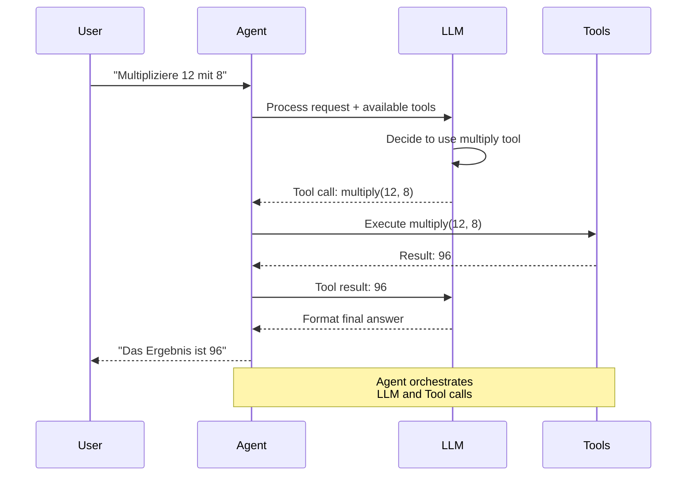
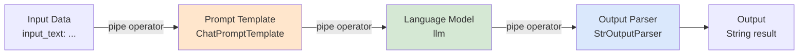
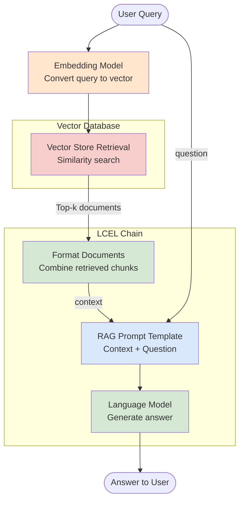

# LangChain Einsteiger
{: .no_toc }

> **Grundlagen und Best Practices für LangChain 1.0+**

---

# Inhaltsverzeichnis
{: .no_toc .text-delta }

1. TOC
{:toc}

---

## 1 Kurzüberblick: Warum LangChain?

Große Sprachmodelle (LLMs) wie GPT-4 sind beeindruckend – doch für den Einsatz in der Praxis stoßen sie schnell an Grenzen:

- **Wie verbindet man ein LLM mit eigenen Datenquellen?** (Dokumente, Datenbanken, APIs)
- **Wie wechselt man zwischen verschiedenen Anbietern?** (OpenAI, Anthropic, Google – ohne Code-Änderungen)
- **Wie bekommt man strukturierte Ausgaben?** (JSON, Objekte statt Freitext)
- **Wie erweitert man die Fähigkeiten eines LLMs?** (Rechnen, Websuche, Dateizugriff)
- **Wie baut man mehrstufige Workflows?** (Erst recherchieren, dann zusammenfassen, dann bewerten)

LangChain löst diese Herausforderungen durch:

- **Einheitliche Modell-Schnittstelle** – ein Interface für alle LLM-Anbieter
- **Tool-Integration** – LLMs können externe Funktionen aufrufen (Taschenrechner, APIs, Datenbanken)
- **Strukturierte Ausgaben** – garantiert valide Datenstrukturen statt unvorhersehbarem Text
- **Verkettung von Schritten** – komplexe Workflows als lesbare Pipelines
- **RAG-Unterstützung** – nahtlose Integration von Vektordatenbanken für Wissenserweiterung

**Kernprinzip:** LangChain abstrahiert die Komplexität der LLM-Integration und bietet wiederverwendbare Bausteine – vom einfachen Prompt bis zum autonomen Agenten mit Werkzeugen.

### LangChain Architektur-Überblick

```mermaid
graph TB
    subgraph "LangChain Core Components"
        MODELS[Models<br/>init_chat_model]
        PROMPTS[Prompts<br/>ChatPromptTemplate]
        TOOLS[Tools<br/>@tool decorator]
        CHAINS[Chains<br/>LCEL with pipe]
        AGENTS[Agents<br/>create_agent]
    end

    subgraph "External Systems"
        LLM_PROVIDERS[LLM Providers<br/>OpenAI, Anthropic, Google]
        VECTOR_DB[Vector Databases<br/>Chroma, FAISS]
        APIS[External APIs<br/>Web, Databases]
    end

    MODELS -->|unified interface| LLM_PROVIDERS
    PROMPTS --> CHAINS
    MODELS --> CHAINS
    TOOLS --> AGENTS
    MODELS --> AGENTS
    CHAINS -->|RAG| VECTOR_DB
    TOOLS -->|integrate| APIS

    style MODELS fill:#e1f5ff
    style PROMPTS fill:#e1f5ff
    style TOOLS fill:#e1f5ff
    style CHAINS fill:#e1f5ff
    style AGENTS fill:#e1f5ff
```

---

## 2 Prompts mit `ChatPromptTemplate`

Für wiederverwendbare und klar strukturierte Prompts steht in LangChain 1.0 das `ChatPromptTemplate` im Mittelpunkt. Es beschreibt, welche Nachrichtenrollen im Dialog verwendet werden und welche Platzhalter dynamisch zur Laufzeit gefüllt werden.

**Zentrale Aspekte:**

- Trennung von System-, Nutzer- und Assistenz‑Nachrichten
- Verwendung von Platzhaltern (z. B. `{frage}`, `{kontext}`) für dynamische Inhalte
- Wiederverwendbarkeit desselben Templates in unterschiedlichen Chains und Agenten
- Klare Trennung von Prompt‑Design und Geschäftslogik

### 2.1 Beispiel 1: Einfacher Frage-Antwort-Prompt

```python
from langchain_core.prompts import ChatPromptTemplate

# Template mit System- und Nutzerrolle
prompt = ChatPromptTemplate.from_messages([
    ("system", "Du bist ein hilfreicher KI-Assistent für Einsteiger in LangChain."),
    ("human", "Beantworte die folgende Frage in 3-5 Sätzen: {frage}")
])

# Später in einer Chain oder direkt:
rendered_messages = prompt.format_messages(frage="Was ist ein LLM?")
rendered_messages
```

### 2.2 Beispiel 2: Prompt für RAG (mit Kontext)

```python
rag_prompt = ChatPromptTemplate.from_messages([
    ("system", "Nutze ausschließlich den bereitgestellten Kontext, um die Frage zu beantworten."),
    ("human", "Kontext:\n{kontext}\n\nFrage: {frage}")
])

msgs = rag_prompt.format_messages(
    frage="Wie funktioniert das System?",
    kontext="Dies ist ein Auszug aus dem Handbuch ..."
)
```

---

## 3 Einheitliche Modell-Initialisierung: `init_chat_model()`

Eine stabile und provider-unabhängige Initialisierung des zugrunde liegenden Sprachmodells bildet die Basis jeder Agentenarchitektur. `init_chat_model()` stellt sicher, dass verschiedene Modellanbieter konsistent angesprochen werden können, ohne die restliche Codebasis anpassen zu müssen.

**Beispiel: Standard-Setup für den Kurs**

```python
from langchain.chat_models import init_chat_model

# ✨ Kurznotation "provider:model" (STANDARD seit Dezember 2025)
llm = init_chat_model("openai:gpt-4o-mini", temperature=0.0)

# Weitere Beispiele:
# llm = init_chat_model("anthropic:claude-3-sonnet", temperature=0.3)
# llm = init_chat_model("groq:llama-3.1-70b", temperature=0.7)
# llm = init_chat_model("google:gemini-pro", temperature=0.5)

# Testaufruf
response = llm.invoke("Nenne drei typische Einsatzgebiete von KI-Agenten.")
print(response.content)
```

---

## 4 Strukturierte Ausgaben: `with_structured_output()`

Viele Anwendungen benötigen klar definierte Datenstrukturen – etwa bei der Extraktion von Feldern, Bewertungen oder Metadaten. Mit `with_structured_output()` lassen sich Modellantworten direkt an Pydantic-Modelle koppeln und zuverlässig validieren.

**Beispiel: Einfache Entity-Extraktion in ein Pydantic-Modell**

```python
from pydantic import BaseModel, Field

class SupportTicket(BaseModel):
    kundennummer: str = Field(description="Eindeutige Kundennummer")
    kategorie: str = Field(description="z.B. 'Rechnung', 'Technik', 'Vertrag'")
    dringlichkeit: int = Field(description="Dringlichkeit von 1 (niedrig) bis 5 (hoch)")

structured_llm = llm.with_structured_output(SupportTicket)

text = "Kundennummer 4711 meldet ein dringendes technisches Problem. Bitte sofort lösen!"
result = structured_llm.invoke(
    "Extrahiere Kundennummer, Kategorie und Dringlichkeit aus folgendem Text: " + text
)

# result ist direkt ein SupportTicket-Objekt
print(result)
print(result.kategorie, result.dringlichkeit)
```

Hinweis: Dieses Feature setzt voraus, dass der verwendete Modell‑Provider native strukturierte Ausgaben unterstützt (z. B. OpenAI). Bei reinen Text‑Modellen ohne API‑Unterstützung steht diese Funktion nicht vollständig zur Verfügung.

---

## 5 Werkzeuge definieren: `@tool`

Tools erweitern die Fähigkeiten eines Agenten erheblich, da sie Funktionen abdecken, die ein Modell selbst nicht ausführen kann – etwa Berechnungen, Datenabrufe, lokale Analysen oder Abfragen externer Systeme. Der `@tool`‑Decorator ermöglicht eine klare, typensichere und gut dokumentierte Definition solcher Werkzeuge.

### 5.1 Beispiel: Ein einfaches Rechentool

```python
from langchain_core.tools import tool

@tool
def multiply(a: int, b: int) -> int:
    """Multipliziert zwei ganze Zahlen a und b."""
    return a * b

# Direkter Test des Tools (ohne Agent)
print(multiply.invoke({"a": 6, "b": 7}))
```

### 5.2 Beispiel: Tool mit Fehlerbehandlung und Docstring

```python
@tool
def safe_divide(a: float, b: float) -> str:
    """Teilt a durch b und gibt eine verständliche Textantwort zurück."""
    if b == 0:
        return "Division durch 0 ist nicht erlaubt."
    return f"Ergebnis: {a / b:.2f}"

print(safe_divide.invoke({"a": 10, "b": 2}))
print(safe_divide.invoke({"a": 10, "b": 0}))
```


### 5.3 Tool Extras für Provider-spezifische Features (NEU v1.2.0)

Tools unterstützen jetzt `extras` für provider-native Konfigurationen – eine der wichtigsten Neuerungen in LangChain v1.2.0:

```python
from langchain_core.tools import tool

# ✨ NEU in v1.2.0: Provider-spezifische Tool-Parameter
@tool(extras={
    "anthropic": {
        "cache_control": {"type": "ephemeral"},  # Anthropic Prompt Caching
        "disable_parallel_tool_use": False
    },
    "openai": {
        "strict": True  # OpenAI Strict Mode (garantierte Schema-Konformität)
    }
})
def search_database(query: str, limit: int = 10) -> str:
    """Durchsucht die Datenbank nach relevanten Informationen.

    Args:
        query: Suchanfrage
        limit: Maximale Anzahl Ergebnisse
    """
    return f"Gefunden: {limit} Ergebnisse für '{query}'"

# Tool mit Anthropic programmatic tool calling
@tool(extras={
    "anthropic": {
        "type": "computer_20241022",  # Anthropic Computer Use
        "display_width_px": 1024,
        "display_height_px": 768
    }
})
def take_screenshot() -> str:
    """Erstellt einen Screenshot des Bildschirms."""
    return "screenshot.png"
```

**Vorteile:**
- ✅ **Provider-native Features** nutzen (Caching, Strict Mode, Computer Use)
- ✅ **Built-in Client-Side Tools** für Anthropic, OpenAI
- ✅ **Optimierte Performance** durch provider-spezifische Optimierungen
- ✅ **Backwards-compatible**: Tools ohne `extras` funktionieren weiterhin

**Use Cases:**
- Anthropic Prompt Caching für häufig verwendete Tools
- OpenAI Strict Mode für garantierte Schema-Konformität
- Anthropic Computer Use für Browser-Automation


---

## 6 Agenten erstellen: `create_agent()`

Mit `create_agent()` werden Modell, Tools, Systemprompt und optional Middleware zu einer Einheit verbunden. Agenten basieren auf einer klaren Struktur, die intern auf der LangGraph-State-Machine aufsetzt.

**Beispiel: Kleinstmöglicher Tool-Agent**

```python
from langchain.agents import create_agent

## 1. LLM (aus Abschnitt 1.2)
# llm = init_chat_model(...)

## 2. Tools (aus Abschnitt 1.4)
tools = [multiply, safe_divide]

## 3. Agent erzeugen
agent = create_agent(
    model=llm,
    tools=tools,
    system_prompt=(
        "Du bist ein Taschenrechner-Agent. "
        "Beantworte nur Rechenfragen und verwende immer die bereitgestellten Tools."
    ),
    debug=False,  # in Colab besser meist False lassen
)

## 4. Aufruf
messages = [
    {"role": "user", "content": "Multipliziere 12 mit 8."},
]

result = agent.invoke({"messages": messages})
result
```

Hier liefert `create_agent()` bereits ein kompiliertes LangGraph‑Objekt (CompiledStateGraph). Dadurch kann derselbe Agent später in komplexere Workflows eingebettet werden.

### 6.2 Strict Schema für Agent-Responses (NEU v1.2.0)

Agents unterstützen jetzt `response_format` für strikte Validierung von Agent-Outputs:

```python
from langchain.agents import create_agent
from pydantic import BaseModel, Field

# Definiere strukturiertes Response-Schema
class AgentResponse(BaseModel):
    """Strukturierte Agent-Antwort mit Reasoning."""
    reasoning: str = Field(description="Denkprozess des Agents")
    action: str = Field(description="Geplante Aktion")
    tool_to_use: str | None = Field(description="Zu verwendendes Tool (optional)")
    confidence: float = Field(description="Konfidenz 0-1", ge=0, le=1)

# ✨ NEU in v1.2.0: response_format für garantierte Schema-Konformität
agent = create_agent(
    model=llm,
    tools=[search_tool, calculator_tool],
    system_prompt="You are a helpful research assistant",
    response_format=AgentResponse,  # Strikte Validierung!
    provider_strategy="strict"  # Nutzt OpenAI Structured Output (wenn verfügbar)
)

# Agent-Response ist garantiert schema-konform
response = agent.invoke({
    "messages": [{"role": "user", "content": "Recherchiere die Bevölkerung von Berlin"}]
})

# Typsicherer Zugriff auf strukturierte Felder
print(response.reasoning)  # str
print(response.confidence)  # float (0-1)
```

**Vorteile:**
- ✅ **Garantierte Schema-Konformität** für Agent-Outputs (keine JSON-Parsing-Fehler)
- ✅ **Type-Safety** mit Pydantic-Validierung
- ✅ **Bessere Fehlerbehandlung** durch strukturierte Responses
- ✅ **Strikte Provider-Integration** (OpenAI Structured Output, Anthropic Tool Use)
- ✅ **Predictable Agent-Behavior** für Production-Systeme

**Use Cases:**
- Production-Agents mit garantierten Output-Formaten
- Multi-Step-Reasoning mit strukturierten Zwischenschritten
- Agent-Monitoring mit standardisierten Response-Metriken
- Integration in typsichere Workflows


### Agent-Tool-Interaktion



---

## 7 Moderne Kettensyntax: LCEL `|`

LangChain Expression Language (LCEL) ersetzt frühere Chain‑Implementierungen. Über den Pipe‑Operator `|` werden Verarbeitungsschritte logisch miteinander verbunden.

### LCEL Pipeline-Visualisierung



### 7.1 Beispiel: Einfache LCEL-Chain für Textumformung

```python
from langchain_core.output_parsers import StrOutputParser

rewrite_prompt = ChatPromptTemplate.from_template(
    "Formuliere den folgenden Text freundlicher um:\n\n{input_text}"
)

rewrite_chain = rewrite_prompt | llm | StrOutputParser()

text = "Das ist schlecht dokumentiert und unverständlich."
output = rewrite_chain.invoke({"input_text": text})
print(output)
```

### 7.2 Beispiel: LCEL-Chain mit zusätzlicher Eingabe (Pass-Through)

```python
from langchain_core.runnables import RunnablePassthrough

qa_prompt = ChatPromptTemplate.from_template(
    "Kontext:\n{context}\n\nFrage: {question}"
)

qa_chain = (
    {
        "context": RunnablePassthrough(),  # hier könnte auch ein Retriever stehen
        "question": RunnablePassthrough(),
    }
    | qa_prompt
    | llm
    | StrOutputParser()
)

answer = qa_chain.invoke({
    "context": "LangChain bietet Tools, Agents und RAG-Bausteine.",
    "question": "Wofür nutzt man LangChain?",
})
print(answer)
```

---

## 8 Middleware zur Agentensteuerung

Middleware ergänzt Agenten um wichtige Kontrollmechanismen, etwa Sicherheitsprüfungen oder automatische Kontextverdichtung.

**Beispiel: Ein Agent mit Human-in-the-Loop für sensible Tools**

```python
from langchain.agents.middleware import HumanInTheLoopMiddleware

sensitive_tools = [safe_divide]  # hier exemplarisch

middleware = [
    HumanInTheLoopMiddleware(
        tool_names=[t.name for t in sensitive_tools]
    )
]

secure_agent = create_agent(
    model=llm,
    tools=sensitive_tools,
    system_prompt=(
        "Du bist ein vorsichtiger Assistent. "
        "Bei allen sicherheitsrelevanten Aktionen muss der Mensch zustimmen."
    ),
    middleware=middleware,
)
```

In Notebooks kann hier didaktisch gezeigt werden, wie der Agent vor einer heiklen Tool‑Ausführung explizit um Bestätigung fragt.

---

## 9 Einheitliche Content-Blöcke für multimodale Eingaben

Da moderne Modelle verschiedene Datentypen verarbeiten, benötigen Agenten ein einheitliches Format für Eingaben. LangChain 1.0 definiert Content‑Blöcke, die Text, Bilder, Audio oder andere Inhalte abbilden.

**Beispiel: Einfacher Vision-Call mit Text + Bild**

```python
from langchain_core.messages import HumanMessage

image_bytes_b64 = "data:image/png;base64,..."  # Platzhalter

vision_message = HumanMessage(
    content=[
        {"type": "text", "text": "Was ist auf diesem Bild zu sehen?"},
        {"type": "image", "url": image_bytes_b64, "mime_type": "image/png"},
    ]
)

vision_response = llm.invoke([vision_message])

# content_blocks können provider-agnostisch ausgewertet werden
for block in vision_response.content_blocks:
    if block["type"] == "text":
        print("Antwort:", block["text"])
```

Dieses Muster kann später in multimodalen RAG‑Notebooks wiederverwendet werden.

---

## 10 Chunking‑Best Practices

Damit RAG‑Systeme sinnvoll arbeiten, müssen Dokumente in geeignete Textstücke („Chunks“) zerlegt werden. In LangChain hat sich der `RecursiveCharacterTextSplitter` etabliert.

**Beispiel: Text in sinnvolle Chunks schneiden**

```python
from langchain_text_splitters import RecursiveCharacterTextSplitter

text = """Längerer Dokumententext ... (z.B. Handbuch, Richtlinie, Artikel)"""

splitter = RecursiveCharacterTextSplitter(
    chunk_size=800,
    chunk_overlap=200,
)

chunks = splitter.split_text(text)
print(len(chunks))
print(chunks[0][:200])
```

Im Kurs lässt sich hier gut mit unterschiedlichen Chunk‑Größen und Overlaps experimentieren, um deren Einfluss auf Retrieval und Antwortqualität zu zeigen.

---

## 11 Embeddings: Grundlagen für semantische Suche

Embeddings repräsentieren Texte als Vektoren und bilden die Basis für semantische Suche und RAG. Häufig kommen OpenAI‑Embeddings in Kombination mit Chroma zum Einsatz.

**Beispiel: Embeddings erzeugen und in Chroma speichern**

```python
from langchain_openai import OpenAIEmbeddings
from langchain_community.vectorstores import Chroma

## 1. Dokumente (z.B. Ergebnis des Chunkings)
documents = [
    "LangChain verbindet LLMs mit Tools.",
    "RAG kombiniert Retrieval mit Textgenerierung.",
    "Chroma ist ein leichter Vektorspeicher.",
]

## 2. Embedding-Modell
embedding_model = OpenAIEmbeddings(model="text-embedding-3-small")

## 3. Vektorspeicher erstellen
vectorstore = Chroma.from_texts(
    texts=documents,
    embedding=embedding_model,
    collection_name="demo_rag",
)

## 4. Ähnlichkeitssuche
query = "Was ist RAG?"
results = vectorstore.similarity_search(query, k=2)

for i, doc in enumerate(results, start=1):
    print(f"Treffer {i}: {doc.page_content}")
```

---

## 12 Standard‑Pattern für RAG mit LangChain

Retrieval‑Augmented Generation (RAG) ist eines der wichtigsten Einsatzszenarien für LangChain. Typischerweise werden Vektorspeicher, Retriever und eine LCEL‑Pipeline kombiniert.

### RAG-Workflow Visualisierung



**Beispiel: Minimaler RAG-Workflow mit LCEL**

```python
from langchain_core.output_parsers import StrOutputParser

## 1. Retriever aus bestehendem Chroma-Store
doc_retriever = vectorstore.as_retriever(search_kwargs={"k": 3})

## 2. Hilfsfunktion zur Formatierung der Dokumente

def format_docs(docs):
    return "\n\n".join(d.page_content for d in docs)

## 3. Prompt für RAG
rag_prompt = ChatPromptTemplate.from_template(
    """Du bist ein hilfreicher Assistent.
Nutze NUR den folgenden Kontext, um die Frage zu beantworten.
Wenn die Antwort im Kontext nicht steht, sage ehrlich, dass keine Information vorliegt.

Kontext:
{context}

Frage: {question}
"""
)

## 4. LCEL-Chain
rag_chain = (
    {
        "context": doc_retriever | format_docs,
        "question": RunnablePassthrough(),
    }
    | rag_prompt
    | llm
    | StrOutputParser()
)

## 5. Aufruf
frage = "Wozu wird Chroma verwendet?"
antwort = rag_chain.invoke(frage)
print(antwort)
```

Dieses Pattern bildet die Grundlage für Wissens‑Chatbots, Dokumenten‑Assistenten oder interne Suchsysteme im Kurs und kann schrittweise um Evaluierung, Feedback‑Schleifen oder LangGraph‑Workflows erweitert werden.

---

**Version:** 1.0  
**Stand:** November 2025  
**Kurs:** KI-Agenten. Verstehen. Anwenden. Gestalten.


