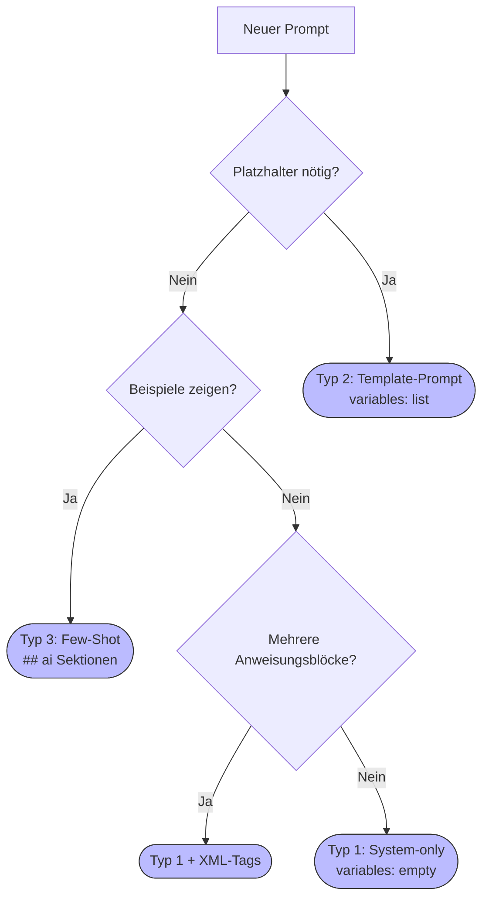

# Prompt-Templates — Einsteiger-Guide
{: .no_toc }

> **Eigene Prompts erstellen, strukturieren und wiederverwenden.**     
> YAML-Frontmatter, XML-Tags und `load_prompt()` Schritt für Schritt erklärt.

---

# Inhaltsverzeichnis
{: .no_toc .text-delta }

1. TOC
{:toc}

---

## 1 Was ist eine Prompt-Datei?

Prompts müssen  nicht direkt im Code/Notebook als String hardcodiert werden, sondern können auch als separate Markdown-Dateien im Ordner `05_prompt/` gespeichert.

**Vorteile:**
- Prompts sind **wiederverwendbar** — einmal schreiben, überall nutzen
- Prompts sind **vom Code getrennt** — Prompt-Anpassungen ohne Notebook-Änderung
- Prompts sind **versionierbar** — Änderungen sind nachvollziehbar
- `load_prompt()` lädt sie direkt als `ChatPromptTemplate` oder String

**Aufbau einer Prompt-Datei — drei Teile:**

```markdown
---
name: mein_prompt
description: Kurzbeschreibung was dieser Prompt tut
variables: []
---

## system

Du bist ein hilfreicher Assistent...
```

① **YAML-Header** (Metadaten zwischen den `---`-Trennern)
② **Sektion-Bezeichner** (`## system`, `## human`, `## ai`)
③ **Prompt-Text** (der eigentliche Inhalt)

---

## 2 Was ist YAML?

**YAML** (*YAML Ain't Markup Language*) ist ein Format für strukturierte Daten —
lesbar wie normaler Text, aber von Programmen direkt verarbeitbar.

### YAML-Syntax kurz erklärt

```yaml
---                           # Beginn des YAML-Blocks (Pflicht)
schluessel: wert              # Schlüssel-Wert-Paar
liste: [eintrag1, eintrag2]   # Liste in eckigen Klammern
leere_liste: []               # Leere Liste
---                           # Ende des YAML-Blocks (Pflicht)
```

**Wichtige Regeln:**
- Immer `Schlüssel: Wert` mit Doppelpunkt **und** Leerzeichen dahinter
- Kein Tabulator — Einrückung nur mit Leerzeichen
- Strings mit Sonderzeichen in Anführungszeichen: `"wert mit: Doppelpunkt"`

### YAML-Header in Prompt-Dateien

```yaml
---
name: rag_prompt                    # Interner Name (snake_case)
description: RAG-Prompt für Q&A     # Kurzbeschreibung (1 Satz)
variables: [context, question]      # Platzhalter im Prompt-Text
---
```

| Feld | Pflicht | Bedeutung |
|---|---|---|
| `name` | ✅ | Eindeutiger Bezeichner |
| `description` | ✅ | Kurzbeschreibung (1 Satz) |
| `variables` | ✅ | Liste der `{variable}`-Platzhalter, oder `[]` wenn keine |

> [!WARNING] Häufiger Fehler     
> `variables: []` vergessen, obwohl keine Platzhalter vorhanden.
> `load_prompt()` erwartet dieses Feld immer — auch wenn die Liste leer ist.

---

## 3 Was sind XML-Tags?

**XML** (*Extensible Markup Language*) ist eine Auszeichnungssprache, die Inhalte durch
Tags mit öffnender und schließender Klammer strukturiert:

```xml
<TagName>
Inhalt des Tags
</TagName>
```

### Warum XML-Tags in Prompts?

Sprachmodelle wurden während des Trainings mit enormen Mengen an XML- und HTML-Dokumenten
trainiert. Dadurch erkennen sie Tags als **semantische Abgrenzungen** — ähnlich wie ein
Mensch Überschriften und Absätze wahrnimmt.

**Vergleich: ohne vs. mit XML-Tags**

Ohne Tags (fließender Text — bei langen Prompts unübersichtlich):
```
Du bist Recherche-Spezialist. Recherchiere Fakten zum Thema. Nutze maximal 3 Suchen.
Gib mindestens 3 Kernfakten aus. Antworte auf Deutsch in maximal 200 Wörtern.
```

Mit Tags (klar gegliedert — Modell "sieht" die Struktur):
```xml
Du bist Recherche-Spezialist.

<Task>
Recherchiere Fakten zum angefragten Thema.
</Task>

<Instructions>
1. Beginne mit einem breiten Suchbegriff
2. Verfeinere bei Bedarf
3. Antworte auf Deutsch
</Instructions>

<Hard Limits>
Maximal 3 Suchen. Stoppe sobald die Anfrage beantwortbar ist.
</Hard Limits>

<Output>
Mindestens 3 Kernfakten als Stichpunkte. Maximal 200 Wörter.
</Output>
```

**Vorteile strukturierter Prompts:**
- Das Modell trennt klar zwischen Aufgabe, Anleitung und Grenzen
- Einzelne Abschnitte lassen sich ändern ohne den Rest zu berühren
- Reproduzierbarere und konsistentere Ergebnisse
- Weniger Halluzinationen bei komplexen Anweisungen

### Wann XML-Tags verwenden?

| Prompt-Komplexität | Empfehlung |
|---|---|
| Wenige Zeilen, eine klare Aufgabe | Kein XML nötig |
| Mehrere unterschiedliche Anweisungsblöcke | XML-Tags empfohlen |
| Agenten-Prompts mit Hard Limits | XML-Tags Pflicht |
| Few-Shot-Prompts mit Beispielen | `<Example>` Tags empfohlen |

### Häufig verwendete Tags im Kurs

| Tag | Typischer Inhalt |
|---|---|
| `<Task>` | Was das Modell / der Agent tun soll |
| `<Instructions>` | Schritt-für-Schritt-Anweisungen |
| `<Hard Limits>` | Absolute Grenzen (Tool-Budget, Abbruchbedingungen) |
| `<Output>` | Gewünschtes Format und Struktur der Antwort |
| `<Context>` | Hintergrundinformationen |
| `<Example>` | Few-Shot-Beispiele |

---

## 4 Die drei Prompt-Typen

### Typ 1 — System-only Prompt

**Wann:** Nur Rolle und Verhalten definieren — keine Laufzeit-Variablen.
Wird direkt als `system`-Nachricht übergeben, zum Beispiel an `create_agent()`.

```markdown
---
name: assistent_prompt
description: Einfacher Assistenten-Prompt ohne Variablen
variables: []
---

## system

Du bist ein hilfreicher Assistent.
Antworte immer präzise und auf Deutsch.
```

```python
from genai_lib.utilities import load_prompt

system_text = load_prompt("05_prompt/assistent_prompt.md", mode="S")
# Rückgabe: String → direkt an create_agent() übergeben
```

---

### Typ 2 — Template-Prompt (mit Variablen)

**Wann:** Der Prompt enthält Platzhalter `{variable}`, die zur Laufzeit befüllt werden.
Typisch für RAG-Chains, SQL-Generierung, strukturierte Aufgaben.

```markdown
---
name: rag_prompt
description: RAG-Prompt mit Kontext und Frage als Variablen
variables: [context, question]
---

## system

Du beantwortest Fragen ausschließlich auf Basis des bereitgestellten Kontexts.
Wenn die Antwort nicht im Kontext enthalten ist, sage das klar.

## human

Kontext:
{context}

Frage: {question}
```

```python
from genai_lib.utilities import load_prompt

prompt = load_prompt("05_prompt/rag_prompt.md", mode="T")
# Rückgabe: ChatPromptTemplate → in LCEL-Chain einsetzbar
chain = prompt | llm | StrOutputParser()
antwort = chain.invoke({"context": "...", "question": "Was ist RAG?"})
```

---

### Typ 3 — Few-Shot Prompt

**Wann:** Das Modell soll an Beispielen lernen, wie die Antwort aussehen soll.
One-Shot = 1 Beispiel, Few-Shot = 2–5 Beispiele.

```markdown
---
name: klassifikation_few_shot
description: Few-Shot Klassifikation von Support-Tickets
variables: [ticket]
---

## system

Klassifiziere Support-Tickets in: TECHNIK, ABRECHNUNG oder SONSTIGES.
Antworte nur mit dem Kategorie-Namen.

## human

Ticket: "Meine Rechnung ist doppelt abgebucht worden."

## ai

ABRECHNUNG

## human

Ticket: "Die App stürzt beim Start ab."

## ai

TECHNIK

## human

Ticket: {ticket}
```

> Die `## ai`-Sektionen simulieren Modell-Antworten als Vorab-Beispiele.
> Das Modell lernt das gewünschte Ausgabeformat aus den Beispielpaaren.

```python
prompt = load_prompt("05_prompt/klassifikation_few_shot.md", mode="T")
chain = prompt | llm | StrOutputParser()
ergebnis = chain.invoke({"ticket": "Ich kann mich nicht einloggen."})
```

---

### Hintergrund: Sektionen und LangChain MessageTypes

Die Datei-Sektionen sind eine vereinfachte Schreibweise — unter der Haube erzeugt
`load_prompt()` daraus typisierte LangChain-Message-Objekte:

| Datei-Sektion | LangChain MessageType | Verwendung |
|---|---|---|
| `## system` | `SystemMessage` | Rolle, Verhalten, Anweisungen an das Modell |
| `## human` | `HumanMessage` | Benutzereingabe oder Template mit `{variablen}` |
| `## ai` | `AIMessage` | Modell-Antwort — nur bei Few-Shot-Prompts |
| — | `ToolMessage` | Tool-Ergebnis zur Laufzeit — kein Template, von LangChain automatisch eingefügt |

> `ToolMessage` und `ChatMessage` (freie Rollen) erscheinen **nicht** in Prompt-Dateien.
> Sie entstehen zur Laufzeit und werden von LangChain intern verwaltet.

---

## 5 load_prompt() — Übersicht

```python
from genai_lib.utilities import load_prompt

# mode="S" → String (für system_prompt in create_agent)
system_text = load_prompt("05_prompt/mein_prompt.md", mode="S")

# mode="T" → ChatPromptTemplate (für LCEL-Chains)
prompt_template = load_prompt("05_prompt/mein_prompt.md", mode="T")
```

| `mode` | Rückgabetyp          | Wann verwenden                                 |
| ------ | -------------------- | ---------------------------------------------- |
| `"S"`  | `str`                | `create_agent(..., system_prompt=system_text)` |
| `"T"`  | `ChatPromptTemplate` | `chain = prompt                                |

---

## 6 Schritt-für-Schritt: Eigenen Prompt erstellen

**1.** Datei in `05_prompt/` anlegen: `mXX_rolle_prompt.md`

**2.** YAML-Header schreiben:
```yaml
---
name: mXX_mein_prompt
description: Was dieser Prompt macht (1 Satz)
variables: []
---
```

**3.** `## system`-Block schreiben — Rolle, Aufgabe, Verhalten

**4.** Bei Variablen: `variables: [var1]` im Header + `{var1}` im `## human`-Block

**5.** Bei Komplexität (mehrere Blöcke): XML-Tags verwenden

**6.** Testen im Notebook:
```python
from genai_lib.utilities import load_prompt
p = load_prompt("05_prompt/mXX_mein_prompt.md", mode="S")
print(p)  # Prompt-Text prüfen
```

---

## 7 Entscheidungshilfe



---

## 8 Häufige Fehler

| Fehler | Ursache | Lösung |
|---|---|---|
| `KeyError: 'variables'` | `variables:` im Header fehlt | Immer angeben, auch leer: `variables: []` |
| Platzhalter wird nicht ersetzt | `{variable}` im `## system` statt `## human` | Template-Variablen in `## human` |
| `## system` fehlt | Sektion vergessen | `## system` ist Pflicht |
| XML-Tags erscheinen in der Ausgabe | Tags im falschen Block | XML-Tags gehören in `## system` |
| `load_prompt()` gibt leeren String zurück | Sektion-Bezeichner falsch geschrieben | Genau `## system` (zwei `#`, Leerzeichen) |

---

## 9 Referenz-Dateien im Kurs

| Typ | Datei | Modul |
|---|---|---|
| System-only | `m10_tool_agent_system.md` | M10 Agenten |
| Template mit Variablen | `m08_rag_prompt.md` | M08 RAG |
| Template mit Variablen | `m09_sql_prompt.md` | M09 SQL-RAG |
| Few-Shot (One-Shot) | `m04_empfehlung_one_shot.md` | M04 Prompting |
| Few-Shot (Zero-Shot) | `m04_empfehlung_zero_shot.md` | M04 Prompting |

> Alle Prompt-Dateien liegen in `GenAI/05_prompt/`.

---

**Version:** 1.0    
**Stand:** März 2026    
**Kurs:** Generative KI. Verstehen. Anwenden. Gestalten.    
