# Mermaid Best Practices & Troubleshooting

> **Zweck:** Wissensdatenbank für fehlerfreie Mermaid-Diagramme in Markdown-Dokumenten
> **Zielgruppe:** Alle, die Mermaid-Diagramme in Notebooks und Dokumentation erstellen
> **Projekte:** Agenten, GenAI, und alle weiteren Kurs-Projekte

> **Projektregel 2026:** In Markdown-Dateien bevorzugt Frontmatter mit `config:` verwenden. In bestehenden Notebooks mit `mermaid()` bleibt `%%{init}%%` der pragmatische Standard.

---

## 📚 Inhaltsverzeichnis

1. [Häufige Fehler und Lösungen](#häufige-fehler-und-lösungen)
2. [Neuerungen 2025/26](#-neuerungen-202526)
3. [Best Practices pro Diagramm-Typ](#best-practices-pro-diagramm-typ)
4. [Validierung und Testing](#validierung-und-testing)
5. [Code-Beispiele](#code-beispiele)
6. [Checkliste für neue Diagramme](#checkliste-für-neue-diagramme)

---

## 🚫 Häufige Fehler und Lösungen

### 1. Reservierte Keywords als Node-IDs

**Problem:** Mermaid reserviert bestimmte Keywords, die nicht als Node-IDs verwendet werden dürfen.

❌ **Fehlerhaft:**
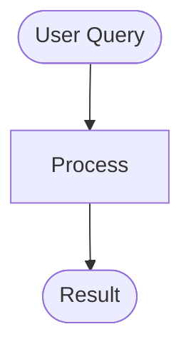

✅ **Korrekt:**


**Reservierte Keywords:**
- `END` → verwende `FINISH`, `RESULT`, `OUTPUT`, `DONE`
- `START` → verwende `BEGIN`, `INIT` (oder verwende START nur in runden Klammern `START([...])`)
- `IF` → verwende `CHECK`, `COND`, `DECISION`
- `ELSE` → verwende `OTHERWISE`, `ALTERNATIVE`

**Gefunden in:**
- `docs/frameworks/Einsteiger_LangChain.md` (Zeile 580)
- `docs/frameworks/Einsteiger_Agent_Builder.md` (5 Vorkommen)

---

### 2. Sonderzeichen in Node-Labels

**Problem:** Sonderzeichen wie `|`, `&`, `"`, `{`, `}` können Parsing-Fehler verursachen.

❌ **Fehlerhaft:**
```mermaid
flowchart LR
    INPUT[Input Data<br/>{\"input_text\": \"...\"}]
    CHAINS[Chains<br/>LCEL with |]
```

✅ **Korrekt:**
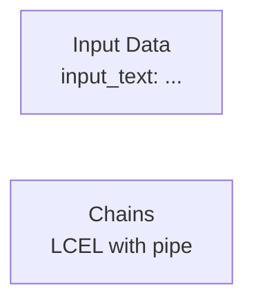

**Problematische Zeichen:**
- `|` (Pipe) → verwende "pipe" als Text oder "Pipe-Operator"
- `&` (Ampersand) → verwende "und" oder "and"
- `"` (Quotes) → verwende `'` (einfache Quotes) oder vermeide sie
- `{`, `}` (Geschweifte Klammern) → vermeide oder escape mit `\{`, `\}`
- `:` (Doppelpunkt) → kann in Labels OK sein, aber nicht in Titeln/Sections

**Gefunden in:**
- `docs/frameworks/Einsteiger_LangChain.md` (Zeile 382, 53)
- `docs/frameworks/Einsteiger_Agent_Builder.md` (Journey-Diagramm)

---

### 3. Doppelpunkte in Titeln und Section-Namen

**Problem:** Doppelpunkte können in Journey-Diagrammen zu Parsing-Fehlern führen.

❌ **Fehlerhaft:**
```mermaid
journey
    title Lernpfad: No-Code zu Production
    section Phase 1: Basics
      Task 1: 5: User
```

✅ **Korrekt:**
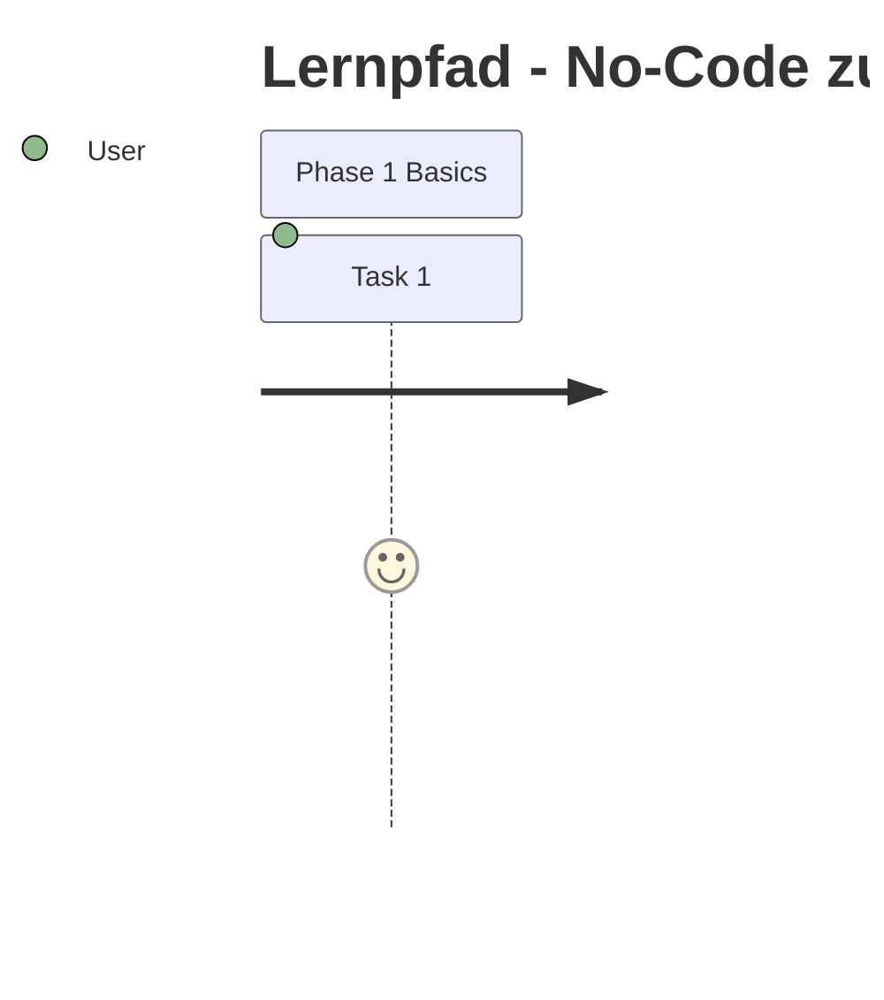

**Regel:**
- Titel: Verwende `-` statt `:`
- Sections: Keine Doppelpunkte im Namen
- Tasks: Doppelpunkte sind OK (Teil der Syntax `task: score: actor`)

**Gefunden in:**
- `docs/frameworks/Einsteiger_Agent_Builder.md` (Zeile 939-955)

---

### 4. Umlaute in Journey-Diagrammen

**Problem:** Umlaute können je nach Rendering-Engine problematisch sein.

❌ **Potenziell problematisch:**


✅ **Sicherer:**
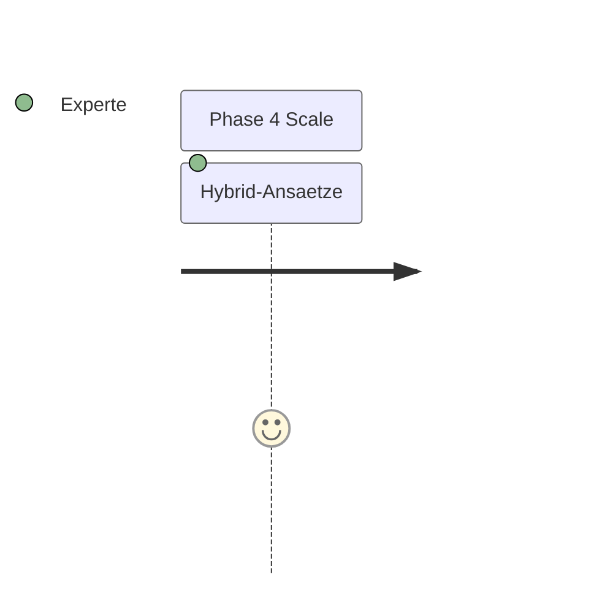

**Empfehlung:** In kritischen Kontexten (Titles, Sections) Umlaute durch ae, oe, ue ersetzen.

---

## 🆕 Neuerungen 2025/26

### 1. Frontmatter statt Direktiven bevorzugen

**Offizieller Stand:** Direktiven sind seit `v10.5.0` als deprecated markiert. Für neue Markdown-Dokumente sollte die Konfiguration über Frontmatter mit `config` erfolgen.

✅ **Bevorzugt für portable Markdown-Dokumente:**
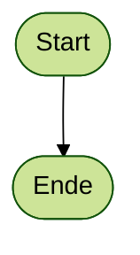

⚠️ **Pragmatisch weiterhin OK in bestehenden Notebooks:**
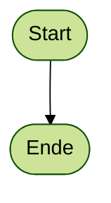

**Best Practice:**
- In Markdown-Dateien und Doku: Frontmatter bevorzugen
- In bestehenden Notebooks mit `mermaid()`-Helper: `%%{init}%%` bleibt praktikabel
- Pro Projekt einen Standard festlegen und nicht beide Ansätze beliebig mischen

### 2. `flowchart.htmlLabels` nicht mehr neu verwenden

**Neu relevant ab `v11.13.0`:**
- `flowchart.htmlLabels` ist deprecated
- Verwende stattdessen root-level `htmlLabels`

❌ **Alt:**
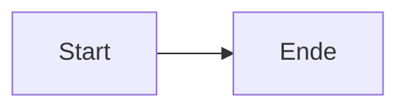

✅ **Neu:**


**Best Practice:**
- Neue Beispiele und Templates nicht mehr mit `flowchart.htmlLabels` schreiben
- Bestehende Diagramme bei Gelegenheit auf root-level `htmlLabels` umstellen

### 3. Renderer-Version explizit mitdenken

Mermaid selbst ist 2025/26 deutlich weiter als viele Render-Umgebungen in GitHub Pages, VS Code, Jupyter-Plugins oder Static-Site-Generatoren.

**Best Practice:**
- Neue Syntax nur verwenden, wenn der Ziel-Renderer sie wirklich unterstützt
- Nicht nur im Mermaid Live Editor testen, sondern immer auch im Zielsystem
- Bei `*-beta`-Diagrammtypen konservativ bleiben und Fallbacks bereit halten

**Besonders versionsabhängig:**
- `architecture-beta` ab `v11.1.0+`
- neue Flowchart-Shapes sowie `icon`/`image`-Shapes ab `v11.3.0+`
- `radar-beta` ab `v11.6.0+`
- neue Sequence-Participant-Typen ab `v11.11.0+`
- `venn-beta`, Half-Arrows und zentrale Verbindungen in Sequence-Diagrammen ab `v11.13.0`
- `ishikawa-beta` ab `v11.13.0`

### 4. Layout und Look bewusst setzen

Neuere Mermaid-Versionen unterstützen konfigurierbare Looks und Layouts deutlich besser.

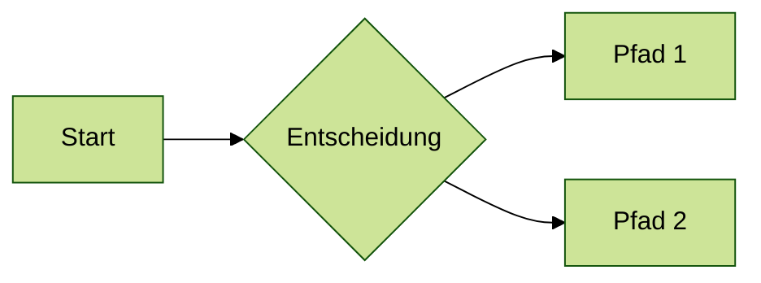

**Best Practice:**
- Für Standarddiagramme `dagre` als konservativen Default behalten
- `elk` nur nutzen, wenn die Integration ELK wirklich lädt und unterstützt
- Bei komplexen Diagrammen das Layout explizit setzen statt auf implizite Defaults zu hoffen

---

## 🎨 Farbschema (Theme)

**Regel: Jedes Diagramm beginnt mit der `%%{init}%%`-Direktive für einheitliches Farbschema.**

```python
diagram = '''
%%{init: {"theme":"forest"}}%%
flowchart TB
    START([Beginn]) --> FINISH([Ende])
'''

mermaid(diagram, width=650)
```

**Warum `forest`?**
- Einheitliches, ruhiges Grün-Farbschema in allen Projekten
- Bessere Lesbarkeit als der Default-Theme
- Konsistenz über alle Diagramm-Typen hinweg

**Gilt für alle Diagramm-Typen:**
```
%%{init: {"theme":"forest"}}%%
flowchart TB ...

%%{init: {"theme":"forest"}}%%
sequenceDiagram ...

%%{init: {"theme":"forest"}}%%
stateDiagram-v2 ...

%%{init: {"theme":"forest"}}%%
timeline ...
```

> ⚠️ **Ausnahme:** Diagramme mit detailliertem `%%{init: {'themeVariables': {...}}}%%`-Block (z.B. Timeline-Diagramme mit projektspezifischen Farben) können eigene `themeVariables` behalten — der `%%{init}%%`-Block ist dann bereits vorhanden.

> 📝 **Stand 2025/26:** Für portable Markdown-Dokumente ist Frontmatter (`---` mit `config:`) der modernere Weg. Für bestehende Notebooks in diesem Projekt bleibt `%%{init}%%` als Projektstandard weiterhin zulässig und praktisch.

---

## ✅ Best Practices pro Diagramm-Typ

### Flowchart / Graph

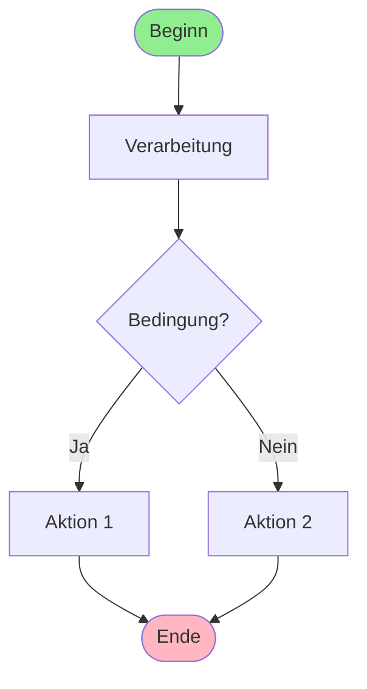

**Best Practices:**
- Verwende `FINISH` statt `END`
- Edge-Labels in Pipes: `-->|Label| NEXT`
- Klare Node-IDs: `PROCESS`, `CHECK`, `ACTION1`
- Styling am Ende: `style NODE fill:#color`

---

### Sequence Diagram

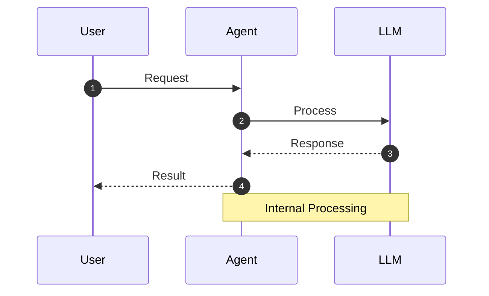

**Best Practices:**
- **`autonumber` ist PFLICHT** – immer als erste Zeile nach `sequenceDiagram` eintragen
- Definiere Participants explizit
- Verwende `-->>` für Rückmeldungen
- Notes für Erklärungen: `Note over A,B: Text`
- Keine Sonderzeichen in Participant-Namen
- Ab `v11.11.0+` können semantische Participant-Typen sinnvoll sein
- Wichtig: Nur `actor` ist ein eigenes Schlüsselwort; `boundary`, `control`, `entity`, `database`, `collections`, `queue` werden als `participant ...@{ "type": "..." }` geschrieben
- Neue Half-Arrows und zentrale Verbindungen nur verwenden, wenn der Ziel-Renderer auf aktuellem Mermaid-Stand ist

---

### State Diagram

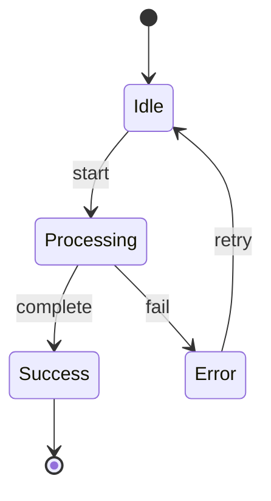

**Best Practices:**
- Verwende `stateDiagram-v2` (neuere Syntax)
- `[*]` für Start/End-States
- Klare Transition-Labels
- Keine reservierten Keywords als State-Namen

---

### Journey Diagram

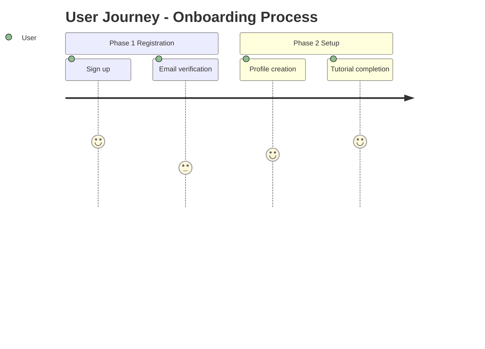

**Best Practices:**
- Titel ohne Doppelpunkt (verwende `-`)
- Sections ohne Doppelpunkt im Namen
- Task-Format: `Name: Score: Actor`
- Score: 1-5 (1 = schlecht, 5 = gut)
- Keine `&` in Task-Namen

---

### Mindmap

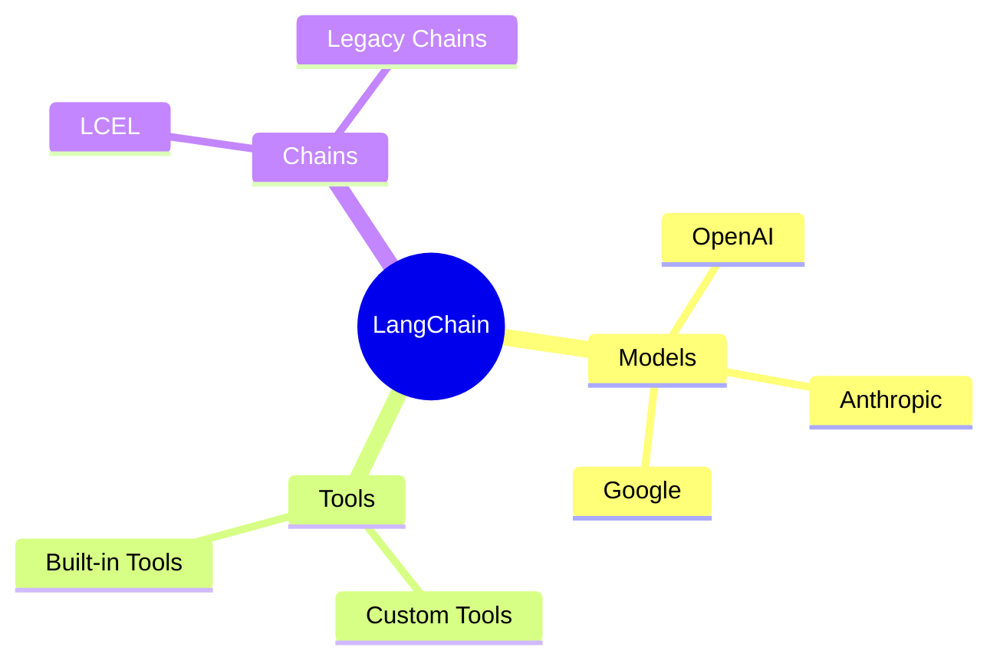

**Best Practices:**
- Root-Node mit doppelten Klammern: `((Text))`
- Indentation für Hierarchie (2 Spaces)
- Kurze, prägnante Labels
- Keine Sonderzeichen in Node-Namen

**2025/26 relevant:**
- Neuere Mermaid-Versionen unterstützen zusätzliche Layouts und bessere Kantenführung für Mindmaps
- `tidy-tree` ist besonders für hierarchische Mindmaps interessant
- In älteren Renderern konservativ bleiben, da Mindmap-Features je nach Integration später nachziehen

---

### Architecture Diagram

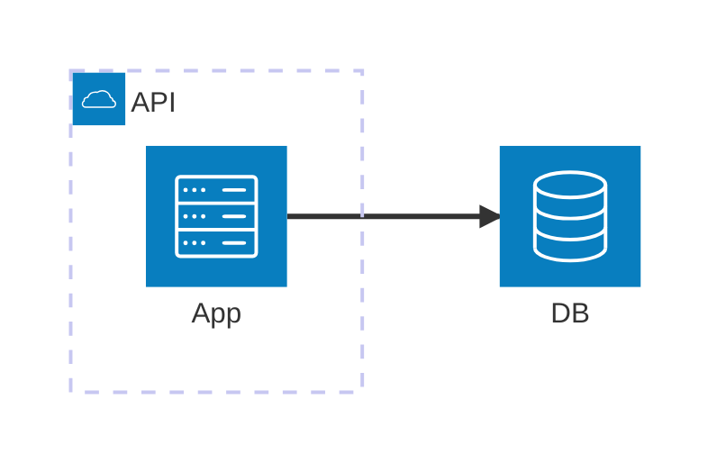

**Best Practices:**
- Nur verwenden, wenn der Ziel-Renderer mindestens `v11.1.0+` unterstützt
- Syntax beginnt mit `architecture-beta`
- IDs kurz und stabil halten; Gruppen und Services sauber benennen
- Icons sparsam und konsistent einsetzen
- Für Cloud-/Systemlandschaften oft besser als ein überladenes Flowchart

**2025/26 relevant:**
- Architekturdiagramme sind relativ neu und versionssensibel
- In neueren Mermaid-Versionen wurden die Möglichkeiten weiter ausgebaut, u.a. mit IDs
- Für maximale Kompatibilität notfalls ein Flowchart-Fallback bereithalten

---

### Treemap / Radar / Venn / Ishikawa

**Neue bzw. neuere Diagrammtypen, die 2025/26 relevant wurden:**
- `treemap-beta` für hierarchische Mengen oder Verteilungen
- `radar-beta` für Profilvergleiche über mehrere Achsen
- `venn-beta` für Mengenüberschneidungen
- `ishikawa-beta` als neue Beta-Funktion für Ursache-Wirkungs-Analysen

**Best Practice:**
- Diese Typen nur einsetzen, wenn sie in der konkreten Zielumgebung nachweislich rendern
- Für Kursunterlagen mit gemischten Toolchains nur dann verwenden, wenn ein Mehrwert gegenüber Flowchart/State/Journey klar ist
- Bei Unsicherheit konservativ bleiben und Standarddiagrammtypen bevorzugen
- `radar-beta` ist offiziell dokumentiert, kann aber lokal trotzdem an veralteten Renderern scheitern
- `venn-beta` und besonders `ishikawa-beta` vorsichtig behandeln; vor produktivem Einsatz immer mit dem echten Ziel-Renderer testen

---

## 🧪 Validierung und Testing

### 1. Online-Validierung

**Kroki.io:**
- URL: https://kroki.io/
- Unterstützt alle Mermaid-Diagramm-Typen
- Zeigt sofort Rendering-Fehler

**Mermaid Live Editor:**
- URL: https://mermaid.live/
- Offizielle Mermaid-Sandbox
- Zeigt Syntax-Fehler inline

### 2. VS Code Preview

```bash
# VS Code Extension installieren
# "Markdown Preview Mermaid Support"
# oder "Mermaid Preview"
```

**Vorteil:** Rendering direkt im Editor sehen

### 3. Python-Validierung (Jupyter)

```python
from genai_lib.utilities import mermaid

# Test-Diagramm
mermaid('''
flowchart TB
    START([Test]) --> FINISH([Done])
''')
```

**Vorteil:** Rendering-Test in Notebooks vor Deployment

### 4. GitHub Pages Jekyll

```bash
# Lokaler Test vor Deployment
cd docs
bundle exec jekyll serve

# Öffne http://localhost:4000
# Prüfe alle Seiten mit Mermaid-Diagrammen
```

---

## 📓 Standard-Zellstruktur in Notebooks

Jede Mermaid-Zelle in Jupyter-/Colab-Notebooks folgt dieser Struktur:

```python
#@markdown   <p><font size="4" color='green'>  flowchart</font> </br></p>

diagram = '''
%%{init: {"theme":"forest"}}%%
flowchart LR
    A[Start] --> B[Ende]
'''

mermaid(diagram, width=650)
```

> ❌ **`#@title` ohne Inhalt wird nicht verwendet** – leere `#@title`-Zeilen werden aus allen Notebooks entfernt. Nur `#@title Text { display-mode: "form" }` (mit Inhalt) ist zulässig, z. B. für Setup-Zellen.

**Erklärung der Bestandteile:**

| Element | Zweck |
|---------|-------|
| `#@markdown <p><font ...>DiagrammTyp</font></p>` | Visuelle Beschriftung der Zelle (grün, Größe 4) – zeigt den Diagramm-Typ |
| `diagram = '''...'''` | Benannte Variable statt Inline-String – leichter editierbar und wiederverwendbar |
| `mermaid(diagram, width=NNN)` | Aufruf mit expliziter Breite |

**Label-Text** im `#@markdown` entspricht dem Diagramm-Typ:

```python
#@markdown   <p><font size="4" color='green'>  sequenceDiagram</font> </br></p>
#@markdown   <p><font size="4" color='green'>  flowchart</font> </br></p>
#@markdown   <p><font size="4" color='green'>  stateDiagram</font> </br></p>
```

**Empfohlene Breiten nach Diagramm-Typ:**

| Typ | `width` |
|-----|---------|
| `sequenceDiagram` | 650 |
| `flowchart LR` (breit) | 800–900 |
| `flowchart TB` (hoch) | 500–600 |
| `stateDiagram` | 500 |
| `mindmap` | 700 |

> ⚠️ **Regel:** Immer `diagram = '''...'''` (benannte Variable), nie den Diagramm-Code direkt in `mermaid('''...''')` schreiben – das erschwert spätere Bearbeitung.

---

## 📋 Code-Beispiele

### Workflow-Visualisierung (häufigster Use Case)

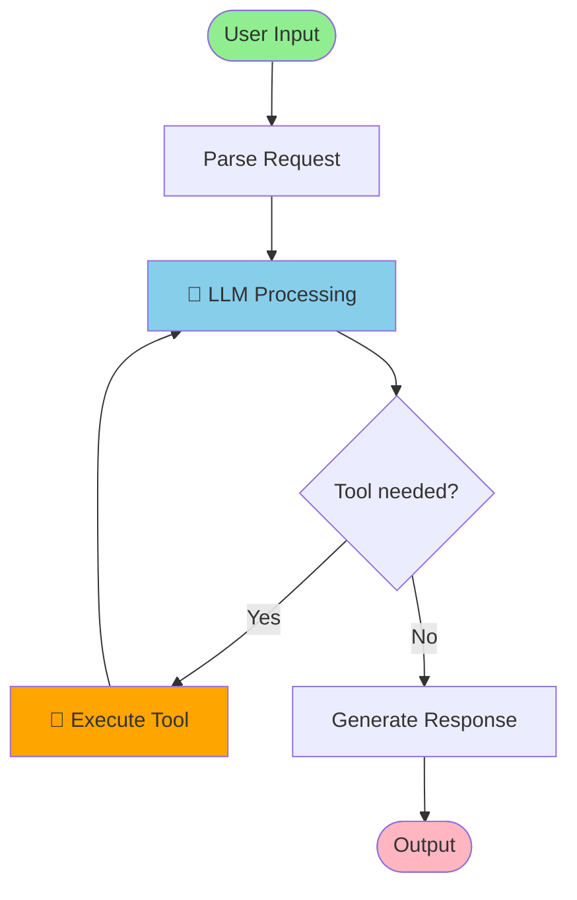

### Multi-Agent-System

```mermaid
graph TB
    subgraph "Supervisor Layer"
        SUPERVISOR[Supervisor Agent]
    end

    subgraph "Worker Layer"
        RESEARCH[Research Agent]
        CODE[Code Agent]
        REVIEW[Review Agent]
    end

    SUPERVISOR -->|Delegate| RESEARCH
    SUPERVISOR -->|Delegate| CODE
    SUPERVISOR -->|Delegate| REVIEW

    RESEARCH -->|Report| SUPERVISOR
    CODE -->|Report| SUPERVISOR
    REVIEW -->|Report| SUPERVISOR

    style SUPERVISOR fill:#FFD700
    style RESEARCH fill:#87CEEB
    style CODE fill:#90EE90
    style REVIEW fill:#FFA500
```

### RAG-Pipeline

```mermaid
flowchart LR
    QUERY([User Query]) --> EMBED[Embedding Model]
    EMBED --> RETRIEVE[Vector Search]

    RETRIEVE --> FORMAT[Format Context]
    FORMAT --> PROMPT[RAG Prompt]

    QUERY --> PROMPT
    PROMPT --> LLM[Language Model]
    LLM --> FINISH([Answer])

    subgraph "Vector Database"
        RETRIEVE
    end

    style EMBED fill:#ffe6cc
    style RETRIEVE fill:#f8cecc
    style LLM fill:#d5e8d4
```

---

## ✅ Checkliste für neue Diagramme

Beim Erstellen eines neuen Mermaid-Diagramms:

### Vor dem Schreiben
- [ ] Diagramm-Typ gewählt (flowchart, sequence, state, journey, mindmap, etc.)
- [ ] Zweck klar definiert (Was soll visualisiert werden?)
- [ ] Best Practices für Diagramm-Typ gelesen

### Beim Schreiben
- [ ] **`%%{init: {"theme":"forest"}}%%`** als erste Zeile im Diagramm-Code gesetzt
- [ ] Alternativ bei portabler Markdown-Doku Frontmatter mit `config.theme: forest` verwendet
- [ ] Keine reservierten Keywords als Node-IDs (`END`, `START`, `IF`, `ELSE`)
- [ ] Keine problematischen Sonderzeichen (`|`, `&`, `"`, `{`, `}`)
- [ ] Titel ohne Doppelpunkt (verwende `-` statt `:`)
- [ ] Sections ohne Doppelpunkt (bei Journey-Diagrammen)
- [ ] Klare, aussagekräftige Node-IDs (z.B. `PROCESS`, nicht `P1`)
- [ ] Styling konsistent (Farben, Formen)
- [ ] Bei `sequenceDiagram`: `autonumber` als erste Zeile gesetzt
- [ ] Bei neuer Syntax geprüft, welche Mermaid-Version der Ziel-Renderer unterstützt
- [ ] Kein neues `flowchart.htmlLabels` mehr verwendet; stattdessen root-level `htmlLabels`

### Nach dem Schreiben
- [ ] Syntax-Check mit Mermaid Live Editor (https://mermaid.live/)
- [ ] Rendering-Test in VS Code Preview (falls verfügbar)
- [ ] Test in Jupyter Notebook mit `mermaid()` (falls verfügbar)
- [ ] Bei GitHub Pages: Lokaler Jekyll-Test (`bundle exec jekyll serve`)

### Bei Fehlern
- [ ] Error-Message analysieren
- [ ] Diese Dokumentation konsultieren
- [ ] Häufige Fehler durchgehen (siehe oben)
- [ ] Online-Validierung mit Kroki.io

---

## 📊 Statistik häufiger Fehler (aus diesem Projekt)

Basierend auf der Analyse von `Agenten/` und `GenAI/` Projekten (Januar 2026):

| Fehlertyp | Anzahl Vorkommen | Betroffene Dateien |
|-----------|------------------|-------------------|
| `END` Keyword | 5 | Einsteiger_Agent_Builder.md |
| Pipe-Symbol `\|` | 2 | Einsteiger_LangChain.md |
| `&` in Labels | 2 | Einsteiger_Agent_Builder.md |
| Doppelpunkt in Title | 1 | Einsteiger_Agent_Builder.md |
| Escaped Quotes | 1 | Einsteiger_LangChain.md |

**Fazit:** Die meisten Fehler sind vermeidbar durch Kenntnis der reservierten Keywords und Sonderzeichen-Regeln.

---

## 🔗 Referenzen

### Offizielle Dokumentation
- [Mermaid Documentation](https://mermaid.js.org/)
- [Mermaid Syntax Reference](https://mermaid.js.org/intro/syntax-reference.html)
- [Mermaid Configuration](https://mermaid.js.org/config/configuration.html)
- [Mermaid Directives](https://mermaid.js.org/config/directives.html)
- [Flowchart Guide](https://mermaid.js.org/syntax/flowchart.html)
- [Sequence Diagram Guide](https://mermaid.js.org/syntax/sequenceDiagram.html)
- [Architecture Diagram Guide](https://mermaid.js.org/syntax/architecture.html)
- [Radar Diagram Guide](https://mermaid.js.org/syntax/radar)
- [Treemap Diagram Guide](https://mermaid.js.org/syntax/treemap.html)
- [Venn Diagram Guide](https://mermaid.js.org/syntax/venn)
- [Tidy-tree Layout](https://mermaid.js.org/config/tidy-tree.html)
- [Mermaid Releases](https://github.com/mermaid-js/mermaid/releases)

### Tools
- [Mermaid Live Editor](https://mermaid.live/) - Online-Editor mit Echtzeit-Preview
- [Kroki.io](https://kroki.io/) - Multi-Diagramm-Renderer (inkl. Mermaid)
- [VS Code Extension](https://marketplace.visualstudio.com/items?itemName=bierner.markdown-mermaid) - Markdown Preview Mermaid Support

### Projekt-spezifisch
- `Agenten/Mermaid_Diagramme.ipynb` - Referenz-Notebook mit allen Diagramm-Typen
- `GenAI/Mermaid_Diagramme.ipynb` - Identisches Referenz-Notebook
- `_docs/Notebook_Template_Guide.md` - Sektion 6: Mermaid in Notebooks

---

## 📝 Version History

| Version | Datum | Änderungen |
|---------|-------|------------|
| **1.6** | 2026-03-25 | Recherche zu Mermaid 2025/26 eingearbeitet: Frontmatter statt Direktiven, root-level `htmlLabels`, neue Version-/Renderer-Hinweise, neue Diagrammtypen und neue Sequence-/Architecture-Features ergänzt |
| **1.5** | 2026-03-21 | `%%{init: {"theme":"forest"}}%%` als Pflicht für alle Diagramme dokumentiert (neuer Abschnitt Farbschema, Checkliste, Zellstruktur-Beispiel) |
| **1.4** | 2026-03-20 | Race-Condition-Fix in `mermaid()`: CDN-Modul wird in `window._mermaidLib` gecacht – verhindert Fehler bei „Run All" |
| **1.3** | 2026-03-20 | Bare `#@title` aus Zellstruktur entfernt – nur `#@title Text {...}` mit Inhalt zulässig |
| **1.2** | 2026-03-03 | `autonumber` als Pflicht für `sequenceDiagram` dokumentiert (Beispiel, Best Practices, Checkliste) |
| **1.1** | 2026-03-02 | Standard-Zellstruktur für Notebooks ergänzt (`#@title`, `#@markdown`, benannte Variable, `width`) |
| **1.0** | 2026-01-02 | Initiale Version basierend auf Fehleranalyse in Agenten/GenAI Projekten |

---

**Maintainer:** GenAI & Agenten Projekt Team
**Letzte Aktualisierung:** 2026-03-25
**Lizenz:** MIT License

---

## 💡 Tipp

**Bei jedem neuen Mermaid-Diagramm:**
1. Starte mit Mermaid Live Editor (https://mermaid.live/)
2. Teste die Syntax dort zuerst
3. Kopiere den validierten Code in dein Dokument
4. Verwende diese Checkliste als Referenz

**Bei Rendering-Fehlern:**
1. Prüfe reservierte Keywords
2. Prüfe Sonderzeichen
3. Validiere mit Kroki.io
4. Konsultiere diese Dokumentation

→ **Spart Zeit und Frustration!** ⏱️
