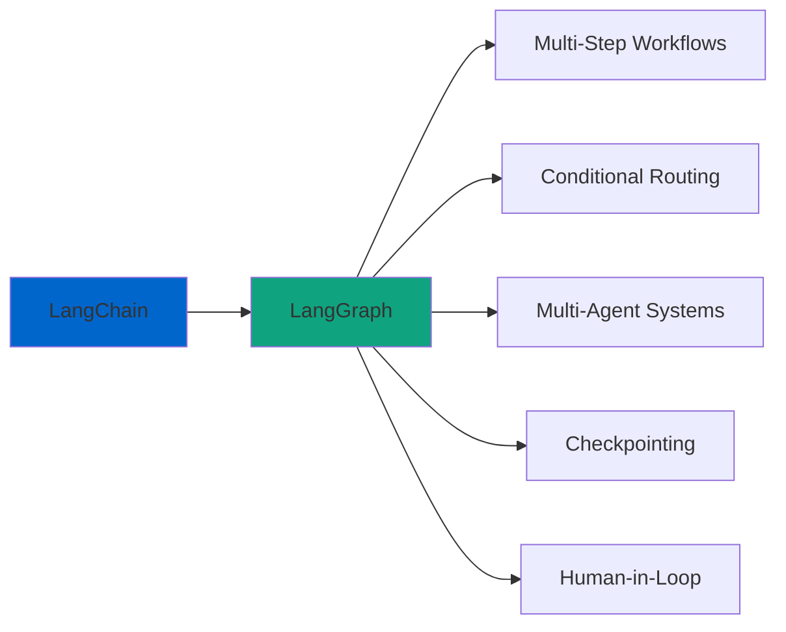
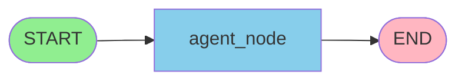
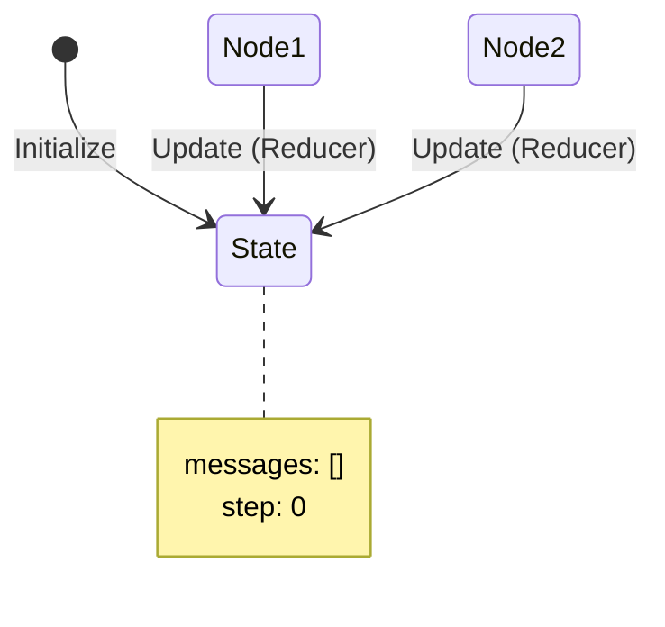
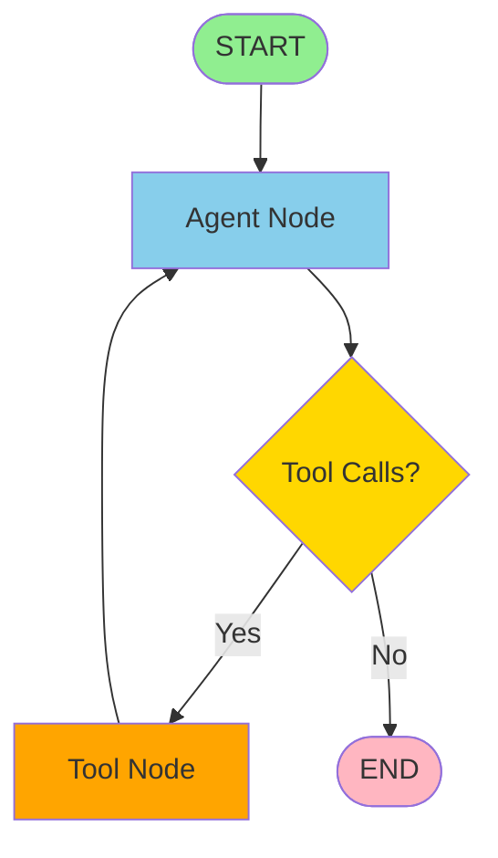
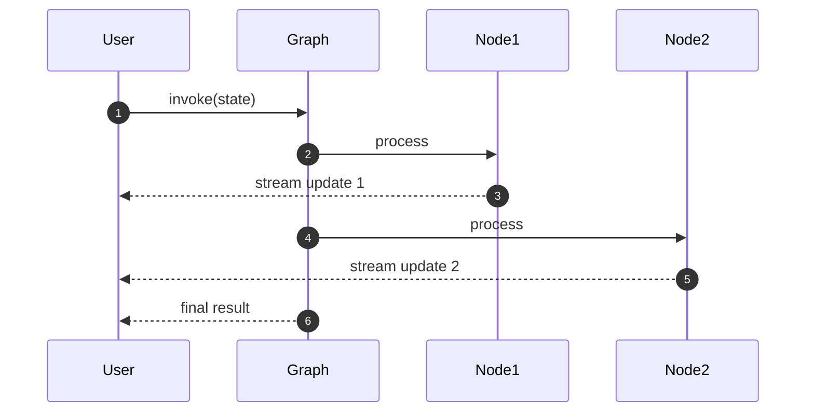
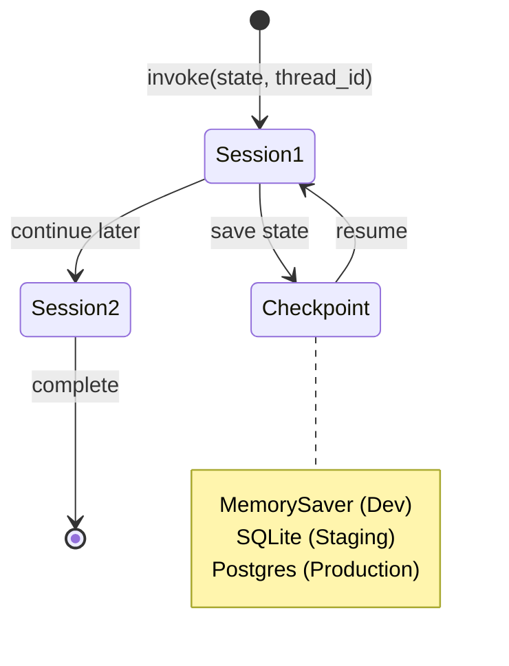
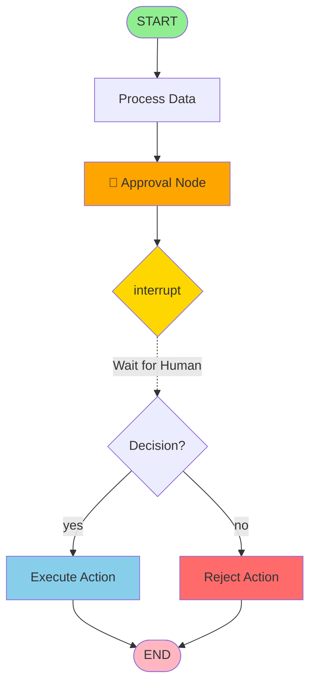
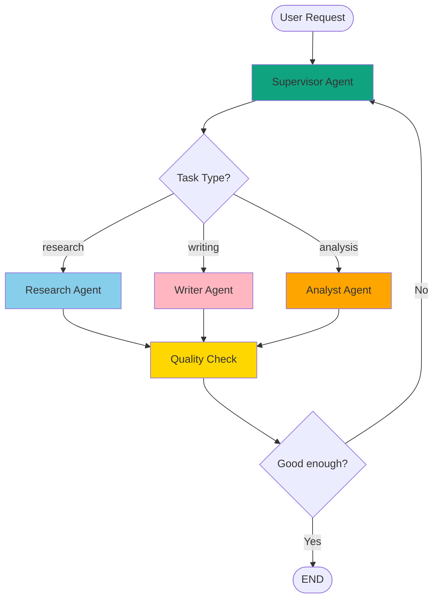

# LangGraph Einsteiger
{: .no_toc }

> **Multi-Agent-Systeme und Workflows mit LangGraph**

---

# Inhaltsverzeichnis
{: .no_toc .text-delta }

1. TOC
{:toc}

---

## Kurzüberblick: Warum LangGraph?

LangChain bietet Modelle, Tools und einfache Agenten. LangGraph baut darauf auf und ermöglicht:
- **Abläufe in mehreren Schritten**
- **Bedingte Entscheidungswege**
- **Mehrere Agenten (Rollen)**
- **Sitzungen, die wieder aufgenommen werden können**
- **Human-in-the-Loop**

Ein Workflow besteht aus:
- **State:** zentrale Daten
- **Nodes:** Bearbeitungsschritte
- **Edges:** Ablaufsteuerung

Ein minimales Diagramm:



Damit ist sofort klar: LangGraph strukturiert Workflows, anstatt alles in ein einzelnes LLM-Prompt zu packen.

---

## Das kleinstmögliche funktionierende Beispiel

Der schnellste Weg zum Verständnis ist ein Mini-Workflow.

### State definieren

```python
from typing import TypedDict, Annotated
from langgraph.graph.message import add_messages

class ChatState(TypedDict):
    messages: Annotated[list, add_messages]
    step: int
```

### Ein einzelner Node

```python
from langchain.chat_models import init_chat_model
llm = init_chat_model("openai:gpt-4o-mini", temperature=0.0)

def agent_node(state: ChatState) -> ChatState:
    response = llm.invoke(state["messages"])
    return {"messages": [response], "step": state["step"] + 1}
```

### Graph bauen

```python
from langgraph.graph import StateGraph, START, END

g = StateGraph(ChatState)
g.add_node("agent", agent_node)
g.add_edge(START, "agent")
g.add_edge("agent", END)

graph = g.compile()
```

### Graphen visualisieren

```python
from IPython.display import Image

display(Image(graph.get_graph().draw_mermaid_png()))
```

Dieser minimale Workflow sieht so aus:



### Ausführen

```python
from langchain_core.messages import HumanMessage

initial_state = {"messages": [HumanMessage(content="Was ist LangGraph?")], "step": 0}
result = graph.invoke(initial_state)
result
```

**Ergebnis:** Ein vollständiger Einsteiger-Workflow, bevor irgendein abstraktes Konzept erklärt wurde.

---

## Die Grundidee: Workflows als State Machine

Nachdem Einsteiger ein funktionsfähiges Beispiel gesehen haben, kann das Konzept erklärt werden:

- Ein Workflow besteht aus klar definierten Schritten (*Nodes*).
- Der Zustand wird in einem *State* gespeichert.
- *Edges* bestimmen die Reihenfolge.
- *Reducer* wie `add_messages` fügen Informationen intelligent zusammen.



Kurz: **Nodes sind Funktionen – Edges sind der Ablauf.**

---

## State sauber definieren (vertieft)

```python
class ChatState(TypedDict):
    messages: Annotated[list, add_messages]
    step: int
    # erweiterbar: approved: bool, analysis: str
```

Prinzipien:
- Nur speichern, was später benötigt wird.
- Typisierung unterstützt Verständnis und Fehlersuche.
- Reducer sorgen dafür, dass Listen (z. B. Nachrichten) korrekt gemergt werden.

---

## Nodes: Bausteine des Workflows

Nodes sollen klein, fokussiert und deterministisch sein.

**Ein Node ist immer eine Python-Funktion** — was sich unterscheidet, ist der Inhalt:

| Node-Typ | Inhalt der Funktion | Typischer Einsatz |
|---|---|---|
| **LLM-Node** | direkter LLM-Aufruf | Antworten, Zusammenfassungen |
| **Tool-Node** | Tool-Ausführung | Suche, Berechnungen, APIs |
| **Agent-Node** | vollständiger Agent (`create_react_agent`) | komplexe Teilaufgaben mit eigenem Tool-Loop |

### Typ 1: LLM-Node

```python
def summarize_node(state: ChatState) -> ChatState:
    text = "\n".join([m.content for m in state["messages"]])
    summary = llm.invoke([{"role": "user", "content": f"Fasse zusammen: {text}"}])
    return {"messages": [summary]}
```

### Typ 2: Tool-Node

```python
from langchain_core.tools import tool

@tool
def suche(query: str) -> str:
    """Führt eine Websuche durch."""
    return f"Ergebnis für: {query}"

def tool_node(state: ChatState) -> ChatState:
    result = suche.invoke({"query": state["messages"][-1].content})
    return {"messages": [{"role": "tool", "content": result}]}
```

### Typ 3: Agent-Node

Ein Node kann intern einen vollständigen Agenten ausführen — inklusive eigenem Tool-Loop:

```python
from langgraph.prebuilt import create_react_agent

research_agent = create_react_agent(
    model=llm,
    tools=[suche],
    prompt="Du bist ein Research-Spezialist. Recherchiere gründlich.",
)

def research_node(state: ChatState) -> ChatState:
    result = research_agent.invoke({"messages": state["messages"]})
    return {"messages": result["messages"]}
```

> **Hinweis:** Der Agent-Node ist das Muster hinter Supervisor-Architekturen (M20, M21). Der Supervisor ruft `research_node`, `writer_node` etc. auf — jeder Node kapselt intern einen vollständigen Agenten.

---

## Edges & Conditional Routing

Nun erst wird Routing eingeführt – **nachdem Einsteiger Nodes und State kennen**.

### Lineare Edges

```python
g.add_edge(START, "agent")
g.add_edge("agent", END)
```

### Bedingtes Routing

```python
def tool_node(state: ChatState):
    result_message = ...  # echtes Tool
    return {"messages": [result_message]}

def routing_after_agent(state: ChatState) -> str:
    last_msg = state["messages"][-1]
    if getattr(last_msg, "tool_calls", None):
        return "tools"
    return END
```

```python
g.add_node("tools", tool_node)
g.add_conditional_edges(
    "agent",
    routing_after_agent,
    {"tools": "tools", END: END},
)
g.add_edge("tools", "agent")
```

**Visualisierung des Tool-Loops:**



### Typische Muster
- Schlüsselwort-Trigger
- Unsicherheitsanalyse
- Routing nach Tool-Feedback
- Wiederholschleifen (Retry)

---

## Streaming: Schritte sichtbar machen

Streaming ist ein wichtiges Werkzeug für das Verständnis.

```python
for event in graph.stream(initial_state, {"configurable": {"thread_id": "demo"}}, stream_mode="updates"):
    print(event)
```

**Streaming-Prozess:**



Streaming-Varianten:
- `updates`: nur Änderungen
- `values`: vollständiger State
- `messages`: nur neue Nachrichten

Empfehlung für Einsteiger: **updates**.

---

## Checkpointing & Sessions

Checkpointing ermöglicht:
- längerfristige Workflows
- Resume nach Unterbrechung
- stabile Interaktion

```python
from langgraph.checkpoint.memory import MemorySaver
checkpointer = MemorySaver()
graph = g.compile(checkpointer=checkpointer)

config = {"configurable": {"thread_id": "session-01"}}
result1 = graph.invoke(initial_state, config)
```

Später:

```python
result2 = graph.invoke(None, config)  # setzt fort
```

**Session-Management mit Checkpointing:**



Hinweise:
- Optimale Einstiegsvariante: MemorySaver.
- Für produktive Systeme: SQLite/Postgres.
- Graphänderungen können Sessions invalidieren.

---

## Human-in-the-Loop (Approval & Formulare)

Human-in-the-Loop ist ein wichtiges Konzept – aber erst an dieser Stelle sinnvoll.

### Interrupt

```python
from langgraph.types import interrupt

def approval_node(state: ChatState) -> ChatState:
    decision = interrupt("Aktion ausführen? yes/no")
    return {"approved": decision == "yes"}
```

### Weiterführen

```python
from langgraph.types import Command
result = graph.invoke(Command(resume="yes"), config)
```

**Human-in-the-Loop Pattern:**



Einsatzmöglichkeiten:
- sicherheitsrelevante Aktionen
- wichtige Entscheidungen
- mehrschrittige Formulareingaben

---

## Multi-Agent-Workflows (Fortgeschritten)

Dieses Thema wurde bewusst ans Ende verschoben.

### Agenten definieren

```python
from langchain.agents import create_agent

research_agent = create_agent(model=llm, tools=[...], system_prompt="Research")
writer_agent   = create_agent(model=llm, tools=[...], system_prompt="Writer")
```

### Supervisor

```python
from langgraph.types import Command

def supervisor(state: ChatState) -> Command:
    task = state.get("task_type", "research")
    return Command(goto=f"{task}_agent")
```

**Multi-Agent Supervisor Pattern:**



Mögliche Erweiterungen:
- iterative Qualitätsprüfungen
- mehrere Worker mit Prioritäten
- automatische oder manuelle Rollenwechsel

## Abgrenzung zu verwandten Dokumenten

| Dokument | Inhalt |
|---|---|
| [Einsteiger LangChain](https://ralf-42.github.io/GenAI/frameworks/einsteiger-langchain.html) | Voraussetzung: Modell-Init, Tools und Agenten mit LangChain |
| [Einsteiger ChromaDB](https://ralf-42.github.io/GenAI/frameworks/einsteiger-chromadb.html) | Vektordatenbank als RAG-Tool in LangGraph-Workflows |
| [State Management](https://ralf-42.github.io/GenAI/concepts/state-management.html) | Konzeptionelle Tiefe hinter TypedDict und Reducer-Funktionen |
| [Human-in-the-Loop](https://ralf-42.github.io/GenAI/concepts/human-in-the-loop.html) | Konzept hinter Interrupt & Resume aus Abschnitt 9 |


---

**Version:** 2.0<br>
**Stand:** Januar 2026<br>
**Kurs:** Generative KI. Verstehen. Anwenden. Gestalten.


