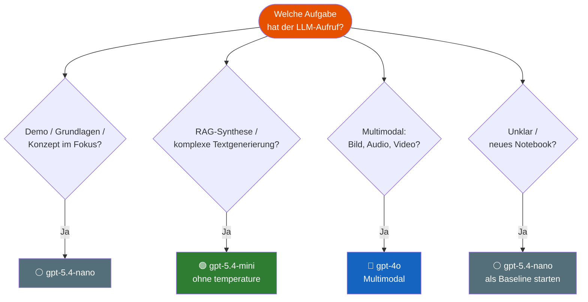

# Modell-Auswahl Guide
{: .no_toc }

> **Welches Modell für welche Aufgabe?**
> Praktische Designregeln und Modul-Mapping für den GenAI-Kurs.

---

# Inhaltsverzeichnis
{: .no_toc .text-delta }

1. TOC
{:toc}

---

## Modelle im Kurs

| Modell | Stärke | Typischer Einsatz im Kurs |
|---|---|---|
| `gpt-5.4-nano` | Günstig, schnell, GPT-5.x-Basis | Grundlagen, Demos, einfache Chains |
| `gpt-5.4-mini` | Coding, Inhalts-Generierung, konfigurierbare Reasoning-Tiefe | RAG-Synthese, komplexe Outputs, strukturierte Generierung |
| `gpt-4o` | Multimodal (Text + Bild + Audio) | Bildanalyse, multimodales RAG, Audio-Verarbeitung |

> [!TIP] Faustregel Modellwahl<br>
> Nicht das stärkste Modell wählen — das *passende* für die Aufgabe.
> Mit `gpt-5.4-nano` starten, nur bei echtem Bedarf upgraden.

---

## Designregeln

### Regel 1 — Grundlagen und Demos: `gpt-5.4-nano`

Alle Module, in denen das Konzept im Vordergrund steht (nicht die Ausgabequalität), verwenden `gpt-5.4-nano`.
Begründung: Günstigstes GPT-5.x-Modell — konsistent mit der gesamten Modell-Konfiguration, kein `temperature`.

```python
from langchain.chat_models import init_chat_model

llm = init_chat_model("openai:gpt-5.4-nano")
```

> [!NOTE] Keine temperature bei BASELINE<br>
> `temperature` ist bei der gesamten GPT-5.x-Serie outdated. Deterministische Ausgaben über präzise Prompts steuern.

### Regel 2 — RAG-Synthese und komplexe Inhalts-Generierung: `gpt-5.4-mini`

Wenn die Ausgabequalität entscheidend ist — z. B. bei der Synthese von Dokumenten-Chunks oder der Generierung strukturierter Berichte — kommt `gpt-5.4-mini` zum Einsatz.

```python
# Korrekt: ohne temperature (API-Kompatibilität)
rag_llm = init_chat_model("openai:gpt-5.4-mini")
```

> [!DANGER] temperature-Parameter führt zu API-Fehler<br>
> `temperature` führt bei `gpt-5.4-mini` zu einem API-Fehler, außer wenn `reasoning_effort="none"` gesetzt ist.
> **Empfehlung:** `temperature` weglassen und `reasoning_effort` zur Qualitätssteuerung nutzen.

### Regel 3 — Multimodale Aufgaben: `gpt-4o`

Aufgaben mit Bildanalyse, Audio oder kombiniertem Text-Bild-Input erfordern ein multimodales Modell.

```python
multimodal_llm = init_chat_model("openai:gpt-4o")
```

### Regel 4 — Einfache Extraktion und Klassifikation: immer `gpt-5.4-nano`

Strukturierte Datenextraktion aus klar definierten Texten, einfache Klassifikation, Formatierung:
Premium-Modelle bringen hier keinen Mehrwert, kosten aber deutlich mehr.

### Regel 5 — Baseline immer zuerst

Jedes neue Notebook startet mit `gpt-5.4-nano` als Baseline.
Upgrade auf `gpt-5.4-mini` oder `gpt-4o` nur, wenn die Baseline-Qualität nachweislich unzureichend ist.

---

## Entscheidungsbaum



---

## Modul-Mapping

### Standard: `gpt-5.4-nano` (Fokus Konzept, nicht Modellqualität)

| Module | Thema | Begründung |
|---|---|---|
| M00–M05 | Kurs-Intro, GenAI-Grundlagen, Modellsteuerung, Transformer | Konzept > Qualität |
| M06 | OutputParser, strukturierte Ausgaben | Struktur lernen, nicht Qualität optimieren |
| M07 | Chat-Memory-Patterns | Architektur-Verständnis im Vordergrund |
| M10 | Agenten mit LangChain | Erste Agenten-Schritte — Konzept zählt |
| M11 | Middleware | Sicherheits- und Steuerungskonzepte |
| M12 | MCP LangChain Agent | Tool-Integration verstehen |
| M13 | Gradio Web-UI | Interface-Design > Modellqualität |
| M20 | OpenAI Agent Builder | No-Code-Plattform — Plattform gibt Modell vor |

### Upgrade auf `gpt-5.4-mini`: Qualität der Ausgabe entscheidend

| Module | Thema | Begründung |
|---|---|---|
| M08 | RAG mit LangChain | Synthese von Dokumenten-Chunks: Qualität zählt |
| M09 | SQL-RAG | Komplexe natürlichsprachliche SQL-Generierung |
| M17 | Multimodales RAG | Bild- + Textantworten: Synthese-Qualität wichtig |

### Upgrade auf `gpt-4o`: Multimodaler Input erforderlich

| Module | Thema | Begründung |
|---|---|---|
| M16 | Multimodal Bild | Bildanalyse und -beschreibung |
| M17 | Multimodales RAG | Bild- und Text-Retrieval kombiniert |
| M18 | Multimodal Audio | Audio-Transkription + LLM-Analyse |
| M19 | Multimodal Video | Frame-Analyse mit multimodalem Modell |

### Sonderfall: Lokale Modelle (M14)

| Modul | Thema | Modell |
|---|---|---|
| M14 | Lokale Open-Source-Modelle | Ollama (z. B. `llama3`, `mistral`) |

```python
# M14: Lokales Modell via Ollama
from langchain.chat_models import init_chat_model
local_llm = init_chat_model("ollama:llama3")
```

---

## Code-Muster

### Standard-Chain (`gpt-4o-mini`)

```python
from langchain.chat_models import init_chat_model
from langchain_core.prompts import ChatPromptTemplate
from langchain_core.output_parsers import StrOutputParser

llm = init_chat_model("openai:gpt-4o-mini", temperature=0.0)

chain = ChatPromptTemplate.from_template("{frage}") | llm | StrOutputParser()
antwort = chain.invoke({"frage": "Was ist RAG?"})
```

### RAG-Synthese (`gpt-5.4-mini`)

```python
# Retriever: Dokument-Chunks holen
# Generator: Chunks zu qualitativ hochwertiger Antwort synthetisieren
rag_llm = init_chat_model("openai:gpt-5.4-mini")

rag_chain = retriever | rag_llm | StrOutputParser()
```

### Multimodal — Bildanalyse (`gpt-4o`)

```python
from langchain.chat_models import init_chat_model
from langchain_core.messages import HumanMessage

multimodal_llm = init_chat_model("openai:gpt-4o")

message = HumanMessage(content=[
    {"type": "text",  "text": "Was zeigt dieses Bild?"},
    {"type": "image_url", "image_url": {"url": bild_url}},
])
antwort = multimodal_llm.invoke([message])
```

---

## Kosten-Orientierung

> Kursteilnehmer arbeiten mit einem begrenzten API-Budget.
> `gpt-4o-mini` ist die kosteneffiziente Standardwahl für alle Lernschritte.

| Setup | Relatives Kostenniveau | Empfehlung |
|---|---|---|
| Alles `gpt-4o-mini` | ⭐ (Baseline) | Standard für alle Konzept-Module |
| `gpt-5.4-mini` für RAG-Synthese | ⭐⭐⭐ | Nur für RAG-Module (M08, M09, M17) |
| `gpt-4o` für Multimodal | ⭐⭐ | Nur für Multimodal-Module (M16–M19) |

**Empfohlenes Vorgehen:**

1. Konzept mit `gpt-4o-mini` verstehen und ausprobieren
2. Upgrade nur bei nachgewiesenem Qualitätsbedarf
3. Optionale Vergleichszellen mit `# Optional: Upgrade-Modell` markieren

---

## Abgrenzung zu verwandten Dokumenten

| Dokument | Inhalt |
|---|---|
| [Modellauswahl (Konzept)](../../concepts/erweitert/m19-modellauswahl.html) | Theoretische Grundlagen: Modell-Landschaft, Benchmarks, Evaluierungskriterien |
| [LangChain Einsteiger](../einsteiger/einsteiger-langchain.html) | LangChain-Grundlagen: Chains, Tools, Agents |
| [ChromaDB Einsteiger](../einsteiger/einsteiger-chromadb.html) | Vektordatenbanken für RAG-Systeme |

---

**Version:**    1.0<br>
**Stand:**    März 2026<br>
**Kurs:** Generative KI. Verstehen. Anwenden. Gestalten.
